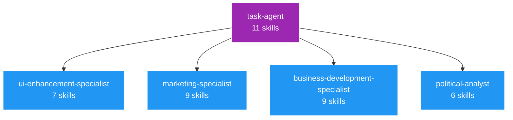
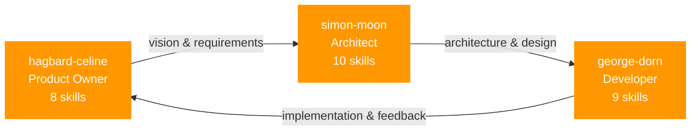
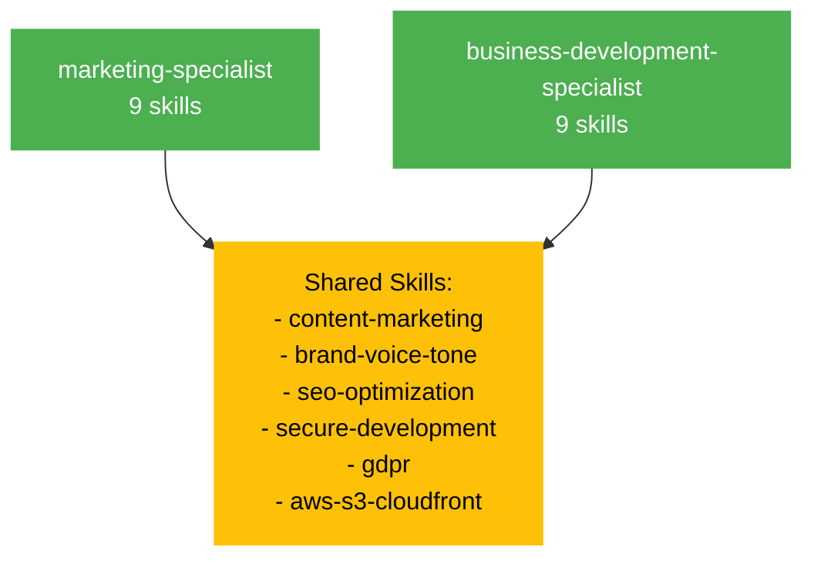
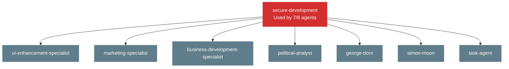

# Agent-Skills Matrix

**Last Updated**: 2026-02-06  
**Purpose**: Cross-reference showing which skills each agent uses and which agents use each skill

## Overview

This matrix maps the relationship between **8 custom agents** and **23 skills** in the Hack23 ecosystem, ensuring each agent has access to the knowledge it needs for its expertise area.

## Quick Navigation

- [By Agent](#skills-by-agent) - See which skills each agent uses
- [By Skill](#agents-by-skill) - See which agents use each skill
- [Coverage Analysis](#coverage-analysis) - Skills usage statistics
- [Integration Patterns](#integration-patterns) - How agents collaborate using skills

---

## Skills by Agent

### 🔧 task-agent (Product Quality Orchestrator)

**Role**: Orchestration, analysis, issue creation, delegation

**Primary Skills** (11):
- ✅ business-strategy
- ✅ copilot-agent-patterns
- ✅ mcp-server-integration
- ✅ secure-development
- ✅ c4-modeling
- ✅ security-architecture
- ✅ documentation-portfolio
- ✅ html-css-best-practices
- ✅ accessibility-wcag
- ✅ iso-27001
- ✅ github-actions-cicd

**Rationale**: As orchestrator, needs broad knowledge to analyze repository, create appropriate issues, and delegate to specialists.

---

### 🎨 ui-enhancement-specialist (UI/UX Expert)

**Role**: HTML/CSS, accessibility, responsive design

**Primary Skills** (7):
- ✅ html-css-best-practices
- ✅ accessibility-wcag
- ✅ seo-optimization
- ✅ secure-development
- ✅ data-classification
- ✅ aws-s3-cloudfront
- ✅ github-actions-cicd

**Rationale**: Focuses on front-end quality, accessibility, and SEO while ensuring security in UI implementations.

---

### 📢 marketing-specialist (Marketing Expert)

**Role**: SEO, content marketing, demand generation

**Primary Skills** (9):
- ✅ seo-optimization
- ✅ content-marketing
- ✅ brand-voice-tone
- ✅ html-css-best-practices
- ✅ accessibility-wcag
- ✅ secure-development
- ✅ aws-s3-cloudfront
- ✅ github-actions-cicd
- ✅ gdpr

**Rationale**: Combines marketing expertise with technical knowledge for effective digital marketing and compliance.

---

### 💼 business-development-specialist (Business Strategy)

**Role**: Strategic growth, client acquisition, partnerships

**Primary Skills** (9):
- ✅ business-strategy
- ✅ content-marketing
- ✅ brand-voice-tone
- ✅ security-architecture
- ✅ c4-modeling
- ✅ secure-development
- ✅ iso-27001
- ✅ gdpr
- ✅ aws-s3-cloudfront

**Rationale**: Business strategy backed by technical credibility and security expertise for consultative selling.

---

### 🏛️ political-analyst (OSINT Specialist)

**Role**: Open source intelligence, political analysis

**Primary Skills** (6):
- ✅ osint-methods
- ✅ ethical-information-ops
- ✅ gdpr
- ✅ data-classification
- ✅ secure-development
- ✅ cryptography

**Rationale**: Intelligence gathering with strong emphasis on ethics, privacy, and data protection.

---

### 💻 george-dorn (Developer - Discordian Trinity)

**Role**: Code implementation, debugging, testing

**Primary Skills** (9):
- ✅ testing-strategy
- ✅ code-review-practices
- ✅ secure-development
- ✅ access-control
- ✅ cryptography
- ✅ data-classification
- ✅ github-actions-cicd
- ✅ c4-modeling
- ✅ api-documentation

**Rationale**: Comprehensive development skills with strong focus on testing, security, and quality code.

---

### 🔢 simon-moon (Architect - Discordian Trinity)

**Role**: System architecture, patterns, design

**Primary Skills** (10):
- ✅ c4-modeling
- ✅ security-architecture
- ✅ documentation-portfolio
- ✅ api-documentation
- ✅ secure-development
- ✅ access-control
- ✅ cryptography
- ✅ data-classification
- ✅ testing-strategy
- ✅ aws-s3-cloudfront

**Rationale**: Architectural expertise with comprehensive security, documentation, and design pattern knowledge.

---

### 🚢 hagbard-celine (Product Owner - Discordian Trinity)

**Role**: Product vision, requirements, strategy

**Primary Skills** (8):
- ✅ product-documentation
- ✅ business-strategy
- ✅ content-marketing
- ✅ brand-voice-tone
- ✅ documentation-portfolio
- ✅ c4-modeling
- ✅ copilot-agent-patterns
- ✅ seo-optimization

**Rationale**: Product strategy and vision with strong documentation and communication skills.

---

## Agents by Skill

### Security Skills

#### secure-development
**Used by**: task-agent, ui-enhancement-specialist, marketing-specialist, business-development-specialist, political-analyst, george-dorn, simon-moon  
**Usage**: 7/8 agents (87.5%)

#### access-control
**Used by**: george-dorn, simon-moon  
**Usage**: 2/8 agents (25%)

#### data-classification
**Used by**: ui-enhancement-specialist, political-analyst, george-dorn, simon-moon  
**Usage**: 4/8 agents (50%)

#### cryptography
**Used by**: political-analyst, george-dorn, simon-moon  
**Usage**: 3/8 agents (37.5%)

---

### Architecture Skills

#### c4-modeling
**Used by**: task-agent, business-development-specialist, george-dorn, simon-moon, hagbard-celine  
**Usage**: 5/8 agents (62.5%)

#### security-architecture
**Used by**: task-agent, business-development-specialist, simon-moon  
**Usage**: 3/8 agents (37.5%)

#### documentation-portfolio
**Used by**: task-agent, simon-moon, hagbard-celine  
**Usage**: 3/8 agents (37.5%)

---

### Quality Skills

#### html-css-best-practices
**Used by**: task-agent, ui-enhancement-specialist, marketing-specialist  
**Usage**: 3/8 agents (37.5%)

#### accessibility-wcag
**Used by**: task-agent, ui-enhancement-specialist, marketing-specialist  
**Usage**: 3/8 agents (37.5%)

#### seo-optimization
**Used by**: ui-enhancement-specialist, marketing-specialist, hagbard-celine  
**Usage**: 3/8 agents (37.5%)

---

### Deployment Skills

#### aws-s3-cloudfront
**Used by**: ui-enhancement-specialist, marketing-specialist, business-development-specialist, simon-moon  
**Usage**: 4/8 agents (50%)

#### github-actions-cicd
**Used by**: task-agent, ui-enhancement-specialist, marketing-specialist, george-dorn  
**Usage**: 4/8 agents (50%)

---

### Compliance Skills

#### iso-27001
**Used by**: task-agent, business-development-specialist  
**Usage**: 2/8 agents (25%)

#### gdpr
**Used by**: marketing-specialist, business-development-specialist, political-analyst  
**Usage**: 3/8 agents (37.5%)

---

### Business Skills

#### business-strategy
**Used by**: task-agent, business-development-specialist, hagbard-celine  
**Usage**: 3/8 agents (37.5%)

#### content-marketing
**Used by**: marketing-specialist, business-development-specialist, hagbard-celine  
**Usage**: 3/8 agents (37.5%)

#### brand-voice-tone
**Used by**: marketing-specialist, business-development-specialist, hagbard-celine  
**Usage**: 3/8 agents (37.5%)

---

### Intelligence Skills

#### osint-methods
**Used by**: political-analyst  
**Usage**: 1/8 agents (12.5%) - Highly specialized

#### ethical-information-ops
**Used by**: political-analyst  
**Usage**: 1/8 agents (12.5%) - Highly specialized

---

### Development Skills

#### testing-strategy
**Used by**: george-dorn, simon-moon  
**Usage**: 2/8 agents (25%)

#### code-review-practices
**Used by**: george-dorn  
**Usage**: 1/8 agents (12.5%)

---

### Documentation Skills

#### product-documentation
**Used by**: hagbard-celine  
**Usage**: 1/8 agents (12.5%)

#### api-documentation
**Used by**: george-dorn, simon-moon  
**Usage**: 2/8 agents (25%)

---

### Integration Skills

#### mcp-server-integration
**Used by**: task-agent  
**Usage**: 1/8 agents (12.5%)

#### copilot-agent-patterns
**Used by**: task-agent, hagbard-celine  
**Usage**: 2/8 agents (25%)

---

## Coverage Analysis

### Skills Usage Distribution

**High Usage (5+ agents):**
- secure-development: 7 agents (87.5%)
- c4-modeling: 5 agents (62.5%)

**Medium Usage (3-4 agents):**
- data-classification: 4 agents
- aws-s3-cloudfront: 4 agents
- github-actions-cicd: 4 agents
- html-css-best-practices: 3 agents
- accessibility-wcag: 3 agents
- seo-optimization: 3 agents
- security-architecture: 3 agents
- documentation-portfolio: 3 agents
- gdpr: 3 agents
- business-strategy: 3 agents
- content-marketing: 3 agents
- brand-voice-tone: 3 agents
- cryptography: 3 agents

**Low Usage (1-2 agents):**
- access-control: 2 agents
- iso-27001: 2 agents
- testing-strategy: 2 agents
- api-documentation: 2 agents
- copilot-agent-patterns: 2 agents
- code-review-practices: 1 agent (specialized)
- osint-methods: 1 agent (specialized)
- ethical-information-ops: 1 agent (specialized)
- product-documentation: 1 agent (specialized)
- mcp-server-integration: 1 agent (specialized)

### Agent Skills Count

**Comprehensive (9+ skills):**
- marketing-specialist: 9 skills
- business-development-specialist: 9 skills
- george-dorn: 9 skills
- simon-moon: 10 skills
- task-agent: 11 skills

**Moderate (7-8 skills):**
- ui-enhancement-specialist: 7 skills
- hagbard-celine: 8 skills

**Specialized (6 skills):**
- political-analyst: 6 skills (highly specialized domain)

### Coverage Insights

1. **Security is Universal**: secure-development used by 87.5% of agents
2. **Business Skills Well-Distributed**: business-strategy, content-marketing, brand-voice-tone each used by 3 agents
3. **Specialized Skills Appropriately Scoped**: OSINT, product-documentation, code-review focused on specific agents
4. **Architecture Knowledge Shared**: c4-modeling widely used for understanding system design

---

## Integration Patterns

### Pattern 1: Orchestrator-Specialist

**task-agent** uses broad skill coverage to:
1. Analyze repository comprehensively
2. Identify improvement opportunities
3. Create appropriately scoped issues
4. Delegate to specialists with relevant skills

---

### Pattern 2: Discordian Trinity Collaboration

**Shared Skills**:
- c4-modeling (all 3)
- secure-development (simon + george)
- api-documentation (simon + george)

**Unique Skills**:
- hagbard: product-documentation, business-strategy, content-marketing, brand-voice-tone
- simon: security-architecture, documentation-portfolio, cryptography
- george: testing-strategy, code-review-practices, github-actions-cicd

---

### Pattern 3: Marketing & Business Alignment

**marketing-specialist** and **business-development-specialist** share 6 skills for consistent messaging and strategy.

---

### Pattern 4: Security-First Development

**secure-development** is universally applied across nearly all agents, ensuring security-by-design in every domain.

---

## Maintenance & Updates

### When to Update This Matrix

1. **New Agent Added**: Add row to "Skills by Agent", update "Agents by Skill" counts
2. **New Skill Added**: Add to relevant category, assign to appropriate agents
3. **Agent Scope Changes**: Review and update skill assignments
4. **Skill Deprecation**: Remove from matrix, update agents

### Validation Checklist

- [ ] All 8 agents listed
- [ ] All 23 skills listed
- [ ] Each agent has appropriate skill coverage for its role
- [ ] Specialized skills assigned to correct agents
- [ ] Universal skills (secure-development) widely distributed
- [ ] No agent lacks critical skills for its domain
- [ ] Coverage percentages accurate

### Review Schedule

- **Monthly**: Quick review for new skills or agents
- **Quarterly**: Comprehensive audit of skill assignments
- **Annually**: Strategic review of agent roles and skills coverage

---

## Related Documentation

- [Skills Library INDEX](../skills/INDEX.md) - Complete skills catalog
- [Agents README](../agents/README.md) - Agent profiles overview
- [Agents INDEX](../agents/INDEX.md) - Agent documentation index
- [Agent Ecosystem Summary](../agents/AGENT_ECOSYSTEM_SUMMARY.md) - Comprehensive ecosystem reference

---

**Maintained by**: Hack23 AB Development Team  
**License**: Apache-2.0  
**Version**: 1.0.0 (2026-02-06)
