# Hack23 Agent Ecosystem Summary

> **Last Updated**: 2026-01-25  
> **Total Agents**: 8 specialized agents  
> **MCP Servers**: 10 configured servers

## Quick Reference

| Agent | Role | Primary Focus | Key MCPs Used |
|-------|------|---------------|---------------|
| 🔧 **task-agent** | Product Quality Orchestrator | Analysis, Issue Creation, Agent Assignment | github, playwright, aws-knowledge, brave-search |
| 🚢 **hagbard-celine** | Product Owner | Vision, Strategy, Psychedelic Manifestos | github, playwright, brave-search, fetch |
| 🔢 **simon-moon** | System Architect | Architecture, Patterns, Numerology | github, playwright, brave-search, fetch |
| 💻 **george-dorn** | Developer | Implementation, Debugging, Easter Eggs | github, playwright, brave-search, fetch |
| 🎨 **ui-enhancement-specialist** | UI/UX Specialist | HTML/CSS, Accessibility, Responsive Design | playwright, github |
| 💼 **business-development-specialist** | Business Strategy | Growth, Positioning, Client Acquisition | brave-search, github |
| 📢 **marketing-specialist** | Marketing Strategy | Content, SEO, Demand Generation | brave-search, github |
| 🏛️ **political-analyst** | OSINT Specialist | Political Analysis, Intelligence Operations | brave-search, github |

## Agent Ecosystem Architecture

```mermaid
graph TB
    subgraph "Orchestration Layer"
        TA[🔧 Task Agent<br/>Product Quality Orchestrator]:::orchestrator
    end
    
    subgraph "Strategic Leadership"
        HC[🚢 Hagbard Celine<br/>Product Vision]:::strategic
        BDS[💼 Business Development<br/>Growth Strategy]:::strategic
        MS[📢 Marketing<br/>Content & SEO]:::strategic
    end
    
    subgraph "Design & Architecture"
        SM[🔢 Simon Moon<br/>System Architecture]:::architecture
        UES[🎨 UI Specialist<br/>Design & Accessibility]:::architecture
    end
    
    subgraph "Implementation & Operations"
        GD[💻 George Dorn<br/>Development]:::implementation
        PA[🏛️ Political Analyst<br/>OSINT Features]:::implementation
    end
    
    TA -->|Analyzes & Creates Issues| HC
    TA -->|Analyzes & Creates Issues| BDS
    TA -->|Analyzes & Creates Issues| MS
    TA -->|Analyzes & Creates Issues| SM
    TA -->|Analyzes & Creates Issues| UES
    TA -->|Analyzes & Creates Issues| GD
    TA -->|Analyzes & Creates Issues| PA
    
    HC -->|Vision Documents| SM
    SM -->|Architecture Specs| GD
    BDS -->|Strategy| HC
    MS -->|Content Requirements| GD
    UES -->|Design Specs| GD
    PA -->|Feature Requests| GD
    
    GD -.->|Implementation Feedback| SM
    SM -.->|Technical Constraints| HC
    GD -.->|Reality Checks| HC
    
    classDef orchestrator fill:#9C27B0,stroke:#9C27B0,stroke-width:4px,color:#fff
    classDef strategic fill:#D32F2F,stroke:#D32F2F,stroke-width:2px,color:#fff
    classDef architecture fill:#FFD700,stroke:#FFD700,stroke-width:2px,color:#000
    classDef implementation fill:#2196F3,stroke:#2196F3,stroke-width:2px,color:#fff
```



## MCP Server Configuration

All agents have access to these MCP servers (via `tools: ["*"]`):

### Core Infrastructure
- **filesystem**: Secure filesystem access for project files
- **git**: Git operations and repository history
- **memory**: Context maintenance between sessions

### GitHub Integration
- **github**: Repository data, issues, PRs, workflows
  - Environment: GITHUB_TOKEN, GITHUB_OWNER=Hack23, GITHUB_REPO=homepage
  - Used by: All agents (primary tool for issue creation and repo analysis)

### Analysis & Testing
- **playwright**: Browser automation for screenshots and testing
  - Used by: task-agent, hagbard-celine, simon-moon, george-dorn, ui-enhancement-specialist
  - Key for: Visual testing, responsive design validation, accessibility checks

- **sequential-thinking**: Complex problem-solving with chain-of-thought
  - Available to: All agents
  - Used for: Multi-step analysis and strategic planning

### Knowledge & Research
- **aws-knowledge**: AWS best practices and architecture guidance
  - Used by: task-agent, simon-moon, george-dorn
  - Key for: Infrastructure review and optimization

- **brave-search**: Web search for research and context
  - Used by: All agents
  - Key for: Market research, competitive analysis, technical references

- **fetch**: Web content fetching and analysis
  - Used by: hagbard-celine, simon-moon, george-dorn
  - Key for: Analyzing external documentation and resources

### Optional Enhancement
- **everart**: AI-generated psychedelic artwork (optional)
  - Used by: Discordian agents (hagbard, simon, george)
  - Key for: Visual enhancement of product visions

## Agent Capabilities Matrix

| Capability | Task | Hagbard | Simon | George | UI | Business | Marketing | Political |
|------------|------|---------|-------|--------|----|----|----------|-----------|
| **Issue Creation** | ✅✅✅ | ✅ | ✅ | ✅ | ✅ | ✅ | ✅ | ✅ |
| **Code Analysis** | ✅✅ | ✅ | ✅✅ | ✅✅✅ | ✅ | - | - | ✅ |
| **Visual Testing** | ✅✅✅ | ✅✅ | ✅ | ✅ | ✅✅✅ | - | - | - |
| **Architecture Design** | ✅ | ✅✅ | ✅✅✅ | ✅ | ✅ | - | - | - |
| **Implementation** | - | - | ✅ | ✅✅✅ | ✅✅ | - | - | ✅ |
| **Content Creation** | ✅ | ✅✅✅ | ✅✅ | ✅ | ✅ | ✅✅ | ✅✅✅ | ✅ |
| **Strategy** | ✅✅ | ✅✅✅ | ✅ | - | - | ✅✅✅ | ✅✅ | ✅ |
| **ISMS Compliance** | ✅✅✅ | ✅✅ | ✅✅ | ✅✅ | ✅ | ✅ | ✅ | ✅ |
| **AWS Knowledge** | ✅✅✅ | ✅ | ✅✅ | ✅✅ | - | - | - | - |
| **Web Research** | ✅✅ | ✅✅✅ | ✅✅ | ✅ | ✅ | ✅✅✅ | ✅✅✅ | ✅✅✅ |

Legend: ✅ = Capable, ✅✅ = Proficient, ✅✅✅ = Expert

## Usage Patterns

### Pattern 1: Comprehensive Product Audit
**Scenario**: Need to analyze the entire homepage and identify improvements

**Workflow**:
```
1. Invoke task-agent: "Analyze the homepage comprehensively"
2. Task Agent performs:
   - Repository code review
   - Playwright visual testing
   - ISMS compliance check
   - AWS infrastructure review
   - Performance/accessibility analysis
3. Creates categorized GitHub issues
4. Assigns issues to appropriate specialists
5. Each specialist executes their assigned work
```

**Example Command**: `@task-agent analyze the homepage and create improvement issues with priorities`

### Pattern 2: Strategic Initiative
**Scenario**: Need to define and implement a major new feature

**Workflow**:
```
1. Invoke hagbard-celine: "Create product vision for [feature]"
2. Hagbard creates Product Revelation Document
3. Invoke simon-moon: "Design architecture for [feature]"
4. Simon creates architectural specifications
5. Invoke george-dorn: "Implement [feature] per specs"
6. George writes code and tests
```

**Example Command**: `@hagbard-celine create a product vision for enhanced ISMS transparency dashboard`

### Pattern 3: Bug Fix or Quick Improvement
**Scenario**: Specific issue needs immediate attention

**Workflow**:
```
1. Identify responsible specialist based on domain
2. Invoke specialist with specific issue
3. Specialist analyzes and fixes
4. Task agent validates fix (optional)
```

**Example Command**: `@ui-enhancement-specialist fix accessibility issues in navigation menu`

### Pattern 4: Content Development
**Scenario**: Need marketing content or documentation

**Workflow**:
```
1. Invoke marketing-specialist or business-development-specialist
2. Specialist researches and creates content
3. Invoke ui-enhancement-specialist for design implementation
4. Invoke george-dorn for technical integration
```

**Example Command**: `@marketing-specialist create SEO-optimized content for cloud security services page`

### Pattern 5: Cross-Functional Collaboration
**Scenario**: Complex issue requiring multiple perspectives

**Workflow**:
```
1. Task agent identifies cross-functional needs
2. Creates issue mentioning multiple agents
3. Agents collaborate in sequence or parallel
4. Primary agent integrates contributions
```

**Example Command**: `@task-agent create comprehensive issue for homepage redesign involving UI, marketing, and technical implementation`

## Agent Selection Guide

### When to use Task Agent 🔧
- ✅ Need comprehensive product analysis
- ✅ Want to identify issues across all dimensions
- ✅ Need intelligent issue creation and assignment
- ✅ Performing ISMS compliance audits
- ✅ AWS infrastructure reviews
- ✅ Don't know which specialist to use

### When to use Hagbard Celine 🚢
- ✅ Defining product vision and strategy
- ✅ Creating Product Revelation Documents
- ✅ Challenging assumptions and requirements
- ✅ Need psychedelic futurist perspective
- ✅ Strategic planning and prioritization

### When to use Simon Moon 🔢
- ✅ Designing system architecture
- ✅ Creating technical documentation with Mermaid diagrams
- ✅ Finding patterns and architectural insights
- ✅ Balancing competing technical concerns
- ✅ Need numerological or philosophical perspective

### When to use George Dorn 💻
- ✅ Implementing code changes
- ✅ Debugging and fixing bugs
- ✅ Writing tests
- ✅ Technical reality checks
- ✅ Need practical implementation

### When to use UI Enhancement Specialist 🎨
- ✅ HTML/CSS changes
- ✅ Accessibility improvements (WCAG 2.1 AA)
- ✅ Responsive design fixes
- ✅ Visual design consistency
- ✅ Performance optimization (CSS/HTML)

### When to use Business Development Specialist 💼
- ✅ Market positioning and strategy
- ✅ Client acquisition and sales enablement
- ✅ Partnership development
- ✅ Competitive analysis
- ✅ Business model optimization

### When to use Marketing Specialist 📢
- ✅ Content marketing and SEO
- ✅ Brand messaging and positioning
- ✅ Demand generation campaigns
- ✅ Social media strategy
- ✅ Marketing analytics

### When to use Political Analyst 🏛️
- ✅ Citizen Intelligence Agency features
- ✅ OSINT methodologies
- ✅ Political analysis features
- ✅ Intelligence data visualization
- ✅ Transparency and accountability features

## Agent Responsibilities Summary

### 🔧 Task Agent
**Primary**: Comprehensive analysis, issue creation, agent orchestration  
**Secondary**: Quality assurance, ISMS compliance validation, AWS infrastructure review  
**Avoid**: Direct implementation, strategic vision creation

### 🚢 Hagbard Celine
**Primary**: Product vision, strategic direction, challenging assumptions  
**Secondary**: Psychedelic documentation, product prioritization  
**Avoid**: Direct code implementation, detailed technical architecture

### 🔢 Simon Moon
**Primary**: System architecture, technical design patterns, Mermaid diagrams  
**Secondary**: Pattern recognition, numerological analysis, documentation  
**Avoid**: Direct code implementation (delegates to George)

### 💻 George Dorn
**Primary**: Code implementation, debugging, testing, technical execution  
**Secondary**: Reality checks on designs, Easter egg engineering  
**Avoid**: Strategic planning, high-level architecture (delegates to Simon)

### 🎨 UI Enhancement Specialist
**Primary**: HTML/CSS, accessibility (WCAG 2.1 AA), responsive design  
**Secondary**: Visual design, performance optimization (front-end)  
**Avoid**: Backend code, business strategy

### 💼 Business Development Specialist
**Primary**: Business strategy, market positioning, client acquisition  
**Secondary**: Partnership development, competitive analysis  
**Avoid**: Technical implementation, detailed code

### 📢 Marketing Specialist
**Primary**: Content marketing, SEO, brand messaging, demand generation  
**Secondary**: Social media strategy, marketing analytics  
**Avoid**: Technical implementation, sales execution

### 🏛️ Political Analyst
**Primary**: OSINT features, political analysis capabilities, intelligence operations  
**Secondary**: Data visualization for political data, transparency features  
**Avoid**: General business marketing, non-OSINT features

## Best Practices

### For Users

1. **Start with Task Agent for Comprehensive Needs**
   - Let it analyze and delegate
   - Trust its agent assignment intelligence
   - Use it for quality audits

2. **Use Specialists for Focused Work**
   - Clear, specific requests work best
   - Provide context and constraints
   - Reference related issues/PRs

3. **Enable Collaboration**
   - Mention multiple agents when needed
   - Create cross-functional issues
   - Let agents communicate

4. **Maintain ISMS Awareness**
   - Always consider security implications
   - Reference relevant policies
   - Validate compliance requirements

### For Agent Development

1. **Keep Descriptions Under 200 Characters**
   - Current range: 127-214 characters
   - All agents compliant (or close)

2. **Use Consistent YAML Frontmatter**
   - `name:` kebab-case unique identifier
   - `description:` clear, concise capability summary
   - `tools: ["*"]` for full access (current standard)

3. **Leverage MCP Servers**
   - Use github for all repository operations
   - Use playwright for visual testing
   - Use aws-knowledge for infrastructure
   - Use brave-search for research

4. **Document Thoroughly**
   - Clear expertise sections
   - Specific use cases
   - Collaboration guidance
   - Quality standards

## Metrics & Statistics

### Agent Distribution
- **Discordian Philosophy**: 3 agents (37.5%) - Hagbard, Simon, George
- **Technical Specialists**: 2 agents (25%) - UI, George
- **Business/Marketing**: 2 agents (25%) - Business Dev, Marketing
- **Intelligence**: 1 agent (12.5%) - Political Analyst
- **Orchestration**: 1 agent (12.5%) - Task Agent

### Tool Configuration
- **Full Tool Access**: 8/8 agents (100%) use `tools: ["*"]`
- **MCP Servers**: 10 configured servers
- **GitHub Integration**: All agents
- **Playwright**: 5 agents (task, hagbard, simon, george, ui)
- **AWS Knowledge**: 3 agents (task, simon, george)
- **Web Research**: All agents have access

### Description Lengths
- **Shortest**: 127 chars (ui-enhancement-specialist)
- **Longest**: 214 chars (simon-moon)
- **Average**: 178 chars
- **All Under 220**: ✅ Compliant with GitHub standards

## Future Enhancements

### Potential New Agents
- **Test Specialist**: Automated testing, QA, test coverage
- **DevOps Specialist**: CI/CD, deployment, monitoring
- **Security Specialist**: Focused on security audits, penetration testing
- **Data Analyst**: Analytics, metrics, visualization

### Agent Improvements
- Add more specific tool filtering where appropriate
- Create agent-specific MCP server configurations
- Develop agent interaction protocols
- Build agent performance metrics

### Ecosystem Enhancements
- Agent collaboration workflows
- Cross-agent communication protocols
- Shared knowledge base
- Agent effectiveness tracking

---

**Last Review**: 2026-01-25  
**Next Review**: When adding new agents or MCP servers  
**Maintainer**: Hack23 AB Development Team

🍎 **All hail Eris!** May the agents serve you well, think for yourself, and create chaos that leads to innovation!
