# GitHub Copilot Custom Agent Profiles

This directory contains **8 specialized custom agent profiles** that enable domain-specific assistance from GitHub Copilot. Each profile provides deep expertise in a specific area relevant to Hack23 AB's operations, from product vision to implementation, from business strategy to technical excellence.

**Quick Navigation:**
- [🎯 Task Agent](#-task-management--orchestration) - NEW! Product quality & issue creation orchestrator
- [🍎 Discordian Agents](#-the-discordian-agents) - Product Owner, Architect, Developer trinity
- [🛠️ Specialist Agents](#️-traditional-specialist-agents) - UI/UX, Business, Marketing, Political Analysis

## Agent Profile Format

Each agent profile is a Markdown file with YAML frontmatter that specifies:
- **name**: Unique identifier for the agent (kebab-case)
- **description**: Brief explanation of the agent's capabilities and expertise
- **tools**: List of tools the agent can use (optional - if omitted, agent has access to all tools)

The YAML frontmatter is followed by the agent's instructions in Markdown format, which define behavior, expertise, and guidelines.

## 📋 Agent Configuration & Environment

All agents are configured to read these key files at the start of every session to understand their environment:

### Configuration Files

```mermaid
graph TB
    subgraph "Agent Configuration Sources"
        Setup[📝 copilot-setup-steps.yml<br/>Workflow & Environment]:::config
        MCP[🔧 copilot-mcp.json<br/>MCP Servers & Tools]:::config
        Context[📖 README.md<br/>Project Context]:::config
    end
    
    subgraph "Configuration Content"
        Setup --> Env[Environment Variables<br/>Permissions<br/>Prerequisites]:::content
        MCP --> Tools[GitHub MCP<br/>Filesystem<br/>Git<br/>Memory<br/>Sequential Thinking<br/>Playwright<br/>Brave Search]:::content
        Context --> Info[Company Background<br/>Technology Stack<br/>Security Posture<br/>Project Classifications]:::content
    end
    
    subgraph "Agent Understanding"
        Env --> Agent[🤖 Agent Context]:::agent
        Tools --> Agent
        Info --> Agent
    end
    
    classDef config fill:#2196F3,stroke:#2196F3,stroke-width:3px,color:#fff
    classDef content fill:#4CAF50,stroke:#4CAF50,stroke-width:2px,color:#fff
    classDef agent fill:#9C27B0,stroke:#9C27B0,stroke-width:3px,color:#fff
```



#### 1. `.github/workflows/copilot-setup-steps.yml`
- **Environment Variables**: `GITHUB_TOKEN`, `GITHUB_PERSONAL_ACCESS_TOKEN`
- **Permissions**: Full list of GitHub permissions (contents, actions, attestations, checks, deployments, issues, models, discussions, pages, pull-requests, security-events, statuses)
- **Setup Steps**: Checkout action and any prerequisites
- **Automation Context**: How the workflow executes

#### 2. `.github/copilot-mcp.json`
- **MCP Server Configurations**: 
  - `github` - Repository access and operations
  - `filesystem` - File system operations in workspace
  - `git` - Git operations and history
  - `memory` - Conversation context preservation
  - `sequential-thinking` - Complex reasoning support
  - `playwright` - Browser automation for testing
  - `brave-search` - Web search capabilities (optional)
- **Tool Capabilities**: What each MCP server provides
- **Environment Settings**: Token references and configurations

##### MCP Server Architecture

```mermaid
graph TB
    subgraph "MCP Server Ecosystem"
        subgraph "Core Services"
            GitHub[🐙 GitHub MCP<br/>Repository Operations]:::core
            FS[📁 Filesystem MCP<br/>File Operations]:::core
            Git[🔀 Git MCP<br/>Version Control]:::core
        end
        
        subgraph "Intelligence Services"
            Memory[🧠 Memory MCP<br/>Context Preservation]:::intel
            Think[💭 Sequential Thinking<br/>Complex Reasoning]:::intel
        end
        
        subgraph "Automation Services"
            Play[🎭 Playwright MCP<br/>Browser Automation]:::auto
            Search[🔍 Brave Search MCP<br/>Web Research]:::auto
        end
    end
    
    Agent[🤖 Copilot Agent]:::agent
    
    Agent --> GitHub
    Agent --> FS
    Agent --> Git
    Agent --> Memory
    Agent --> Think
    Agent --> Play
    Agent --> Search
    
    GitHub -.->|Secrets| Token[🔐 GITHUB_TOKEN]:::secret
    Search -.->|Optional| API[🔑 BRAVE_API_KEY]:::secret
    
    classDef core fill:#2196F3,stroke:#2196F3,stroke-width:2px,color:#fff
    classDef intel fill:#9C27B0,stroke:#9C27B0,stroke-width:2px,color:#fff
    classDef auto fill:#FF9800,stroke:#FF9800,stroke-width:2px,color:#fff
    classDef agent fill:#4CAF50,stroke:#4CAF50,stroke-width:3px,color:#fff
    classDef secret fill:#D32F2F,stroke:#D32F2F,stroke-width:2px,color:#fff
```



**MCP Server Purposes:**
- **🐙 GitHub**: Repository access, issue/PR management, workflow operations
- **📁 Filesystem**: Read/write files in workspace, directory navigation
- **🔀 Git**: Version control operations, commit history, branch management
- **🧠 Memory**: Maintain conversation context across agent sessions
- **💭 Sequential Thinking**: Break down complex problems into reasoning steps
- **🎭 Playwright**: Browser automation for UI testing and screenshots
- **🔍 Brave Search**: Web search for research and context (optional, requires API key)

#### 3. `README.md` (Repository Root)
- **Company Context**: Hack23 AB background and values
- **Project Overview**: Homepage structure and purpose
- **Technology Stack**: HTML5/CSS3, AWS S3/CloudFront, GitHub Actions
- **Security Framework**: ISMS alignment, classification, threat model
- **Quality Standards**: Testing, validation, accessibility requirements

### Why This Matters

By reading these files first, agents:
- ✅ Understand available tools and capabilities
- ✅ Know the security and permission context
- ✅ Grasp project goals and constraints
- ✅ Align work with Hack23 values and standards
- ✅ Make informed decisions based on complete context

### Workflow Permissions Structure

The `copilot-setup-steps.yml` workflow defines comprehensive GitHub permissions following the principle of least privilege:

```mermaid
graph TB
    subgraph "GitHub Workflow Permissions"
        subgraph "Read Permissions"
            R1[📖 contents: read]:::read
            R2[🔄 actions: read]:::read
            R3[✓ attestations: read]:::read
            R4[✅ checks: read]:::read
            R5[🚀 deployments: read]:::read
            R6[🎯 models: read]:::read
            R7[💬 discussions: read]:::read
            R8[📄 pages: read]:::read
            R9[🔒 security-events: read]:::read
            R10[📊 statuses: read]:::read
        end
        
        subgraph "Write Permissions"
            W1[📝 issues: write]:::write
            W2[🔀 pull-requests: write]:::write
        end
    end
    
    Workflow[⚙️ Copilot Workflow]:::workflow
    
    Workflow --> R1 & R2 & R3 & R4 & R5 & R6 & R7 & R8 & R9 & R10
    Workflow --> W1 & W2
    
    classDef read fill:#4CAF50,stroke:#4CAF50,stroke-width:2px,color:#fff
    classDef write fill:#FF9800,stroke:#FF9800,stroke-width:2px,color:#fff
    classDef workflow fill:#2196F3,stroke:#2196F3,stroke-width:3px,color:#fff
```



**Key Characteristics:**
- **Read-Only Access**: Most permissions are read-only for security
- **Selective Write Access**: Only issues and pull-requests have write permissions
- **Copilot Isolation**: Copilot receives its own token for operations
- **Least Privilege**: Minimal permissions needed for agent functionality

## 🚀 Enhanced Discordian Agents - Product Vision Specialists

**NEW**: The three Discordian agents have been enhanced to become **full product vision specialists** with psychedelic futurist capabilities!

### What's New

🔍 **Mandatory GitHub Analysis**
- All agents now analyze Hack23 GitHub repositories BEFORE creating visions
- Focus on ISMS v3.2 (2026-01-25) and project-specific repos
- Extract real technical details to ground visions in reality

📸 **Visual Documentation**
- Playwright integration for before/after screenshots
- Visual evidence in PR comments
- Current state vs. visionary future

🌐 **Web Research**
- Brave Search for industry context and inspiration
- Research competing solutions and trends
- Find psychedelic and futurist angles

✨ **Psychedelic Futurist Writing**
- Witty, provocative, rebellious narratives
- Consciousness-expanding product visions
- Make technology and security FUN
- Balance reality with mind-blowing extrapolation

🔓 **Full Tool Access**
- All agents have `tools: ["*"]`
- MCP servers: github, playwright, brave-search, fetch
- All permissions enabled

**See `DISCORDIAN_AGENTS_GUIDE.md` for complete usage guide.**

---

## 🌟 Philosophical Foundation: Discordian Inspiration

Hack23 AB draws inspiration from **Principia Discordia** and the **Illuminatus! Trilogy**, embracing chaos as a creative force and challenging conventional wisdom. Our agent profiles reflect this philosophy through three archetypal roles that form the core of product development:


### The Law of Fives in Development

Everything in development happens in fives—or can be divided into five parts. This numerological pattern appears throughout our architecture, processes, and thinking:


**Core Philosophy:**
- 🍎 **Embrace Chaos**: Innovation emerges from disorder, not rigid planning
- ⭐ **The Law of Fives**: Organize systems in patterns of five for natural harmony
- 🔢 **The 23 Enigma**: Pay attention to synchronicities and meaningful patterns
- 📐 **Sacred Geometry**: Structure systems with mathematical elegance
- 🎭 **Subversive Wisdom**: Hide deeper meaning beneath practical functionality

---

## 🍎 The Discordian Agents

These three agents embody the core development roles through the lens of Discordian philosophy, balancing practical expertise with philosophical depth.

### 1. Hagbard Celine - Product Owner (`hagbard-celine.md`) 🚢
**Role**: Visionary Anarchist & Psychedelic Product Vision Specialist
**Focus**: Product Vision, Strategic Direction, Consciousness-Expanding Documentation

The legendary captain of the submarine *Leif Erikson*, Hagbard inscribes **Product Revelation Documents** that work on multiple levels—practical direction for teams and hidden wisdom for those who look beneath the surface. **Enhanced**: Now analyzes all Hack23 GitHub repos before creating psychedelic product visions, with full web search and screenshot capabilities.

**Core Expertise:**
- 🍎 Anarchist product philosophy and Discordian wisdom
- ⭐ Five-sided thinking and the Law of Fives
- 🎯 Strategic vision balanced with pragmatic execution
- 📝 Psychedelic futurist writing style - witty, provocative, rebellious
- 🔓 Radical transparency and open-source strategy
- 🔍 **NEW**: GitHub repository analysis before vision creation
- 🌐 **NEW**: Web research for market context and inspiration
- 📸 **NEW**: Playwright screenshots for visual documentation

**Key Capabilities:**
- Creating Product Revelation Documents with "The Golden Apple" problem statements
- Defining the Pentagon of Importance for prioritization
- Challenging conventional assumptions and exposing hidden constraints
- Balancing idealism with practical execution
- Encoding multiple levels of meaning in product documentation
- **NEW**: Analyzing Hack23 repos (especially ISMS v3.2 2026-01-25) before creating visions
- **NEW**: Grounding psychedelic visions in technical reality
- **NEW**: Adding before/after screenshots to PR comments

**Available Tools**: All tools (`*`) + MCP servers (github, playwright, brave-search, fetch)

**Philosophical Approach:**

```mermaid
flowchart TD
    Problem[🍎 The Golden Apple<br/>Core Problem]:::problem
    Vision[🚢 Product Vision<br/>Where We're Going]:::vision
    Strategy[⭐ Five-Sided Plan<br/>How We Get There]:::strategy
    Teams[👥 The Crew<br/>Who Does What]:::teams
    Test[✓ The Test<br/>Success Criteria]:::test
    
    Problem --> Vision
    Vision --> Strategy
    Strategy --> Teams
    Teams --> Test
    Test -.->|iterate| Problem
    
    classDef problem fill:#D32F2F,stroke:#D32F2F,stroke-width:3px,color:#fff
    classDef vision fill:#FF9800,stroke:#FF9800,stroke-width:2px,color:#fff
    classDef strategy fill:#FFC107,stroke:#FFC107,stroke-width:2px,color:#000
    classDef teams fill:#4CAF50,stroke:#4CAF50,stroke-width:2px,color:#fff
    classDef test fill:#2196F3,stroke:#2196F3,stroke-width:2px,color:#fff
```


**Use Cases:**
- Defining product vision and strategy with philosophical depth
- Creating user stories that challenge conventional thinking
- Prioritizing work using the Pentagon of Importance
- Exposing false assumptions and manufactured constraints
- Balancing chaos (creativity) with order (execution)

**Remember**: *"Think for yourself, schmuck!"* — Hagbard challenges you to question everything, including his own directives.

---

### 2. Simon Moon - System Architect (`simon-moon.md`) 🔢
**Role**: Philosopher-Engineer & Visionary Systems Architect
**Focus**: System Architecture, Numerology, Psychedelic Documentation

The philosopher-engineer and numerologist who channels cosmic patterns into elegant architectures. Simon sees connections others miss through the Law of Fives and the 23 Enigma. **Enhanced**: Now analyzes existing systems before creating consciousness-expanding architectural visions with full GitHub and visualization capabilities.

**Core Expertise:**
- 🔢 Numerological systems analysis and pattern recognition
- ⭐ Five-dimensional architecture (every system has five core aspects)
- 📐 Sacred geometry in code structure and documentation
- 🌟 Synchronicity architecture—designing for meaningful coincidence
- 💎 Balancing elegant complexity with practical implementation
- 🔍 **NEW**: Deep system analysis from GitHub repositories
- 🎨 **NEW**: Psychedelic Mermaid diagrams and visionary architecture
- 📸 **NEW**: Visual documentation with Playwright screenshots

**Key Capabilities:**
- Creating the Pentagonal Architecture Pattern for system design
- Designing with the Law of Fives and golden ratio principles
- Recognizing and documenting synchronistic patterns
- Building Mermaid diagrams following sacred geometry
- Translating chaos into elegant, maintainable structures
- **NEW**: Finding numerological significance (5s, 23s, golden ratios) in existing systems
- **NEW**: Creating consciousness-expanding architectural visions
- **NEW**: Extending current patterns into psychedelic futures

**Available Tools**: All tools (`*`) + MCP servers (github, playwright, brave-search, fetch)

**Architectural Philosophy:**

```mermaid
graph TB
    subgraph "The Architectural Pentagram"
        Center([System Core<br/>Domain Model]):::center
        
        P1[🔐 Security]:::point
        P2[⚡ Performance]:::point
        P3[📈 Scalability]:::point
        P4[🔧 Maintainability]:::point
        P5[👁️ Observability]:::point
        
        Center --- P1
        Center --- P2
        Center --- P3
        Center --- P4
        Center --- P5
        
        P1 -.->|balance| P3
        P2 -.->|balance| P4
        P3 -.->|balance| P5
        P4 -.->|balance| P1
        P5 -.->|balance| P2
    end
    
    classDef center fill:#FFD700,stroke:#FFD700,stroke-width:4px,color:#000
    classDef point fill:#2196F3,stroke:#2196F3,stroke-width:2px,color:#fff
```


**Use Cases:**
- Designing system architectures with five-layer patterns
- Creating architecture documentation with numerological insights
- Balancing competing concerns through sacred geometry principles
- Recognizing and recording synchronicities during design
- Translating product vision into structured technical patterns

**Remember**: *"The map is not the territory, but a well-made map reveals hidden patterns."* — Simon sees what's already there in the chaos.

---

### 3. George Dorn - Developer (`george-dorn.md`) 💻
**Role**: Reluctant Hero & Technical Visionary
**Focus**: Implementation, Reality Testing, Psychedelic Technical Visions

Cast into the maelstrom of implementation, George wrestles elegant designs and visionary requirements into living code. Through panic and flashes of insight, he produces unexpectedly maintainable systems with hidden Discordian wisdom. **Enhanced**: Now creates psychedelic technical visions while implementing, analyzing repos at code level before building.

**Core Expertise:**
- 💻 Multi-language implementation (TypeScript, Java, Python)
- 🔍 Panic-driven development and debugging under pressure
- 🔐 Secure coding practices and OWASP compliance
- 🎯 Test-driven development and quality assurance
- 🥚 Easter egg engineering and hidden Discordian wisdom
- 📖 **NEW**: Deep code-level repository analysis
- 🎨 **NEW**: Creating psychedelic technical visions and implementation narratives
- 📸 **NEW**: Visual documentation with before/after screenshots

**Key Capabilities:**
- Implementing systems following the five-layer pattern
- Reality-testing designs through actual code
- Debugging through the Five Stages (Denial → Panic → Research → Insight → Completion)
- Hiding Easter eggs and Discordian references in code
- Producing maintainable systems from chaotic requirements
- **NEW**: Analyzing repos before implementation (run code, not just read docs)
- **NEW**: Creating mind-expanding technical visions that are actually implementable
- **NEW**: Making architecture decisions EXCITING and FUN

**Available Tools**: All tools (`*`) + MCP servers (github, playwright, brave-search, fetch)
- 🧪 Test-driven development and quality assurance
- 🔐 Secure coding practices and OWASP compliance
- 🥚 Easter egg engineering—hiding wisdom in working code

**Key Capabilities:**
- Implementing the Five Stages of Development (Denial → Panic → Research → Insight → Completion)
- Writing clean, maintainable, secure code under pressure
- Reality-testing elegant architectures through implementation
- Embedding Discordian Easter eggs and philosophical comments
- Debugging with the Five-Question Debug process

**Available Tools**: view, edit, create, bash, search

**Development Journey:**

```mermaid
flowchart TD
    Start[📋 Requirement<br/>Simple feature]:::start
    Denial[😌 Stage 1: Denial<br/>This is simple]:::denial
    Panic[😰 Stage 2: Panic<br/>This is impossible!]:::panic
    Research[📚 Stage 3: Research<br/>Stack Overflow saves]:::research
    Insight[💡 Stage 4: Insight<br/>Aha! moment]:::insight
    Complete[✅ Stage 5: Completion<br/>It works!]:::complete
    
    Start --> Denial
    Denial --> Panic
    Panic --> Research
    Research --> Insight
    Insight --> Complete
    Complete -.->|Next feature| Start
    
    classDef start fill:#9E9E9E,stroke:#9E9E9E,stroke-width:2px,color:#fff
    classDef denial fill:#4CAF50,stroke:#4CAF50,stroke-width:2px,color:#fff
    classDef panic fill:#D32F2F,stroke:#D32F2F,stroke-width:3px,color:#fff
    classDef research fill:#FF9800,stroke:#FF9800,stroke-width:2px,color:#fff
    classDef insight fill:#FFD700,stroke:#FFD700,stroke-width:3px,color:#000
    classDef complete fill:#2196F3,stroke:#2196F3,stroke-width:2px,color:#fff
```


**Use Cases:**
- Implementing features from product requirements and architecture designs
- Writing tests that prove code works (unit, integration, e2e)
- Securing applications with proper input validation and error handling
- Hiding Easter eggs and Discordian references in code
- Reality-testing elegant designs and providing implementation feedback

**Remember**: *"It works! I don't know why, but it works!"* — George's honest admission after the 23rd debugging attempt. **All hail Eris!**

---

## 🎯 The Discordian Development Cycle

How the three agents work together in harmony:


---

---

## 🎯 Task Management & Orchestration

### 🔧 Task Agent (`task-agent.md`) - NEW!
**Role**: Product Quality & Task Creation Specialist
**Focus**: Comprehensive Analysis, GitHub Issue Creation, Agent Assignment

The Task Agent is your **product improvement orchestrator**, analyzing the Hack23 homepage from all perspectives—quality, product vision, UI/UX, and ISMS alignment—then creating actionable GitHub issues with intelligent agent assignments.

**Core Expertise:**
- 🔍 **Comprehensive Product Analysis**: Deep-dive repo analysis, Playwright visual testing, ISMS compliance checking
- 📝 **Issue Creation Excellence**: Well-structured, detailed GitHub issues with complete context
- 🎯 **Smart Agent Assignment**: Intelligently matches issues to specialist agents based on expertise
- ☁️ **AWS Infrastructure Review**: Uses aws-knowledge MCP for best practices validation
- 📊 **Multi-Dimensional Quality**: Analyzes security, performance, accessibility, UI/UX, content, and ISMS alignment
- 🔐 **ISMS-Aware**: Links issues to relevant security policies and compliance requirements

**Key Capabilities:**
- Analyzing repositories and live websites comprehensively
- Creating GitHub issues using structured templates
- Assigning issues to appropriate specialist agents
- Providing implementation guidance and acceptance criteria
- Including visual evidence (screenshots) with Playwright
- Validating ISMS compliance across all changes
- Prioritizing using the Pentagon of Importance framework

**Available Tools**: All tools (`*`) + MCP servers (github, playwright, aws-knowledge, brave-search, fetch)

**Workflow:**
1. **Analyze**: Deep-dive the product from all angles
2. **Identify**: Find issues across security, performance, UI/UX, content, ISMS
3. **Prioritize**: Use Pentagon framework (Critical → High → Medium → Low → Future)
4. **Create Issues**: Structured, detailed GitHub issues with evidence
5. **Assign**: Match issues to appropriate specialist agents
6. **Validate**: Ensure completeness and ISMS alignment

**Use Cases:**
- "Analyze the homepage and create improvement issues"
- "Review ISMS compliance and generate tasks"
- "Audit accessibility and assign to appropriate specialists"
- "Check AWS infrastructure and create optimization issues"
- "Perform comprehensive quality review and prioritize fixes"

**Agent Assignment Intelligence:**
The Task Agent knows when to assign work to:
- 🚢 Hagbard (product vision, strategy)
- 🔢 Simon (architecture, design patterns)
- 💻 George (implementation, debugging)
- 🎨 UI Specialist (HTML/CSS, accessibility)
- 💼 Business Dev (market positioning)
- 📢 Marketing (content, SEO)
- 🏛️ Political Analyst (OSINT features)

**Remember**: *"Quality is not an act, it is a habit."* — The Task Agent ensures continuous product improvement through systematic analysis and intelligent task distribution.

---

## 🛠️ Traditional Specialist Agents

The following agents provide domain-specific expertise for specialized tasks:

## Available Agent Profiles

### 4. UI Enhancement Specialist (`ui-enhancement-specialist.md`) 🎨
**Focus**: HTML/CSS, Web Accessibility, Responsive Design

Expert in creating accessible, responsive, and visually appealing web interfaces using modern web standards. Specializes in:
- HTML5 semantic markup and accessibility (WCAG 2.1 AA)
- CSS3 modern features (Flexbox, Grid, custom properties)
- Responsive design and mobile-first approaches
- Performance optimization and Lighthouse compliance
- Cross-browser compatibility and progressive enhancement

**Available Tools**: view, edit, create, bash, playwright-browser automation tools

**Use Cases**:
- Improving website accessibility and keyboard navigation
- Fixing responsive design issues across devices
- Enhancing UI/UX of existing pages
- Optimizing CSS architecture and performance
- Ensuring WCAG 2.1 AA compliance

---

### 5. Business Development Specialist (`business-development-specialist.md`) 💼
**Focus**: Strategic Growth, Market Positioning, Client Acquisition

Expert in B2B business development for cybersecurity consulting services. Specializes in:
- Strategic business development and market analysis
- Cybersecurity consulting market knowledge
- Sales enablement and client acquisition
- Partnership development and channel strategies
- Market positioning and competitive differentiation

**Available Tools**: view, edit, search, bash, web

**Use Cases**:
- Developing go-to-market strategies
- Identifying target market segments and ideal customers
- Creating sales enablement materials
- Building partnership opportunities
- Optimizing website for lead generation and conversions

---

### 6. Political Analyst (`political-analyst.md`) 🏛️
**Focus**: OSINT, Political Analysis, Information Operations

Expert in open source intelligence, political analysis, and ethical information operations. Specializes in:
- OSINT methodologies and collection frameworks
- Political analysis and risk assessment
- Strategic communication and influence operations
- Information warfare awareness and defense
- Data analysis and visualization for intelligence

**Available Tools**: view, edit, search, bash, web

**Use Cases**:
- Enhancing the Citizen Intelligence Agency project
- Developing political monitoring and analysis features
- Creating transparency and accountability metrics
- Building OSINT collection and analysis frameworks
- Designing ethical intelligence reporting systems

---

### 7. Marketing Specialist (`marketing-specialist.md`) 📢
**Focus**: B2B Marketing, Content Strategy, Digital Marketing

Expert in B2B technology marketing for cybersecurity professional services. Specializes in:
- B2B technology marketing and demand generation
- Digital marketing, SEO, and content strategy
- Brand positioning and messaging development
- Content marketing and thought leadership
- Marketing analytics and performance optimization

**Available Tools**: view, edit, search, bash

**Use Cases**:
- Developing content marketing strategies
- Optimizing website for SEO and conversions
- Creating marketing collateral and messaging
- Building social media and thought leadership programs
- Designing demand generation campaigns

---

---

## 🔄 Agent Ecosystem & Collaboration

### How Agents Work Together

The Hack23 agent ecosystem is designed for intelligent collaboration:

```mermaid
flowchart TB
    subgraph "Task Management Layer"
        Task[🔧 Task Agent<br/>Analysis & Orchestration]:::task
    end
    
    subgraph "Strategic Layer"
        Hagbard[🚢 Hagbard Celine<br/>Product Vision]:::strategic
        Business[💼 Business Dev<br/>Strategy]:::strategic
        Marketing[📢 Marketing<br/>Positioning]:::strategic
    end
    
    subgraph "Design Layer"
        Simon[🔢 Simon Moon<br/>Architecture]:::design
        UI[🎨 UI Specialist<br/>Design & UX]:::design
    end
    
    subgraph "Implementation Layer"
        George[💻 George Dorn<br/>Development]:::implementation
        Political[🏛️ Political Analyst<br/>OSINT Features]:::implementation
    end
    
    Task -->|Assigns Issues| Hagbard
    Task -->|Assigns Issues| Business
    Task -->|Assigns Issues| Marketing
    Task -->|Assigns Issues| Simon
    Task -->|Assigns Issues| UI
    Task -->|Assigns Issues| George
    Task -->|Assigns Issues| Political
    
    Hagbard -->|Vision| Simon
    Simon -->|Architecture| George
    Business -->|Requirements| Hagbard
    Marketing -->|Content| George
    UI -->|Design| George
    Political -->|Features| George
    
    George -.->|Feedback| Simon
    Simon -.->|Constraints| Hagbard
    George -.->|Reality Check| Hagbard
    
    classDef task fill:#9C27B0,stroke:#9C27B0,stroke-width:3px,color:#fff
    classDef strategic fill:#D32F2F,stroke:#D32F2F,stroke-width:2px,color:#fff
    classDef design fill:#FFD700,stroke:#FFD700,stroke-width:2px,color:#000
    classDef implementation fill:#2196F3,stroke:#2196F3,stroke-width:2px,color:#fff
```



### Task Agent: The Orchestrator

The **Task Agent** acts as the product quality guardian and work orchestrator:

1. **Comprehensive Analysis** 🔍
   - Analyzes repository, live website, ISMS compliance
   - Uses Playwright for visual testing
   - Validates AWS infrastructure
   - Checks security, performance, accessibility, UI/UX

2. **Issue Creation** 📝
   - Creates well-structured GitHub issues
   - Includes screenshots and evidence
   - Provides implementation guidance
   - Links to ISMS policies

3. **Intelligent Assignment** 🎯
   - Matches issues to appropriate specialists
   - Considers expertise and workload
   - Suggests collaboration when needed
   - Provides clear assignment rationale

**Example Workflow:**
```
User: "Analyze the homepage and create improvement issues"

Task Agent:
├─ Clones repo, reviews code
├─ Uses Playwright to test live site
├─ Checks ISMS compliance
├─ Reviews Lighthouse & ZAP scans
├─ Validates AWS infrastructure
├─ Identifies 15 issues across categories
├─ Creates detailed GitHub issues
└─ Assigns to appropriate specialists:
    ├─ 3 security issues → George + Simon
    ├─ 4 accessibility issues → UI Specialist
    ├─ 2 performance issues → George
    ├─ 3 content issues → Marketing Specialist
    ├─ 2 AWS issues → Simon + George
    └─ 1 strategic issue → Hagbard
```

### Collaboration Patterns

#### Pattern 1: Vision → Architecture → Implementation
```
Hagbard (vision) → Simon (architecture) → George (implementation)
```
**Use for**: Major features, strategic initiatives, architectural changes

#### Pattern 2: Analysis → Assignment → Execution
```
Task Agent (analysis) → Specialist Agent (execution) → Review
```
**Use for**: Bug fixes, improvements, optimizations, compliance issues

#### Pattern 3: Cross-Functional Collaboration
```
Marketing (content) + UI Specialist (design) + George (implementation)
```
**Use for**: Landing pages, user-facing features, content-heavy changes

#### Pattern 4: Quality Assurance Loop
```
Task Agent → Create Issues → Specialists Execute → Task Agent Validates
```
**Use for**: Comprehensive quality initiatives, ISMS audits, security reviews

---

## How to Use These Profiles

These custom agent profiles are designed to be used with GitHub Copilot's coding agent to provide specialized, context-aware assistance. When you need help with a specific domain, you can select the appropriate agent from the dropdown in the Copilot prompt box.

### Invoking an Agent

1. Click in the Copilot prompt box
2. Select the agent from the dropdown menu that appears
3. Describe your task or question
4. The agent will respond with specialized expertise and use its configured tools

### Profile Structure

Each profile follows the GitHub Copilot custom agents format:

```markdown
---
name: agent-name
description: Brief description of capabilities
tools: ["tool1", "tool2", "tool3"]  # Optional
---

Agent instructions and behavior guidelines in Markdown...
```

**Components:**
1. **YAML Frontmatter**: Contains metadata (name, description, tools)
2. **Name**: Unique identifier in kebab-case
3. **Description**: Brief explanation of agent's capabilities
4. **Tools**: Optional list of allowed tools. If omitted, agent has access to all tools
5. **Instructions**: Markdown content defining behavior, expertise, and guidelines

---

## Creating New Agent Profiles

To create a new custom agent profile:

1. Create a new `.md` file in `.github/agents/` directory
2. Use kebab-case for the filename (e.g., `my-agent.md`)
3. Add YAML frontmatter with required properties:
   ```yaml
   ---
   name: my-agent
   description: Brief description of what the agent does
   tools: ["read", "edit", "search"]  # Optional
   ---
   ```
4. Write the agent's instructions in Markdown below the frontmatter
5. Commit the file to the repository
6. Refresh the Copilot agents dropdown to see your new agent

### Tool Configuration

**Tools property** defines which tools the agent can use:
- **Omit the property**: Agent has access to all available tools
- **Specify tools**: Limit agent to only the listed tools

Common tools include:
- `view`, `edit`, `create` - File operations
- `bash` - Command execution
- `search` - Code and repository search
- `web` - Web search capabilities (if enabled)
- `custom-agent` - Invoke other custom agents
- `todo` - Task management (if enabled)
- Browser automation: `playwright-browser_snapshot`, `playwright-browser_take_screenshot`, `playwright-browser_navigate`, `playwright-browser_click`

Example limiting tools:
```yaml
tools: ["view", "edit", "bash"]
```

### Profile Alignment

### Profile Alignment

All agent profiles are aligned with Hack23's core values:
- **Transparency**: Open practices and honest communication
- **Practicality**: Real-world solutions that work
- **Expertise**: Deep technical knowledge and experience
- **Ethics**: Responsible and ethical practices
- **Quality**: High standards and attention to detail

### Profile Content Structure

Each profile typically includes:
1. **Core Expertise**: Deep domain knowledge and technical skills
2. **Project Context**: Understanding of Hack23 AB, its projects, and business model
3. **Responsibilities**: Specific tasks and areas of focus
4. **Frameworks & Methodologies**: Proven approaches and best practices
5. **Constraints & Guidelines**: What to do and what to avoid
6. **Success Metrics**: How to measure effectiveness
7. **Collaboration**: How to work with other specialists

---

## Project Context

### About Hack23 AB

Hack23 AB is a Swedish cybersecurity consulting company (Org.nr 5595347807) founded in 2025 by James Pether Sörling. The company focuses on:

- **Cybersecurity Consulting**: Practical security solutions for enterprise clients
- **Gaming Innovation**: Precision combat simulators with educational value
- **Transparency**: ISMS v3.2 (2026-01-25) and open source contributions
- **Open Source Security**: Active development of security tools and platforms

### Technology Stack

- **Website**: Static HTML5/CSS3 website
- **Deployment**: AWS S3 + CloudFront via GitHub Actions
- **Languages**: English (primary), Swedish (`_sv`), Korean (`_ko`)
- **CI/CD**: Automated minification, Lighthouse audits, ZAP security scans

### Key Projects

1. **Black Trigram**: Realistic 3D precision combat simulator
2. **CIA Compliance Manager**: Security assessment platform
3. **Citizen Intelligence Agency**: OSINT platform for Swedish political transparency
4. **Lambda in Private VPC**: Multi-region resilient cloud architecture
5. **Sonar-CloudFormation Plugin**: IaC security scanning for SonarQube

---

## 🍎 Discordian Philosophy & Hack23 Values

### The Intersection of Chaos and Order

Hack23 AB's inspiration from **Principia Discordia** and **Illuminatus! Trilogy** isn't mere whimsy—it reflects a deep philosophical alignment with how innovation and security actually work in the real world:

```mermaid
graph TB
    subgraph "Hack23 Values Meet Discordian Philosophy"
        T[🔓 Transparency]:::hack23
        P[⚙️ Practicality]:::hack23
        E[🎓 Expertise]:::hack23
        Et[⚖️ Ethics]:::hack23
        Q[✨ Quality]:::hack23
        
        DC[🍎 Embrace Chaos]:::discordian
        LF[⭐ Law of Fives]:::discordian
        CW[🎯 Challenge Wisdom]:::discordian
        HW[🥚 Hidden Wisdom]:::discordian
        SG[📐 Sacred Geometry]:::discordian
        
        T -.->|enables| CW
        P -.->|grounds| DC
        E -.->|structures| SG
        Et -.->|guides| CW
        Q -.->|manifests in| HW
        
        DC -.->|tested by| P
        LF -.->|organizes| E
        CW -.->|requires| T
        SG -.->|achieves| Q
    end
    
    classDef hack23 fill:#2196F3,stroke:#2196F3,stroke-width:2px,color:#fff
    classDef discordian fill:#9C27B0,stroke:#9C27B0,stroke-width:2px,color:#fff
```



### Core Alignments

#### 🔓 Transparency ↔ 🍎 Challenging Conventional Wisdom
- **Hack23**: ISMS v3.2 (2026-01-25), open-source projects, transparent practices
- **Discordian**: Exposing hidden assumptions, questioning authority
- **Integration**: Can't challenge dogma without transparency; can't be transparent without questioning what should be hidden

#### ⚙️ Practicality ↔ 🌟 Embracing Chaos as Creative Force
- **Hack23**: Real-world solutions that actually work
- **Discordian**: Innovation emerges from disorder, not rigid plans
- **Integration**: Practical solutions require creative chaos; chaos needs practical grounding to be useful

#### 🎓 Expertise ↔ 📐 Sacred Geometry & The Law of Fives
- **Hack23**: Deep technical knowledge and proven experience
- **Discordian**: Pattern recognition, numerological systems thinking
- **Integration**: True expertise recognizes underlying patterns; the Law of Fives provides structure for complex systems

#### ⚖️ Ethics ↔ 🎯 Subversive Documentation
- **Hack23**: Responsible and ethical practices
- **Discordian**: Hiding deeper meaning beneath surface utility
- **Integration**: Ethics require understanding beyond rules; subversion isn't deception—it's layers of truth

#### ✨ Quality ↔ 🥚 Easter Eggs & Hidden Wisdom
- **Hack23**: High standards and attention to detail
- **Discordian**: Delightful discoveries for the observant
- **Integration**: Quality includes philosophical coherence; Easter eggs reward attention to detail

### The Five Manifestations in Practice

1. **Product Development** (Hagbard's Domain)
   - Vision documents that work on multiple levels
   - Prioritization using the Pentagon of Importance
   - Challenging requirements to find real problems

2. **System Architecture** (Simon's Domain)
   - Five-layer architectures that balance competing concerns
   - Pattern recognition in system design
   - Documentation as both blueprint and teaching material

3. **Implementation** (George's Domain)
   - Code that works and contains hidden philosophical depth
   - The Five Stages of Development as natural process
   - Easter eggs as craftsmanship and delight

4. **Security Practices** (All Domains)
   - Five defense layers: Prevention, Detection, Response, Recovery, Learning
   - Transparency in security practices (ISMS v3.2 2026-01-25)
   - Security that enables rather than blocks

5. **Open Source Contribution** (All Domains)
   - Five key projects serving different purposes
   - Community engagement through transparency
   - Knowledge sharing as subversion of information monopolies

### Why This Matters

**Innovation requires both:**
- **Chaos**: Creativity, experimentation, breaking conventions
- **Order**: Structure, reliability, maintainability

**The Discordian approach acknowledges this duality:**
- Hagbard provides visionary chaos
- Simon imposes elegant structure
- George produces working reality
- Together, they create systems that are both practical and profound

**This isn't just philosophy—it's how great software actually gets built:**
- Requirements emerge through exploration (chaos)
- Architecture provides navigable structure (order)
- Implementation reality-tests both (synthesis)
- Iteration refines understanding (evolution)

### The 23 Enigma at Hack23

**Synchronicities observed:**
- Company name contains "23"
- Five projects (2+3=5)
- Founded 2025 (2+0+2+5=9... but 23 appears in project milestones)
- The Law of Fives structures everything

**What this means:**
Not literal mysticism, but heightened awareness of patterns. When you look for fives, you organize better. When you notice 23, you pay attention to synchronicity. When you embrace chaos, you innovate.

### Using the Discordian Agents

**When to invoke each:**

🚢 **Hagbard Celine** - When you need:
- Product vision and strategic direction
- Help challenging conventional requirements
- Prioritization using multiple dimensions
- Documentation that inspires and directs

🔢 **Simon Moon** - When you need:
- System architecture and design patterns
- Help recognizing structural patterns
- Documentation with visual clarity
- Balance between competing architectural concerns

💻 **George Dorn** - When you need:
- Code implementation and debugging help
- Reality checks on designs
- Help with panic-driven development
- Easter eggs and code quality improvements

**All three together** - For complex initiatives requiring vision, structure, and implementation in harmony.

---

## Maintenance

These profiles should be updated when:
- New projects or services are launched
- Business strategy or positioning changes
- New technologies or methodologies are adopted
- Feedback indicates gaps or inaccuracies in agent guidance
- Regulatory or industry standards evolve
- New philosophical insights emerge from practice

Last updated: 2025-11-26

---

## 🍎 All Hail Eris!

*"Convictions cause convicts and conversely. A convict will often have the most powerful convictions."* — Principia Discordia

May your code compile, your tests pass, your architectures balance chaos and order, and your Easter eggs delight the observant. **Think for yourself, schmuck!**
