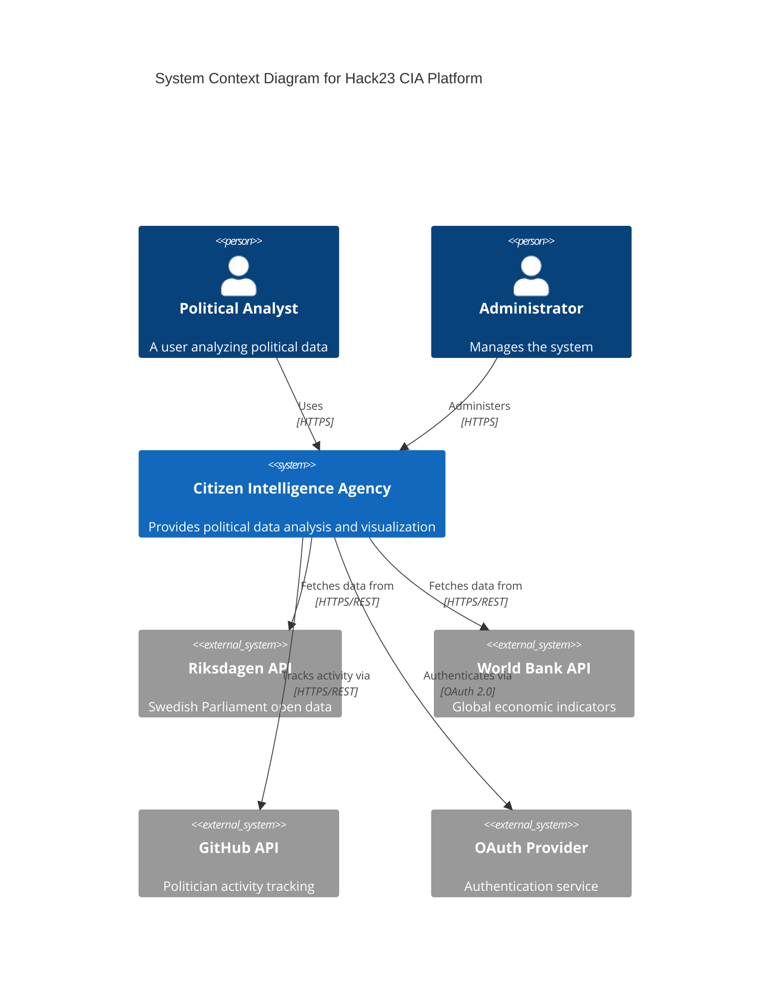
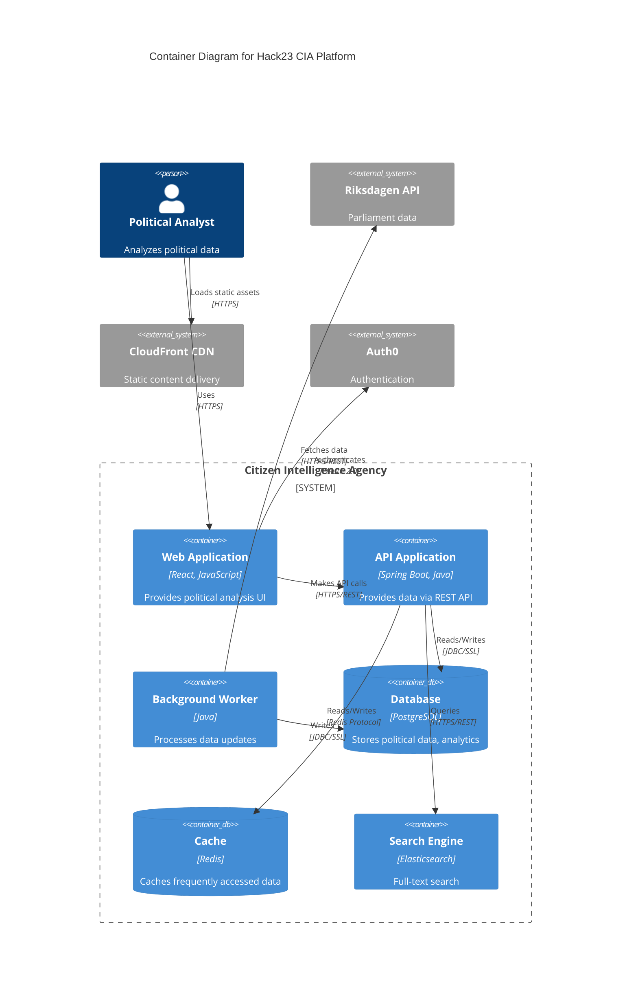
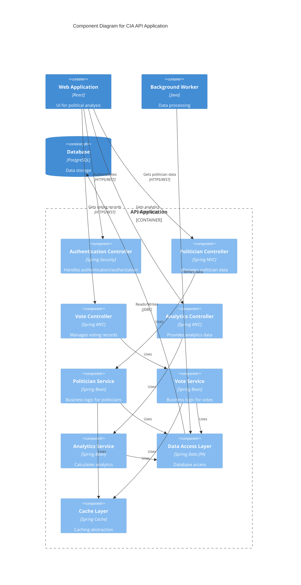
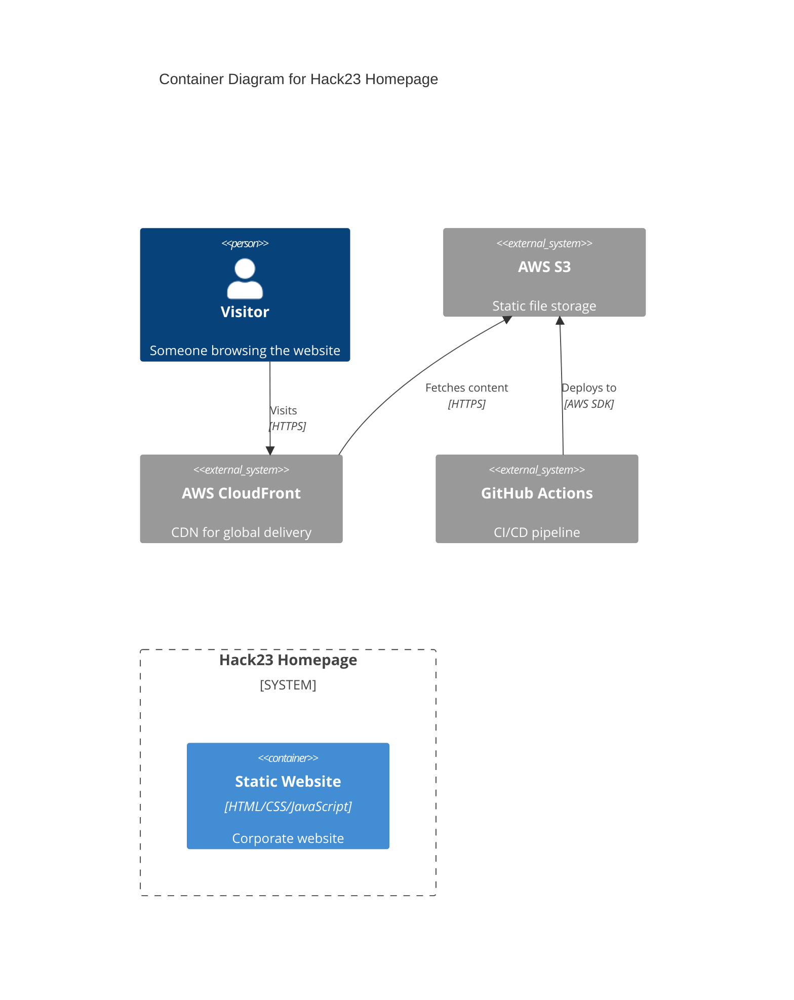
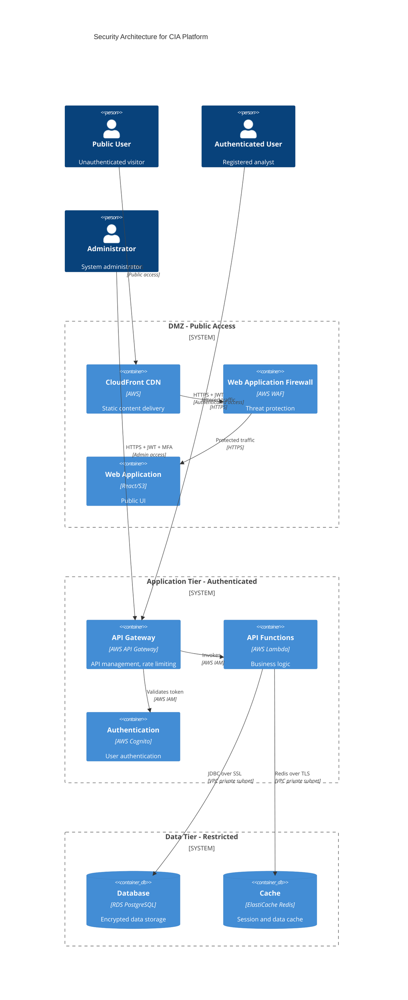
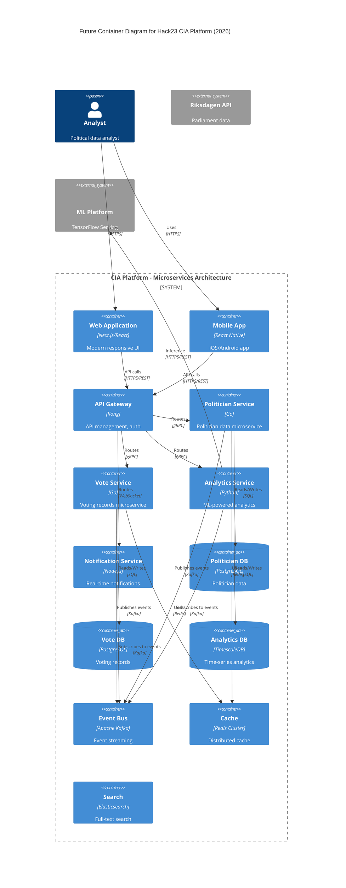

# C4 Model Skill

## Purpose

This skill provides guidance on creating C4 (Context, Container, Component, Code) model diagrams using Mermaid syntax for architecture documentation. C4 models provide a hierarchical way to visualize software architecture at different levels of abstraction, following Simon Brown's C4 model methodology.

## Rules

### C4 Model Levels

The C4 model consists of four levels of abstraction:

1. **Level 1: System Context** - Shows how the system fits into its environment
2. **Level 2: Container** - Shows the high-level technology choices and communication between containers
3. **Level 3: Component** - Shows how containers are decomposed into components
4. **Level 4: Code** - Shows implementation details (optional, often better shown in IDEs)

### When to Use Each Level

**System Context Diagram - MUST USE:**
- When documenting a new system
- To show system boundaries
- To identify users and external dependencies
- In architecture decision records
- In system documentation home page

**Container Diagram - MUST USE:**
- For all systems with multiple deployable units
- To show technology stack
- To document inter-container communication
- For security architecture (trust boundaries)
- In deployment documentation

**Component Diagram - SHOULD USE:**
- For complex containers with many components
- When explaining internal structure
- For onboarding new developers
- For technical debt analysis

**Code Diagram - RARELY USE:**
- Only for explaining specific complex patterns
- Better suited for IDE visualization
- Consider UML class diagrams instead

### Documentation Requirements

**MUST:**
- Create both CURRENT and FUTURE state diagrams (ARCHITECTURE.md and FUTURE_ARCHITECTURE.md)
- Include title, description, and key for each diagram
- Use consistent notation across diagrams
- Document relationships between elements
- Include technologies used
- Version diagrams when architecture changes
- Keep diagrams up-to-date with code changes

**MUST NOT:**
- Create overly detailed diagrams (focus on key elements)
- Mix different abstraction levels in same diagram
- Omit technology choices from Container diagrams
- Use ambiguous relationship labels

### Mermaid Syntax for C4 Diagrams

Mermaid supports C4 diagrams through the `C4Context`, `C4Container`, and `C4Component` directives.

## Examples

### Example 1: System Context Diagram



### Example 2: Container Diagram



### Example 3: Component Diagram



### Example 4: Simple Homepage Container Diagram



### Example 5: Security Architecture with Trust Boundaries



### Example 6: Future State Architecture



## Best Practices

### Naming Conventions

**MUST:**
- Use clear, descriptive names for elements
- Use consistent terminology across diagrams
- Specify technology/framework in Container diagrams
- Include protocols in relationship labels

### Visual Clarity

**SHOULD:**
- Limit elements per diagram (max 15-20)
- Group related elements
- Use consistent colors for element types
- Arrange elements logically (left-to-right flow for data)

### Documentation Structure

**MUST:**
- Include diagram title
- Add description explaining purpose
- Provide key/legend if using custom notation
- Document assumptions and constraints
- Link to related diagrams

**Recommended File Structure:**
```
docs/
  architecture/
    ARCHITECTURE.md              # Current state C4 diagrams
    FUTURE_ARCHITECTURE.md       # Future state C4 diagrams
    decisions/                   # Architecture Decision Records
      ADR-001-microservices.md
      ADR-002-database-choice.md
```

## Related ISMS Policies

- **[Secure Development Policy](https://github.com/Hack23/ISMS-PUBLIC/blob/main/Secure_Development_Policy.md)** - Architecture documentation requirements
- **[Information Security Policy](https://github.com/Hack23/ISMS-PUBLIC/blob/main/Information_Security_Policy.md)** - Security architecture

## Related Documentation

- [SECURITY_ARCHITECTURE.md](../../../../SECURITY_ARCHITECTURE.md) - Security-focused C4 diagrams
- [security-architecture SKILL.md](../security-architecture/SKILL.md) - Security architecture patterns
- [documentation-portfolio SKILL.md](../documentation-portfolio/SKILL.md) - Complete documentation set

## Tool Support

### Mermaid Live Editor
- URL: https://mermaid.live/
- Use for creating and testing diagrams

### VS Code Extensions
- Mermaid Preview
- Markdown Preview Mermaid Support

### Rendering in GitHub
- GitHub natively renders Mermaid diagrams in Markdown

## C4 Model References

- **Official C4 Model**: https://c4model.com/
- **Mermaid C4 Syntax**: https://mermaid.js.org/syntax/c4.html
- **Simon Brown's Architecture Resources**: https://www.architectis.je/
