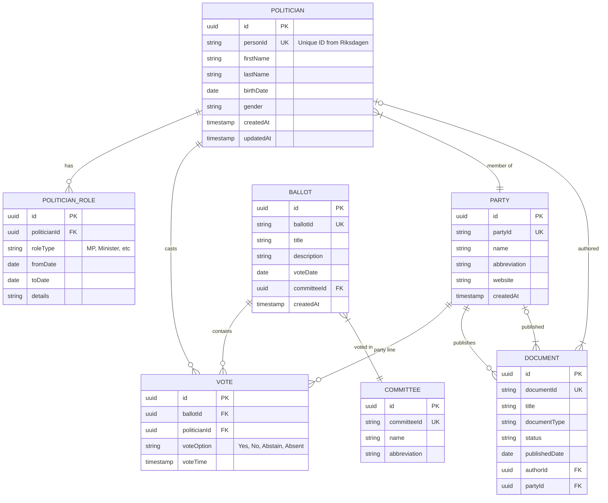
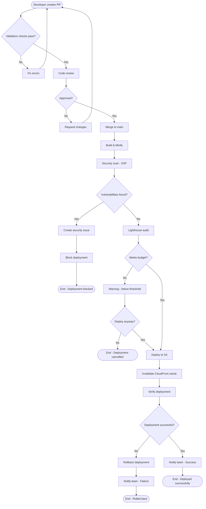
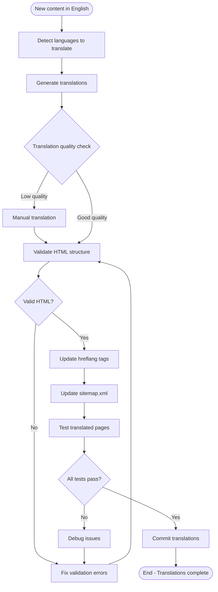
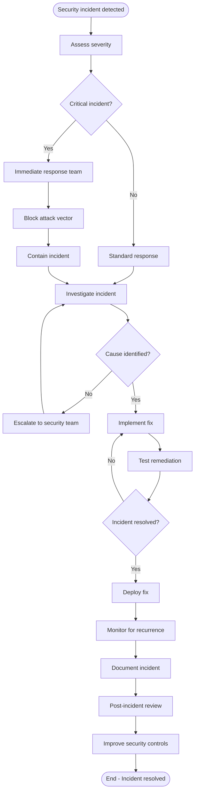

# Documentation Portfolio Skill

## Purpose

This skill defines the complete set of architecture documentation required for Hack23 projects. It ensures comprehensive documentation that supports both current operations and future planning, following best practices for technical documentation.

## Rules

### Required Documentation Files

**MUST CREATE** for each project:

#### Current State Documentation
- `ARCHITECTURE.md` - C4 model diagrams (Context, Container, Component)
- `DATA_MODEL.md` - Database schema, entity relationships
- `FLOWCHART.md` - Process flows and workflows
- `STATEDIAGRAM.md` - State machines and transitions
- `MINDMAP.md` - System concepts and relationships
- `SWOT.md` - Strengths, Weaknesses, Opportunities, Threats analysis

#### Future State Documentation
- `FUTURE_ARCHITECTURE.md` - Planned architecture changes
- `FUTURE_DATA_MODEL.md` - Planned data model evolution
- `FUTURE_FLOWCHART.md` - Planned process improvements
- `FUTURE_STATEDIAGRAM.md` - Planned state machine changes
- `FUTURE_MINDMAP.md` - Future vision and concepts
- `FUTURE_SWOT.md` - Future state SWOT analysis

#### Security Documentation
- `SECURITY_ARCHITECTURE.md` - Security controls and architecture
- `FUTURE_SECURITY_ARCHITECTURE.md` - Planned security improvements
- `THREAT_MODEL.md` - Threat analysis and mitigations

#### Supplementary Documentation
- `README.md` - Project overview, getting started
- `.github/SECURITY.md` - Vulnerability reporting
- `CONTRIBUTING.md` - Contribution guidelines
- `CLASSIFICATION.md` - Data classification guidance (if applicable)
- `ADR/` directory - Architecture Decision Records

### Documentation Standards

**MUST:**
- Write in Markdown format
- Use Mermaid for all diagrams
- Include table of contents for documents > 500 lines
- Add last updated date at top of document
- Link related documents
- Version documents (use git for versioning)
- Keep diagrams up-to-date with code
- Review documentation quarterly

**MUST NOT:**
- Include sensitive information (secrets, credentials)
- Create stale documentation (update or delete)
- Duplicate information across documents (link instead)
- Use proprietary diagram formats (use Mermaid)

### ARCHITECTURE.md Structure

**MUST INCLUDE:**
1. **Overview** - System purpose and scope
2. **System Context Diagram** - C4 Level 1
3. **Container Diagram** - C4 Level 2
4. **Component Diagrams** - C4 Level 3 (for key containers)
5. **Technology Stack** - Languages, frameworks, services
6. **Deployment Architecture** - How system is deployed
7. **Integration Points** - External systems and APIs
8. **Architecture Decision Records** - Links to ADRs

### DATA_MODEL.md Structure

**MUST INCLUDE:**
1. **Overview** - Data model purpose
2. **Entity Relationship Diagram** - Mermaid ER diagram
3. **Entity Descriptions** - Each entity with attributes
4. **Relationships** - Cardinality and constraints
5. **Indexes** - Performance-critical indexes
6. **Data Classification** - Sensitivity of each entity/attribute
7. **Data Retention** - How long data is kept

### FLOWCHART.md Structure

**MUST INCLUDE:**
1. **Overview** - Processes documented
2. **Key Workflows** - Main user/system flows
3. **Flowchart Diagrams** - Mermaid flowcharts
4. **Decision Points** - Logic branches explained
5. **Error Handling** - Exception flows
6. **Performance Considerations** - Bottlenecks, optimizations

### STATEDIAGRAM.md Structure

**MUST INCLUDE:**
1. **Overview** - State machines in system
2. **State Diagrams** - Mermaid state diagrams
3. **States** - Description of each state
4. **Transitions** - Events that trigger transitions
5. **State Invariants** - What must be true in each state
6. **Terminal States** - End states and cleanup

### MINDMAP.md Structure

**MUST INCLUDE:**
1. **Overview** - Purpose of mindmap
2. **Core Concepts** - Central ideas
3. **Mindmap Diagram** - Mermaid mindmap
4. **Concept Descriptions** - Explanation of each node
5. **Relationships** - How concepts connect
6. **Use Cases** - How mindmap aids understanding

### SWOT.md Structure

**MUST INCLUDE:**
1. **Overview** - Context for SWOT analysis
2. **Strengths** - Internal positive attributes
3. **Weaknesses** - Internal limitations
4. **Opportunities** - External favorable factors
5. **Threats** - External risks
6. **Strategy Matrix** - How to leverage/address SWOT
7. **Action Items** - Concrete next steps

## Examples

### Example 1: DATA_MODEL.md Structure

```markdown
# Data Model - Hack23 CIA Platform

**Last Updated:** 2025-01-24

## Overview

This document describes the data model for the Citizen Intelligence Agency platform, which stores political data including politicians, parties, votes, and documents.

## Entity Relationship Diagram



## Entity Descriptions

### POLITICIAN

Stores information about Swedish politicians.

| Attribute | Type | Classification | Description |
|-----------|------|---------------|-------------|
| id | UUID | INTERNAL | Primary key |
| personId | String | PUBLIC | Unique ID from Riksdagen API |
| firstName | String | PUBLIC | First name |
| lastName | String | PUBLIC | Last name |
| birthDate | Date | PUBLIC | Date of birth |
| gender | String | PUBLIC | Gender (M/F) |
| createdAt | Timestamp | INTERNAL | Record creation time |
| updatedAt | Timestamp | INTERNAL | Last update time |

**Indexes:**
- `idx_politician_person_id` (UNIQUE) on `personId`
- `idx_politician_name` on `lastName, firstName`

**Data Retention:** Indefinite (historical political data)

### VOTE

Records individual votes cast by politicians.

| Attribute | Type | Classification | Description |
|-----------|------|---------------|-------------|
| id | UUID | INTERNAL | Primary key |
| ballotId | UUID | INTERNAL | Foreign key to BALLOT |
| politicianId | UUID | INTERNAL | Foreign key to POLITICIAN |
| voteOption | String | PUBLIC | Yes/No/Abstain/Absent |
| voteTime | Timestamp | PUBLIC | When vote was cast |

**Indexes:**
- `idx_vote_ballot` on `ballotId`
- `idx_vote_politician` on `politicianId`
- `idx_vote_time` on `voteTime`

**Data Retention:** Indefinite (historical voting records)

## Relationships

- **POLITICIAN to PARTY**: Many-to-One (politician belongs to one party at a time)
- **POLITICIAN to VOTE**: One-to-Many (politician casts many votes)
- **BALLOT to VOTE**: One-to-Many (ballot contains many votes)
- **POLITICIAN to POLITICIAN_ROLE**: One-to-Many (politician has multiple roles over time)

## Data Classification Summary

- **PUBLIC**: Politician names, votes, documents (public record)
- **INTERNAL**: System IDs, timestamps, technical metadata
- **CONFIDENTIAL**: None
- **RESTRICTED**: None

## Performance Considerations

- Votes table will grow large (millions of records), requires partitioning by year
- Full-text search on DOCUMENT requires Elasticsearch integration
- POLITICIAN queries often join with PARTY, consider denormalization for read performance

## Migration Strategy

See `FUTURE_DATA_MODEL.md` for planned schema changes.
```

### Example 2: FLOWCHART.md Structure

```markdown
# Flowcharts - Hack23 Homepage Deployment

**Last Updated:** 2025-01-24

## Overview

This document describes the key workflows and processes for the Hack23 Homepage, focusing on content updates, deployment, and monitoring.

## Content Update Workflow



## Translation Workflow



## Security Incident Response



## Decision Points

### Validation Checks
- HTML validation
- CSS validation
- JavaScript linting
- Accessibility checks (WCAG 2.1 AA)
- Link validation
- Security header validation

### Security Scan Thresholds
- **Block deployment**: Critical vulnerabilities
- **Warning**: High vulnerabilities (review required)
- **Pass**: Medium or lower vulnerabilities

### Lighthouse Budget
- Performance: ≥ 90
- Accessibility: ≥ 95
- Best Practices: ≥ 95
- SEO: ≥ 95

## Error Handling

All workflows include error handling:
1. **Detect error** - Automated checks or manual report
2. **Log error** - CloudWatch, GitHub Actions logs
3. **Notify** - Slack/email notification
4. **Rollback** (if deployed) - Revert to previous version
5. **Fix** - Implement correction
6. **Verify** - Test fix before re-deploying

## Performance Considerations

- **Parallel processing**: Run security scan and Lighthouse audit in parallel
- **Caching**: Cache CloudFront invalidation to avoid rate limits
- **Incremental builds**: Only process changed files
```

### Example 3: SWOT.md Template

```markdown
# SWOT Analysis - Hack23 Homepage

**Last Updated:** 2025-01-24  
**Context:** Strategic planning for homepage evolution (2025-2026)

## Overview

This SWOT analysis evaluates the current state of the Hack23 Homepage and identifies strategic opportunities for improvement.

## Strengths (Internal Positive Factors)

### Technical Excellence
- ✅ **100% static** - No server-side processing, ultra-fast load times
- ✅ **Highly secure** - Minimal attack surface, no backend vulnerabilities
- ✅ **Excellent performance** - Lighthouse scores consistently above 90
- ✅ **Global CDN** - CloudFront provides worldwide low-latency access
- ✅ **Automated CI/CD** - GitHub Actions provides reliable deployment

### Content & Messaging
- ✅ **Clear value proposition** - Security-focused, transparent approach
- ✅ **Multilingual** - 14 languages supported (English + 13 translations)
- ✅ **Accessibility** - WCAG 2.1 AA compliant
- ✅ **Open-source** - Builds trust, demonstrates transparency
- ✅ **Public ISMS** - Unique differentiator in market

### Cost Efficiency
- ✅ **Low operational cost** - S3 + CloudFront = minimal hosting fees
- ✅ **No maintenance** - Static site requires minimal upkeep
- ✅ **Free CI/CD** - GitHub Actions free tier sufficient

## Weaknesses (Internal Negative Factors)

### Technical Limitations
- ❌ **No dynamic content** - Can't personalize for users
- ❌ **No user accounts** - No way to track returning visitors
- ❌ **No analytics** - Privacy-first means no visitor insights
- ❌ **Manual translations** - Time-consuming, potential quality issues
- ❌ **No search** - Difficult to find specific content

### Content Gaps
- ❌ **Limited interactivity** - No contact forms, no demos
- ❌ **No case studies** - Lack of customer success stories
- ❌ **Few examples** - Need more concrete use cases
- ❌ **Static blog** - No comment system, limited engagement

### Marketing & Growth
- ❌ **Low SEO maturity** - Needs optimization
- ❌ **No lead capture** - Can't build email list
- ❌ **Limited conversion tracking** - Hard to measure effectiveness

## Opportunities (External Positive Factors)

### Market Trends
- 📈 **Growing cybersecurity demand** - Increased awareness post-breaches
- 📈 **Compliance requirements** - NIS2, GDPR driving demand
- 📈 **Open-source adoption** - More companies embracing transparency
- 📈 **Remote work security** - Distributed teams need better security
- 📈 **AI/LLM security** - Emerging need for AI security consulting

### Technology Evolution
- 📈 **Jamstack maturity** - Static sites with dynamic features via APIs
- 📈 **Serverless functions** - Add backend functionality without servers
- 📈 **Web3 integration** - Potential for blockchain-based transparency
- 📈 **Progressive Web Apps** - Enhanced mobile experience

### Business Opportunities
- 📈 **Strategic partnerships** - Integrate with complementary services
- 📈 **Content marketing** - Leverage blog for SEO and thought leadership
- 📈 **Community building** - Open-source projects attract contributors
- 📈 **Training & certification** - Offer security training programs

## Threats (External Negative Factors)

### Competition
- ⚠️ **Established players** - Large consultancies have brand recognition
- ⚠️ **Price competition** - Offshore providers offer lower rates
- ⚠️ **Feature parity** - Competitors may copy open-source approach
- ⚠️ **Commoditization** - Risk of security consulting becoming commodity

### Technology Risks
- ⚠️ **Browser changes** - Could break existing functionality
- ⚠️ **CDN outages** - Dependence on CloudFront availability
- ⚠️ **Security vulnerabilities** - Supply chain attacks on dependencies
- ⚠️ **Algorithm changes** - SEO rankings could drop suddenly

### Regulatory & Market
- ⚠️ **Changing regulations** - New compliance requirements add complexity
- ⚠️ **Economic downturn** - Budget cuts in security spending
- ⚠️ **Privacy regulations** - Stricter rules may limit marketing

## Strategy Matrix

### Strengths × Opportunities (Maximize)

| Strength | Opportunity | Strategy |
|----------|-------------|----------|
| Technical excellence | Growing security demand | Position as premium, high-trust provider |
| Open-source ISMS | Open-source adoption | Create community around ISMS templates |
| Multilingual | Global market | Target international markets (EU, Asia) |
| Low cost | Price competition | Offer competitive pricing with high margins |

### Strengths × Threats (Leverage)

| Strength | Threat | Strategy |
|----------|--------|----------|
| Security focus | Established players | Differentiate through transparency & innovation |
| Automated CI/CD | Security vulnerabilities | Maintain fast patching, demonstrate resilience |
| Public ISMS | Compliance changes | Quickly update ISMS, show adaptability |

### Weaknesses × Opportunities (Improve)

| Weakness | Opportunity | Strategy |
|----------|-------------|----------|
| No dynamic content | Jamstack maturity | Implement serverless functions for forms |
| No analytics | Content marketing | Add privacy-preserving analytics (Plausible) |
| No lead capture | Community building | Create newsletter via static form + Netlify |
| Manual translations | AI/LLM evolution | Explore AI-assisted translation with human review |

### Weaknesses × Threats (Monitor)

| Weakness | Threat | Strategy |
|----------|--------|----------|
| Limited interactivity | Commoditization | Maintain focus on quality and service |
| No case studies | Established players | Develop customer testimonials, success stories |
| Low SEO maturity | Algorithm changes | Invest in SEO, diversify traffic sources |

## Action Items

### Q1 2025 (Immediate)
1. Implement privacy-preserving analytics (Plausible or similar)
2. Create 3 case studies from existing customers
3. Optimize SEO (meta descriptions, structured data improvements)
4. Add simple contact form via serverless function

### Q2 2025 (Near-term)
5. Launch newsletter signup (static form + automation)
6. Create comprehensive FAQ page
7. Develop security assessment tool/quiz
8. Expand blog with weekly posts

### H2 2025 (Medium-term)
9. Build community forum for ISMS discussions
10. Launch security training module (paid)
11. Develop interactive demos for CIA/Compliance Manager
12. Partner with complementary services (penetration testing, etc.)

### 2026 (Long-term)
13. Expand to additional languages (Chinese, Portuguese)
14. Create certification program
15. Launch SaaS version of compliance tools
16. Explore strategic acquisitions or partnerships

## Review Schedule

- **Quarterly review**: Reassess SWOT based on market changes
- **Annual deep dive**: Full strategic planning session
- **Ad-hoc**: Major market events or competitive moves

**Next Review:** 2025-04-24
```

## Related ISMS Policies

- **[Secure Development Policy](https://github.com/Hack23/ISMS-PUBLIC/blob/main/Secure_Development_Policy.md)** - Documentation requirements
- **[Information Security Policy](https://github.com/Hack23/ISMS-PUBLIC/blob/main/Information_Security_Policy.md)** - Overall framework

## Related Documentation

- [c4-modeling SKILL.md](../c4-modeling/SKILL.md) - C4 diagram creation
- [security-architecture SKILL.md](../security-architecture/SKILL.md) - Security documentation

## Documentation Tools

- **Mermaid Live Editor**: https://mermaid.live/
- **Markdown Preview**: VS Code with Markdown Preview Enhanced
- **Diagram Validation**: GitHub's native Mermaid rendering
