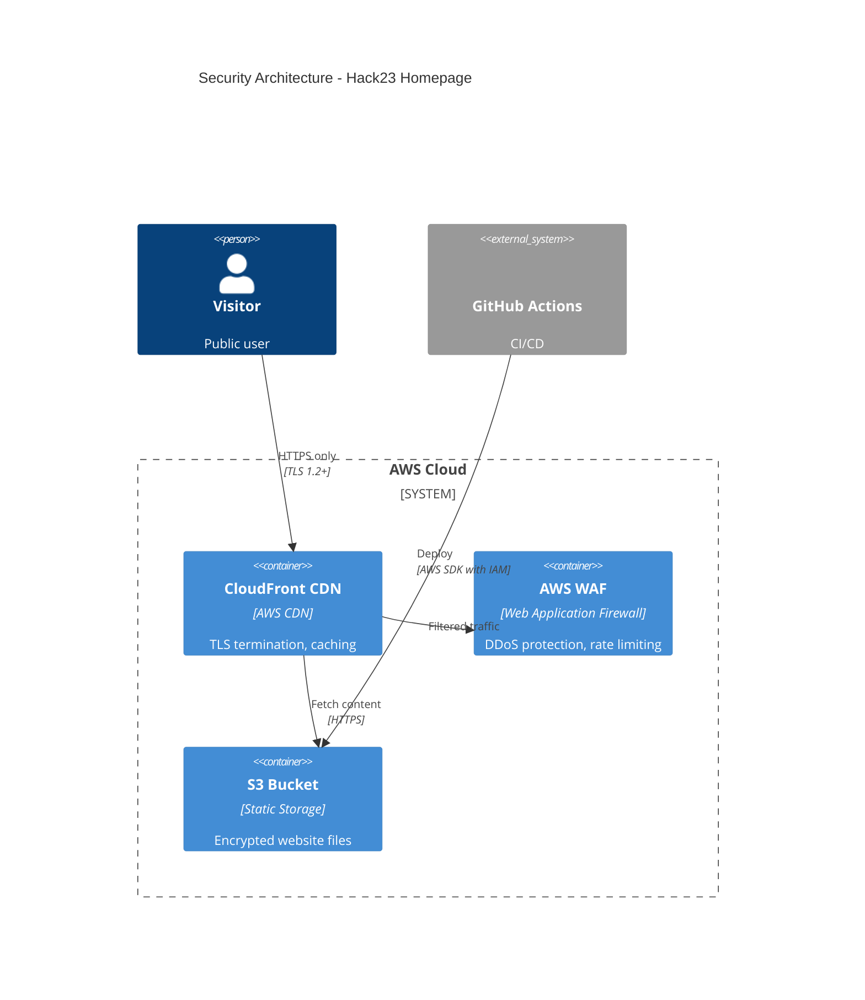

# Security Architecture Skill

## Purpose

This skill defines requirements for security architecture documentation following Hack23 ISMS policies. It ensures that security controls, threat models, and defense-in-depth strategies are properly documented and maintained for all systems.

## Rules

### Required Documentation

**MUST CREATE:**
- `SECURITY_ARCHITECTURE.md` - Current security controls and architecture
- `FUTURE_SECURITY_ARCHITECTURE.md` - Planned security improvements
- `THREAT_MODEL.md` - Threat analysis and mitigations
- Security section in main `README.md`
- Security policy (`.github/SECURITY.md`)

### SECURITY_ARCHITECTURE.md Requirements

**MUST INCLUDE:**
1. **Overview** - System security posture summary
2. **Security Controls** - Implemented controls mapped to frameworks (ISO 27001, NIST CSF, CIS Controls)
3. **Authentication & Authorization** - Identity management approach
4. **Data Protection** - Encryption at rest and in transit
5. **Network Security** - Firewall rules, network segmentation, DMZ architecture
6. **Monitoring & Logging** - Security event logging and SIEM integration
7. **Incident Response** - Security incident handling procedures
8. **Compliance Mapping** - How architecture meets compliance requirements
9. **Security Diagrams** - C4 diagrams showing trust boundaries and security zones

**MUST NOT:**
- Expose sensitive security details (specific firewall rules, vulnerability details)
- Include credentials or secrets
- Document security through obscurity approaches

### FUTURE_SECURITY_ARCHITECTURE.md Requirements

**MUST INCLUDE:**
1. **Security Roadmap** - Planned security enhancements with timeline
2. **Gap Analysis** - Current vs. desired state
3. **Security Initiatives** - Planned projects to improve security
4. **Technology Evolution** - Future security technologies to adopt
5. **Risk Mitigation Plans** - How future changes will reduce risks
6. **Compliance Improvements** - Plans to meet future compliance requirements

### THREAT_MODEL.md Requirements

**MUST INCLUDE:**
1. **System Overview** - What is being protected
2. **Assets** - Critical data and systems
3. **Threat Actors** - Who might attack and their motivations
4. **Attack Vectors** - How attacks might occur
5. **Threats** - Specific threats using STRIDE or similar methodology:
   - **S**poofing
   - **T**ampering
   - **R**epudiation
   - **I**nformation Disclosure
   - **D**enial of Service
   - **E**levation of Privilege
6. **Risk Assessment** - Likelihood and impact of each threat
7. **Mitigations** - Controls to prevent or reduce each threat
8. **Residual Risks** - Accepted risks after mitigations

**Threat Prioritization:**
- **Critical**: Immediate action required
- **High**: Remediate within 30 days
- **Medium**: Remediate within 90 days
- **Low**: Accept or remediate opportunistically

### Defense-in-Depth Layers

**MUST IMPLEMENT:**

1. **Perimeter Security**
   - Web Application Firewall (WAF)
   - DDoS protection
   - Rate limiting
   - Geo-blocking (if applicable)

2. **Network Security**
   - Network segmentation (DMZ, application tier, data tier)
   - VPN for remote access
   - Zero-trust networking
   - Private subnets for sensitive resources

3. **Application Security**
   - Input validation
   - Output encoding
   - Authentication & authorization
   - Session management
   - CSRF protection
   - Secure headers (CSP, HSTS, X-Frame-Options)

4. **Data Security**
   - Encryption at rest (AES-256)
   - Encryption in transit (TLS 1.2+)
   - Data classification and handling
   - Secure key management
   - Database access controls

5. **Monitoring & Detection**
   - Security event logging
   - Intrusion detection/prevention (IDS/IPS)
   - Anomaly detection
   - Security alerts and incident response
   - Audit logging

6. **Physical Security**
   - Secure data center (for on-premise)
   - Access controls
   - Environmental controls
   - Asset management

### Security Control Categories

**Preventive Controls:**
- Access controls
- Encryption
- Input validation
- Firewall rules
- Secure configuration

**Detective Controls:**
- Logging
- Monitoring
- Intrusion detection
- Vulnerability scanning
- Audit reviews

**Corrective Controls:**
- Incident response
- Patch management
- Backup and recovery
- Business continuity

**Deterrent Controls:**
- Security awareness training
- Legal agreements (NDAs)
- Security policies
- Audit reports

### Security Zones

**Public Zone (Untrusted):**
- Static website content
- Public APIs (read-only, rate-limited)
- CDN distribution

**DMZ (Semi-trusted):**
- Web servers
- API gateways
- Load balancers
- WAF

**Application Zone (Trusted):**
- Application servers
- Business logic
- Internal APIs
- Background workers

**Data Zone (Highly Trusted):**
- Databases
- File storage with sensitive data
- Key management systems
- Backup systems

## Examples

### Example 1: SECURITY_ARCHITECTURE.md Template

```markdown
# Security Architecture - Hack23 Homepage

## Overview

The Hack23 Homepage is a static website deployed on AWS S3 with CloudFront CDN. Security is implemented through defense-in-depth with multiple layers of protection.

**Security Posture:** Public-facing static website with no user authentication or sensitive data processing.

## Security Controls

### ISO 27001:2022 Controls Implemented

| Control | Implementation | Status |
|---------|---------------|--------|
| A.8.24 Use of cryptography | TLS 1.2+ enforced via CloudFront | ✅ Implemented |
| A.8.9 Configuration management | Infrastructure as Code (Terraform) | ✅ Implemented |
| A.8.16 Monitoring | CloudWatch logging and alarms | ✅ Implemented |
| A.5.7 Threat intelligence | ZAP security scanning in CI/CD | ✅ Implemented |

### NIST Cybersecurity Framework

| Function | Category | Implementation |
|----------|----------|----------------|
| Identify | Asset Management | Repository inventory, dependency tracking |
| Protect | Access Control | GitHub branch protection, AWS IAM roles |
| Detect | Security Monitoring | GitHub Advanced Security, CloudWatch |
| Respond | Incident Response | SECURITY.md vulnerability reporting |
| Recover | Backup & Recovery | Git version control, S3 versioning |

## Authentication & Authorization

**Public Access:**
- No authentication required for website content
- All content is PUBLIC classification

**Administrative Access:**
- GitHub authentication with 2FA required
- AWS IAM roles with least privilege
- Branch protection rules on main branch

## Data Protection

**Data Classification:**
- All website content: PUBLIC
- No personal data collected
- No cookies or tracking (privacy by design)

**Encryption:**
- **In Transit**: TLS 1.2+ enforced on CloudFront
- **At Rest**: S3 server-side encryption (AES-256)

**Data Retention:**
- Git history retained indefinitely
- CloudWatch logs retained 90 days
- No user data to retain

## Network Security

### Architecture Diagram



### Security Zones

- **Public Zone**: CloudFront CDN (all traffic)
- **Storage Zone**: S3 bucket (restricted to CloudFront and GitHub Actions)

### Firewall Rules

- CloudFront: Accept HTTPS (443) only, redirect HTTP to HTTPS
- S3: Block all public access, allow only CloudFront OAI and GitHub Actions IAM role
- WAF: Rate limiting (100 requests/5 minutes per IP), geo-blocking for known threat countries

## Monitoring & Logging

**Logging:**
- CloudFront access logs → S3 bucket
- S3 access logs enabled
- GitHub Actions workflow logs
- AWS CloudTrail for API activity

**Monitoring:**
- CloudWatch alarms for:
  - High error rates (4xx, 5xx)
  - Unusual traffic patterns
  - Failed deployments

**Security Scanning:**
- CodeQL analysis on every commit
- Dependency vulnerability scanning (Dependabot)
- ZAP security scan before deployment
- Lighthouse security audit

## Incident Response

**Security Incident Handling:**

1. **Detection**: Automated alerts, manual reports via SECURITY.md
2. **Assessment**: Triage severity (Critical/High/Medium/Low)
3. **Containment**: Roll back deployment if needed, block malicious IPs in WAF
4. **Eradication**: Fix vulnerability, patch systems
5. **Recovery**: Deploy fixed version, verify integrity
6. **Lessons Learned**: Update security controls, document in post-mortem

**Contact:** security@hack23.com

## Compliance Mapping

### ISO 27001:2022
- A.8.24: TLS 1.2+ encryption
- A.8.9: Infrastructure as Code
- A.8.16: CloudWatch monitoring
- A.5.7: Automated security scanning

### GDPR
- No personal data collected (Article 4)
- Privacy by design (Article 25)
- No cookies, no tracking

### WCAG 2.1 AA
- Accessibility statement published
- Regular accessibility audits via Lighthouse

## Security Metrics

| Metric | Target | Current |
|--------|--------|---------|
| Critical vulnerabilities | 0 | 0 |
| High vulnerabilities | < 5 | 2 |
| Lighthouse Security Score | 100 | 100 |
| TLS Score (SSL Labs) | A+ | A+ |
| Security Headers Score | A+ | A |

## Risk Register

See [THREAT_MODEL.md](THREAT_MODEL.md) for detailed threat analysis.

## Security Improvements

See [FUTURE_SECURITY_ARCHITECTURE.md](FUTURE_SECURITY_ARCHITECTURE.md) for planned enhancements.
```

### Example 2: THREAT_MODEL.md Template

```markdown
# Threat Model - Hack23 Homepage

## System Overview

Static corporate website hosted on AWS S3 with CloudFront CDN. No user authentication, no sensitive data processing, no backend application logic.

## Assets

| Asset | Classification | Value |
|-------|---------------|-------|
| Website content | PUBLIC | Low (reputational impact) |
| GitHub repository | INTERNAL | Medium (intellectual property) |
| AWS infrastructure | CONFIDENTIAL | High (cost, availability) |
| Domain reputation | N/A | High (business impact) |

## Threat Actors

| Actor | Motivation | Capability |
|-------|-----------|-----------|
| Script kiddies | Vandalism, bragging rights | Low |
| Competitors | Reputation damage | Medium |
| Hacktivists | Political statement | Medium |
| Nation-states | Espionage, disruption | High |

## Attack Vectors

1. **Web Application Attacks**
   - XSS injection via compromised supply chain
   - Content injection via compromised build pipeline
   - DDoS attacks

2. **Supply Chain Attacks**
   - Compromised dependencies
   - Malicious GitHub Actions
   - Compromised build tools

3. **Infrastructure Attacks**
   - AWS credential compromise
   - S3 bucket misconfiguration
   - CloudFront compromise

4. **Social Engineering**
   - GitHub account takeover
   - Phishing for AWS credentials

## Threats (STRIDE Analysis)

### Spoofing

| Threat | Likelihood | Impact | Risk | Mitigation | Status |
|--------|-----------|--------|------|-----------|--------|
| Attacker impersonates Hack23 website | Low | High | Medium | HTTPS with HSTS, valid SSL cert | ✅ Mitigated |
| GitHub account takeover | Medium | High | High | 2FA required, strong passwords | ✅ Mitigated |
| AWS credential compromise | Low | Critical | High | IAM roles, no long-lived keys, AWS MFA | ✅ Mitigated |

### Tampering

| Threat | Likelihood | Impact | Risk | Mitigation | Status |
|--------|-----------|--------|------|-----------|--------|
| Malicious code injection in build | Low | High | Medium | Code review, branch protection, CodeQL | ✅ Mitigated |
| S3 content modification | Low | High | Medium | S3 versioning, access logging, IAM restrictions | ✅ Mitigated |
| Dependency substitution | Medium | High | High | Package lock files, Dependabot alerts | ⚠️ Partial |

### Repudiation

| Threat | Likelihood | Impact | Risk | Mitigation | Status |
|--------|-----------|--------|------|-----------|--------|
| Unauthorized changes without audit trail | Low | Medium | Low | Git history, GitHub audit log, CloudTrail | ✅ Mitigated |

### Information Disclosure

| Threat | Likelihood | Impact | Risk | Mitigation | Status |
|--------|-----------|--------|------|-----------|--------|
| Exposure of internal documentation | Low | Low | Low | No sensitive info in public repo, separate ISMS repo | ✅ Mitigated |
| AWS credentials leaked in logs | Low | High | Medium | No secrets in code, secret scanning enabled | ✅ Mitigated |

### Denial of Service

| Threat | Likelihood | Impact | Risk | Mitigation | Status |
|--------|-----------|--------|------|-----------|--------|
| DDoS attack on website | Medium | Medium | Medium | CloudFront DDoS protection, WAF rate limiting | ✅ Mitigated |
| S3 bucket deletion | Low | High | Medium | S3 versioning, MFA delete, backups | ✅ Mitigated |
| GitHub repository deletion | Low | High | Medium | Repository protection rules, backups | ✅ Mitigated |

### Elevation of Privilege

| Threat | Likelihood | Impact | Risk | Mitigation | Status |
|--------|-----------|--------|------|-----------|--------|
| Privilege escalation in GitHub | Low | High | Medium | Least privilege, branch protection, audit logging | ✅ Mitigated |
| AWS IAM privilege escalation | Low | Critical | High | Least privilege IAM policies, AWS Organizations SCPs | ✅ Mitigated |

## Risk Assessment Summary

| Risk Level | Count | Action Required |
|-----------|-------|-----------------|
| Critical | 0 | N/A |
| High | 3 | Monitor and maintain mitigations |
| Medium | 5 | Review quarterly |
| Low | 2 | Accept |

## Residual Risks

### Accepted Risks

1. **Dependency vulnerabilities (Medium)**
   - Justification: Low exploitability for static site, regular updates via Dependabot
   - Mitigation: Quarterly dependency reviews, automated security scans

2. **DDoS attacks (Medium)**
   - Justification: CloudFront provides adequate protection, complete prevention impossible
   - Mitigation: CloudFront DDoS Shield, WAF rate limiting, monitoring

## Security Controls Summary

| Control | Type | Status |
|---------|------|--------|
| HTTPS/TLS 1.2+ | Preventive | ✅ Implemented |
| AWS WAF | Preventive | ✅ Implemented |
| IAM least privilege | Preventive | ✅ Implemented |
| 2FA for GitHub | Preventive | ✅ Implemented |
| Code review | Preventive | ✅ Implemented |
| Branch protection | Preventive | ✅ Implemented |
| CodeQL scanning | Detective | ✅ Implemented |
| Dependabot alerts | Detective | ✅ Implemented |
| CloudWatch monitoring | Detective | ✅ Implemented |
| S3 versioning | Corrective | ✅ Implemented |
| Incident response plan | Corrective | ✅ Implemented |

## Review Schedule

- **Threat model review**: Annually or after significant changes
- **Risk assessment**: Quarterly
- **Control effectiveness**: Monthly (automated), Quarterly (manual)

**Last Reviewed:** 2025-01-24
**Next Review:** 2026-01-24
```

## Related ISMS Policies

- **[Information Security Policy](https://github.com/Hack23/ISMS-PUBLIC/blob/main/Information_Security_Policy.md)** - Overall security framework
- **[Risk Assessment Policy](https://github.com/Hack23/ISMS-PUBLIC/blob/main/Risk_Assessment_Policy.md)** - Risk management approach
- **[Incident Response Policy](https://github.com/Hack23/ISMS-PUBLIC/blob/main/Incident_Response_Policy.md)** - Security incident handling
- **[Security Monitoring Policy](https://github.com/Hack23/ISMS-PUBLIC/blob/main/Security_Monitoring_and_Logging_Policy.md)** - Logging and monitoring requirements

## Related Documentation

- [SECURITY_ARCHITECTURE.md](../../../../SECURITY_ARCHITECTURE.md) - Current security architecture
- [FUTURE_SECURITY_ARCHITECTURE.md](../../../../FUTURE_SECURITY_ARCHITECTURE.md) - Future security plans
- [THREAT_MODEL.md](../../../../THREAT_MODEL.md) - Detailed threat analysis
- [c4-modeling SKILL.md](../c4-modeling/SKILL.md) - C4 diagram creation
- [secure-development SKILL.md](../../security/secure-development/SKILL.md) - Secure coding practices

## Compliance Mapping

### ISO 27001:2022
- **A.5.7** Threat intelligence
- **A.5.24** Security event logging
- **A.5.28** Collection of evidence
- **A.8.8** Management of technical vulnerabilities
- **A.8.16** Monitoring activities

### NIST Cybersecurity Framework
- **ID.RA-1**: Asset vulnerabilities are identified
- **ID.RA-2**: Cyber threat intelligence is received
- **ID.RA-3**: Threats are identified and documented
- **PR.IP-12**: A vulnerability management plan is developed
