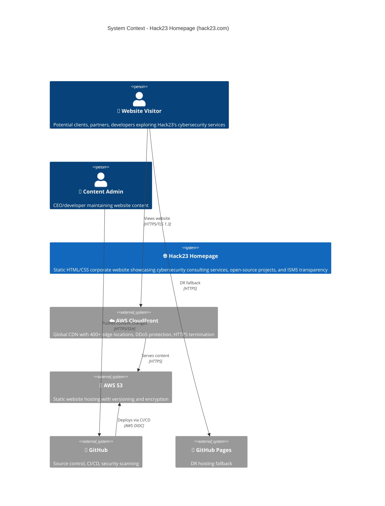
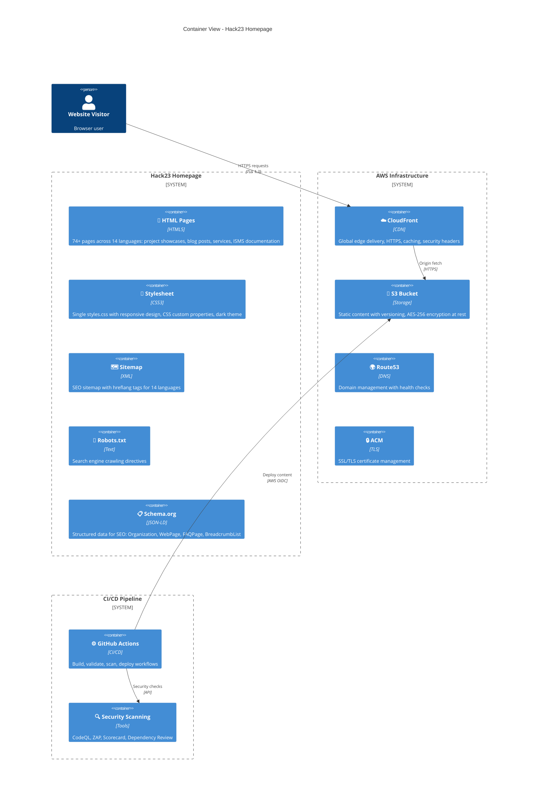
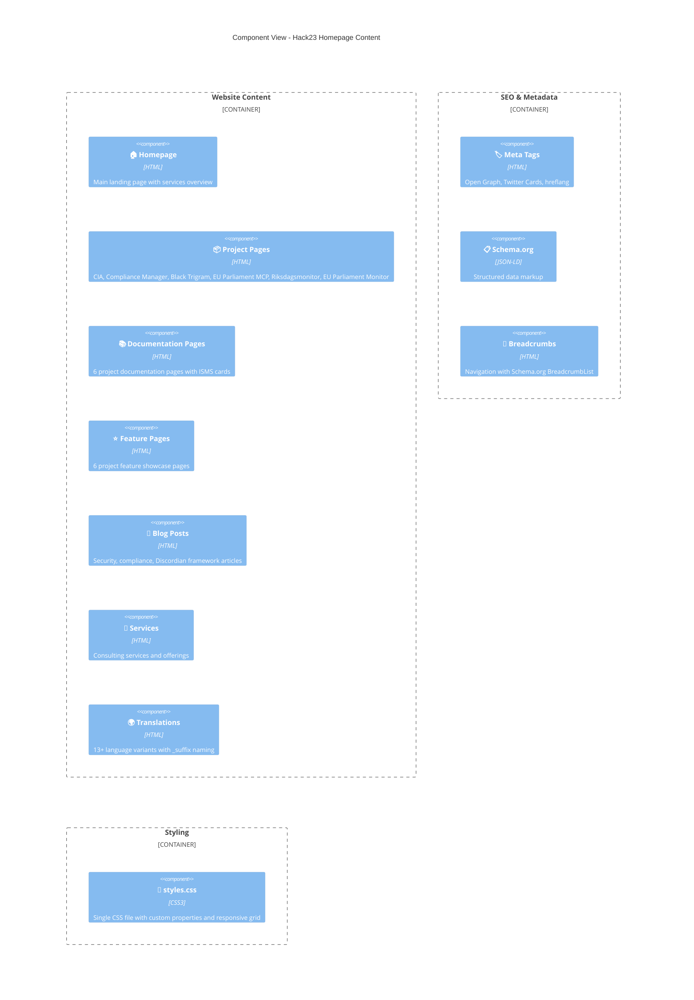
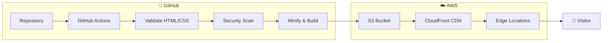

<p align="center">
  
</p>

<h1 align="center">🏛️ Hack23 Homepage — Architecture</h1>

<p align="center">
  <strong>C4 Architecture Model: Static Website on AWS S3 + CloudFront</strong><br>
  <em>Corporate Cybersecurity Consulting Website — hack23.com</em>
</p>

<p align="center">
  
  
  
  
</p>


[](https://scorecard.dev/viewer/?uri=github.com/Hack23/homepage)
[](https://github.com/Hack23/homepage/actions/workflows/main.yml)

**📋 Document Owner:** CEO | **📄 Version:** 1.0 | **📅 Last Updated:** 2026-02-20 (UTC)
**🔄 Review Cycle:** Quarterly | **⏰ Next Review:** 2026-05-20
**🏷️ Classification:** [](https://github.com/Hack23/ISMS-PUBLIC/blob/main/CLASSIFICATION.md#confidentiality-levels) [](https://github.com/Hack23/ISMS-PUBLIC/blob/main/CLASSIFICATION.md#integrity-levels) [](https://github.com/Hack23/ISMS-PUBLIC/blob/main/CLASSIFICATION.md#availability-levels)

---

## 📚 Architecture Documentation Map

| Document | Focus | Description |
|----------|-------|-------------|
| **[🏛️ Architecture](ARCHITECTURE.md)** | C4 Model | C4 model showing system structure (this document) |
| **[🛡️ Security Architecture](SECURITY_ARCHITECTURE.md)** | Security | Security controls and infrastructure |
| **[📊 Data Model](DATA_MODEL.md)** | Data | Content model and data structures |
| **[🔄 Flowchart](FLOWCHART.md)** | Processes | CI/CD and content workflows |
| **[📈 State Diagram](STATEDIAGRAM.md)** | States | Deployment and content lifecycle states |
| **[🧠 Mindmap](MINDMAP.md)** | Concepts | System conceptual relationships |
| **[💼 SWOT](SWOT.md)** | Strategy | Strategic analysis and positioning |
| **[🔄 Workflows](WORKFLOWS.md)** | CI/CD | GitHub Actions workflow documentation |
| **[🎯 Threat Model](THREAT_MODEL.md)** | Threats | STRIDE threat analysis |
| **[🛡️ CRA Assessment](CRA-ASSESSMENT.md)** | Compliance | EU Cyber Resilience Act conformity |
| **[🏷️ Classification](CLASSIFICATION.md)** | Data | Security classification framework |
| **[🚀 Future Architecture](FUTURE_ARCHITECTURE.md)** | Roadmap | Architectural evolution plans |

---

## 📑 Table of Contents

- [🌐 System Context](#-system-context)
- [🏢 Container View](#-container-view)
- [🧩 Component View](#-component-view)
- [📁 File Structure](#-file-structure)
- [⚙️ Technology Stack](#-technology-stack)
- [🔄 Deployment Architecture](#-deployment-architecture)
- [📋 ISMS Compliance](#-isms-compliance)

---

## 🌐 System Context



---

## 🏢 Container View



---

## 🧩 Component View



---

## 📁 File Structure

```
hack23-homepage/
├── 📄 index.html                    # Main landing page
├── 📄 *-project.html                # Project overview pages (6)
├── 📄 *-features.html               # Project feature pages (6)
├── 📄 *-docs.html                   # Project documentation pages (6)
├── 📄 blog-*.html                   # Blog articles
├── 📄 services.html                 # Services page
├── 📄 why-hack23.html               # About/differentiators
├── 📄 *_{lang}.html                 # Translated pages (13+ languages)
├── 🎨 styles.css                    # Single stylesheet
├── 🗺️ sitemap.xml                   # XML sitemap with hreflang
├── 📄 sitemap_*.html                # HTML sitemaps per language
├── 🤖 robots.txt                    # Crawling directives
├── 📄 budget.json                   # Lighthouse performance budgets
├── 📄 .htmlhintrc                   # HTML linting configuration
├── 📁 screenshots/                  # Visual assets
├── 📁 .github/
│   ├── 📁 workflows/                # CI/CD pipeline definitions
│   ├── 📁 skills/                   # 58 skills library
│   └── 📁 agents/                   # 8 custom Copilot agents
├── 📄 SECURITY_ARCHITECTURE.md      # Security design
├── 📄 ARCHITECTURE.md               # C4 architecture (this file)
├── 📄 THREAT_MODEL.md               # Threat analysis
├── 📄 WORKFLOWS.md                  # CI/CD documentation
└── 📄 README.md                     # Project overview
```

---

## ⚙️ Technology Stack

| Layer | Technology | Purpose |
|-------|-----------|---------|
| **Content** | HTML5 | Semantic markup with Schema.org structured data |
| **Styling** | CSS3 | Responsive design with custom properties |
| **Hosting** | AWS S3 | Static website hosting with versioning |
| **CDN** | AWS CloudFront | Global edge delivery with HTTPS |
| **DNS** | AWS Route53 | Domain management |
| **TLS** | AWS ACM | Certificate management (TLS 1.3) |
| **CI/CD** | GitHub Actions | Automated build, test, deploy pipeline |
| **Security** | CodeQL, ZAP, Scorecard | Multi-layer security scanning |
| **Quality** | HTMLHint, Lighthouse, html5validator | Content validation and performance |
| **Supply Chain** | SLSA Build Level 3 | Build provenance and attestation |

---

## 🔄 Deployment Architecture



---

## 📋 ISMS Compliance

This architecture aligns with the following ISMS frameworks:

| Framework | Controls | Status |
|-----------|----------|--------|
| **[ISO 27001:2022](https://github.com/Hack23/ISMS-PUBLIC/blob/main/Compliance_Checklist.md)** | A.8.9 Configuration Management, A.8.25 Secure Development | ✅ Implemented |
| **[NIST CSF 2.0](https://github.com/Hack23/ISMS-PUBLIC/blob/main/Compliance_Checklist.md)** | PR.DS-1 Data-at-Rest Protection, PR.IP-1 Configuration Baseline | ✅ Implemented |
| **[CIS Controls v8.1](https://github.com/Hack23/ISMS-PUBLIC/blob/main/Compliance_Checklist.md)** | CIS 2 Software Inventory, CIS 16 Application Software Security | ✅ Implemented |

### Related ISMS Policies

- 🔗 **[Secure Development Policy](https://github.com/Hack23/ISMS-PUBLIC/blob/main/Secure_Development_Policy.md)** — Development lifecycle requirements
- 🔗 **[Network Security Policy](https://github.com/Hack23/ISMS-PUBLIC/blob/main/Network_Security_Policy.md)** — CDN and network architecture
- 🔗 **[Cryptography Policy](https://github.com/Hack23/ISMS-PUBLIC/blob/main/Cryptography_Policy.md)** — TLS and encryption standards
- 🔗 **[Access Control Policy](https://github.com/Hack23/ISMS-PUBLIC/blob/main/Access_Control_Policy.md)** — AWS IAM and OIDC
- 🔗 **[Information Security Policy](https://github.com/Hack23/ISMS-PUBLIC/blob/main/Information_Security_Policy.md)** — Overall security governance
