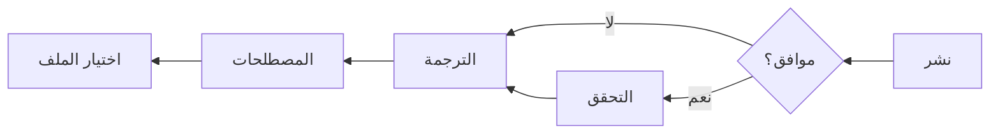
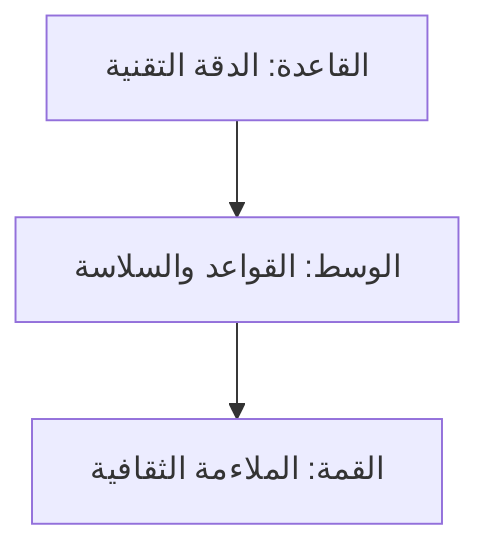

# 🇸🇦 Arabic (ar) Translation Guide

**Version 5.0 - Comprehensive Hack23 Edition**  
*Last Updated: January 2026*

---

## 📋 Quick Reference

| Attribute | Value |
|-----------|-------|
| **Language Code** | `ar` |
| **Locale** | `ar_SA` (Saudi), `ar_EG` (Egypt) |
| **Text Direction** | RTL (Right-to-Left) ← |
| **Currency** | SAR (ر.س), EGP (ج.م) |
| **Date Format** | `DD/MM/YYYY` or `١٥ يناير ٢٠٢٦` |
| **Numerals** | Arabic-Indic (٠١٢٣٤٥٦٧٨٩) or Western |

---

## 🔄 Visual Translation Workflow

## 🔄 Quality Standards Pyramid

---

## 📚 Comprehensive Vocabulary Reference

### 🔥 Brand & Key Entities (Never Translate)

| English | Arabic | Notes |
|---------|--------|-------|
| Hack23 | Hack23 | Company name – never translate |
| Hack23 AB | Hack23 AB | Swedish company designation |
| Citizen Intelligence Agency | Citizen Intelligence Agency | Project name – keep English |
| CIA Compliance Manager | CIA Compliance Manager | Product name – keep English |
| Black Trigram | Black Trigram | Game product – keep English |
| 흑괘 | 흑괘 | Korean name for Black Trigram |
| James Pether Sörling | James Pether Sörling | Founder name – keep original |
| CISSP | CISSP | Certification – never translate |
| CISM | CISM | Certification – never translate |
| GitHub | GitHub | Platform name |
| LinkedIn | LinkedIn | Platform name |

### 🏢 Hack23 Business & Services

| English | Arabic | Notes |
|---------|--------|-------|
| Cybersecurity Consulting Sweden | استشارات الأمن السيبراني في السويد | Main tagline |
| Public ISMS | نظام إدارة أمن المعلومات العام | Core differentiator |
| Security Architecture | هندسة الأمن | |
| Security Strategy | استراتيجية الأمن | |
| Cloud Security | أمن السحابة | |
| DevSecOps | DevSecOps | Keep English |
| Secure Development | التطوير الآمن | |
| Code Quality | جودة الشفرة | |
| Compliance & Regulatory | الامتثال والتنظيم | |
| Open Source Security | أمن المصدر المفتوح | |
| Security Culture | ثقافة الأمن | |
| Security Training | التدريب الأمني | |
| Full-Stack Security | الأمن الشامل | |
| Current Practitioner | ممارس حالي | Value proposition |
| Transparent Security | الأمن الشفاف | |
| Developer-Friendly Security | أمن صديق للمطورين | |
| OSPO | OSPO | Open Source Program Office |
| Gothenburg | غوتنبرغ | City in Sweden |
| Sweden | السويد | |

### 🎮 Black Trigram Game Vocabulary

| English | Arabic | Notes |
|---------|--------|-------|
| Precision Combat Simulator | محاكي القتال الدقيق | |
| Vital Points | النقاط الحيوية | |
| 70 Anatomical Vital Points | ٧٠ نقطة حيوية تشريحية | |
| Fighter Archetypes | أنماط المقاتلين | |
| Musa (Warrior) | موسا (المحارب) | |
| Amsalja (Assassin) | أمسالجا (القاتل) | |
| Hacker | هاكر | |
| Jeongbo (Intelligence) | جيونغبو (المخابرات) | |
| Jojik (Organization) | جوجيك (المنظمة) | |
| Korean Martial Arts | الفنون القتالية الكورية | |
| Taekkyeon | تايكيون | Korean martial art |
| Hapkido | هابكيدو | Korean martial art |
| Cultural Preservation | الحفاظ على التراث الثقافي | |
| Educational Gaming | الألعاب التعليمية | |
| Unity Game | لعبة يونيتي | |
| Steam | Steam | Platform name |
| itch.io | itch.io | Platform name |

### 🔍 Citizen Intelligence Agency Vocabulary

| English | Arabic | Notes |
|---------|--------|-------|
| Political Transparency | الشفافية السياسية | |
| OSINT Platform | منصة استخبارات المصادر المفتوحة | |
| Parliamentary Monitoring | مراقبة البرلمان | |
| Voting Records | سجلات التصويت | |
| Accountability Metrics | مقاييس المساءلة | |
| Open Data | البيانات المفتوحة | |
| Civic Technology | التكنولوجيا المدنية | |
| Swedish Parliament | البرلمان السويدي | |
| Data Visualization | تصور البيانات | |
| Political Analytics | التحليلات السياسية | |

### 🔐 CIA Compliance Manager Vocabulary

| English | Arabic | Notes |
|---------|--------|-------|
| Security Assessment Platform | منصة تقييم الأمن | |
| Business Impact Analysis | تحليل تأثير الأعمال | |
| Multi-Framework Compliance | الامتثال متعدد الأطر | |
| STRIDE Analysis | تحليل STRIDE | Threat model |
| Threat Modeling | نمذجة التهديدات | |
| Evidence Collection | جمع الأدلة | |
| Automated Compliance Reporting | تقارير الامتثال الآلية | |
| Risk Register | سجل المخاطر | |
| Controls Monitoring | مراقبة الضوابط | |
| CRA Assessment | تقييم CRA | Cyber Resilience Act |

### 🍎 Discordian Philosophy & ISMS Blog

| English | Arabic | Notes |
|---------|--------|-------|
| Think for Yourself | فكر بنفسك | Core motto |
| Question Authority | تساءل عن السلطة | |
| FNORD | FNORD | Never translate |
| Nothing is True | لا شيء حقيقي | |
| Everything is Permitted | كل شيء مباح | |
| Security Theater | مسرح الأمن | Fake security |
| Radical Transparency | الشفافية الجذرية | |
| Chapel Perilous | الكنيسة الخطرة | Keep English or translate |
| Operation Mindfuck | عملية تضليل العقل | |
| Illuminatus Trilogy | ثلاثية إلوميناتوس | |
| Eris | إيريس | Goddess of Chaos |
| Discordia | ديسكورديا | |
| Law of Fives | قانون الخمسة | |
| Sacred Geometry | الهندسة المقدسة | |
| Five-Layer Architecture | العمارة ذات الخمس طبقات | |
| Nation-State Surveillance | مراقبة الدول | |
| Crypto Backdoors | الأبواب الخلفية للتشفير | |
| Security Through Obscurity | الأمن من خلال الغموض | Anti-pattern |
| Information Hoarding | اكتناز المعلومات | |
| Knowledge Transparency | شفافية المعرفة | |
| Simon Moon | سايمون مون | Character reference |
| Hagbard Celine | هاغبارد سيلين | Character reference |
| George Dorn | جورج دورن | Character reference |

### 🧭 Navigation & UI Elements

| English | Arabic |
|---------|--------|
| Home | الرئيسية |
| About Us | من نحن |
| Services | الخدمات |
| Products | المنتجات |
| Projects | المشاريع |
| Contact | اتصل بنا |
| Blog | المدونة |
| Search | بحث |
| Menu | القائمة |
| Close | إغلاق |
| Back | رجوع |
| Next | التالي |
| Previous | السابق |
| Submit | إرسال |
| Cancel | إلغاء |
| **Expand All** | **توسيع الكل** |
| **Collapse All** | **طي الكل** |
| Download | تنزيل |
| Read More | اقرأ المزيد |
| View Details | عرض التفاصيل |
| Privacy Policy | سياسة الخصوصية |
| Terms of Service | شروط الخدمة |
| Copyright | حقوق النشر |
| Sitemap | خريطة الموقع |
| FAQ | الأسئلة الشائعة |
| Why Hack23 | لماذا Hack23 |
| Accessibility Statement | بيان إمكانية الوصول |
| Language | اللغة |
| Share | مشاركة |
| Print | طباعة |
| Save | حفظ |
| Edit | تحرير |
| Delete | حذف |
| Confirm | تأكيد |
| Loading | جاري التحميل |
| Error | خطأ |
| Success | نجاح |
| Warning | تحذير |

### 🔐 CIA Triad & Core Security Principles

| English | Arabic | Notes |
|---------|--------|-------|
| CIA Triad | ثلاثية CIA | |
| CIA+ Framework | إطار CIA+ | Extended framework |
| **Confidentiality** | **السرية** | Data protection |
| **Integrity** | **السلامة** | Data accuracy |
| **Availability** | **التوافر** | System uptime |
| Non-Repudiation | عدم الإنكار | |
| Authentication | المصادقة | |
| Authorization | التفويض | |

### 🔒 Security & Cybersecurity Terminology

| English | Arabic | Notes |
|---------|--------|-------|
| Cybersecurity | الأمن السيبراني | |
| Information Security | أمن المعلومات | |
| ISMS | نظام إدارة أمن المعلومات | |
| Security Policy | سياسة الأمن | |
| Risk Management | إدارة المخاطر | |
| Risk Assessment | تقييم المخاطر | |
| Threat | تهديد | |
| Vulnerability | ثغرة أمنية | |
| Exploit | استغلال | |
| Patch | تصحيح أمني | |
| Firewall | جدار الحماية | |
| Encryption | التشفير | |
| Decryption | فك التشفير | |
| Access Control | التحكم في الوصول | |
| Multi-Factor Authentication (MFA) | المصادقة متعددة العوامل | |
| Single Sign-On (SSO) | تسجيل الدخول الموحد | |
| Phishing | التصيد الاحتيالي | |
| Ransomware | برامج الفدية | |
| Malware | البرمجيات الخبيثة | |
| Zero Trust | الثقة المعدومة | |
| Defense in Depth | الدفاع في العمق | |
| Least Privilege | أقل امتياز | |
| Incident Response | الاستجابة للحوادث | |
| Data Breach | خرق البيانات | |
| Penetration Test | اختبار الاختراق | |
| Audit | تدقيق | |
| Compliance | الامتثال | |
| Governance | الحوكمة | |
| Security Awareness | الوعي الأمني | |
| Backup | النسخ الاحتياطي | |
| Disaster Recovery | التعافي من الكوارث | |
| Business Continuity | استمرارية الأعمال | |
| Supply Chain Security | أمن سلسلة التوريد | |
| SLSA Level 3 | SLSA المستوى 3 | Supply chain security |
| Container Security | أمن الحاويات | |
| Serverless Security | الأمن بدون خادم | |
| API Security | أمن واجهات البرمجة | |
| Endpoint Security | أمن نقاط النهاية | |

### 🏛️ Regulatory & Standards

| English | Arabic | Notes |
|---------|--------|-------|
| ISO 27001 | ISO 27001 | Keep as-is |
| ISO 27001:2022 | ISO 27001:2022 | |
| GDPR | اللائحة العامة لحماية البيانات | EU regulation |
| NIS2 | توجيه NIS2 | EU directive |
| NIST CSF | إطار NIST CSF | |
| CIS Controls | ضوابط CIS | |
| SOC2 | SOC2 | |
| HIPAA | HIPAA | US healthcare |
| EU Cyber Resilience Act (CRA) | قانون المرونة السيبرانية الأوروبي | |
| Annex A Controls | ضوابط الملحق أ | ISO 27001 |
| Statement of Applicability | بيان قابلية التطبيق | |

### 💼 Business & Professional Terms

| English | Arabic |
|---------|--------|
| Consulting | استشارات |
| Enterprise | مؤسسة |
| Strategy | استراتيجية |
| Certification | شهادة |
| Assessment | تقييم |
| Implementation | تنفيذ |
| Audit | تدقيق |
| Review | مراجعة |
| Gap Analysis | تحليل الفجوات |
| Roadmap | خارطة الطريق |
| Best Practices | أفضل الممارسات |
| Case Study | دراسة حالة |
| ROI | العائد على الاستثمار |
| KPI | مؤشر الأداء الرئيسي |
| SLA | اتفاقية مستوى الخدمة |
| Stakeholder | أصحاب المصلحة |
| Deliverable | التسليمات |
| Milestone | معلم المشروع |

### 📝 Blog Post Categories

| English | Arabic |
|---------|--------|
| Security Architecture | هندسة الأمن |
| ISMS Policies | سياسات نظام إدارة أمن المعلومات |
| Compliance Frameworks | أطر الامتثال |
| Threat Modeling | نمذجة التهديدات |
| Secure Development | التطوير الآمن |
| Cloud Security | أمن السحابة |
| Access Control | التحكم في الوصول |
| Cryptography | التشفير |
| Incident Response | الاستجابة للحوادث |
| Vulnerability Management | إدارة الثغرات |
| Asset Management | إدارة الأصول |
| Network Security | أمن الشبكات |
| Email Security | أمن البريد الإلكتروني |
| Physical Security | الأمن المادي |
| Mobile Device Security | أمن الأجهزة المحمولة |
| Remote Access Security | أمن الوصول عن بُعد |
| Monitoring & Logging | المراقبة والتسجيل |
| Security Metrics | مقاييس الأمن |
| Third Party Risk | مخاطر الأطراف الثالثة |
| Change Management | إدارة التغيير |

### 🏭 Industry-Specific Terms

| English | Arabic |
|---------|--------|
| Investment & FinTech | الاستثمار والتكنولوجيا المالية |
| Betting & Gaming | المراهنات والألعاب |
| Cannabis Security | أمن القنب |
| Healthcare | الرعاية الصحية |
| Government | الحكومة |
| Critical Infrastructure | البنية التحتية الحيوية |
| Financial Services | الخدمات المالية |
| E-commerce | التجارة الإلكترونية |

---

## 🔤 RTL-Specific Guidelines

### Technical Requirements
- Set `dir="rtl"` on `<html>` element
- Use CSS `direction: rtl;` for proper text flow
- Mirror UI layouts (navigation, buttons, icons)
- Ensure proper number handling (can use Western or Arabic-Indic)

### Mixed Content Rules
- English terms (brand names, technical acronyms) remain LTR
- Use `<bdo dir="ltr">` or `` for embedded LTR content
- URLs and email addresses remain LTR

### Punctuation
- Use Arabic punctuation marks where appropriate
- Question mark: ؟
- Comma: ،
- Semicolon: ؛

---

## ✅ Translation Checklist

- [ ] `<html lang="ar" dir="rtl">` attributes set
- [ ] `<title>` translated
- [ ] `<meta name="description">` translated
- [ ] `og:locale` set to `ar_SA` or `ar_EG`
- [ ] All hreflang tags present (14 languages)
- [ ] Navigation menu translated and RTL-aligned
- [ ] Footer translated
- [ ] Brand names kept in English
- [ ] Technical terms verified for Arabic equivalents
- [ ] RTL layout verified in browser
- [ ] No broken LTR text fragments

---

## 📝 Notes

- Use **Modern Standard Arabic (MSA)** for broad comprehension
- Keep technical terms where Arabic equivalents are unclear
- Test RTL rendering thoroughly before deployment
- Consider regional variations (Saudi vs Egyptian Arabic)
- Verify all navigation mirrors properly for RTL

---

*٢٣ FNORD ٥*
