# 🇸🇦 Arabic Translation Guide 🌙

> **Professional Cybersecurity Translation Guide**  
> *For InfoSec, Cybersecurity, and Discordian Philosophy Documentation*

## 📋 Quick Reference

| Attribute | Value |
|-----------|-------|
| **Language** | Arabic (ar) |
| **Flag & Icon** | 🇸🇦 🌙 |
| **Locale** | ar_AR |
| **Currency** | SAR (ر.س) |
| **Direction** | RTL (Right-to-Left) ← |
| **Files Translated** | 62/96 (64.6%) |
| **Guide Version** | 3.0 (Publication Edition) |
| **Last Updated** | December 2025 |

## 🎯 Translation Philosophy

### The Discordian Approach to Translation

Translation is not mere word replacement—it's the art of preserving meaning, tone, philosophy, and cultural context while adapting to a new linguistic framework. This guide embodies the Discordian principle: **"Think for Yourself"** — use these guidelines as a starting point, but apply critical thinking and cultural awareness.

### Core Translation Principles

#### 1. 💼 Professional Business Tone
- Write for **C-level executives** and **technical decision-makers**
- Maintain **formal business register** appropriate for cybersecurity consulting
- Balance **technical precision** with **clear communication**
- Use **industry-standard terminology** recognized in Arabic

#### 2. 🎯 Technical Consistency
- **Preserve English terms** where widely accepted internationally:
  - DevSecOps, CI/CD, GitHub, Docker, Kubernetes, API, REST
- **Use established Arabic terminology** for cybersecurity concepts
- **Maintain consistency** across all translated pages
- **Document translation choices** for complex or ambiguous terms

#### 3. 🌍 Cultural Adaptation
- **Adapt examples** to local market context and business practices
- **Reference local regulations**: GDPR, NIS2, and Arabic-specific laws
- **Cite local authorities**: National cybersecurity agencies
- **Adjust humor and references** to cultural norms while preserving Discordian spirit

#### 4. 🎭 Discordian Style Preservation
- **"Think for Yourself"** → Translate philosophy authentically
- **FNORD references** → Preserve where culturally appropriate, adapt if needed
- **"23 FNORD 5"** → Keep signature as cultural marker
- **Philosophical concepts** → Adapt to local philosophical traditions

## 📊 Visual Translation Workflow

```mermaid
%%{init: {'theme':'base', 'themeVariables': {'primaryColor':'#4CAF50','secondaryColor':'#2196F3','tertiaryColor':'#FFC107','fontSize':'14px'}}}%%
graph LR
    subgraph "📚 Arabic Translation Workflow"
        A["🎯 Start<br/>Select File"] --> B["📖 Read Guide<br/>Review Terminology"]
        B --> C["✍️ Translate<br/>Content"]
        C --> D["🔍 QA Check<br/>Validate"]
        D --> E{✅ Pass?}
        E -->|Yes| F["🎉 Complete<br/>Publish"]
        E -->|No| C
        
        style A fill:#2196F3,stroke:#1565C0,color:#fff
        style B fill:#9C27B0,stroke:#6A1B9A,color:#fff
        style C fill:#FF9800,stroke:#F57C00,color:#fff
        style D fill:#00BCD4,stroke:#00838F,color:#fff
        style E fill:#FFC107,stroke:#F57C00,color:#000
        style F fill:#4CAF50,stroke:#2E7D32,color:#fff
    end
```



## 🏆 Quality Standards Pyramid

```mermaid
%%{init: {'theme':'base', 'themeVariables': {'primaryColor':'#4CAF50','fontSize':'14px'}}}%%
graph TB
    subgraph "🏆 Arabic Translation Quality Pyramid"
        A["👑 Excellence<br/>Native Speaker Review"]
        B["✅ Professional<br/>Technical Accuracy"]
        C["📋 Complete<br/>Full Translation"]
        D["🔧 Infrastructure<br/>HTML & Meta Tags"]
        
        D --> C
        C --> B
        B --> A
        
        style A fill:#4CAF50,stroke:#2E7D32,color:#fff,stroke-width:3px
        style B fill:#8BC34A,stroke:#558B2F,color:#fff,stroke-width:2px
        style C fill:#FFC107,stroke:#F57C00,color:#000,stroke-width:2px
        style D fill:#9E9E9E,stroke:#616161,color:#fff
    end
```



## 📚 Comprehensive Terminology Reference

### 🧭 Navigation & UI Elements

Essential interface terms that appear across all pages:

| English | Arabic | Notes |
|---------|------|-------|
| Home | *[Verify from files]* | Main navigation |
| Blog | *[Verify from files]* | |
| Services | *[Verify from files]* | |
| Products | *[Verify from files]* | |
| Documentation | *[Verify from files]* | |
| Features | *[Verify from files]* | |
| About | *[Verify from files]* | |
| Contact | *[Verify from files]* | |
| Learn More | *[Verify from files]* | CTA button |
| Get Started | *[Verify from files]* | CTA button |
| Read More | *[Verify from files]* | Blog/article link |
| Download | *[Verify from files]* | Action button |

### 🔐 Cybersecurity Fundamentals

Core concepts that form the foundation of information security:

| English | Arabic | Context | ISO/Framework |
|---------|------|---------|---------------|
| Information Security Management System (ISMS) | *[Verify from files]* | Management framework | ISO 27001 |
| CIA Triad | *[Verify from files]* | Core security model | Foundational |
| Confidentiality | *[Verify from files]* | CIA component | ISO 27001 |
| Integrity | *[Verify from files]* | CIA component | ISO 27001 |
| Availability | *[Verify from files]* | CIA component | ISO 27001 |
| ISO 27001 | ISO 27001 | International standard | Keep as-is |
| GDPR | GDPR | EU regulation | Keep acronym |
| NIS2 | NIS2 | EU directive | Keep acronym |
| Compliance | *[Verify from files]* | Regulatory adherence | |
| Risk Assessment | *[Verify from files]* | Risk analysis | ISO 27005 |
| Threat Modeling | *[Verify from files]* | Security design | STRIDE, PASTA |
| Security Policy | *[Verify from files]* | Governance document | |
| Data Protection | *[Verify from files]* | Privacy safeguards | GDPR |
| Access Control | *[Verify from files]* | Authorization | ISO 27001 A.9 |
| Incident Response | *[Verify from files]* | Security events | ISO 27035 |
| Business Continuity | *[Verify from files]* | Operations continuity | ISO 22301 |
| Disaster Recovery | *[Verify from files]* | Recovery procedures | BC/DR |
| Vulnerability Management | *[Verify from files]* | Weakness handling | CVE, CVSS |
| Security Awareness | *[Verify from files]* | User education | ISO 27001 A.7 |
| Zero Trust | *[Verify from files]* | Security model | Modern approach |

### 🔧 DevSecOps & Technical Terms

Development and operational security terminology:

| English | Arabic | Notes | Context |
|---------|------|-------|---------|
| DevSecOps | DevSecOps | Keep term | Industry standard |
| CI/CD | CI/CD | Keep acronym | Continuous Integration/Delivery |
| Pipeline | *[Verify from files]* | | Build automation |
| Workflow | *[Verify from files]* | | Process automation |
| Repository | Repository | Usually kept | Git, GitHub |
| Deployment | *[Verify from files]* | | Release process |
| Container | *[Verify from files]* | | Docker |
| Orchestration | *[Verify from files]* | | Kubernetes |
| Infrastructure as Code | *[Verify from files]* | IaC | Terraform, Ansible |
| Security Automation | *[Verify from files]* | | Automated security |
| Static Analysis | *[Verify from files]* | SAST | Code scanning |
| Dynamic Analysis | *[Verify from files]* | DAST | Runtime testing |
| Dependency Scanning | *[Verify from files]* | SCA | Supply chain |
| Secret Management | *[Verify from files]* | | Credentials |

### 📋 ISMS Policy Terminology

ISO 27001 and related policy documents:

| English | Arabic | ISO Reference | Policy Type |
|---------|------|---------------|-------------|
| Access Control Policy | *[Verify from files]* | ISO 27001 A.9 | Core |
| Business Continuity Plan (BCP) | *[Verify from files]* | ISO 22301 | Core |
| Disaster Recovery Plan (DRP) | *[Verify from files]* | Part of BCP | Core |
| Information Asset Management | *[Verify from files]* | ISO 27001 A.8 | Core |
| Incident Response Policy | *[Verify from files]* | ISO 27035 | Core |
| Risk Management Policy | *[Verify from files]* | ISO 27005 | Core |
| Acceptable Use Policy | *[Verify from files]* | | Supporting |
| Data Classification Policy | *[Verify from files]* | | Supporting |
| Third Party Management | *[Verify from files]* | ISO 27001 A.15 | Supporting |
| Change Management | *[Verify from files]* | ITIL/ISO 27001 | Supporting |
| Backup and Recovery | *[Verify from files]* | | Supporting |
| Cryptography Policy | *[Verify from files]* | ISO 27001 A.10 | Technical |
| Network Security | *[Verify from files]* | ISO 27001 A.13 | Technical |
| Physical Security | *[Verify from files]* | ISO 27001 A.11 | Technical |
| Cloud Security | *[Verify from files]* | | Technical |
| Mobile Device Management | *[Verify from files]* | | Technical |
| Remote Access Policy | *[Verify from files]* | | Technical |
| Security Training Policy | *[Verify from files]* | ISO 27001 A.7 | Supporting |

### 🎯 Industry-Specific Terminology

#### 🎲 Gaming & Betting Industry

| English | Arabic | Context | Regulatory |
|---------|------|---------|------------|
| Gaming operator | *[Verify from files]* | Casino/betting operator | Licensed entity |
| Online casino | *[Verify from files]* | Digital gaming | iGaming |
| Betting platform | *[Verify from files]* | Sports betting | Technology |
| Gambling license | *[Verify from files]* | Regulatory requirement | Compliance |
| Gaming authority | *[Verify from files]* | Regulatory body | Government |
| Player protection | *[Verify from files]* | Responsible gaming | Consumer safety |
| Anti-money laundering (AML) | *[Verify from files]* | Financial crime | Compliance |
| Know Your Customer (KYC) | *[Verify from files]* | Identity verification | Compliance |

#### 🌿 Cannabis Industry

| English | Arabic | Context | Regulatory |
|---------|------|---------|------------|
| Cannabis | *[Verify from files]* | Plant/product | Legal terminology |
| Dispensary | *[Verify from files]* | Retail location | Licensed facility |
| Cultivation | *[Verify from files]* | Growing operations | Production |
| Medical cannabis | *[Verify from files]* | Healthcare use | Prescription |
| Recreational cannabis | *[Verify from files]* | Adult use | Consumer |
| Seed-to-sale tracking | *[Verify from files]* | Supply chain | Compliance system |
| Compliance management | *[Verify from files]* | Regulatory adherence | Operations |
| Licensed producer | *[Verify from files]* | Authorized grower | Regulatory status |

#### 💰 Investment & Fintech

| English | Arabic | Context | Regulatory |
|---------|------|---------|------------|
| Investment firm | *[Verify from files]* | Financial services | Asset management |
| Financial services | *[Verify from files]* | Banking, investment | Industry |
| Asset management | *[Verify from files]* | Portfolio management | Services |
| Portfolio management | *[Verify from files]* | Investment strategy | Services |
| Regulatory compliance | *[Verify from files]* | Financial regulation | Legal |
| Fiduciary duty | *[Verify from files]* | Legal obligation | Professional |
| Risk management | *[Verify from files]* | Financial risk | Process |
| Trading platform | *[Verify from files]* | Exchange system | Technology |

## 🏛️ Arabic Regulatory & Standards Framework

### National Regulatory Bodies

**Data Protection:** Various MENA Authorities  
**Cybersecurity:** National Cyber Agencies  


### International Standards & Frameworks

- **ISO 27001**: Information Security Management System
- **ISO 27002**: Information Security Controls
- **ISO 27005**: Information Security Risk Management
- **ISO 22301**: Business Continuity Management
- **ISO 27035**: Incident Security Management
- **NIST CSF**: Cybersecurity Framework
- **CIS Controls**: Critical Security Controls
- **GDPR**: General Data Protection Regulation (EU)
- **NIS2**: Network and Information Security Directive (EU)

## 🔄 Complete Translation Process

```mermaid
%%{init: {'theme':'base', 'themeVariables': {'primaryColor':'#2196F3','fontSize':'14px'}}}%%
graph TD
    subgraph "🔄 Translation Process Flow"
        Start["🚀 Start Translation"] --> Prep["📋 Preparation<br/>• Read guide<br/>• Review terminology<br/>• Check status file"]
        Prep --> Trans["✍️ Translation<br/>• Copy English file<br/>• Update meta tags<br/>• Translate content"]
        Trans --> QA["🔍 Quality Assurance<br/>• HTML validation<br/>• Hreflang check<br/>• Content review"]
        QA --> Test["🧪 Testing<br/>• Cross-browser<br/>• Mobile responsive<br/>• Accessibility"]
        Test --> Review["👥 Peer Review<br/>• Native speaker<br/>• Technical accuracy<br/>• Cultural fit"]
        Review --> Decision{✅ Approved?}
        Decision -->|Yes| Publish["🎉 Publish<br/>Update status file"]
        Decision -->|No| Revise["📝 Revise<br/>Address feedback"]
        Revise --> Trans
        
        style Start fill:#2196F3,stroke:#1565C0,color:#fff
        style Prep fill:#9C27B0,stroke:#6A1B9A,color:#fff
        style Trans fill:#FF9800,stroke:#F57C00,color:#fff
        style QA fill:#00BCD4,stroke:#00838F,color:#fff
        style Test fill:#FFC107,stroke:#F57C00,color:#000
        style Review fill:#673AB7,stroke:#4527A0,color:#fff
        style Decision fill:#F44336,stroke:#C62828,color:#fff
        style Publish fill:#4CAF50,stroke:#2E7D32,color:#fff
        style Revise fill:#FF5722,stroke:#D84315,color:#fff
    end
```



## ✅ Step-by-Step Translation Workflow

### Step 1: 📋 Preparation & Planning

**Actions:**
1. ✅ Read this entire translation guide thoroughly
2. ✅ Review the `Arabic-Translation-Status.md` file
3. ✅ Identify high-priority files (marked ❌ Missing)
4. ✅ Gather reference materials:
   - Terminology glossaries
   - Previous translations
   - Industry style guides
5. ✅ Set up development environment:
   - Text editor with Arabic language support
   - HTML validator
   - Browser for testing

**Quality Gates:**
- [ ] Guide fully read and understood
- [ ] Priority files identified
- [ ] Reference materials collected
- [ ] Environment configured

### Step 2: ✍️ Translation Execution

**Actions:**
1. ✅ **Copy source file**: `page.html` → `page_ar.html`
2. ✅ **Update HTML attributes**:
   ```html
   <html lang="ar"dir="rtl">
   ```
3. ✅ **Translate meta tags**:
   - `<title>` element
   - `<meta name="description">`
   - `<meta property="og:title">`
   - `<meta property="og:description">`
   - `<meta property="og:locale">` → `ar_AR`
4. ✅ **Translate visible content**:
   - Headers and headings
   - Body text and paragraphs
   - Lists and bullet points
   - Buttons and CTAs
   - Form labels and placeholders
5. ✅ **Preserve technical elements**:
   - HTML tags and structure
   - CSS classes and IDs
   - JavaScript code (translate comments only)
   - Code examples (translate only comments)
   - URLs and links
6. ✅ **Update Schema.org**:
   ```json
   {
     "@context": "https://schema.org",
     "inLanguage": "ar"
   }
   ```
7. ✅ **Translate navigation & footer**:
   - Menu items
   - Footer links
   - Copyright notice
   - Contact information
8. ✅ **Add hreflang tags** (all 14 variants):
   ```html
   <link rel="alternate" hreflang="x-default" href="...">
   <link rel="alternate" hreflang="en" href="...">
   <link rel="alternate" hreflang="ar" href="...">
   <!-- Add all 13 language variants -->
   ```

**Translation Guidelines:**
- 🎯 **Accuracy first**: Technical precision over poetic flow
- 🌍 **Cultural context**: Adapt examples to local market
- 🔄 **Consistency**: Use established terminology from this guide
- 📝 **Documentation**: Note any uncertain translations for review

**Quality Gates:**
- [ ] All visible text translated
- [ ] Meta tags updated
- [ ] HTML structure preserved
- [ ] Schema.org localized
- [ ] Hreflang tags complete

### Step 3: 🔍 Quality Assurance & Validation

**Technical Validation:**
1. ✅ **HTML Validation**: https://validator.w3.org/
   - No errors or warnings
   - Well-formed markup
2. ✅ **Schema.org Validation**: https://validator.schema.org/
   - Structured data correct
   - `inLanguage` set to `ar`
3. ✅ **Hreflang Check**:
   - All 14 variants present
   - URLs correct and accessible
   - `x-default` points to English
4. ✅ **Accessibility**:
   - WCAG 2.1 AA compliant
   - Proper heading hierarchy
   - Alt text translated
   - ARIA labels localized

**Content Review:**
1. ✅ **Terminology consistency**:
   - Cross-reference with this guide
   - Check previous translations
   - Verify technical terms
2. ✅ **Grammar & spelling**:
   - Use Arabic spell checker
   - Review sentence structure
   - Check punctuation
3. ✅ **Cultural appropriateness**:
   - Examples relevant to Arabic market
   - Regulatory references correct
   - Humor and idioms adapted
4. ✅ **Discordian preservation**:
   - Philosophy maintained
   - FNORD references handled appropriately
   - "Think for Yourself" spirit intact

**Quality Gates:**
- [ ] HTML valid
- [ ] Schema.org valid
- [ ] Hreflang complete
- [ ] Accessibility compliant
- [ ] Terminology consistent
- [ ] Grammar correct
- [ ] Culturally appropriate

### Step 4: 🧪 Testing & Review

**Browser Testing:**
- ✅ Chrome/Chromium
- ✅ Firefox
- ✅ Safari (if available)
- ✅ Edge

**Device Testing:**
- ✅ Desktop (1920x1080+)
- ✅ Laptop (1366x768)
- ✅ Tablet (768x1024)
- ✅ Mobile (375x667, 414x896)

**Functionality Testing:**
- ✅ All links work
- ✅ Forms function correctly
- ✅ Navigation accessible
- ✅ Search works (if present)
- ✅ Images load properly
- ✅ RTL layout correct
- ✅ Text flows right-to-left
- ✅ Code blocks remain LTR

**Peer Review:**
1. ✅ **Native speaker review**:
   - Fluency and naturalness
   - Cultural appropriateness
   - Technical accuracy
2. ✅ **Technical review**:
   - Security terminology correct
   - Industry standards referenced properly
   - Compliance requirements met
3. ✅ **Final approval**:
   - All feedback addressed
   - Quality gates passed
   - Ready for publication

**Quality Gates:**
- [ ] Cross-browser tested
- [ ] Mobile responsive
- [ ] Links functional
- [ ] Native speaker approved
- [ ] Technical review passed
- [ ] Final approval obtained

## 🛠️ Technical Implementation Details

### HTML Structure Template

```html
<!DOCTYPE html>
<html lang="ar"dir="rtl">
<head>
    <meta charset="UTF-8">
    <meta name="viewport" content="width=device-width, initial-scale=1.0">
    
    <!-- Primary Meta Tags -->
    <title>[Page Title in Arabic]</title>
    <meta name="description" content="[Meta description in Arabic]">
    <meta name="keywords" content="[keywords, in, arabic]">
    
    <!-- Open Graph / Facebook -->
    <meta property="og:type" content="website">
    <meta property="og:url" content="https://hack23.com/[page]_ar.html">
    <meta property="og:title" content="[Title in Arabic]">
    <meta property="og:description" content="[Description in Arabic]">
    <meta property="og:locale" content="ar_AR">
    
    <!-- Twitter -->
    <meta property="twitter:card" content="summary_large_image">
    <meta property="twitter:url" content="https://hack23.com/[page]_ar.html">
    <meta property="twitter:title" content="[Title in Arabic]">
    <meta property="twitter:description" content="[Description in Arabic]">
    
    <!-- Hreflang Tags (All 14 variants) -->
    <link rel="alternate" hreflang="x-default" href="https://hack23.com/[page].html">
    <link rel="alternate" hreflang="en" href="https://hack23.com/[page].html">
    <link rel="alternate" hreflang="ar" href="https://hack23.com/[page]_ar.html">
    <link rel="alternate" hreflang="sv" href="https://hack23.com/[page]_sv.html">
    <link rel="alternate" hreflang="da" href="https://hack23.com/[page]_da.html">
    <link rel="alternate" hreflang="no" href="https://hack23.com/[page]_no.html">
    <link rel="alternate" hreflang="fi" href="https://hack23.com/[page]_fi.html">
    <link rel="alternate" hreflang="de" href="https://hack23.com/[page]_de.html">
    <link rel="alternate" hreflang="nl" href="https://hack23.com/[page]_nl.html">
    <link rel="alternate" hreflang="fr" href="https://hack23.com/[page]_fr.html">
    <link rel="alternate" hreflang="es" href="https://hack23.com/[page]_es.html">
    <link rel="alternate" hreflang="ja" href="https://hack23.com/[page]_ja.html">
    <link rel="alternate" hreflang="zh" href="https://hack23.com/[page]_zh.html">
    <link rel="alternate" hreflang="ko" href="https://hack23.com/[page]_ko.html">
    <link rel="alternate" hreflang="ar" href="https://hack23.com/[page]_ar.html">
    <link rel="alternate" hreflang="he" href="https://hack23.com/[page]_he.html">
    
    <!-- Canonical -->
    <link rel="canonical" href="https://hack23.com/[page]_ar.html">
    
    <!-- Schema.org Structured Data -->
    <script type="application/ld+json">
    {
        "@context": "https://schema.org",
        "@type": "WebPage",
        "name": "[Page Name in Arabic]",
        "description": "[Description in Arabic]",
        "inLanguage": "ar",
        "url": "https://hack23.com/[page]_ar.html",
        "isPartOf": {
            "@type": "WebSite",
            "name": "Hack23",
            "url": "https://hack23.com",
            "inLanguage": "ar"
        },
        "breadcrumb": {
            "@type": "BreadcrumbList",
            "itemListElement": [
                {
                    "@type": "ListItem",
                    "position": 1,
                    "name": "[Home in Arabic]",
                    "item": "https://hack23.com/index_ar.html"
                },
                {
                    "@type": "ListItem",
                    "position": 2,
                    "name": "[Page Name in Arabic]",
                    "item": "https://hack23.com/[page]_ar.html"
                }
            ]
        }
    }
    </script>
</head>
<body>
    <!-- Translated content here -->
</body>
</html>
```

### RTL (Right-to-Left) Implementation

#### CSS Requirements

```css
/* RTL Layout for Arabic */
[lang="ar"] {
    direction: rtl;
    text-align: right;
}

/* Keep code blocks LTR */
[lang="ar"] pre,
[lang="ar"] code,
[lang="ar"] .code-block {
    direction: ltr;
    text-align: left;
}

/* Mirror margins and padding automatically */
[lang="ar"] .container {
    /* Margins flip automatically in RTL */
}

/* Font family for proper rendering */
[lang="ar"] body {
    font-family: 'Noto Sans Arabic', 'Noto Sans', sans-serif;
}
```

#### RTL Testing Checklist

- [ ] Text flows right-to-left
- [ ] Menus and navigation align right
- [ ] Forms align correctly
- [ ] Images and icons mirror appropriately
- [ ] Code blocks remain LTR
- [ ] Numbers and technical terms read correctly
- [ ] Punctuation positioned correctly
- [ ] Mixed LTR/RTL content handles properly

## 📊 Quality Assurance Standards

### Professional Translation Requirements

**Fluency & Naturalness:**
- ✅ Sounds native, not translated
- ✅ Idiomatic expressions used appropriately
- ✅ Sentence structure follows Arabic norms
- ✅ Flow is smooth and readable

**Technical Accuracy:**
- ✅ Cybersecurity terms correct
- ✅ Technical concepts preserved
- ✅ Industry standards referenced properly
- ✅ No ambiguity in security-critical content

**Cultural Appropriateness:**
- ✅ Examples relevant to Arabic market
- ✅ Regulatory references correct
- ✅ Business context adapted
- ✅ Humor and tone appropriate

**Consistency:**
- ✅ Terminology matches this guide
- ✅ Style consistent across pages
- ✅ Formatting uniform
- ✅ Voice and tone maintained

### Translation Quality Metrics

| Level | Description | Characteristics |
|-------|-------------|-----------------|
| **🏆 Excellence** | Native-quality | Perfect fluency, zero errors, culturally perfect |
| **✅ Professional** | Production-ready | Minor imperfections, technically accurate |
| **⚡ Good** | Usable | Some awkwardness, meaning clear |
| **⚠️  Adequate** | Infrastructure | HTML/meta tags correct, content needs work |
| **❌ Poor** | Needs revision | Errors, unclear meaning, technical issues |

**Target:** ✅ Professional or above for all published content

## 🔍 Validation & Testing Procedures

### Automated Validation Tools

1. **HTML Validator**: https://validator.w3.org/
   - Zero errors required
   - Warnings acceptable if justified

2. **Schema.org Validator**: https://validator.schema.org/
   - All structured data must validate
   - `inLanguage` must be `ar`

3. **Hreflang Validator**: Google Search Console
   - All 14 variants must be correct
   - No broken links

4. **Accessibility Checker**: WAVE or axe DevTools
   - WCAG 2.1 AA compliant
   - No critical or serious issues

5. **Lighthouse Audit**: Chrome DevTools
   - Accessibility: 95+ score
   - SEO: 95+ score
   - Best Practices: 90+ score

### Manual Testing Checklist

**Content Review:**
- [ ] All text translated (no English remains)
- [ ] Headers and navigation translated
- [ ] Footer and copyright translated
- [ ] Alt text for images translated
- [ ] Form labels and placeholders translated
- [ ] Error messages translated
- [ ] Meta tags translated

**Technical Review:**
- [ ] HTML well-formed
- [ ] lang="ar" set correctly
- [ ] og:locale = ar_AR
- [ ] All 14 hreflang tags present
- [ ] Schema.org inLanguage = "ar"
- [ ] Canonical URL correct
- [ ] No broken links

**Functionality Review:**
- [ ] All links work
- [ ] Navigation functional
- [ ] Forms submit correctly
- [ ] Search works (if present)
- [ ] Mobile responsive
- [ ] Cross-browser compatible
- [ ] RTL layout correct
- [ ] Code blocks remain LTR

**Quality Review:**
- [ ] Professional translation quality
- [ ] Terminology consistent with guide
- [ ] Grammar and spelling correct
- [ ] Cultural references appropriate
- [ ] Technical accuracy verified
- [ ] Native speaker approved

## 📝 Best Practices & Guidelines

### Do's ✅

**Translation:**
- ✅ Use this guide's terminology consistently
- ✅ Preserve HTML structure and functionality
- ✅ Test thoroughly before marking complete
- ✅ Document uncertain translation choices
- ✅ Get native speaker review
- ✅ Update guide with new terminology

**Technical:**
- ✅ Validate all HTML and Schema.org
- ✅ Include all 14 hreflang variants
- ✅ Set correct lang and og:locale attributes
- ✅ Test cross-browser and mobile
- ✅ Check accessibility compliance
- ✅ Verify all links work

**Cultural:**
- ✅ Adapt examples to local context
- ✅ Reference local regulations
- ✅ Use culturally appropriate humor
- ✅ Maintain Discordian philosophy
- ✅ Respect cultural sensitivities
- ✅ Balance universal and local

### Don'ts ❌

**Translation:**
- ❌ Use machine translation without review
- ❌ Skip validation and testing
- ❌ Ignore cultural context
- ❌ Use informal or casual language
- ❌ Translate code examples (only comments)
- ❌ Change technical accuracy for flow

**Technical:**
- ❌ Change HTML structure or CSS
- ❌ Remove or modify hreflang tags
- ❌ Skip Schema.org localization
- ❌ Ignore accessibility requirements
- ❌ Break existing functionality
- ❌ Use incorrect lang attributes

**Cultural:**
- ❌ Direct word-for-word translation
- ❌ Use offensive or inappropriate content
- ❌ Ignore local regulations
- ❌ Force English idioms into Arabic
- ❌ Lose Discordian philosophy
- ❌ Over-localize universal concepts

## 📚 Additional Resources & References

### Translation Resources

**Arabic Language:**
- **Dictionary**: [Add recommended Arabic dictionary]
- **Grammar**: [Add Arabic grammar reference]
- **Style Guide**: [Add Arabic business writing guide]

**Cybersecurity Terminology:**
- **NIST Glossary**: https://csrc.nist.gov/glossary
- **ISO 27000 Series**: https://www.iso.org/isoiec-27001-information-security.html
- **SANS Glossary**: https://www.sans.org/security-resources/glossary-of-terms/

**Related Documentation:**
- **Translation Status**: `Arabic-Translation-Status.md`
- **Master Documentation**: `TRANSLATION_DOCUMENTATION_README.md`
- **English Source Files**: `*.html` (base files)
- **Arabic Translation Files**: `*_ar.html` (62 files)

### Validation Tools

- **HTML Validator**: https://validator.w3.org/
- **Schema.org Validator**: https://validator.schema.org/
- **Lighthouse**: Chrome DevTools
- **WAVE**: https://wave.webaim.org/
- **axe DevTools**: Browser extension
- **Google Search Console**: Hreflang validation

## 🤝 Contributing to This Guide

### How to Improve This Guide

When adding new translations or discovering better terminology:

1. **Update Terminology Tables**:
   - Replace `*[Verify from files]*` with actual translation
   - Add context and notes where helpful
   - Reference ISO standards or frameworks

2. **Document Translation Choices**:
   - Explain reasoning for complex terms
   - Note regional variations
   - Cite sources if available

3. **Add Examples**:
   - Provide sample translations
   - Show before/after comparisons
   - Highlight common mistakes

4. **Improve Processes**:
   - Suggest workflow improvements
   - Add useful tools or resources
   - Share tips and tricks

5. **Update Status**:
   - Mark files as complete in Translation-Status.md
   - Update file counts and percentages
   - Note quality improvements

### Maintaining Translation Consistency

**Version Control:**
- Document guide version (currently 3.0)
- Note major changes in updates
- Keep changelog of terminology additions

**Team Collaboration:**
- Share translation decisions
- Review each other's work
- Build shared terminology database
- Maintain style consistency

**Continuous Improvement:**
- Learn from feedback
- Update based on user experience
- Incorporate new cybersecurity terms
- Refine cultural adaptations

## 🎓 Discordian Translation Philosophy

### "Think for Yourself" in Practice

This guide provides structure, but **you** are the translator. Apply critical thinking:

- **Question assumptions**: Is this the best Arabic term?
- **Consider context**: What does this mean to a Arabic reader?
- **Preserve intent**: Does my translation convey the original purpose?
- **Adapt wisdom**: How can I make Discordian philosophy resonate in Arabic culture?

### The Five FNORDS of Translation

1. **FNORD of Fidelity**: Stay true to original meaning
2. **FNORD of Fluency**: Sound natural in target language
3. **FNORD of Format**: Preserve technical structure
4. **FNORD of Fun**: Maintain Discordian humor
5. **FNORD of Feedback**: Seek and incorporate review

### Remember

> **"All statements are true in some sense, false in some sense, meaningless in some sense, true and false in some sense, true and meaningless in some sense, false and meaningless in some sense, and true and false and meaningless in some sense."**
> — Principia Discordia

Translation is both art and science. Use this guide wisely, think for yourself, and create excellent Arabic content for the global cybersecurity community.

**23 FNORD 5**

---

## 📋 Quick Reference Summary

**Guide Information:**
- **Language**: Arabic (ar)
- **Version**: 3.0 (Publication Edition)
- **Last Updated**: December 2025
- **Files**: 62/96 (64.6%)
- **Status**: ⚠️ In Progress

**Key Attributes:**
- Locale: ar_AR
- Direction: RTL ←
- Currency: SAR (ر.س)

**Essential Links:**
- Status: `Arabic-Translation-Status.md`
- Documentation: `TRANSLATION_DOCUMENTATION_README.md`
- Files: `*_ar.html`

**Contact:**
- Issues: https://github.com/Hack23/homepage/issues
- Discussions: https://github.com/Hack23/homepage/discussions

---

*This guide is part of the Hack23 Open Translation Initiative for Cybersecurity Documentation.*  
*Licensed under Creative Commons BY-SA 4.0 for public use and adaptation.*  
*Contributions welcome via GitHub pull requests.*

**🌍 Making cybersecurity knowledge accessible worldwide, one translation at a time.**
