# 🇸🇦 Arabic (ar) Translation Guide

**Version 6.0 - Expanded Hack23 Edition**  
*Last Updated: January 2026*

---

## 📋 Quick Reference

| Attribute | Value |
|-----------|-------|
| **Language Code** | `ar` |
| **Locale** | `ar_SA` (Saudi), `ar_EG` (Egypt) |
| **Text Direction** | RTL (Right-to-Left) ← |
| **Currency** | SAR (ر.س), EGP (ج.م) |
| **Date Format** | `DD/MM/YYYY` or `١٥ يناير ٢٠٢٦` |
| **Numerals** | Arabic-Indic (٠١٢٣٤٥٦٧٨٩) or Western |

---

## 🔄 Visual Translation Workflow

```mermaid
graph RL
    F[نشر] --> E{موافق؟}
    E -->|نعم| D[التحقق]
    E -->|لا| C
    D --> C[الترجمة]
    C --> B[المصطلحات]
    B --> A[اختيار الملف]
```

## 🔄 Quality Standards Pyramid

```mermaid
graph TD
    L1[القاعدة: الدقة التقنية]
    L2[الوسط: القواعد والسلاسة]
    L3[القمة: الملاءمة الثقافية]
    L1 --> L2 --> L3
```

---

## 📚 Comprehensive Vocabulary Reference

### 🔥 Brand & Key Entities (Never Translate)

| English | Arabic | Notes |
|---------|--------|-------|
| Hack23 | Hack23 | Company name – never translate |
| Hack23 AB | Hack23 AB | Swedish company designation |
| Citizen Intelligence Agency | Citizen Intelligence Agency | Project name – keep English |
| CIA Compliance Manager | CIA Compliance Manager | Product name – keep English |
| Black Trigram | Black Trigram | Game product – keep English |
| 흑괘 | 흑괘 | Korean name for Black Trigram |
| 黑卦 | 黑卦 | Chinese name for Black Trigram |
| James Pether Sörling | James Pether Sörling | Founder name – keep original |
| CISSP | CISSP | Certification – never translate |
| CISM | CISM | Certification – never translate |
| GitHub | GitHub | Platform name |
| LinkedIn | LinkedIn | Platform name |
| OpenSSF | OpenSSF | Open Source Security Foundation |
| CII Best Practices | CII Best Practices | Badge name |
| Riksdag | Riksdag | Swedish Parliament |

### 👔 Job Titles & Professional Roles

| English | Arabic | Notes |
|---------|--------|-------|
| CEO / Chief Executive Officer | الرئيس التنفيذي | |
| Founder | المؤسس | |
| CEO/Founder | الرئيس التنفيذي/المؤسس | |
| Application Security Officer | مسؤول أمن التطبيقات | |
| Information Security Officer | مسؤول أمن المعلومات | |
| Senior Security Architect | كبير مهندسي الأمن | |
| Cloud Architect | مهندس السحابة | |
| Security Consultant | مستشار أمني | |
| CISO | رئيس أمن المعلومات | Chief Information Security Officer |
| Compliance Officer | مسؤول الامتثال | |
| Risk Manager | مدير المخاطر | |
| IT Security Manager | مدير أمن تكنولوجيا المعلومات | |
| Security Auditor | مدقق الأمن | |
| Taekwondo Instructor | مدرب تايكواندو | |
| System Developer | مطور أنظمة | |
| Software Engineer | مهندس برمجيات | |
| J2EE Developer | مطور J2EE | |
| Unix Helpdesk | مكتب مساعدة يونكس | |
| Teaching Assistant | مساعد تدريس | |
| NBC Defence Group Leader | قائد مجموعة الدفاع NBC | Military role |

### 🏢 Hack23 Business & Services

| English | Arabic | Notes |
|---------|--------|-------|
| Cybersecurity Consulting Sweden | استشارات الأمن السيبراني في السويد | Main tagline |
| Public ISMS | نظام إدارة أمن المعلومات العام | Core differentiator |
| Open ISMS Transparency | شفافية نظام إدارة أمن المعلومات المفتوح | |
| Security Architecture & Strategy | هندسة الأمن والاستراتيجية | Service line |
| Cloud Security & DevSecOps | أمن السحابة وDevSecOps | Service line |
| Secure Development & Code Quality | التطوير الآمن وجودة الشفرة | Service line |
| Compliance & Regulatory | الامتثال والتنظيم | Service line |
| Open Source Security | أمن المصدر المفتوح | Service line |
| Security Culture & Training | ثقافة الأمن والتدريب | Service line |
| Full-Stack Security | الأمن الشامل | |
| Current Practitioner | ممارس حالي | Value proposition |
| Transparent Security | الأمن الشفاف | |
| Developer-Friendly Security | أمن صديق للمطورين | |
| Security Excellence Through Transparency | التميز الأمني من خلال الشفافية | |
| OSPO | OSPO | Open Source Program Office |
| Gothenburg | غوتنبرغ | City in Sweden |
| Sweden | السويد | |
| Nordic Region | منطقة الشمال الأوروبي | |
| Europe | أوروبا | |
| Singapore | سنغافورة | |
| ASEAN Region | منطقة آسيان | |

### 🎮 Black Trigram Game Vocabulary

| English | Arabic | Notes |
|---------|--------|-------|
| Precision Combat Simulator | محاكي القتال الدقيق | |
| Vital Points | النقاط الحيوية | |
| 70 Anatomical Vital Points | ٧٠ نقطة حيوية تشريحية | |
| 70 Techniques | ٧٠ تقنية | |
| Fighter Archetypes | أنماط المقاتلين | |
| Musa (Warrior) | موسا (المحارب) | |
| Amsalja (Assassin) | أمسالجا (القاتل) | |
| Hacker | هاكر | |
| Jeongbo (Intelligence) | جيونغبو (المخابرات) | |
| Jojik (Organization) | جوجيك (المنظمة) | |
| Korean Martial Arts | الفنون القتالية الكورية | |
| Taekkyeon | تايكيون | Korean martial art |
| Hapkido | هابكيدو | Korean martial art |
| Taekwondo | تايكواندو | Korean martial art |
| Song Moo Kwan | سونغ مو كوان | Taekwondo school |
| Kukkiwon | كوكيوون | World Taekwondo HQ |
| Black Belt | الحزام الأسود | |
| 3rd Dan | دان الثالث | Rank |
| Cultural Preservation | الحفاظ على التراث الثقافي | |
| Educational Gaming | الألعاب التعليمية | |
| Unity Game | لعبة يونيتي | |
| Steam | Steam | Platform name |
| itch.io | itch.io | Platform name |
| Fighting | قتال | Game genre |
| Simulation | محاكاة | Game genre |
| Educational | تعليمي | Game genre |
| Cultural | ثقافي | Game genre |
| Single-player | لاعب واحد | |
| Multiplayer | متعدد اللاعبين | |
| Teen | للمراهقين | Content rating |
| Cross-platform | عبر المنصات | |
| Open Source Game | لعبة مفتوحة المصدر | |

### 🔍 Citizen Intelligence Agency Vocabulary

| English | Arabic | Notes |
|---------|--------|-------|
| Political Transparency | الشفافية السياسية | |
| Political Intelligence Platform | منصة الاستخبارات السياسية | |
| OSINT Platform | منصة استخبارات المصادر المفتوحة | |
| Parliamentary Monitoring | مراقبة البرلمان | |
| Swedish Parliament Monitoring (Riksdag) | مراقبة البرلمان السويدي (ريكسداغ) | |
| Political Decision Tracking | تتبع القرارات السياسية | |
| Governance Metrics & Rankings | مقاييس الحوكمة والتصنيفات | |
| Democratic Accountability Analysis | تحليل المساءلة الديمقراطية | |
| Voting Records | سجلات التصويت | |
| Voting Pattern Analysis | تحليل أنماط التصويت | |
| Party Performance Metrics | مقاييس أداء الأحزاب | |
| Minister Activity Tracking | تتبع نشاط الوزراء | |
| Committee Work Analysis | تحليل عمل اللجان | |
| Political Trend Visualization | تصور الاتجاهات السياسية | |
| Open Data Integration | تكامل البيانات المفتوحة | |
| World Bank | البنك الدولي | |
| Swedish Government | الحكومة السويدية | |
| Accountability Metrics | مقاييس المساءلة | |
| Open Data | البيانات المفتوحة | |
| Civic Technology | التكنولوجيا المدنية | |
| Data Visualization | تصور البيانات | |
| Political Analytics | التحليلات السياسية | |
| Citizens | المواطنون | Audience |
| Journalists | الصحفيون | Audience |
| Researchers | الباحثون | Audience |
| Policy Analysts | محللو السياسات | Audience |
| Political Scientists | علماء السياسة | Audience |
| Democracy Advocates | دعاة الديمقراطية | Audience |
| Parliamentary Process Analysis | تحليل العملية البرلمانية | |
| OSINT Methodology | منهجية OSINT | |
| Swedish Governance System | نظام الحوكمة السويدي | |
| Data-Driven Political Analysis | التحليل السياسي القائم على البيانات | |
| Open Government Data Usage | استخدام بيانات الحكومة المفتوحة | |

### 🔐 CIA Compliance Manager Vocabulary

| English | Arabic | Notes |
|---------|--------|-------|
| Security Assessment Platform | منصة تقييم الأمن | |
| Enterprise Security Management | إدارة أمن المؤسسات | |
| CIA Triad Assessment | تقييم ثلاثية CIA | |
| Business Impact Analysis | تحليل تأثير الأعمال | |
| Multi-Framework Compliance | الامتثال متعدد الأطر | |
| STRIDE Analysis | تحليل STRIDE | Threat model |
| Threat Modeling | نمذجة التهديدات | |
| Evidence Collection | جمع الأدلة | |
| Automated Compliance Reporting | تقارير الامتثال الآلية | |
| Risk Register | سجل المخاطر | |
| Controls Monitoring | مراقبة الضوابط | |
| CRA Assessment | تقييم CRA | Cyber Resilience Act |
| Security Level Selection | اختيار مستوى الأمان | |
| Cost Estimation | تقدير التكلفة | |
| Implementation Guidance | إرشادات التنفيذ | |
| Gap Analysis | تحليل الفجوات | |
| Security Visualization | تصور الأمان | |
| Widget-Based Dashboard | لوحة تحكم قائمة على الودجات | |
| Availability Impact Analysis | تحليل تأثير التوافر | |
| Integrity Impact Analysis | تحليل تأثير السلامة | |
| Confidentiality Impact Analysis | تحليل تأثير السرية | |
| Open Source Security Tool | أداة أمان مفتوحة المصدر | |

### 🎓 Education & Learning Terms

| English | Arabic | Notes |
|---------|--------|-------|
| Educational Use | الاستخدام التعليمي | |
| Self-Directed Learning | التعلم الذاتي | |
| Skill Development | تطوير المهارات | |
| Professional Development | التطوير المهني | |
| Teaches | يعلم | Schema.org property |
| Accessibility Features | ميزات إمكانية الوصول | |
| Keyboard Navigation | التنقل بلوحة المفاتيح | |
| High Contrast Mode | وضع التباين العالي | |
| Closed Captions | التسميات التوضيحية المغلقة | |
| Screen Reader Compatible | متوافق مع قارئ الشاشة | |

### 🍎 Discordian Philosophy & ISMS Blog

| English | Arabic | Notes |
|---------|--------|-------|
| Think for Yourself | فكر بنفسك | Core motto |
| Question Authority | تساءل عن السلطة | |
| FNORD | FNORD | Never translate |
| Nothing is True | لا شيء حقيقي | |
| Everything is Permitted | كل شيء مباح | |
| Security Theater | مسرح الأمن | Fake security |
| Radical Transparency | الشفافية الجذرية | |
| Chapel Perilous | الكنيسة الخطرة | Keep English or translate |
| Operation Mindfuck | عملية تضليل العقل | |
| Illuminatus Trilogy | ثلاثية إلوميناتوس | |
| Eris | إيريس | Goddess of Chaos |
| Discordia | ديسكورديا | |
| Law of Fives | قانون الخمسة | |
| Sacred Geometry | الهندسة المقدسة | |
| Five-Layer Architecture | العمارة ذات الخمس طبقات | |
| Nation-State Surveillance | مراقبة الدول | |
| Crypto Backdoors | الأبواب الخلفية للتشفير | |
| Security Through Obscurity | الأمن من خلال الغموض | Anti-pattern |
| Information Hoarding | اكتناز المعلومات | |
| Knowledge Transparency | شفافية المعرفة | |
| Simon Moon | سايمون مون | Character reference |
| Hagbard Celine | هاغبارد سيلين | Character reference |
| George Dorn | جورج دورن | Character reference |

### 🧭 Navigation & UI Elements

| English | Arabic |
|---------|--------|
| Home | الرئيسية |
| About Us | من نحن |
| Services | الخدمات |
| Products | المنتجات |
| Projects | المشاريع |
| Contact | اتصل بنا |
| Blog | المدونة |
| Search | بحث |
| Menu | القائمة |
| Close | إغلاق |
| Back | رجوع |
| Next | التالي |
| Previous | السابق |
| Submit | إرسال |
| Cancel | إلغاء |
| **Expand All** | **توسيع الكل** |
| **Collapse All** | **طي الكل** |
| Download | تنزيل |
| Read More | اقرأ المزيد |
| View Details | عرض التفاصيل |
| Privacy Policy | سياسة الخصوصية |
| Terms of Service | شروط الخدمة |
| Copyright | حقوق النشر |
| Sitemap | خريطة الموقع |
| FAQ | الأسئلة الشائعة |
| Why Hack23 | لماذا Hack23 |
| Accessibility Statement | بيان إمكانية الوصول |
| Language | اللغة |
| Share | مشاركة |
| Print | طباعة |
| Save | حفظ |
| Edit | تحرير |
| Delete | حذف |
| Confirm | تأكيد |
| Loading | جاري التحميل |
| Error | خطأ |
| Success | نجاح |
| Warning | تحذير |

### 🔐 CIA Triad & Core Security Principles

| English | Arabic | Notes |
|---------|--------|-------|
| CIA Triad | ثلاثية CIA | |
| CIA+ Framework | إطار CIA+ | Extended framework |
| **Confidentiality** | **السرية** | Data protection |
| **Integrity** | **السلامة** | Data accuracy |
| **Availability** | **التوافر** | System uptime |
| Non-Repudiation | عدم الإنكار | |
| Authentication | المصادقة | |
| Authorization | التفويض | |

### 🔒 Security & Cybersecurity Terminology

| English | Arabic | Notes |
|---------|--------|-------|
| Cybersecurity | الأمن السيبراني | |
| Information Security | أمن المعلومات | |
| ISMS | نظام إدارة أمن المعلومات | |
| Security Policy | سياسة الأمن | |
| Risk Management | إدارة المخاطر | |
| Risk Assessment | تقييم المخاطر | |
| Threat | تهديد | |
| Vulnerability | ثغرة أمنية | |
| Exploit | استغلال | |
| Patch | تصحيح أمني | |
| Firewall | جدار الحماية | |
| Encryption | التشفير | |
| Decryption | فك التشفير | |
| Access Control | التحكم في الوصول | |
| Multi-Factor Authentication (MFA) | المصادقة متعددة العوامل | |
| Single Sign-On (SSO) | تسجيل الدخول الموحد | |
| Phishing | التصيد الاحتيالي | |
| Ransomware | برامج الفدية | |
| Malware | البرمجيات الخبيثة | |
| Zero Trust | الثقة المعدومة | |
| Defense in Depth | الدفاع في العمق | |
| Least Privilege | أقل امتياز | |
| Incident Response | الاستجابة للحوادث | |
| Data Breach | خرق البيانات | |
| Penetration Test | اختبار الاختراق | |
| Audit | تدقيق | |
| Compliance | الامتثال | |
| Governance | الحوكمة | |
| Security Awareness | الوعي الأمني | |
| Backup | النسخ الاحتياطي | |
| Disaster Recovery | التعافي من الكوارث | |
| Business Continuity | استمرارية الأعمال | |
| Supply Chain Security | أمن سلسلة التوريد | |
| SLSA Level 3 | SLSA المستوى 3 | Supply chain security |
| Container Security | أمن الحاويات | |
| Serverless Security | الأمن بدون خادم | |
| API Security | أمن واجهات البرمجة | |
| Endpoint Security | أمن نقاط النهاية | |

### 🏛️ Regulatory & Standards

| English | Arabic | Notes |
|---------|--------|-------|
| ISO 27001 | ISO 27001 | Keep as-is |
| ISO 27001:2022 | ISO 27001:2022 | |
| GDPR | اللائحة العامة لحماية البيانات | EU regulation |
| NIS2 | توجيه NIS2 | EU directive |
| NIST CSF | إطار NIST CSF | |
| CIS Controls | ضوابط CIS | |
| SOC2 | SOC2 | |
| HIPAA | HIPAA | US healthcare |
| EU Cyber Resilience Act (CRA) | قانون المرونة السيبرانية الأوروبي | |
| Annex A Controls | ضوابط الملحق أ | ISO 27001 |
| Statement of Applicability | بيان قابلية التطبيق | |

### 💼 Business & Professional Terms

| English | Arabic |
|---------|--------|
| Consulting | استشارات |
| Enterprise | مؤسسة |
| Strategy | استراتيجية |
| Certification | شهادة |
| Assessment | تقييم |
| Implementation | تنفيذ |
| Audit | تدقيق |
| Review | مراجعة |
| Gap Analysis | تحليل الفجوات |
| Roadmap | خارطة الطريق |
| Best Practices | أفضل الممارسات |
| Case Study | دراسة حالة |
| ROI | العائد على الاستثمار |
| KPI | مؤشر الأداء الرئيسي |
| SLA | اتفاقية مستوى الخدمة |
| Stakeholder | أصحاب المصلحة |
| Deliverable | التسليمات |
| Milestone | معلم المشروع |

### 📝 Blog Post Categories

| English | Arabic |
|---------|--------|
| Security Architecture | هندسة الأمن |
| ISMS Policies | سياسات نظام إدارة أمن المعلومات |
| Compliance Frameworks | أطر الامتثال |
| Threat Modeling | نمذجة التهديدات |
| Secure Development | التطوير الآمن |
| Cloud Security | أمن السحابة |
| Access Control | التحكم في الوصول |
| Cryptography | التشفير |
| Incident Response | الاستجابة للحوادث |
| Vulnerability Management | إدارة الثغرات |
| Asset Management | إدارة الأصول |
| Network Security | أمن الشبكات |
| Email Security | أمن البريد الإلكتروني |
| Physical Security | الأمن المادي |
| Mobile Device Security | أمن الأجهزة المحمولة |
| Remote Access Security | أمن الوصول عن بُعد |
| Monitoring & Logging | المراقبة والتسجيل |
| Security Metrics | مقاييس الأمن |
| Third Party Risk | مخاطر الأطراف الثالثة |
| Change Management | إدارة التغيير |

### 🏭 Industry-Specific Terms

| English | Arabic |
|---------|--------|
| Investment & FinTech | الاستثمار والتكنولوجيا المالية |
| Betting & Gaming | المراهنات والألعاب |
| Cannabis Security | أمن القنب |
| Healthcare | الرعاية الصحية |
| Government | الحكومة |
| Critical Infrastructure | البنية التحتية الحيوية |
| Financial Services | الخدمات المالية |
| E-commerce | التجارة الإلكترونية |

---

## 🔤 RTL-Specific Guidelines

### Technical Requirements
- Set `dir="rtl"` on `<html>` element
- Use CSS `direction: rtl;` for proper text flow
- Mirror UI layouts (navigation, buttons, icons)
- Ensure proper number handling (can use Western or Arabic-Indic)

### Mixed Content Rules
- English terms (brand names, technical acronyms) remain LTR
- Use `<bdo dir="ltr">` or `` for embedded LTR content
- URLs and email addresses remain LTR

### Punctuation
- Use Arabic punctuation marks where appropriate
- Question mark: ؟
- Comma: ،
- Semicolon: ؛

---

## ✅ Translation Checklist

- [ ] `<html lang="ar" dir="rtl">` attributes set
- [ ] `<title>` translated
- [ ] `<meta name="description">` translated
- [ ] `og:locale` set to `ar_SA` or `ar_EG`
- [ ] All hreflang tags present (14 languages)
- [ ] Navigation menu translated and RTL-aligned
- [ ] Footer translated
- [ ] Brand names kept in English
- [ ] Technical terms verified for Arabic equivalents
- [ ] RTL layout verified in browser
- [ ] No broken LTR text fragments

---

## 📝 Notes

- Use **Modern Standard Arabic (MSA)** for broad comprehension
- Keep technical terms where Arabic equivalents are unclear
- Test RTL rendering thoroughly before deployment
- Consider regional variations (Saudi vs Egyptian Arabic)
- Verify all navigation mirrors properly for RTL

---

*٢٣ FNORD ٥*
