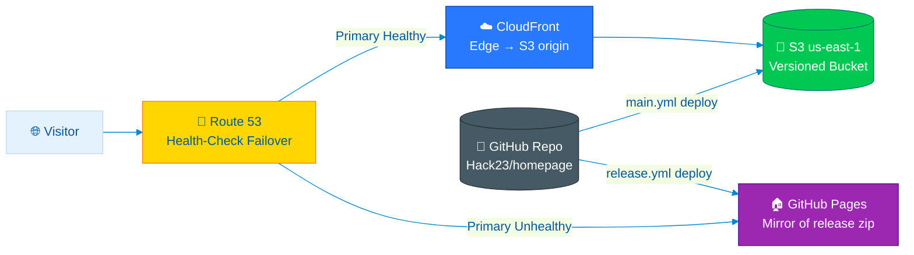

  

<h1 align="center">🔄 Hack23 Homepage — Business Continuity Plan</h1>

  <strong>🛡️ Classification-Driven Resilience for the Hack23 Corporate Website</strong> 
  <em>🎯 Static-Site Recovery Strategy with Multi-Origin DR</em>

  
  
  
  

**📋 Document Owner:** CEO | **📄 Version:** 1.0 | **📅 Last Updated:** 2026-04-21 (UTC)
**🔄 Review Cycle:** Semi-Annual | **⏰ Next Review:** 2026-10-21
**🏷️ Classification:**   

**🔐 ISMS Alignment:** Fulfils the Business Continuity Planning requirement of the [Hack23 Secure Development Policy](https://github.com/Hack23/ISMS-PUBLIC/blob/main/Secure_Development_Policy.md), implements the [Backup & Recovery Policy](https://github.com/Hack23/ISMS-PUBLIC/blob/main/Backup_Recovery_Policy.md), and operationalises the [Incident Response Plan](https://github.com/Hack23/ISMS-PUBLIC/blob/main/Incident_Response_Plan.md).

---

## 🎯 Purpose Statement

The Hack23 Homepage (`hack23.com`) is the **public face of Hack23 AB** — the primary inbound channel for prospects, partners, and the open-source community, and the canonical publication surface for Hack23's ISMS transparency portfolio.

This Business Continuity Plan ensures that:

1. The website remains **accessible** during AWS regional outages, GitHub incidents, DNS provider failures, and routine deploy errors.
2. **Content recovery** from any historical state is possible within the RPO via Git history and S3 versioning.
3. **Brand and reputation** are preserved through transparent, documented incident handling.

This is not a high-stakes transactional system — it processes no user data, holds no customer-confidential information, and has no real-time SLA contracts attached to it. The plan is therefore **deliberately lean**, focused on the layered DR mechanisms already implemented (CloudFront + Route53 health checks + GitHub Pages mirror + Git history).

*— James Pether Sörling, CEO/Founder*

---

## 📚 Related Documentation

| Document | Focus |
|----------|-------|
| **[🏛️ Architecture](ARCHITECTURE.md)** | C4 model & deployment topology |
| **[🛡️ Security Architecture](SECURITY_ARCHITECTURE.md)** | Defense-in-depth controls |
| **[🎯 Threat Model](THREAT_MODEL.md)** | STRIDE / MITRE ATT&CK threat analysis |
| **[🔄 Workflows](WORKFLOWS.md)** | CI/CD pipeline (10 workflows) |
| **[💰 Financial & Security Plan](FinancialSecurityPlan.md)** | Recovery cost envelope |
| **[🔚 End-of-Life Strategy](End-of-Life-Strategy.md)** | Long-term lifecycle |
| **[🛡️ CRA Assessment](CRA-ASSESSMENT.md)** | EU Cyber Resilience Act conformity |

---

## 🏷️ Business Impact Classification

Per [Hack23 Classification Framework](https://github.com/Hack23/ISMS-PUBLIC/blob/main/CLASSIFICATION.md):

| Security Dimension | Level | Rationale |
|--------------------|-------|-----------|
| **🔐 Confidentiality** |  | All content is intended for public consumption; no PII or customer data |
| **🔒 Integrity** |  | Content errors are reversible via Git; brief defacement is reputationally costly but recoverable |
| **⚡ Availability** |  | 99 % availability target; no contractual SLA |

---

## 📊 Business Impact Analysis (BIA)

### Business Functions Hosted on the Website

| Function | Operational Impact (Outage) | Reputational Impact | Financial Impact | Recovery Priority |
|---------|----------------------------|---------------------|------------------|-------------------|
| **🌐 Marketing & lead generation** (`index.html`, `services.html`, `industries-*.html`) | Moderate — inbound enquiries lost | High — public visibility | Low — no transactions | 🟠 High |
| **📚 ISMS transparency portfolio** (Architecture, Security, Threat Model, etc.) | Moderate — credibility signal lost | High — flagship demonstration | Low | 🟠 High |
| **📦 Project portfolio** (CIA, CIA Compliance Manager, Black Trigram, EU MCP, Riksdagsmonitor, EU Parliament Monitor) | Low — repos remain on GitHub | Moderate — discoverability | Negligible | 🟡 Medium |
| **📝 Blog content** (26 EN articles + translations) | Low — content is evergreen | Moderate — SEO impact | Negligible | 🟡 Medium |
| **🌍 Multilingual variants** (1,248 translated pages across 13 languages) | Low — fallback to English available | Moderate — international reach | Negligible | 🟢 Standard |
| **🔗 hreflang & sitemap.xml** | Low — short-term SEO blip | Low | Negligible | 🟢 Standard |
| **📂 Release artefacts on `gh-pages`** | Low — DR origin only | Low | Negligible | 🟢 Standard |

### Recovery Time / Recovery Point Objectives

| Tier | RTO | RPO | Functions |
|------|-----|-----|-----------|
| 🟠 **High** | ≤ 4 hours | ≤ 24 hours | Marketing pages, ISMS portfolio, project landing pages |
| 🟡 **Medium** | ≤ 24 hours | ≤ 24 hours | Blog content, Discordian ISMS pages, ISO 27001 articles |
| 🟢 **Standard** | ≤ 72 hours | ≤ 7 days | Translations, sitemaps, release artefacts |

> **Note:** RTOs above represent **maximum tolerable downtime**. Practical RTO under the layered DR design (see below) is typically **< 5 minutes** because Route 53 health-check failover to GitHub Pages happens automatically.

---

## 🔄 Recovery Architecture

### Layered Recovery Mechanisms

| Layer | Mechanism | Recovery Window | Owner |
|-------|-----------|-----------------|-------|
| **L1 — Edge Caching** | CloudFront edge caches with TTLs allow stale-while-revalidate during origin disruption | Seconds | AWS |
| **L2 — DNS Failover** | Route 53 health checks against CloudFront; on failure, DNS swings to GitHub Pages mirror | < 60 s (TTL) | Hack23 |
| **L3 — DR Origin** | `gh-pages` branch contains the latest minified release artefact | Already live | Hack23 (release.yml) |
| **L4 — Object Recovery** | S3 versioning preserves every prior object; AES-256 encryption at rest | Minutes | Hack23 |
| **L5 — Source-of-Truth** | Git repository on GitHub; full history; signed commits where applicable | Minutes (re-deploy) | Hack23 |
| **L6 — Local Mirror** | CEO local Git clone (developer workstation backup) | Hours | Hack23 |
| **L7 — Cold Archive** | Annual repo bundle stored offline (per Backup & Recovery Policy) | Days | Hack23 |

---

## 🚨 Incident Scenarios & Response Playbooks

### Scenario 1 — CloudFront / S3 outage in `us-east-1`

| Step | Action | Owner | Target Time |
|------|--------|-------|-------------|
| 1 | Detect via Route53 health check + CloudWatch alarm | Automated | < 60 s |
| 2 | Route 53 fails over DNS to GitHub Pages mirror | Automated | < 60 s |
| 3 | Confirm DR origin serving 200 OK from edge locations | CEO | 5 min |
| 4 | Open AWS Health Dashboard incident; subscribe | CEO | 10 min |
| 5 | Communicate via GitHub Status / hack23.com banner if extended | CEO | 30 min |
| 6 | When AWS recovers, validate primary; revert DNS health-check state | CEO | 1 h |

**Result:** RTO ≈ < 5 min. RPO 0 (DR origin holds last released artefact).

### Scenario 2 — GitHub outage

| Step | Action | Target Time |
|------|--------|-------------|
| 1 | Site continues serving from CloudFront / S3 (no dependency on GitHub at runtime) | n/a |
| 2 | Pause new deploys; queue PRs locally | Per outage |
| 3 | Resume normal flow when GitHub recovers | Automatic |

**Result:** **Zero visitor-facing impact.** Only operational impact is delayed deploys.

### Scenario 3 — Bad deployment (defacement, broken HTML, wrong content)

| Step | Action | Owner | Target Time |
|------|--------|-------|-------------|
| 1 | Detect via Lighthouse CI / quality-checks.yml / visual review / external report | CEO | < 1 h |
| 2 | `git revert` offending commit on `master` and push (triggers `main.yml` redeploy) | CEO | 15 min |
| 3 | If quicker, restore prior S3 object versions via AWS console | CEO | 10 min |
| 4 | CloudFront invalidation (`/*`) | Automatic in `main.yml` | 5 min propagation |
| 5 | Post-incident review; consider pre-merge checks improvement | CEO | 1 week |

### Scenario 4 — Domain hijack / DNS account compromise

| Step | Action | Owner | Target Time |
|------|--------|-------|-------------|
| 1 | Detect via SSL cert mismatch / external monitor / scorecard | CEO | < 24 h |
| 2 | Engage AWS Support and registrar (if domain registrar account compromised) | CEO | 1 h |
| 3 | Trigger Incident Response Plan; rotate all AWS credentials | CEO | 2 h |
| 4 | Re-issue ACM certificate; restore Route 53 records from IaC backup | CEO | 4 h |

**Reference:** [Incident Response Plan](https://github.com/Hack23/ISMS-PUBLIC/blob/main/Incident_Response_Plan.md)

### Scenario 5 — GitHub repository compromise (force-push, malicious commit)

| Step | Action | Owner | Target Time |
|------|--------|-------|-------------|
| 1 | Detect via GitHub audit log, branch-protection alert, or unexpected `main.yml` run | CEO | < 24 h |
| 2 | Disable affected GitHub Actions workflow runs | CEO | 15 min |
| 3 | Restore from local clone or last-known-good tag (`vX.Y.Z`) | CEO | 1 h |
| 4 | Force push restored history; rotate all PATs and AWS OIDC trust | CEO | 2 h |
| 5 | Verify SLSA Level 3 attestation on next release | CEO | Next release |

### Scenario 6 — Total CEO incapacitation (single-operator key-person risk)

| Step | Action | Owner | Target Time |
|------|--------|-------|-------------|
| 1 | Site continues operating indefinitely from CloudFront cache + DR origin | n/a | n/a |
| 2 | Continuity instructions (this document + ISMS) remain publicly accessible on GitHub | n/a | n/a |
| 3 | Domain renewal automated where possible; manual renewals tracked in calendar | Successor | Per registrar cycle |
| 4 | AWS account access recovery via Hack23 AB legal entity records | Successor | Per AWS process |

> **Mitigation:** This is a known accepted risk for a one-person consultancy. The static, vendor-managed nature of every component (CloudFront, S3, Route 53, GitHub) means the site can run unattended for **months** without intervention.

---

## 💾 Backup & Recovery (Implementation)

| Asset | Backup Mechanism | Frequency | Retention | Restore RTO |
|-------|------------------|-----------|-----------|-------------|
| HTML/CSS source | Git repository on GitHub | Continuous (per commit) | Indefinite | Minutes (re-deploy) |
| Local CEO clone | `git clone` on workstation | Per `git fetch` | Indefinite | Manual |
| S3 objects | S3 Versioning enabled | Per object change | Indefinite (lifecycle policy: keep 30 days non-current) | Minutes |
| CloudFront config | Exported from AWS CloudFront via AWS CLI/console and retained with change records | Per change | Versioned | Hours |
| Release artefacts (zip + SBOM + attestations) | GitHub Releases + `gh-pages` branch | Per release | Indefinite | Minutes |
| Documentation reports (`docs/`) | Committed by `release.yml` | Per release | Indefinite | Minutes (Git checkout) |
| AWS account recovery | AWS root account, MFA hardware key, recovery phone | Per credential rotation | Per [Access Control Policy](https://github.com/Hack23/ISMS-PUBLIC/blob/main/Access_Control_Policy.md) | Hours |

Aligned with the [Hack23 Backup & Recovery Policy](https://github.com/Hack23/ISMS-PUBLIC/blob/main/Backup_Recovery_Policy.md).

---

## 🧪 Testing & Validation

| Test | Cadence | Method | Evidence |
|------|---------|--------|----------|
| **DR origin freshness** | Per release | `release.yml` deploys to `gh-pages`; verify URL returns latest version | Workflow run logs |
| **Route 53 failover drill** | Annually | Temporarily block CloudFront origin; confirm GitHub Pages serves traffic | Manual test note in `docs/RELEASE_SUMMARY.md` |
| **S3 version restore drill** | Annually | Restore prior version of `index.html` and verify CloudFront invalidation propagates | CloudWatch logs |
| **Git restore drill** | Annually | Re-clone repo on a fresh workstation; deploy from clean state | Manual test note |
| **Pipeline integrity** | Continuous | OpenSSF Scorecard, `dependency-review.yml`, CodeQL on every PR | Public Scorecard badge |
| **SLSA Level 3 attestation verification** | Per release | `gh attestation verify` on release artefact | GitHub Release page |

---

## 📞 Communication Plan

| Audience | Channel | Trigger |
|----------|---------|---------|
| **Public visitors** | Banner on `hack23.com` (or DR origin equivalent) | Outage > 1 h |
| **Open-source community** | GitHub Issues / Discussions / repo banner | Repo or pipeline incident |
| **Clients & partners** | Direct email from `info@hack23.com` | Material disruption to engagement |
| **Authorities (CRA / NIS2)** | Per regulatory deadlines (CRA Annex VIII; NIS2 24/72 h) | Where applicable; see [CRA-ASSESSMENT.md](CRA-ASSESSMENT.md) |

---

## 📋 Roles & Responsibilities

| Role | Responsibility |
|------|----------------|
| **CEO (James Pether Sörling)** | Plan owner, deploy approver, incident commander, recovery executor |
| **Cloud agent (GitHub Copilot Coding Agent)** | PR-driven content & infra changes under human approval |
| **AWS** | Underlying infrastructure SLA (CloudFront, S3, Route 53, ACM) |
| **GitHub** | Source hosting, CI/CD, GitHub Pages DR origin |

---

## 📋 ISMS Policy Alignment

| ISMS Policy | Relevance |
|-------------|-----------|
| **[Information Security Policy](https://github.com/Hack23/ISMS-PUBLIC/blob/main/Information_Security_Policy.md)** | Overall governance |
| **[Secure Development Policy](https://github.com/Hack23/ISMS-PUBLIC/blob/main/Secure_Development_Policy.md)** | BCP documentation requirement |
| **[Backup & Recovery Policy](https://github.com/Hack23/ISMS-PUBLIC/blob/main/Backup_Recovery_Policy.md)** | Backup & restore mechanisms |
| **[Incident Response Plan](https://github.com/Hack23/ISMS-PUBLIC/blob/main/Incident_Response_Plan.md)** | Scenario response playbooks |
| **[Network Security Policy](https://github.com/Hack23/ISMS-PUBLIC/blob/main/Network_Security_Policy.md)** | DDoS protection, CDN, DNS resilience |
| **[Access Control Policy](https://github.com/Hack23/ISMS-PUBLIC/blob/main/Access_Control_Policy.md)** | AWS IAM, OIDC, MFA |
| **[Change Management Policy](https://github.com/Hack23/ISMS-PUBLIC/blob/main/Change_Management_Policy.md)** | PR-driven deploys, rollback procedure |
| **[End-of-Life Strategy](End-of-Life-Strategy.md)** | Long-term wind-down scenario |

---

## 🏆 Compliance Mapping

| Framework | Control | Implementation |
|-----------|---------|----------------|
| **ISO 27001:2022** | A.5.30 ICT readiness for business continuity | Layered DR architecture; documented playbooks |
| **ISO 27001:2022** | A.8.13 Information backup | S3 versioning; Git history; release artefacts on `gh-pages` |
| **ISO 27001:2022** | A.8.14 Redundancy of information processing facilities | Multi-origin (CloudFront + GitHub Pages) with DNS health-check failover |
| **NIST CSF 2.0** | RC.RP-1 Recovery plan | This document |
| **NIST CSF 2.0** | RC.CO-3 Public communications | Communication Plan section |
| **CIS Controls v8.1** | CIS 11.1 Establish data recovery process | This document; Backup & Recovery Policy |
| **EU CRA Annex I** | Section 1(3)(j) — protection from disruptions | Layered DR |

---

## 📋 Document Control

**✅ Approved by:** James Pether Sörling, CEO, Hack23 AB
**📤 Distribution:** Public
**🏷️ Classification:**   
**📅 Effective Date:** 2026-04-21
**⏰ Next Review:** 2026-10-21

