# 🇨🇳 Chinese (zh) Translation Guide

**Version 5.0 - Comprehensive Hack23 Edition**  
*Last Updated: January 2026*

---

## 📋 Quick Reference

| Attribute | Value |
|-----------|-------|
| **Language Code** | `zh` |
| **Locale** | `zh_CN` (Simplified), `zh_SG` (Singapore) |
| **Text Direction** | LTR (Left-to-Right) → |
| **Currency** | CNY (¥), SGD (S$) |
| **Date Format** | `YYYY年MM月DD日` |
| **Script** | Simplified Chinese (简体中文) |

---

## 🔄 Visual Translation Workflow

```mermaid
graph LR
    A[选择文件] --> B[审核术语]
    B --> C[翻译内容]
    C --> D[质量验证]
    D --> E{批准?}
    E -->|是| F[发布]
    E -->|否| C
```

## 🔄 Quality Standards Pyramid

```mermaid
graph TD
    L1[基础: 技术准确性]
    L2[中层: 语法与流畅度]
    L3[顶层: 文化适应性]
    L1 --> L2 --> L3
```

---

## 📚 Comprehensive Vocabulary Reference

### 🔥 Brand & Key Entities (Never Translate)

| English | Chinese | Notes |
|---------|---------|-------|
| Hack23 | Hack23 | Company name – never translate |
| Hack23 AB | Hack23 AB | Swedish company designation |
| Citizen Intelligence Agency | Citizen Intelligence Agency | Project name – keep English |
| CIA Compliance Manager | CIA Compliance Manager | Product name – keep English |
| Black Trigram | Black Trigram / 黑卦 | Game product |
| 흑괘 | 흑괘 | Korean name for Black Trigram |
| James Pether Sörling | James Pether Sörling | Founder name |
| CISSP | CISSP | Certification |
| CISM | CISM | Certification |
| GitHub | GitHub | Platform name |
| LinkedIn | LinkedIn | Platform name |

### 🏢 Hack23 Business & Services

| English | Chinese | Notes |
|---------|---------|-------|
| Cybersecurity Consulting Sweden | 瑞典网络安全咨询 | Main tagline |
| Public ISMS | 公开信息安全管理系统 | Core differentiator |
| Security Architecture | 安全架构 | |
| Security Strategy | 安全战略 | |
| Cloud Security | 云安全 | |
| DevSecOps | DevSecOps | Keep English |
| Secure Development | 安全开发 | |
| Code Quality | 代码质量 | |
| Compliance & Regulatory | 合规与监管 | |
| Open Source Security | 开源安全 | |
| Security Culture | 安全文化 | |
| Security Training | 安全培训 | |
| Full-Stack Security | 全栈安全 | |
| Current Practitioner | 现任从业者 | Value proposition |
| Transparent Security | 透明安全 | |
| Developer-Friendly Security | 开发者友好的安全 | |
| OSPO | OSPO | Open Source Program Office |
| Gothenburg | 哥德堡 | City in Sweden |
| Sweden | 瑞典 | |

### 🎮 Black Trigram Game Vocabulary

| English | Chinese | Notes |
|---------|---------|-------|
| Precision Combat Simulator | 精准格斗模拟器 | |
| Vital Points | 要害点 | |
| 70 Anatomical Vital Points | 70个解剖学要害点 | |
| Fighter Archetypes | 战士原型 | |
| Musa (Warrior) | 武士 (战士) | |
| Amsalja (Assassin) | 暗杀者 | |
| Hacker | 黑客 | |
| Jeongbo (Intelligence) | 情报员 | |
| Jojik (Organization) | 组织者 | |
| Korean Martial Arts | 韩国武术 | |
| Taekkyeon | 跆跟 | Korean martial art |
| Hapkido | 合气道 | Korean martial art |
| Cultural Preservation | 文化保护 | |
| Educational Gaming | 教育游戏 | |
| Unity Game | Unity游戏 | |
| Steam | Steam | Platform name |
| itch.io | itch.io | Platform name |

### 🔍 Citizen Intelligence Agency Vocabulary

| English | Chinese | Notes |
|---------|---------|-------|
| Political Transparency | 政治透明度 | |
| OSINT Platform | 开源情报平台 | |
| Parliamentary Monitoring | 议会监控 | |
| Voting Records | 投票记录 | |
| Accountability Metrics | 问责指标 | |
| Open Data | 开放数据 | |
| Civic Technology | 公民技术 | |
| Swedish Parliament | 瑞典议会 | |
| Data Visualization | 数据可视化 | |
| Political Analytics | 政治分析 | |

### 🔐 CIA Compliance Manager Vocabulary

| English | Chinese | Notes |
|---------|---------|-------|
| Security Assessment Platform | 安全评估平台 | |
| Business Impact Analysis | 业务影响分析 | |
| Multi-Framework Compliance | 多框架合规 | |
| STRIDE Analysis | STRIDE分析 | Threat model |
| Threat Modeling | 威胁建模 | |
| Evidence Collection | 证据收集 | |
| Automated Compliance Reporting | 自动化合规报告 | |
| Risk Register | 风险登记册 | |
| Controls Monitoring | 控制措施监控 | |
| CRA Assessment | CRA评估 | Cyber Resilience Act |

### 🍎 Discordian Philosophy & ISMS Blog

| English | Chinese | Notes |
|---------|---------|-------|
| Think for Yourself | 独立思考 | Core motto |
| Question Authority | 质疑权威 | |
| FNORD | FNORD | Never translate |
| Nothing is True | 没有什么是真实的 | |
| Everything is Permitted | 一切皆被允许 | |
| Security Theater | 安全剧场 | Fake security |
| Radical Transparency | 激进透明 | |
| Chapel Perilous | 危险教堂 | Keep English or translate |
| Operation Mindfuck | 心理操作 | |
| Illuminatus Trilogy | 光明会三部曲 | |
| Eris | 厄里斯 | Goddess of Chaos |
| Discordia | 混乱女神 | |
| Law of Fives | 五法则 | |
| Sacred Geometry | 神圣几何 | |
| Five-Layer Architecture | 五层架构 | |
| Nation-State Surveillance | 国家监控 | |
| Crypto Backdoors | 加密后门 | |
| Security Through Obscurity | 通过隐蔽实现安全 | Anti-pattern |
| Information Hoarding | 信息囤积 | |
| Knowledge Transparency | 知识透明 | |
| Simon Moon | 西蒙·穆恩 | Character reference |
| Hagbard Celine | 哈格巴德·塞林 | Character reference |
| George Dorn | 乔治·多恩 | Character reference |

### 🧭 Navigation & UI Elements

| English | Chinese |
|---------|---------|
| Home | 首页 |
| About Us | 关于我们 |
| Services | 服务 |
| Products | 产品 |
| Projects | 项目 |
| Contact | 联系我们 |
| Blog | 博客 |
| Search | 搜索 |
| Menu | 菜单 |
| Close | 关闭 |
| Back | 返回 |
| Next | 下一个 |
| Previous | 上一个 |
| Submit | 提交 |
| Cancel | 取消 |
| **Expand All** | **全部展开** |
| **Collapse All** | **全部折叠** |
| Download | 下载 |
| Read More | 阅读更多 |
| View Details | 查看详情 |
| Privacy Policy | 隐私政策 |
| Terms of Service | 服务条款 |
| Copyright | 版权 |
| Sitemap | 网站地图 |
| FAQ | 常见问题 |
| Why Hack23 | 为什么选择Hack23 |
| Accessibility Statement | 无障碍声明 |
| Language | 语言 |
| Share | 分享 |
| Print | 打印 |
| Save | 保存 |
| Edit | 编辑 |
| Delete | 删除 |
| Confirm | 确认 |
| Loading | 加载中 |
| Error | 错误 |
| Success | 成功 |
| Warning | 警告 |

### 🔐 CIA Triad & Core Security Principles

| English | Chinese | Notes |
|---------|---------|-------|
| CIA Triad | CIA三元组 | |
| CIA+ Framework | CIA+框架 | Extended framework |
| **Confidentiality** | **机密性** | Data protection |
| **Integrity** | **完整性** | Data accuracy |
| **Availability** | **可用性** | System uptime |
| Non-Repudiation | 不可否认性 | |
| Authentication | 身份验证 | |
| Authorization | 授权 | |

### 🔒 Security & Cybersecurity Terminology

| English | Chinese | Notes |
|---------|---------|-------|
| Cybersecurity | 网络安全 | |
| Information Security | 信息安全 | |
| ISMS | 信息安全管理系统 | |
| Security Policy | 安全策略 | |
| Risk Management | 风险管理 | |
| Risk Assessment | 风险评估 | |
| Threat | 威胁 | |
| Vulnerability | 漏洞 | |
| Exploit | 漏洞利用 | |
| Patch | 补丁 | |
| Firewall | 防火墙 | |
| Encryption | 加密 | |
| Decryption | 解密 | |
| Access Control | 访问控制 | |
| Multi-Factor Authentication (MFA) | 多因素认证 | |
| Single Sign-On (SSO) | 单点登录 | |
| Phishing | 网络钓鱼 | |
| Ransomware | 勒索软件 | |
| Malware | 恶意软件 | |
| Zero Trust | 零信任 | |
| Defense in Depth | 纵深防御 | |
| Least Privilege | 最小权限 | |
| Incident Response | 事件响应 | |
| Data Breach | 数据泄露 | |
| Penetration Test | 渗透测试 | |
| Audit | 审计 | |
| Compliance | 合规 | |
| Governance | 治理 | |
| Security Awareness | 安全意识 | |
| Backup | 备份 | |
| Disaster Recovery | 灾难恢复 | |
| Business Continuity | 业务连续性 | |
| Supply Chain Security | 供应链安全 | |
| SLSA Level 3 | SLSA 3级 | Supply chain security |
| Container Security | 容器安全 | |
| Serverless Security | 无服务器安全 | |
| API Security | API安全 | |
| Endpoint Security | 端点安全 | |

### 🏛️ Regulatory & Standards

| English | Chinese | Notes |
|---------|---------|-------|
| ISO 27001 | ISO 27001 | Keep as-is |
| ISO 27001:2022 | ISO 27001:2022 | |
| GDPR | 通用数据保护条例 | EU regulation |
| NIS2 | NIS2指令 | EU directive |
| NIST CSF | NIST网络安全框架 | |
| CIS Controls | CIS控制措施 | |
| SOC2 | SOC2 | |
| HIPAA | HIPAA | US healthcare |
| EU Cyber Resilience Act (CRA) | 欧盟网络弹性法案 | |
| Annex A Controls | 附录A控制措施 | ISO 27001 |
| Statement of Applicability | 适用性声明 | |

### 💼 Business & Professional Terms

| English | Chinese |
|---------|---------|
| Consulting | 咨询 |
| Enterprise | 企业 |
| Strategy | 战略 |
| Certification | 认证 |
| Assessment | 评估 |
| Implementation | 实施 |
| Audit | 审计 |
| Review | 审查 |
| Gap Analysis | 差距分析 |
| Roadmap | 路线图 |
| Best Practices | 最佳实践 |
| Case Study | 案例研究 |
| ROI | 投资回报率 |
| KPI | 关键绩效指标 |
| SLA | 服务级别协议 |
| Stakeholder | 利益相关方 |
| Deliverable | 可交付成果 |
| Milestone | 里程碑 |

### 📝 Blog Post Categories

| English | Chinese |
|---------|---------|
| Security Architecture | 安全架构 |
| ISMS Policies | ISMS策略 |
| Compliance Frameworks | 合规框架 |
| Threat Modeling | 威胁建模 |
| Secure Development | 安全开发 |
| Cloud Security | 云安全 |
| Access Control | 访问控制 |
| Cryptography | 密码学 |
| Incident Response | 事件响应 |
| Vulnerability Management | 漏洞管理 |
| Asset Management | 资产管理 |
| Network Security | 网络安全 |
| Email Security | 电子邮件安全 |
| Physical Security | 物理安全 |
| Mobile Device Security | 移动设备安全 |
| Remote Access Security | 远程访问安全 |
| Monitoring & Logging | 监控与日志 |
| Security Metrics | 安全指标 |
| Third Party Risk | 第三方风险 |
| Change Management | 变更管理 |

### 🏭 Industry-Specific Terms

| English | Chinese |
|---------|---------|
| Investment & FinTech | 投资与金融科技 |
| Betting & Gaming | 博彩与游戏 |
| Cannabis Security | 大麻安全 |
| Healthcare | 医疗保健 |
| Government | 政府 |
| Critical Infrastructure | 关键基础设施 |
| Financial Services | 金融服务 |
| E-commerce | 电子商务 |

---

## 🔤 Chinese-Specific Guidelines

### Character Usage
- Use Simplified Chinese (简体中文) for zh_CN
- Maintain consistent terminology throughout
- Use appropriate measure words (量词)

### Technical Terms
- Many technical terms keep English abbreviations (ISO, GDPR, API)
- Provide Chinese explanation on first use when helpful
- Use established Chinese IT terminology

### Formatting
- No spaces between Chinese characters
- Add spaces around English words/numbers in mixed text
- Use Chinese punctuation marks (，。！？：；)

---

## ✅ Translation Checklist

- [ ] `<html lang="zh">` attribute set
- [ ] `<title>` translated
- [ ] `<meta name="description">` translated
- [ ] `og:locale` set to `zh_CN`
- [ ] All hreflang tags present (14 languages)
- [ ] Navigation menu translated
- [ ] Footer translated
- [ ] Brand names kept in English
- [ ] Technical terms verified
- [ ] Chinese punctuation used correctly
- [ ] No unnecessary spaces in Chinese text

---

## 📝 Notes

- Use **Simplified Chinese** for mainland China audience
- Keep English technical acronyms where standard
- Verify translation with native speakers
- Consider cultural context in messaging

---

*23 FNORD 5*
