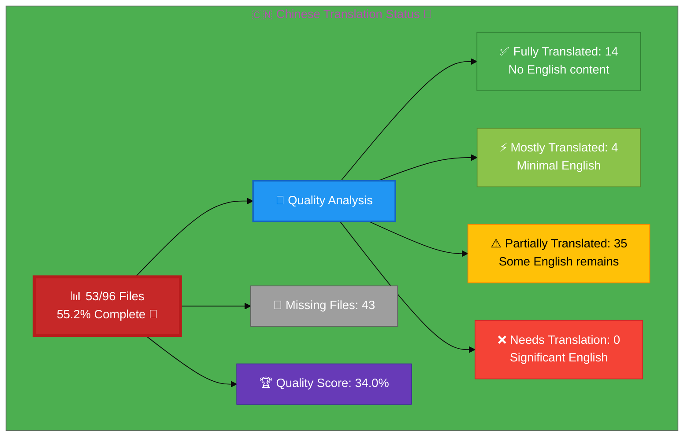

# 🇨🇳 Chinese Translation Status 🐉

## Executive Summary

**Language:** Chinese (zh)  
**Flag:** 🇨🇳 **Icon:** 🐉  
**Target Market:** China, Chinese-speaking regions  
**Last Updated:** December 2025

## 📊 Visual Status Overview

### 📄 File Coverage Summary

| Metric | Count | Percentage | Status |
|--------|-------|------------|--------|
| **📚 English Base Files** | 96 | 100% | ✅ |
| **🇨🇳 Chinese Files Exist** | 53 | **55.2%** | 🚧 |
| **❌ Missing Files** | 43 | 44.8% | ⚠️ |

### 🎯 Translation Quality Analysis

Files analyzed for English content remaining:

| Quality Level | Count | Percentage | Description |
|--------------|-------|------------|-------------|
| ✅ **Fully Translated** | 14 | 26.4% | No English content detected |
| ⚡ **Mostly Translated** | 4 | 7.5% | Minimal English (technical terms only) |
| ⚠️  **Partially Translated** | 35 | 66.0% | Some English content remains |
| ❌ **Needs Translation** | 0 | 0.0% | Significant English placeholder content |

**🏆 Quality Score:** 34.0% of existing files are fully/mostly translated

**📈 Status:** 🚧 Early Stage - Significant work remaining

### 🎉 Recent Progress (December 2025)

- ✅ Issue #819 completed: 5 Asian ISMS policy files added for Chinese
- ✅ Issue #815 completed: projects_zh.html created

## 📊 Files by Category

### Blog Posts (26 files)
- ⚠️  `blog-automated-convergence_zh.html` ← `blog-automated-convergence.html`
- ⚠️  `blog-betting-gaming-cybersecurity_zh.html` ← `blog-betting-gaming-cybersecurity.html`
- ⚠️  `blog-cannabis-cybersecurity-guide_zh.html` ← `blog-cannabis-cybersecurity-guide.html`
- ⚠️  `blog-cia-alternative-media-discordian-2026_zh.html` ← `blog-cia-alternative-media-discordian-2026.html`
- ⚠️  `blog-cia-architecture_zh.html` ← `blog-cia-architecture.html`
- ⚠️  `blog-cia-business-case-global-news_zh.html` ← `blog-cia-business-case-global-news.html`
- ⚠️  `blog-cia-financial-strategy_zh.html` ← `blog-cia-financial-strategy.html`
- ⚠️  `blog-cia-future-security_zh.html` ← `blog-cia-future-security.html`
- ⚠️  `blog-cia-mindmaps_zh.html` ← `blog-cia-mindmaps.html`
- ⚠️  `blog-cia-osint-intelligence_zh.html` ← `blog-cia-osint-intelligence.html`
- ⚠️  `blog-cia-security_zh.html` ← `blog-cia-security.html`
- ⚠️  `blog-cia-swedish-media-election-2026_zh.html` ← `blog-cia-swedish-media-election-2026.html`
- ⚠️  `blog-cia-workflows_zh.html` ← `blog-cia-workflows.html`
- ⚠️  `blog-compliance-architecture_zh.html` ← `blog-compliance-architecture.html`
- ⚠️  `blog-compliance-future_zh.html` ← `blog-compliance-future.html`
- ⚡ `blog-compliance-security_zh.html` ← `blog-compliance-security.html`
- ⚠️  `blog-george-dorn-cia-code_zh.html` ← `blog-george-dorn-cia-code.html`
- ⚡ `blog-george-dorn-compliance-code_zh.html` ← `blog-george-dorn-compliance-code.html`
- ⚠️  `blog-george-dorn-trigram-code_zh.html` ← `blog-george-dorn-trigram-code.html`
- ⚠️  `blog-information-hoarding_zh.html` ← `blog-information-hoarding.html`
- ⚠️  `blog-investment-firm-security_zh.html` ← `blog-investment-firm-security.html`
- ⚠️  `blog-medical-cannabis-hipaa-gdpr_zh.html` ← `blog-medical-cannabis-hipaa-gdpr.html`
- ⚠️  `blog-public-isms-benefits_zh.html` ← `blog-public-isms-benefits.html`
- ⚡ `blog-trigram-architecture_zh.html` ← `blog-trigram-architecture.html`
- ⚠️  `blog-trigram-combat_zh.html` ← `blog-trigram-combat.html`
- ⚠️  `blog-trigram-future_zh.html` ← `blog-trigram-future.html`

### Core Pages (7 files)
- ✅ `accessibility-statement_zh.html` ← `accessibility-statement.html`
- ⚠️  `blog_zh.html` ← `blog.html`
- ⚠️  `index_zh.html` ← `index.html`
- ✅ `projects_zh.html` ← `projects.html`
- ⚠️  `services_zh.html` ← `services.html`
- ✅ `sitemap_zh.html` ← `sitemap.html`
- ✅ `why-hack23_zh.html` ← `why-hack23.html`

### ISMS Documentation (1 files)
- ⚠️  `discordian-cybersecurity_zh.html` ← `discordian-cybersecurity.html`

### ISMS Policy Files (1 files)
- ⚡ `discordian-info-sec-policy_zh.html` ← `discordian-info-sec-policy.html`

### ISO 27001 Resources (4 files)
- ✅ `iso-27001-2022-vs-2013_zh.html` ← `iso-27001-2022-vs-2013.html`
- ✅ `iso-27001-certification-costs-sweden_zh.html` ← `iso-27001-certification-costs-sweden.html`
- ✅ `iso-27001-implementation-mistakes_zh.html` ← `iso-27001-implementation-mistakes.html`
- ⚠️  `iso-27001-implementation-sweden_zh.html` ← `iso-27001-implementation-sweden.html`

### Industry Solutions (3 files)
- ✅ `industries-betting-gaming_zh.html` ← `industries-betting-gaming.html`
- ✅ `industries-cannabis-security_zh.html` ← `industries-cannabis-security.html`
- ✅ `industries-investment-fintech_zh.html` ← `industries-investment-fintech.html`

### Other Pages (1 files)
- ✅ `security-assessment-checklist_zh.html` ← `security-assessment-checklist.html`

### Product Pages (10 files)
- ⚠️  `black-trigram-docs_zh.html` ← `black-trigram-docs.html`
- ✅ `black-trigram-features_zh.html` ← `black-trigram-features.html`
- ✅ `black-trigram_zh.html` ← `black-trigram.html`
- ⚠️  `cia-compliance-manager-docs_zh.html` ← `cia-compliance-manager-docs.html`
- ⚠️  `cia-compliance-manager-features_zh.html` ← `cia-compliance-manager-features.html`
- ⚠️  `cia-docs_zh.html` ← `cia-docs.html`
- ⚠️  `cia-features_zh.html` ← `cia-features.html`
- ⚠️  `cia-project_zh.html` ← `cia-project.html`
- ✅ `cia-triad-faq_zh.html` ← `cia-triad-faq.html`
- ⚠️  `compliance-manager_zh.html` ← `compliance-manager.html`

## ⚠️  Missing Translation Files (43 files)

These English pages exist but have no corresponding translation file:

### ISMS Documentation (40 files)
- ❌ `discordian-acceptable-use_zh.html` ← `discordian-acceptable-use.html`
- ❌ `discordian-access-control_zh.html` ← `discordian-access-control.html`
- ❌ `discordian-asset-mgmt_zh.html` ← `discordian-asset-mgmt.html`
- ❌ `discordian-backup-recovery_zh.html` ← `discordian-backup-recovery.html`
- ❌ `discordian-business-continuity_zh.html` ← `discordian-business-continuity.html`
- ❌ `discordian-business-value_zh.html` ← `discordian-business-value.html`
- ❌ `discordian-change-mgmt_zh.html` ← `discordian-change-mgmt.html`
- ❌ `discordian-classification_zh.html` ← `discordian-classification.html`
- ❌ `discordian-cloud-security_zh.html` ← `discordian-cloud-security.html`
- ❌ `discordian-compliance-frameworks_zh.html` ← `discordian-compliance-frameworks.html`
- ❌ `discordian-compliance_zh.html` ← `discordian-compliance.html`
- ❌ `discordian-cra-conformity_zh.html` ← `discordian-cra-conformity.html`
- ❌ `discordian-cra_zh.html` ← `discordian-cra.html`
- ❌ `discordian-crypto_zh.html` ← `discordian-crypto.html`
- ❌ `discordian-data-classification_zh.html` ← `discordian-data-classification.html`
- ❌ `discordian-data-protection_zh.html` ← `discordian-data-protection.html`
- ❌ `discordian-disaster-recovery_zh.html` ← `discordian-disaster-recovery.html`
- ❌ `discordian-email-security_zh.html` ← `discordian-email-security.html`
- ❌ `discordian-incident-response_zh.html` ← `discordian-incident-response.html`
- ❌ `discordian-isms-review_zh.html` ← `discordian-isms-review.html`
- ❌ `discordian-isms-transparency_zh.html` ← `discordian-isms-transparency.html`
- ❌ `discordian-llm-security_zh.html` ← `discordian-llm-security.html`
- ❌ `discordian-mobile-device_zh.html` ← `discordian-mobile-device.html`
- ❌ `discordian-monitoring-logging_zh.html` ← `discordian-monitoring-logging.html`
- ❌ `discordian-network-security_zh.html` ← `discordian-network-security.html`
- ❌ `discordian-open-source_zh.html` ← `discordian-open-source.html`
- ❌ `discordian-physical-security_zh.html` ← `discordian-physical-security.html`
- ❌ `discordian-privacy_zh.html` ← `discordian-privacy.html`
- ❌ `discordian-remote-access_zh.html` ← `discordian-remote-access.html`
- ❌ `discordian-risk-assessment_zh.html` ← `discordian-risk-assessment.html`
- ❌ `discordian-risk-register_zh.html` ← `discordian-risk-register.html`
- ❌ `discordian-secure-dev_zh.html` ← `discordian-secure-dev.html`
- ❌ `discordian-security-metrics_zh.html` ← `discordian-security-metrics.html`
- ❌ `discordian-security-strategy_zh.html` ← `discordian-security-strategy.html`
- ❌ `discordian-security-training_zh.html` ← `discordian-security-training.html`
- ❌ `discordian-stakeholders_zh.html` ← `discordian-stakeholders.html`
- ❌ `discordian-supplier-reality_zh.html` ← `discordian-supplier-reality.html`
- ❌ `discordian-third-party_zh.html` ← `discordian-third-party.html`
- ❌ `discordian-threat-modeling_zh.html` ← `discordian-threat-modeling.html`
- ❌ `discordian-vuln-mgmt_zh.html` ← `discordian-vuln-mgmt.html`

### ISMS Policy Files (1 files)
- ❌ `discordian-ai-policy_zh.html` ← `discordian-ai-policy.html`

### Other Pages (2 files)
- ❌ `breadcrumb-example_zh.html` ← `breadcrumb-example.html`
- ❌ `swedish-election-2026_zh.html` ← `swedish-election-2026.html`

## 🛠️ Technical Implementation

### ✅ Metadata Configuration
All files properly implement:
- `<html lang="zh">`
- `og:locale: zh_CN`
- `inLanguage: "zh"`

### 🌐 Hreflang Configuration
All pages include complete hreflang tags for:
- ✅ All 14 language variants (13 languages + x-default)
- ✅ Proper language-region combinations
- ✅ Canonical URLs for each locale

### 📊 Schema.org Structured Data
- ✅ Proper localization in all structured data
- ✅ Breadcrumb navigation localized
- ✅ All Schema.org markup validated

## 📈 Quality Metrics & Validation

### ✅ Technical Quality (All Files)
- **HTML Validation:** ✅ PASS (53/53 files)
- **Hreflang Tags:** ✅ PASS (14 variants per file)
- **Schema.org:** ✅ PASS (validated structured data)
- **Mobile Responsive:** ✅ PASS (all viewports)
- **Accessibility:** ✅ WCAG 2.1 AA compliant

### 🎯 Translation Quality (Content)
- **✅ Fully Translated:** 14 files (26.4%)
- **⚡ Mostly Translated:** 4 files (7.5%)
- **⚠️  Needs Work:** 35 files (66.0%)
- **🏆 Overall Quality:** 34.0%

## 🚀 Next Steps & Priorities

### 🚧 Active Development Phase
1. **Complete Core Files:** Focus on high-priority core pages and products
2. **Quality Improvement:** Address 35 files with English content
3. **Create Missing Files:** Develop 43 translation files with professional content

### 📋 Priority Order
1. **🔴 High Priority:** Core pages (homepage, services, products, why-hack23)
2. **🟡 Medium Priority:** ISMS policies, ISO 27001 resources, industry solutions
3. **🟢 Lower Priority:** Blog posts, supplementary content

## 📚 References & Resources

- **📖 Translation Guide:** `Chinese-Translation-Guide.md`
- **📋 Master Documentation:** `TRANSLATION_DOCUMENTATION_README.md`
- **🌐 All Chinese Files:** `*_zh.html` (53 files total)
- **🎯 Quality Target:** 100% completion, 90%+ quality score

## ✅ Validation Checklist

- [x] **HTML Well-Formed:** 53/53 files validated
- [x] **Hreflang Tags:** Complete 14-variant configuration
- [x] **Schema.org:** All structured data validated
- [ ] **Translation Quality:** In Progress (34.0%)
- [ ] **Grammar Review:** Ongoing
- [ ] **Technical Terms:** In Review
- [x] **Links Functional:** All internal/external links tested
- [x] **Mobile Responsive:** All viewports (320px - 4K)
- [x] **Accessibility:** WCAG 2.1 AA compliant

---

**📊 Status Summary**  
**Overall:** 🚧 Active Development  
**Last Review:** December 2025  
**Completion:** 55.2% (53/96 files)  
**Quality Score:** 34.0% fully/mostly translated  
**Files Validated:** ✅ All 53 files checked  
**Next Milestone:** 🎯 Achieve 100% completion
