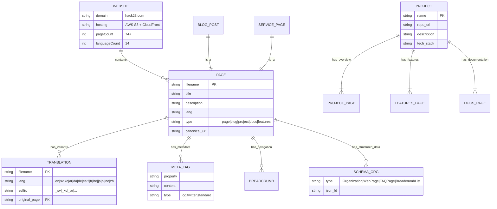
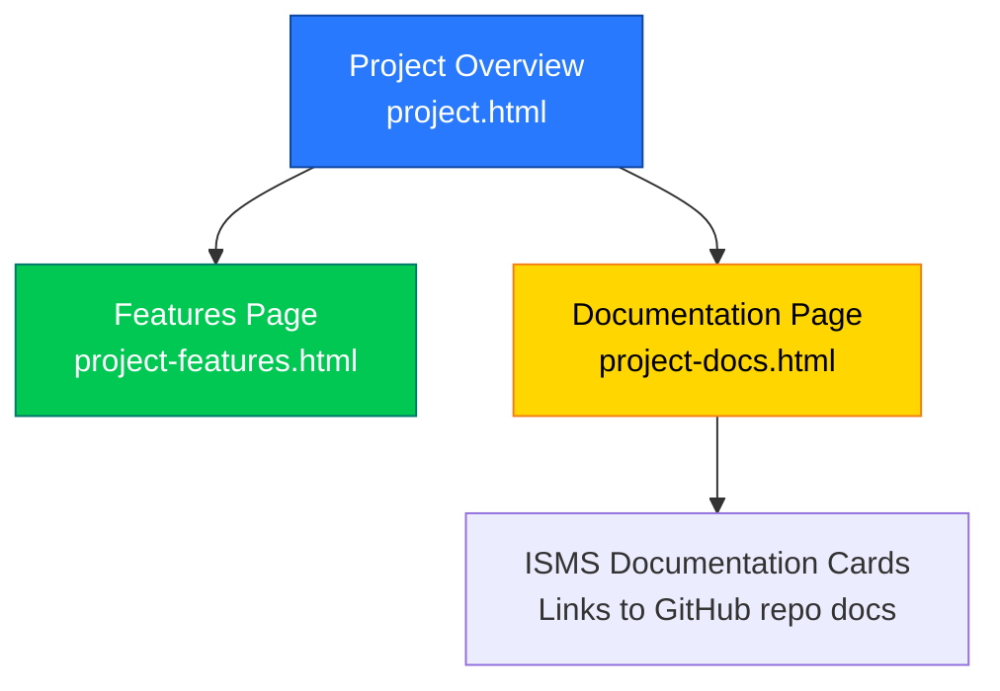
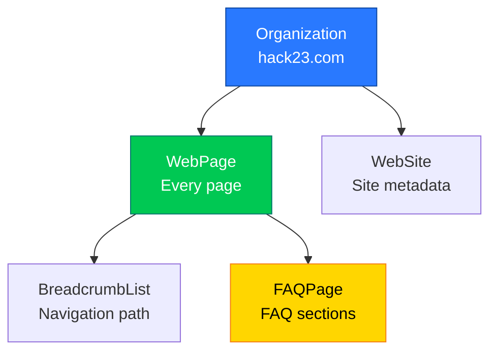

  

<h1 align="center">📊 Hack23 Homepage — Data Model</h1>

  <strong>Content Model: Static HTML/CSS Website</strong> 
  <em>Corporate Website Content Structure and Relationships</em>

  
  
  
  

**📋 Document Owner:** CEO | **📄 Version:** 1.0 | **📅 Last Updated:** 2026-02-20 (UTC)
**🔄 Review Cycle:** Quarterly | **⏰ Next Review:** 2026-05-20
**🏷️ Classification:**   

---

## 📚 Related Documentation

| Document | Focus | Description |
|----------|-------|-------------|
| **[🏛️ Architecture](ARCHITECTURE.md)** | C4 Model | System structure and containers |
| **[📊 Data Model](DATA_MODEL.md)** | Data | Content model (this document) |
| **[🔄 Flowchart](FLOWCHART.md)** | Processes | Content and deployment workflows |
| **[📈 State Diagram](STATEDIAGRAM.md)** | States | Content and deployment lifecycle |
| **[🛡️ Security Architecture](SECURITY_ARCHITECTURE.md)** | Security | Security controls |
| **[🚀 Future Data Model](FUTURE_DATA_MODEL.md)** | Roadmap | Planned content model enhancements |

---

## 🎯 Overview

The Hack23 homepage is a static HTML/CSS website with no backend database. The "data model" represents the content structure, page relationships, metadata schema, and SEO structured data that form the information architecture of hack23.com.

### Content Architecture Principles

- ✅ **Static-First**: All content is pre-rendered HTML — no dynamic data loading
- ✅ **Multilingual**: 14 language variants with consistent structure
- ✅ **SEO-Optimized**: Schema.org structured data on every page
- ✅ **Accessible**: WCAG 2.1 AA compliant content structure
- ✅ **Security-Transparent**: Public ISMS documentation integrated into site

---

## 📐 Content Entity Model

---

## 📄 Page Types

### Page Hierarchy

| Type | Count | Pattern | Description |
|------|-------|---------|-------------|
| **Homepage** | 1 | `index.html` | Main landing page |
| **Project Overview** | 6 | `{project}.html` | Project showcase pages |
| **Project Features** | 6 | `{project}-features.html` | Feature detail pages |
| **Project Docs** | 6 | `{project}-docs.html` | Documentation with ISMS cards |
| **Blog Posts** | 20+ | `blog-{topic}.html` | Security and compliance articles |
| **Service Pages** | 3 | `services.html`, etc. | Consulting offerings |
| **Translations** | 50+ | `*_{lang}.html` | Localized page variants |
| **Sitemaps** | 14 | `sitemap_{lang}.html` | Per-language HTML sitemaps |
| **Utility** | 5 | `404.html`, etc. | Error pages, robots.txt |

### Project Page Structure

Each open-source project follows a three-page pattern:

### Projects Documented

| Project | Overview | Features | Docs |
|---------|----------|----------|------|
| **CIA** | `cia-project.html` | `cia-features.html` | `cia-docs.html` |
| **CIA Compliance Manager** | `compliance-manager.html` | `cia-compliance-manager-features.html` | `cia-compliance-manager-docs.html` |
| **Black Trigram** | `black-trigram.html` | `black-trigram-features.html` | `black-trigram-docs.html` |
| **EU Parliament MCP** | `european-parliament-mcp.html` | `european-parliament-mcp-features.html` | `european-parliament-mcp-docs.html` |
| **Riksdagsmonitor** | `riksdagsmonitor.html` | `riksdagsmonitor-features.html` | `riksdagsmonitor-docs.html` |
| **EU Parliament Monitor** | `euparliamentmonitor.html` | `euparliamentmonitor-features.html` | `euparliamentmonitor-docs.html` |

---

## 🌍 Internationalization Model

### Language Support Matrix

| Language | Code | Suffix | Status |
|----------|------|--------|--------|
| English | en | (none) | ✅ Primary |
| Swedish | sv | `_sv` | ✅ Complete |
| Korean | ko | `_ko` | ✅ Complete |
| Arabic | ar | `_ar` | ✅ Complete (RTL) |
| Danish | da | `_da` | ✅ Complete |
| German | de | `_de` | ✅ Complete |
| Spanish | es | `_es` | ✅ Complete |
| Finnish | fi | `_fi` | ✅ Complete |
| French | fr | `_fr` | ✅ Complete |
| Hebrew | he | `_he` | ✅ Complete (RTL) |
| Japanese | ja | `_ja` | ✅ Complete |
| Dutch | nl | `_nl` | ✅ Complete |
| Norwegian | no | `_no` | ✅ Complete |
| Chinese | zh | `_zh` | ✅ Complete |

---

## 📋 SEO Structured Data Model

### Schema.org Types Used

---

## 🔒 Data Security

### Classification per ISMS

| Data Type | Confidentiality | Integrity | Availability |
|-----------|----------------|-----------|--------------|
| **Website Content** | Public | Low | Standard |
| **Blog Posts** | Public | Low | Standard |
| **ISMS Documentation** | Public | Medium | Standard |
| **Configuration** | Internal | Medium | High |
| **Deployment Secrets** | Confidential | High | High |

All data classification follows the **[Hack23 Classification Framework](https://github.com/Hack23/ISMS-PUBLIC/blob/main/CLASSIFICATION.md)**.

### Related ISMS Policies

- 🔗 **[Secure Development Policy](https://github.com/Hack23/ISMS-PUBLIC/blob/main/Secure_Development_Policy.md)** — Content development standards
- 🔗 **[Information Security Policy](https://github.com/Hack23/ISMS-PUBLIC/blob/main/Information_Security_Policy.md)** — Data handling requirements
- 🔗 **[Cryptography Policy](https://github.com/Hack23/ISMS-PUBLIC/blob/main/Cryptography_Policy.md)** — Encryption standards for data at rest
