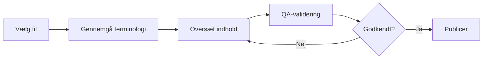
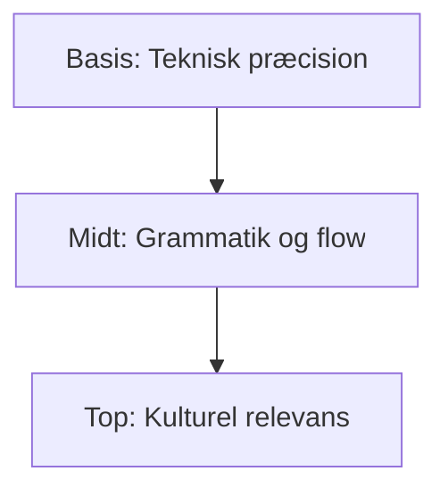

# 🇩🇰 Danish (da) Translation Guide

**Version 6.0 - Expanded Hack23 Edition**  
*Last Updated: January 2026*

---

## 📋 Quick Reference

| Attribute | Value |
|-----------|-------|
| **Language Code** | `da` |
| **Locale** | `da_DK` |
| **Text Direction** | LTR (Left-to-Right) → |
| **Currency** | DKK (kr) |
| **Date Format** | `DD.MM.YYYY` or `1. januar 2026` |

---

## 🔄 Visual Translation Workflow

## 🔄 Quality Standards Pyramid

---

## 📚 Comprehensive Vocabulary Reference

### 🔥 Brand & Key Entities (Never Translate)

| English | Danish | Notes |
|---------|--------|-------|
| Hack23 | Hack23 | Company name – never translate |
| Hack23 AB | Hack23 AB | Swedish company designation |
| Citizen Intelligence Agency | Citizen Intelligence Agency | Project name – keep English |
| CIA Compliance Manager | CIA Compliance Manager | Product name – keep English |
| Black Trigram | Black Trigram | Game product – keep English |
| 흑괘 | 흑괘 | Korean name for Black Trigram |
| 黑卦 | 黑卦 | Chinese name for Black Trigram |
| James Pether Sörling | James Pether Sörling | Founder name |
| CISSP | CISSP | Certification |
| CISM | CISM | Certification |
| GitHub | GitHub | Platform name |
| LinkedIn | LinkedIn | Platform name |
| OpenSSF | OpenSSF | Open Source Security Foundation |
| CII Best Practices | CII Best Practices | Badge name |
| Riksdag | Riksdag | Swedish Parliament |

### 👔 Job Titles & Professional Roles

| English | Danish | Notes |
|---------|--------|-------|
| CEO / Chief Executive Officer | Administrerende direktør | |
| Founder | Grundlægger | |
| CEO/Founder | Adm. direktør/Grundlægger | |
| Application Security Officer | Applikationssikkerhedsofficer | |
| Information Security Officer | Informationssikkerhedsofficer | |
| Senior Security Architect | Senior sikkerhedsarkitekt | |
| Cloud Architect | Cloud-arkitekt | |
| Security Consultant | Sikkerhedskonsulent | |
| CISO | CISO | Chief Information Security Officer |
| Compliance Officer | Compliance-officer | |
| Risk Manager | Risikochef | |
| IT Security Manager | IT-sikkerhedschef | |
| Security Auditor | Sikkerhedsrevisor | |
| Taekwondo Instructor | Taekwondo-instruktør | |
| System Developer | Systemudvikler | |
| Software Engineer | Softwareingeniør | |
| J2EE Developer | J2EE-udvikler | |
| Unix Helpdesk | Unix-helpdesk | |
| Teaching Assistant | Undervisningsassistent | |
| NBC Defence Group Leader | NBC-forsvarsgruppleder | Military role |

### 🏢 Hack23 Business & Services

| English | Danish | Notes |
|---------|--------|-------|
| Cybersecurity Consulting Sweden | Cybersikkerhedsrådgivning i Sverige | Main tagline |
| Public ISMS | Offentligt ISMS | Core differentiator |
| Open ISMS Transparency | Åben ISMS-gennemsigtighed | |
| Security Architecture & Strategy | Sikkerhedsarkitektur og strategi | Service line |
| Cloud Security & DevSecOps | Cloud-sikkerhed og DevSecOps | Service line |
| Secure Development & Code Quality | Sikker udvikling og kodekvalitet | Service line |
| Compliance & Regulatory | Compliance og regulering | Service line |
| Open Source Security | Open source-sikkerhed | Service line |
| Security Culture & Training | Sikkerhedskultur og træning | Service line |
| Full-Stack Security | Full-stack sikkerhed | |
| Current Practitioner | Aktiv praktiker | Value proposition |
| Transparent Security | Transparent sikkerhed | |
| Developer-Friendly Security | Udviklervenlig sikkerhed | |
| Security Excellence Through Transparency | Sikkerhedsekspertise gennem gennemsigtighed | |
| OSPO | OSPO | Open Source Program Office |
| Gothenburg | Göteborg | City in Sweden |
| Sweden | Sverige | |
| Nordic Region | Norden | |
| Europe | Europa | |
| Singapore | Singapore | |
| ASEAN Region | ASEAN-regionen | |

### 🎮 Black Trigram Game Vocabulary

| English | Danish | Notes |
|---------|--------|-------|
| Precision Combat Simulator | Præcisionskampsimulator | |
| Vital Points | Vitale punkter | |
| 70 Anatomical Vital Points | 70 anatomiske vitale punkter | |
| 70 Techniques | 70 teknikker | |
| Fighter Archetypes | Kamparketype | |
| Musa (Warrior) | Musa (Kriger) | |
| Amsalja (Assassin) | Amsalja (Snigmorder) | |
| Hacker | Hacker | |
| Jeongbo (Intelligence) | Jeongbo (Efterretning) | |
| Jojik (Organization) | Jojik (Organisation) | |
| Korean Martial Arts | Koreansk kampsport | |
| Taekkyeon | Taekkyeon | Korean martial art |
| Hapkido | Hapkido | Korean martial art |
| Taekwondo | Taekwondo | Korean martial art |
| Song Moo Kwan | Song Moo Kwan | Taekwondo school |
| Kukkiwon | Kukkiwon | World Taekwondo HQ |
| Black Belt | Sortbælte | |
| 3rd Dan | 3. dan | Rank |
| Cultural Preservation | Kulturbevarelse | |
| Educational Gaming | Uddannelsesspil | |
| Unity Game | Unity-spil | |
| Steam | Steam | Platform name |
| itch.io | itch.io | Platform name |
| Fighting | Kamp | Game genre |
| Simulation | Simulering | Game genre |
| Educational | Uddannelse | Game genre |
| Cultural | Kulturel | Game genre |
| Single-player | Enkeltspiller | |
| Multiplayer | Multiplayer | |
| Teen | Teenager | Content rating |
| Cross-platform | På tværs af platforme | |
| Open Source Game | Open source-spil | |

### 🔍 Citizen Intelligence Agency Vocabulary

| English | Danish | Notes |
|---------|--------|-------|
| Political Transparency | Politisk gennemsigtighed | |
| Political Intelligence Platform | Politisk efterretningsplatform | |
| OSINT Platform | OSINT-platform | |
| Parliamentary Monitoring | Parlamentsovervågning | |
| Swedish Parliament Monitoring (Riksdag) | Overvågning af det svenske parlament (Riksdag) | |
| Political Decision Tracking | Sporing af politiske beslutninger | |
| Governance Metrics & Rankings | Styringsmålinger og ranglister | |
| Democratic Accountability Analysis | Analyse af demokratisk ansvarlighed | |
| Voting Records | Stemmeregistre | |
| Voting Pattern Analysis | Analyse af stemmemønstre | |
| Party Performance Metrics | Partipræstationsmålinger | |
| Minister Activity Tracking | Sporing af ministeraktivitet | |
| Committee Work Analysis | Analyse af udvalgsarbejde | |
| Political Trend Visualization | Visualisering af politiske tendenser | |
| Open Data Integration | Integration af åbne data | |
| World Bank | Verdensbanken | |
| Swedish Government | Den svenske regering | |
| Accountability Metrics | Ansvarlighedsmålinger | |
| Open Data | Åbne data | |
| Civic Technology | Borgerteknologi | |
| Data Visualization | Datavisualisering | |
| Political Analytics | Politisk analyse | |
| Citizens | Borgere | Audience |
| Journalists | Journalister | Audience |
| Researchers | Forskere | Audience |
| Policy Analysts | Politiske analytikere | Audience |
| Political Scientists | Politologer | Audience |
| Democracy Advocates | Demokratiforkæmpere | Audience |
| Parliamentary Process Analysis | Analyse af parlamentarisk proces | |
| OSINT Methodology | OSINT-metodologi | |
| Swedish Governance System | Det svenske styringssystem | |
| Data-Driven Political Analysis | Datadrevet politisk analyse | |
| Open Government Data Usage | Brug af åbne regeringsdata | |

### 🔐 CIA Compliance Manager Vocabulary

| English | Danish | Notes |
|---------|--------|-------|
| Security Assessment Platform | Sikkerhedsvurderingsplatform | |
| Enterprise Security Management | Virksomhedssikkerhedsstyring | |
| CIA Triad Assessment | CIA-triade-vurdering | |
| Business Impact Analysis | Forretningspåvirkningsanalyse | |
| Multi-Framework Compliance | Multi-framework compliance | |
| STRIDE Analysis | STRIDE-analyse | Threat model |
| Threat Modeling | Trusselmodellering | |
| Evidence Collection | Bevisindsamling | |
| Automated Compliance Reporting | Automatiseret compliancerapportering | |
| Risk Register | Risikoregister | |
| Controls Monitoring | Kontrolovervågning | |
| CRA Assessment | CRA-vurdering | Cyber Resilience Act |
| Security Level Selection | Valg af sikkerhedsniveau | |
| Cost Estimation | Omkostningsestimering | |
| Implementation Guidance | Implementeringsvejledning | |
| Gap Analysis | Gap-analyse | |
| Security Visualization | Sikkerhedsvisualisering | |
| Widget-Based Dashboard | Widget-baseret dashboard | |
| Availability Impact Analysis | Tilgængelighedspåvirkningsanalyse | |
| Integrity Impact Analysis | Integritetspåvirkningsanalyse | |
| Confidentiality Impact Analysis | Fortrolighedspåvirkningsanalyse | |
| Open Source Security Tool | Open source-sikkerhedsværktøj | |

### 🎓 Education & Learning Terms

| English | Danish | Notes |
|---------|--------|-------|
| Educational Use | Uddannelsesmæssig brug | |
| Self-Directed Learning | Selvstændig læring | |
| Skill Development | Kompetenceudvikling | |
| Professional Development | Professionel udvikling | |
| Teaches | Underviser | Schema.org property |
| Accessibility Features | Tilgængelighedsfunktioner | |
| Keyboard Navigation | Tastaturnavigation | |
| High Contrast Mode | Højkontrasttilstand | |
| Closed Captions | Undertekster | |
| Screen Reader Compatible | Skærmlæserkompatibel | |

### 🍎 Discordian Philosophy & ISMS Blog

| English | Danish | Notes |
|---------|--------|-------|
| Think for Yourself | Tænk selv | Core motto |
| Question Authority | Stil spørgsmål ved autoritet | |
| FNORD | FNORD | Never translate |
| Nothing is True | Intet er sandt | |
| Everything is Permitted | Alt er tilladt | |
| Security Theater | Sikkerhedsteater | Fake security |
| Radical Transparency | Radikal gennemsigtighed | |
| Chapel Perilous | Chapel Perilous | Keep English |
| Operation Mindfuck | Operation Mindfuck | Keep English |
| Illuminatus Trilogy | Illuminatus-trilogien | |
| Eris | Eris | Goddess of Chaos |
| Discordia | Discordia | |
| Law of Fives | Femtalsreglen | |
| Sacred Geometry | Hellig geometri | |
| Five-Layer Architecture | Fem-lags arkitektur | |
| Nation-State Surveillance | Statslig overvågning | |
| Crypto Backdoors | Krypto-bagdøre | |
| Security Through Obscurity | Sikkerhed gennem uklarhed | Anti-pattern |
| Information Hoarding | Informationshamstring | |
| Knowledge Transparency | Vidensgennemsigtighed | |
| Simon Moon | Simon Moon | Character reference |
| Hagbard Celine | Hagbard Celine | Character reference |
| George Dorn | George Dorn | Character reference |

### 🧭 Navigation & UI Elements

| English | Danish |
|---------|--------|
| Home | Hjem |
| About Us | Om os |
| Services | Tjenester |
| Products | Produkter |
| Projects | Projekter |
| Contact | Kontakt |
| Blog | Blog |
| Search | Søg |
| Menu | Menu |
| Close | Luk |
| Back | Tilbage |
| Next | Næste |
| Previous | Forrige |
| Submit | Indsend |
| Cancel | Annuller |
| **Expand All** | **Udvid alle** |
| **Collapse All** | **Skjul alle** |
| Download | Download |
| Read More | Læs mere |
| View Details | Se detaljer |
| Privacy Policy | Privatlivspolitik |
| Terms of Service | Servicevilkår |
| Copyright | Ophavsret |
| Sitemap | Sitemap |
| FAQ | FAQ |
| Why Hack23 | Hvorfor Hack23 |
| Accessibility Statement | Tilgængelighedserklæring |
| Language | Sprog |
| Share | Del |
| Print | Udskriv |
| Save | Gem |
| Edit | Rediger |
| Delete | Slet |
| Confirm | Bekræft |
| Loading | Indlæser |
| Error | Fejl |
| Success | Succes |
| Warning | Advarsel |

### 🔐 CIA Triad & Core Security Principles

| English | Danish | Notes |
|---------|--------|-------|
| CIA Triad | CIA-triaden | |
| CIA+ Framework | CIA+ Framework | Extended framework |
| **Confidentiality** | **Fortrolighed** | Data protection |
| **Integrity** | **Integritet** | Data accuracy |
| **Availability** | **Tilgængelighed** | System uptime |
| Non-Repudiation | Ikke-benægtelse | |
| Authentication | Autentificering | |
| Authorization | Autorisation | |

### 🔒 Security & Cybersecurity Terminology

| English | Danish | Notes |
|---------|--------|-------|
| Cybersecurity | Cybersikkerhed | |
| Information Security | Informationssikkerhed | |
| ISMS | ISMS / Informationssikkerhedsledelsessystem | |
| Security Policy | Sikkerhedspolitik | |
| Risk Management | Risikostyring | |
| Risk Assessment | Risikovurdering | |
| Threat | Trussel | |
| Vulnerability | Sårbarhed | |
| Exploit | Udnyttelse | |
| Patch | Sikkerhedsopdatering | |
| Firewall | Firewall | |
| Encryption | Kryptering | |
| Decryption | Dekryptering | |
| Access Control | Adgangskontrol | |
| Multi-Factor Authentication (MFA) | Multifaktorautentificering | |
| Single Sign-On (SSO) | Single Sign-On | |
| Phishing | Phishing | |
| Ransomware | Ransomware | |
| Malware | Malware | |
| Zero Trust | Zero Trust | |
| Defense in Depth | Dybdeforsvar | |
| Least Privilege | Mindst mulige privilegier | |
| Incident Response | Hændelsesrespons | |
| Data Breach | Databrud | |
| Penetration Test | Penetrationstest | |
| Audit | Revision | |
| Compliance | Compliance | |
| Governance | Governance | |
| Security Awareness | Sikkerhedsbevidsthed | |
| Backup | Backup | |
| Disaster Recovery | Katastrofegendannelse | |
| Business Continuity | Forretningskontinuitet | |
| Supply Chain Security | Forsyningskædesikkerhed | |
| SLSA Level 3 | SLSA Niveau 3 | Supply chain security |
| Container Security | Containersikkerhed | |
| Serverless Security | Serverløs sikkerhed | |
| API Security | API-sikkerhed | |
| Endpoint Security | Slutpunktssikkerhed | |

### 🏛️ Regulatory & Standards

| English | Danish | Notes |
|---------|--------|-------|
| ISO 27001 | ISO 27001 | Keep as-is |
| ISO 27001:2022 | ISO 27001:2022 | |
| GDPR | GDPR / Databeskyttelsesforordningen | EU regulation |
| NIS2 | NIS2-direktivet | EU directive |
| NIST CSF | NIST CSF | |
| CIS Controls | CIS Controls | |
| SOC2 | SOC2 | |
| HIPAA | HIPAA | US healthcare |
| EU Cyber Resilience Act (CRA) | EU Cyber Resilience Act | |
| Annex A Controls | Bilag A-kontroller | ISO 27001 |
| Statement of Applicability | Anvendelighedserklæring | |

### 💼 Business & Professional Terms

| English | Danish |
|---------|--------|
| Consulting | Rådgivning |
| Enterprise | Virksomhed |
| Strategy | Strategi |
| Certification | Certificering |
| Assessment | Vurdering |
| Implementation | Implementering |
| Audit | Revision |
| Review | Gennemgang |
| Gap Analysis | Gap-analyse |
| Roadmap | Køreplan |
| Best Practices | Best practices |
| Case Study | Casestudie |
| ROI | ROI |
| KPI | KPI |
| SLA | SLA |
| Stakeholder | Interessent |
| Deliverable | Leverance |
| Milestone | Milepæl |

### 📝 Blog Post Categories

| English | Danish |
|---------|--------|
| Security Architecture | Sikkerhedsarkitektur |
| ISMS Policies | ISMS-politikker |
| Compliance Frameworks | Compliance-frameworks |
| Threat Modeling | Trusselmodellering |
| Secure Development | Sikker udvikling |
| Cloud Security | Cloud-sikkerhed |
| Access Control | Adgangskontrol |
| Cryptography | Kryptografi |
| Incident Response | Hændelsesrespons |
| Vulnerability Management | Sårbarhedsstyring |
| Asset Management | Aktivstyring |
| Network Security | Netværkssikkerhed |
| Email Security | E-mail-sikkerhed |
| Physical Security | Fysisk sikkerhed |
| Mobile Device Security | Mobilenhedssikkerhed |
| Remote Access Security | Fjernadgangssikkerhed |
| Monitoring & Logging | Overvågning og logning |
| Security Metrics | Sikkerhedsmålinger |
| Third Party Risk | Tredjepartsrisiko |
| Change Management | Ændringsstyring |

### 🏭 Industry-Specific Terms

| English | Danish |
|---------|--------|
| Investment & FinTech | Investering og FinTech |
| Betting & Gaming | Betting og gaming |
| Cannabis Security | Cannabis-sikkerhed |
| Healthcare | Sundhedsvæsen |
| Government | Offentlig sektor |
| Critical Infrastructure | Kritisk infrastruktur |
| Financial Services | Finansielle tjenester |
| E-commerce | E-handel |

---

## ✅ Translation Checklist

- [ ] `<html lang="da">` attribute set
- [ ] `<title>` translated
- [ ] `<meta name="description">` translated
- [ ] `og:locale` set to `da_DK`
- [ ] All hreflang tags present (14 languages)
- [ ] Navigation menu translated
- [ ] Footer translated
- [ ] Brand names kept in English
- [ ] Technical terms verified
- [ ] Danish special characters (æ, ø, å) used correctly

---

## 📝 Notes

- Use **formal business Danish**
- Many English IT terms are used directly in Danish
- Maintain consistency with Scandinavian translation conventions
- Danish shares similarities with Swedish and Norwegian

---

*23 FNORD 5*
