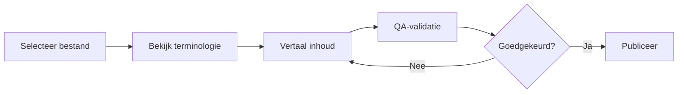
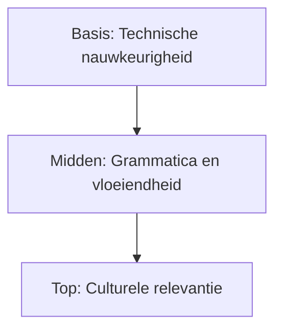

# 🇳🇱 Dutch (nl) Translation Guide

**Version 5.0 - Comprehensive Hack23 Edition**  
*Last Updated: January 2026*

---

## 📋 Quick Reference

| Attribute | Value |
|-----------|-------|
| **Language Code** | `nl` |
| **Locale** | `nl_NL` (Netherlands), `nl_BE` (Belgium) |
| **Text Direction** | LTR (Left-to-Right) → |
| **Currency** | EUR (€) |
| **Date Format** | `DD-MM-YYYY` or `1 januari 2026` |

---

## 🔄 Visual Translation Workflow

## 🔄 Quality Standards Pyramid

---

## 📚 Comprehensive Vocabulary Reference

### 🔥 Brand & Key Entities (Never Translate)

| English | Dutch | Notes |
|---------|-------|-------|
| Hack23 | Hack23 | Company name – never translate |
| Hack23 AB | Hack23 AB | Swedish company designation |
| Citizen Intelligence Agency | Citizen Intelligence Agency | Project name – keep English |
| CIA Compliance Manager | CIA Compliance Manager | Product name – keep English |
| Black Trigram | Black Trigram | Game product – keep English |
| 흑괘 | 흑괘 | Korean name for Black Trigram |
| James Pether Sörling | James Pether Sörling | Founder name |
| CISSP | CISSP | Certification |
| CISM | CISM | Certification |
| GitHub | GitHub | Platform name |
| LinkedIn | LinkedIn | Platform name |

### 🏢 Hack23 Business & Services

| English | Dutch | Notes |
|---------|-------|-------|
| Cybersecurity Consulting Sweden | Cybersecurity consulting in Zweden | Main tagline |
| Public ISMS | Openbaar ISMS | Core differentiator |
| Security Architecture | Beveiligingsarchitectuur | |
| Security Strategy | Beveiligingsstrategie | |
| Cloud Security | Cloudbeveiliging | |
| DevSecOps | DevSecOps | Keep English |
| Secure Development | Veilige ontwikkeling | |
| Code Quality | Codekwaliteit | |
| Compliance & Regulatory | Compliance en regelgeving | |
| Open Source Security | Open source beveiliging | |
| Security Culture | Beveiligingscultuur | |
| Security Training | Beveiligingstraining | |
| Full-Stack Security | Full-stack beveiliging | |
| Current Practitioner | Actieve beoefenaar | Value proposition |
| Transparent Security | Transparante beveiliging | |
| Developer-Friendly Security | Ontwikkelaarsvriendelijke beveiliging | |
| OSPO | OSPO | Open Source Program Office |
| Gothenburg | Göteborg | City in Sweden |
| Sweden | Zweden | |

### 🎮 Black Trigram Game Vocabulary

| English | Dutch | Notes |
|---------|-------|-------|
| Precision Combat Simulator | Precisie-gevechtssimulator | |
| Vital Points | Vitale punten | |
| 70 Anatomical Vital Points | 70 anatomische vitale punten | |
| Fighter Archetypes | Vechtersarchetypen | |
| Musa (Warrior) | Musa (Krijger) | |
| Amsalja (Assassin) | Amsalja (Moordenaar) | |
| Hacker | Hacker | |
| Jeongbo (Intelligence) | Jeongbo (Inlichtingen) | |
| Jojik (Organization) | Jojik (Organisatie) | |
| Korean Martial Arts | Koreaanse vechtsporten | |
| Taekkyeon | Taekkyeon | Korean martial art |
| Hapkido | Hapkido | Korean martial art |
| Cultural Preservation | Cultureel behoud | |
| Educational Gaming | Educatieve gaming | |
| Unity Game | Unity-game | |
| Steam | Steam | Platform name |
| itch.io | itch.io | Platform name |

### 🔍 Citizen Intelligence Agency Vocabulary

| English | Dutch | Notes |
|---------|-------|-------|
| Political Transparency | Politieke transparantie | |
| OSINT Platform | OSINT-platform | |
| Parliamentary Monitoring | Parlementaire monitoring | |
| Voting Records | Stemrecords | |
| Accountability Metrics | Verantwoordingsmetrieken | |
| Open Data | Open data | |
| Civic Technology | Burgertechnologie | |
| Swedish Parliament | Zweeds parlement | |
| Data Visualization | Datavisualisatie | |
| Political Analytics | Politieke analyse | |

### 🔐 CIA Compliance Manager Vocabulary

| English | Dutch | Notes |
|---------|-------|-------|
| Security Assessment Platform | Beveiligingsbeoordelingsplatform | |
| Business Impact Analysis | Bedrijfsimpactanalyse | |
| Multi-Framework Compliance | Multi-framework compliance | |
| STRIDE Analysis | STRIDE-analyse | Threat model |
| Threat Modeling | Dreigingsmodellering | |
| Evidence Collection | Bewijsverzameling | |
| Automated Compliance Reporting | Geautomatiseerde compliancerapportage | |
| Risk Register | Risicoregister | |
| Controls Monitoring | Controlemonitoring | |
| CRA Assessment | CRA-beoordeling | Cyber Resilience Act |

### 🍎 Discordian Philosophy & ISMS Blog

| English | Dutch | Notes |
|---------|-------|-------|
| Think for Yourself | Denk zelf | Core motto |
| Question Authority | Bevraag autoriteit | |
| FNORD | FNORD | Never translate |
| Nothing is True | Niets is waar | |
| Everything is Permitted | Alles is toegestaan | |
| Security Theater | Beveiligingstheater | Fake security |
| Radical Transparency | Radicale transparantie | |
| Chapel Perilous | Chapel Perilous | Keep English |
| Operation Mindfuck | Operation Mindfuck | Keep English |
| Illuminatus Trilogy | Illuminatus-trilogie | |
| Eris | Eris | Goddess of Chaos |
| Discordia | Discordia | |
| Law of Fives | Wet van Vijf | |
| Sacred Geometry | Heilige geometrie | |
| Five-Layer Architecture | Vijflaags architectuur | |
| Nation-State Surveillance | Staatssurveillance | |
| Crypto Backdoors | Crypto-achterdeuren | |
| Security Through Obscurity | Beveiliging door onduidelijkheid | Anti-pattern |
| Information Hoarding | Informatie oppotten | |
| Knowledge Transparency | Kennistransparantie | |
| Simon Moon | Simon Moon | Character reference |
| Hagbard Celine | Hagbard Celine | Character reference |
| George Dorn | George Dorn | Character reference |

### 🧭 Navigation & UI Elements

| English | Dutch |
|---------|-------|
| Home | Home |
| About Us | Over ons |
| Services | Diensten |
| Products | Producten |
| Projects | Projecten |
| Contact | Contact |
| Blog | Blog |
| Search | Zoeken |
| Menu | Menu |
| Close | Sluiten |
| Back | Terug |
| Next | Volgende |
| Previous | Vorige |
| Submit | Verzenden |
| Cancel | Annuleren |
| **Expand All** | **Alles uitvouwen** |
| **Collapse All** | **Alles invouwen** |
| Download | Download |
| Read More | Lees meer |
| View Details | Bekijk details |
| Privacy Policy | Privacybeleid |
| Terms of Service | Servicevoorwaarden |
| Copyright | Auteursrecht |
| Sitemap | Sitemap |
| FAQ | FAQ |
| Why Hack23 | Waarom Hack23 |
| Accessibility Statement | Toegankelijkheidsverklaring |
| Language | Taal |
| Share | Delen |
| Print | Afdrukken |
| Save | Opslaan |
| Edit | Bewerken |
| Delete | Verwijderen |
| Confirm | Bevestigen |
| Loading | Laden |
| Error | Fout |
| Success | Succes |
| Warning | Waarschuwing |

### 🔐 CIA Triad & Core Security Principles

| English | Dutch | Notes |
|---------|-------|-------|
| CIA Triad | CIA-driehoek | |
| CIA+ Framework | CIA+ Framework | Extended framework |
| **Confidentiality** | **Vertrouwelijkheid** | Data protection |
| **Integrity** | **Integriteit** | Data accuracy |
| **Availability** | **Beschikbaarheid** | System uptime |
| Non-Repudiation | Onweerlegbaarheid | |
| Authentication | Authenticatie | |
| Authorization | Autorisatie | |

### 🔒 Security & Cybersecurity Terminology

| English | Dutch | Notes |
|---------|-------|-------|
| Cybersecurity | Cybersecurity | |
| Information Security | Informatiebeveiliging | |
| ISMS | ISMS / Informatiebeveiligingsmanagementsysteem | |
| Security Policy | Beveiligingsbeleid | |
| Risk Management | Risicobeheer | |
| Risk Assessment | Risicobeoordeling | |
| Threat | Dreiging | |
| Vulnerability | Kwetsbaarheid | |
| Exploit | Exploit | |
| Patch | Patch / Beveiligingsupdate | |
| Firewall | Firewall | |
| Encryption | Encryptie / Versleuteling | |
| Decryption | Decryptie / Ontsleuteling | |
| Access Control | Toegangscontrole | |
| Multi-Factor Authentication (MFA) | Multi-factor authenticatie | |
| Single Sign-On (SSO) | Single Sign-On | |
| Phishing | Phishing | |
| Ransomware | Ransomware | |
| Malware | Malware | |
| Zero Trust | Zero Trust | |
| Defense in Depth | Diepteverdediging | |
| Least Privilege | Minimale rechten | |
| Incident Response | Incidentrespons | |
| Data Breach | Datalek | |
| Penetration Test | Penetratietest | |
| Audit | Audit | |
| Compliance | Compliance | |
| Governance | Governance | |
| Security Awareness | Beveiligingsbewustzijn | |
| Backup | Backup | |
| Disaster Recovery | Rampenherstel | |
| Business Continuity | Bedrijfscontinuïteit | |
| Supply Chain Security | Toeleveringsketenbeveiliging | |
| SLSA Level 3 | SLSA Niveau 3 | Supply chain security |
| Container Security | Containerbeveiliging | |
| Serverless Security | Serverless beveiliging | |
| API Security | API-beveiliging | |
| Endpoint Security | Eindpuntbeveiliging | |

### 🏛️ Regulatory & Standards

| English | Dutch | Notes |
|---------|-------|-------|
| ISO 27001 | ISO 27001 | Keep as-is |
| ISO 27001:2022 | ISO 27001:2022 | |
| GDPR | AVG / GDPR | EU regulation |
| NIS2 | NIS2-richtlijn | EU directive |
| NIST CSF | NIST CSF | |
| CIS Controls | CIS Controls | |
| SOC2 | SOC2 | |
| HIPAA | HIPAA | US healthcare |
| EU Cyber Resilience Act (CRA) | EU Cyber Resilience Act | |
| Annex A Controls | Bijlage A-controles | ISO 27001 |
| Statement of Applicability | Verklaring van toepasselijkheid | |

### 💼 Business & Professional Terms

| English | Dutch |
|---------|-------|
| Consulting | Consultancy |
| Enterprise | Onderneming |
| Strategy | Strategie |
| Certification | Certificering |
| Assessment | Beoordeling |
| Implementation | Implementatie |
| Audit | Audit |
| Review | Review |
| Gap Analysis | Gap-analyse |
| Roadmap | Roadmap |
| Best Practices | Best practices |
| Case Study | Casestudy |
| ROI | ROI |
| KPI | KPI |
| SLA | SLA |
| Stakeholder | Belanghebbende |
| Deliverable | Deliverable |
| Milestone | Mijlpaal |

### 📝 Blog Post Categories

| English | Dutch |
|---------|-------|
| Security Architecture | Beveiligingsarchitectuur |
| ISMS Policies | ISMS-beleid |
| Compliance Frameworks | Compliance-frameworks |
| Threat Modeling | Dreigingsmodellering |
| Secure Development | Veilige ontwikkeling |
| Cloud Security | Cloudbeveiliging |
| Access Control | Toegangscontrole |
| Cryptography | Cryptografie |
| Incident Response | Incidentrespons |
| Vulnerability Management | Kwetsbaarheidsbeheer |
| Asset Management | Assetbeheer |
| Network Security | Netwerkbeveiliging |
| Email Security | E-mailbeveiliging |
| Physical Security | Fysieke beveiliging |
| Mobile Device Security | Mobiele apparaatbeveiliging |
| Remote Access Security | Remote access beveiliging |
| Monitoring & Logging | Monitoring en logging |
| Security Metrics | Beveiligingsmetrieken |
| Third Party Risk | Derdenrisico |
| Change Management | Wijzigingsbeheer |

### 🏭 Industry-Specific Terms

| English | Dutch |
|---------|-------|
| Investment & FinTech | Investering en FinTech |
| Betting & Gaming | Gokken en gaming |
| Cannabis Security | Cannabisbeveiliging |
| Healthcare | Gezondheidszorg |
| Government | Overheid |
| Critical Infrastructure | Kritieke infrastructuur |
| Financial Services | Financiële diensten |
| E-commerce | E-commerce |

---

## ✅ Translation Checklist

- [ ] `<html lang="nl">` attribute set
- [ ] `<title>` translated
- [ ] `<meta name="description">` translated
- [ ] `og:locale` set to `nl_NL`
- [ ] All hreflang tags present (14 languages)
- [ ] Navigation menu translated
- [ ] Footer translated
- [ ] Brand names kept in English
- [ ] Technical terms verified
- [ ] Dutch compound words formed correctly

---

## 📝 Notes

- Use **formal business Dutch**
- Many English IT terms are used directly in Dutch
- Dutch uses many compound words (write as one word)
- AVG is the Dutch name for GDPR

---

*23 FNORD 5*
