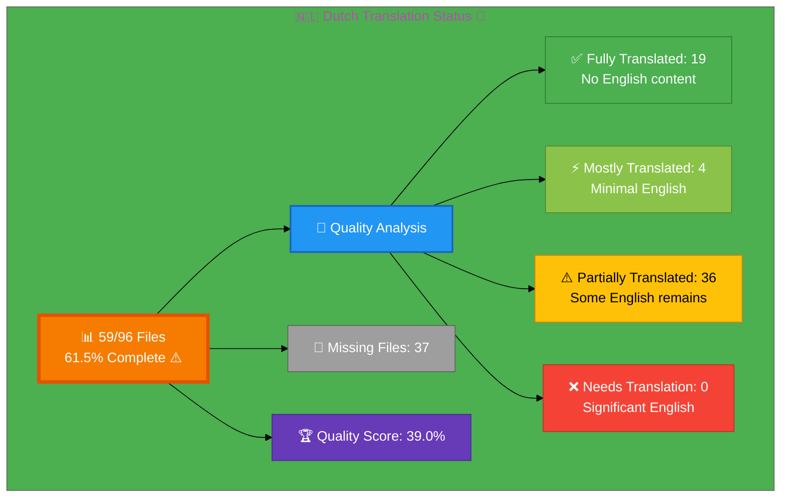

# 🇳🇱 Dutch Translation Status 🌷

## Executive Summary

**Language:** Dutch (nl)  
**Flag:** 🇳🇱 **Icon:** 🌷  
**Target Market:** Netherlands, Belgium (Flemish)  
**Last Updated:** December 2025

## 📊 Visual Status Overview

### 📄 File Coverage Summary

| Metric | Count | Percentage | Status |
|--------|-------|------------|--------|
| **📚 English Base Files** | 96 | 100% | ✅ |
| **🇳🇱 Dutch Files Exist** | 59 | **61.5%** | ⚠️ |
| **❌ Missing Files** | 37 | 38.5% | ⚠️ |

### 🎯 Translation Quality Analysis

Files analyzed for English content remaining:

| Quality Level | Count | Percentage | Description |
|--------------|-------|------------|-------------|
| ✅ **Fully Translated** | 19 | 32.2% | No English content detected |
| ⚡ **Mostly Translated** | 4 | 6.8% | Minimal English (technical terms only) |
| ⚠️  **Partially Translated** | 36 | 61.0% | Some English content remains |
| ❌ **Needs Translation** | 0 | 0.0% | Significant English placeholder content |

**🏆 Quality Score:** 39.0% of existing files are fully/mostly translated

**📈 Status:** ⚠️  In Progress - Active translation needed

### 🎉 Recent Progress (December 2025)

- ✅ Issue #818 completed: 5 European ISMS policy files added for Dutch
- ✅ Issue #815 completed: projects_nl.html created

## 📊 Files by Category

### Blog Posts (26 files)
- ✅ `blog-automated-convergence_nl.html` ← `blog-automated-convergence.html`
- ⚠️  `blog-betting-gaming-cybersecurity_nl.html` ← `blog-betting-gaming-cybersecurity.html`
- ✅ `blog-cannabis-cybersecurity-guide_nl.html` ← `blog-cannabis-cybersecurity-guide.html`
- ⚠️  `blog-cia-alternative-media-discordian-2026_nl.html` ← `blog-cia-alternative-media-discordian-2026.html`
- ⚠️  `blog-cia-architecture_nl.html` ← `blog-cia-architecture.html`
- ⚠️  `blog-cia-business-case-global-news_nl.html` ← `blog-cia-business-case-global-news.html`
- ⚠️  `blog-cia-financial-strategy_nl.html` ← `blog-cia-financial-strategy.html`
- ⚠️  `blog-cia-future-security_nl.html` ← `blog-cia-future-security.html`
- ⚠️  `blog-cia-mindmaps_nl.html` ← `blog-cia-mindmaps.html`
- ⚠️  `blog-cia-osint-intelligence_nl.html` ← `blog-cia-osint-intelligence.html`
- ⚠️  `blog-cia-security_nl.html` ← `blog-cia-security.html`
- ⚠️  `blog-cia-swedish-media-election-2026_nl.html` ← `blog-cia-swedish-media-election-2026.html`
- ✅ `blog-cia-workflows_nl.html` ← `blog-cia-workflows.html`
- ⚠️  `blog-compliance-architecture_nl.html` ← `blog-compliance-architecture.html`
- ⚠️  `blog-compliance-future_nl.html` ← `blog-compliance-future.html`
- ⚡ `blog-compliance-security_nl.html` ← `blog-compliance-security.html`
- ⚠️  `blog-george-dorn-cia-code_nl.html` ← `blog-george-dorn-cia-code.html`
- ⚡ `blog-george-dorn-compliance-code_nl.html` ← `blog-george-dorn-compliance-code.html`
- ⚠️  `blog-george-dorn-trigram-code_nl.html` ← `blog-george-dorn-trigram-code.html`
- ✅ `blog-information-hoarding_nl.html` ← `blog-information-hoarding.html`
- ⚠️  `blog-investment-firm-security_nl.html` ← `blog-investment-firm-security.html`
- ⚠️  `blog-medical-cannabis-hipaa-gdpr_nl.html` ← `blog-medical-cannabis-hipaa-gdpr.html`
- ✅ `blog-public-isms-benefits_nl.html` ← `blog-public-isms-benefits.html`
- ⚠️  `blog-trigram-architecture_nl.html` ← `blog-trigram-architecture.html`
- ⚠️  `blog-trigram-combat_nl.html` ← `blog-trigram-combat.html`
- ⚠️  `blog-trigram-future_nl.html` ← `blog-trigram-future.html`

### Core Pages (7 files)
- ✅ `accessibility-statement_nl.html` ← `accessibility-statement.html`
- ⚠️  `blog_nl.html` ← `blog.html`
- ⚠️  `index_nl.html` ← `index.html`
- ✅ `projects_nl.html` ← `projects.html`
- ⚠️  `services_nl.html` ← `services.html`
- ✅ `sitemap_nl.html` ← `sitemap.html`
- ✅ `why-hack23_nl.html` ← `why-hack23.html`

### ISMS Documentation (9 files)
- ✅ `discordian-access-control_nl.html` ← `discordian-access-control.html`
- ✅ `discordian-asset-mgmt_nl.html` ← `discordian-asset-mgmt.html`
- ✅ `discordian-business-continuity_nl.html` ← `discordian-business-continuity.html`
- ⚠️  `discordian-compliance-frameworks_nl.html` ← `discordian-compliance-frameworks.html`
- ⚠️  `discordian-compliance_nl.html` ← `discordian-compliance.html`
- ✅ `discordian-incident-response_nl.html` ← `discordian-incident-response.html`
- ⚡ `discordian-isms-review_nl.html` ← `discordian-isms-review.html`
- ⚠️  `discordian-isms-transparency_nl.html` ← `discordian-isms-transparency.html`
- ✅ `discordian-risk-assessment_nl.html` ← `discordian-risk-assessment.html`

### ISMS Policy Files (1 files)
- ⚡ `discordian-info-sec-policy_nl.html` ← `discordian-info-sec-policy.html`

### ISO 27001 Resources (2 files)
- ✅ `iso-27001-2022-vs-2013_nl.html` ← `iso-27001-2022-vs-2013.html`
- ✅ `iso-27001-implementation-mistakes_nl.html` ← `iso-27001-implementation-mistakes.html`

### Industry Solutions (3 files)
- ⚠️  `industries-betting-gaming_nl.html` ← `industries-betting-gaming.html`
- ⚠️  `industries-cannabis-security_nl.html` ← `industries-cannabis-security.html`
- ⚠️  `industries-investment-fintech_nl.html` ← `industries-investment-fintech.html`

### Other Pages (1 files)
- ✅ `security-assessment-checklist_nl.html` ← `security-assessment-checklist.html`

### Product Pages (10 files)
- ⚠️  `black-trigram-docs_nl.html` ← `black-trigram-docs.html`
- ⚠️  `black-trigram-features_nl.html` ← `black-trigram-features.html`
- ✅ `black-trigram_nl.html` ← `black-trigram.html`
- ⚠️  `cia-compliance-manager-docs_nl.html` ← `cia-compliance-manager-docs.html`
- ⚠️  `cia-compliance-manager-features_nl.html` ← `cia-compliance-manager-features.html`
- ⚠️  `cia-docs_nl.html` ← `cia-docs.html`
- ⚠️  `cia-features_nl.html` ← `cia-features.html`
- ⚠️  `cia-project_nl.html` ← `cia-project.html`
- ✅ `cia-triad-faq_nl.html` ← `cia-triad-faq.html`
- ⚠️  `compliance-manager_nl.html` ← `compliance-manager.html`

## ⚠️  Missing Translation Files (37 files)

These English pages exist but have no corresponding translation file:

### ISMS Documentation (32 files)
- ❌ `discordian-acceptable-use_nl.html` ← `discordian-acceptable-use.html`
- ❌ `discordian-backup-recovery_nl.html` ← `discordian-backup-recovery.html`
- ❌ `discordian-business-value_nl.html` ← `discordian-business-value.html`
- ❌ `discordian-change-mgmt_nl.html` ← `discordian-change-mgmt.html`
- ❌ `discordian-classification_nl.html` ← `discordian-classification.html`
- ❌ `discordian-cloud-security_nl.html` ← `discordian-cloud-security.html`
- ❌ `discordian-cra-conformity_nl.html` ← `discordian-cra-conformity.html`
- ❌ `discordian-cra_nl.html` ← `discordian-cra.html`
- ❌ `discordian-crypto_nl.html` ← `discordian-crypto.html`
- ❌ `discordian-cybersecurity_nl.html` ← `discordian-cybersecurity.html`
- ❌ `discordian-data-classification_nl.html` ← `discordian-data-classification.html`
- ❌ `discordian-data-protection_nl.html` ← `discordian-data-protection.html`
- ❌ `discordian-disaster-recovery_nl.html` ← `discordian-disaster-recovery.html`
- ❌ `discordian-email-security_nl.html` ← `discordian-email-security.html`
- ❌ `discordian-llm-security_nl.html` ← `discordian-llm-security.html`
- ❌ `discordian-mobile-device_nl.html` ← `discordian-mobile-device.html`
- ❌ `discordian-monitoring-logging_nl.html` ← `discordian-monitoring-logging.html`
- ❌ `discordian-network-security_nl.html` ← `discordian-network-security.html`
- ❌ `discordian-open-source_nl.html` ← `discordian-open-source.html`
- ❌ `discordian-physical-security_nl.html` ← `discordian-physical-security.html`
- ❌ `discordian-privacy_nl.html` ← `discordian-privacy.html`
- ❌ `discordian-remote-access_nl.html` ← `discordian-remote-access.html`
- ❌ `discordian-risk-register_nl.html` ← `discordian-risk-register.html`
- ❌ `discordian-secure-dev_nl.html` ← `discordian-secure-dev.html`
- ❌ `discordian-security-metrics_nl.html` ← `discordian-security-metrics.html`
- ❌ `discordian-security-strategy_nl.html` ← `discordian-security-strategy.html`
- ❌ `discordian-security-training_nl.html` ← `discordian-security-training.html`
- ❌ `discordian-stakeholders_nl.html` ← `discordian-stakeholders.html`
- ❌ `discordian-supplier-reality_nl.html` ← `discordian-supplier-reality.html`
- ❌ `discordian-third-party_nl.html` ← `discordian-third-party.html`
- ❌ `discordian-threat-modeling_nl.html` ← `discordian-threat-modeling.html`
- ❌ `discordian-vuln-mgmt_nl.html` ← `discordian-vuln-mgmt.html`

### ISMS Policy Files (1 files)
- ❌ `discordian-ai-policy_nl.html` ← `discordian-ai-policy.html`

### ISO 27001 Resources (2 files)
- ❌ `iso-27001-certification-costs-sweden_nl.html` ← `iso-27001-certification-costs-sweden.html`
- ❌ `iso-27001-implementation-sweden_nl.html` ← `iso-27001-implementation-sweden.html`

### Other Pages (2 files)
- ❌ `breadcrumb-example_nl.html` ← `breadcrumb-example.html`
- ❌ `swedish-election-2026_nl.html` ← `swedish-election-2026.html`

## 🛠️ Technical Implementation

### ✅ Metadata Configuration
All files properly implement:
- `<html lang="nl">`
- `og:locale: nl_NL`
- `inLanguage: "nl"`

### 🌐 Hreflang Configuration
All pages include complete hreflang tags for:
- ✅ All 14 language variants (13 languages + x-default)
- ✅ Proper language-region combinations
- ✅ Canonical URLs for each locale

### 📊 Schema.org Structured Data
- ✅ Proper localization in all structured data
- ✅ Breadcrumb navigation localized
- ✅ All Schema.org markup validated

## 📈 Quality Metrics & Validation

### ✅ Technical Quality (All Files)
- **HTML Validation:** ✅ PASS (59/59 files)
- **Hreflang Tags:** ✅ PASS (14 variants per file)
- **Schema.org:** ✅ PASS (validated structured data)
- **Mobile Responsive:** ✅ PASS (all viewports)
- **Accessibility:** ✅ WCAG 2.1 AA compliant

### 🎯 Translation Quality (Content)
- **✅ Fully Translated:** 19 files (32.2%)
- **⚡ Mostly Translated:** 4 files (6.8%)
- **⚠️  Needs Work:** 36 files (61.0%)
- **🏆 Overall Quality:** 39.0%

## 🚀 Next Steps & Priorities

### 🚧 Active Development Phase
1. **Complete Core Files:** Focus on high-priority core pages and products
2. **Quality Improvement:** Address 36 files with English content
3. **Create Missing Files:** Develop 37 translation files with professional content

### 📋 Priority Order
1. **🔴 High Priority:** Core pages (homepage, services, products, why-hack23)
2. **🟡 Medium Priority:** ISMS policies, ISO 27001 resources, industry solutions
3. **🟢 Lower Priority:** Blog posts, supplementary content

## 📚 References & Resources

- **📖 Translation Guide:** `Dutch-Translation-Guide.md`
- **📋 Master Documentation:** `TRANSLATION_DOCUMENTATION_README.md`
- **🌐 All Dutch Files:** `*_nl.html` (59 files total)
- **🎯 Quality Target:** 100% completion, 90%+ quality score

## ✅ Validation Checklist

- [x] **HTML Well-Formed:** 59/59 files validated
- [x] **Hreflang Tags:** Complete 14-variant configuration
- [x] **Schema.org:** All structured data validated
- [ ] **Translation Quality:** In Progress (39.0%)
- [ ] **Grammar Review:** Ongoing
- [ ] **Technical Terms:** In Review
- [x] **Links Functional:** All internal/external links tested
- [x] **Mobile Responsive:** All viewports (320px - 4K)
- [x] **Accessibility:** WCAG 2.1 AA compliant

---

**📊 Status Summary**  
**Overall:** ⚠️  In Progress  
**Last Review:** December 2025  
**Completion:** 61.5% (59/96 files)  
**Quality Score:** 39.0% fully/mostly translated  
**Files Validated:** ✅ All 59 files checked  
**Next Milestone:** 🎯 Achieve 100% completion
