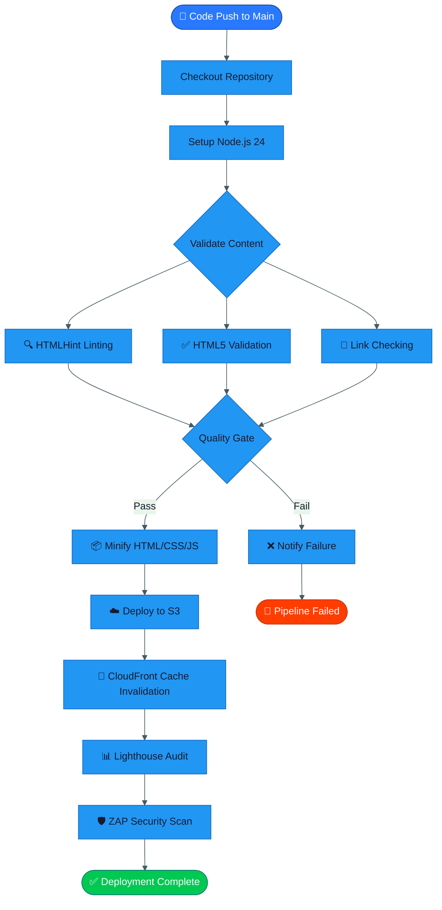
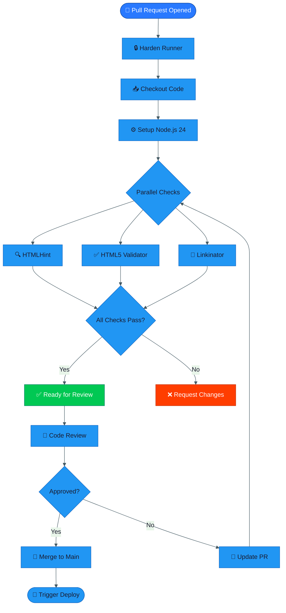
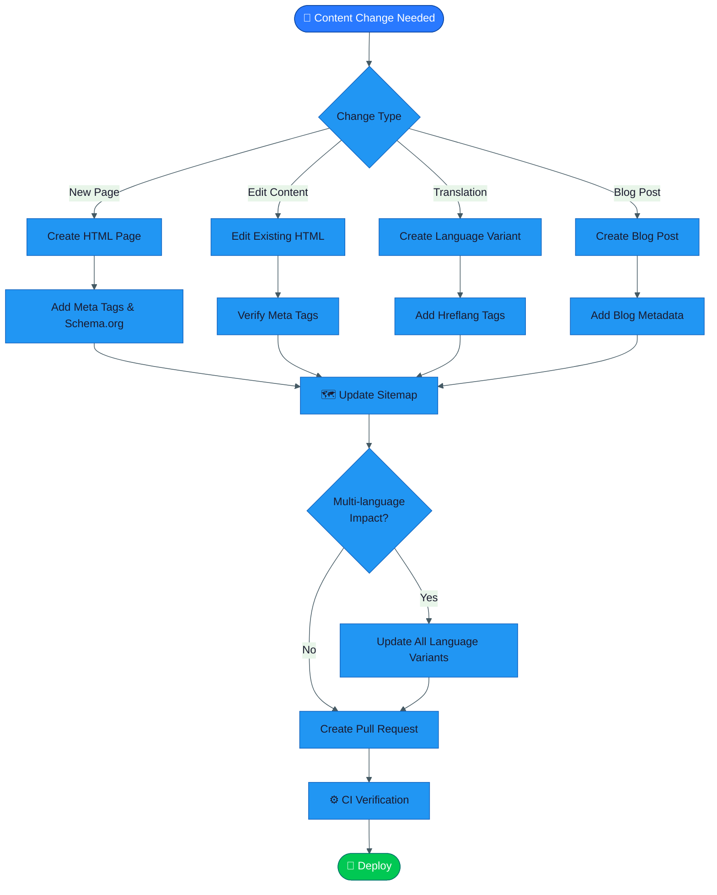
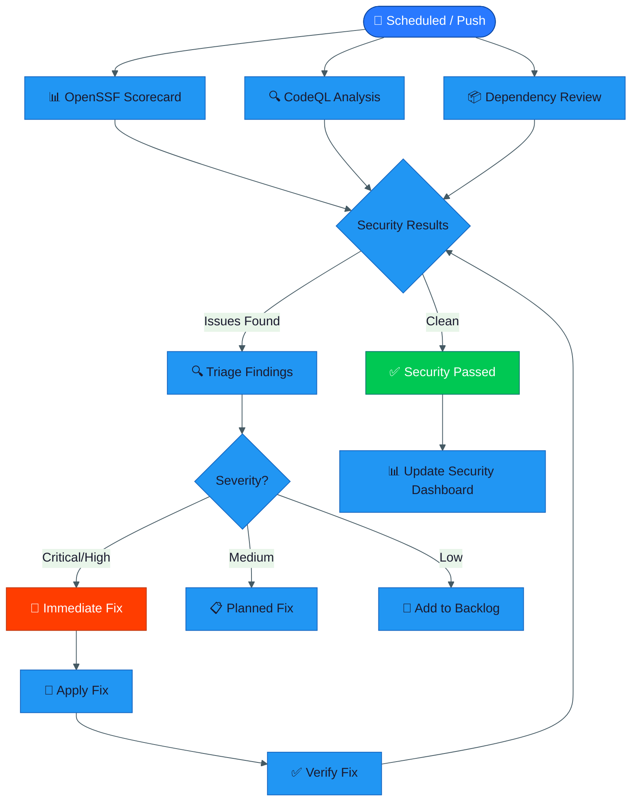
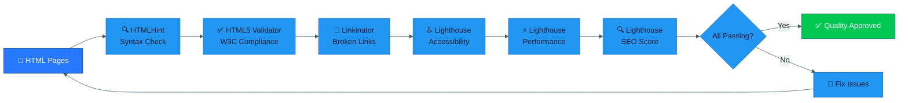
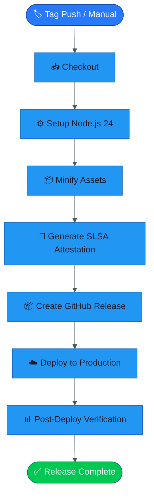

  

<h1 align="center">🔄 Hack23 Homepage — Flowcharts</h1>

  <strong>Process Flows: CI/CD, Deployment, and Content Management</strong> 
  <em>Workflow Documentation for hack23.com</em>

  
  
  
  

**📋 Document Owner:** CEO | **📄 Version:** 1.0 | **📅 Last Updated:** 2026-02-20 (UTC)
**🔄 Review Cycle:** Quarterly | **⏰ Next Review:** 2026-05-20
**🏷️ Classification:**   

---

## 📚 Related Documentation

| Document | Focus | Description |
|----------|-------|-------------|
| **[🏛️ Architecture](ARCHITECTURE.md)** | C4 Model | System structure and containers |
| **[📊 Data Model](DATA_MODEL.md)** | Data | Content model and data structures |
| **[🔄 Flowchart](FLOWCHART.md)** | Processes | Process flows (this document) |
| **[📈 State Diagram](STATEDIAGRAM.md)** | States | Deployment and content lifecycle |
| **[🔄 Workflows](WORKFLOWS.md)** | CI/CD | GitHub Actions workflow details |
| **[🛡️ CRA Assessment](CRA-ASSESSMENT.md)** | Compliance | EU Cyber Resilience Act conformity |
| **[🚀 Future Flowchart](FUTURE_FLOWCHART.md)** | Roadmap | Planned process improvements |

---

## 🎯 Overview

This document provides comprehensive flowcharts for the Hack23 homepage, documenting all major processes including CI/CD deployment, content updates, security scanning, and quality assurance workflows.

---

## 🚀 Main Deployment Flow

```mermaid
%%{init: {"theme": "base", "themeVariables": {"primaryColor": "#2196F3", "primaryTextColor": "#1a1a2e", "lineColor": "#455A64", "secondaryColor": "#e8f5e9", "tertiaryColor": "#fff8e1", "primaryBorderColor": "#1565C0"}}}%%
flowchart TD
    Start([📝 Code Push to Main]) --> Checkout[Checkout Repository]
    Checkout --> Setup[Setup Node.js 24]
    Setup --> Validate{Validate Content}

    Validate --> HTMLHint[🔍 HTMLHint Linting]
    Validate --> HTML5Val[✅ HTML5 Validation]
    Validate --> LinkCheck[🔗 Link Checking]

    HTMLHint --> QualityGate{Quality Gate}
    HTML5Val --> QualityGate
    LinkCheck --> QualityGate

    QualityGate -->|Pass| Minify[📦 Minify HTML/CSS/JS]
    QualityGate -->|Fail| FailNotify[❌ Notify Failure]

    Minify --> Deploy[☁️ Deploy to S3]
    Deploy --> Invalidate[🔄 CloudFront Cache Invalidation]
    Invalidate --> Lighthouse[📊 Lighthouse Audit]

    Lighthouse --> SecurityScan[🛡️ ZAP Security Scan]
    SecurityScan --> Complete([✅ Deployment Complete])

    FailNotify --> End([🛑 Pipeline Failed])

    style Start fill:#2979FF,stroke:#0D47A1,color:#fff
    style Complete fill:#00C853,stroke:#00796B,color:#fff
    style End fill:#FF3D00,stroke:#BF360C,color:#fff
```

---

## 🔀 Pull Request Verification Flow

```mermaid
%%{init: {"theme": "base", "themeVariables": {"primaryColor": "#2196F3", "primaryTextColor": "#1a1a2e", "lineColor": "#455A64", "secondaryColor": "#e8f5e9", "tertiaryColor": "#fff8e1", "primaryBorderColor": "#1565C0"}}}%%
flowchart TD
    PR([🔀 Pull Request Opened]) --> Harden[🔒 Harden Runner]
    Harden --> Checkout[📥 Checkout Code]
    Checkout --> SetupNode[⚙️ Setup Node.js 24]

    SetupNode --> ParallelChecks{Parallel Checks}

    ParallelChecks --> HTMLHint[🔍 HTMLHint]
    ParallelChecks --> HTML5Val[✅ HTML5 Validator]
    ParallelChecks --> LinkCheck[🔗 Linkinator]

    HTMLHint --> Results{All Checks Pass?}
    HTML5Val --> Results
    LinkCheck --> Results

    Results -->|Yes| Approve[✅ Ready for Review]
    Results -->|No| RequestChanges[❌ Request Changes]

    Approve --> Review[👤 Code Review]
    Review --> Merge{Approved?}

    Merge -->|Yes| MergeToMain[🔀 Merge to Main]
    Merge -->|No| Update[📝 Update PR]
    Update --> ParallelChecks

    MergeToMain --> DeployTrigger([🚀 Trigger Deploy])

    style PR fill:#2979FF,stroke:#0D47A1,color:#fff
    style Approve fill:#00C853,stroke:#00796B,color:#fff
    style RequestChanges fill:#FF3D00,stroke:#BF360C,color:#fff
```

---

## 📝 Content Update Flow

```mermaid
%%{init: {"theme": "base", "themeVariables": {"primaryColor": "#2196F3", "primaryTextColor": "#1a1a2e", "lineColor": "#455A64", "secondaryColor": "#e8f5e9", "tertiaryColor": "#fff8e1", "primaryBorderColor": "#1565C0"}}}%%
flowchart TD
    Start([📝 Content Change Needed]) --> Identify{Change Type}

    Identify -->|New Page| CreatePage[Create HTML Page]
    Identify -->|Edit Content| EditHTML[Edit Existing HTML]
    Identify -->|Translation| Translate[Create Language Variant]
    Identify -->|Blog Post| CreateBlog[Create Blog Post]

    CreatePage --> AddMeta[Add Meta Tags & Schema.org]
    EditHTML --> ValidateMeta[Verify Meta Tags]
    Translate --> AddHreflang[Add Hreflang Tags]
    CreateBlog --> AddBlogMeta[Add Blog Metadata]

    AddMeta --> UpdateSitemap[🗺️ Update Sitemap]
    ValidateMeta --> UpdateSitemap
    AddHreflang --> UpdateSitemap
    AddBlogMeta --> UpdateSitemap

    UpdateSitemap --> CheckI18n{Multi-language<br/>Impact?}

    CheckI18n -->|Yes| UpdateTranslations[Update All Language Variants]
    CheckI18n -->|No| CreatePR[Create Pull Request]

    UpdateTranslations --> CreatePR
    CreatePR --> CIChecks[⚙️ CI Verification]
    CIChecks --> Deploy([🚀 Deploy])

    style Start fill:#2979FF,stroke:#0D47A1,color:#fff
    style Deploy fill:#00C853,stroke:#00796B,color:#fff
```

---

## 🛡️ Security Scanning Flow

```mermaid
%%{init: {"theme": "base", "themeVariables": {"primaryColor": "#2196F3", "primaryTextColor": "#1a1a2e", "lineColor": "#455A64", "secondaryColor": "#e8f5e9", "tertiaryColor": "#fff8e1", "primaryBorderColor": "#1565C0"}}}%%
flowchart TD
    Trigger([🔄 Scheduled / Push]) --> Scorecard[📊 OpenSSF Scorecard]
    Trigger --> CodeQL[🔍 CodeQL Analysis]
    Trigger --> DepReview[📦 Dependency Review]

    Scorecard --> Results{Security Results}
    CodeQL --> Results
    DepReview --> Results

    Results -->|Issues Found| Triage[🔍 Triage Findings]
    Results -->|Clean| Passed[✅ Security Passed]

    Triage --> Severity{Severity?}

    Severity -->|Critical/High| Immediate[🚨 Immediate Fix]
    Severity -->|Medium| Planned[📋 Planned Fix]
    Severity -->|Low| Backlog[📝 Add to Backlog]

    Immediate --> Fix[🔧 Apply Fix]
    Fix --> Verify[✅ Verify Fix]
    Verify --> Results

    Passed --> Report[📊 Update Security Dashboard]

    style Trigger fill:#2979FF,stroke:#0D47A1,color:#fff
    style Passed fill:#00C853,stroke:#00796B,color:#fff
    style Immediate fill:#FF3D00,stroke:#BF360C,color:#fff
```

---

## 📊 Quality Assurance Flow

```mermaid
%%{init: {"theme": "base", "themeVariables": {"primaryColor": "#2196F3", "primaryTextColor": "#1a1a2e", "lineColor": "#455A64", "secondaryColor": "#e8f5e9", "tertiaryColor": "#fff8e1", "primaryBorderColor": "#1565C0"}}}%%
flowchart LR
    Input[📄 HTML Pages] --> Lint[🔍 HTMLHint<br/>Syntax Check]
    Lint --> Validate[✅ HTML5 Validator<br/>W3C Compliance]
    Validate --> Links[🔗 Linkinator<br/>Broken Links]
    Links --> A11y[♿ Lighthouse<br/>Accessibility]
    A11y --> Perf[⚡ Lighthouse<br/>Performance]
    Perf --> SEO[🔍 Lighthouse<br/>SEO Score]
    SEO --> Output{All Passing?}

    Output -->|Yes| Ready[✅ Quality Approved]
    Output -->|No| Fix[🔧 Fix Issues]
    Fix --> Input

    style Input fill:#2979FF,stroke:#0D47A1,color:#fff
    style Ready fill:#00C853,stroke:#00796B,color:#fff
```

---

## 🏗️ Release Build Flow

```mermaid
%%{init: {"theme": "base", "themeVariables": {"primaryColor": "#2196F3", "primaryTextColor": "#1a1a2e", "lineColor": "#455A64", "secondaryColor": "#e8f5e9", "tertiaryColor": "#fff8e1", "primaryBorderColor": "#1565C0"}}}%%
flowchart TD
    Tag([🏷️ Tag Push / Manual]) --> Checkout[📥 Checkout]
    Checkout --> Setup[⚙️ Setup Node.js 24]
    Setup --> Minify[📦 Minify Assets]
    Minify --> Attest[🔏 Generate SLSA Attestation]
    Attest --> Release[📦 Create GitHub Release]
    Release --> Deploy[☁️ Deploy to Production]
    Deploy --> PostDeploy[📊 Post-Deploy Verification]
    PostDeploy --> Done([✅ Release Complete])

    style Tag fill:#2979FF,stroke:#0D47A1,color:#fff
    style Done fill:#00C853,stroke:#00796B,color:#fff
```

---

## 📋 ISMS Compliance

These process flows align with:

- 🔗 **[Secure Development Policy](https://github.com/Hack23/ISMS-PUBLIC/blob/main/Secure_Development_Policy.md)** — CI/CD security requirements
- 🔗 **[Vulnerability Management](https://github.com/Hack23/ISMS-PUBLIC/blob/main/Vulnerability_Management.md)** — Security scanning and remediation
- 🔗 **[Information Security Policy](https://github.com/Hack23/ISMS-PUBLIC/blob/main/Information_Security_Policy.md)** — Change management processes
