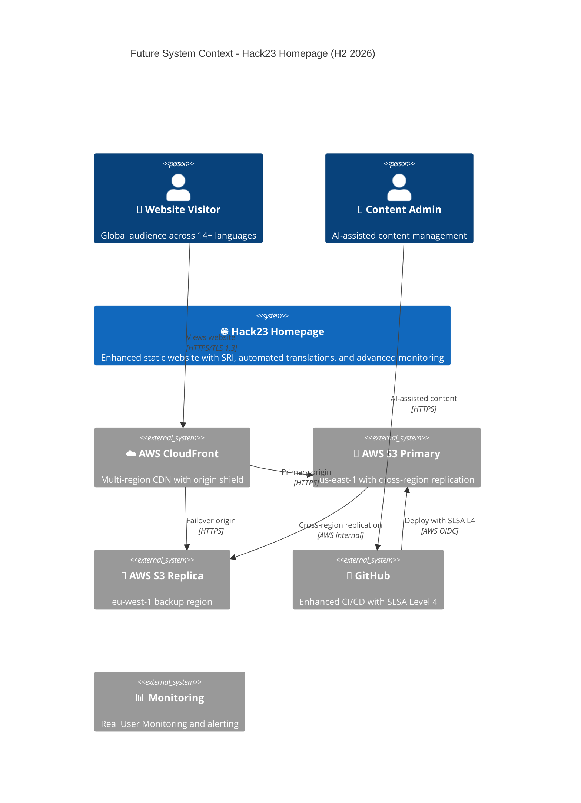
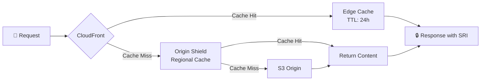

<p align="center">
  
</p>

<h1 align="center">🚀 Hack23 Homepage — Future Architecture</h1>

<p align="center">
  <strong>Architectural Evolution Roadmap: H1–H2 2026</strong><br>
  <em>Planned Enhancements for hack23.com</em>
</p>

<p align="center">
  
  
  
  
</p>


[](https://scorecard.dev/viewer/?uri=github.com/Hack23/homepage)

**📋 Document Owner:** CEO | **📄 Version:** 1.0 | **📅 Last Updated:** 2026-02-20 (UTC)
**🔄 Review Cycle:** Quarterly | **⏰ Next Review:** 2026-05-20
**🏷️ Classification:** [](https://github.com/Hack23/ISMS-PUBLIC/blob/main/CLASSIFICATION.md#confidentiality-levels) [](https://github.com/Hack23/ISMS-PUBLIC/blob/main/CLASSIFICATION.md#integrity-levels) [](https://github.com/Hack23/ISMS-PUBLIC/blob/main/CLASSIFICATION.md#availability-levels)

---

## 📚 Related Documentation

| Document | Focus | Description |
|----------|-------|-------------|
| **[🏛️ Architecture](ARCHITECTURE.md)** | C4 Model | Current system architecture |
| **[🚀 Future Architecture](FUTURE_ARCHITECTURE.md)** | Roadmap | Evolution plans (this document) |
| **[🛡️ Security Architecture](SECURITY_ARCHITECTURE.md)** | Security | Current security controls |
| **[🚀 Future Security Architecture](FUTURE_SECURITY_ARCHITECTURE.md)** | Security Roadmap | Planned security enhancements |
| **[🔄 Workflows](WORKFLOWS.md)** | CI/CD | Current workflow documentation |
| **[🚀 Future Workflows](FUTURE_WORKFLOWS.md)** | CI/CD Roadmap | Planned workflow improvements |

---

## 🎯 Evolution Roadmap

### Q1 2026 — Enhanced Content Pipeline

| Enhancement | Description | Status |
|------------|-------------|--------|
| **Subresource Integrity (SRI)** | Hash-based integrity for external resources | 🟡 Planned |
| **Automated Translation Pipeline** | AI-assisted translation with quality gates | 🟡 Planned |
| **Enhanced Performance Monitoring** | Real User Monitoring integration | 🟡 Planned |

### Q2 2026 — Infrastructure Improvements

| Enhancement | Description | Status |
|------------|-------------|--------|
| **Multi-Region S3 Replication** | Cross-region content replication for resilience | 🔵 Future |
| **Enhanced CDN Configuration** | Origin shield and custom error pages | 🔵 Future |
| **SLSA Build Level 4** | Hermetic, reproducible builds | 🔵 Future |

---

## 🌐 Future System Context



---

## 🔮 Planned Enhancements

### Subresource Integrity (SRI)

```html
<!-- Future: SRI for all external resources -->
<link rel="stylesheet" href="styles.css"
      integrity="sha384-{hash}"
      crossorigin="anonymous">
```

### Enhanced Caching Strategy



---

## 📋 ISMS Compliance

Future architecture enhancements align with:

- 🔗 **[Secure Development Policy](https://github.com/Hack23/ISMS-PUBLIC/blob/main/Secure_Development_Policy.md)** — SLSA Level 4 requirements
- 🔗 **[Network Security Policy](https://github.com/Hack23/ISMS-PUBLIC/blob/main/Network_Security_Policy.md)** — Multi-region infrastructure
- 🔗 **[Backup & Recovery Policy](https://github.com/Hack23/ISMS-PUBLIC/blob/main/Backup_Recovery_Policy.md)** — Cross-region replication
- 🔗 **[Cryptography Policy](https://github.com/Hack23/ISMS-PUBLIC/blob/main/Cryptography_Policy.md)** — SRI hash integrity
