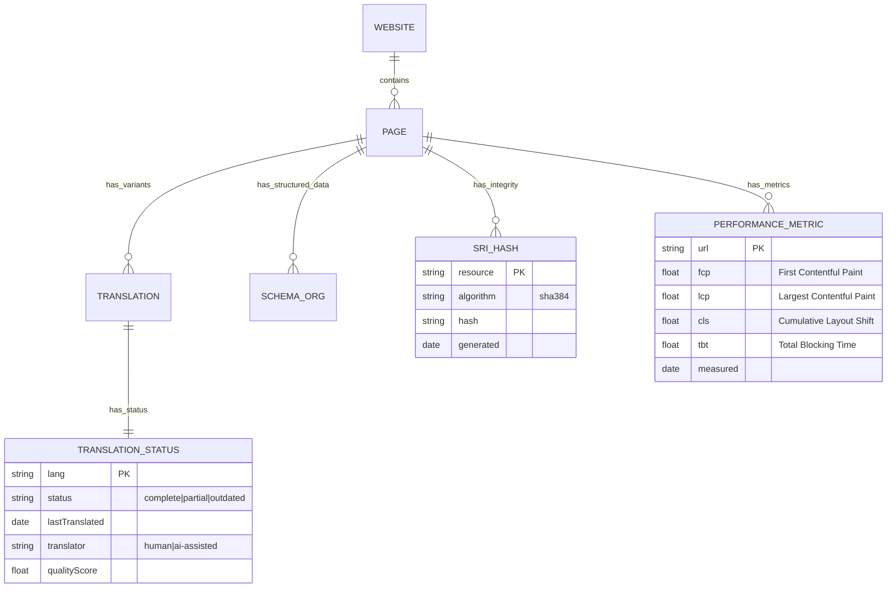
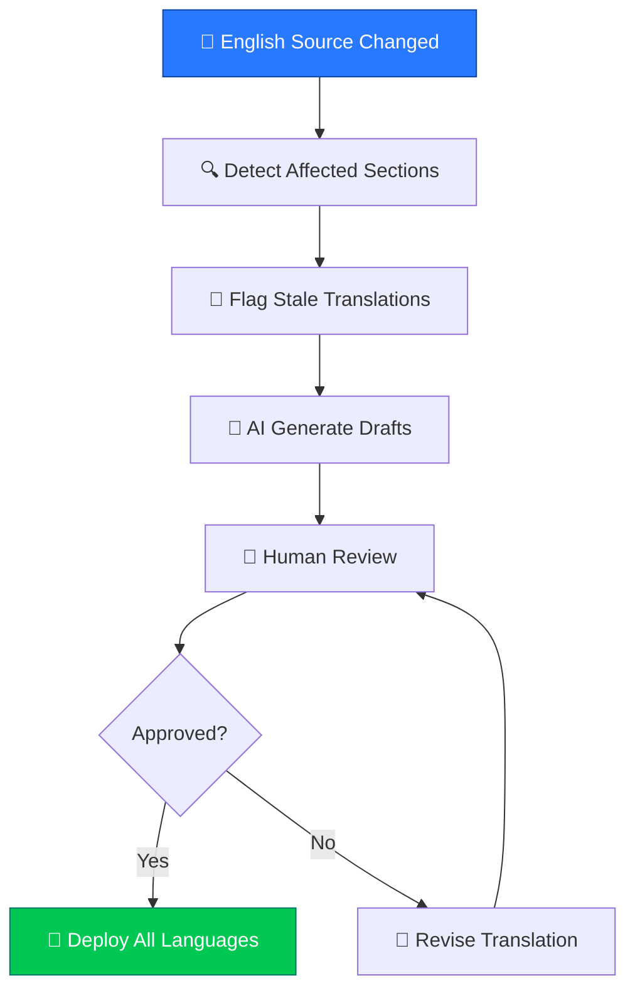

<p align="center">
  
</p>

<h1 align="center">📊 Hack23 Homepage — Future Data Model</h1>

<p align="center">
  <strong>Enhanced Content Model: Planned Improvements</strong><br>
  <em>Content Architecture Evolution for hack23.com</em>
</p>

<p align="center">
  
  
  
  
</p>


[](https://scorecard.dev/viewer/?uri=github.com/Hack23/homepage)

**📋 Document Owner:** CEO | **📄 Version:** 1.0 | **📅 Last Updated:** 2026-02-20 (UTC)
**🔄 Review Cycle:** Quarterly | **⏰ Next Review:** 2026-05-20
**🏷️ Classification:** [](https://github.com/Hack23/ISMS-PUBLIC/blob/main/CLASSIFICATION.md#confidentiality-levels) [](https://github.com/Hack23/ISMS-PUBLIC/blob/main/CLASSIFICATION.md#integrity-levels) [](https://github.com/Hack23/ISMS-PUBLIC/blob/main/CLASSIFICATION.md#availability-levels)

---

## 📚 Related Documentation

| Document | Focus | Description |
|----------|-------|-------------|
| **[📊 Data Model](DATA_MODEL.md)** | Data | Current content model |
| **[📊 Future Data Model](FUTURE_DATA_MODEL.md)** | Roadmap | Planned enhancements (this document) |
| **[🏛️ Architecture](ARCHITECTURE.md)** | C4 Model | Current system architecture |
| **[🚀 Future Architecture](FUTURE_ARCHITECTURE.md)** | Roadmap | Architecture evolution plans |

---

## 🎯 Overview

This document outlines planned enhancements to the Hack23 homepage content model, focusing on improved structured data, automated translation management, and enhanced content organization.

---

## 📐 Enhanced Content Model

### Planned Entity Additions



---

## 🌍 Enhanced Translation Model

### Current vs Future Translation Management

| Aspect | Current | Future |
|--------|---------|--------|
| **Tracking** | Manual status files | Automated translation status database |
| **Quality** | Human review | AI-assisted quality scoring |
| **Staleness** | Manual detection | Automatic staleness detection |
| **Coverage** | Per-file tracking | Per-section tracking |

### Translation Pipeline Enhancement



---

## 📋 Enhanced Schema.org Model

### Planned Structured Data Enhancements

| Schema Type | Current | Future |
|-------------|---------|--------|
| **Organization** | ✅ Basic | Enhanced with service offerings |
| **WebPage** | ✅ Basic | With dateModified tracking |
| **FAQPage** | ✅ Implemented | Expanded to more pages |
| **BreadcrumbList** | ✅ Implemented | Enhanced with multilingual breadcrumbs |
| **Service** | ❌ Missing | Add consulting service descriptions |
| **SoftwareApplication** | ❌ Missing | Add for open-source projects |
| **HowTo** | ❌ Missing | Add for security implementation guides |

---

## 🔒 Data Security Enhancements

### SRI Hash Management

All static resources will include Subresource Integrity hashes:

```html
<link rel="stylesheet" href="styles.css"
      integrity="sha384-oqVuAfXRKap7fdgcCY5uykM6+R9GqQ8K/uxy9rx7HNQlGYl1kPzQho1wx4JwY8w"
      crossorigin="anonymous">
```

### Classification Updates

Future data types and their planned classifications per **[Hack23 Classification Framework](https://github.com/Hack23/ISMS-PUBLIC/blob/main/CLASSIFICATION.md)**:

| Data Type | Confidentiality | Integrity | Availability |
|-----------|----------------|-----------|--------------|
| **Translation Status** | Public | Low | Standard |
| **Performance Metrics** | Internal | Medium | Standard |
| **SRI Hashes** | Public | High | High |

---

## 📋 ISMS Compliance

Future data model enhancements align with:

- 🔗 **[Secure Development Policy](https://github.com/Hack23/ISMS-PUBLIC/blob/main/Secure_Development_Policy.md)** — SRI integrity requirements
- 🔗 **[Information Security Policy](https://github.com/Hack23/ISMS-PUBLIC/blob/main/Information_Security_Policy.md)** — Data management standards
- 🔗 **[Cryptography Policy](https://github.com/Hack23/ISMS-PUBLIC/blob/main/Cryptography_Policy.md)** — Hash algorithm standards
