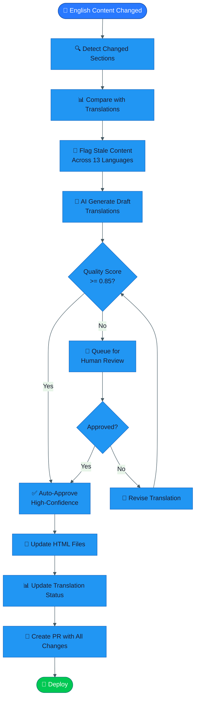
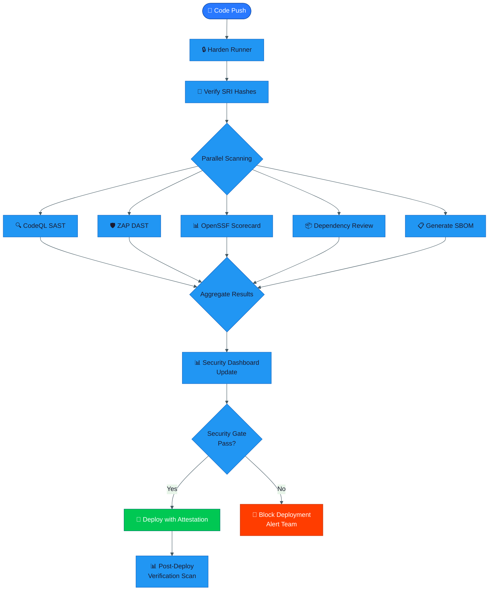
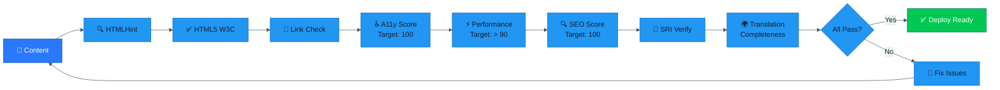

  

<h1 align="center">🔄 Hack23 Homepage — Future Flowcharts</h1>

  <strong>Improved Process Workflows: Planned Enhancements</strong> 
  <em>Future Workflow Documentation for hack23.com</em>

  
  
  
  

**📋 Document Owner:** CEO | **📄 Version:** 1.0 | **📅 Last Updated:** 2026-02-20 (UTC)
**🔄 Review Cycle:** Quarterly | **⏰ Next Review:** 2026-05-20
**🏷️ Classification:**   

---

## 📚 Related Documentation

| Document | Focus | Description |
|----------|-------|-------------|
| **[🔄 Flowchart](FLOWCHART.md)** | Processes | Current process flows |
| **[🔄 Future Flowchart](FUTURE_FLOWCHART.md)** | Roadmap | Planned improvements (this document) |
| **[🔄 Workflows](WORKFLOWS.md)** | CI/CD | Current workflow details |
| **[🚀 Future Workflows](FUTURE_WORKFLOWS.md)** | CI/CD Roadmap | Planned workflow enhancements |
| **[🚀 Future Architecture](FUTURE_ARCHITECTURE.md)** | Architecture | Evolution plans |

---

## 🎯 Overview

This document outlines planned improvements to the Hack23 homepage process workflows, focusing on automated translation pipelines, enhanced quality gates, and improved deployment processes.

---

## 🌍 Automated Translation Pipeline (Planned)

```mermaid
%%{init: {"theme": "base", "themeVariables": {"primaryColor": "#2196F3", "primaryTextColor": "#1a1a2e", "lineColor": "#455A64", "secondaryColor": "#e8f5e9", "tertiaryColor": "#fff8e1", "primaryBorderColor": "#1565C0"}}}%%
flowchart TD
    Change([📝 English Content Changed]) --> Detect[🔍 Detect Changed Sections]
    Detect --> Compare[📊 Compare with Translations]
    Compare --> Flag[🚩 Flag Stale Content<br/>Across 13 Languages]

    Flag --> Generate[🤖 AI Generate Draft<br/>Translations]
    Generate --> QualityCheck{Quality Score<br/>>= 0.85?}

    QualityCheck -->|Yes| AutoApprove[✅ Auto-Approve<br/>High-Confidence]
    QualityCheck -->|No| HumanReview[👤 Queue for<br/>Human Review]

    HumanReview --> Approved{Approved?}
    Approved -->|Yes| AutoApprove
    Approved -->|No| Revise[📝 Revise Translation]
    Revise --> QualityCheck

    AutoApprove --> UpdateFiles[📄 Update HTML Files]
    UpdateFiles --> UpdateStatus[📊 Update Translation Status]
    UpdateStatus --> CreatePR[🔀 Create PR with All Changes]
    CreatePR --> Deploy([🚀 Deploy])

    style Change fill:#2979FF,stroke:#0D47A1,color:#fff
    style Deploy fill:#00C853,stroke:#00796B,color:#fff
```

---

## 🛡️ Enhanced Security Pipeline (Planned)

```mermaid
%%{init: {"theme": "base", "themeVariables": {"primaryColor": "#2196F3", "primaryTextColor": "#1a1a2e", "lineColor": "#455A64", "secondaryColor": "#e8f5e9", "tertiaryColor": "#fff8e1", "primaryBorderColor": "#1565C0"}}}%%
flowchart TD
    Push([📝 Code Push]) --> Harden[🔒 Harden Runner]
    Harden --> SRI[🔏 Verify SRI Hashes]

    SRI --> ParallelScan{Parallel Scanning}

    ParallelScan --> CodeQL[🔍 CodeQL SAST]
    ParallelScan --> ZAP[🛡️ ZAP DAST]
    ParallelScan --> Scorecard[📊 OpenSSF Scorecard]
    ParallelScan --> DepReview[📦 Dependency Review]
    ParallelScan --> SBOM[📋 Generate SBOM]

    CodeQL --> Aggregate{Aggregate Results}
    ZAP --> Aggregate
    Scorecard --> Aggregate
    DepReview --> Aggregate
    SBOM --> Aggregate

    Aggregate --> Dashboard[📊 Security Dashboard<br/>Update]
    Dashboard --> Gate{Security Gate<br/>Pass?}

    Gate -->|Yes| Deploy[🚀 Deploy with Attestation]
    Gate -->|No| Block[🛑 Block Deployment<br/>Alert Team]

    Deploy --> PostDeploy[📊 Post-Deploy<br/>Verification Scan]

    style Push fill:#2979FF,stroke:#0D47A1,color:#fff
    style Deploy fill:#00C853,stroke:#00796B,color:#fff
    style Block fill:#FF3D00,stroke:#BF360C,color:#fff
```

---

## 📊 Enhanced Quality Gates (Planned)

```mermaid
%%{init: {"theme": "base", "themeVariables": {"primaryColor": "#2196F3", "primaryTextColor": "#1a1a2e", "lineColor": "#455A64", "secondaryColor": "#e8f5e9", "tertiaryColor": "#fff8e1", "primaryBorderColor": "#1565C0"}}}%%
flowchart LR
    Input[📄 Content] --> Lint[🔍 HTMLHint]
    Lint --> Validate[✅ HTML5 W3C]
    Validate --> Links[🔗 Link Check]
    Links --> A11y[♿ A11y Score<br/>Target: 100]
    A11y --> Perf[⚡ Performance<br/>Target: > 90]
    Perf --> SEO[🔍 SEO Score<br/>Target: 100]
    SEO --> SRI[🔏 SRI Verify]
    SRI --> I18n[🌍 Translation<br/>Completeness]
    I18n --> Output{All Pass?}

    Output -->|Yes| Ready[✅ Deploy Ready]
    Output -->|No| Fix[🔧 Fix Issues]
    Fix --> Input

    style Input fill:#2979FF,stroke:#0D47A1,color:#fff
    style Ready fill:#00C853,stroke:#00796B,color:#fff
```

---

## 📋 ISMS Compliance

Future process improvements align with:

- 🔗 **[Secure Development Policy](https://github.com/Hack23/ISMS-PUBLIC/blob/main/Secure_Development_Policy.md)** — Enhanced CI/CD security
- 🔗 **[Vulnerability Management](https://github.com/Hack23/ISMS-PUBLIC/blob/main/Vulnerability_Management.md)** — Improved scanning pipeline
- 🔗 **[Information Security Policy](https://github.com/Hack23/ISMS-PUBLIC/blob/main/Information_Security_Policy.md)** — Process governance
