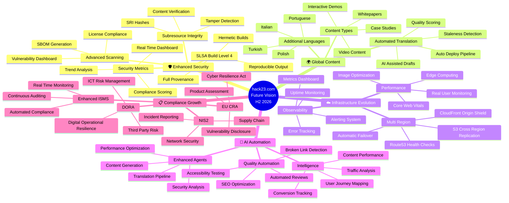
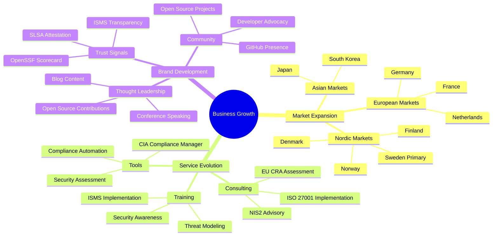

  

<h1 align="center">🧠 Hack23 Homepage — Future Concept Map</h1>

  <strong>Capability Expansion Plans</strong> 
  <em>Future Mindmap Documentation for hack23.com</em>

  
  
  
  

**📋 Document Owner:** CEO | **📄 Version:** 1.0 | **📅 Last Updated:** 2026-02-20 (UTC)
**🔄 Review Cycle:** Quarterly | **⏰ Next Review:** 2026-05-20
**🏷️ Classification:**   

---

## 📚 Related Documentation

| Document | Focus | Description |
|----------|-------|-------------|
| **[🧠 Mindmap](MINDMAP.md)** | Concepts | Current system concepts |
| **[🧠 Future Mindmap](FUTURE_MINDMAP.md)** | Roadmap | Capability expansion (this document) |
| **[🚀 Future Architecture](FUTURE_ARCHITECTURE.md)** | Architecture | Evolution plans |
| **[🚀 Future SWOT](FUTURE_SWOT.md)** | Strategy | Future strategic analysis |

---

## 🎯 Overview

This document outlines the planned capability expansion for the Hack23 homepage, visualizing future enhancements across content, infrastructure, security, and automation.

---

## 🔮 Future Capabilities

---

## 🏢 Business Expansion Concepts

---

## 📋 ISMS Compliance

Future capability expansion aligns with:

- 🔗 **[Information Security Policy](https://github.com/Hack23/ISMS-PUBLIC/blob/main/Information_Security_Policy.md)** — Security governance evolution
- 🔗 **[Secure Development Policy](https://github.com/Hack23/ISMS-PUBLIC/blob/main/Secure_Development_Policy.md)** — Enhanced development practices
- 🔗 **[Compliance Checklist](https://github.com/Hack23/ISMS-PUBLIC/blob/main/Compliance_Checklist.md)** — Expanded compliance coverage
- 🔗 **[Risk Register](https://github.com/Hack23/ISMS-PUBLIC/blob/main/Risk_Register.md)** — New risk assessments for expanded capabilities
