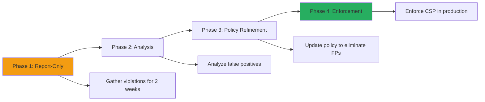
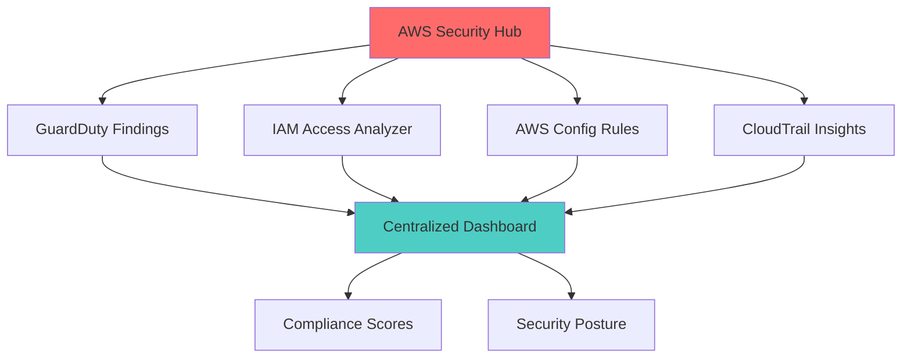
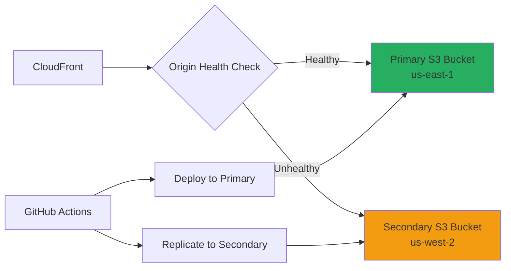
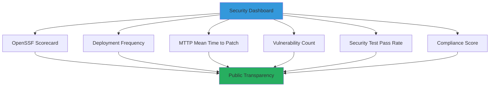

<p align="center">
  
</p>

<h1 align="center">🚀 Hack23 Homepage — Future Security Architecture</h1>

<p align="center">
  <strong>Security Roadmap & Planned Enhancements</strong><br>
  <em>Continuous Improvement Through Proactive Security Evolution</em>
</p>

<p align="center">
  <a href="#"></a>
  <a href="#"></a>
  <a href="#"></a>
  <a href="#"></a>
</p>


[](https://scorecard.dev/viewer/?uri=github.com/Hack23/homepage)

**📋 Document Owner:** CEO | **📄 Version:** 1.0 | **📅 Last Updated:** 2025-11-17 (UTC)  
**🔄 Review Cycle:** Quarterly | **⏰ Next Review:** 2026-02-17  
**🏷️ Classification:** [](https://github.com/Hack23/ISMS-PUBLIC/blob/main/CLASSIFICATION.md)

---

## 🎯 Purpose

This document outlines the **future security architecture roadmap** for the Hack23 AB homepage, detailing planned enhancements to strengthen security posture, improve compliance alignment, and demonstrate security excellence through continuous improvement.

**Guiding Principles:**
- ✅ **Incremental Enhancement** - Small, testable improvements over time
- ✅ **Evidence-Based Security** - Measurable security controls with public proof
- ✅ **Compliance-Driven** - Align with ISO 27001, NIST CSF, CIS Controls
- ✅ **Transparency First** - Public documentation of security investments

---

## 📑 Table of Contents

- [🌐 Network Security Enhancements](#-network-security-enhancements)
- [🔒 Application Security Improvements](#-application-security-improvements)
- [🔍 Enhanced Monitoring & Detection](#-enhanced-monitoring--detection)
- [⚡ Resilience & Availability](#-resilience--availability)
- [🤖 Automated Security Operations](#-automated-security-operations)
- [📋 Compliance & Governance](#-compliance--governance)
- [🧪 Security Testing Evolution](#-security-testing-evolution)
- [📊 Security Metrics & Reporting](#-security-metrics--reporting)
- [⏰ Implementation Roadmap](#-implementation-roadmap)

---

## 🌐 Network Security Enhancements

### Planned: AWS WAF Integration

**Timeline:** Q1 2026  
**Priority:** High  
**Estimated Effort:** 2-3 weeks

**Description:**
Deploy AWS WAF on CloudFront distribution to provide advanced request filtering and DDoS protection.

**Implementation Details:**

```hcl
# Terraform configuration for AWS WAF
resource "aws_wafv2_web_acl" "homepage_waf" {
  name  = "hack23-homepage-waf"
  scope = "CLOUDFRONT"

  default_action {
    allow {}
  }

  rule {
    name     = "AWSManagedRulesCommonRuleSet"
    priority = 1

    override_action {
      none {}
    }

    statement {
      managed_rule_group_statement {
        vendor_name = "AWS"
        name        = "AWSManagedRulesCommonRuleSet"
      }
    }
  }

  rule {
    name     = "RateLimitRule"
    priority = 2

    action {
      block {}
    }

    statement {
      rate_based_statement {
        limit              = 2000
        aggregate_key_type = "IP"
      }
    }
  }
}
```

**Benefits:**
- ✅ OWASP Top 10 protection (SQL injection, XSS, RCE)
- ✅ Rate limiting per IP (2000 requests/5 minutes)
- ✅ Geo-blocking capability (if needed)
- ✅ Bot mitigation
- ✅ Enhanced DDoS protection beyond AWS Shield Standard

**Success Metrics:**
- Zero false positives in first month
- Block rate < 0.1% of legitimate traffic
- WAF logs integrated with CloudWatch
- Incident response runbook created

**Related ISMS Policies:**
- [Network Security Policy](https://github.com/Hack23/ISMS-PUBLIC/blob/main/Network_Security_Policy.md)
- [Incident Response Plan](https://github.com/Hack23/ISMS/blob/main/Incident_Response_Plan.md)

---

### Planned: CloudFront Security Headers via Functions

**Timeline:** Q4 2025  
**Priority:** High  
**Estimated Effort:** 1 week

**Description:**
Implement CloudFront Functions to inject security headers into all responses.

**CloudFront Function Code:**

```javascript
function handler(event) {
    var response = event.response;
    var headers = response.headers;

    // Content Security Policy
    headers['content-security-policy'] = {
        value: "default-src 'self'; " +
               "script-src 'self' 'unsafe-inline'; " +
               "style-src 'self' 'unsafe-inline' https://fonts.googleapis.com; " +
               "font-src 'self' https://fonts.gstatic.com; " +
               "img-src 'self' https: data:; " +
               "connect-src 'self'"
    };

    // Strict Transport Security
    headers['strict-transport-security'] = {
        value: 'max-age=31536000; includeSubDomains; preload'
    };

    // X-Content-Type-Options
    headers['x-content-type-options'] = { value: 'nosniff' };

    // X-Frame-Options
    headers['x-frame-options'] = { value: 'DENY' };

    // Referrer Policy
    headers['referrer-policy'] = { value: 'strict-origin-when-cross-origin' };

    // Permissions Policy
    headers['permissions-policy'] = {
        value: 'geolocation=(), microphone=(), camera=()'
    };

    return response;
}
```

**Benefits:**
- ✅ Centralized security header management
- ✅ No code changes required in static files
- ✅ Real-time header updates without redeployment
- ✅ Improved security posture (measurable via Mozilla Observatory)

**Success Metrics:**
- Mozilla Observatory score: A+ (target)
- SecurityHeaders.com grade: A (target)
- All major security headers present
- No CSP violations in production logs

**Tracking Issue:** [GitHub Issue #450](https://github.com/Hack23/homepage/issues/450)

---

### Planned: Subresource Integrity (SRI) for External Resources

**Timeline:** Q4 2025  
**Priority:** Medium  
**Estimated Effort:** 2-3 days

**Description:**
Add SRI hashes to all external resources (Google Fonts) to prevent supply chain attacks.

**Implementation:**

```html
<!-- Current (without SRI) -->
<link href="https://fonts.googleapis.com/css2?family=Inter:wght@400;500;600;700&display=swap" 
      rel="stylesheet">

<!-- Future (with SRI) -->
<link href="https://fonts.googleapis.com/css2?family=Inter:wght@400;500;600;700&display=swap"
      rel="stylesheet"
      integrity="sha384-GENERATED_HASH_HERE"
      crossorigin="anonymous">
```

**Automation Script:**

```bash
#!/bin/bash
# Generate SRI hashes for external resources
for url in $(grep -oP 'https://[^"]+' index.html | grep -E '(googleapis|gstatic)'); do
    hash=$(curl -s "$url" | openssl dgst -sha384 -binary | openssl base64 -A)
    echo "URL: $url"
    echo "SHA-384: sha384-$hash"
    echo ""
done
```

**Benefits:**
- ✅ Prevent compromised CDN attacks
- ✅ Detect unauthorized modifications
- ✅ Supply chain security improvement
- ✅ OpenSSF Scorecard improvement

**Success Metrics:**
- All external resources have SRI hashes
- Zero SRI verification failures
- OpenSSF Scorecard: Supply Chain Security score +10%

**Tracking Issue:** [GitHub Issue #451](https://github.com/Hack23/homepage/issues/451)

---

## 🔒 Application Security Improvements

### Planned: Content Security Policy (CSP) Report-Only Mode

**Timeline:** Q4 2025  
**Priority:** High  
**Estimated Effort:** 1 week

**Description:**
Deploy CSP in report-only mode to gather violation data before enforcing.

**Implementation Phases:**



**CSP Report Collection:**

```javascript
// CloudFront Function for CSP reporting
headers['content-security-policy-report-only'] = {
    value: "default-src 'self'; " +
           "script-src 'self' 'unsafe-inline'; " +
           "style-src 'self' 'unsafe-inline' https://fonts.googleapis.com; " +
           "report-uri https://hack23.report-uri.com/r/d/csp/reportOnly"
};
```

**Benefits:**
- ✅ Zero-downtime CSP deployment
- ✅ Data-driven policy refinement
- ✅ Eliminate false positives before enforcement
- ✅ Gradual security hardening

**Success Metrics:**
- < 5% false positive rate after refinement
- Zero legitimate functionality broken
- Policy refined within 4 weeks
- Full enforcement by Q1 2026

---

### Planned: Automated Accessibility Testing

**Timeline:** Q1 2026  
**Priority:** Medium  
**Estimated Effort:** 1 week

**Description:**
Integrate axe-core accessibility testing into CI/CD pipeline.

**GitHub Actions Integration:**

```yaml
- name: Accessibility Testing
  uses: dequelabs/axe-action@v2.5.0
  with:
    urls: |
      https://hack23.com/
      https://hack23.com/index_sv.html
      https://hack23.com/index_ko.html
    fail-on-accessibility-violations: true
    minimum-severity: moderate
```

**Benefits:**
- ✅ WCAG 2.1 AA compliance validation
- ✅ Automated accessibility regression testing
- ✅ Improved usability for all users
- ✅ Reduced legal risk (accessibility lawsuits)

**Success Metrics:**
- Zero critical accessibility violations
- WCAG 2.1 AA compliance maintained
- Lighthouse accessibility score: 100
- Automated testing on every PR

---

## 🔍 Enhanced Monitoring & Detection

### Planned: AWS GuardDuty for Threat Detection

**Timeline:** Q1 2026  
**Priority:** Medium  
**Estimated Effort:** 1 week

**Description:**
Enable GuardDuty on AWS account for intelligent threat detection.

**GuardDuty Features:**
- ✅ Malicious IP detection
- ✅ Compromised credential detection
- ✅ Unusual API call patterns
- ✅ Cryptocurrency mining detection
- ✅ S3 data exfiltration detection

**CloudWatch Alarms:**

```yaml
GuardDutyFindingAlarm:
  Type: AWS::CloudWatch::Alarm
  Properties:
    AlarmName: hack23-homepage-guardduty-high-severity
    MetricName: GuardDutyFindingCount
    Namespace: AWS/GuardDuty
    Statistic: Sum
    Period: 300
    EvaluationPeriods: 1
    Threshold: 1
    ComparisonOperator: GreaterThanThreshold
    AlarmActions:
      - !Ref SecuritySNSTopic
```

**Benefits:**
- ✅ Proactive threat detection
- ✅ Automated incident alerting
- ✅ Compliance requirement (NIST CSF DE.AE-02)
- ✅ Reduced MTTR (Mean Time to Respond)

**Success Metrics:**
- GuardDuty enabled within 1 week
- Integration with SNS/email alerts
- Incident response runbook created
- Monthly review of findings

**Related ISMS Policies:**
- [Incident Response Plan](https://github.com/Hack23/ISMS/blob/main/Incident_Response_Plan.md)
- [Monitoring & Logging Policy](https://github.com/Hack23/ISMS-PUBLIC/blob/main/Monitoring_Logging_Policy.md)

---

### Planned: AWS Security Hub Integration

**Timeline:** Q2 2026  
**Priority:** Medium  
**Estimated Effort:** 2 weeks

**Description:**
Enable Security Hub for centralized security findings and compliance checks.

**Security Hub Benefits:**



**Compliance Standards:**
- ✅ AWS Foundational Security Best Practices
- ✅ CIS AWS Foundations Benchmark v1.4.0
- ✅ PCI DSS v3.2.1 (subset applicable)
- ✅ ISO 27001:2013 controls

**Success Metrics:**
- Security Hub score: >90%
- All critical findings remediated
- Monthly compliance reports generated
- Automated remediation for 50% of findings

---

### Planned: Real-Time CloudWatch Alarms

**Timeline:** Q1 2026  
**Priority:** High  
**Estimated Effort:** 1 week

**Description:**
Configure CloudWatch alarms for critical security events.

**Alarm Categories:**

| Alarm | Metric | Threshold | Action |
|-------|--------|-----------|--------|
| **Unauthorized API Calls** | CloudTrail metric filter | > 0 | SNS alert |
| **Root Account Usage** | CloudTrail metric filter | > 0 | SNS alert + CEO notification |
| **S3 Bucket Policy Changes** | CloudTrail metric filter | > 0 | SNS alert |
| **Failed Login Attempts** | CloudTrail metric filter | > 10 in 5 min | SNS alert |
| **CloudFront 4xx Rate** | CloudFront metrics | > 5% of requests | SNS alert |

**Benefits:**
- ✅ Real-time incident detection
- ✅ Reduced MTTD (Mean Time to Detect)
- ✅ Automated alerting
- ✅ Compliance requirement (NIST CSF DE.CM-01)

**Success Metrics:**
- All critical alarms configured
- Alert fatigue < 5% (false positive rate)
- MTTD < 15 minutes for critical events
- Incident response playbooks for each alarm

---

## ⚡ Resilience & Availability

### Planned: Multi-Origin Failover

**Timeline:** Q2 2026  
**Priority:** Medium  
**Estimated Effort:** 2 weeks

**Description:**
Configure CloudFront origin failover to secondary S3 bucket for improved resilience.

**Architecture:**



**Implementation:**

```hcl
resource "aws_cloudfront_origin_group" "homepage_failover" {
  origin_group_id = "homepage-origin-group"

  member {
    origin_id = "primary-s3-origin"
  }

  member {
    origin_id = "secondary-s3-origin"
  }

  failover_criteria {
    status_codes = [403, 404, 500, 502, 503, 504]
  }
}
```

**Benefits:**
- ✅ Improved availability (99.99% target)
- ✅ Automatic failover on origin errors
- ✅ Reduced RTO (Recovery Time Objective)
- ✅ Compliance requirement (CIS Controls 11.4)

**Success Metrics:**
- Failover latency < 30 seconds
- Zero data loss during failover
- Automated failback after primary recovery
- Monthly DR testing

---

### Planned: S3 Cross-Region Replication

**Timeline:** Q2 2026  
**Priority:** Low  
**Estimated Effort:** 1 week

**Description:**
Enable S3 Cross-Region Replication (CRR) to secondary bucket.

**Benefits:**
- ✅ Disaster recovery capability
- ✅ Regional outage protection
- ✅ Reduced RTO/RPO
- ✅ Compliance requirement (backup policy)

**Success Metrics:**
- Replication lag < 15 minutes
- Replication success rate: 100%
- Monthly DR failover tests
- Documentation of recovery procedures

**Related ISMS Policies:**
- [Business Continuity Plan](https://github.com/Hack23/ISMS-PUBLIC/blob/main/Business_Continuity_Plan.md)
- [Backup & Recovery Policy](https://github.com/Hack23/ISMS-PUBLIC/blob/main/Backup_Recovery_Policy.md)

---

## 🤖 Automated Security Operations

### Planned: Automated Dependency Updates with Auto-Merge

**Timeline:** Q4 2025  
**Priority:** High  
**Estimated Effort:** 1 week

**Description:**
Configure Dependabot auto-merge for low-risk dependency updates.

**Auto-Merge Criteria:**

```yaml
# .github/dependabot.yml
version: 2
updates:
  - package-ecosystem: "github-actions"
    directory: "/"
    schedule:
      interval: "weekly"
    open-pull-requests-limit: 10
    # Note: Dependabot does NOT support an 'auto-merge' field in this config.
    # To enable auto-merge for Dependabot PRs, use GitHub's branch protection rules
    # or enable auto-merge via the GitHub UI/API for pull requests.
    reviewers:
      - "Hack23"
```

**Benefits:**
- ✅ Faster security patch deployment
- ✅ Reduced manual review burden
- ✅ Improved vulnerability SLA compliance
- ✅ Automated testing before merge

**Success Metrics:**
- Auto-merge success rate: >90%
- MTTP (Mean Time to Patch): <48 hours for patches
- Zero security regressions from auto-merge
- Human review only for major/minor updates

---

### Planned: Security Issue Templates

**Timeline:** Q4 2025  
**Priority:** Low  
**Estimated Effort:** 2 days

**Description:**
Create GitHub issue templates for security findings.

**Templates:**
- 🔴 **Security Vulnerability Report** - Structured CVE reporting
- 🟡 **Security Finding** - ZAP/Lighthouse findings
- 🟢 **Security Enhancement** - Proactive improvements

**Benefits:**
- ✅ Consistent security issue tracking
- ✅ Structured information collection
- ✅ Improved incident response
- ✅ Better security metrics

---

## 📋 Compliance & Governance

### Planned: SBOM (Software Bill of Materials) Generation

**Timeline:** Q1 2026  
**Priority:** High (EU CRA requirement)  
**Estimated Effort:** 1 week

**Description:**
Automate SBOM generation for all dependencies per EU CRA requirements.

**Implementation:**

```yaml
# .github/workflows/sbom.yml
name: Generate SBOM
on:
  push:
    branches: [master]
  schedule:
    - cron: '0 0 * * 0'  # Weekly

jobs:
  sbom:
    runs-on: ubuntu-latest
    steps:
      - uses: actions/checkout@08c6903cd8c0fde910a37f88322edcfb5dd907a8 # v5.0.0
      
      - name: Generate SBOM
        uses: anchore/sbom-action@d94f46e13c6c62f59525ac9a1e147a99dc0b9bf5 # v0.17.0
        with:
          format: cyclonedx-json
          output-file: sbom.json
      
      - name: Upload SBOM
        uses: actions/upload-artifact@b4b15b8c7c6ac21ea08fcf65892d2ee8f75cf882 # v4.4.3
        with:
          name: sbom
          path: sbom.json
      
      - name: Publish to GitHub Releases
        uses: softprops/action-gh-release@c062e08bd532815e2082a85e87e3ef29c3e6d191 # v2.0.8
        with:
          files: sbom.json
          tag_name: sbom-${{ github.sha }}
```

**Benefits:**
- ✅ EU CRA compliance requirement
- ✅ Transparency for downstream users
- ✅ Supply chain security
- ✅ Vulnerability tracking improvement

**Success Metrics:**
- SBOM generated on every release
- CycloneDX format compliance
- Publicly accessible via GitHub Releases
- Integrated with vulnerability scanning

**Related ISMS Policies:**
- [EU CRA Compliance](https://github.com/Hack23/ISMS-PUBLIC/blob/main/EU_CRA_Compliance.md)
- [Supply Chain Security](https://github.com/Hack23/ISMS-PUBLIC/blob/main/Supply_Chain_Security.md)

---

### Planned: Quarterly Security Architecture Review

**Timeline:** Q1 2026 (first review)  
**Priority:** Medium  
**Estimated Effort:** Ongoing (quarterly)

**Description:**
Formalize quarterly review process for security architecture.

**Review Checklist:**
- ✅ Threat model updates (new threats identified)
- ✅ Security control effectiveness assessment
- ✅ Compliance gap analysis (ISO 27001, NIST CSF, CIS)
- ✅ Vulnerability management metrics review
- ✅ Incident response process improvements
- ✅ Future architecture roadmap updates

**Benefits:**
- ✅ Continuous security improvement
- ✅ Compliance requirement (ISO 27001 A.18.2.1)
- ✅ Proactive risk management
- ✅ Stakeholder transparency

**Success Metrics:**
- Reviews completed on schedule
- Action items tracked to completion
- Documentation updated post-review
- Lessons learned captured

---

## 🧪 Security Testing Evolution

### Planned: Automated Penetration Testing

**Timeline:** Q2 2026  
**Priority:** Medium  
**Estimated Effort:** 2 weeks (setup) + ongoing

**Description:**
Implement automated penetration testing with nuclei templates.

**Implementation:**

```yaml
# .github/workflows/pentest.yml
name: Automated Penetration Test
on:
  schedule:
    - cron: '0 2 * * 1'  # Weekly Monday 2 AM
  workflow_dispatch:

jobs:
  nuclei_scan:
    runs-on: ubuntu-latest
    steps:
      - name: Nuclei Scan
        uses: projectdiscovery/nuclei-action@main
        with:
          target: https://hack23.com/
          templates: vulnerabilities,exposures,misconfiguration
          severity: critical,high,medium
          
      - name: Upload Results
        uses: github/codeql-action/upload-sarif@v2
        with:
          sarif_file: nuclei-results.sarif
```

**Benefits:**
- ✅ Continuous penetration testing
- ✅ Broader vulnerability coverage
- ✅ Automated SARIF integration
- ✅ Cost-effective compared to manual pentests

**Success Metrics:**
- Weekly scans completed
- Zero high/critical findings tolerated
- Results integrated with Security Hub
- Annual manual pentest for validation

---

### Planned: Performance & Security Budget Enforcement

**Timeline:** Q4 2025  
**Priority:** Medium  
**Estimated Effort:** 3 days

**Description:**
Enforce stricter performance and security budgets in Lighthouse CI.

**Enhanced Budget:**

```json
{
  "path": "/*",
  "timings": [
    {"metric": "interactive", "budget": 5000},
    {"metric": "first-contentful-paint", "budget": 2000},
    {"metric": "largest-contentful-paint", "budget": 3000}
  ],
  "resourceSizes": [
    {"resourceType": "script", "budget": 500},
    {"resourceType": "stylesheet", "budget": 50000},
    {"resourceType": "total", "budget": 500000}
  ],
  "audits": [
    {"id": "vulnerabilities", "budget": 0},
    {"id": "uses-https", "budget": 1.0},
    {"id": "csp-xss", "budget": 1.0}
  ]
}
```

**Benefits:**
- ✅ Performance regressions prevented
- ✅ Security audit enforcement
- ✅ Automated quality gates
- ✅ User experience protection

---

## 📊 Security Metrics & Reporting

### Planned: Security Dashboard

**Timeline:** Q2 2026  
**Priority:** Low  
**Estimated Effort:** 2 weeks

**Description:**
Create public security dashboard showing real-time security metrics.

**Metrics to Display:**



**Implementation:**
- Static HTML page with shields.io badges
- GitHub Actions metrics via API
- CloudWatch metrics visualization
- Monthly automated reports

**Benefits:**
- ✅ Public security transparency
- ✅ Competitive differentiation
- ✅ Accountability mechanism
- ✅ Marketing value

---

## ⏰ Implementation Roadmap

### Q4 2025 (Current Quarter)

| Enhancement | Priority | Effort | Status |
|------------|----------|--------|--------|
| CloudFront Security Headers | High | 1 week | 🔴 Planned |
| Subresource Integrity (SRI) | Medium | 3 days | 🔴 Planned |
| CSP Report-Only Mode | High | 1 week | 🔴 Planned |
| Dependency Auto-Merge | High | 1 week | 🔴 Planned |
| Security Issue Templates | Low | 2 days | 🔴 Planned |
| Performance Budget Enforcement | Medium | 3 days | 🔴 Planned |

**Q4 2025 Goal:** Complete all high-priority application security improvements.

---

### Q1 2026

| Enhancement | Priority | Effort | Status |
|------------|----------|--------|--------|
| AWS WAF Integration | High | 3 weeks | 🔴 Planned |
| AWS GuardDuty Enablement | Medium | 1 week | 🔴 Planned |
| Real-Time CloudWatch Alarms | High | 1 week | 🔴 Planned |
| SBOM Generation | High | 1 week | 🔴 Planned |
| Automated Accessibility Testing | Medium | 1 week | 🔴 Planned |
| Quarterly Security Review Process | Medium | Ongoing | 🔴 Planned |

**Q1 2026 Goal:** Complete network security enhancements and monitoring improvements.

---

### Q2 2026

| Enhancement | Priority | Effort | Status |
|------------|----------|--------|--------|
| AWS Security Hub Integration | Medium | 2 weeks | 🔴 Planned |
| Multi-Origin Failover | Medium | 2 weeks | 🔴 Planned |
| S3 Cross-Region Replication | Low | 1 week | 🔴 Planned |
| Automated Penetration Testing | Medium | 2 weeks | 🔴 Planned |
| Security Dashboard | Low | 2 weeks | 🔴 Planned |

**Q2 2026 Goal:** Enhance resilience and establish comprehensive security monitoring.

---

## 🎯 Success Metrics & KPIs

### Target Security Posture (2026)

| Metric | Current (2025) | Target (2026) | Improvement |
|--------|----------------|---------------|-------------|
| **OpenSSF Scorecard** | 8.5/10 | 9.5/10 | +12% |
| **Mozilla Observatory** | B+ | A+ | +2 grades |
| **SecurityHeaders.com** | C | A | +3 grades |
| **Lighthouse Security** | 95 | 100 | +5% |
| **MTTP (High Severity)** | <7 days | <48 hours | -71% |
| **Security Test Pass Rate** | 100% | 100% | Maintained |
| **Availability SLA** | 99.9% | 99.99% | +0.09% |

### Compliance Target Maturity

| Framework | Current | Q2 2026 Target | Key Improvements |
|-----------|---------|----------------|------------------|
| **ISO 27001:2022** | 85% coverage | 95% coverage | +10% |
| **NIST CSF 2.0** | Tier 2 | Tier 3 | Advanced monitoring |
| **CIS Controls v8.1** | IG1 compliant | IG2 partial | Enhanced controls |
| **OWASP ASVS** | Level 1 | Level 2 | Application hardening |
| **EU CRA** | Partial | Full compliance | SBOM + vuln disclosure |

---

## 📝 Conclusion

This future security architecture roadmap demonstrates Hack23 AB's commitment to **continuous security improvement** and **proactive risk management**. The planned enhancements will:

✅ **Strengthen Defense-in-Depth** - Additional security layers (WAF, Security Hub, GuardDuty)  
✅ **Improve Compliance Posture** - ISO 27001, NIST CSF, CIS Controls, EU CRA alignment  
✅ **Enhance Transparency** - Public security metrics and SBOM generation  
✅ **Increase Resilience** - Multi-origin failover and cross-region replication  
✅ **Automate Security Operations** - Auto-merge, SBOM, automated pentesting  
✅ **Demonstrate Expertise** - Public security roadmap as consulting differentiator

**Next Steps:**
1. Prioritize Q4 2025 enhancements for immediate implementation
2. Allocate budget for AWS WAF and Security Hub (Q1 2026)
3. Schedule quarterly security architecture reviews
4. Track implementation progress via GitHub Projects
5. Update this document quarterly with progress and new plans

This roadmap evolves continuously. Updates are tracked in GitHub issues and reviewed quarterly as part of the ISMS continuous improvement process.

---

**Related Documents:**
- [SECURITY_ARCHITECTURE.md](https://github.com/Hack23/homepage/blob/master/SECURITY_ARCHITECTURE.md) - Current security architecture
- [THREAT_MODEL.md](https://github.com/Hack23/homepage/blob/master/THREAT_MODEL.md) - Threat analysis and risk assessment
- [Secure Development Policy](https://github.com/Hack23/ISMS/blob/main/Secure_Development_Policy.md) - Security requirements

---

**📋 Document Control:**  
**✅ Approved by:** James Pether Sörling, CEO  
**📤 Distribution:** Public  
**🏷️ Classification:** [](https://github.com/Hack23/ISMS-PUBLIC/blob/main/CLASSIFICATION.md)  
**📅 Effective Date:** 2025-11-17  
**⏰ Next Review:** 2026-02-17  
**🎯 Framework Compliance:** [](https://github.com/Hack23/ISMS/blob/main/Compliance_Checklist.md) [](https://github.com/Hack23/ISMS/blob/main/Compliance_Checklist.md) [](https://github.com/Hack23/ISMS/blob/main/Compliance_Checklist.md)
