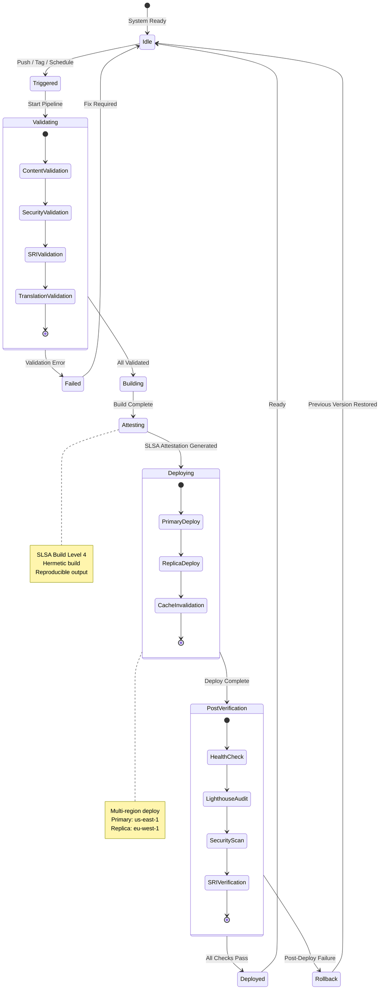
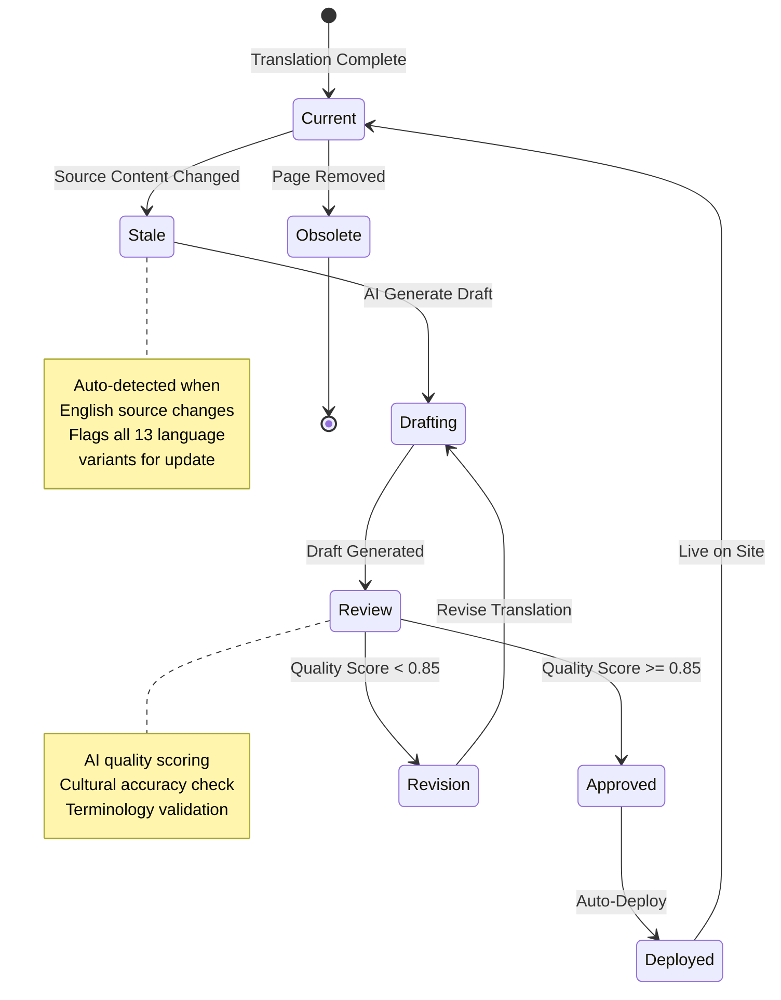
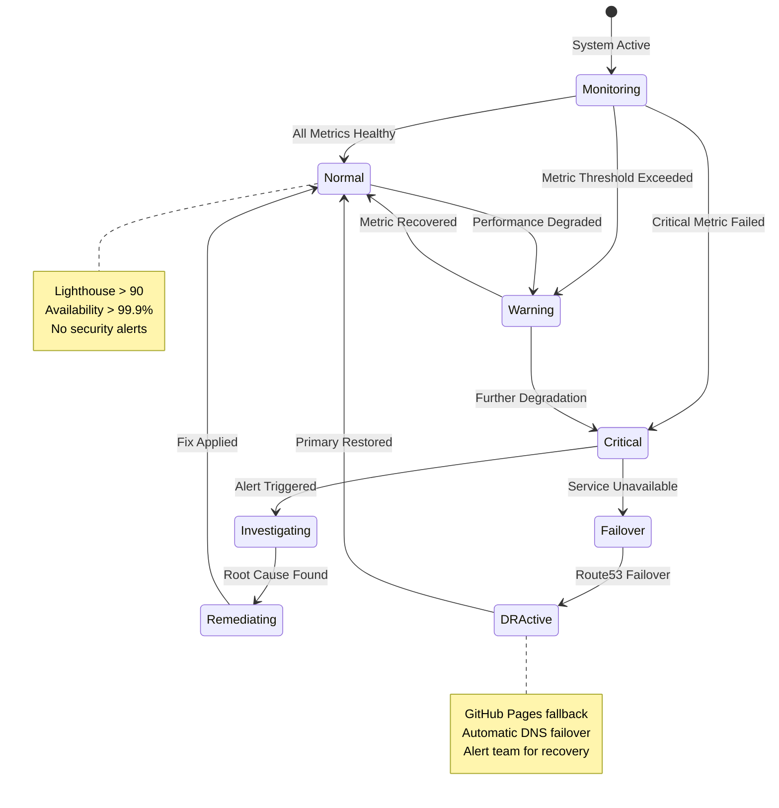

  

<h1 align="center">📈 Hack23 Homepage — Future State Diagrams</h1>

  <strong>Advanced State Management: Planned Enhancements</strong> 
  <em>Future State Machine Documentation for hack23.com</em>

  
  
  
  

**📋 Document Owner:** CEO | **📄 Version:** 1.0 | **📅 Last Updated:** 2026-02-20 (UTC)
**🔄 Review Cycle:** Quarterly | **⏰ Next Review:** 2026-05-20
**🏷️ Classification:**   

---

## 📚 Related Documentation

| Document | Focus | Description |
|----------|-------|-------------|
| **[📈 State Diagram](STATEDIAGRAM.md)** | States | Current state transitions |
| **[📈 Future State Diagram](FUTURE_STATEDIAGRAM.md)** | Roadmap | Planned improvements (this document) |
| **[🚀 Future Architecture](FUTURE_ARCHITECTURE.md)** | Architecture | Evolution plans |
| **[🚀 Future Workflows](FUTURE_WORKFLOWS.md)** | CI/CD | Planned workflow enhancements |

---

## 🎯 Overview

This document outlines planned enhancements to the Hack23 homepage state management, including enhanced deployment states, translation lifecycle management, and advanced monitoring states.

---

## 🚀 Enhanced Deployment States (Planned)

---

## 🌍 Translation Lifecycle States (Planned)

---

## 📊 Enhanced Monitoring States (Planned)

---

## 📋 ISMS Compliance

Future state management enhancements align with:

- 🔗 **[Secure Development Policy](https://github.com/Hack23/ISMS-PUBLIC/blob/main/Secure_Development_Policy.md)** — Enhanced deployment states
- 🔗 **[Incident Response Plan](https://github.com/Hack23/ISMS-PUBLIC/blob/main/Incident_Response_Plan.md)** — Monitoring and failover states
- 🔗 **[Backup & Recovery Policy](https://github.com/Hack23/ISMS-PUBLIC/blob/main/Backup_Recovery_Policy.md)** — Multi-region deployment states
