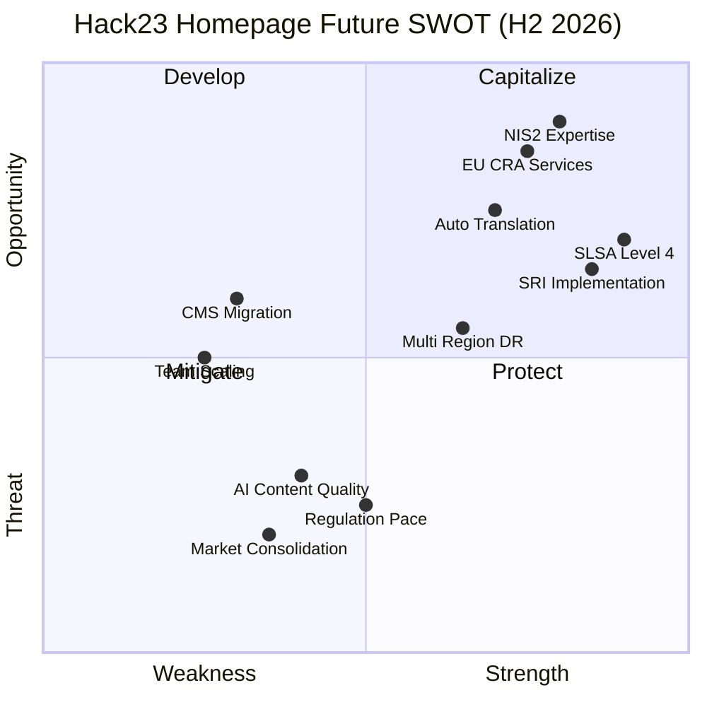

  

<h1 align="center">💼 Hack23 Homepage — Future SWOT Analysis</h1>

  <strong>Future Strategic Opportunities and Analysis</strong> 
  <em>Strategic Roadmap for hack23.com</em>

  
  
  
  

**📋 Document Owner:** CEO | **📄 Version:** 1.0 | **📅 Last Updated:** 2026-02-20 (UTC)
**🔄 Review Cycle:** Quarterly | **⏰ Next Review:** 2026-05-20
**🏷️ Classification:**   

---

## 📚 Related Documentation

| Document | Focus | Description |
|----------|-------|-------------|
| **[💼 SWOT](SWOT.md)** | Strategy | Current strategic analysis |
| **[💼 Future SWOT](FUTURE_SWOT.md)** | Roadmap | Future opportunities (this document) |
| **[🧠 Future Mindmap](FUTURE_MINDMAP.md)** | Concepts | Capability expansion plans |
| **[🚀 Future Architecture](FUTURE_ARCHITECTURE.md)** | Architecture | Evolution roadmap |

---

## 🎯 Overview

This document analyzes future strategic opportunities and threats for the Hack23 homepage, focusing on market evolution, regulatory changes, and technology trends that will shape the platform's growth through H2 2026 and beyond.

---

## 📊 Future SWOT Quadrant

---

## 💪 Future Strengths

| # | Strength | Impact | Timeline |
|---|----------|--------|----------|
| FS1 | **SLSA Build Level 4** | 🟢 High | Q2 2026 — Industry-leading supply chain security |
| FS2 | **SRI Implementation** | 🟢 High | Q1 2026 — Content integrity verification |
| FS3 | **Automated Translation** | 🟡 Medium | Q2 2026 — Efficient 14+ language management |
| FS4 | **Multi-Region Deployment** | 🟡 Medium | Q2 2026 — Enhanced resilience |
| FS5 | **Enhanced Monitoring** | 🟡 Medium | Q2 2026 — Real-time performance visibility |
| FS6 | **Expanded Compliance** | 🟢 High | H2 2026 — NIS2, EU CRA, DORA coverage |

---

## 🔻 Future Weaknesses to Address

| # | Weakness | Mitigation Strategy | Timeline |
|---|----------|---------------------|----------|
| FW1 | **CMS Dependency** | Evaluate headless CMS options | H2 2026 |
| FW2 | **Team Scaling** | Document all processes for onboarding | Q2 2026 |
| FW3 | **Analytics Gap** | Implement privacy-respecting analytics | H2 2026 |
| FW4 | **Interactive Features** | Evaluate progressive enhancement | H2 2026 |

---

## 🌟 Future Opportunities

| # | Opportunity | Strategic Value | Action Plan |
|---|------------|----------------|-------------|
| FO1 | **NIS2 Compliance Market** | 🟢 Critical | Position as NIS2 advisory expert with ISMS showcase |
| FO2 | **EU CRA Services** | 🟢 Critical | Leverage CIA Compliance Manager for CRA assessments |
| FO3 | **Nordic Market Growth** | 🟢 High | Expand Swedish/Danish/Finnish/Norwegian content |
| FO4 | **AI-Powered Services** | 🟡 Medium | Use Copilot agents to enhance service delivery |
| FO5 | **Developer Community** | 🟡 Medium | Grow open-source contributor base |
| FO6 | **Partner Ecosystem** | 🟡 Medium | Build consulting partner network |

---

## ⚠️ Future Threats to Monitor

| # | Threat | Probability | Mitigation |
|---|--------|------------|------------|
| FT1 | **Market Consolidation** | 🟡 Medium | Focus on niche expertise and ISMS differentiator |
| FT2 | **AI Content Devaluation** | 🟡 Medium | Emphasize expert-authored, evidence-based content |
| FT3 | **Regulatory Complexity** | 🟡 Medium | Automated compliance tracking and continuous ISMS updates |
| FT4 | **Cloud Cost Increases** | 🟡 Low | Multi-cloud strategy readiness |
| FT5 | **Technology Shifts** | 🟡 Low | Architecture flexibility with static-first approach |

---

## 📋 ISMS Compliance

This strategic analysis supports:

- 🔗 **[Information Security Policy](https://github.com/Hack23/ISMS-PUBLIC/blob/main/Information_Security_Policy.md)** — Strategic security governance
- 🔗 **[Risk Register](https://github.com/Hack23/ISMS-PUBLIC/blob/main/Risk_Register.md)** — Future risk identification
- 🔗 **[Compliance Checklist](https://github.com/Hack23/ISMS-PUBLIC/blob/main/Compliance_Checklist.md)** — Expanded compliance targets
- 🔗 **[Secure Development Policy](https://github.com/Hack23/ISMS-PUBLIC/blob/main/Secure_Development_Policy.md)** — Enhanced development standards
