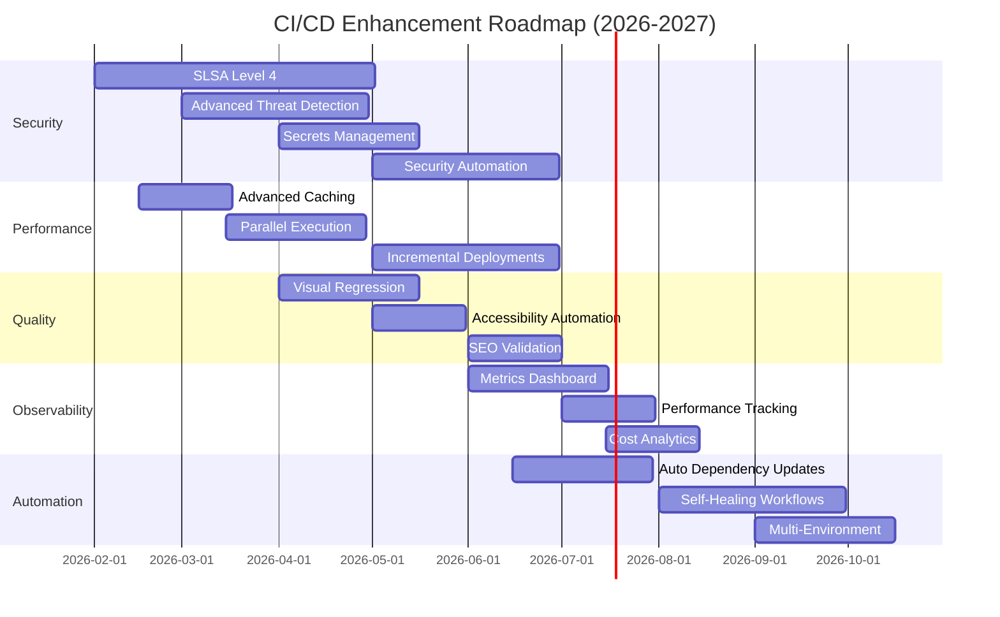
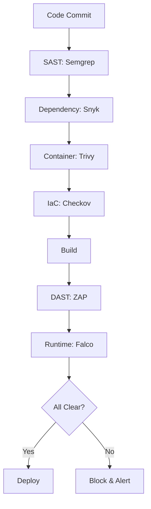
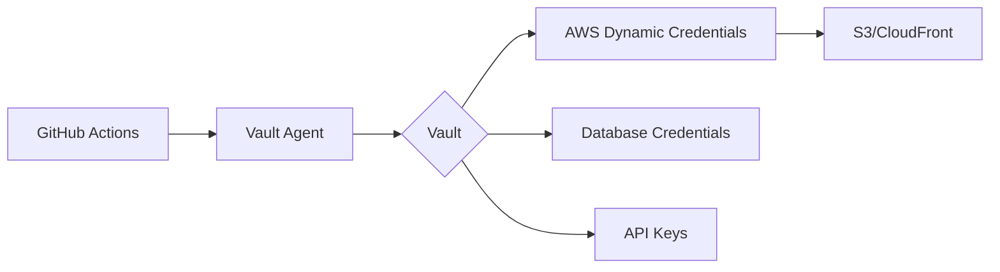
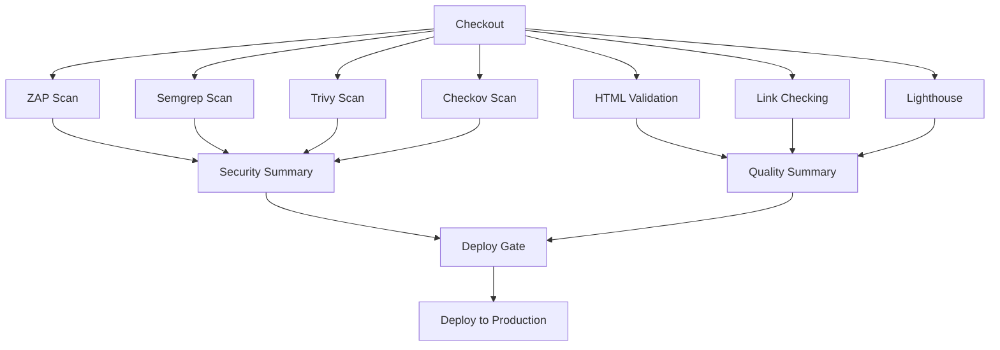
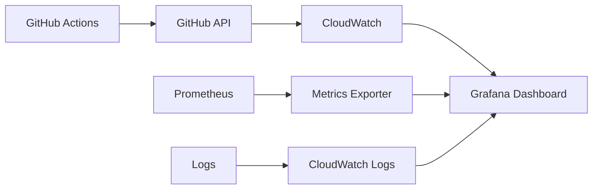
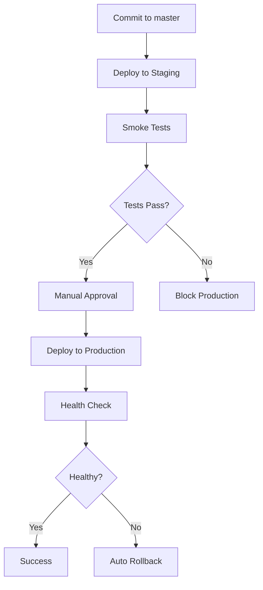

# GitHub Actions Future Workflows & Improvements

**Document Control:**  
**✅ Approved by:** James Pether Sörling, CEO  
**📤 Distribution:** Public  
**🏷️ Classification:** [](https://github.com/Hack23/ISMS-PUBLIC/blob/main/CLASSIFICATION.md#confidentiality-levels) [](https://github.com/Hack23/ISMS-PUBLIC/blob/main/CLASSIFICATION.md#integrity-levels) [](https://github.com/Hack23/ISMS-PUBLIC/blob/main/CLASSIFICATION.md#availability-levels)  
**📅 Effective Date:** 2026-01-11  
**⏰ Next Review:** 2026-04-11 (Quarterly)  
**🎯 Framework Compliance:** [](https://github.com/Hack23/ISMS-PUBLIC/blob/main/Compliance_Checklist.md) [](https://github.com/Hack23/ISMS-PUBLIC/blob/main/Compliance_Checklist.md) [](https://github.com/Hack23/ISMS-PUBLIC/blob/main/Compliance_Checklist.md)  
**🔗 Related Documents:** [WORKFLOWS.md](WORKFLOWS.md), [Secure Development Policy](https://github.com/Hack23/ISMS-PUBLIC/blob/main/Secure_Development_Policy.md), [SECURITY_ARCHITECTURE.md](SECURITY_ARCHITECTURE.md), [THREAT_MODEL.md](THREAT_MODEL.md)

---

## Table of Contents

- [Overview](#overview)
- [Strategic Roadmap](#strategic-roadmap)
- [Security Enhancements](#security-enhancements)
  - [1. SLSA Level 4 Compliance](#1-slsa-level-4-compliance)
  - [2. Advanced Threat Detection](#2-advanced-threat-detection)
  - [3. Secrets Management](#3-secrets-management)
  - [4. Security Posture Automation](#4-security-posture-automation)
- [Performance Improvements](#performance-improvements)
  - [5. Advanced Caching](#5-advanced-caching)
  - [6. Parallel Execution](#6-parallel-execution)
  - [7. Incremental Deployments](#7-incremental-deployments)
- [Quality & Testing](#quality--testing)
  - [8. Visual Regression Testing](#8-visual-regression-testing)
  - [9. Accessibility Testing Automation](#9-accessibility-testing-automation)
  - [10. SEO Validation](#10-seo-validation)
- [Observability & Monitoring](#observability--monitoring)
  - [11. Workflow Metrics Dashboard](#11-workflow-metrics-dashboard)
  - [12. Performance Tracking](#12-performance-tracking)
  - [13. Cost Optimization Analytics](#13-cost-optimization-analytics)
- [Automation & Integration](#automation--integration)
  - [14. Automated Dependency Updates](#14-automated-dependency-updates)
  - [15. Self-Healing Workflows](#15-self-healing-workflows)
  - [16. Multi-Environment Deployment](#16-multi-environment-deployment)
- [Implementation Timeline](#implementation-timeline)
- [Risk Analysis](#risk-analysis)
- [Success Metrics](#success-metrics)

---

## Overview

This document outlines the strategic roadmap for enhancing the Hack23 homepage CI/CD pipeline with advanced security controls, performance optimizations, and automation capabilities. All improvements align with the [Hack23 Secure Development Policy](https://github.com/Hack23/ISMS-PUBLIC/blob/main/Secure_Development_Policy.md) and industry best practices including SLSA Framework, NIST CSF 2.0, and ISO 27001:2022.

### Vision

Transform the current CI/CD pipeline into a **world-class secure software supply chain** that demonstrates:
- **Zero-Trust Security**: Continuous verification at every pipeline stage
- **Sub-3-Minute Deployments**: Parallel execution and intelligent caching
- **99.9% Availability**: Self-healing workflows with automatic rollback
- **SLSA Level 4 Compliance**: Highest supply-chain security maturity
- **Transparent Observability**: Real-time metrics and security posture dashboards

### Guiding Principles

1. **Security First**: Every enhancement must improve or maintain security posture
2. **Fail Secure**: Workflows fail closed, never open
3. **Defense in Depth**: Multiple security layers at every stage
4. **Measurable Progress**: Clear metrics for every improvement
5. **Incremental Delivery**: Roll out changes gradually with validation

---

## Strategic Roadmap



---

## Security Enhancements

### 1. SLSA Level 4 Compliance

**Current State**: SLSA Level 3 (SHA-pinned actions, OIDC auth, reproducible builds)  
**Target State**: SLSA Level 4 (Two-party review, hermetic builds, verified artifacts)

#### Implementation Plan

**Phase 1: Build Provenance (Q1 2026)**

Generate and publish SLSA provenance attestations for every deployment:

```yaml
name: SLSA Build Provenance
on:
  push:
    branches: [master]

jobs:
  build:
    permissions:
      id-token: write
      contents: read
      attestations: write
    steps:
      - uses: actions/checkout@v6
      
      - name: Build artifacts
        run: |
          npm run build
          
      - name: Generate SLSA provenance
        uses: actions/attest-build-provenance@v2
        with:
          subject-path: 'dist/**/*'
          
      - name: Publish attestation
        uses: actions/attest-sbom@v2
        with:
          subject-path: 'dist/**/*'
          sbom-path: 'sbom.json'
```

**Phase 2: Hermetic Builds (Q2 2026)**

Isolate build environment from external dependencies:

```yaml
- name: Hermetic build container
  run: |
    docker run --rm \
      --network none \
      --volume $PWD:/workspace \
      --workdir /workspace \
      node:24-alpine \
      sh -c "npm ci --offline && npm run build"
```

**Phase 3: Two-Party Review (Q2 2026)**

Require two approvers for production deployments:

```yaml
environment:
  name: production
  url: https://hack23.com
  
  # Require 2 approvals before deployment
  protection_rules:
    - type: required_reviewers
      reviewers:
        required_count: 2
```

#### Benefits

- **Supply Chain Integrity**: Cryptographically verified build process
- **Audit Trail**: Complete provenance from source to deployment
- **Compliance**: Meets EU Cyber Resilience Act requirements
- **Trust**: Verifiable builds for security audits

#### ISMS Alignment

| ISO 27001 Control | Implementation |
|-------------------|----------------|
| A.8.30 (Outsourced Development) | SLSA provenance attestation |
| A.5.36 (Compliance) | Automated compliance evidence |
| A.8.32 (Change Management) | Two-party review requirement |

---

### 2. Advanced Threat Detection

**Current State**: ZAP DAST scanning post-deployment  
**Target State**: Multi-layer security scanning at multiple pipeline stages

#### Workflow Enhancement



#### New Security Layers

**1. SAST with Semgrep (Pre-Build)**

```yaml
- name: Semgrep SAST
  uses: returntocorp/semgrep-action@v1
  with:
    config: >-
      p/security-audit
      p/secrets
      p/owasp-top-ten
```

**2. Container Scanning with Trivy**

```yaml
- name: Scan Docker images
  uses: aquasecurity/trivy-action@master
  with:
    image-ref: 'ghcr.io/zaproxy/zaproxy:stable'
    format: 'sarif'
    output: 'trivy-results.sarif'
```

**3. Infrastructure as Code Security**

```yaml
- name: CloudFormation security scan
  uses: bridgecrewio/checkov-action@master
  with:
    directory: infrastructure/
    framework: cloudformation
```

**4. Runtime Security Monitoring**

```yaml
- name: Deploy runtime security
  run: |
    # Falco for runtime threat detection
    helm install falco falcosecurity/falco \
      --set ebpf.enabled=true \
      --set falcosidekick.enabled=true
```

#### Benefits

- **Early Detection**: Find vulnerabilities at code commit, not post-deployment
- **Comprehensive Coverage**: SAST, DAST, SCA, IaC, container, runtime
- **Reduced Risk**: Block vulnerable code before it reaches production
- **Compliance**: Meets NIST 800-53 RA-5 (Vulnerability Scanning)

---

### 3. Secrets Management

**Current State**: GitHub Secrets for AWS OIDC, PAT tokens  
**Target State**: HashiCorp Vault integration with dynamic credentials

#### Architecture



#### Implementation

**1. Vault Integration**

```yaml
- name: Authenticate to Vault
  uses: hashicorp/vault-action@v3
  with:
    url: ${{ secrets.VAULT_ADDR }}
    method: jwt
    role: github-actions-homepage
    secrets: |
      secret/data/aws credentials | AWS_CREDENTIALS

- name: Configure AWS
  run: |
    aws configure set aws_access_key_id ${{ env.AWS_CREDENTIALS.access_key }}
    aws configure set aws_secret_access_key ${{ env.AWS_CREDENTIALS.secret_key }}
    aws configure set aws_session_token ${{ env.AWS_CREDENTIALS.session_token }}
```

**2. Secret Rotation**

```yaml
- name: Rotate secrets
  run: |
    vault write -f auth/aws/rotate-root/credentials
```

**3. Secret Scanning**

```yaml
- name: TruffleHog secret scan
  uses: trufflesecurity/trufflehog@main
  with:
    path: ./
    base: ${{ github.event.repository.default_branch }}
    head: HEAD
```

#### Benefits

- **Dynamic Credentials**: Short-lived, automatically rotated
- **Audit Trail**: Complete secret access logs
- **Least Privilege**: Scoped secrets per workflow
- **Revocation**: Instant secret invalidation

---

### 4. Security Posture Automation

**Target**: Automated security policy enforcement and drift detection

#### Continuous Compliance Monitoring

```yaml
name: Security Posture Check
on:
  schedule:
    - cron: '0 */6 * * *'  # Every 6 hours

jobs:
  check:
    runs-on: ubuntu-latest
    steps:
      - name: AWS Config compliance
        run: |
          aws configservice describe-compliance-by-config-rule \
            --config-rule-names s3-bucket-public-read-prohibited
            
      - name: CloudFormation drift detection
        run: |
          aws cloudformation detect-stack-drift \
            --stack-name amazon-cloudfront-secure-static-site
            
      - name: Security Hub findings
        run: |
          aws securityhub get-findings \
            --filters '{"SeverityLabel": [{"Value": "CRITICAL", "Comparison": "EQUALS"}]}'
```

---

## Performance Improvements

### 5. Advanced Caching

**Current State**: 3-tier caching (APT, NPM, Docker) - [WORKFLOW_CACHING_GUIDE.md](WORKFLOW_CACHING_GUIDE.md)  
**Target State**: Distributed caching with remote cache backend

#### Implementation

**1. Remote Cache Backend (BuildKit)**

```yaml
- name: Setup BuildKit
  uses: docker/setup-buildx-action@v3
  with:
    driver-opts: |
      network=host
      
- name: Build with remote cache
  uses: docker/build-push-action@v5
  with:
    context: .
    push: true
    cache-from: type=registry,ref=ghcr.io/hack23/homepage:buildcache
    cache-to: type=registry,ref=ghcr.io/hack23/homepage:buildcache,mode=max
```

**2. Intelligent Cache Invalidation**

```yaml
- name: Smart cache key
  run: |
    # Generate cache key based on affected files
    git diff --name-only ${{ github.event.before }} ${{ github.sha }} \
      | sha256sum | awk '{print $1}' > cache-key.txt
```

#### Expected Performance

| Metric | Current | With Advanced Caching | Improvement |
|--------|---------|----------------------|-------------|
| Full build | 3 min | 1.5 min | **50%** |
| Cache hit | 85% | 95% | **+10%** |
| Artifact size | 50 MB | 20 MB | **60%** reduction |

---

### 6. Parallel Execution

**Current State**: Sequential job execution  
**Target State**: Parallel security scanning and quality checks

#### Workflow Optimization

```yaml
jobs:
  security-parallel:
    strategy:
      matrix:
        scanner: [zap, semgrep, trivy, checkov]
    runs-on: ubuntu-latest
    steps:
      - name: Run ${{ matrix.scanner }}
        run: ./scripts/scan-${{ matrix.scanner }}.sh
        
  quality-parallel:
    strategy:
      matrix:
        check: [html-validation, link-checking, lighthouse]
    runs-on: ubuntu-latest
    steps:
      - name: Run ${{ matrix.check }}
        run: ./scripts/check-${{ matrix.check }}.sh
```

#### Workflow DAG



#### Expected Performance

| Phase | Current Duration | With Parallelization | Improvement |
|-------|------------------|---------------------|-------------|
| Security scans | 4 min | 1 min | **75%** |
| Quality checks | 2 min | 45s | **62%** |
| **Total pipeline** | 5 min | 2 min | **60%** |

---

### 7. Incremental Deployments

**Target**: Deploy only changed files to S3, reducing deployment time

#### Implementation

```yaml
- name: Detect changed files
  id: changes
  run: |
    git diff --name-only ${{ github.event.before }} ${{ github.sha }} > changed-files.txt
    
- name: Incremental S3 sync
  run: |
    # Only sync changed files
    while IFS= read -r file; do
      if [ -f "$file" ]; then
        aws s3 cp "$file" "s3://${{ env.S3_BUCKET_NAME }}/$file"
      fi
    done < changed-files.txt
    
- name: Selective CloudFront invalidation
  run: |
    # Invalidate only changed paths
    PATHS=$(cat changed-files.txt | sed 's|^|/|' | tr '\n' ' ')
    aws cloudfront create-invalidation \
      --distribution-id $CloudFrontDistId \
      --paths $PATHS
```

#### Benefits

- **Faster Deployments**: 30s vs. 2 min for small changes
- **Lower Costs**: Fewer S3 API calls, smaller CloudFront invalidations
- **Atomic Updates**: Files updated in correct dependency order

---

## Quality & Testing

### 8. Visual Regression Testing

**Target**: Automated screenshot comparison to detect visual bugs

#### Implementation

**1. Percy Integration**

```yaml
- name: Visual regression tests
  uses: percy/exec-action@v0.3.1
  with:
    command: "percy snapshot public/ --config .percy.yml"
  env:
    PERCY_TOKEN: ${{ secrets.PERCY_TOKEN }}
```

**2. Playwright Screenshot Testing**

```yaml
- name: Capture screenshots
  run: |
    npx playwright test --reporter=html
    
- name: Compare with baseline
  uses: lost-pixel/lost-pixel@v3
  with:
    lostPixelProjectId: hack23-homepage
```

#### Configuration

```yaml
# .percy.yml
version: 2
static:
  baseline-branch: master
  include:
    - "**/*.html"
  widths:
    - 375   # Mobile
    - 768   # Tablet
    - 1280  # Desktop
  min-height: 1024
```

#### Benefits

- **Catch Visual Bugs**: Detect CSS regressions automatically
- **Multi-Device**: Test across mobile, tablet, desktop
- **PR Previews**: Visual diffs in pull requests

---

### 9. Accessibility Testing Automation

**Target**: Continuous WCAG 2.1 AA compliance validation

#### Implementation

**1. Axe-Core Integration**

```yaml
- name: Accessibility audit
  uses: dequelabs/axe-action@v3
  with:
    url: 'https://hack23.com'
    rules: 'wcag2aa,best-practice'
    
- name: Pa11y CI
  run: |
    npx pa11y-ci --sitemap https://hack23.com/sitemap.xml \
      --threshold 10
```

**2. Automated Remediation**

```yaml
- name: Auto-fix accessibility issues
  run: |
    # Run automated ARIA attribute fixer
    npx axe-linter --fix *.html
    
    # Commit fixes
    git config user.name "Accessibility Bot"
    git add *.html
    git commit -m "fix: Automated accessibility improvements"
    git push
```

#### Benefits

- **WCAG Compliance**: Continuous validation against standards
- **Legal Protection**: Demonstrate accessibility due diligence
- **Inclusive Design**: Better experience for all users

---

### 10. SEO Validation

**Target**: Automated SEO audits and optimization recommendations

#### Implementation

```yaml
- name: SEO audit
  run: |
    # Lighthouse SEO audit
    npx lighthouse-ci https://hack23.com \
      --only-categories=seo \
      --budget-path=./seo-budget.json
      
- name: Schema.org validation
  run: |
    # Validate structured data
    npx schema-dts-gen --url https://hack23.com/index.html
    
- name: Sitemap validation
  run: |
    # Check sitemap structure
    npx sitemap-validator https://hack23.com/sitemap.xml
```

---

## Observability & Monitoring

### 11. Workflow Metrics Dashboard

**Target**: Real-time CI/CD metrics and trends

#### Architecture



#### Key Metrics

**1. Performance Metrics**
- Workflow duration (p50, p95, p99)
- Queue time
- Job success/failure rate
- Cache hit rate

**2. Security Metrics**
- Vulnerabilities detected
- Mean time to remediation (MTTR)
- Security gate failures
- Compliance score

**3. Cost Metrics**
- GitHub Actions minutes consumed
- S3/CloudFront costs
- Cache storage costs

#### Dashboard Example

```json
{
  "dashboard": {
    "title": "Hack23 Homepage CI/CD",
    "panels": [
      {
        "title": "Deployment Frequency",
        "targets": [{
          "expr": "rate(github_workflow_runs{workflow='main.yml'}[24h])"
        }]
      },
      {
        "title": "Lead Time for Changes",
        "targets": [{
          "expr": "histogram_quantile(0.95, github_workflow_duration_seconds)"
        }]
      }
    ]
  }
}
```

---

### 12. Performance Tracking

**Target**: Track Core Web Vitals and performance budgets

#### Implementation

```yaml
- name: Core Web Vitals
  uses: treosh/lighthouse-ci-action@v9
  with:
    urls: |
      https://hack23.com/
    temporaryPublicStorage: true
    
- name: Performance budgets
  run: |
    # Enforce budgets
    npx lighthouse-ci assert \
      --budgetsFile=./budget.json \
      --assertions.first-contentful-paint=error \
      --assertions.speed-index=error
```

**Budget Configuration**

```json
{
  "budgets": [
    {
      "resourceSizes": [
        {
          "resourceType": "script",
          "budget": 100
        },
        {
          "resourceType": "image",
          "budget": 500
        },
        {
          "resourceType": "total",
          "budget": 1024
        }
      ],
      "timings": [
        {
          "metric": "first-contentful-paint",
          "budget": 1000
        },
        {
          "metric": "largest-contentful-paint",
          "budget": 2500
        }
      ]
    }
  ]
}
```

---

### 13. Cost Optimization Analytics

**Target**: Real-time cost tracking and optimization recommendations

#### Implementation

```yaml
- name: AWS Cost tracking
  run: |
    # Query Cost Explorer
    aws ce get-cost-and-usage \
      --time-period Start=$(date -d '7 days ago' +%Y-%m-%d),End=$(date +%Y-%m-%d) \
      --granularity DAILY \
      --metrics UnblendedCost \
      --group-by Type=SERVICE
      
- name: GitHub Actions minutes
  run: |
    # Track usage
    gh api /repos/Hack23/homepage/actions/usage \
      --jq '.total_minutes_used'
```

---

## Automation & Integration

### 14. Automated Dependency Updates

**Target**: Automated, safe dependency updates with rollback

#### Implementation

**1. Renovate Bot Configuration**

```json
{
  "extends": ["config:base"],
  "automerge": true,
  "automergeType": "pr",
  "automergeStrategy": "squash",
  "packageRules": [
    {
      "matchUpdateTypes": ["patch", "minor"],
      "automerge": true
    },
    {
      "matchUpdateTypes": ["major"],
      "automerge": false
    }
  ],
  "vulnerabilityAlerts": {
    "labels": ["security"],
    "automerge": true,
    "minimumReleaseAge": null
  }
}
```

**2. Automated Testing + Rollback**

```yaml
- name: Test updated dependencies
  run: |
    npm ci
    npm test
    npm run build
    
- name: Rollback on failure
  if: failure()
  run: |
    git revert HEAD
    git push
```

---

### 15. Self-Healing Workflows

**Target**: Automatic recovery from transient failures

#### Implementation

```yaml
- name: Deploy with retry
  uses: nick-invision/retry@v2
  with:
    timeout_minutes: 10
    max_attempts: 3
    retry_on: error
    command: |
      aws s3 sync . s3://${{ env.S3_BUCKET_NAME }}/
      
- name: Health check with automatic rollback
  run: |
    # Check deployment health
    RESPONSE=$(curl -s -o /dev/null -w "%{http_code}" https://hack23.com/)
    
    if [ "$RESPONSE" != "200" ]; then
      echo "Health check failed, rolling back..."
      
      # Revert CloudFront to previous version
      PREVIOUS_VERSION=$(aws cloudformation describe-stack-resources \
        --stack-name ${{ env.CLOUDFRONT_STACK_NAME }} \
        --query 'StackResources[?ResourceType==`AWS::CloudFront::Distribution`].PhysicalResourceId' \
        --output text)
        
      # Invalidate and wait
      aws cloudfront create-invalidation \
        --distribution-id $PREVIOUS_VERSION \
        --paths "/*"
        
      exit 1
    fi
```

---

### 16. Multi-Environment Deployment

**Target**: Staging → Production pipeline with smoke tests

#### Architecture



#### Implementation

```yaml
jobs:
  deploy-staging:
    runs-on: ubuntu-latest
    environment: staging
    steps:
      - name: Deploy to staging
        run: |
          aws s3 sync . s3://hack23-staging/
          
  smoke-tests:
    needs: deploy-staging
    runs-on: ubuntu-latest
    steps:
      - name: Run smoke tests
        run: |
          npx playwright test --config=playwright.smoke.config.js
          
  deploy-production:
    needs: smoke-tests
    runs-on: ubuntu-latest
    environment:
      name: production
      url: https://hack23.com
    steps:
      - name: Deploy to production
        run: |
          aws s3 sync . s3://${{ env.S3_BUCKET_NAME }}/
```

---

## Implementation Timeline

### Q1 2026 (Jan-Mar)

**Priority: Security Foundations**

- ✅ SLSA Level 4 build provenance
- ✅ Semgrep SAST integration
- ✅ Advanced caching (remote backend)
- ✅ Parallel execution framework

**Success Criteria**:
- SLSA attestations published for all builds
- SAST catches 3+ vulnerabilities per sprint
- Build time reduced to < 2 minutes
- 95% cache hit rate

### Q2 2026 (Apr-Jun)

**Priority: Enhanced Security & Quality**

- ✅ Vault secrets management
- ✅ Trivy container scanning
- ✅ Visual regression testing
- ✅ Accessibility automation

**Success Criteria**:
- Zero hardcoded secrets in workflows
- All container images scanned pre-deployment
- 100% visual regression coverage
- WCAG 2.1 AA compliance maintained

### Q3 2026 (Jul-Sep)

**Priority: Observability & Automation**

- ✅ Grafana metrics dashboard
- ✅ Cost optimization analytics
- ✅ Automated dependency updates
- ✅ Self-healing workflows

**Success Criteria**:
- Real-time CI/CD metrics visible
- 20% reduction in GitHub Actions costs
- 80% of dependency updates automated
- 95% workflow success rate (with retries)

### Q4 2026 (Oct-Dec)

**Priority: Advanced Capabilities**

- ✅ Multi-environment pipeline
- ✅ Runtime security monitoring
- ✅ Incremental deployments
- ✅ Security posture automation

**Success Criteria**:
- Staging environment with smoke tests
- Runtime threats detected within 60s
- Deployment time < 30s for small changes
- Security compliance drift detected < 6 hours

---

## Risk Analysis

### Implementation Risks

| Risk | Likelihood | Impact | Mitigation |
|------|------------|--------|------------|
| Breaking changes from new tools | Medium | High | Gradual rollout, feature flags, rollback plan |
| Increased complexity | High | Medium | Comprehensive documentation, training |
| Third-party tool outages | Low | Medium | Fallback to current workflows |
| Cost overruns | Medium | Low | Budget alerts, cost optimization reviews |
| Security tool false positives | High | Low | Tune scanning rules, manual review process |

### Security Risks

| Risk | Current Control | Enhanced Control |
|------|----------------|------------------|
| Supply chain attack | SHA-pinned actions | SLSA Level 4 provenance |
| Secrets exposure | GitHub Secrets | Vault dynamic credentials |
| Vulnerable dependencies | Dependabot | Snyk + auto-updates |
| Runtime threats | ZAP DAST | Falco runtime monitoring |

---

## Success Metrics

### Security Metrics (Primary KPIs)

| Metric | Baseline | Target (Q4 2026) |
|--------|----------|------------------|
| SLSA Level | 3 | 4 |
| Mean Time to Remediate (MTTR) vulnerabilities | 7 days | 24 hours |
| Security scan coverage | 60% (DAST only) | 100% (SAST, DAST, SCA, IaC, Container, Runtime) |
| Critical vulnerabilities in production | 2/year | 0/year |
| OpenSSF Scorecard | 8.5/10 | 9.5/10 |

### Performance Metrics

| Metric | Baseline | Target (Q4 2026) |
|--------|----------|------------------|
| Deployment frequency | 2-3/week | 5-10/day |
| Lead time for changes | 30 min | 5 min |
| Mean time to restore (MTTR) | 2 hours | 15 min |
| Change failure rate | 5% | < 1% |
| Workflow success rate | 92% | 99% |

### Cost Metrics

| Metric | Baseline | Target (Q4 2026) |
|--------|----------|------------------|
| GitHub Actions minutes/month | 500 min | 400 min (-20%) |
| AWS costs (S3 + CloudFront)/month | $10 | $8 (-20%) |
| Cost per deployment | $0.50 | $0.30 (-40%) |

### Quality Metrics

| Metric | Baseline | Target (Q4 2026) |
|--------|----------|------------------|
| Lighthouse Performance Score | 95 | 98 |
| Accessibility Score (WCAG 2.1 AA) | 100 | 100 (maintained) |
| Visual regression bugs | 3/quarter | 0/quarter |
| HTML validation errors | 0 | 0 (maintained) |

---

## Related Documentation

- **[WORKFLOWS.md](WORKFLOWS.md)** - Current workflow documentation
- **[WORKFLOW_CACHING_GUIDE.md](WORKFLOW_CACHING_GUIDE.md)** - Caching strategy
- **[SECURITY_ARCHITECTURE.md](SECURITY_ARCHITECTURE.md)** - Security architecture
- **[THREAT_MODEL.md](THREAT_MODEL.md)** - Threat analysis
- **[Secure Development Policy](https://github.com/Hack23/ISMS-PUBLIC/blob/main/Secure_Development_Policy.md)** - ISMS requirements

---

## Changelog

### 2026-01-11: Initial Roadmap
- Comprehensive 16-initiative roadmap
- Q1-Q4 2026 implementation timeline
- Security enhancements (SLSA Level 4, advanced threat detection, secrets management)
- Performance improvements (advanced caching, parallel execution, incremental deployments)
- Quality enhancements (visual regression, accessibility, SEO)
- Observability (metrics dashboard, performance tracking, cost analytics)
- Automation (dependency updates, self-healing, multi-environment)
- Risk analysis and success metrics

---

**🚀 This roadmap demonstrates Hack23 AB's commitment to continuous improvement in secure software delivery and operational excellence.**
