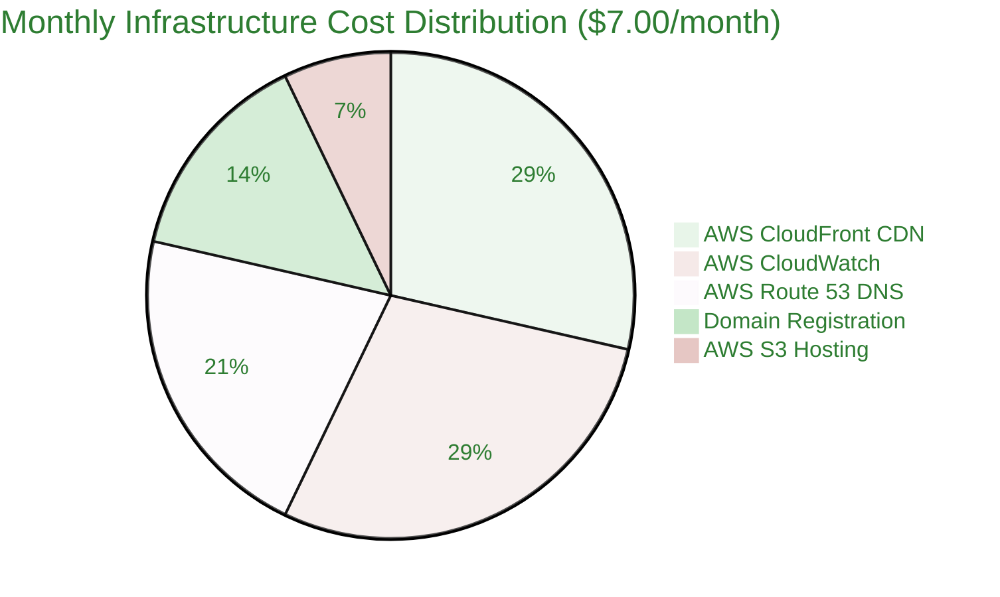
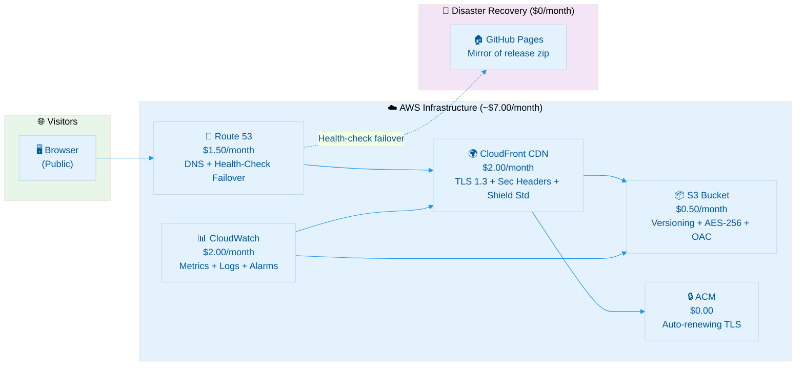

  

<h1 align="center">💰 Hack23 Homepage — Financial & Security Plan</h1>

  <strong>📊 Infrastructure Cost Analysis & Security Investment for hack23.com</strong> 
  <em>🔗 <a href="https://github.com/Hack23/ISMS-PUBLIC/blob/main/Secure_Development_Policy.md">Secure Development Policy</a> · <a href="https://github.com/Hack23/ISMS-PUBLIC/blob/main/CLASSIFICATION.md">Classification Framework</a></em>

  
  
  

**📋 Document Owner:** CEO | **📄 Version:** 1.0 | **📅 Last Updated:** 2026-04-21 (UTC)
**🔄 Review Cycle:** Annual | **⏰ Next Review:** 2027-04-21
**🏷️ Classification:**  (Static Corporate Website)

**🔐 ISMS Alignment:** Implements the financial / lifecycle documentation requirement of the [Hack23 Secure Development Policy](https://github.com/Hack23/ISMS-PUBLIC/blob/main/Secure_Development_Policy.md) and supports the [BCPPlan.md](BCPPlan.md) by establishing the recovery cost envelope.

---

## 📋 Purpose

This document outlines the financial profile and security investment for the **Hack23 Homepage** (`hack23.com`) — the static corporate website that hosts the Hack23 product portfolio, ISMS transparency portfolio, and lead-generation surfaces. For architectural context, see the [Architecture Documentation](ARCHITECTURE.md), [End-of-Life Strategy](End-of-Life-Strategy.md), and [BCP Plan](BCPPlan.md).

---

## 💵 Current Cost Summary — AWS CloudFront + S3 Static Deployment

The site is a **static HTML/CSS site** with **no backend** (no Lambda, no databases, no compute). All hosting cost is therefore predictable, low, and dominated by AWS DNS + CDN charges.

### Cash Flow Overview

| **Time Frame** | **Monthly (USD)** | **Annual (USD)** |
|----------------|-------------------|------------------|
| **AWS Infrastructure** | **$7.00** | **$84.00** |
| **Security Tooling** | **$0.00** | **$0.00** |
| **Development CI/CD** | **$0.00** | **$0.00** |
| **Grand Total** | **$7.00** | **$84.00** |

> **Note:** All costs are illustrative for a low-volume corporate website (target traffic well below CloudFront / CloudWatch free-tier thresholds). Actual AWS billing may vary modestly with traffic. Hack23 leverages OSS / free-tier developer tooling for security and CI/CD, so the marginal cost of compliance and supply-chain assurance is effectively **zero**.

---

### 🏗️ AWS Infrastructure Cost Breakdown

| **Component** | **Service** | **Monthly (USD)** | **Annual (USD)** | **Notes** |
|---------------|-------------|-------------------|------------------|-----------|
| **Hosting** | AWS S3 (private bucket via OAC) | $0.50 | $6.00 | 1,353 small HTML files; AES-256 SSE; versioning enabled |
| **CDN** | AWS CloudFront | $2.00 | $24.00 | Global edge distribution; TLS 1.3; security-headers policy; AWS Shield Standard included |
| **DNS** | AWS Route 53 | $1.50 | $18.00 | Hosted zone + queries + health-check (DR failover to GitHub Pages) |
| **Domain** | Domain registration | $1.00 | $12.00 | Annual `.com` renewal (~$12 averaged) |
| **SSL / TLS** | AWS Certificate Manager | $0.00 | $0.00 | Free TLS certificates for CloudFront |
| **DR Hosting** | GitHub Pages | $0.00 | $0.00 | Free DR origin via `gh-pages` branch (public repo) |
| **Monitoring** | AWS CloudWatch (basic) | $2.00 | $24.00 | Basic metrics, log retention, alarms |
| **AWS Total** | | **$7.00** | **$84.00** | |

### 🛡️ Security & DevOps Tooling (All Free Tier / OSS)

| **Component** | **Service** | **Monthly (USD)** | **Annual (USD)** | **Notes** |
|---------------|-------------|-------------------|------------------|-----------|
| **CI/CD (10 workflows)** | GitHub Actions | $0.00 | $0.00 | Free for public repos (unlimited minutes) |
| **Code Scanning (SAST)** | GitHub CodeQL | $0.00 | $0.00 | Free for public repos |
| **Dependency Scanning** | Dependabot | $0.00 | $0.00 | Free for all repos |
| **Dependency Review** | `actions/dependency-review-action` | $0.00 | $0.00 | Free for public repos |
| **Supply-Chain Score** | OpenSSF Scorecard | $0.00 | $0.00 | Free OSS |
| **SBOM Generation** | Anchore Syft | $0.00 | $0.00 | Free OSS (SHA-pinned action) |
| **Build Provenance** | GitHub `actions/attest-build-provenance` (SLSA 3) | $0.00 | $0.00 | Free for public repos |
| **Runtime Hardening** | StepSecurity Harden Runner | $0.00 | $0.00 | Free for public repos |
| **DAST** | OWASP ZAP (`ghcr.io/zaproxy/zaproxy:stable`) | $0.00 | $0.00 | Free OSS |
| **HTML Validation** | HTMLHint, html5validator | $0.00 | $0.00 | Free OSS |
| **Performance / Accessibility** | Lighthouse CI, axe (via Lighthouse) | $0.00 | $0.00 | Free OSS |
| **Link Checking** | Linkinator | $0.00 | $0.00 | Free OSS |
| **License Compliance** | FOSSA (badge in README), GitHub License Detection | $0.00 | $0.00 | Free for OSS |
| **Tooling Total** | | **$0.00** | **$0.00** | |

---

## 📊 Cost Distribution

---

## 🔐 Security Investment Analysis

### Current Security Tooling (Incremental Cost — All Free / OSS)

> **Note:** This table covers *incremental security tooling costs only*. AWS-bundled security services (Shield Standard, ACM, OAC, Origin Access Logs) are accounted for in the infrastructure breakdown above.

| **Security Service** | **Provider** | **Annual Cost** | **ISMS Policy Alignment** |
|----------------------|--------------|-----------------|---------------------------|
| SAST (CodeQL) | GitHub | $0.00 | [Secure Development Policy](https://github.com/Hack23/ISMS-PUBLIC/blob/main/Secure_Development_Policy.md) |
| DAST (OWASP ZAP baseline) | OWASP | $0.00 | [Secure Development Policy](https://github.com/Hack23/ISMS-PUBLIC/blob/main/Secure_Development_Policy.md) |
| Dependency Scanning | Dependabot + dependency-review | $0.00 | [Vulnerability Management](https://github.com/Hack23/ISMS-PUBLIC/blob/main/Vulnerability_Management.md) |
| Secret Scanning | GitHub Secret Scanning + push protection | $0.00 | [Cryptographic Controls Policy](https://github.com/Hack23/ISMS-PUBLIC/blob/main/Cryptographic_Controls_Policy.md) |
| Supply Chain Scoring | OpenSSF Scorecard | $0.00 | [Open Source Policy](https://github.com/Hack23/ISMS-PUBLIC/blob/main/Open_Source_Policy.md) |
| SBOM (SPDX 2.3) | Anchore Syft | $0.00 | [Open Source Policy](https://github.com/Hack23/ISMS-PUBLIC/blob/main/Open_Source_Policy.md) |
| SLSA Level 3 Provenance | GitHub OIDC + attest-build-provenance | $0.00 | [Open Source Policy](https://github.com/Hack23/ISMS-PUBLIC/blob/main/Open_Source_Policy.md) |
| Runtime Hardening | StepSecurity Harden Runner (egress allowlist) | $0.00 | [Network Security Policy](https://github.com/Hack23/ISMS-PUBLIC/blob/main/Network_Security_Policy.md) |
| Performance / A11y | Lighthouse CI (Perf ≥ 90, A11y 100, SEO 100) | $0.00 | [Secure Development Policy](https://github.com/Hack23/ISMS-PUBLIC/blob/main/Secure_Development_Policy.md) |
| HTML / Link Validation | HTMLHint, html5validator, Linkinator | $0.00 | [Secure Development Policy](https://github.com/Hack23/ISMS-PUBLIC/blob/main/Secure_Development_Policy.md) |
| TLS Certificates | AWS Certificate Manager | Included in AWS infra | [Cryptographic Controls Policy](https://github.com/Hack23/ISMS-PUBLIC/blob/main/Cryptographic_Controls_Policy.md) |
| **Total Incremental Tooling Cost** | | **$0.00** | |

### Security Posture Metrics

| **Metric** | **Value** | **Source** |
|------------|-----------|------------|
| Total security tooling investment | $0 / year | All OSS / free-tier |
| Total infrastructure security investment | ≈ $54 / year | AWS Shield Standard + CloudWatch + Route 53 health-checks + S3 versioning (subset of $84 AWS spend) |
| Vulnerability detection coverage | SAST + DAST + SCA + secret scanning + scorecard | Multi-layer pipeline |
| Mean Time to Detect (MTTD) — code | < 24 h | Automated CI on every PR |
| Lighthouse Performance budget | ≥ 90 | `budget.json` enforced in CI |
| Lighthouse Accessibility | 100 | WCAG 2.1 AA |
| Lighthouse SEO | 100 | Schema.org + hreflang + sitemap |
| Supply-chain score | OpenSSF Scorecard (badge in README) | Continuous |
| SLSA Build Level | **Level 3** | GitHub Actions attestation per release |
| Latest released version | **v1.0.11** | GitHub Releases |

---

## 🏗️ AWS Infrastructure Security Architecture

### AWS Security Controls (Included in Base Cost)

| **Security Control** | **AWS Service** | **Additional Cost** | **ISMS Alignment** |
|---------------------|-----------------|---------------------|--------------------|
| **HTTPS Enforcement** | CloudFront + ACM | $0.00 | [Cryptographic Controls Policy](https://github.com/Hack23/ISMS-PUBLIC/blob/main/Cryptographic_Controls_Policy.md) |
| **DDoS Protection** | AWS Shield Standard | $0.00 | [Network Security Policy](https://github.com/Hack23/ISMS-PUBLIC/blob/main/Network_Security_Policy.md) |
| **Origin Access** | CloudFront OAC | $0.00 | [Access Control Policy](https://github.com/Hack23/ISMS-PUBLIC/blob/main/Access_Control_Policy.md) |
| **Versioning / Backup** | S3 Versioning | $0.00 | [Backup & Recovery Policy](https://github.com/Hack23/ISMS-PUBLIC/blob/main/Backup_Recovery_Policy.md) |
| **Encryption at Rest** | S3 SSE-AES-256 | $0.00 | [Cryptographic Controls Policy](https://github.com/Hack23/ISMS-PUBLIC/blob/main/Cryptographic_Controls_Policy.md) |
| **Access Logging** | S3 + CloudFront access logs | $0.00 | [Information Security Policy](https://github.com/Hack23/ISMS-PUBLIC/blob/main/Information_Security_Policy.md) |
| **Health-Check Failover** | Route 53 health checks → GitHub Pages | $0.00 (within Route 53 spend) | [BCPPlan.md](BCPPlan.md) |
| **Security Headers** | CloudFront Functions / Response Headers Policy | $0.00 (free-tier invocations) | [Secure Development Policy](https://github.com/Hack23/ISMS-PUBLIC/blob/main/Secure_Development_Policy.md) |

> *CloudFront Functions pricing includes a generous monthly free tier. The plan assumes traffic remains well within this tier; higher invocation volumes would add per-invocation charges according to AWS regional pricing.*

---

## 💰 Total Cost of Ownership (TCO) Summary

### 3-Year TCO Projection

| **Cost Category** | **Year 1** | **Year 2** | **Year 3** | **3-Year Total** |
|-------------------|-----------|-----------|-----------|------------------|
| AWS Infrastructure | $84.00 | $84.00 | $84.00 | $252.00 |
| Security Tooling | $0.00 | $0.00 | $0.00 | $0.00 |
| CI/CD Pipeline (10 workflows) | $0.00 | $0.00 | $0.00 | $0.00 |
| Compliance Tooling | $0.00 | $0.00 | $0.00 | $0.00 |
| Development Tooling | $0.00 | $0.00 | $0.00 | $0.00 |
| **Total** | **$84.00** | **$84.00** | **$84.00** | **$252.00** |

### Cost Efficiency Analysis

| **Metric** | **Value** | **Benchmark** |
|------------|-----------|---------------|
| Monthly cost per page (1,353 HTML files) | < $0.006 | Static marketing site |
| Annual cost per language (14 languages) | $6.00 | International reach |
| Security cost per vulnerability finding | $0.00 | Fully automated free-tier tools |
| DR cost overhead | $0.00 | GitHub Pages |
| Compliance cost (ISO 27001 / NIST CSF / CIS / CRA evidence) | $0.00 | Self-documented in `docs/` per release |

---

## 📈 Cost Optimisation Strategies

### Currently in Force

1. **🆓 Public-repo advantage** — Every GitHub-supplied scanning, attestation, and CI/CD service is free for public repositories
2. **☁️ AWS free-tier alignment** — CloudWatch and CloudFront Functions stay inside their respective free tiers at current traffic volumes
3. **📦 Static-only architecture** — No Lambda, EC2, container, or database spend
4. **🔒 Built-in security** — AWS Shield Standard, ACM, and OAC cost nothing extra
5. **🔄 Free DR** — GitHub Pages provides a no-cost active mirror via Route 53 health-check failover
6. **📋 Documentation-as-code** — `release.yml` regenerates Lighthouse, accessibility, security, and SBOM reports per release into the `docs/` folder, removing the need for paid compliance dashboards
7. **🤖 AI tooling on free tiers** — GitHub Copilot Coding Agent (organisation entitlement); MCP servers run locally per developer

### Future Cost Considerations

If the website evolves beyond a static frontend (see [FUTURE_ARCHITECTURE.md](FUTURE_ARCHITECTURE.md)), expected cost adjustments:

| **Evolution Scenario** | **Estimated Additional Monthly Cost** | **Key Cost Drivers** |
|------------------------|---------------------------------------|----------------------|
| **Current (static site)** | $7.00 (baseline) | CloudFront + S3 + Route 53 |
| **+ Server-less contact form** | +$1–3 | API Gateway + Lambda + SES |
| **+ Newsletter / signup** | +$2–5 | DynamoDB + Lambda + SES |
| **+ Search index** | +$5–15 | OpenSearch Serverless or 3rd-party |
| **+ Authenticated client portal** | +$10–20 | Cognito + DynamoDB + Lambda |
| **+ AWS WAF + GuardDuty** | +$30–50 | Enhanced detective controls |
| **Full enhanced AWS stack** | $50–100 | All AWS managed security services |

---

## 🔄 Budget Alignment with ISMS Policies

### Security Investment by ISMS Policy Area

| 🛡️ ISMS Policy | 💰 Current Annual Cost | 🔧 Services Used | 📊 Business Value |
|----------------|------------------------|------------------|-------------------|
| [**Secure Development Policy**](https://github.com/Hack23/ISMS-PUBLIC/blob/main/Secure_Development_Policy.md) | $0.00 | CodeQL, ZAP, Lighthouse, HTMLHint, html5validator | Code & content quality assurance |
| [**Vulnerability Management**](https://github.com/Hack23/ISMS-PUBLIC/blob/main/Vulnerability_Management.md) | $0.00 | Dependabot, dependency-review, OpenSSF Scorecard | Continuous vulnerability detection |
| [**Cryptographic Controls Policy**](https://github.com/Hack23/ISMS-PUBLIC/blob/main/Cryptographic_Controls_Policy.md) | $0.00 | AWS ACM (TLS 1.3), Secret Scanning | TLS + secret protection |
| [**Network Security Policy**](https://github.com/Hack23/ISMS-PUBLIC/blob/main/Network_Security_Policy.md) | $24.00 | CloudFront + AWS Shield Standard + StepSecurity Harden Runner | CDN + DDoS + egress allowlist |
| [**Access Control Policy**](https://github.com/Hack23/ISMS-PUBLIC/blob/main/Access_Control_Policy.md) | $0.00 | CloudFront OAC, S3 bucket policy, AWS OIDC for GitHub Actions | Origin & deploy access control |
| [**Backup & Recovery Policy**](https://github.com/Hack23/ISMS-PUBLIC/blob/main/Backup_Recovery_Policy.md) | $6.00 | S3 versioning, GitHub Pages DR, Route 53 health-check failover | Multi-layer DR (see [BCPPlan.md](BCPPlan.md)) |
| [**Information Security Policy**](https://github.com/Hack23/ISMS-PUBLIC/blob/main/Information_Security_Policy.md) | $24.00 | CloudWatch + S3/CloudFront access logs | Monitoring & audit trail |
| [**Open Source Policy**](https://github.com/Hack23/ISMS-PUBLIC/blob/main/Open_Source_Policy.md) | $0.00 | Anchore Syft SBOM, SLSA Level 3, FOSSA, Scorecard | License & supply-chain assurance |
| [**AI Policy**](https://github.com/Hack23/ISMS-PUBLIC/blob/main/AI_Policy.md) | $0.00 | GitHub Copilot, 58 skills, 8 custom agents, MCP servers | AI-assisted DevSecOps with policy guardrails |
| **Total** | **$54.00** | | |

---

## 📋 Related Documents

| Icon | Document | Relationship |
|------|----------|--------------|
| 🏗️ | [Architecture](ARCHITECTURE.md) | System design |
| 🛡️ | [Security Architecture](SECURITY_ARCHITECTURE.md) | Defense-in-depth controls |
| 🎯 | [Threat Model](THREAT_MODEL.md) | Risk-driven justification for investment |
| 🔮 | [Future Architecture](FUTURE_ARCHITECTURE.md) | Cost-impact evolution scenarios |
| 🔚 | [End-of-Life Strategy](End-of-Life-Strategy.md) | Sunset cost considerations |
| 🔄 | [BCP Plan](BCPPlan.md) | Recovery cost envelope |
| 🛡️ | [CRA Assessment](CRA-ASSESSMENT.md) | Regulatory cost evidence |
| 📖 | [README](README.md) | Project overview |
| 💼 | [SWOT](SWOT.md) | Strategic positioning |

---

## 📋 Document Control

**✅ Approved by:** James Pether Sörling, CEO, Hack23 AB
**📤 Distribution:** Public
**🏷️ Classification:** 
**📅 Effective Date:** 2026-04-21
**⏰ Next Review:** 2027-04-21

