# 🇫🇮 Finnish (fi) Translation Guide

**Version 6.0 - Expanded Hack23 Edition**  
*Last Updated: January 2026*

---

## 📋 Quick Reference

| Attribute | Value |
|-----------|-------|
| **Language Code** | `fi` |
| **Locale** | `fi_FI` |
| **Text Direction** | LTR (Left-to-Right) → |
| **Currency** | EUR (€) |
| **Date Format** | `DD.MM.YYYY` or `1. tammikuuta 2026` |

---

## 🔄 Visual Translation Workflow

```mermaid
graph LR
    A[Valitse tiedosto] --> B[Tarkista terminologia]
    B --> C[Käännä sisältö]
    C --> D[Laadunvarmistus]
    D --> E{Hyväksytty?}
    E -->|Kyllä| F[Julkaise]
    E -->|Ei| C
```

## 🔄 Quality Standards Pyramid

---

## 📚 Comprehensive Vocabulary Reference

### 🔥 Brand & Key Entities (Never Translate)

| English | Finnish | Notes |
|---------|---------|-------|
| Hack23 | Hack23 | Company name – never translate |
| Hack23 AB | Hack23 AB | Swedish company designation |
| Citizen Intelligence Agency | Citizen Intelligence Agency | Project name – keep English |
| CIA Compliance Manager | CIA Compliance Manager | Product name – keep English |
| Black Trigram | Black Trigram | Game product – keep English |
| 흑괘 | 흑괘 | Korean name for Black Trigram |
| 黑卦 | 黑卦 | Chinese name for Black Trigram |
| James Pether Sörling | James Pether Sörling | Founder name |
| CISSP | CISSP | Certification |
| CISM | CISM | Certification |
| GitHub | GitHub | Platform name |
| LinkedIn | LinkedIn | Platform name |
| OpenSSF | OpenSSF | Open Source Security Foundation |
| CII Best Practices | CII Best Practices | Badge name |
| Riksdag | Riksdag | Swedish Parliament |

### 👔 Job Titles & Professional Roles

| English | Finnish | Notes |
|---------|---------|-------|
| CEO / Chief Executive Officer | Toimitusjohtaja | |
| Founder | Perustaja | |
| CEO/Founder | Toimitusjohtaja/perustaja | |
| Application Security Officer | Sovellusturvallisuusvastaava | |
| Information Security Officer | Tietoturvajohtaja | |
| Senior Security Architect | Vanhempi turvallisuusarkkitehti | |
| Cloud Architect | Pilviarkkitehti | |
| Security Consultant | Turvallisuuskonsultti | |
| CISO | CISO | Chief Information Security Officer |
| Compliance Officer | Vaatimustenmukaisuusvastaava | |
| Risk Manager | Riskipäällikkö | |
| IT Security Manager | IT-turvallisuuspäällikkö | |
| Security Auditor | Turvallisuusauditoija | |
| Taekwondo Instructor | Taekwondo-ohjaaja | |
| System Developer | Järjestelmäkehittäjä | |
| Software Engineer | Ohjelmistoinsinööri | |
| J2EE Developer | J2EE-kehittäjä | |
| Unix Helpdesk | Unix-tukipalvelu | |
| Teaching Assistant | Opetusassistentti | |
| NBC Defence Group Leader | NBC-suojeluryhmän johtaja | Military role |

### 🏢 Hack23 Business & Services

| English | Finnish | Notes |
|---------|---------|-------|
| Cybersecurity Consulting Sweden | Kyberturvallisuuskonsultointi Ruotsissa | Main tagline |
| Public ISMS | Julkinen ISMS | Core differentiator |
| Open ISMS Transparency | Avoin ISMS-läpinäkyvyys | |
| Security Architecture & Strategy | Turvallisuusarkkitehtuuri ja -strategia | Service line |
| Cloud Security & DevSecOps | Pilviturvallisuus ja DevSecOps | Service line |
| Secure Development & Code Quality | Turvallinen kehitys ja koodin laatu | Service line |
| Compliance & Regulatory | Säännöstenmukaisuus ja sääntely | Service line |
| Open Source Security | Avoimen lähdekoodin turvallisuus | Service line |
| Security Culture & Training | Turvallisuuskulttuuri ja -koulutus | Service line |
| Full-Stack Security | Full-stack-turvallisuus | |
| Current Practitioner | Aktiivinen ammattilainen | Value proposition |
| Transparent Security | Läpinäkyvä turvallisuus | |
| Developer-Friendly Security | Kehittäjäystävällinen turvallisuus | |
| Security Excellence Through Transparency | Turvallisuusosaaminen läpinäkyvyyden kautta | |
| OSPO | OSPO | Open Source Program Office |
| Gothenburg | Göteborg | City in Sweden |
| Sweden | Ruotsi | |
| Nordic Region | Pohjoismaat | |
| Europe | Eurooppa | |
| Singapore | Singapore | |
| ASEAN Region | ASEAN-alue | |

### 🎮 Black Trigram Game Vocabulary

| English | Finnish | Notes |
|---------|---------|-------|
| Precision Combat Simulator | Tarkkuustaistelusimulattori | |
| Vital Points | Elintärkeät pisteet | |
| 70 Anatomical Vital Points | 70 anatomista elintärkeää pistettä | |
| 70 Techniques | 70 tekniikkaa | |
| Fighter Archetypes | Taistelija-arkkityypit | |
| Musa (Warrior) | Musa (Soturi) | |
| Amsalja (Assassin) | Amsalja (Salamurhaaja) | |
| Hacker | Hakkeri | |
| Jeongbo (Intelligence) | Jeongbo (Tiedustelu) | |
| Jojik (Organization) | Jojik (Organisaatio) | |
| Korean Martial Arts | Korealaiset kamppailulajit | |
| Taekkyeon | Taekkyeon | Korean martial art |
| Hapkido | Hapkido | Korean martial art |
| Taekwondo | Taekwondo | Korean martial art |
| Song Moo Kwan | Song Moo Kwan | Taekwondo school |
| Kukkiwon | Kukkiwon | World Taekwondo HQ |
| Black Belt | Musta vyö | |
| 3rd Dan | 3. dan | Rank |
| Cultural Preservation | Kulttuurinen säilyttäminen | |
| Educational Gaming | Opetuspelit | |
| Unity Game | Unity-peli | |
| Steam | Steam | Platform name |
| itch.io | itch.io | Platform name |
| Fighting | Taistelu | Game genre |
| Simulation | Simulaatio | Game genre |
| Educational | Opetuksellinen | Game genre |
| Cultural | Kulttuurinen | Game genre |
| Single-player | Yksinpeli | |
| Multiplayer | Moninpeli | |
| Teen | Nuoriso | Content rating |
| Cross-platform | Monialustainen | |
| Open Source Game | Avoimen lähdekoodin peli | |

### 🔍 Citizen Intelligence Agency Vocabulary

| English | Finnish | Notes |
|---------|---------|-------|
| Political Transparency | Poliittinen läpinäkyvyys | |
| Political Intelligence Platform | Poliittinen tiedustelualusta | |
| OSINT Platform | OSINT-alusta | |
| Parliamentary Monitoring | Parlamentin seuranta | |
| Swedish Parliament Monitoring (Riksdag) | Ruotsin valtiopäivien seuranta | |
| Political Decision Tracking | Poliittisten päätösten seuranta | |
| Governance Metrics & Rankings | Hallintomittarit ja -sijoitukset | |
| Democratic Accountability Analysis | Demokraattisen vastuullisuuden analyysi | |
| Voting Records | Äänestysrekisterit | |
| Voting Pattern Analysis | Äänestysmallianalyysi | |
| Party Performance Metrics | Puolueiden suorituskykymittarit | |
| Minister Activity Tracking | Ministerien toiminnan seuranta | |
| Committee Work Analysis | Valiokuntatyön analyysi | |
| Political Trend Visualization | Poliittisten trendien visualisointi | |
| Open Data Integration | Avoimen datan integrointi | |
| World Bank | Maailmanpankki | |
| Swedish Government | Ruotsin hallitus | |
| Accountability Metrics | Vastuullisuusmittarit | |
| Open Data | Avoin data | |
| Civic Technology | Kansalaisteknologia | |
| Swedish Parliament | Ruotsin parlamentti | |
| Data Visualization | Datan visualisointi | |
| Political Analytics | Poliittinen analytiikka | |
| Citizens | Kansalaiset | Audience |
| Journalists | Toimittajat | Audience |
| Researchers | Tutkijat | Audience |
| Policy Analysts | Politiikka-analyytikot | Audience |
| Political Scientists | Valtiotieteilijät | Audience |
| Democracy Advocates | Demokratian puolestapuhujat | Audience |
| Parliamentary Process Analysis | Parlamentaarisen prosessin analyysi | |
| OSINT Methodology | OSINT-metodologia | |
| Swedish Governance System | Ruotsin hallintojärjestelmä | |
| Data-Driven Political Analysis | Dataohjattu poliittinen analyysi | |
| Open Government Data Usage | Avoimen hallintodatan käyttö | |

### 🔐 CIA Compliance Manager Vocabulary

| English | Finnish | Notes |
|---------|---------|-------|
| Security Assessment Platform | Turvallisuusarviointialusta | |
| Enterprise Security Management | Yritystason turvallisuudenhallinta | |
| CIA Triad Assessment | CIA-kolmion arviointi | |
| Business Impact Analysis | Liiketoiminnan vaikutusanalyysi | |
| Multi-Framework Compliance | Moniviitekehysten vaatimustenmukaisuus | |
| STRIDE Analysis | STRIDE-analyysi | Threat model |
| Threat Modeling | Uhkamallinnus | |
| Evidence Collection | Todisteiden kerääminen | |
| Automated Compliance Reporting | Automatisoitu vaatimustenmukaisuusraportointi | |
| Risk Register | Riskirekisteri | |
| Controls Monitoring | Kontrollien seuranta | |
| CRA Assessment | CRA-arviointi | Cyber Resilience Act |
| Security Level Selection | Turvallisuustason valinta | |
| Cost Estimation | Kustannusarvio | |
| Implementation Guidance | Toteutusohjeistus | |
| Gap Analysis | Puuteanalyysi | |
| Security Visualization | Turvallisuusvisualisointi | |
| Widget-Based Dashboard | Widget-pohjainen hallintapaneeli | |
| Availability Impact Analysis | Saatavuusvaikutusanalyysi | |
| Integrity Impact Analysis | Eheysvaikutusanalyysi | |
| Confidentiality Impact Analysis | Luottamuksellisuusvaikutusanalyysi | |
| Open Source Security Tool | Avoimen lähdekoodin turvallisuustyökalu | |

### 🎓 Education & Learning Terms

| English | Finnish | Notes |
|---------|---------|-------|
| Educational Use | Opetuskäyttö | |
| Self-Directed Learning | Itseohjautuva oppiminen | |
| Skill Development | Taitojen kehittäminen | |
| Professional Development | Ammatillinen kehitys | |
| Teaches | Opettaa | Schema.org property |
| Accessibility Features | Saavutettavuusominaisuudet | |
| Keyboard Navigation | Näppäimistönavigointi | |
| High Contrast Mode | Korkean kontrastin tila | |
| Closed Captions | Tekstitykset | |
| Screen Reader Compatible | Ruudunlukijayhteensopiva | |

### 🍎 Discordian Philosophy & ISMS Blog

| English | Finnish | Notes |
|---------|---------|-------|
| Think for Yourself | Ajattele itse | Core motto |
| Question Authority | Kyseenalaista auktoriteetti | |
| FNORD | FNORD | Never translate |
| Nothing is True | Mikään ei ole totta | |
| Everything is Permitted | Kaikki on sallittua | |
| Security Theater | Turvallisuusteatteri | Fake security |
| Radical Transparency | Radikaali läpinäkyvyys | |
| Chapel Perilous | Chapel Perilous | Keep English |
| Operation Mindfuck | Operation Mindfuck | Keep English |
| Illuminatus Trilogy | Illuminatus-trilogia | |
| Eris | Eris | Goddess of Chaos |
| Discordia | Discordia | |
| Law of Fives | Viiden laki | |
| Sacred Geometry | Pyhä geometria | |
| Five-Layer Architecture | Viisikerroksinen arkkitehtuuri | |
| Nation-State Surveillance | Valtiotason valvonta | |
| Crypto Backdoors | Salauksen takaovet | |
| Security Through Obscurity | Turvallisuus epäselvyyden kautta | Anti-pattern |
| Information Hoarding | Tiedon hamstraus | |
| Knowledge Transparency | Tiedon läpinäkyvyys | |
| Simon Moon | Simon Moon | Character reference |
| Hagbard Celine | Hagbard Celine | Character reference |
| George Dorn | George Dorn | Character reference |

### 🧭 Navigation & UI Elements

| English | Finnish |
|---------|---------|
| Home | Etusivu |
| About Us | Meistä |
| Services | Palvelut |
| Products | Tuotteet |
| Projects | Projektit |
| Contact | Yhteystiedot |
| Blog | Blogi |
| Search | Haku |
| Menu | Valikko |
| Close | Sulje |
| Back | Takaisin |
| Next | Seuraava |
| Previous | Edellinen |
| Submit | Lähetä |
| Cancel | Peruuta |
| **Expand All** | **Laajenna kaikki** |
| **Collapse All** | **Tiivistä kaikki** |
| Download | Lataa |
| Read More | Lue lisää |
| View Details | Näytä tiedot |
| Privacy Policy | Tietosuojakäytäntö |
| Terms of Service | Käyttöehdot |
| Copyright | Tekijänoikeus |
| Sitemap | Sivukartta |
| FAQ | UKK |
| Why Hack23 | Miksi Hack23 |
| Accessibility Statement | Saavutettavuusseloste |
| Language | Kieli |
| Share | Jaa |
| Print | Tulosta |
| Save | Tallenna |
| Edit | Muokkaa |
| Delete | Poista |
| Confirm | Vahvista |
| Loading | Ladataan |
| Error | Virhe |
| Success | Onnistui |
| Warning | Varoitus |

### 🔐 CIA Triad & Core Security Principles

| English | Finnish | Notes |
|---------|---------|-------|
| CIA Triad | CIA-kolmio | |
| CIA+ Framework | CIA+ Framework | Extended framework |
| **Confidentiality** | **Luottamuksellisuus** | Data protection |
| **Integrity** | **Eheys** | Data accuracy |
| **Availability** | **Saatavuus** | System uptime |
| Non-Repudiation | Kiistämättömyys | |
| Authentication | Todennus | |
| Authorization | Valtuutus | |

### 🔒 Security & Cybersecurity Terminology

| English | Finnish | Notes |
|---------|---------|-------|
| Cybersecurity | Kyberturvallisuus | |
| Information Security | Tietoturvallisuus | |
| ISMS | Tietoturvallisuuden hallintajärjestelmä | |
| Security Policy | Turvallisuuspolitiikka | |
| Risk Management | Riskienhallinta | |
| Risk Assessment | Riskiarviointi | |
| Threat | Uhka | |
| Vulnerability | Haavoittuvuus | |
| Exploit | Hyökkäyskoodi | |
| Patch | Korjauspäivitys | |
| Firewall | Palomuuri | |
| Encryption | Salaus | |
| Decryption | Salauksen purku | |
| Access Control | Pääsynhallinta | |
| Multi-Factor Authentication (MFA) | Monivaiheinen tunnistautuminen | |
| Single Sign-On (SSO) | Kertakirjautuminen | |
| Phishing | Tietojenkalastelu | |
| Ransomware | Kiristyshaittaohjelma | |
| Malware | Haittaohjelma | |
| Zero Trust | Nollaluottamus | |
| Defense in Depth | Syvyyspuolustus | |
| Least Privilege | Vähimmät oikeudet | |
| Incident Response | Poikkeamien hallinta | |
| Data Breach | Tietomurto | |
| Penetration Test | Tunkeutumistesti | |
| Audit | Auditointi | |
| Compliance | Vaatimustenmukaisuus | |
| Governance | Hallinto | |
| Security Awareness | Turvallisuustietoisuus | |
| Backup | Varmuuskopio | |
| Disaster Recovery | Katastrofista palautuminen | |
| Business Continuity | Liiketoiminnan jatkuvuus | |
| Supply Chain Security | Toimitusketjun turvallisuus | |
| SLSA Level 3 | SLSA taso 3 | Supply chain security |
| Container Security | Konttien turvallisuus | |
| Serverless Security | Serverless-turvallisuus | |
| API Security | API-turvallisuus | |
| Endpoint Security | Päätelaiteturvallisuus | |

### 🏛️ Regulatory & Standards

| English | Finnish | Notes |
|---------|---------|-------|
| ISO 27001 | ISO 27001 | Keep as-is |
| ISO 27001:2022 | ISO 27001:2022 | |
| GDPR | GDPR / Tietosuoja-asetus | EU regulation |
| NIS2 | NIS2-direktiivi | EU directive |
| NIST CSF | NIST CSF | |
| CIS Controls | CIS Controls | |
| SOC2 | SOC2 | |
| HIPAA | HIPAA | US healthcare |
| EU Cyber Resilience Act (CRA) | EU:n kyberturvallisuusasetus | |
| Annex A Controls | Liite A -kontrollit | ISO 27001 |
| Statement of Applicability | Soveltuvuuslausunto | |
| Traficom | Traficom | Finnish regulator |

### 💼 Business & Professional Terms

| English | Finnish |
|---------|---------|
| Consulting | Konsultointi |
| Enterprise | Yritys |
| Strategy | Strategia |
| Certification | Sertifiointi |
| Assessment | Arviointi |
| Implementation | Toteutus |
| Audit | Auditointi |
| Review | Katselmus |
| Gap Analysis | Puuteanalyysi |
| Roadmap | Tiekartta |
| Best Practices | Parhaat käytännöt |
| Case Study | Tapaustutkimus |
| ROI | ROI |
| KPI | KPI |
| SLA | SLA |
| Stakeholder | Sidosryhmä |
| Deliverable | Toimitettava |
| Milestone | Virstanpylväs |

### 📝 Blog Post Categories

| English | Finnish |
|---------|---------|
| Security Architecture | Turvallisuusarkkitehtuuri |
| ISMS Policies | ISMS-käytännöt |
| Compliance Frameworks | Vaatimustenmukaisuuskehykset |
| Threat Modeling | Uhkamallinnus |
| Secure Development | Turvallinen kehitys |
| Cloud Security | Pilviturvallisuus |
| Access Control | Pääsynhallinta |
| Cryptography | Kryptografia |
| Incident Response | Poikkeamien hallinta |
| Vulnerability Management | Haavoittuvuuksien hallinta |
| Asset Management | Omaisuudenhallinta |
| Network Security | Verkkoturvallisuus |
| Email Security | Sähköpostiurvallisuus |
| Physical Security | Fyysinen turvallisuus |
| Mobile Device Security | Mobiililaitteiden turvallisuus |
| Remote Access Security | Etäkäyttöturvallisuus |
| Monitoring & Logging | Valvonta ja lokitus |
| Security Metrics | Turvallisuusmittarit |
| Third Party Risk | Kolmannen osapuolen riski |
| Change Management | Muutoksenhallinta |

### 🏭 Industry-Specific Terms

| English | Finnish |
|---------|---------|
| Investment & FinTech | Sijoitus ja FinTech |
| Betting & Gaming | Vedonlyönti ja pelaaminen |
| Cannabis Security | Kannabisturvallisuus |
| Healthcare | Terveydenhuolto |
| Government | Julkishallinto |
| Critical Infrastructure | Kriittinen infrastruktuuri |
| Financial Services | Rahoituspalvelut |
| E-commerce | Verkkokauppa |

---

## ✅ Translation Checklist

- [ ] `<html lang="fi">` attribute set
- [ ] `<title>` translated
- [ ] `<meta name="description">` translated
- [ ] `og:locale` set to `fi_FI`
- [ ] All hreflang tags present (14 languages)
- [ ] Navigation menu translated
- [ ] Footer translated
- [ ] Brand names kept in English
- [ ] Finnish case endings applied correctly
- [ ] Compound words formed correctly

---

## 📝 Notes

- Use **formal business Finnish**
- Finnish has extensive case system (15 cases)
- Compound words are common and written together
- Many English IT terms are used directly
- Consider Traficom for Finnish regulatory context

---

*23 FNORD 5*
