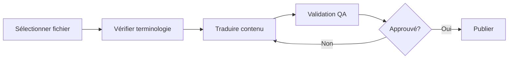
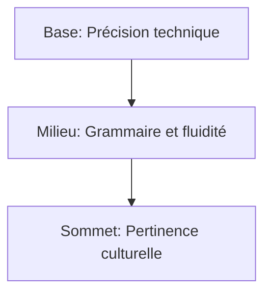

# 🇫🇷 French (fr) Translation Guide

**Version 5.0 - Comprehensive Hack23 Edition**  
*Last Updated: January 2026*

---

## 📋 Quick Reference

| Attribute | Value |
|-----------|-------|
| **Language Code** | `fr` |
| **Locale** | `fr_FR` (France), `fr_CA` (Canada) |
| **Text Direction** | LTR (Left-to-Right) → |
| **Currency** | EUR (€), CAD ($) |
| **Date Format** | `DD/MM/YYYY` or `1er janvier 2026` |

---

## 🔄 Visual Translation Workflow

## 🔄 Quality Standards Pyramid

---

## 📚 Comprehensive Vocabulary Reference

### 🔥 Brand & Key Entities (Never Translate)

| English | French | Notes |
|---------|--------|-------|
| Hack23 | Hack23 | Company name – never translate |
| Hack23 AB | Hack23 AB | Swedish company designation |
| Citizen Intelligence Agency | Citizen Intelligence Agency | Project name – keep English |
| CIA Compliance Manager | CIA Compliance Manager | Product name – keep English |
| Black Trigram | Black Trigram | Game product – keep English |
| 흑괘 | 흑괘 | Korean name for Black Trigram |
| James Pether Sörling | James Pether Sörling | Founder name |
| CISSP | CISSP | Certification |
| CISM | CISM | Certification |
| GitHub | GitHub | Platform name |
| LinkedIn | LinkedIn | Platform name |

### 🏢 Hack23 Business & Services

| English | French | Notes |
|---------|--------|-------|
| Cybersecurity Consulting Sweden | Conseil en cybersécurité en Suède | Main tagline |
| Public ISMS | SMSI public | Core differentiator |
| Security Architecture | Architecture de sécurité | |
| Security Strategy | Stratégie de sécurité | |
| Cloud Security | Sécurité cloud | |
| DevSecOps | DevSecOps | Keep English |
| Secure Development | Développement sécurisé | |
| Code Quality | Qualité du code | |
| Compliance & Regulatory | Conformité et réglementation | |
| Open Source Security | Sécurité open source | |
| Security Culture | Culture de sécurité | |
| Security Training | Formation en sécurité | |
| Full-Stack Security | Sécurité full-stack | |
| Current Practitioner | Praticien actif | Value proposition |
| Transparent Security | Sécurité transparente | |
| Developer-Friendly Security | Sécurité adaptée aux développeurs | |
| OSPO | OSPO | Open Source Program Office |
| Gothenburg | Göteborg | City in Sweden |
| Sweden | Suède | |

### 🎮 Black Trigram Game Vocabulary

| English | French | Notes |
|---------|--------|-------|
| Precision Combat Simulator | Simulateur de combat de précision | |
| Vital Points | Points vitaux | |
| 70 Anatomical Vital Points | 70 points vitaux anatomiques | |
| Fighter Archetypes | Archétypes de combattants | |
| Musa (Warrior) | Musa (Guerrier) | |
| Amsalja (Assassin) | Amsalja (Assassin) | |
| Hacker | Hacker | |
| Jeongbo (Intelligence) | Jeongbo (Renseignement) | |
| Jojik (Organization) | Jojik (Organisation) | |
| Korean Martial Arts | Arts martiaux coréens | |
| Taekkyeon | Taekkyeon | Korean martial art |
| Hapkido | Hapkido | Korean martial art |
| Cultural Preservation | Préservation culturelle | |
| Educational Gaming | Jeux éducatifs | |
| Unity Game | Jeu Unity | |
| Steam | Steam | Platform name |
| itch.io | itch.io | Platform name |

### 🔍 Citizen Intelligence Agency Vocabulary

| English | French | Notes |
|---------|--------|-------|
| Political Transparency | Transparence politique | |
| OSINT Platform | Plateforme OSINT | |
| Parliamentary Monitoring | Surveillance parlementaire | |
| Voting Records | Registres de vote | |
| Accountability Metrics | Métriques de responsabilité | |
| Open Data | Données ouvertes | |
| Civic Technology | Technologie civique | |
| Swedish Parliament | Parlement suédois | |
| Data Visualization | Visualisation de données | |
| Political Analytics | Analytique politique | |

### 🔐 CIA Compliance Manager Vocabulary

| English | French | Notes |
|---------|--------|-------|
| Security Assessment Platform | Plateforme d'évaluation de sécurité | |
| Business Impact Analysis | Analyse d'impact métier | |
| Multi-Framework Compliance | Conformité multi-référentiel | |
| STRIDE Analysis | Analyse STRIDE | Threat model |
| Threat Modeling | Modélisation des menaces | |
| Evidence Collection | Collecte de preuves | |
| Automated Compliance Reporting | Rapports de conformité automatisés | |
| Risk Register | Registre des risques | |
| Controls Monitoring | Surveillance des contrôles | |
| CRA Assessment | Évaluation CRA | Cyber Resilience Act |

### 🍎 Discordian Philosophy & ISMS Blog

| English | French | Notes |
|---------|--------|-------|
| Think for Yourself | Pensez par vous-même | Core motto |
| Question Authority | Questionnez l'autorité | |
| FNORD | FNORD | Never translate |
| Nothing is True | Rien n'est vrai | |
| Everything is Permitted | Tout est permis | |
| Security Theater | Théâtre de sécurité | Fake security |
| Radical Transparency | Transparence radicale | |
| Chapel Perilous | Chapelle périlleuse | Keep English or translate |
| Operation Mindfuck | Operation Mindfuck | Keep English |
| Illuminatus Trilogy | Trilogie des Illuminati | |
| Eris | Éris | Goddess of Chaos |
| Discordia | Discordia | |
| Law of Fives | Loi des Cinq | |
| Sacred Geometry | Géométrie sacrée | |
| Five-Layer Architecture | Architecture à cinq couches | |
| Nation-State Surveillance | Surveillance étatique | |
| Crypto Backdoors | Portes dérobées cryptographiques | |
| Security Through Obscurity | Sécurité par l'obscurité | Anti-pattern |
| Information Hoarding | Rétention d'information | |
| Knowledge Transparency | Transparence du savoir | |
| Simon Moon | Simon Moon | Character reference |
| Hagbard Celine | Hagbard Celine | Character reference |
| George Dorn | George Dorn | Character reference |

### 🧭 Navigation & UI Elements

| English | French |
|---------|--------|
| Home | Accueil |
| About Us | À propos |
| Services | Services |
| Products | Produits |
| Projects | Projets |
| Contact | Contact |
| Blog | Blog |
| Search | Rechercher |
| Menu | Menu |
| Close | Fermer |
| Back | Retour |
| Next | Suivant |
| Previous | Précédent |
| Submit | Soumettre |
| Cancel | Annuler |
| **Expand All** | **Tout développer** |
| **Collapse All** | **Tout réduire** |
| Download | Télécharger |
| Read More | Lire la suite |
| View Details | Voir les détails |
| Privacy Policy | Politique de confidentialité |
| Terms of Service | Conditions d'utilisation |
| Copyright | Droits d'auteur |
| Sitemap | Plan du site |
| FAQ | FAQ |
| Why Hack23 | Pourquoi Hack23 |
| Accessibility Statement | Déclaration d'accessibilité |
| Language | Langue |
| Share | Partager |
| Print | Imprimer |
| Save | Enregistrer |
| Edit | Modifier |
| Delete | Supprimer |
| Confirm | Confirmer |
| Loading | Chargement |
| Error | Erreur |
| Success | Succès |
| Warning | Avertissement |

### 🔐 CIA Triad & Core Security Principles

| English | French | Notes |
|---------|--------|-------|
| CIA Triad | Triade CIA | |
| CIA+ Framework | Framework CIA+ | Extended framework |
| **Confidentiality** | **Confidentialité** | Data protection |
| **Integrity** | **Intégrité** | Data accuracy |
| **Availability** | **Disponibilité** | System uptime |
| Non-Repudiation | Non-répudiation | |
| Authentication | Authentification | |
| Authorization | Autorisation | |

### 🔒 Security & Cybersecurity Terminology

| English | French | Notes |
|---------|--------|-------|
| Cybersecurity | Cybersécurité | |
| Information Security | Sécurité de l'information | |
| ISMS | SMSI (Système de management de la sécurité de l'information) | |
| Security Policy | Politique de sécurité | |
| Risk Management | Gestion des risques | |
| Risk Assessment | Évaluation des risques | |
| Threat | Menace | |
| Vulnerability | Vulnérabilité | |
| Exploit | Exploit | |
| Patch | Correctif | |
| Firewall | Pare-feu | |
| Encryption | Chiffrement | |
| Decryption | Déchiffrement | |
| Access Control | Contrôle d'accès | |
| Multi-Factor Authentication (MFA) | Authentification multi-facteurs | |
| Single Sign-On (SSO) | Authentification unique | |
| Phishing | Hameçonnage | |
| Ransomware | Rançongiciel | |
| Malware | Logiciel malveillant | |
| Zero Trust | Zéro confiance | |
| Defense in Depth | Défense en profondeur | |
| Least Privilege | Moindre privilège | |
| Incident Response | Réponse aux incidents | |
| Data Breach | Violation de données | |
| Penetration Test | Test d'intrusion | |
| Audit | Audit | |
| Compliance | Conformité | |
| Governance | Gouvernance | |
| Security Awareness | Sensibilisation à la sécurité | |
| Backup | Sauvegarde | |
| Disaster Recovery | Reprise après sinistre | |
| Business Continuity | Continuité d'activité | |
| Supply Chain Security | Sécurité de la chaîne d'approvisionnement | |
| SLSA Level 3 | SLSA Niveau 3 | Supply chain security |
| Container Security | Sécurité des conteneurs | |
| Serverless Security | Sécurité serverless | |
| API Security | Sécurité des API | |
| Endpoint Security | Sécurité des terminaux | |

### 🏛️ Regulatory & Standards

| English | French | Notes |
|---------|--------|-------|
| ISO 27001 | ISO 27001 | Keep as-is |
| ISO 27001:2022 | ISO 27001:2022 | |
| GDPR | RGPD (Règlement général sur la protection des données) | EU regulation |
| NIS2 | Directive NIS2 | EU directive |
| NIST CSF | NIST CSF | |
| CIS Controls | Contrôles CIS | |
| SOC2 | SOC2 | |
| HIPAA | HIPAA | US healthcare |
| EU Cyber Resilience Act (CRA) | Règlement européen sur la cyber-résilience | |
| Annex A Controls | Contrôles de l'Annexe A | ISO 27001 |
| Statement of Applicability | Déclaration d'applicabilité | |
| ANSSI | ANSSI | French regulator |
| CNIL | CNIL | French data authority |

### 💼 Business & Professional Terms

| English | French |
|---------|--------|
| Consulting | Conseil |
| Enterprise | Entreprise |
| Strategy | Stratégie |
| Certification | Certification |
| Assessment | Évaluation |
| Implementation | Mise en œuvre |
| Audit | Audit |
| Review | Revue |
| Gap Analysis | Analyse des écarts |
| Roadmap | Feuille de route |
| Best Practices | Bonnes pratiques |
| Case Study | Étude de cas |
| ROI | ROI |
| KPI | KPI / Indicateur clé |
| SLA | SLA / Accord de niveau de service |
| Stakeholder | Partie prenante |
| Deliverable | Livrable |
| Milestone | Jalon |

### 📝 Blog Post Categories

| English | French |
|---------|--------|
| Security Architecture | Architecture de sécurité |
| ISMS Policies | Politiques SMSI |
| Compliance Frameworks | Référentiels de conformité |
| Threat Modeling | Modélisation des menaces |
| Secure Development | Développement sécurisé |
| Cloud Security | Sécurité cloud |
| Access Control | Contrôle d'accès |
| Cryptography | Cryptographie |
| Incident Response | Réponse aux incidents |
| Vulnerability Management | Gestion des vulnérabilités |
| Asset Management | Gestion des actifs |
| Network Security | Sécurité réseau |
| Email Security | Sécurité des emails |
| Physical Security | Sécurité physique |
| Mobile Device Security | Sécurité des appareils mobiles |
| Remote Access Security | Sécurité de l'accès à distance |
| Monitoring & Logging | Surveillance et journalisation |
| Security Metrics | Métriques de sécurité |
| Third Party Risk | Risque tiers |
| Change Management | Gestion du changement |

### 🏭 Industry-Specific Terms

| English | French |
|---------|--------|
| Investment & FinTech | Investissement et FinTech |
| Betting & Gaming | Paris et jeux |
| Cannabis Security | Sécurité du cannabis |
| Healthcare | Santé |
| Government | Secteur public |
| Critical Infrastructure | Infrastructure critique |
| Financial Services | Services financiers |
| E-commerce | Commerce électronique |

---

## ✅ Translation Checklist

- [ ] `<html lang="fr">` attribute set
- [ ] `<title>` translated
- [ ] `<meta name="description">` translated
- [ ] `og:locale` set to `fr_FR`
- [ ] All hreflang tags present (14 languages)
- [ ] Navigation menu translated
- [ ] Footer translated
- [ ] Brand names kept in English
- [ ] French accents used correctly (é, è, ê, à, ç, etc.)
- [ ] Gender agreement verified

---

## 📝 Notes

- Use **formal French** (vous form)
- RGPD is the French term for GDPR
- ANSSI is the French cybersecurity agency
- Many English IT terms are used with French articles
- Pay attention to gender agreement with nouns

---

*23 FNORD 5*
