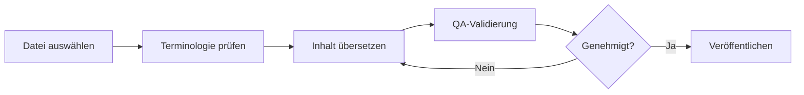
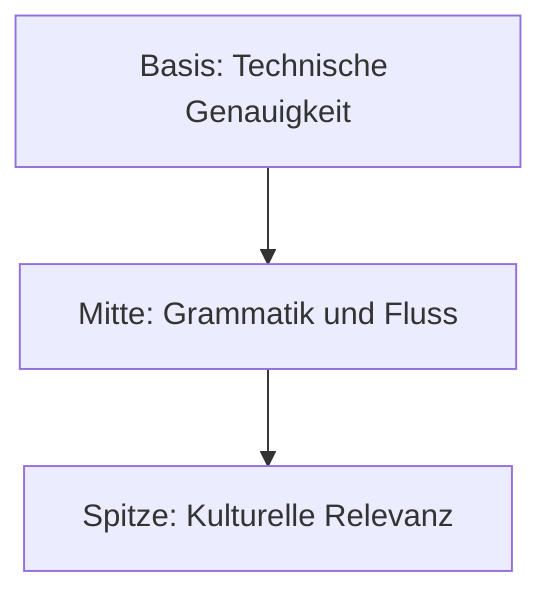

# 🇩🇪 German (de) Translation Guide

**Version 6.0 - Expanded Hack23 Edition**  
*Last Updated: January 2026*

---

## 📋 Quick Reference

| Attribute | Value |
|-----------|-------|
| **Language Code** | `de` |
| **Locale** | `de_DE` (Germany), `de_AT` (Austria), `de_CH` (Switzerland) |
| **Text Direction** | LTR (Left-to-Right) → |
| **Currency** | EUR (€), CHF (Fr.) |
| **Date Format** | `DD.MM.YYYY` or `1. Januar 2026` |

---

## 🔄 Visual Translation Workflow

## 🔄 Quality Standards Pyramid

---

## 📚 Comprehensive Vocabulary Reference

### 🔥 Brand & Key Entities (Never Translate)

| English | German | Notes |
|---------|--------|-------|
| Hack23 | Hack23 | Company name – never translate |
| Hack23 AB | Hack23 AB | Swedish company designation |
| Citizen Intelligence Agency | Citizen Intelligence Agency | Project name – keep English |
| CIA Compliance Manager | CIA Compliance Manager | Product name – keep English |
| Black Trigram | Black Trigram | Game product – keep English |
| 흑괘 | 흑괘 | Korean name for Black Trigram |
| 黑卦 | 黑卦 | Chinese name for Black Trigram |
| James Pether Sörling | James Pether Sörling | Founder name |
| CISSP | CISSP | Certification |
| CISM | CISM | Certification |
| GitHub | GitHub | Platform name |
| LinkedIn | LinkedIn | Platform name |
| OpenSSF | OpenSSF | Open Source Security Foundation |
| CII Best Practices | CII Best Practices | Badge name |
| Riksdag | Riksdag | Swedish Parliament |

### 👔 Job Titles & Professional Roles

| English | German | Notes |
|---------|--------|-------|
| CEO / Chief Executive Officer | CEO / Geschäftsführer | |
| Founder | Gründer | |
| CEO/Founder | CEO/Gründer | |
| Application Security Officer | Anwendungssicherheitsbeauftragter | |
| Information Security Officer | Informationssicherheitsbeauftragter | |
| Senior Security Architect | Senior-Sicherheitsarchitekt | |
| Cloud Architect | Cloud-Architekt | |
| Security Consultant | Sicherheitsberater | |
| CISO | CISO | Chief Information Security Officer |
| Compliance Officer | Compliance-Beauftragter | |
| Risk Manager | Risikomanager | |
| IT Security Manager | IT-Sicherheitsmanager | |
| Security Auditor | Sicherheitsprüfer | |
| Taekwondo Instructor | Taekwondo-Lehrer | |
| System Developer | Systementwickler | |
| Software Engineer | Software-Ingenieur | |
| J2EE Developer | J2EE-Entwickler | |
| Unix Helpdesk | Unix-Helpdesk | |
| Teaching Assistant | Lehrassistent | |
| NBC Defence Group Leader | ABC-Abwehr-Gruppenführer | Military role |

### 🏢 Hack23 Business & Services

| English | German | Notes |
|---------|--------|-------|
| Cybersecurity Consulting Sweden | Cybersicherheitsberatung in Schweden | Main tagline |
| Public ISMS | Öffentliches ISMS | Core differentiator |
| Open ISMS Transparency | Offene ISMS-Transparenz | |
| Security Architecture & Strategy | Sicherheitsarchitektur und -strategie | Service line |
| Cloud Security & DevSecOps | Cloud-Sicherheit und DevSecOps | Service line |
| Secure Development & Code Quality | Sichere Entwicklung und Codequalität | Service line |
| Compliance & Regulatory | Compliance und Regulierung | Service line |
| Open Source Security | Open-Source-Sicherheit | Service line |
| Security Culture & Training | Sicherheitskultur und Schulung | Service line |
| Full-Stack Security | Full-Stack-Sicherheit | |
| Current Practitioner | Aktiver Praktiker | Value proposition |
| Transparent Security | Transparente Sicherheit | |
| Developer-Friendly Security | Entwicklerfreundliche Sicherheit | |
| Security Excellence Through Transparency | Sicherheitsexzellenz durch Transparenz | |
| OSPO | OSPO | Open Source Program Office |
| Gothenburg | Göteborg | City in Sweden |
| Sweden | Schweden | |
| Nordic Region | Nordische Region | |
| Europe | Europa | |
| Singapore | Singapur | |
| ASEAN Region | ASEAN-Region | |

### 🎮 Black Trigram Game Vocabulary

| English | German | Notes |
|---------|--------|-------|
| Precision Combat Simulator | Präzisionskampfsimulator | |
| Vital Points | Vitalpunkte | |
| 70 Anatomical Vital Points | 70 anatomische Vitalpunkte | |
| 70 Techniques | 70 Techniken | |
| Fighter Archetypes | Kämpferarchetypen | |
| Musa (Warrior) | Musa (Krieger) | |
| Amsalja (Assassin) | Amsalja (Assassine) | |
| Hacker | Hacker | |
| Jeongbo (Intelligence) | Jeongbo (Geheimdienst) | |
| Jojik (Organization) | Jojik (Organisation) | |
| Korean Martial Arts | Koreanische Kampfkünste | |
| Taekkyeon | Taekkyeon | Korean martial art |
| Hapkido | Hapkido | Korean martial art |
| Taekwondo | Taekwondo | Korean martial art |
| Song Moo Kwan | Song Moo Kwan | Taekwondo school |
| Kukkiwon | Kukkiwon | World Taekwondo HQ |
| Black Belt | Schwarzgurt | |
| 3rd Dan | 3. Dan | Rank |
| Cultural Preservation | Kulturelle Bewahrung | |
| Educational Gaming | Lernspiele | |
| Unity Game | Unity-Spiel | |
| Steam | Steam | Platform name |
| itch.io | itch.io | Platform name |
| Fighting | Kampf | Game genre |
| Simulation | Simulation | Game genre |
| Educational | Bildung | Game genre |
| Cultural | Kulturell | Game genre |
| Single-player | Einzelspieler | |
| Multiplayer | Mehrspieler | |
| Teen | Jugendliche | Content rating |
| Cross-platform | Plattformübergreifend | |
| Open Source Game | Open-Source-Spiel | |

### 🔍 Citizen Intelligence Agency Vocabulary

| English | German | Notes |
|---------|--------|-------|
| Political Transparency | Politische Transparenz | |
| Political Intelligence Platform | Plattform für politische Aufklärung | |
| OSINT Platform | OSINT-Plattform | |
| Parliamentary Monitoring | Parlamentsüberwachung | |
| Swedish Parliament Monitoring (Riksdag) | Schwedische Parlamentsüberwachung (Riksdag) | |
| Political Decision Tracking | Verfolgung politischer Entscheidungen | |
| Governance Metrics & Rankings | Governance-Metriken und Rankings | |
| Democratic Accountability Analysis | Analyse demokratischer Rechenschaftspflicht | |
| Voting Records | Abstimmungsprotokolle | |
| Voting Pattern Analysis | Analyse von Abstimmungsmustern | |
| Party Performance Metrics | Parteileistungsmetriken | |
| Minister Activity Tracking | Verfolgung von Ministeraktivitäten | |
| Committee Work Analysis | Ausschussarbeitsanalyse | |
| Political Trend Visualization | Visualisierung politischer Trends | |
| Open Data Integration | Integration offener Daten | |
| World Bank | Weltbank | |
| Swedish Government | Schwedische Regierung | |
| Accountability Metrics | Rechenschaftsmetriken | |
| Open Data | Offene Daten | |
| Civic Technology | Bürgertechnologie | |
| Swedish Parliament | Schwedisches Parlament | |
| Data Visualization | Datenvisualisierung | |
| Political Analytics | Politische Analytik | |
| Citizens | Bürger | Audience |
| Journalists | Journalisten | Audience |
| Researchers | Forscher | Audience |
| Policy Analysts | Politikanalysten | Audience |
| Political Scientists | Politikwissenschaftler | Audience |
| Democracy Advocates | Demokratiebefürworter | Audience |
| Parliamentary Process Analysis | Analyse parlamentarischer Prozesse | |
| OSINT Methodology | OSINT-Methodik | |
| Swedish Governance System | Schwedisches Regierungssystem | |
| Data-Driven Political Analysis | Datengestützte politische Analyse | |
| Open Government Data Usage | Nutzung offener Regierungsdaten | |

### 🔐 CIA Compliance Manager Vocabulary

| English | German | Notes |
|---------|--------|-------|
| Security Assessment Platform | Sicherheitsbewertungsplattform | |
| Enterprise Security Management | Unternehmens-Sicherheitsmanagement | |
| CIA Triad Assessment | CIA-Triade-Bewertung | |
| Business Impact Analysis | Geschäftsauswirkungsanalyse | |
| Multi-Framework Compliance | Multi-Framework-Compliance | |
| STRIDE Analysis | STRIDE-Analyse | Threat model |
| Threat Modeling | Bedrohungsmodellierung | |
| Evidence Collection | Beweissammlung | |
| Automated Compliance Reporting | Automatisierte Compliance-Berichterstattung | |
| Risk Register | Risikoregister | |
| Controls Monitoring | Kontrollüberwachung | |
| CRA Assessment | CRA-Bewertung | Cyber Resilience Act |
| Security Level Selection | Auswahl des Sicherheitsniveaus | |
| Cost Estimation | Kostenschätzung | |
| Implementation Guidance | Implementierungsleitfaden | |
| Gap Analysis | Lückenanalyse | |
| Security Visualization | Sicherheitsvisualisierung | |
| Widget-Based Dashboard | Widget-basiertes Dashboard | |
| Availability Impact Analysis | Verfügbarkeits-Auswirkungsanalyse | |
| Integrity Impact Analysis | Integritäts-Auswirkungsanalyse | |
| Confidentiality Impact Analysis | Vertraulichkeits-Auswirkungsanalyse | |
| Open Source Security Tool | Open-Source-Sicherheitstool | |

### 🎓 Education & Learning Terms

| English | German | Notes |
|---------|--------|-------|
| Educational Use | Bildungszweck | |
| Self-Directed Learning | Selbstgesteuertes Lernen | |
| Skill Development | Kompetenzentwicklung | |
| Professional Development | Berufliche Weiterentwicklung | |
| Teaches | Lehrt | Schema.org property |
| Accessibility Features | Barrierefreiheitsfunktionen | |
| Keyboard Navigation | Tastaturnavigation | |
| High Contrast Mode | Hochkontrastmodus | |
| Closed Captions | Untertitel | |
| Screen Reader Compatible | Screenreader-kompatibel | |

### 🍎 Discordian Philosophy & ISMS Blog

| English | German | Notes |
|---------|--------|-------|
| Think for Yourself | Denk selbst | Core motto |
| Question Authority | Hinterfrage Autorität | |
| FNORD | FNORD | Never translate |
| Nothing is True | Nichts ist wahr | |
| Everything is Permitted | Alles ist erlaubt | |
| Security Theater | Sicherheitstheater | Fake security |
| Radical Transparency | Radikale Transparenz | |
| Chapel Perilous | Gefährliche Kapelle | Keep English or translate |
| Operation Mindfuck | Operation Mindfuck | Keep English |
| Illuminatus Trilogy | Illuminatus-Trilogie | |
| Eris | Eris | Goddess of Chaos |
| Discordia | Discordia | |
| Law of Fives | Gesetz der Fünf | |
| Sacred Geometry | Heilige Geometrie | |
| Five-Layer Architecture | Fünfschichtige Architektur | |
| Nation-State Surveillance | Staatliche Überwachung | |
| Crypto Backdoors | Krypto-Hintertüren | |
| Security Through Obscurity | Sicherheit durch Unklarheit | Anti-pattern |
| Information Hoarding | Informationshortung | |
| Knowledge Transparency | Wissenstransparenz | |
| Simon Moon | Simon Moon | Character reference |
| Hagbard Celine | Hagbard Celine | Character reference |
| George Dorn | George Dorn | Character reference |

### 🧭 Navigation & UI Elements

| English | German |
|---------|--------|
| Home | Startseite |
| About Us | Über uns |
| Services | Dienstleistungen |
| Products | Produkte |
| Projects | Projekte |
| Contact | Kontakt |
| Blog | Blog |
| Search | Suche |
| Menu | Menü |
| Close | Schließen |
| Back | Zurück |
| Next | Weiter |
| Previous | Zurück |
| Submit | Absenden |
| Cancel | Abbrechen |
| **Expand All** | **Alle erweitern** |
| **Collapse All** | **Alle einklappen** |
| Download | Herunterladen |
| Read More | Mehr erfahren |
| View Details | Details anzeigen |
| Privacy Policy | Datenschutzrichtlinie |
| Terms of Service | Nutzungsbedingungen |
| Copyright | Urheberrecht |
| Sitemap | Sitemap |
| FAQ | FAQ / Häufige Fragen |
| Why Hack23 | Warum Hack23 |
| Accessibility Statement | Barrierefreiheitserklärung |
| Language | Sprache |
| Share | Teilen |
| Print | Drucken |
| Save | Speichern |
| Edit | Bearbeiten |
| Delete | Löschen |
| Confirm | Bestätigen |
| Loading | Wird geladen |
| Error | Fehler |
| Success | Erfolg |
| Warning | Warnung |

### 🔐 CIA Triad & Core Security Principles

| English | German | Notes |
|---------|--------|-------|
| CIA Triad | CIA-Dreiklang | |
| CIA+ Framework | CIA+-Framework | Extended framework |
| **Confidentiality** | **Vertraulichkeit** | Data protection |
| **Integrity** | **Integrität** | Data accuracy |
| **Availability** | **Verfügbarkeit** | System uptime |
| Non-Repudiation | Nichtabstreitbarkeit | |
| Authentication | Authentifizierung | |
| Authorization | Autorisierung | |

### 🔒 Security & Cybersecurity Terminology

| English | German | Notes |
|---------|--------|-------|
| Cybersecurity | Cybersicherheit | |
| Information Security | Informationssicherheit | |
| ISMS | Informationssicherheits-Managementsystem | |
| Security Policy | Sicherheitsrichtlinie | |
| Risk Management | Risikomanagement | |
| Risk Assessment | Risikobewertung | |
| Threat | Bedrohung | |
| Vulnerability | Schwachstelle | |
| Exploit | Exploit | |
| Patch | Patch / Sicherheitsupdate | |
| Firewall | Firewall | |
| Encryption | Verschlüsselung | |
| Decryption | Entschlüsselung | |
| Access Control | Zugriffskontrolle | |
| Multi-Factor Authentication (MFA) | Multi-Faktor-Authentifizierung | |
| Single Sign-On (SSO) | Single Sign-On | |
| Phishing | Phishing | |
| Ransomware | Ransomware / Erpressungstrojaner | |
| Malware | Schadsoftware | |
| Zero Trust | Zero Trust | |
| Defense in Depth | Verteidigung in der Tiefe | |
| Least Privilege | Minimale Rechte | |
| Incident Response | Incident Response | |
| Data Breach | Datenschutzverletzung | |
| Penetration Test | Penetrationstest | |
| Audit | Audit | |
| Compliance | Compliance | |
| Governance | Governance | |
| Security Awareness | Sicherheitsbewusstsein | |
| Backup | Backup / Datensicherung | |
| Disaster Recovery | Notfallwiederherstellung | |
| Business Continuity | Geschäftskontinuität | |
| Supply Chain Security | Lieferkettensicherheit | |
| SLSA Level 3 | SLSA Stufe 3 | Supply chain security |
| Container Security | Container-Sicherheit | |
| Serverless Security | Serverless-Sicherheit | |
| API Security | API-Sicherheit | |
| Endpoint Security | Endpunktsicherheit | |

### 🏛️ Regulatory & Standards

| English | German | Notes |
|---------|--------|-------|
| ISO 27001 | ISO 27001 | Keep as-is |
| ISO 27001:2022 | ISO 27001:2022 | |
| GDPR | DSGVO (Datenschutz-Grundverordnung) | EU regulation |
| NIS2 | NIS2-Richtlinie | EU directive |
| NIST CSF | NIST CSF | |
| CIS Controls | CIS Controls | |
| SOC2 | SOC2 | |
| HIPAA | HIPAA | US healthcare |
| EU Cyber Resilience Act (CRA) | EU Cyber Resilience Act | |
| Annex A Controls | Anhang-A-Kontrollen | ISO 27001 |
| Statement of Applicability | Erklärung zur Anwendbarkeit | |
| BSI | BSI (Bundesamt für Sicherheit in der Informationstechnik) | German regulator |

### 💼 Business & Professional Terms

| English | German |
|---------|--------|
| Consulting | Beratung |
| Enterprise | Unternehmen |
| Strategy | Strategie |
| Certification | Zertifizierung |
| Assessment | Bewertung |
| Implementation | Implementierung |
| Audit | Audit |
| Review | Überprüfung |
| Gap Analysis | Gap-Analyse |
| Roadmap | Roadmap |
| Best Practices | Best Practices |
| Case Study | Fallstudie |
| ROI | ROI |
| KPI | KPI |
| SLA | SLA |
| Stakeholder | Interessengruppe |
| Deliverable | Liefergegenstand |
| Milestone | Meilenstein |

### 📝 Blog Post Categories

| English | German |
|---------|--------|
| Security Architecture | Sicherheitsarchitektur |
| ISMS Policies | ISMS-Richtlinien |
| Compliance Frameworks | Compliance-Frameworks |
| Threat Modeling | Bedrohungsmodellierung |
| Secure Development | Sichere Entwicklung |
| Cloud Security | Cloud-Sicherheit |
| Access Control | Zugriffskontrolle |
| Cryptography | Kryptographie |
| Incident Response | Incident Response |
| Vulnerability Management | Schwachstellenmanagement |
| Asset Management | Asset-Management |
| Network Security | Netzwerksicherheit |
| Email Security | E-Mail-Sicherheit |
| Physical Security | Physische Sicherheit |
| Mobile Device Security | Mobilgerätesicherheit |
| Remote Access Security | Fernzugriffssicherheit |
| Monitoring & Logging | Überwachung und Protokollierung |
| Security Metrics | Sicherheitsmetriken |
| Third Party Risk | Drittanbieterrisiko |
| Change Management | Änderungsmanagement |

### 🏭 Industry-Specific Terms

| English | German |
|---------|--------|
| Investment & FinTech | Investition und FinTech |
| Betting & Gaming | Wetten und Gaming |
| Cannabis Security | Cannabis-Sicherheit |
| Healthcare | Gesundheitswesen |
| Government | Öffentlicher Sektor |
| Critical Infrastructure | Kritische Infrastruktur |
| Financial Services | Finanzdienstleistungen |
| E-commerce | E-Commerce |

---

## ✅ Translation Checklist

- [ ] `<html lang="de">` attribute set
- [ ] `<title>` translated
- [ ] `<meta name="description">` translated
- [ ] `og:locale` set to `de_DE`
- [ ] All hreflang tags present (14 languages)
- [ ] Navigation menu translated
- [ ] Footer translated
- [ ] Brand names kept in English
- [ ] German compound words formed correctly
- [ ] Noun capitalization correct (all nouns capitalized)
- [ ] Umlauts used correctly (ä, ö, ü, ß)

---

## 📝 Notes

- Use **formal German** (Sie form)
- DSGVO is the German term for GDPR
- BSI is the German cybersecurity authority
- All nouns are capitalized in German
- Compound words are common and written together

---

*23 FNORD 5*
