# 🇩🇪 German Translation Guide 🦅

> **Professional Cybersecurity Translation Guide**  
> *For InfoSec, Cybersecurity, and Discordian Philosophy Documentation*

## 📋 Quick Reference

| Attribute | Value |
|-----------|-------|
| **Language** | German (de) |
| **Flag & Icon** | 🇩🇪 🦅 |
| **Locale** | de_DE |
| **Currency** | EUR (€) |
| **Direction** | LTR (Left-to-Right) → |
| **Files Translated** | 61/96 (63.5%) |
| **Guide Version** | 3.1 (Enhanced Vocabulary Edition)
| **Last Updated** | December 2025 |

## 🎯 Translation Philosophy

### The Discordian Approach to Translation

Translation is not mere word replacement—it's the art of preserving meaning, tone, philosophy, and cultural context while adapting to a new linguistic framework. This guide embodies the Discordian principle: **"Think for Yourself"** — use these guidelines as a starting point, but apply critical thinking and cultural awareness.

### Core Translation Principles

#### 1. 💼 Professional Business Tone
- Write for **C-level executives** and **technical decision-makers**
- Maintain **formal business register** appropriate for cybersecurity consulting
- Balance **technical precision** with **clear communication**
- Use **industry-standard terminology** recognized in German

#### 2. 🎯 Technical Consistency
- **Preserve English terms** where widely accepted internationally:
  - DevSecOps, CI/CD, GitHub, Docker, Kubernetes, API, REST
- **Use established German terminology** for cybersecurity concepts
- **Maintain consistency** across all translated pages
- **Document translation choices** for complex or ambiguous terms

#### 3. 🌍 Cultural Adaptation
- **Adapt examples** to local market context and business practices
- **Reference local regulations**: GDPR, NIS2, and German-specific laws
- **Cite local authorities**: National cybersecurity agencies
- **Adjust humor and references** to cultural norms while preserving Discordian spirit

#### 4. 🎭 Discordian Style Preservation
- **"Think for Yourself"** → Translate philosophy authentically
- **FNORD references** → Preserve where culturally appropriate, adapt if needed
- **"23 FNORD 5"** → Keep signature as cultural marker
- **Philosophical concepts** → Adapt to local philosophical traditions

## 📊 Visual Translation Workflow

```mermaid
%%{init: {'theme':'base', 'themeVariables': {'primaryColor':'#4CAF50','secondaryColor':'#2196F3','tertiaryColor':'#FFC107','fontSize':'14px'}}}%%
graph LR
    subgraph "📚 German Translation Workflow"
        A["🎯 Start<br/>Select File"] --> B["📖 Read Guide<br/>Review Terminology"]
        B --> C["✍️ Translate<br/>Content"]
        C --> D["🔍 QA Check<br/>Validate"]
        D --> E{✅ Pass?}
        E -->|Yes| F["🎉 Complete<br/>Publish"]
        E -->|No| C
        
        style A fill:#2196F3,stroke:#1565C0,color:#fff
        style B fill:#9C27B0,stroke:#6A1B9A,color:#fff
        style C fill:#FF9800,stroke:#F57C00,color:#fff
        style D fill:#00BCD4,stroke:#00838F,color:#fff
        style E fill:#FFC107,stroke:#F57C00,color:#000
        style F fill:#4CAF50,stroke:#2E7D32,color:#fff
    end
```



## 🏆 Quality Standards Pyramid

```mermaid
%%{init: {'theme':'base', 'themeVariables': {'primaryColor':'#4CAF50','fontSize':'14px'}}}%%
graph TB
    subgraph "🏆 German Translation Quality Pyramid"
        A["👑 Excellence<br/>Native Speaker Review"]
        B["✅ Professional<br/>Technical Accuracy"]
        C["📋 Complete<br/>Full Translation"]
        D["🔧 Infrastructure<br/>HTML & Meta Tags"]
        
        D --> C
        C --> B
        B --> A
        
        style A fill:#4CAF50,stroke:#2E7D32,color:#fff,stroke-width:3px
        style B fill:#8BC34A,stroke:#558B2F,color:#fff,stroke-width:2px
        style C fill:#FFC107,stroke:#F57C00,color:#000,stroke-width:2px
        style D fill:#9E9E9E,stroke:#616161,color:#fff
    end
```



## 📚 Comprehensive Terminology Reference


## 📚 Comprehensive Vocabulary Reference

*Extracted from 4 categories of translated content*


### 🧭 Navigation & UI Elements

*Essential interface terms that appear across all pages*


| English | Translation |
|---------|-------------|
| Contact | Kontakt |
| Home | Startseite |
| Products | Produkte |
| Services | Dienstleistungen |
| Why Hack23 | Warum Hack23 |

### 🔒 Security & Cybersecurity Terminology

*Core security concepts and cybersecurity terms*


| English | Translation |
|---------|-------------|
| 1. 🌐 Content Security Policy: Injection Defense | 1. 🌐 Content Sicherheit Policy: Injection Defense |
| 1. 🏢 Context-Aware Security Framework | 1. 🏢 Context-Aware Sicherheit Framework |
| 4. 🔒 Data Protection: Browser Storage Security | 4. 🔒 Datenschutz: Browser Storage Sicherheit |
| Access Control | Zugriffskontrolle |
| Client-Side Security Architecture: Defense Through Simplicity | Client-Side Sicherheit Architektur: Defense Through Simplicity |
| Cloud Security | Cloud-Sicherheit |
| Compliance | Compliance |
| Cybersecurity | Cybersicherheit |
| DevSecOps | DevSecOps |
| GDPR | DSGVO |
| How is the CIA Triad implemented in compliance frameworks? | Wie wird die CIA-Triade in Compliance-Frameworks implementiert? |
| Incident Response | Incident Response |
| ISO 27001 | ISO 27001 |
| Risk Assessment | Risikobewertung |
| Security | Sicherheit |
| The Client-Side Security Advantage | The Client-Side Sicherheit Advantage |
| Threat | Bedrohung |
| Vulnerability | Verwundbarkeit |
| What are common threats to each element of the CIA Triad? | Was sind häufige Bedrohungen für jedes Element der CIA-Triade? |
| What is the CIA Triad in information security? | Was ist die CIA-Triade in der Informationssicherheit? |
| What tools can help with CIA Triad security assessment? | Welche Tools können bei CIA-Triade Sicherheitsbewertung helfen? |
| ☁️ Cloud Security & DevSecOps | ☁️ Cloud-Sicherheit & DevSecOps |
| 🌐 Open Source Security | 🌐 Open Source Sicherheit |
| 🎓 Security Culture & Training | 🎓 Sicherheitskultur & Training |
| 🏗️ Security Architecture & Strategy | 🏗️ Sicherheitsarchitektur & Strategie |
| 📋 Compliance & Regulatory | 📋 Compliance & Regulatorisches |
| 🔑 Security Services | 🔑 Sicherheitsdienste |
| 🔮 Compliance Future: Context-Aware Security & The Pentagon of Adaptive Defense | 🔮 Compliance Zukunft: Context-Aware Sicherheit & The Pentagon of Adaptive Defense |
| 🛡️ Compliance Manager Security: STRIDE Through Five Dimensions | 🛡️ Compliance Manager Sicherheit: STRIDE Through Five Dimensions |
| 🛡️ Security & Quality Standards | 🛡️ Sicherheits- und Qualitätsstandards |

### 💻 Technical Terms & Development

*Technical and development-related vocabulary*


| English | Translation |
|---------|-------------|
| 🔧 Secure Development & Code Quality | 🔧 Sichere Entwicklung & Codequalität |

### 💼 Business & Professional Terms

*Business, consulting, and professional service terms*


| English | Translation |
|---------|-------------|
| Basics | CIA-Triade FAQ \| Informationssicherheit Grundlagen \| Hack23 |
| Choose | Warum Hack23 - Weiterleitung |
| Compliance | Compliance Zukunft \| Context-Aware Sicherheit \| Hack23 |
| Compliance | Compliance Sicherheit \| STRIDE Threat Modeling \| Hack23 |
| Consulting | Warum Hack23 - Weiterleitung |
| Consulting | Cybersecurity Dienste \| Professionelle Sicherheitsberatung \| Hack23 |
| Consulting | Cybersecurity Beratung Schweden \| Öffentliches ISMS \| Hack23 |
| Cybersecurity | Cybersecurity Beratung Schweden \| Öffentliches ISMS \| Hack23 |
| Cybersecurity | Cybersecurity Dienste \| Professionelle Sicherheitsberatung \| Hack23 |
| Cybersecurity | Warum Hack23 - Weiterleitung |
| Future | Compliance Zukunft \| Context-Aware Sicherheit \| Hack23 |
| Information | CIA-Triade FAQ \| Informationssicherheit Grundlagen \| Hack23 |
| ISMS | Warum Hack23 - Weiterleitung |
| ISMS | Cybersecurity Beratung Schweden \| Öffentliches ISMS \| Hack23 |
| Modeling | Compliance Sicherheit \| STRIDE Threat Modeling \| Hack23 |
| Only | Warum Hack23 - Weiterleitung |
| Open | Open Source Projekte \| Sicherheit Durch Transparenz \| Hack23 |
| Professional | Cybersecurity Dienste \| Professionelle Sicherheitsberatung \| Hack23 |
| Projects | Open Source Projekte \| Sicherheit Durch Transparenz \| Hack23 |
| Public | Warum Hack23 - Weiterleitung |
| Public | Cybersecurity Beratung Schweden \| Öffentliches ISMS \| Hack23 |
| Security | CIA-Triade FAQ \| Informationssicherheit Grundlagen \| Hack23 |
| Security | Compliance Zukunft \| Context-Aware Sicherheit \| Hack23 |
| Security | Compliance Sicherheit \| STRIDE Threat Modeling \| Hack23 |
| Security | Open Source Projekte \| Sicherheit Durch Transparenz \| Hack23 |
| Security | Cybersecurity Dienste \| Professionelle Sicherheitsberatung \| Hack23 |
| Services | Cybersecurity Dienste \| Professionelle Sicherheitsberatung \| Hack23 |
| Source | Open Source Projekte \| Sicherheit Durch Transparenz \| Hack23 |
| STRIDE | Compliance Sicherheit \| STRIDE Threat Modeling \| Hack23 |
| Sweden | Cybersecurity Beratung Schweden \| Öffentliches ISMS \| Hack23 |
| Threat | Compliance Sicherheit \| STRIDE Threat Modeling \| Hack23 |
| Through | Open Source Projekte \| Sicherheit Durch Transparenz \| Hack23 |
| Transparency | Open Source Projekte \| Sicherheit Durch Transparenz \| Hack23 |
| Triad | CIA-Triade FAQ \| Informationssicherheit Grundlagen \| Hack23 |
| 🎯 Core Service Areas | 🎯 Kerndienstleistungsbereiche |
| 📋 Service Overview | 📋 Dienstleistungsübersicht |

### 📝 Translation Notes

- **Consistency:** Always use the same translation for repeated terms
- **Context:** Some terms may have multiple valid translations depending on context
- **Updates:** This vocabulary is extracted from actual translated pages as of December 2025
- **Verification:** All translations should be verified by native speakers

### 📊 Additional Common Terms

The following terms appear frequently across translated pages. For comprehensive terminology including cybersecurity-specific terms, regulatory references, and technical vocabulary, please refer to the specific category tables above.

**Translation Principles:**
- ✅ **Consistency is key**: Always use the same translation for a specific English term
- ✅ **Context matters**: Some terms may require different translations in different contexts
- ✅ **Native review**: All translations should be reviewed by native speakers
- ✅ **Real-world validation**: Test translations with target audience feedback

**Update History:**
- **Version 3.1 (December 2025)**: Enhanced with vocabulary extracted from 99 real translated pages
- **Version 3.0 (December 2025)**: Initial comprehensive publication edition


## 🏛️ German Regulatory & Standards Framework

### National Regulatory Bodies

**Data Protection:** Bundesbeauftragte für den Datenschutz  
**Cybersecurity:** BSI  
**Finance:** BaFin  


### International Standards & Frameworks

- **ISO 27001**: Information Security Management System
- **ISO 27002**: Information Security Controls
- **ISO 27005**: Information Security Risk Management
- **ISO 22301**: Business Continuity Management
- **ISO 27035**: Incident Security Management
- **NIST CSF**: Cybersecurity Framework
- **CIS Controls**: Critical Security Controls
- **GDPR**: General Data Protection Regulation (EU)
- **NIS2**: Network and Information Security Directive (EU)

## 🔄 Complete Translation Process

```mermaid
%%{init: {'theme':'base', 'themeVariables': {'primaryColor':'#2196F3','fontSize':'14px'}}}%%
graph TD
    subgraph "🔄 Translation Process Flow"
        Start["🚀 Start Translation"] --> Prep["📋 Preparation<br/>• Read guide<br/>• Review terminology<br/>• Check status file"]
        Prep --> Trans["✍️ Translation<br/>• Copy English file<br/>• Update meta tags<br/>• Translate content"]
        Trans --> QA["🔍 Quality Assurance<br/>• HTML validation<br/>• Hreflang check<br/>• Content review"]
        QA --> Test["🧪 Testing<br/>• Cross-browser<br/>• Mobile responsive<br/>• Accessibility"]
        Test --> Review["👥 Peer Review<br/>• Native speaker<br/>• Technical accuracy<br/>• Cultural fit"]
        Review --> Decision{✅ Approved?}
        Decision -->|Yes| Publish["🎉 Publish<br/>Update status file"]
        Decision -->|No| Revise["📝 Revise<br/>Address feedback"]
        Revise --> Trans
        
        style Start fill:#2196F3,stroke:#1565C0,color:#fff
        style Prep fill:#9C27B0,stroke:#6A1B9A,color:#fff
        style Trans fill:#FF9800,stroke:#F57C00,color:#fff
        style QA fill:#00BCD4,stroke:#00838F,color:#fff
        style Test fill:#FFC107,stroke:#F57C00,color:#000
        style Review fill:#673AB7,stroke:#4527A0,color:#fff
        style Decision fill:#F44336,stroke:#C62828,color:#fff
        style Publish fill:#4CAF50,stroke:#2E7D32,color:#fff
        style Revise fill:#FF5722,stroke:#D84315,color:#fff
    end
```



## ✅ Step-by-Step Translation Workflow

### Step 1: 📋 Preparation & Planning

**Actions:**
1. ✅ Read this entire translation guide thoroughly
2. ✅ Review the `German-Translation-Status.md` file
3. ✅ Identify high-priority files (marked ❌ Missing)
4. ✅ Gather reference materials:
   - Terminology glossaries
   - Previous translations
   - Industry style guides
5. ✅ Set up development environment:
   - Text editor with German language support
   - HTML validator
   - Browser for testing

**Quality Gates:**
- [ ] Guide fully read and understood
- [ ] Priority files identified
- [ ] Reference materials collected
- [ ] Environment configured

### Step 2: ✍️ Translation Execution

**Actions:**
1. ✅ **Copy source file**: `page.html` → `page_de.html`
2. ✅ **Update HTML attributes**:
   ```html
   <html lang="de">
   ```
3. ✅ **Translate meta tags**:
   - `<title>` element
   - `<meta name="description">`
   - `<meta property="og:title">`
   - `<meta property="og:description">`
   - `<meta property="og:locale">` → `de_DE`
4. ✅ **Translate visible content**:
   - Headers and headings
   - Body text and paragraphs
   - Lists and bullet points
   - Buttons and CTAs
   - Form labels and placeholders
5. ✅ **Preserve technical elements**:
   - HTML tags and structure
   - CSS classes and IDs
   - JavaScript code (translate comments only)
   - Code examples (translate only comments)
   - URLs and links
6. ✅ **Update Schema.org**:
   ```json
   {
     "@context": "https://schema.org",
     "inLanguage": "de"
   }
   ```
7. ✅ **Translate navigation & footer**:
   - Menu items
   - Footer links
   - Copyright notice
   - Contact information
8. ✅ **Add hreflang tags** (all 14 variants):
   ```html
   <link rel="alternate" hreflang="x-default" href="...">
   <link rel="alternate" hreflang="en" href="...">
   <link rel="alternate" hreflang="de" href="...">
   <!-- Add all 13 language variants -->
   ```

**Translation Guidelines:**
- 🎯 **Accuracy first**: Technical precision over poetic flow
- 🌍 **Cultural context**: Adapt examples to local market
- 🔄 **Consistency**: Use established terminology from this guide
- 📝 **Documentation**: Note any uncertain translations for review

**Quality Gates:**
- [ ] All visible text translated
- [ ] Meta tags updated
- [ ] HTML structure preserved
- [ ] Schema.org localized
- [ ] Hreflang tags complete

### Step 3: 🔍 Quality Assurance & Validation

**Technical Validation:**
1. ✅ **HTML Validation**: https://validator.w3.org/
   - No errors or warnings
   - Well-formed markup
2. ✅ **Schema.org Validation**: https://validator.schema.org/
   - Structured data correct
   - `inLanguage` set to `de`
3. ✅ **Hreflang Check**:
   - All 14 variants present
   - URLs correct and accessible
   - `x-default` points to English
4. ✅ **Accessibility**:
   - WCAG 2.1 AA compliant
   - Proper heading hierarchy
   - Alt text translated
   - ARIA labels localized

**Content Review:**
1. ✅ **Terminology consistency**:
   - Cross-reference with this guide
   - Check previous translations
   - Verify technical terms
2. ✅ **Grammar & spelling**:
   - Use German spell checker
   - Review sentence structure
   - Check punctuation
3. ✅ **Cultural appropriateness**:
   - Examples relevant to German market
   - Regulatory references correct
   - Humor and idioms adapted
4. ✅ **Discordian preservation**:
   - Philosophy maintained
   - FNORD references handled appropriately
   - "Think for Yourself" spirit intact

**Quality Gates:**
- [ ] HTML valid
- [ ] Schema.org valid
- [ ] Hreflang complete
- [ ] Accessibility compliant
- [ ] Terminology consistent
- [ ] Grammar correct
- [ ] Culturally appropriate

### Step 4: 🧪 Testing & Review

**Browser Testing:**
- ✅ Chrome/Chromium
- ✅ Firefox
- ✅ Safari (if available)
- ✅ Edge

**Device Testing:**
- ✅ Desktop (1920x1080+)
- ✅ Laptop (1366x768)
- ✅ Tablet (768x1024)
- ✅ Mobile (375x667, 414x896)

**Functionality Testing:**
- ✅ All links work
- ✅ Forms function correctly
- ✅ Navigation accessible
- ✅ Search works (if present)
- ✅ Images load properly

**Peer Review:**
1. ✅ **Native speaker review**:
   - Fluency and naturalness
   - Cultural appropriateness
   - Technical accuracy
2. ✅ **Technical review**:
   - Security terminology correct
   - Industry standards referenced properly
   - Compliance requirements met
3. ✅ **Final approval**:
   - All feedback addressed
   - Quality gates passed
   - Ready for publication

**Quality Gates:**
- [ ] Cross-browser tested
- [ ] Mobile responsive
- [ ] Links functional
- [ ] Native speaker approved
- [ ] Technical review passed
- [ ] Final approval obtained

## 🛠️ Technical Implementation Details

### HTML Structure Template

```html
<!DOCTYPE html>
<html lang="de">
<head>
    <meta charset="UTF-8">
    <meta name="viewport" content="width=device-width, initial-scale=1.0">
    
    <!-- Primary Meta Tags -->
    <title>[Page Title in German]</title>
    <meta name="description" content="[Meta description in German]">
    <meta name="keywords" content="[keywords, in, german]">
    
    <!-- Open Graph / Facebook -->
    <meta property="og:type" content="website">
    <meta property="og:url" content="https://hack23.com/[page]_de.html">
    <meta property="og:title" content="[Title in German]">
    <meta property="og:description" content="[Description in German]">
    <meta property="og:locale" content="de_DE">
    
    <!-- Twitter -->
    <meta property="twitter:card" content="summary_large_image">
    <meta property="twitter:url" content="https://hack23.com/[page]_de.html">
    <meta property="twitter:title" content="[Title in German]">
    <meta property="twitter:description" content="[Description in German]">
    
    <!-- Hreflang Tags (All 14 variants) -->
    <link rel="alternate" hreflang="x-default" href="https://hack23.com/[page].html">
    <link rel="alternate" hreflang="en" href="https://hack23.com/[page].html">
    <link rel="alternate" hreflang="de" href="https://hack23.com/[page]_de.html">
    <link rel="alternate" hreflang="sv" href="https://hack23.com/[page]_sv.html">
    <link rel="alternate" hreflang="da" href="https://hack23.com/[page]_da.html">
    <link rel="alternate" hreflang="no" href="https://hack23.com/[page]_no.html">
    <link rel="alternate" hreflang="fi" href="https://hack23.com/[page]_fi.html">
    <link rel="alternate" hreflang="de" href="https://hack23.com/[page]_de.html">
    <link rel="alternate" hreflang="nl" href="https://hack23.com/[page]_nl.html">
    <link rel="alternate" hreflang="fr" href="https://hack23.com/[page]_fr.html">
    <link rel="alternate" hreflang="es" href="https://hack23.com/[page]_es.html">
    <link rel="alternate" hreflang="ja" href="https://hack23.com/[page]_ja.html">
    <link rel="alternate" hreflang="zh" href="https://hack23.com/[page]_zh.html">
    <link rel="alternate" hreflang="ko" href="https://hack23.com/[page]_ko.html">
    <link rel="alternate" hreflang="ar" href="https://hack23.com/[page]_ar.html">
    <link rel="alternate" hreflang="he" href="https://hack23.com/[page]_he.html">
    
    <!-- Canonical -->
    <link rel="canonical" href="https://hack23.com/[page]_de.html">
    
    <!-- Schema.org Structured Data -->
    <script type="application/ld+json">
    {
        "@context": "https://schema.org",
        "@type": "WebPage",
        "name": "[Page Name in German]",
        "description": "[Description in German]",
        "inLanguage": "de",
        "url": "https://hack23.com/[page]_de.html",
        "isPartOf": {
            "@type": "WebSite",
            "name": "Hack23",
            "url": "https://hack23.com",
            "inLanguage": "de"
        },
        "breadcrumb": {
            "@type": "BreadcrumbList",
            "itemListElement": [
                {
                    "@type": "ListItem",
                    "position": 1,
                    "name": "[Home in German]",
                    "item": "https://hack23.com/index_de.html"
                },
                {
                    "@type": "ListItem",
                    "position": 2,
                    "name": "[Page Name in German]",
                    "item": "https://hack23.com/[page]_de.html"
                }
            ]
        }
    }
    </script>
</head>
<body>
    <!-- Translated content here -->
</body>
</html>
```

## 📊 Quality Assurance Standards

### Professional Translation Requirements

**Fluency & Naturalness:**
- ✅ Sounds native, not translated
- ✅ Idiomatic expressions used appropriately
- ✅ Sentence structure follows German norms
- ✅ Flow is smooth and readable

**Technical Accuracy:**
- ✅ Cybersecurity terms correct
- ✅ Technical concepts preserved
- ✅ Industry standards referenced properly
- ✅ No ambiguity in security-critical content

**Cultural Appropriateness:**
- ✅ Examples relevant to German market
- ✅ Regulatory references correct
- ✅ Business context adapted
- ✅ Humor and tone appropriate

**Consistency:**
- ✅ Terminology matches this guide
- ✅ Style consistent across pages
- ✅ Formatting uniform
- ✅ Voice and tone maintained

### Translation Quality Metrics

| Level | Description | Characteristics |
|-------|-------------|-----------------|
| **🏆 Excellence** | Native-quality | Perfect fluency, zero errors, culturally perfect |
| **✅ Professional** | Production-ready | Minor imperfections, technically accurate |
| **⚡ Good** | Usable | Some awkwardness, meaning clear |
| **⚠️  Adequate** | Infrastructure | HTML/meta tags correct, content needs work |
| **❌ Poor** | Needs revision | Errors, unclear meaning, technical issues |

**Target:** ✅ Professional or above for all published content

## 🔍 Validation & Testing Procedures

### Automated Validation Tools

1. **HTML Validator**: https://validator.w3.org/
   - Zero errors required
   - Warnings acceptable if justified

2. **Schema.org Validator**: https://validator.schema.org/
   - All structured data must validate
   - `inLanguage` must be `de`

3. **Hreflang Validator**: Google Search Console
   - All 14 variants must be correct
   - No broken links

4. **Accessibility Checker**: WAVE or axe DevTools
   - WCAG 2.1 AA compliant
   - No critical or serious issues

5. **Lighthouse Audit**: Chrome DevTools
   - Accessibility: 95+ score
   - SEO: 95+ score
   - Best Practices: 90+ score

### Manual Testing Checklist

**Content Review:**
- [ ] All text translated (no English remains)
- [ ] Headers and navigation translated
- [ ] Footer and copyright translated
- [ ] Alt text for images translated
- [ ] Form labels and placeholders translated
- [ ] Error messages translated
- [ ] Meta tags translated

**Technical Review:**
- [ ] HTML well-formed
- [ ] lang="de" set correctly
- [ ] og:locale = de_DE
- [ ] All 14 hreflang tags present
- [ ] Schema.org inLanguage = "de"
- [ ] Canonical URL correct
- [ ] No broken links

**Functionality Review:**
- [ ] All links work
- [ ] Navigation functional
- [ ] Forms submit correctly
- [ ] Search works (if present)
- [ ] Mobile responsive
- [ ] Cross-browser compatible

**Quality Review:**
- [ ] Professional translation quality
- [ ] Terminology consistent with guide
- [ ] Grammar and spelling correct
- [ ] Cultural references appropriate
- [ ] Technical accuracy verified
- [ ] Native speaker approved

## 📝 Best Practices & Guidelines

### Do's ✅

**Translation:**
- ✅ Use this guide's terminology consistently
- ✅ Preserve HTML structure and functionality
- ✅ Test thoroughly before marking complete
- ✅ Document uncertain translation choices
- ✅ Get native speaker review
- ✅ Update guide with new terminology

**Technical:**
- ✅ Validate all HTML and Schema.org
- ✅ Include all 14 hreflang variants
- ✅ Set correct lang and og:locale attributes
- ✅ Test cross-browser and mobile
- ✅ Check accessibility compliance
- ✅ Verify all links work

**Cultural:**
- ✅ Adapt examples to local context
- ✅ Reference local regulations
- ✅ Use culturally appropriate humor
- ✅ Maintain Discordian philosophy
- ✅ Respect cultural sensitivities
- ✅ Balance universal and local

### Don'ts ❌

**Translation:**
- ❌ Use machine translation without review
- ❌ Skip validation and testing
- ❌ Ignore cultural context
- ❌ Use informal or casual language
- ❌ Translate code examples (only comments)
- ❌ Change technical accuracy for flow

**Technical:**
- ❌ Change HTML structure or CSS
- ❌ Remove or modify hreflang tags
- ❌ Skip Schema.org localization
- ❌ Ignore accessibility requirements
- ❌ Break existing functionality
- ❌ Use incorrect lang attributes

**Cultural:**
- ❌ Direct word-for-word translation
- ❌ Use offensive or inappropriate content
- ❌ Ignore local regulations
- ❌ Force English idioms into German
- ❌ Lose Discordian philosophy
- ❌ Over-localize universal concepts

## 📚 Additional Resources & References

### Translation Resources

**German Language:**
- **Dictionary**: [Add recommended German dictionary]
- **Grammar**: [Add German grammar reference]
- **Style Guide**: [Add German business writing guide]

**Cybersecurity Terminology:**
- **NIST Glossary**: https://csrc.nist.gov/glossary
- **ISO 27000 Series**: https://www.iso.org/isoiec-27001-information-security.html
- **SANS Glossary**: https://www.sans.org/security-resources/glossary-of-terms/

**Related Documentation:**
- **Translation Status**: `German-Translation-Status.md`
- **Master Documentation**: `TRANSLATION_DOCUMENTATION_README.md`
- **English Source Files**: `*.html` (base files)
- **German Translation Files**: `*_de.html` (61 files)

### Validation Tools

- **HTML Validator**: https://validator.w3.org/
- **Schema.org Validator**: https://validator.schema.org/
- **Lighthouse**: Chrome DevTools
- **WAVE**: https://wave.webaim.org/
- **axe DevTools**: Browser extension
- **Google Search Console**: Hreflang validation

## 🤝 Contributing to This Guide

### How to Improve This Guide

When adding new translations or discovering better terminology:

1. **Update Terminology Tables**:
   - Replace `*[Verify from files]*` with actual translation
   - Add context and notes where helpful
   - Reference ISO standards or frameworks

2. **Document Translation Choices**:
   - Explain reasoning for complex terms
   - Note regional variations
   - Cite sources if available

3. **Add Examples**:
   - Provide sample translations
   - Show before/after comparisons
   - Highlight common mistakes

4. **Improve Processes**:
   - Suggest workflow improvements
   - Add useful tools or resources
   - Share tips and tricks

5. **Update Status**:
   - Mark files as complete in Translation-Status.md
   - Update file counts and percentages
   - Note quality improvements

### Maintaining Translation Consistency

**Version Control:**
- Document guide version (currently 3.0)
- Note major changes in updates
- Keep changelog of terminology additions

**Team Collaboration:**
- Share translation decisions
- Review each other's work
- Build shared terminology database
- Maintain style consistency

**Continuous Improvement:**
- Learn from feedback
- Update based on user experience
- Incorporate new cybersecurity terms
- Refine cultural adaptations

## 🎓 Discordian Translation Philosophy

### "Think for Yourself" in Practice

This guide provides structure, but **you** are the translator. Apply critical thinking:

- **Question assumptions**: Is this the best German term?
- **Consider context**: What does this mean to a German reader?
- **Preserve intent**: Does my translation convey the original purpose?
- **Adapt wisdom**: How can I make Discordian philosophy resonate in German culture?

### The Five FNORDS of Translation

1. **FNORD of Fidelity**: Stay true to original meaning
2. **FNORD of Fluency**: Sound natural in target language
3. **FNORD of Format**: Preserve technical structure
4. **FNORD of Fun**: Maintain Discordian humor
5. **FNORD of Feedback**: Seek and incorporate review

### Remember

> **"All statements are true in some sense, false in some sense, meaningless in some sense, true and false in some sense, true and meaningless in some sense, false and meaningless in some sense, and true and false and meaningless in some sense."**
> — Principia Discordia

Translation is both art and science. Use this guide wisely, think for yourself, and create excellent German content for the global cybersecurity community.

**23 FNORD 5**

---

## 📋 Quick Reference Summary

**Guide Information:**
- **Language**: German (de)
- **Version**: 3.0 (Publication Edition)
- **Last Updated**: December 2025
- **Files**: 61/96 (63.5%)
- **Status**: ⚠️ In Progress

**Key Attributes:**
- Locale: de_DE
- Direction: LTR →
- Currency: EUR (€)

**Essential Links:**
- Status: `German-Translation-Status.md`
- Documentation: `TRANSLATION_DOCUMENTATION_README.md`
- Files: `*_de.html`

**Contact:**
- Issues: https://github.com/Hack23/homepage/issues
- Discussions: https://github.com/Hack23/homepage/discussions

---

*This guide is part of the Hack23 Open Translation Initiative for Cybersecurity Documentation.*  
*Licensed under Creative Commons BY-SA 4.0 for public use and adaptation.*  
*Contributions welcome via GitHub pull requests.*

**🌍 Making cybersecurity knowledge accessible worldwide, one translation at a time.**
