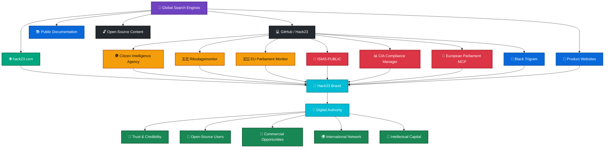
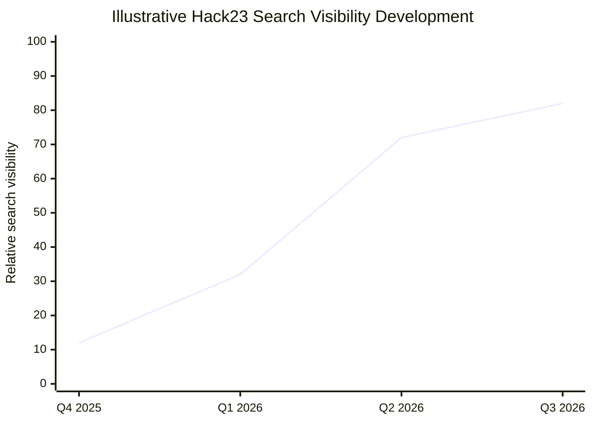
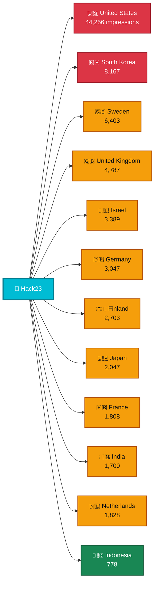
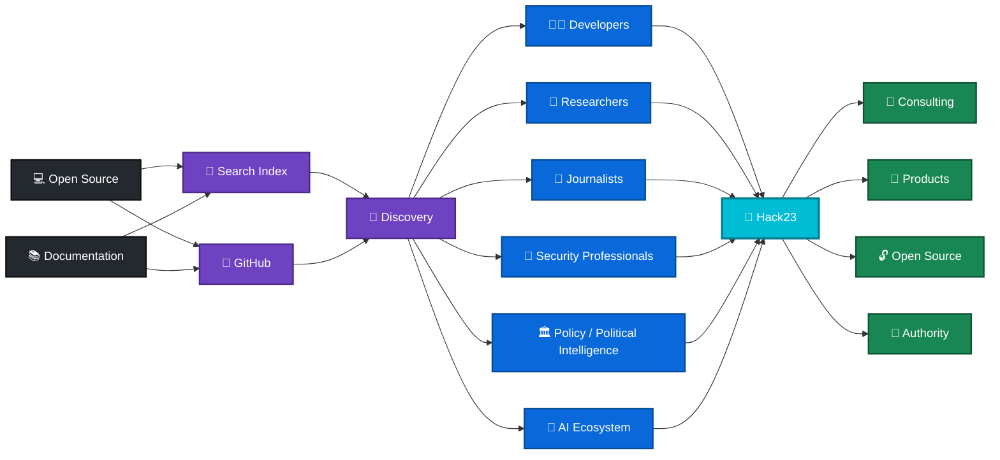
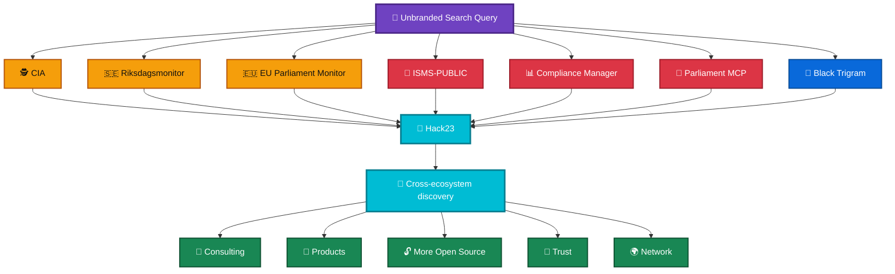
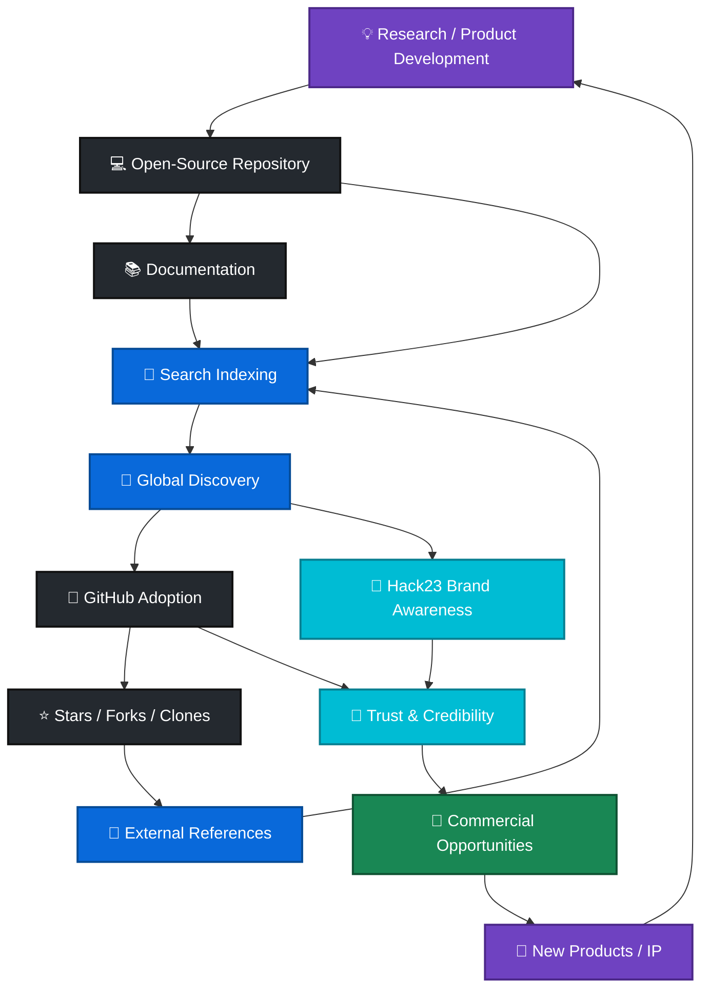
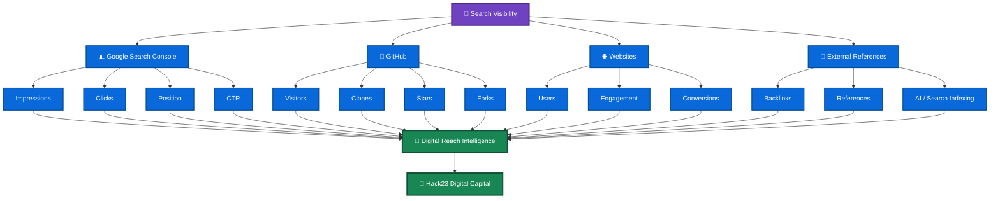
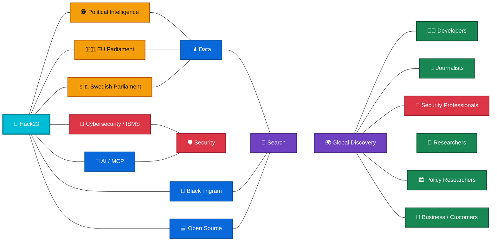
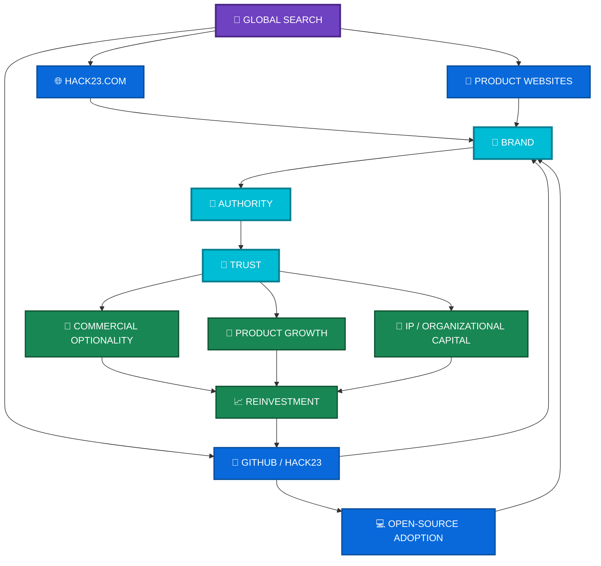

# 🌐 Hack23 Organic Discovery & Digital Reach Intelligence

> **Executive assessment of Hack23's global search visibility, GitHub ecosystem traffic, open-source discovery and digital marketing capital**  
> **Reporting date:** 30 September 2026  
> **Primary evidence:** Google Search Console — `hack23.com`, 12-month period; Hack23 GitHub portfolio traffic metrics; Hack23 digital ecosystem

---

# 🚀 Executive Summary

## Hack23 has evolved from a corporate website into a distributed global digital discovery network

The Google Search Console data for `hack23.com` shows **106,000 Google Search impressions and 816 clicks during the last 12 months**, with an average search position of **13.5**.

However, this represents only **one component of Hack23's actual organic discovery footprint**.

Hack23's open-source repositories are independently indexed by search engines and act as additional discovery surfaces. They generate substantial GitHub activity across software, political intelligence, cybersecurity, compliance, AI/MCP and martial-arts technology.

The strategic picture is therefore better represented as:

> **Google → GitHub → Hack23 → Products / Open Source / Consulting / Authority**

rather than:

> **Google → hack23.com**

This distinction is important when evaluating Hack23's marketing reach, intellectual property, brand development and commercial potential.

---

## 📊 Executive KPI Snapshot

| Dimension | Current evidence | Strategic interpretation |
|---|---:|---|
| 🔎 **Hack23.com Google impressions** | **106K** | Significant organic search visibility |
| 🖱️ **Hack23.com Google clicks** | **816** | Established but still early-stage organic traffic |
| 🎯 **Average CTR** | **0.8%** | Major conversion opportunity |
| 📍 **Average position** | **13.5** | Large page-one ranking opportunity |
| 🇺🇸 **US impressions** | **44,256** | Largest individual search market |
| 🇸🇪 **Swedish clicks** | **143** | Strong domestic engagement |
| 🌎 **International markets** | **10+ significant markets visible** | Global rather than purely Swedish reach |
| 💻 **GitHub portfolio visitors** | **29,406 / 60 days*** | Significant developer discovery |
| 📥 **GitHub portfolio cloners** | **128,488 / 60 days*** | Very substantial software consumption |
| 🧠 **Primary discovery assets** | **7+ major repositories** | Distributed organic acquisition |
| 🏢 **Commercial implication** | Growing | Open-source visibility supports credibility and lead generation |

\* Sum of the previously captured 60-day GitHub metrics across the seven major repositories. **GitHub visitor/cloner statistics are not equivalent to Google traffic and should not be attributed entirely to Google.**

---

# 🧠 The Key Executive Insight

### Hack23's search footprint is larger than its own domain

Google Search Console reports:

```text
hack23.com
    ↓
106,000 impressions
    ↓
816 clicks
```

But Google can also surface:

```text
github.com/Hack23/*
euparliamentmonitor.com
riksdagsmonitor.com
blacktrigram.com
other public Hack23 assets
```

Consequently, **Hack23.com Search Console should be treated as a domain-level KPI rather than a complete measure of Hack23's organic reach**.

The GitHub portfolio provides a second major discovery layer.

---

# 🌐 Hack23 Digital Discovery Architecture



---

# 📈 1. Google Search Performance — Hack23.com

## 12-month performance

| Metric | Result |
|---|---:|
| **Total clicks** | **816** |
| **Total impressions** | **106K** |
| **Average CTR** | **0.8%** |
| **Average position** | **13.5** |

The most important combination is:

> **106K impressions + average position 13.5**

This means Hack23 is already appearing in Google search results at meaningful scale, while a substantial proportion of the opportunity remains outside the first page.

The principal SEO opportunity is therefore **not simply generating more indexed content**.

It is:

1. improving rankings for existing queries;
2. increasing SERP click-through rate;
3. strengthening topical authority;
4. improving search-result presentation;
5. converting search visibility into visits and downstream engagement.

---

# 📈 Search Visibility Trajectory

The 12-month graph shows a substantial change between late 2025 and 2026.

### Earlier period

Search activity was relatively low, with impressions generally remaining at a modest daily baseline.

### 2026

The graph shows a materially higher level of activity, with repeated periods of several hundred impressions per day and significantly larger peaks.

The important strategic signal is therefore **trajectory rather than merely the 12-month aggregate**.



> **Note:** This chart is a strategic visualization of the observed trajectory, not a reconstruction of Google's exact quarterly values.

---

# 🌎 2. International Search Footprint

The country report demonstrates that Hack23's visibility is not confined to Sweden.

## Major markets

| Country | Impressions | Clicks | Approx. CTR |
|---|---:|---:|---:|
| 🇺🇸 United States | **44,256** | **165** | **0.37%** |
| 🇰🇷 South Korea | **8,167** | **79** | **0.97%** |
| 🇸🇪 Sweden | **6,403** | **143** | **2.23%** |
| 🇬🇧 United Kingdom | **4,787** | **12** | **0.25%** |
| 🇮🇱 Israel | **3,389** | **35** | **1.03%** |
| 🇩🇪 Germany | **3,047** | **28** | **0.92%** |
| 🇫🇮 Finland | **2,703** | **22** | **0.81%** |
| 🇯🇵 Japan | **2,047** | **38** | **1.86%** |
| 🇫🇷 France | **1,808** | **32** | **1.77%** |
| 🇮🇳 India | **1,700** | **32** | **1.88%** |
| 🇳🇱 Netherlands | **1,828** | **15** | **0.82%** |
| 🇮🇩 Indonesia | **778** | **15** | **1.93%** |

---

# 🇺🇸 United States — Largest Discovery Market

The United States represents approximately:

**44,256 / 106,000 ≈ 42% of all Hack23.com impressions**

but only:

**165 / 816 ≈ 20% of clicks**

This produces an approximate **0.37% CTR**.

### Interpretation

Google is already exposing Hack23 to a very large US search audience, but that visibility is not yet converting into clicks at the same rate as several other markets.

This creates a substantial opportunity around:

- ranking improvement;
- page titles;
- descriptions;
- search intent;
- technical/security terminology;
- thought-leadership content;
- GitHub-to-website conversion;
- US-oriented search queries.

---

# 🇸🇪 Sweden — Strong Domestic Engagement

Sweden produces:

**6,403 impressions → 143 clicks**

or approximately:

**2.23% CTR**

Sweden therefore generates substantially more clicks per impression than the US.

This is consistent with Hack23's Swedish origin and stronger relevance for Swedish search queries.

It provides a useful domestic base while the international footprint continues to expand.

---

# 🇰🇷 South Korea + 🇯🇵 Japan

South Korea:

**8,167 impressions / 79 clicks**

Japan:

**2,047 impressions / 38 clicks**

Combined:

> **10,214 impressions / 117 clicks**

These markets account for a significant proportion of Hack23's international engagement.

This is particularly interesting because the Hack23 portfolio spans technology, cybersecurity, AI, political intelligence and Black Trigram's Korean martial-arts context.

---

# 🌍 International Search Network



---

# 💻 3. GitHub Is a Second Organic Discovery Engine

The Hack23 GitHub organization should be viewed as a **distributed content and discovery platform**.

The repositories contain:

- source code;
- documentation;
- architecture;
- security controls;
- compliance evidence;
- datasets;
- political intelligence;
- AI/MCP interfaces;
- technical guides;
- project histories;
- structured metadata.

These are all potentially discoverable independently from `hack23.com`.

---

# 📊 GitHub Portfolio Activity

Based on the previously captured 60-day GitHub metrics:

| Repository | Visitors | Cloners |
|---|---:|---:|
| 🕵️ **CIA** | 11,044 | 25,135 |
| 🔐 **ISMS-PUBLIC** | 4,568 | 1,386 |
| 🇸🇪 **Riksdagsmonitor** | 4,029 | 38,498 |
| 🇪🇺 **EU Parliament Monitor** | 3,161 | 15,463 |
| 🥋 **Black Trigram** | 2,832 | 30,066 |
| 📊 **CIA Compliance Manager** | 2,806 | 14,547 |
| 🤖 **European Parliament MCP Server** | 966 | 3,393 |
| **Portfolio total** | **29,406** | **128,488** |

### Important measurement qualification

These are **GitHub's own traffic/activity measurements**.

They should **not** be interpreted as 29,406 Google visitors or 128,488 Google downloads.

The important point is different:

> **Hack23 has a large secondary discovery and consumption surface outside its corporate domain.**

---

# 🧩 4. The Hack23 Open-Source Portfolio Is Also Marketing Infrastructure

Traditional marketing:

```text
Content
   ↓
Google
   ↓
Website
   ↓
Lead
```

Hack23's model is broader:



---

# 🧠 5. Search Discovery Does Not Require "Hack23" Searches

One of the most valuable characteristics of the portfolio is **unbranded discovery**.

A user does not need to search:

> `Hack23`

They might instead search for:

- `Swedish parliament API`
- `Swedish Riksdag data`
- `European Parliament MCP`
- `MCP server European Parliament`
- `ISO 27001 public ISMS`
- `NIST CSF implementation`
- `AI compliance`
- `political intelligence Sweden`
- `parliamentary monitoring`
- `open source political intelligence`
- `cybersecurity compliance tooling`
- `OSINT political data`

and discover a Hack23 repository directly.

That creates **brand discovery without branded search**.

---

# 🕸️ Distributed Brand Discovery



---

# 💎 6. Open Source Creates Multiple Forms of Capital

The GitHub ecosystem should therefore not be viewed purely as an engineering cost center.

It creates several forms of organizational capital simultaneously.

| Capital | Mechanism |
|---|---|
| 💻 **Technical capital** | Source code and architectures |
| 🧠 **Knowledge capital** | Documentation and domain expertise |
| 🔐 **Security capital** | Public security practices and ISMS |
| 🌍 **Marketing capital** | Search and developer discovery |
| 🤝 **Network capital** | Users, contributors, references and links |
| 🏢 **Brand capital** | Association between projects and Hack23 |
| 💎 **IP capital** | Software, data, models and methodologies |
| 🎯 **Commercial capital** | Credibility and potential consulting/product leads |
| 🤖 **AI discoverability capital** | Structured public information consumed by AI/search systems |

---

# 🔄 7. The Hack23 Open-Source Marketing Flywheel



---

# 🎯 8. The Primary SEO Opportunity

The current data suggests three distinct optimization opportunities.

## 🥇 Opportunity A — Ranking

**Average position: 13.5**

A significant amount of existing visibility is close to page one.

Priority:

```text
Positions 11–20
       ↓
Optimize content
       ↓
Strengthen internal links
       ↓
Improve authority
       ↓
Positions 1–10
```

---

## 🥈 Opportunity B — CTR

**Overall CTR: 0.8%**

Search-result optimization should focus on:

- titles;
- descriptions;
- search intent;
- structured data;
- breadcrumbs;
- page hierarchy;
- localized metadata;
- stronger value propositions.

The US is particularly notable:

> **44,256 impressions / 165 clicks / ~0.37% CTR**

There is substantial existing visibility to optimize.

---

## 🥉 Opportunity C — Ecosystem conversion

The objective should not simply be:

> **Google → Hack23.com**

Instead:

> **Google → relevant Hack23 asset → user → ecosystem → Hack23**

For example:

```text
Google
  ↓
Riksdagsmonitor
  ↓
GitHub
  ↓
Hack23
  ↓
CIA / EU Parliament Monitor
  ↓
Security / AI / OSINT ecosystem
```

---

# 🧭 9. Recommended Measurement Model

A conventional SEO dashboard is insufficient for Hack23.

The recommended model is:



---

# 📋 10. Recommended Executive Dashboard

## Monthly

| KPI | Purpose |
|---|---|
| 🔎 Google impressions | Search visibility |
| 🖱️ Google clicks | Organic acquisition |
| 🎯 CTR | SERP effectiveness |
| 📍 Average position | Ranking progress |
| 🌎 Countries | Geographic expansion |
| 💻 GitHub visitors | Developer discovery |
| 📥 GitHub clones | Software consumption |
| ⭐ Stars | Community recognition |
| 🍴 Forks | Ecosystem reuse |
| 🔗 Referring domains | Authority growth |
| 🤖 AI indexing | Machine-discoverability |
| 💼 Commercial referrals | Business conversion |

---

# 🏗️ 11. Strategic Architecture

Hack23's digital presence can increasingly be understood as a **distributed knowledge graph**.



---

# 🚀 12. Strategic Priorities

## 🔵 Priority 1 — Capture existing search demand

Focus on queries where Hack23 already receives impressions but ranks approximately **11–20**.

**Objective:** convert existing visibility into page-one rankings.

---

## 🟣 Priority 2 — Increase SERP CTR

Particularly investigate markets with large impression volumes but low CTR.

**Primary example:**

> 🇺🇸 US — **44K impressions / 0.37% CTR**

Improve:

- titles;
- descriptions;
- structured data;
- page intent;
- internal linking;
- content depth.

---

## 🟢 Priority 3 — Strengthen GitHub ↔ Website relationships

Every major repository should provide clear paths toward:

```text
Repository
   ↓
Documentation
   ↓
Product
   ↓
Hack23
   ↓
Related projects
   ↓
Commercial / professional context
```

This turns GitHub traffic into ecosystem traffic.

---

## 🟠 Priority 4 — Build topical authority

Create interconnected content clusters around:

### 🔐 Cybersecurity

- ISO 27001
- NIST CSF
- CIS Controls
- secure development
- cloud security
- application security
- supply-chain security

### 🤖 AI

- AI governance
- AI security
- MCP
- AI agents
- AI compliance
- AI transparency

### 🏛️ Political Intelligence

- parliamentary monitoring
- OSINT
- political data
- Swedish Riksdag
- European Parliament
- democratic transparency

### 💻 Open Source

- open-source security
- software supply chain
- transparent ISMS
- open-source governance
- developer security

---

# 💎 13. Strategic Interpretation for Hack23

The evidence supports viewing Hack23's digital presence as **organizational capital**, not merely website traffic.

The ecosystem combines:

```text
                 🌍 GLOBAL DISCOVERY
                         │
          ┌──────────────┼──────────────┐
          ↓              ↓              ↓
      🌐 Websites     💻 GitHub      🔎 Search
          │              │              │
          └──────────────┼──────────────┘
                         ↓
                  🧠 KNOWLEDGE
                         ↓
                  🔐 CREDIBILITY
                         ↓
                  🤝 TRUST
                         ↓
          ┌──────────────┼──────────────┐
          ↓              ↓              ↓
       💼 Leads       🚀 Products     💎 IP
```

The important asset is therefore not simply **106K Google impressions**.

It is the accumulation of:

> **code + documentation + search visibility + users + repositories + references + security transparency + political intelligence + AI infrastructure + international reach**

into a single recognizable Hack23 ecosystem.

---

# 📌 Executive Conclusion

## Hack23 is building a distributed organic-growth engine

The latest Google Search Console data demonstrates that **Hack23.com itself has reached 106K annual search impressions**, with visibility increasingly accelerating during 2026.

The **13.5 average position** indicates substantial untapped ranking potential, while the **0.8% CTR** indicates that better SERP positioning and presentation could convert considerably more of the existing visibility into traffic.

At the same time, the Hack23 GitHub portfolio demonstrates that the organization's digital reach extends far beyond its corporate domain, with the seven tracked repositories collectively generating approximately:

> **29,406 GitHub visitors and 128,488 cloners over 60 days**

These GitHub figures are not Google traffic measurements, but they demonstrate the scale of the **secondary discovery, adoption and software-consumption layer** surrounding Hack23.

### The resulting strategic model is:



> ### **Executive takeaway**
> **Hack23's digital growth should no longer be measured as website SEO alone. It is becoming a distributed ecosystem of search-indexed software, documentation, political intelligence, cybersecurity knowledge, AI infrastructure and product properties.**
>
> **The immediate opportunity is to convert the existing global visibility into higher rankings, higher CTR and stronger cross-ecosystem conversion — while preserving the open-source model that generates discovery in the first place.**

---
