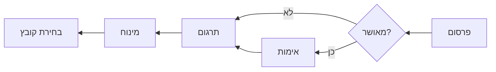
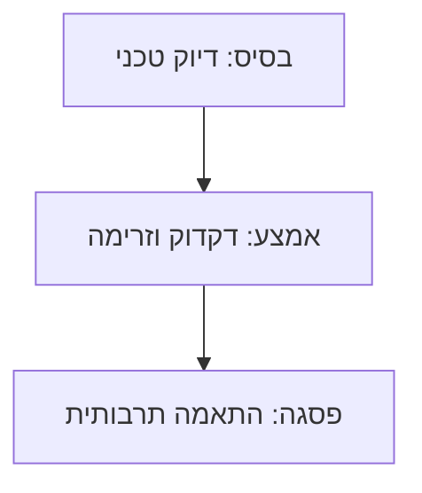

# 🇮🇱 Hebrew (he) Translation Guide

**Version 5.0 - Comprehensive Hack23 Edition**  
*Last Updated: January 2026*

---

## 📋 Quick Reference

| Attribute | Value |
|-----------|-------|
| **Language Code** | `he` |
| **Locale** | `he_IL` |
| **Text Direction** | RTL (Right-to-Left) ← |
| **Currency** | ILS (₪) |
| **Date Format** | `DD/MM/YYYY` or `1 בינואר 2026` |

---

## 🔄 Visual Translation Workflow

## 🔄 Quality Standards Pyramid

---

## 📚 Comprehensive Vocabulary Reference

### 🔥 Brand & Key Entities (Never Translate)

| English | Hebrew | Notes |
|---------|--------|-------|
| Hack23 | Hack23 | Company name – never translate |
| Hack23 AB | Hack23 AB | Swedish company designation |
| Citizen Intelligence Agency | Citizen Intelligence Agency | Project name – keep English |
| CIA Compliance Manager | CIA Compliance Manager | Product name – keep English |
| Black Trigram | Black Trigram | Game product – keep English |
| 흑괘 | 흑괘 | Korean name for Black Trigram |
| James Pether Sörling | James Pether Sörling | Founder name |
| CISSP | CISSP | Certification |
| CISM | CISM | Certification |
| GitHub | GitHub | Platform name |
| LinkedIn | LinkedIn | Platform name |

### 🏢 Hack23 Business & Services

| English | Hebrew | Notes |
|---------|--------|-------|
| Cybersecurity Consulting Sweden | ייעוץ אבטחת סייבר בשוודיה | Main tagline |
| Public ISMS | מערכת ניהול אבטחת מידע ציבורית | Core differentiator |
| Security Architecture | ארכיטקטורת אבטחה | |
| Security Strategy | אסטרטגיית אבטחה | |
| Cloud Security | אבטחת ענן | |
| DevSecOps | DevSecOps | Keep English |
| Secure Development | פיתוח מאובטח | |
| Code Quality | איכות קוד | |
| Compliance & Regulatory | תאימות ורגולציה | |
| Open Source Security | אבטחת קוד פתוח | |
| Security Culture | תרבות אבטחה | |
| Security Training | הדרכות אבטחה | |
| Full-Stack Security | אבטחה מלאה | |
| Current Practitioner | מומחה פעיל | Value proposition |
| Transparent Security | אבטחה שקופה | |
| Developer-Friendly Security | אבטחה ידידותית למפתחים | |
| OSPO | OSPO | Open Source Program Office |
| Gothenburg | גטבורג | City in Sweden |
| Sweden | שוודיה | |

### 🎮 Black Trigram Game Vocabulary

| English | Hebrew | Notes |
|---------|--------|-------|
| Precision Combat Simulator | סימולטור קרב מדויק | |
| Vital Points | נקודות חיוניות | |
| 70 Anatomical Vital Points | 70 נקודות חיוניות אנטומיות | |
| Fighter Archetypes | ארכיטיפים של לוחמים | |
| Musa (Warrior) | מוסא (לוחם) | |
| Amsalja (Assassin) | אמסלג׳ה (מתנקש) | |
| Hacker | האקר | |
| Jeongbo (Intelligence) | ג׳ונגבו (מודיעין) | |
| Jojik (Organization) | ג׳וג׳יק (ארגון) | |
| Korean Martial Arts | אומנויות לחימה קוריאניות | |
| Taekkyeon | טאקיון | Korean martial art |
| Hapkido | הפקידו | Korean martial art |
| Cultural Preservation | שימור תרבותי | |
| Educational Gaming | משחקים חינוכיים | |
| Unity Game | משחק Unity | |
| Steam | Steam | Platform name |
| itch.io | itch.io | Platform name |

### 🔍 Citizen Intelligence Agency Vocabulary

| English | Hebrew | Notes |
|---------|--------|-------|
| Political Transparency | שקיפות פוליטית | |
| OSINT Platform | פלטפורמת OSINT | |
| Parliamentary Monitoring | ניטור פרלמנטרי | |
| Voting Records | רשומות הצבעה | |
| Accountability Metrics | מדדי אחריותיות | |
| Open Data | נתונים פתוחים | |
| Civic Technology | טכנולוגיה אזרחית | |
| Swedish Parliament | הפרלמנט השוודי | |
| Data Visualization | ויזואליזציה של נתונים | |
| Political Analytics | אנליטיקה פוליטית | |

### 🔐 CIA Compliance Manager Vocabulary

| English | Hebrew | Notes |
|---------|--------|-------|
| Security Assessment Platform | פלטפורמת הערכת אבטחה | |
| Business Impact Analysis | ניתוח השפעה עסקית | |
| Multi-Framework Compliance | תאימות רב-מסגרתית | |
| STRIDE Analysis | ניתוח STRIDE | Threat model |
| Threat Modeling | מידול איומים | |
| Evidence Collection | איסוף ראיות | |
| Automated Compliance Reporting | דיווח תאימות אוטומטי | |
| Risk Register | רישום סיכונים | |
| Controls Monitoring | ניטור בקרות | |
| CRA Assessment | הערכת CRA | Cyber Resilience Act |

### 🍎 Discordian Philosophy & ISMS Blog

| English | Hebrew | Notes |
|---------|--------|-------|
| Think for Yourself | חשוב בעצמך | Core motto |
| Question Authority | הטל ספק בסמכות | |
| FNORD | FNORD | Never translate |
| Nothing is True | שום דבר אינו אמת | |
| Everything is Permitted | הכל מותר | |
| Security Theater | תיאטרון אבטחה | Fake security |
| Radical Transparency | שקיפות רדיקלית | |
| Chapel Perilous | הקפלה המסוכנת | Keep English or translate |
| Operation Mindfuck | Operation Mindfuck | Keep English |
| Illuminatus Trilogy | טרילוגיית האילומינטוס | |
| Eris | אריס | Goddess of Chaos |
| Discordia | דיסקורדיה | |
| Law of Fives | חוק החמש | |
| Sacred Geometry | גאומטריה קדושה | |
| Five-Layer Architecture | ארכיטקטורה חמש-שכבתית | |
| Nation-State Surveillance | מעקב מדינתי | |
| Crypto Backdoors | דלתות אחוריות בהצפנה | |
| Security Through Obscurity | אבטחה דרך עמימות | Anti-pattern |
| Information Hoarding | אגירת מידע | |
| Knowledge Transparency | שקיפות ידע | |
| Simon Moon | סיימון מון | Character reference |
| Hagbard Celine | הגברד סלין | Character reference |
| George Dorn | ג׳ורג׳ דורן | Character reference |

### 🧭 Navigation & UI Elements

| English | Hebrew |
|---------|--------|
| Home | עמוד הבית |
| About Us | אודותינו |
| Services | שירותים |
| Products | מוצרים |
| Projects | פרויקטים |
| Contact | צור קשר |
| Blog | בלוג |
| Search | חיפוש |
| Menu | תפריט |
| Close | סגור |
| Back | חזרה |
| Next | הבא |
| Previous | הקודם |
| Submit | שלח |
| Cancel | ביטול |
| **Expand All** | **הרחב הכל** |
| **Collapse All** | **צמצם הכל** |
| Download | הורדה |
| Read More | קרא עוד |
| View Details | הצג פרטים |
| Privacy Policy | מדיניות פרטיות |
| Terms of Service | תנאי שימוש |
| Copyright | זכויות יוצרים |
| Sitemap | מפת אתר |
| FAQ | שאלות נפוצות |
| Why Hack23 | למה Hack23 |
| Accessibility Statement | הצהרת נגישות |
| Language | שפה |
| Share | שתף |
| Print | הדפס |
| Save | שמור |
| Edit | ערוך |
| Delete | מחק |
| Confirm | אשר |
| Loading | טוען |
| Error | שגיאה |
| Success | הצלחה |
| Warning | אזהרה |

### 🔐 CIA Triad & Core Security Principles

| English | Hebrew | Notes |
|---------|--------|-------|
| CIA Triad | שלישיית CIA | |
| CIA+ Framework | מסגרת CIA+ | Extended framework |
| **Confidentiality** | **סודיות** | Data protection |
| **Integrity** | **שלמות** | Data accuracy |
| **Availability** | **זמינות** | System uptime |
| Non-Repudiation | אי-הכחשה | |
| Authentication | אימות | |
| Authorization | הרשאה | |

### 🔒 Security & Cybersecurity Terminology

| English | Hebrew | Notes |
|---------|--------|-------|
| Cybersecurity | אבטחת סייבר | |
| Information Security | אבטחת מידע | |
| ISMS | מערכת ניהול אבטחת מידע | |
| Security Policy | מדיניות אבטחה | |
| Risk Management | ניהול סיכונים | |
| Risk Assessment | הערכת סיכונים | |
| Threat | איום | |
| Vulnerability | פגיעות | |
| Exploit | ניצול | |
| Patch | תיקון אבטחה | |
| Firewall | חומת אש | |
| Encryption | הצפנה | |
| Decryption | פענוח | |
| Access Control | בקרת גישה | |
| Multi-Factor Authentication (MFA) | אימות רב-גורמי | |
| Single Sign-On (SSO) | כניסה יחידה | |
| Phishing | דיוג | |
| Ransomware | כופרה | |
| Malware | נוזקה | |
| Zero Trust | אפס אמון | |
| Defense in Depth | הגנה לעומק | |
| Least Privilege | הרשאה מינימלית | |
| Incident Response | תגובה לאירועים | |
| Data Breach | פריצת נתונים | |
| Penetration Test | בדיקת חדירה | |
| Audit | ביקורת | |
| Compliance | תאימות | |
| Governance | ממשל | |
| Security Awareness | מודעות אבטחה | |
| Backup | גיבוי | |
| Disaster Recovery | התאוששות מאסון | |
| Business Continuity | המשכיות עסקית | |
| Supply Chain Security | אבטחת שרשרת אספקה | |
| SLSA Level 3 | SLSA רמה 3 | Supply chain security |
| Container Security | אבטחת קונטיינרים | |
| Serverless Security | אבטחת Serverless | |
| API Security | אבטחת API | |
| Endpoint Security | אבטחת נקודות קצה | |

### 🏛️ Regulatory & Standards

| English | Hebrew | Notes |
|---------|--------|-------|
| ISO 27001 | ISO 27001 | Keep as-is |
| ISO 27001:2022 | ISO 27001:2022 | |
| GDPR | GDPR / תקנת הגנת הפרטיות האירופית | EU regulation |
| NIS2 | הנחיית NIS2 | EU directive |
| NIST CSF | NIST CSF | |
| CIS Controls | בקרות CIS | |
| SOC2 | SOC2 | |
| HIPAA | HIPAA | US healthcare |
| EU Cyber Resilience Act (CRA) | חוק החוסן הסייברי של האיחוד האירופי | |
| Annex A Controls | בקרות נספח א׳ | ISO 27001 |
| Statement of Applicability | הצהרת ישימות | |
| INCD | מערך הסייבר הלאומי | Israeli regulator |

### 💼 Business & Professional Terms

| English | Hebrew |
|---------|--------|
| Consulting | ייעוץ |
| Enterprise | ארגון |
| Strategy | אסטרטגיה |
| Certification | הסמכה |
| Assessment | הערכה |
| Implementation | יישום |
| Audit | ביקורת |
| Review | סקירה |
| Gap Analysis | ניתוח פערים |
| Roadmap | מפת דרכים |
| Best Practices | שיטות עבודה מומלצות |
| Case Study | מקרה בוחן |
| ROI | החזר השקעה |
| KPI | מדד ביצוע מפתח |
| SLA | הסכם רמת שירות |
| Stakeholder | בעל עניין |
| Deliverable | תוצר |
| Milestone | אבן דרך |

### 📝 Blog Post Categories

| English | Hebrew |
|---------|--------|
| Security Architecture | ארכיטקטורת אבטחה |
| ISMS Policies | מדיניות ISMS |
| Compliance Frameworks | מסגרות תאימות |
| Threat Modeling | מידול איומים |
| Secure Development | פיתוח מאובטח |
| Cloud Security | אבטחת ענן |
| Access Control | בקרת גישה |
| Cryptography | קריפטוגרפיה |
| Incident Response | תגובה לאירועים |
| Vulnerability Management | ניהול פגיעויות |
| Asset Management | ניהול נכסים |
| Network Security | אבטחת רשת |
| Email Security | אבטחת דוא״ל |
| Physical Security | אבטחה פיזית |
| Mobile Device Security | אבטחת מכשירים ניידים |
| Remote Access Security | אבטחת גישה מרחוק |
| Monitoring & Logging | ניטור ורישום |
| Security Metrics | מדדי אבטחה |
| Third Party Risk | סיכוני צד שלישי |
| Change Management | ניהול שינויים |

### 🏭 Industry-Specific Terms

| English | Hebrew |
|---------|--------|
| Investment & FinTech | השקעות ופינטק |
| Betting & Gaming | הימורים וגיימינג |
| Cannabis Security | אבטחת קנאביס |
| Healthcare | בריאות |
| Government | ממשלה |
| Critical Infrastructure | תשתיות קריטיות |
| Financial Services | שירותים פיננסיים |
| E-commerce | מסחר אלקטרוני |

---

## 🔤 RTL-Specific Guidelines

### Technical Requirements
- Set `dir="rtl"` on `<html>` element
- Use CSS `direction: rtl;` for proper text flow
- Mirror UI layouts (navigation, buttons, icons)
- Ensure proper number handling (Western numerals standard)

### Mixed Content Rules
- English terms (brand names, technical acronyms) remain LTR
- Use `<bdo dir="ltr">` or `` for embedded LTR content
- URLs and email addresses remain LTR

### Hebrew-Specific
- Modern Hebrew uses Western numerals
- Geresh (׳) and gershayim (״) for abbreviations
- No capitalization in Hebrew script

---

## ✅ Translation Checklist

- [ ] `<html lang="he" dir="rtl">` attributes set
- [ ] `<title>` translated
- [ ] `<meta name="description">` translated
- [ ] `og:locale` set to `he_IL`
- [ ] All hreflang tags present (14 languages)
- [ ] Navigation menu translated and RTL-aligned
- [ ] Footer translated
- [ ] Brand names kept in English
- [ ] RTL layout verified in browser
- [ ] No broken LTR text fragments

---

## 📝 Notes

- Use **Modern Hebrew** (עברית מודרנית)
- INCD (מערך הסייבר הלאומי) is the Israeli cyber authority
- Keep English technical terms where Hebrew equivalents are unclear
- Test RTL rendering thoroughly before deployment

---

*23 FNORD 5*
