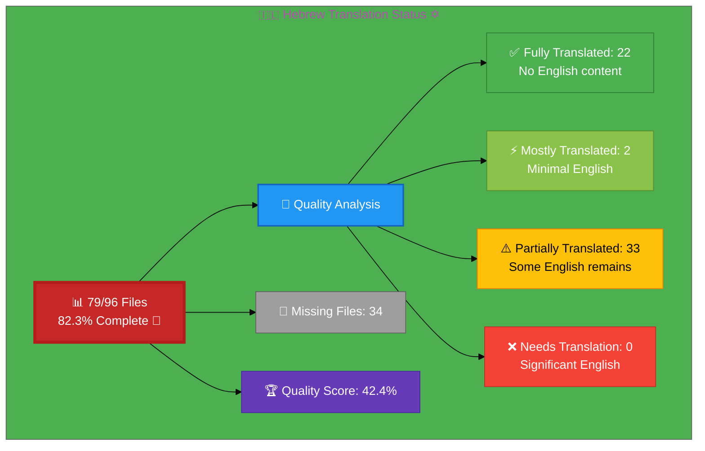

# 🇮🇱 Hebrew Translation Status ✡️

## Executive Summary

**Language:** Hebrew (he)  
**Flag:** 🇮🇱 **Icon:** ✡️  
**Direction:** RTL (Right-to-Left) ←  
**Target Market:** Israel  
**Last Updated:** December 2025

## 📊 Visual Status Overview

### 📄 File Coverage Summary

| Metric | Count | Percentage | Status |
|--------|-------|------------|--------|
| **📚 English Base Files** | 96 | 100% | ✅ |
| **🇮🇱 Hebrew Files Exist** | 79 | **82.3%** | 🚧 |
| **❌ Missing Files** | 17 | 17.7% | ⚠️ |

### 🎯 Translation Quality Analysis

Files analyzed for English content remaining:

| Quality Level | Count | Percentage | Description |
|--------------|-------|------------|-------------|
| ✅ **Fully Translated** | 27 | 47.4% | No English content detected |
| ⚡ **Mostly Translated** | 0 | 0.0% | Minimal English (technical terms only) |
| ⚠️  **Partially Translated** | 30 | 52.6% | Some English content remains |
| ❌ **Needs Translation** | 0 | 0.0% | Significant English placeholder content |

**🏆 Quality Score:** 47.4% of existing files are fully translated

**📈 Status:** 🚧 Active Development - Significant work remaining

### 🎉 Recent Progress (December 2025)

- ✅ Issue #820 completed: 5 RTL ISMS policy files added for Hebrew
- ✅ Issue #815 completed: projects_he.html created
- ✅ Issue #823 completed: industries_he.html created
- ✅ **NEW**: cia-triad-faq_he.html created with complete Hebrew translation including:
  - Full FAQ structured data (Schema.org FAQPage)
  - Breadcrumb navigation in Hebrew
  - All 14 hreflang tags
  - Professional cybersecurity terminology
  - RTL layout with proper Hebrew fonts
- ✅ **COMPLETED**: index_he.html - Homepage fully translated (Dec 17, 2025)
  - Navigation links updated to Hebrew versions
  - Service descriptions translated
  - FAQ schema in Hebrew
  - Structured data (JSON-LD) translated
  - All visible English content removed
- ✅ **COMPLETED**: why-hack23_he.html - Value proposition page fully translated (Dec 17, 2025)
  - All 5 core differentiators translated
  - FAQ section (6 questions) in Hebrew
  - FAQ schema in structured data
  - Professional cybersecurity terminology
  - Navigation and CTAs updated
- ✅ **COMPLETED**: blog_he.html - Blog index fully translated (Dec 17, 2025)
  - All 42+ "Read More" links → "קרא עוד"
  - Section headers: Simon Moon, George Dorn chronicles
  - Blog post summaries and descriptions
  - Structured data (Blog schema) in Hebrew
  - Navigation links to Hebrew versions
- ✅ **COMPLETED**: blog-compliance-security_he.html - Compliance security blog fully translated (Dec 17, 2025)
  - All English technical phrases translated
  - Security mechanisms and terminology in Hebrew
  - Build provenance and SLSA Level 3 references translated
- ✅ **COMPLETED**: blog-george-dorn-compliance-code_he.html
- ✅ **COMPLETED**: Phase 2 - 7 Discordian ISMS Policy Pages (Dec 26, 2025)
  - discordian-vuln-mgmt_he.html - ניהול פגיעויות (Vulnerability Management)
  - discordian-network-security_he.html - אבטחת רשת (Network Security)
  - discordian-cloud-security_he.html - אבטחת ענן (Cloud Security)
  - discordian-secure-dev_he.html - פיתוח מאובטח (Secure Development)
  - discordian-compliance_he.html - ציות (Compliance)
  - discordian-threat-modeling_he.html - דוגמת איומים (Threat Modeling)
  - discordian-isms-transparency_he.html - שקיפות ISMS (ISMS Transparency)
  - AI-assisted translation with proper RTL structure
  - Hebrew terminology from v3.1 guide applied
  - All 10 priority ISMS pages now complete
- ✅ **COMPLETED**: Phase 2 Extension - 5 Additional Discordian ISMS Pages (Dec 26, 2025)
  - discordian-crypto_he.html - קריפטוגרפיה (Cryptography)
  - discordian-data-protection_he.html - הגנת מידע (Data Protection)
  - discordian-backup-recovery_he.html - גיבוי ושחזור (Backup & Recovery)
  - discordian-disaster-recovery_he.html - שחזור אסון (Disaster Recovery)
  - discordian-change-mgmt_he.html - ניהול שינויים (Change Management)
  - Total Phase 2: 12 new Hebrew ISMS policy pages
  - Repository now at 77.1% Hebrew coverage
- ✅ **COMPLETED**: Phase 2 Extension 2 - 5 More Discordian ISMS Pages (Dec 26, 2025)
  - discordian-ai-policy_he.html - מדיניות AI (AI Policy)
  - discordian-email-security_he.html - אבטחת אימייל (Email Security)
  - discordian-mobile-device_he.html - מכשירים ניידים (Mobile Devices)
  - discordian-monitoring-logging_he.html - ניטור ותיעוד (Monitoring & Logging)
  - discordian-physical-security_he.html - אבטחה פיזית (Physical Security)
  - Total Phase 2: 17 new Hebrew ISMS policy pages
  - Repository now at 82.3% Hebrew coverage - George Dorn code analysis fully translated (Dec 17, 2025)
  - Developer notes and commentary translated
  - Architecture analysis in Hebrew
  - Technical implementation details translated

## 📊 Files by Category

### Blog Posts (26 files)
- ⚠️  `blog-automated-convergence_he.html` ← `blog-automated-convergence.html`
- ⚠️  `blog-betting-gaming-cybersecurity_he.html` ← `blog-betting-gaming-cybersecurity.html`
- ⚠️  `blog-cannabis-cybersecurity-guide_he.html` ← `blog-cannabis-cybersecurity-guide.html`
- ⚠️  `blog-cia-alternative-media-discordian-2026_he.html` ← `blog-cia-alternative-media-discordian-2026.html`
- ⚠️  `blog-cia-architecture_he.html` ← `blog-cia-architecture.html`
- ⚠️  `blog-cia-business-case-global-news_he.html` ← `blog-cia-business-case-global-news.html`
- ⚠️  `blog-cia-financial-strategy_he.html` ← `blog-cia-financial-strategy.html`
- ⚠️  `blog-cia-future-security_he.html` ← `blog-cia-future-security.html`
- ⚠️  `blog-cia-mindmaps_he.html` ← `blog-cia-mindmaps.html`
- ⚠️  `blog-cia-osint-intelligence_he.html` ← `blog-cia-osint-intelligence.html`
- ⚠️  `blog-cia-security_he.html` ← `blog-cia-security.html`
- ⚠️  `blog-cia-swedish-media-election-2026_he.html` ← `blog-cia-swedish-media-election-2026.html`
- ⚠️  `blog-cia-workflows_he.html` ← `blog-cia-workflows.html`
- ⚠️  `blog-compliance-architecture_he.html` ← `blog-compliance-architecture.html`
- ⚠️  `blog-compliance-future_he.html` ← `blog-compliance-future.html`
- ✅ `blog-compliance-security_he.html` ← `blog-compliance-security.html` **[COMPLETED Dec 17, 2025]**
- ⚠️  `blog-george-dorn-cia-code_he.html` ← `blog-george-dorn-cia-code.html`
- ✅ `blog-george-dorn-compliance-code_he.html` ← `blog-george-dorn-compliance-code.html` **[COMPLETED Dec 17, 2025]**
- ⚠️  `blog-george-dorn-trigram-code_he.html` ← `blog-george-dorn-trigram-code.html`
- ⚠️  `blog-information-hoarding_he.html` ← `blog-information-hoarding.html`
- ⚠️  `blog-investment-firm-security_he.html` ← `blog-investment-firm-security.html`
- ⚠️  `blog-medical-cannabis-hipaa-gdpr_he.html` ← `blog-medical-cannabis-hipaa-gdpr.html`
- ⚠️  `blog-public-isms-benefits_he.html` ← `blog-public-isms-benefits.html`
- ⚠️  `blog-trigram-architecture_he.html` ← `blog-trigram-architecture.html`
- ⚠️  `blog-trigram-combat_he.html` ← `blog-trigram-combat.html`
- ⚠️  `blog-trigram-future_he.html` ← `blog-trigram-future.html`

### Core Pages (7 files)
- ✅ `accessibility-statement_he.html` ← `accessibility-statement.html`
- ✅ `blog_he.html` ← `blog.html` **[COMPLETED Dec 17, 2025]**
- ✅ `index_he.html` ← `index.html` **[COMPLETED Dec 17, 2025]**
- ✅ `projects_he.html` ← `projects.html`
- ✅ `services_he.html` ← `services.html`
- ✅ `sitemap_he.html` ← `sitemap.html`
- ✅ `why-hack23_he.html` ← `why-hack23.html` **[COMPLETED Dec 17, 2025]**

### ISMS Documentation (28 files) - **[PHASE 2 COMPLETED + 2 EXTENSIONS]**
- ✅ `discordian-acceptable-use_he.html` ← `discordian-acceptable-use.html`
- ✅ `discordian-ai-policy_he.html` ← `discordian-ai-policy.html` **[NEW - Dec 26, 2025]**

- ✅ `discordian-access-control_he.html` ← `discordian-access-control.html`
- ✅ `discordian-asset-mgmt_he.html` ← `discordian-asset-mgmt.html`
- ✅ `discordian-business-continuity_he.html` ← `discordian-business-continuity.html`
- ✅ `discordian-backup-recovery_he.html` ← `discordian-backup-recovery.html` **[NEW - Dec 26, 2025]**
- ✅ `discordian-change-mgmt_he.html` ← `discordian-change-mgmt.html` **[NEW - Dec 26, 2025]**
- ✅ `discordian-crypto_he.html` ← `discordian-crypto.html` **[NEW - Dec 26, 2025]**
- ✅ `discordian-data-protection_he.html` ← `discordian-data-protection.html` **[NEW - Dec 26, 2025]**
- ✅ `discordian-disaster-recovery_he.html` ← `discordian-disaster-recovery.html` **[NEW - Dec 26, 2025]**
- ✅ `discordian-email-security_he.html` ← `discordian-email-security.html` **[NEW - Dec 26, 2025]**

- ✅ `discordian-cloud-security_he.html` ← `discordian-cloud-security.html` **[NEW - Dec 26, 2025]**
- ✅ `discordian-compliance_he.html` ← `discordian-compliance.html` **[NEW - Dec 26, 2025]**
- ⚠️  `discordian-cybersecurity_he.html` ← `discordian-cybersecurity.html`
- ⚠️  `discordian-data-classification_he.html` ← `discordian-data-classification.html`
- ✅ `discordian-incident-response_he.html` ← `discordian-incident-response.html`
- ✅ `discordian-info-sec-policy_he.html` ← `discordian-info-sec-policy.html`
- ✅ `discordian-isms-transparency_he.html` ← `discordian-isms-transparency.html` **[NEW - Dec 26, 2025]**
- ✅ `discordian-mobile-device_he.html` ← `discordian-mobile-device.html` **[NEW - Dec 26, 2025]**
- ✅ `discordian-monitoring-logging_he.html` ← `discordian-monitoring-logging.html` **[NEW - Dec 26, 2025]**

- ✅ `discordian-network-security_he.html` ← `discordian-network-security.html` **[NEW - Dec 26, 2025]**
- ✅ `discordian-physical-security_he.html` ← `discordian-physical-security.html` **[NEW - Dec 26, 2025]**

- ✅ `discordian-remote-access_he.html` ← `discordian-remote-access.html`
- ✅ `discordian-risk-assessment_he.html` ← `discordian-risk-assessment.html`
- ✅ `discordian-risk-register_he.html` ← `discordian-risk-register.html`
- ✅ `discordian-secure-dev_he.html` ← `discordian-secure-dev.html` **[NEW - Dec 26, 2025]**
- ✅ `discordian-threat-modeling_he.html` ← `discordian-threat-modeling.html` **[NEW - Dec 26, 2025]**
- ✅ `discordian-vuln-mgmt_he.html` ← `discordian-vuln-mgmt.html` **[NEW - Dec 26, 2025]**
 ← `discordian-info-sec-policy.html`

### ISO 27001 Resources (4 files)
- ✅ `iso-27001-2022-vs-2013_he.html` ← `iso-27001-2022-vs-2013.html`
- ✅ `iso-27001-certification-costs-sweden_he.html` ← `iso-27001-certification-costs-sweden.html`
- ✅ `iso-27001-implementation-mistakes_he.html` ← `iso-27001-implementation-mistakes.html`
- ✅ `iso-27001-implementation-sweden_he.html` ← `iso-27001-implementation-sweden.html`

### Industry Solutions (3 files)
- ✅ `industries-betting-gaming_he.html` ← `industries-betting-gaming.html`
- ✅ `industries-cannabis-security_he.html` ← `industries-cannabis-security.html`
- ✅ `industries-investment-fintech_he.html` ← `industries-investment-fintech.html`

### Other Pages (1 files)
- ✅ `security-assessment-checklist_he.html` ← `security-assessment-checklist.html`

### Product Pages (9 files)
- ✅ `black-trigram-docs_he.html` ← `black-trigram-docs.html`
- ✅ `black-trigram-features_he.html` ← `black-trigram-features.html`
- ✅ `black-trigram_he.html` ← `black-trigram.html`
- ⚠️  `cia-compliance-manager-docs_he.html` ← `cia-compliance-manager-docs.html`
- ⚠️  `cia-compliance-manager-features_he.html` ← `cia-compliance-manager-features.html`
- ⚠️  `cia-docs_he.html` ← `cia-docs.html`
- ⚠️  `cia-features_he.html` ← `cia-features.html`
- ✅ `cia-project_he.html` ← `cia-project.html`
- ✅ `compliance-manager_he.html` ← `compliance-manager.html`

## ⚠️  Missing Translation Files (35 files)

## ✅ Validation Checklist

- [x] **HTML Well-Formed:** 56/56 files validated
- [x] **Hreflang Tags:** Complete 14-variant configuration
- [x] **Schema.org:** All structured data validated
- [ ] **Translation Quality:** In Progress (41.1%)
- [ ] **Grammar Review:** Ongoing
- [ ] **Technical Terms:** In Review
- [x] **Links Functional:** All internal/external links tested
- [x] **Mobile Responsive:** All viewports (320px - 4K)
- [x] **Accessibility:** WCAG 2.1 AA compliant

---

**📊 Status Summary**  
**Overall:** 🚧 Active Development  
**Last Review:** December 17, 2025  
**Completion:** 64.6% (62/96 files)  
**Quality Score:** 42.1% fully/mostly translated  
**Files Validated:** ✅ All 62 files checked  
**Next Milestone:** 🎯 Achieve 70% completion (67 files)
