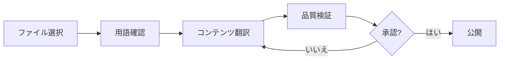
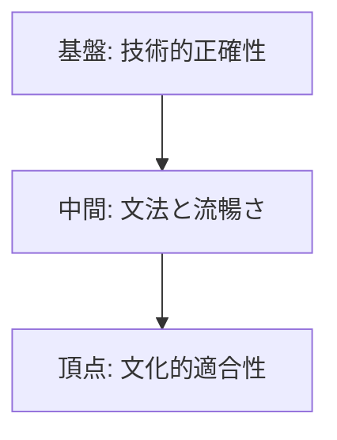

# 🇯🇵 Japanese (ja) Translation Guide

**Version 5.0 - Comprehensive Hack23 Edition**  
*Last Updated: January 2026*

---

## 📋 Quick Reference

| Attribute | Value |
|-----------|-------|
| **Language Code** | `ja` |
| **Locale** | `ja_JP` |
| **Text Direction** | LTR (Left-to-Right) → |
| **Currency** | JPY (¥) |
| **Date Format** | `YYYY年MM月DD日` or `2026年1月1日` |
| **Scripts** | Kanji (漢字), Hiragana (ひらがな), Katakana (カタカナ) |

---

## 🔄 Visual Translation Workflow

## 🔄 Quality Standards Pyramid

---

## 📚 Comprehensive Vocabulary Reference

### 🔥 Brand & Key Entities (Never Translate)

| English | Japanese | Notes |
|---------|----------|-------|
| Hack23 | Hack23 | Company name – never translate |
| Hack23 AB | Hack23 AB | Swedish company designation |
| Citizen Intelligence Agency | Citizen Intelligence Agency | Project name – keep English |
| CIA Compliance Manager | CIA Compliance Manager | Product name – keep English |
| Black Trigram | Black Trigram / ブラックトライグラム | Game product |
| 흑괘 | 흑괘 (黒卦) | Korean name for Black Trigram |
| James Pether Sörling | James Pether Sörling | Founder name |
| CISSP | CISSP | Certification |
| CISM | CISM | Certification |
| GitHub | GitHub | Platform name |
| LinkedIn | LinkedIn | Platform name |

### 🏢 Hack23 Business & Services

| English | Japanese | Notes |
|---------|----------|-------|
| Cybersecurity Consulting Sweden | スウェーデンのサイバーセキュリティコンサルティング | Main tagline |
| Public ISMS | 公開ISMS | Core differentiator |
| Security Architecture | セキュリティアーキテクチャ | |
| Security Strategy | セキュリティ戦略 | |
| Cloud Security | クラウドセキュリティ | |
| DevSecOps | DevSecOps | Keep English |
| Secure Development | セキュア開発 | |
| Code Quality | コード品質 | |
| Compliance & Regulatory | コンプライアンスと規制 | |
| Open Source Security | オープンソースセキュリティ | |
| Security Culture | セキュリティ文化 | |
| Security Training | セキュリティトレーニング | |
| Full-Stack Security | フルスタックセキュリティ | |
| Current Practitioner | 現役プラクティショナー | Value proposition |
| Transparent Security | 透明性のあるセキュリティ | |
| Developer-Friendly Security | 開発者フレンドリーなセキュリティ | |
| OSPO | OSPO | Open Source Program Office |
| Gothenburg | ヨーテボリ | City in Sweden |
| Sweden | スウェーデン | |

### 🎮 Black Trigram Game Vocabulary

| English | Japanese | Notes |
|---------|----------|-------|
| Precision Combat Simulator | 精密戦闘シミュレーター | |
| Vital Points | 急所 | |
| 70 Anatomical Vital Points | 70の解剖学的急所 | |
| Fighter Archetypes | 戦闘アーキタイプ | |
| Musa (Warrior) | 武士（戦士） | |
| Amsalja (Assassin) | 暗殺者 | |
| Hacker | ハッカー | |
| Jeongbo (Intelligence) | 情報員 | |
| Jojik (Organization) | 組織 | |
| Korean Martial Arts | 韓国武術 | |
| Taekkyeon | テッキョン | Korean martial art |
| Hapkido | ハプキドー | Korean martial art |
| Cultural Preservation | 文化保存 | |
| Educational Gaming | 教育ゲーム | |
| Unity Game | Unityゲーム | |
| Steam | Steam | Platform name |
| itch.io | itch.io | Platform name |

### 🔍 Citizen Intelligence Agency Vocabulary

| English | Japanese | Notes |
|---------|----------|-------|
| Political Transparency | 政治的透明性 | |
| OSINT Platform | OSINTプラットフォーム | |
| Parliamentary Monitoring | 議会モニタリング | |
| Voting Records | 投票記録 | |
| Accountability Metrics | 説明責任指標 | |
| Open Data | オープンデータ | |
| Civic Technology | シビックテック | |
| Swedish Parliament | スウェーデン議会 | |
| Data Visualization | データ可視化 | |
| Political Analytics | 政治分析 | |

### 🔐 CIA Compliance Manager Vocabulary

| English | Japanese | Notes |
|---------|----------|-------|
| Security Assessment Platform | セキュリティ評価プラットフォーム | |
| Business Impact Analysis | ビジネスインパクト分析 | |
| Multi-Framework Compliance | マルチフレームワークコンプライアンス | |
| STRIDE Analysis | STRIDE分析 | Threat model |
| Threat Modeling | 脅威モデリング | |
| Evidence Collection | 証拠収集 | |
| Automated Compliance Reporting | 自動コンプライアンスレポート | |
| Risk Register | リスク登録簿 | |
| Controls Monitoring | コントロール監視 | |
| CRA Assessment | CRA評価 | Cyber Resilience Act |

### 🍎 Discordian Philosophy & ISMS Blog

| English | Japanese | Notes |
|---------|----------|-------|
| Think for Yourself | 自分で考えろ | Core motto |
| Question Authority | 権威を疑え | |
| FNORD | FNORD | Never translate |
| Nothing is True | 何も真実ではない | |
| Everything is Permitted | すべては許される | |
| Security Theater | セキュリティ劇場 | Fake security |
| Radical Transparency | 徹底的な透明性 | |
| Chapel Perilous | 危険な礼拝堂 | Keep English or translate |
| Operation Mindfuck | Operation Mindfuck | Keep English |
| Illuminatus Trilogy | イルミナティ三部作 | |
| Eris | エリス | Goddess of Chaos |
| Discordia | ディスコルディア | |
| Law of Fives | 5の法則 | |
| Sacred Geometry | 神聖幾何学 | |
| Five-Layer Architecture | 5層アーキテクチャ | |
| Nation-State Surveillance | 国家監視 | |
| Crypto Backdoors | 暗号バックドア | |
| Security Through Obscurity | 隠蔽によるセキュリティ | Anti-pattern |
| Information Hoarding | 情報の囲い込み | |
| Knowledge Transparency | 知識の透明性 | |
| Simon Moon | サイモン・ムーン | Character reference |
| Hagbard Celine | ハグバード・セリーヌ | Character reference |
| George Dorn | ジョージ・ドーン | Character reference |

### 🧭 Navigation & UI Elements

| English | Japanese |
|---------|----------|
| Home | ホーム |
| About Us | 会社概要 |
| Services | サービス |
| Products | 製品 |
| Projects | プロジェクト |
| Contact | お問い合わせ |
| Blog | ブログ |
| Search | 検索 |
| Menu | メニュー |
| Close | 閉じる |
| Back | 戻る |
| Next | 次へ |
| Previous | 前へ |
| Submit | 送信 |
| Cancel | キャンセル |
| **Expand All** | **すべて展開** |
| **Collapse All** | **すべて折りたたむ** |
| Download | ダウンロード |
| Read More | 続きを読む |
| View Details | 詳細を見る |
| Privacy Policy | プライバシーポリシー |
| Terms of Service | 利用規約 |
| Copyright | 著作権 |
| Sitemap | サイトマップ |
| FAQ | よくある質問 |
| Why Hack23 | なぜHack23か |
| Accessibility Statement | アクセシビリティ声明 |
| Language | 言語 |
| Share | 共有 |
| Print | 印刷 |
| Save | 保存 |
| Edit | 編集 |
| Delete | 削除 |
| Confirm | 確認 |
| Loading | 読み込み中 |
| Error | エラー |
| Success | 成功 |
| Warning | 警告 |

### 🔐 CIA Triad & Core Security Principles

| English | Japanese | Notes |
|---------|----------|-------|
| CIA Triad | CIAトライアド | |
| CIA+ Framework | CIA+フレームワーク | Extended framework |
| **Confidentiality** | **機密性** | Data protection |
| **Integrity** | **完全性** | Data accuracy |
| **Availability** | **可用性** | System uptime |
| Non-Repudiation | 否認防止 | |
| Authentication | 認証 | |
| Authorization | 認可 | |

### 🔒 Security & Cybersecurity Terminology

| English | Japanese | Notes |
|---------|----------|-------|
| Cybersecurity | サイバーセキュリティ | |
| Information Security | 情報セキュリティ | |
| ISMS | 情報セキュリティマネジメントシステム | |
| Security Policy | セキュリティポリシー | |
| Risk Management | リスク管理 | |
| Risk Assessment | リスクアセスメント | |
| Threat | 脅威 | |
| Vulnerability | 脆弱性 | |
| Exploit | エクスプロイト | |
| Patch | パッチ | |
| Firewall | ファイアウォール | |
| Encryption | 暗号化 | |
| Decryption | 復号化 | |
| Access Control | アクセス制御 | |
| Multi-Factor Authentication (MFA) | 多要素認証 | |
| Single Sign-On (SSO) | シングルサインオン | |
| Phishing | フィッシング | |
| Ransomware | ランサムウェア | |
| Malware | マルウェア | |
| Zero Trust | ゼロトラスト | |
| Defense in Depth | 多層防御 | |
| Least Privilege | 最小権限 | |
| Incident Response | インシデント対応 | |
| Data Breach | データ侵害 | |
| Penetration Test | ペネトレーションテスト | |
| Audit | 監査 | |
| Compliance | コンプライアンス | |
| Governance | ガバナンス | |
| Security Awareness | セキュリティ意識 | |
| Backup | バックアップ | |
| Disaster Recovery | 災害復旧 | |
| Business Continuity | 事業継続 | |
| Supply Chain Security | サプライチェーンセキュリティ | |
| SLSA Level 3 | SLSAレベル3 | Supply chain security |
| Container Security | コンテナセキュリティ | |
| Serverless Security | サーバーレスセキュリティ | |
| API Security | APIセキュリティ | |
| Endpoint Security | エンドポイントセキュリティ | |

### 🏛️ Regulatory & Standards

| English | Japanese | Notes |
|---------|----------|-------|
| ISO 27001 | ISO 27001 | Keep as-is |
| ISO 27001:2022 | ISO 27001:2022 | |
| GDPR | GDPR / 一般データ保護規則 | EU regulation |
| NIS2 | NIS2指令 | EU directive |
| NIST CSF | NISTサイバーセキュリティフレームワーク | |
| CIS Controls | CISコントロール | |
| SOC2 | SOC2 | |
| HIPAA | HIPAA | US healthcare |
| EU Cyber Resilience Act (CRA) | EUサイバーレジリエンス法 | |
| Annex A Controls | 附属書Aの管理策 | ISO 27001 |
| Statement of Applicability | 適用宣言書 | |
| NISC | 内閣サイバーセキュリティセンター | Japanese regulator |
| JPCERT/CC | JPCERT/CC | Japanese CERT |

### 💼 Business & Professional Terms

| English | Japanese |
|---------|----------|
| Consulting | コンサルティング |
| Enterprise | エンタープライズ |
| Strategy | 戦略 |
| Certification | 認証 |
| Assessment | アセスメント |
| Implementation | 実装 |
| Audit | 監査 |
| Review | レビュー |
| Gap Analysis | ギャップ分析 |
| Roadmap | ロードマップ |
| Best Practices | ベストプラクティス |
| Case Study | ケーススタディ |
| ROI | 投資対効果 |
| KPI | 主要業績評価指標 |
| SLA | サービスレベル契約 |
| Stakeholder | ステークホルダー |
| Deliverable | 成果物 |
| Milestone | マイルストーン |

### 📝 Blog Post Categories

| English | Japanese |
|---------|----------|
| Security Architecture | セキュリティアーキテクチャ |
| ISMS Policies | ISMSポリシー |
| Compliance Frameworks | コンプライアンスフレームワーク |
| Threat Modeling | 脅威モデリング |
| Secure Development | セキュア開発 |
| Cloud Security | クラウドセキュリティ |
| Access Control | アクセス制御 |
| Cryptography | 暗号学 |
| Incident Response | インシデント対応 |
| Vulnerability Management | 脆弱性管理 |
| Asset Management | 資産管理 |
| Network Security | ネットワークセキュリティ |
| Email Security | メールセキュリティ |
| Physical Security | 物理セキュリティ |
| Mobile Device Security | モバイルデバイスセキュリティ |
| Remote Access Security | リモートアクセスセキュリティ |
| Monitoring & Logging | モニタリングとログ |
| Security Metrics | セキュリティ指標 |
| Third Party Risk | サードパーティリスク |
| Change Management | 変更管理 |

### 🏭 Industry-Specific Terms

| English | Japanese |
|---------|----------|
| Investment & FinTech | 投資とフィンテック |
| Betting & Gaming | ベッティングとゲーミング |
| Cannabis Security | 大麻セキュリティ |
| Healthcare | ヘルスケア |
| Government | 政府 |
| Critical Infrastructure | 重要インフラ |
| Financial Services | 金融サービス |
| E-commerce | Eコマース |

---

## 🔤 Japanese-Specific Guidelines

### Script Usage
- **Kanji (漢字)**: Used for most nouns, verbs, adjectives
- **Hiragana (ひらがな)**: Grammatical elements, native Japanese words
- **Katakana (カタカナ)**: Foreign loanwords, technical terms, brand names

### Formatting
- No spaces between words in Japanese text
- Use Japanese punctuation (。、！？)
- Full-width numbers for Japanese context, half-width for technical

### Honorifics
- Use です/ます form (polite) for professional content
- Avoid overly casual language

---

## ✅ Translation Checklist

- [ ] `<html lang="ja">` attribute set
- [ ] `<title>` translated
- [ ] `<meta name="description">` translated
- [ ] `og:locale` set to `ja_JP`
- [ ] All hreflang tags present (14 languages)
- [ ] Navigation menu translated
- [ ] Footer translated
- [ ] Brand names kept in English or Katakana
- [ ] Appropriate script usage (Kanji/Hiragana/Katakana)
- [ ] Japanese punctuation used correctly

---

## 📝 Notes

- Use **polite Japanese** (です/ます form)
- Many technical terms use Katakana transliteration
- NISC is the Japanese cybersecurity center
- Keep consistency in technical term translations

---

*23 FNORD 5*
