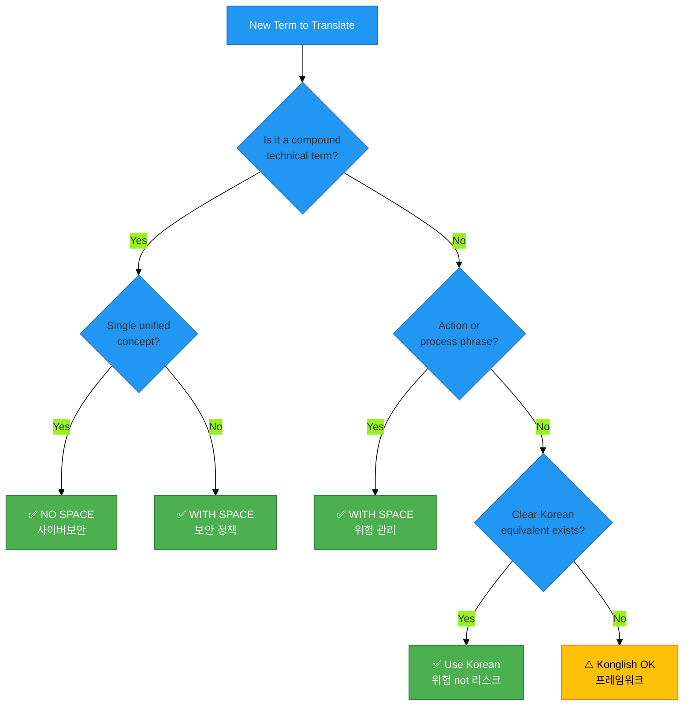

# 🇰🇷 Korean Cybersecurity Glossary 🔐

> **Comprehensive Terminology Reference for Korean Information Security Translation**  
> *Version 1.0 - December 2025*

## 📋 Document Overview

| Attribute | Value |
|-----------|-------|
| **Language** | Korean (ko_KR) |
| **Domain** | Cybersecurity, Information Security, ISMS, Compliance |
| **Version** | 1.0 (Initial Release) |
| **Status** | ✅ Active |
| **Last Updated** | December 18, 2025 |
| **Total Terms** | 200+ |
| **Coverage** | K-ISMS, ISO 27001, GDPR, PIPA, Discordian Philosophy |

## 🎯 Purpose

This glossary provides **standardized Korean translations** for cybersecurity terminology used across the Hack23 AB website. It ensures **terminology consistency**, **professional quality**, and **market relevance** for the Korean cybersecurity market.

## 📊 Standardization Rules

### 1️⃣ **Spacing Rules for Compound Terms**

Korean compound words follow specific spacing rules based on linguistic structure and industry conventions:

#### ✅ **NO SPACE (붙여쓰기)** - Preferred for Technical Terms

Use **no spacing** for established technical compound terms that function as single concepts:

| Term | Correct (No Space) | ❌ Avoid (With Space) | Rationale |
|------|-------------------|----------------------|-----------|
| Cybersecurity | **사이버보안** | ~~사이버 보안~~ | Established technical term, single concept |
| Information Security | **정보보안** | ~~정보 보안~~ | Standard industry term, single concept |
| Cloud Security | **클라우드보안** | ~~클라우드 보안~~ | Technical compound, industry standard |
| Network Security | **네트워크보안** | ~~네트워크 보안~~ | Technical compound, single security domain |
| Data Protection | **데이터보호** | ~~데이터 보호~~ | Single protective concept |

**Rule:** When a technical term represents a **single unified concept** in cybersecurity, use no spacing.

#### ✅ **WITH SPACE (띄어쓰기)** - Preferred for Action Phrases

Use **spacing** for phrases that describe actions, processes, or relationships between distinct concepts:

| Term | Correct (With Space) | ❌ Avoid (No Space) | Rationale |
|------|---------------------|---------------------|-----------|
| Compliance | **규정 준수** | ~~규정준수~~ | Two distinct concepts: regulations + adherence |
| Risk Assessment | **위험 평가** | ~~위험평가~~ | Action: assessing (verb) + risk (noun) |
| Risk Management | **위험 관리** | ~~위험관리~~ | Action: managing (verb) + risk (noun) |
| Incident Response | **사고 대응** | ~~사고대응~~ | Action: responding to incidents |
| Access Control | **액세스 제어** | ~~액세스제어~~ | Action: controlling access |
| Threat Modeling | **위협 모델링** | ~~위협모델링~~ | Process: modeling threats |
| Business Continuity | **비즈니스 연속성** | ~~비즈니스연속성~~ | Noun phrase: continuity of business |

**Rule:** When a term describes an **action, process, or relationship** between two concepts, use spacing.

### 2️⃣ **When to Use Konglish vs. Proper Korean**

#### ✅ **Use Proper Korean** - Preferred for General Terms

Use **native Korean terms** when they are clear, widely understood, and professionally accepted:

| English | ✅ Proper Korean | ❌ Avoid Konglish | Context |
|---------|-----------------|------------------|---------|
| Risk | **위험** | ~~리스크~~ | Universal term, clear meaning |
| Security | **보안** | ~~시큐리티~~ | Standard Korean term |
| Management | **관리** | ~~매니지먼트~~ | Clear Korean equivalent |
| Strategy | **전략** | ~~스트레티지~~ | Standard business term |
| Policy | **정책** | ~~폴리시~~ | Standard term |

#### ⚠️ **Konglish Acceptable** - When No Clear Korean Alternative

Use **Konglish (English loanwords)** only when:
1. No widely accepted Korean equivalent exists
2. The English term is universally recognized in Korean business
3. Using Korean would cause confusion

| English | ✅ Acceptable Konglish | Notes |
|---------|----------------------|-------|
| Compliance (regulatory context) | **컴플라이언스** | Acceptable alongside 규정 준수 in formal contexts |
| Framework | **프레임워크** | No clear Korean equivalent, widely used |
| DevSecOps | **DevSecOps** | Technical acronym, keep as-is |
| CI/CD | **CI/CD** | Technical acronym, keep as-is |
| API | **API** | Technical acronym, keep as-is |
| Dashboard | **대시보드** | Widely accepted Konglish |
| Template | **템플릿** | Widely accepted in tech context |

**Rule:** Prefer **proper Korean** unless the Konglish term is universally recognized and has no clear Korean equivalent.

### 3️⃣ **How to Add K-ISMS Context Alongside ISO 27001**

Korean market requires **local regulatory context** alongside international standards:

#### Pattern 1: ISO 27001 + K-ISMS Parallel Mention

```korean
ISO 27001 및 K-ISMS 인증
(ISO 27001 and K-ISMS certification)

정보보안관리체계(ISMS) 구축 - ISO 27001 및 K-ISMS 준수
(Information Security Management System - ISO 27001 and K-ISMS compliant)
```

#### Pattern 2: K-ISMS as Primary for Korean Market

```korean
K-ISMS(한국 정보보호관리체계) 인증을 위한 ISO 27001 구현
(ISO 27001 implementation for K-ISMS [Korean Information Security Management System] certification)
```

#### Pattern 3: Regulatory Context Addition

```korean
국제 표준 ISO 27001 및 한국 K-ISMS 요구사항 충족
(Meeting both international ISO 27001 and Korean K-ISMS requirements)
```

**Rule:** Always mention **K-ISMS** when discussing ISMS implementation for Korean organizations.

### 4️⃣ **How to Add PIPA/개인정보보호법 Context with GDPR**

Korean data protection law requires prominent mention alongside GDPR:

#### Pattern 1: GDPR + PIPA Parallel

```korean
GDPR 및 개인정보보호법(PIPA) 준수
(GDPR and Personal Information Protection Act [PIPA] compliance)
```

#### Pattern 2: PIPA Primary for Korean Market

```korean
개인정보보호법(PIPA) 준수 및 GDPR 정합성
(PIPA compliance and GDPR alignment)
```

#### Pattern 3: Expanded Context

```korean
EU GDPR, 한국 개인정보보호법(PIPA), NIS2 등 글로벌 규제 준수
(Compliance with EU GDPR, Korean Personal Information Protection Act [PIPA], NIS2 and global regulations)
```

**Rule:** Always include **PIPA (개인정보보호법)** when discussing data protection for Korean market.

## 📚 Core Cybersecurity Terminology (100+ Terms)

### 🔐 Security Foundations

| English | Korean (Standardized) | Category | Notes |
|---------|---------------------|----------|-------|
| Cybersecurity | 사이버보안 | Core | No space - single concept |
| Information Security | 정보보안 | Core | No space - single concept |
| Security | 보안 | Core | Basic term |
| Protection | 보호 | Core | Basic term |
| Defense | 방어 | Core | Basic term |
| Threat | 위협 | Core | Proper Korean, not 리스크 |
| Risk | 위험 | Core | Proper Korean, not 리스크 |
| Vulnerability | 취약점 | Core | Standard term |
| Attack | 공격 | Core | Basic term |
| Breach | 침해 / 유출 | Core | Context-dependent |

### 🏛️ ISMS & Governance

| English | Korean (Standardized) | Category | Notes |
|---------|---------------------|----------|-------|
| Information Security Management System (ISMS) | 정보보안관리체계 | ISMS | No space - single system concept |
| K-ISMS | K-ISMS | ISMS | Korean certification standard |
| ISO 27001 | ISO 27001 | ISMS | Keep as-is |
| ISO 27002 | ISO 27002 | ISMS | Keep as-is |
| Security Policy | 보안 정책 | Governance | With space |
| Governance | 거버넌스 / 관리체계 | Governance | Context-dependent |
| Framework | 프레임워크 | Governance | Konglish acceptable |
| Standard | 표준 | Governance | Proper Korean |
| Compliance | 규정 준수 / 컴플라이언스 | Governance | With space preferred; Konglish acceptable in formal contexts |
| Audit | 감사 | Governance | Proper Korean |
| Certification | 인증 | Governance | Proper Korean |
| Accreditation | 인가 | Governance | Proper Korean |

### 📋 Risk Management

| English | Korean (Standardized) | Category | Notes |
|---------|---------------------|----------|-------|
| Risk Assessment | 위험 평가 | Risk | With space - action phrase |
| Risk Management | 위험 관리 | Risk | With space - action phrase |
| Risk Register | 위험 등록부 | Risk | With space |
| Threat Modeling | 위협 모델링 | Risk | With space - process |
| Threat Actor | 위협 행위자 | Risk | With space |
| Threat Intelligence | 위협 인텔리전스 | Risk | With space |
| Impact Analysis | 영향 분석 | Risk | With space |
| Business Impact Analysis (BIA) | 비즈니스 영향 분석 | Risk | With space |
| Likelihood | 가능성 | Risk | Proper Korean |
| Severity | 심각도 | Risk | Proper Korean |
| Mitigation | 완화 / 경감 | Risk | Proper Korean |
| Treatment | 처리 | Risk | Proper Korean |

### 🔑 Access Control & Identity

| English | Korean (Standardized) | Category | Notes |
|---------|---------------------|----------|-------|
| Access Control | 액세스 제어 | Access | With space - action |
| Identity and Access Management (IAM) | 신원 및 액세스 관리 | Access | With spaces |
| Authentication | 인증 | Access | Proper Korean |
| Authorization | 권한 부여 | Access | With space |
| Multi-Factor Authentication (MFA) | 다중 인증 / 다단계 인증 | Access | With space |
| Single Sign-On (SSO) | 단일 로그인 | Access | With space |
| Privileged Access | 특권 액세스 | Access | With space |
| Least Privilege | 최소 권한 | Access | With space |
| Zero Trust | 제로 트러스트 | Access | Konglish acceptable |
| Role-Based Access Control (RBAC) | 역할 기반 액세스 제어 | Access | With spaces |

### 🛡️ Technical Security Controls

| English | Korean (Standardized) | Category | Notes |
|---------|---------------------|----------|-------|
| Network Security | 네트워크보안 | Technical | No space - single concept |
| Cloud Security | 클라우드보안 | Technical | No space - single concept |
| Endpoint Security | 엔드포인트보안 | Technical | No space - single concept |
| Firewall | 방화벽 | Technical | Proper Korean |
| Intrusion Detection System (IDS) | 침입 탐지 시스템 | Technical | With spaces |
| Intrusion Prevention System (IPS) | 침입 방지 시스템 | Technical | With spaces |
| Security Information and Event Management (SIEM) | 보안 정보 및 이벤트 관리 | Technical | With spaces |
| Encryption | 암호화 | Technical | Proper Korean |
| Cryptography | 암호학 / 암호 | Technical | Proper Korean |
| Digital Signature | 디지털 서명 | Technical | With space |
| Certificate | 인증서 | Technical | Proper Korean |
| VPN | VPN | Technical | Keep as-is |
| WAF (Web Application Firewall) | 웹 애플리케이션 방화벽 | Technical | With spaces |

### 🔒 Data Protection & Privacy

| English | Korean (Standardized) | Category | Notes |
|---------|---------------------|----------|-------|
| Data Protection | 데이터보호 | Privacy | No space - single concept |
| Data Privacy | 데이터 프라이버시 / 개인정보보호 | Privacy | Context-dependent |
| Personal Information Protection Act (PIPA) | 개인정보보호법 | Privacy | Korean regulation |
| GDPR | GDPR | Privacy | Keep as-is |
| Data Classification | 데이터 분류 | Privacy | With space |
| Sensitive Data | 민감 데이터 | Privacy | With space |
| Personal Data | 개인정보 | Privacy | Proper Korean |
| Data Minimization | 데이터 최소화 | Privacy | With space |
| Data Retention | 데이터 보관 | Privacy | With space |
| Data Subject | 정보주체 | Privacy | No space - legal term |
| Consent | 동의 | Privacy | Proper Korean |
| Right to be Forgotten | 삭제권 / 잊혀질 권리 | Privacy | With space |

### 🚨 Incident Response & Continuity

| English | Korean (Standardized) | Category | Notes |
|---------|---------------------|----------|-------|
| Incident Response | 사고 대응 | Incident | With space - action |
| Security Incident | 보안 사고 | Incident | With space |
| Data Breach | 데이터 유출 | Incident | With space |
| Incident Management | 사고 관리 | Incident | With space |
| Business Continuity | 비즈니스 연속성 | Continuity | With space |
| Disaster Recovery | 재해 복구 | Continuity | With space |
| Backup | 백업 | Continuity | Konglish acceptable |
| Recovery Time Objective (RTO) | 복구 시간 목표 | Continuity | With spaces |
| Recovery Point Objective (RPO) | 복구 시점 목표 | Continuity | With spaces |
| Crisis Management | 위기 관리 | Continuity | With space |

### 🔧 Secure Development & DevSecOps

| English | Korean (Standardized) | Category | Notes |
|---------|---------------------|----------|-------|
| Secure Development | 안전한 개발 | Development | With space |
| DevSecOps | DevSecOps | Development | Keep as-is |
| CI/CD | CI/CD | Development | Keep as-is |
| Secure SDLC | 보안 SDLC | Development | With space |
| Code Review | 코드 리뷰 | Development | With space |
| Static Application Security Testing (SAST) | 정적 애플리케이션 보안 테스트 | Development | With spaces |
| Dynamic Application Security Testing (DAST) | 동적 애플리케이션 보안 테스트 | Development | With spaces |
| Vulnerability Scanning | 취약점 스캔 | Development | With space |
| Penetration Testing | 침투 테스트 | Development | With space |
| Security Testing | 보안 테스트 | Development | With space |
| Supply Chain Security | 공급망 보안 | Development | With space |

### 📊 Compliance Frameworks

| English | Korean (Standardized) | Category | Notes |
|---------|---------------------|----------|-------|
| NIST Cybersecurity Framework | NIST 사이버보안 프레임워크 | Framework | With spaces |
| CIS Controls | CIS 통제 | Framework | With space |
| PCI DSS | PCI DSS | Framework | Keep as-is |
| HIPAA | HIPAA | Framework | Keep as-is |
| SOC 2 | SOC 2 | Framework | Keep as-is |
| NIS2 | NIS2 | Framework | Keep as-is |
| EU Cyber Resilience Act | EU 사이버 복원력 법 | Framework | With spaces |

## 🍎 Discordian Philosophy Terminology (30+ Terms)

### Core Discordian Concepts

| English | Korean (Standardized) | Category | Notes |
|---------|---------------------|----------|-------|
| Discordian | 디스코디안 | Philosophy | Transliterate |
| Think for Yourself | 스스로 생각하라 | Philosophy | Imperative form |
| Question Authority | 권위에 의문을 제기하라 | Philosophy | Full phrase |
| FNORD | FNORD | Philosophy | Keep as-is (untranslatable) |
| Law of Fives | 5의 법칙 | Philosophy | Proper Korean |
| Chapel Perilous | Chapel Perilous | Philosophy | Keep as-is (concept name) |
| Eris | 에리스 | Philosophy | Transliterate goddess name |
| Discordia | 디스코디아 | Philosophy | Transliterate |
| Illuminatus! | 일루미나투스! | Philosophy | Transliterate book title |
| Principia Discordia | Principia Discordia | Philosophy | Keep Latin title |
| 23 FNORD 5 | 23 FNORD 5 | Philosophy | Keep signature as-is |

### Discordian Security Philosophy

| English | Korean (Standardized) | Category | Notes |
|---------|---------------------|----------|-------|
| Information Hoarding | 정보 독점 | Philosophy | With space |
| Radical Transparency | 급진적 투명성 | Philosophy | With space |
| Security Theater | 보안 연극 | Philosophy | With space - metaphorical |
| Defense Through Transparency | 투명성을 통한 방어 | Philosophy | With spaces |
| Everything You Know About Security Is a Lie | 당신이 보안에 대해 알고 있는 모든 것은 거짓이다 | Philosophy | Full translation |
| Security-Industrial Complex | 보안-산업 복합체 | Philosophy | With hyphens |
| Crypto Approved By Spies | 스파이가 승인한 암호 | Philosophy | Full translation |

## 🇰🇷 Korean-Specific Regulatory & Market Terminology (50+ Terms)

### Korean Regulations & Standards

| English | Korean (Standardized) | Category | Notes |
|---------|---------------------|----------|-------|
| K-ISMS (Korean ISMS) | K-ISMS | Regulation | Korean certification |
| Information Security Management System | 정보보호관리체계 | Regulation | Official Korean term for K-ISMS |
| Personal Information Protection Act | 개인정보보호법 | Regulation | Korean data protection law |
| PIPA | PIPA | Regulation | Acronym widely used |
| Korea Internet & Security Agency | 한국인터넷진흥원 | Agency | KISA |
| KISA | KISA | Agency | Keep as-is |
| Ministry of Science and ICT | 과학기술정보통신부 | Agency | Korean ministry |
| Personal Information Protection Commission | 개인정보보호위원회 | Agency | Korean regulatory body |

### K-ISMS Specific Terms

| English | Korean (Standardized) | Category | Notes |
|---------|---------------------|----------|-------|
| K-ISMS Certification | K-ISMS 인증 | K-ISMS | With space |
| K-ISMS Audit | K-ISMS 심사 | K-ISMS | With space |
| K-ISMS Requirements | K-ISMS 요구사항 | K-ISMS | With space |
| K-ISMS Control | K-ISMS 통제항목 | K-ISMS | With space |
| K-ISMS Compliance | K-ISMS 준수 | K-ISMS | With space |
| Information Protection Management System | 정보보호관리체계 | K-ISMS | Official term |
| Integrated K-ISMS/PIMS | 통합 K-ISMS/PIMS | K-ISMS | With space |
| PIMS (Personal Information Management System) | 개인정보관리체계 | K-ISMS | No space |

### Korean Market Context

| English | Korean (Standardized) | Category | Notes |
|---------|---------------------|----------|-------|
| Korean Enterprise | 한국 기업 | Market | With space |
| Korean Market | 한국 시장 | Market | With space |
| Local Regulations | 국내 규정 | Market | With space |
| Domestic Compliance | 국내 규정 준수 | Market | With spaces |
| Korean Language Support | 한국어 지원 | Market | With space |
| Seoul Data Center | 서울 데이터센터 | Market | With space |
| Korean Customer | 한국 고객 | Market | With space |

## 🔄 Translation Patterns & Best Practices

### Pattern 1: International + Korean Regulatory Context

**Before (International only):**
```
ISO 27001 certification and GDPR compliance
```

**After (International + Korean):**
```korean
ISO 27001 및 K-ISMS 인증과 GDPR 및 개인정보보호법(PIPA) 준수
(ISO 27001 and K-ISMS certification, GDPR and Personal Information Protection Act [PIPA] compliance)
```

### Pattern 2: Technical Term Consistency

**Before (Mixed spacing):**
```korean
사이버 보안 및 정보 보안
```

**After (Standardized no spacing):**
```korean
사이버보안 및 정보보안
```

### Pattern 3: Action Phrase Spacing

**Before (No spacing):**
```korean
위험관리 및 규정준수
```

**After (Proper spacing):**
```korean
위험 관리 및 규정 준수
```

### Pattern 4: Konglish Reduction

**Before (Unnecessary Konglish):**
```korean
리스크 매니지먼트 및 컴플라이언스
```

**After (Proper Korean preferred):**
```korean
위험 관리 및 규정 준수
```

### Pattern 5: K-ISMS Integration

**Before (ISO-only):**
```
Implementing ISO 27001 ISMS for your organization
```

**After (ISO + K-ISMS):**
```korean
조직을 위한 ISO 27001 및 K-ISMS(한국 정보보호관리체계) 구현
(Implementing ISO 27001 and K-ISMS [Korean Information Security Management System] for your organization)
```

## 🎯 Terminology Decision Tree



## 📚 Reference Sources

### Korean Language Standards
- **National Institute of Korean Language** (국립국어원)
- **Standard Korean Language Dictionary** (표준국어대사전)
- **Korean IT Terminology Dictionary** (한국정보통신기술협회)

### Cybersecurity Standards
- **K-ISMS Certification Guide** (KISA)
- **Personal Information Protection Act (PIPA)** (개인정보보호법)
- **ISO/IEC 27000 Series** (Korean translations)
- **NIST Cybersecurity Framework** (Korean guidance)

### Industry References
- **KISA Publications** (한국인터넷진흥원)
- **Korean Cybersecurity Industry Association**
- **Professional cybersecurity publications in Korean**

## 🔄 Maintenance & Updates

### Version History

| Version | Date | Changes | Author |
|---------|------|---------|--------|
| 1.0 | 2025-12-18 | Initial comprehensive glossary created | Hack23 Translation Team |

### Contribution Guidelines

When adding or updating terms:

1. **Verify usage** in professional Korean cybersecurity publications
2. **Check KISA** and official K-ISMS documentation
3. **Apply spacing rules** consistently (technical terms vs. action phrases)
4. **Prefer proper Korean** over Konglish when clear equivalents exist
5. **Document rationale** for complex translation choices
6. **Update all affected files** when terminology changes

### Review Schedule

- **Quarterly Review**: Update based on new cybersecurity terms and regulatory changes
- **Annual Major Update**: Comprehensive review of all terminology
- **Ad-hoc Updates**: As needed for regulatory changes or significant market shifts

## 📧 Contact & Feedback

For questions, suggestions, or corrections to this glossary:

- **GitHub Issues**: https://github.com/Hack23/homepage/issues
- **Label**: `korean-translation`
- **Email**: Contact through GitHub

---

**Document Control:**
- **Classification**: Public
- **Language**: Korean (ko_KR) + English
- **Status**: ✅ Active
- **Next Review**: March 2026
- **Approved By**: Hack23 AB Translation Team

**📌 Note:** This glossary is a living document. All translators are encouraged to suggest improvements and additions based on real-world usage and market feedback.

---

*This glossary is part of the Hack23 Open Translation Initiative for Cybersecurity Documentation.*  
*Licensed under Creative Commons BY-SA 4.0 for public use and adaptation.*  
*Contributions welcome via GitHub pull requests.*

**🇰🇷 Making Korean cybersecurity documentation consistent and professional.**
