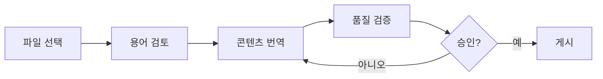
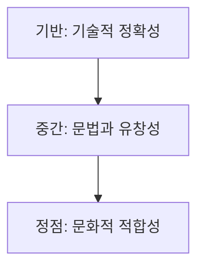

# 🇰🇷 Korean (ko) Translation Guide

**Version 5.0 - Comprehensive Hack23 Edition**  
*Last Updated: January 2026*

---

## 📋 Quick Reference

| Attribute | Value |
|-----------|-------|
| **Language Code** | `ko` |
| **Locale** | `ko_KR` |
| **Text Direction** | LTR (Left-to-Right) → |
| **Currency** | KRW (₩) |
| **Date Format** | `YYYY년 MM월 DD일` or `2026년 1월 1일` |
| **Script** | Hangul (한글), with Hanja (漢字) occasionally |

---

## 🔄 Visual Translation Workflow

## 🔄 Quality Standards Pyramid

---

## 📚 Comprehensive Vocabulary Reference

### 🔥 Brand & Key Entities (Never Translate)

| English | Korean | Notes |
|---------|--------|-------|
| Hack23 | Hack23 | Company name – never translate |
| Hack23 AB | Hack23 AB | Swedish company designation |
| Citizen Intelligence Agency | Citizen Intelligence Agency | Project name – keep English |
| CIA Compliance Manager | CIA Compliance Manager | Product name – keep English |
| Black Trigram | Black Trigram / 흑괘 (黑卦) | Game product – Korean name available |
| 흑괘 | 흑괘 | Korean name for Black Trigram |
| James Pether Sörling | James Pether Sörling | Founder name |
| CISSP | CISSP | Certification |
| CISM | CISM | Certification |
| GitHub | GitHub | Platform name |
| LinkedIn | LinkedIn | Platform name |

### 🏢 Hack23 Business & Services

| English | Korean | Notes |
|---------|--------|-------|
| Cybersecurity Consulting Sweden | 스웨덴 사이버보안 컨설팅 | Main tagline |
| Public ISMS | 공개 ISMS | Core differentiator |
| Security Architecture | 보안 아키텍처 | |
| Security Strategy | 보안 전략 | |
| Cloud Security | 클라우드 보안 | |
| DevSecOps | DevSecOps | Keep English |
| Secure Development | 보안 개발 | |
| Code Quality | 코드 품질 | |
| Compliance & Regulatory | 규정 준수 및 규제 | |
| Open Source Security | 오픈소스 보안 | |
| Security Culture | 보안 문화 | |
| Security Training | 보안 교육 | |
| Full-Stack Security | 풀스택 보안 | |
| Current Practitioner | 현직 실무자 | Value proposition |
| Transparent Security | 투명한 보안 | |
| Developer-Friendly Security | 개발자 친화적 보안 | |
| OSPO | OSPO | Open Source Program Office |
| Gothenburg | 예테보리 | City in Sweden |
| Sweden | 스웨덴 | |

### 🎮 Black Trigram (흑괘) Game Vocabulary

| English | Korean | Notes |
|---------|--------|-------|
| Precision Combat Simulator | 정밀 전투 시뮬레이터 | |
| Vital Points | 급소 | |
| 70 Anatomical Vital Points | 70개의 해부학적 급소 | |
| Fighter Archetypes | 전사 아키타입 | |
| Musa (Warrior) | 무사 (전사) | Korean term |
| Amsalja (Assassin) | 암살자 | Korean term |
| Hacker | 해커 | |
| Jeongbo (Intelligence) | 정보원 | Korean term |
| Jojik (Organization) | 조직 | Korean term |
| Korean Martial Arts | 한국 무술 | |
| Taekkyeon | 택견 | Traditional Korean martial art |
| Hapkido | 합기도 | Korean martial art |
| Taekwondo | 태권도 | Korean martial art |
| Cultural Preservation | 문화 보존 | |
| Educational Gaming | 교육 게임 | |
| Unity Game | 유니티 게임 | |
| Steam | Steam | Platform name |
| itch.io | itch.io | Platform name |
| I Ching | 주역 (周易) | |
| Trigram | 괘 (卦) | |

### 🔍 Citizen Intelligence Agency Vocabulary

| English | Korean | Notes |
|---------|--------|-------|
| Political Transparency | 정치적 투명성 | |
| OSINT Platform | OSINT 플랫폼 | |
| Parliamentary Monitoring | 의회 모니터링 | |
| Voting Records | 투표 기록 | |
| Accountability Metrics | 책임 지표 | |
| Open Data | 오픈 데이터 | |
| Civic Technology | 시빅 테크 | |
| Swedish Parliament | 스웨덴 의회 | |
| Data Visualization | 데이터 시각화 | |
| Political Analytics | 정치 분석 | |

### 🔐 CIA Compliance Manager Vocabulary

| English | Korean | Notes |
|---------|--------|-------|
| Security Assessment Platform | 보안 평가 플랫폼 | |
| Business Impact Analysis | 비즈니스 영향 분석 | |
| Multi-Framework Compliance | 다중 프레임워크 준수 | |
| STRIDE Analysis | STRIDE 분석 | Threat model |
| Threat Modeling | 위협 모델링 | |
| Evidence Collection | 증거 수집 | |
| Automated Compliance Reporting | 자동화된 규정 준수 보고 | |
| Risk Register | 리스크 레지스터 | |
| Controls Monitoring | 통제 모니터링 | |
| CRA Assessment | CRA 평가 | Cyber Resilience Act |

### 🍎 Discordian Philosophy & ISMS Blog

| English | Korean | Notes |
|---------|--------|-------|
| Think for Yourself | 스스로 생각하라 | Core motto |
| Question Authority | 권위에 의문을 제기하라 | |
| FNORD | FNORD | Never translate |
| Nothing is True | 아무것도 진실이 아니다 | |
| Everything is Permitted | 모든 것이 허용된다 | |
| Security Theater | 보안 연극 | Fake security |
| Radical Transparency | 급진적 투명성 | |
| Chapel Perilous | 위험한 예배당 | Keep English or translate |
| Operation Mindfuck | Operation Mindfuck | Keep English |
| Illuminatus Trilogy | 일루미나투스 삼부작 | |
| Eris | 에리스 | Goddess of Chaos |
| Discordia | 디스코디아 | |
| Law of Fives | 5의 법칙 | |
| Sacred Geometry | 신성 기하학 | |
| Five-Layer Architecture | 5층 아키텍처 | |
| Nation-State Surveillance | 국가 감시 | |
| Crypto Backdoors | 암호화 백도어 | |
| Security Through Obscurity | 모호함을 통한 보안 | Anti-pattern |
| Information Hoarding | 정보 독점 | |
| Knowledge Transparency | 지식 투명성 | |
| Simon Moon | 사이먼 문 | Character reference |
| Hagbard Celine | 하그바드 셀린 | Character reference |
| George Dorn | 조지 돈 | Character reference |

### 🧭 Navigation & UI Elements

| English | Korean |
|---------|--------|
| Home | 홈 |
| About Us | 회사 소개 |
| Services | 서비스 |
| Products | 제품 |
| Projects | 프로젝트 |
| Contact | 연락처 |
| Blog | 블로그 |
| Search | 검색 |
| Menu | 메뉴 |
| Close | 닫기 |
| Back | 뒤로 |
| Next | 다음 |
| Previous | 이전 |
| Submit | 제출 |
| Cancel | 취소 |
| **Expand All** | **모두 펼치기** |
| **Collapse All** | **모두 접기** |
| Download | 다운로드 |
| Read More | 더 읽기 |
| View Details | 상세 보기 |
| Privacy Policy | 개인정보처리방침 |
| Terms of Service | 이용약관 |
| Copyright | 저작권 |
| Sitemap | 사이트맵 |
| FAQ | 자주 묻는 질문 |
| Why Hack23 | Hack23을 선택하는 이유 |
| Accessibility Statement | 접근성 선언 |
| Language | 언어 |
| Share | 공유 |
| Print | 인쇄 |
| Save | 저장 |
| Edit | 편집 |
| Delete | 삭제 |
| Confirm | 확인 |
| Loading | 로딩 중 |
| Error | 오류 |
| Success | 성공 |
| Warning | 경고 |

### 🔐 CIA Triad & Core Security Principles

| English | Korean | Notes |
|---------|--------|-------|
| CIA Triad | CIA 삼요소 | |
| CIA+ Framework | CIA+ 프레임워크 | Extended framework |
| **Confidentiality** | **기밀성** | Data protection |
| **Integrity** | **무결성** | Data accuracy |
| **Availability** | **가용성** | System uptime |
| Non-Repudiation | 부인 방지 | |
| Authentication | 인증 | |
| Authorization | 권한 부여 | |

### 🔒 Security & Cybersecurity Terminology

| English | Korean | Notes |
|---------|--------|-------|
| Cybersecurity | 사이버보안 | |
| Information Security | 정보보안 | |
| ISMS | 정보보안관리체계 | |
| Security Policy | 보안 정책 | |
| Risk Management | 리스크 관리 | |
| Risk Assessment | 리스크 평가 | |
| Threat | 위협 | |
| Vulnerability | 취약점 | |
| Exploit | 익스플로잇 | |
| Patch | 패치 | |
| Firewall | 방화벽 | |
| Encryption | 암호화 | |
| Decryption | 복호화 | |
| Access Control | 접근 통제 | |
| Multi-Factor Authentication (MFA) | 다요소 인증 | |
| Single Sign-On (SSO) | 싱글 사인온 | |
| Phishing | 피싱 | |
| Ransomware | 랜섬웨어 | |
| Malware | 멀웨어 | |
| Zero Trust | 제로 트러스트 | |
| Defense in Depth | 심층 방어 | |
| Least Privilege | 최소 권한 | |
| Incident Response | 침해 대응 | |
| Data Breach | 데이터 유출 | |
| Penetration Test | 모의 해킹 | |
| Audit | 감사 | |
| Compliance | 규정 준수 | |
| Governance | 거버넌스 | |
| Security Awareness | 보안 인식 | |
| Backup | 백업 | |
| Disaster Recovery | 재해 복구 | |
| Business Continuity | 업무 연속성 | |
| Supply Chain Security | 공급망 보안 | |
| SLSA Level 3 | SLSA 레벨 3 | Supply chain security |
| Container Security | 컨테이너 보안 | |
| Serverless Security | 서버리스 보안 | |
| API Security | API 보안 | |
| Endpoint Security | 엔드포인트 보안 | |

### 🏛️ Regulatory & Standards

| English | Korean | Notes |
|---------|--------|-------|
| ISO 27001 | ISO 27001 | Keep as-is |
| ISO 27001:2022 | ISO 27001:2022 | |
| GDPR | GDPR / 일반 데이터 보호 규정 | EU regulation |
| NIS2 | NIS2 지침 | EU directive |
| NIST CSF | NIST 사이버보안 프레임워크 | |
| CIS Controls | CIS 통제 | |
| SOC2 | SOC2 | |
| HIPAA | HIPAA | US healthcare |
| EU Cyber Resilience Act (CRA) | EU 사이버 복원력법 | |
| Annex A Controls | 부속서 A 통제 | ISO 27001 |
| Statement of Applicability | 적용성 선언서 | |
| KISA | 한국인터넷진흥원 | Korean regulator |
| PIPC | 개인정보보호위원회 | Korean privacy authority |

### 💼 Business & Professional Terms

| English | Korean |
|---------|--------|
| Consulting | 컨설팅 |
| Enterprise | 기업 |
| Strategy | 전략 |
| Certification | 인증 |
| Assessment | 평가 |
| Implementation | 구현 |
| Audit | 감사 |
| Review | 검토 |
| Gap Analysis | 갭 분석 |
| Roadmap | 로드맵 |
| Best Practices | 모범 사례 |
| Case Study | 사례 연구 |
| ROI | 투자수익률 |
| KPI | 핵심 성과 지표 |
| SLA | 서비스 수준 협약 |
| Stakeholder | 이해관계자 |
| Deliverable | 산출물 |
| Milestone | 마일스톤 |

### 📝 Blog Post Categories

| English | Korean |
|---------|--------|
| Security Architecture | 보안 아키텍처 |
| ISMS Policies | ISMS 정책 |
| Compliance Frameworks | 규정 준수 프레임워크 |
| Threat Modeling | 위협 모델링 |
| Secure Development | 보안 개발 |
| Cloud Security | 클라우드 보안 |
| Access Control | 접근 통제 |
| Cryptography | 암호학 |
| Incident Response | 침해 대응 |
| Vulnerability Management | 취약점 관리 |
| Asset Management | 자산 관리 |
| Network Security | 네트워크 보안 |
| Email Security | 이메일 보안 |
| Physical Security | 물리 보안 |
| Mobile Device Security | 모바일 기기 보안 |
| Remote Access Security | 원격 접근 보안 |
| Monitoring & Logging | 모니터링 및 로깅 |
| Security Metrics | 보안 지표 |
| Third Party Risk | 제3자 리스크 |
| Change Management | 변경 관리 |

### 🏭 Industry-Specific Terms

| English | Korean |
|---------|--------|
| Investment & FinTech | 투자 및 핀테크 |
| Betting & Gaming | 베팅 및 게이밍 |
| Cannabis Security | 대마 보안 |
| Healthcare | 헬스케어 |
| Government | 정부 |
| Critical Infrastructure | 핵심 기반시설 |
| Financial Services | 금융 서비스 |
| E-commerce | 이커머스 |

---

## 🔤 Korean-Specific Guidelines

### Script Usage
- **Hangul (한글)**: Primary script for all Korean text
- **Hanja (漢字)**: Occasionally used for disambiguation
- English terms can be kept or transliterated to Hangul

### Spacing
- Korean uses spaces between words (unlike Chinese/Japanese)
- Particles are attached to preceding words without space

### Honorifics
- Use formal/polite form (합니다체) for professional content
- -님 suffix for addressing users respectfully

### Formatting
- Korean punctuation similar to English
- Use Korean quotation marks where appropriate

---

## ✅ Translation Checklist

- [ ] `<html lang="ko">` attribute set
- [ ] `<title>` translated
- [ ] `<meta name="description">` translated
- [ ] `og:locale` set to `ko_KR`
- [ ] All hreflang tags present (14 languages)
- [ ] Navigation menu translated
- [ ] Footer translated
- [ ] Brand names kept in English or Hangul
- [ ] Proper spacing between words
- [ ] Formal/polite language used

---

## 📝 Notes

- Use **formal Korean** (합니다체 / 해요체)
- KISA is the Korean cybersecurity agency
- Black Trigram (흑괘) has Korean heritage - use Korean terminology where appropriate
- Consider cultural context for Korean martial arts terms

---

*23 FNORD 5*
