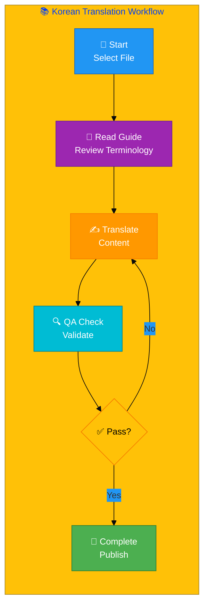
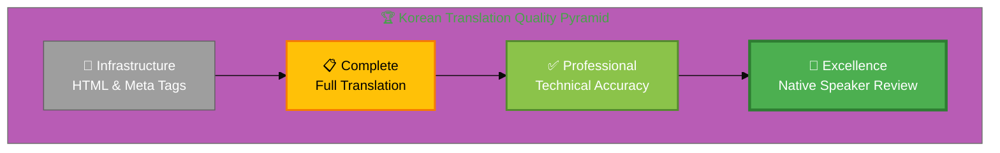
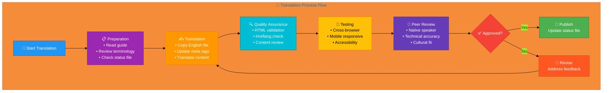

# 🇰🇷 Korean Translation Guide 🏯

> **Professional Cybersecurity Translation Guide**  
> *For InfoSec, Cybersecurity, and Discordian Philosophy Documentation*

## 📋 Quick Reference

| Attribute | Value |
|-----------|-------|
| **Language** | Korean (ko) |
| **Flag & Icon** | 🇰🇷 🏯 |
| **Locale** | ko_KR |
| **Currency** | KRW (₩) |
| **Direction** | LTR (Left-to-Right) → |
| **Files Translated** | 58/96 (60.4%) |
| **Blog Posts Complete** | 26/26 (100%) ✅ |
| **Quality Score** | 62.1% |
| **Guide Version** | 5.0 (Terminology Standardization Edition)
| **Last Updated** | December 18, 2025 |
| **Glossary** | [Korean-Cybersecurity-Glossary.md](Korean-Cybersecurity-Glossary.md) (200+ terms) |
| **Fix Plan** | [Korean-Translation-Standardization-Plan.md](Korean-Translation-Standardization-Plan.md) |

## 🚨 **IMPORTANT: Terminology Standardization in Progress**

**December 2025 Update:** A comprehensive terminology audit identified inconsistencies across 68 Korean files. A standardization effort is underway to ensure professional quality.

### 📋 Key Changes Being Implemented

**1. Spacing Standardization:**
- ✅ **사이버보안** (no space) - preferred for technical compounds
- ✅ **정보보안** (no space) - aligns with K-ISMS terminology
- ✅ **규정 준수** (with space) - proper Korean for action phrases

**2. Konglish Reduction:**
- ✅ **위험** (proper Korean) - replaces 리스크 (Konglish)

**3. Regulatory Context Enhancement:**
- ✅ **K-ISMS** context added alongside ISO 27001
- ✅ **PIPA (개인정보보호법)** context added alongside GDPR

**4. Technical Fixes:**
- ✅ Schema.org `"inLanguage": "ko"` added to all 68 files

### 📚 Reference Documents

- **[Korean-Cybersecurity-Glossary.md](Korean-Cybersecurity-Glossary.md)** - Complete terminology reference (200+ terms)
- **[Korean-Translation-Standardization-Plan.md](Korean-Translation-Standardization-Plan.md)** - Detailed fix plan

**All translators should consult these documents before making changes to ensure consistency.**

---

## 🎯 Translation Philosophy

### The Discordian Approach to Translation

Translation is not mere word replacement—it's the art of preserving meaning, tone, philosophy, and cultural context while adapting to a new linguistic framework. This guide embodies the Discordian principle: **"Think for Yourself"** — use these guidelines as a starting point, but apply critical thinking and cultural awareness.

### Core Translation Principles

#### 1. 💼 Professional Business Tone
- Write for **C-level executives** and **technical decision-makers**
- Maintain **formal business register** appropriate for cybersecurity consulting
- Balance **technical precision** with **clear communication**
- Use **industry-standard terminology** recognized in Korean

#### 2. 🎯 Technical Consistency
- **Preserve English terms** where widely accepted internationally:
  - DevSecOps, CI/CD, GitHub, Docker, Kubernetes, API, REST
- **Use established Korean terminology** for cybersecurity concepts
- **Maintain consistency** across all translated pages
- **Document translation choices** for complex or ambiguous terms

#### 3. 🌍 Cultural Adaptation
- **Adapt examples** to local market context and business practices
- **Reference local regulations**: GDPR, NIS2, and Korean-specific laws
- **Cite local authorities**: National cybersecurity agencies
- **Adjust humor and references** to cultural norms while preserving Discordian spirit

#### 4. 🎭 Discordian Style Preservation
- **"Think for Yourself"** → Translate philosophy authentically
- **FNORD references** → Preserve where culturally appropriate, adapt if needed
- **"23 FNORD 5"** → Keep signature as cultural marker
- **Philosophical concepts** → Adapt to local philosophical traditions

## 📊 Visual Translation Workflow



## 🏆 Quality Standards Pyramid



## 📚 Comprehensive Terminology Reference

### 🔗 **NEW: Complete Cybersecurity Glossary Available!**

**All Korean cybersecurity terminology is now available in a dedicated comprehensive glossary:**

👉 **[Korean-Cybersecurity-Glossary.md](Korean-Cybersecurity-Glossary.md)** - 200+ terms with:
- ✅ Standardization rules for spacing and Konglish vs. proper Korean
- ✅ K-ISMS and PIPA regulatory context patterns
- ✅ Discordian philosophy terminology (30+ terms)
- ✅ Korean market-specific terminology (50+ terms)
- ✅ Decision trees for terminology choices
- ✅ Translation patterns and best practices

**For quick reference, essential vocabulary is included below. For comprehensive terminology, consult the full glossary.**

---

## 📚 Essential Vocabulary Reference

*Core terms extracted from 68 translated files - See [Korean-Cybersecurity-Glossary.md](Korean-Cybersecurity-Glossary.md) for complete terminology*


### 🧭 Navigation & UI Elements

*Essential interface terms that appear across all pages*


| English | Translation |
|---------|-------------|
| Blog | 블로그 |
| Collapse All | 모두 접기 |
| Contact | 문의 |
| Expand All | 모두 펼치기 |
| Home | 홈 |
| Products | 제품 |
| Services | 서비스 |
| Why Hack23 | Hack23 소개 |

### 🔒 Security & Cybersecurity Terminology

*Core security concepts and cybersecurity terms*


| English | Translation |
|---------|-------------|
| Access Control | 액세스 제어 |
| Cloud Security | 클라우드 보안 |
| Compliance | 규정 준수 |
| Cybersecurity | 사이버 보안 |
| DevSecOps | DevSecOps |
| GDPR | GDPR |
| Incident Response | 사고 대응 |
| ISO 27001 | ISO 27001 |
| Risk Assessment | 위험 평가 |
| Security | 보안 |
| Threat | 위협 |
| Vulnerability | 취약점 |
| ☁️ Cloud Security & DevSecOps | ☁️ 클라우드 보안 및 DevSecOps |
| ⚡ Security Accelerates Innovation | 🛠️ 실용적 솔루션 |
| 🌐 Open Source Security | 🌐 오픈 소스 보안 |
| 🎓 Security Culture & Training | 🎓 보안 문화 및 교육 |
| 🏆 Security & Quality Evidence | 🏆 보안 및 품질 증거 |
| 🏗️ Security Architecture & Strategy | 🏗️ 보안 아키텍처 및 전략 |
| 📋 Compliance & Regulatory | 📋 규정 준수 및 규제 |
| 🔐 Hack23 AB Premium Cybersecurity Consulting \| Sweden's Only Public ISMS | 🔐 Hack23 AB 프리미엄 사이버보안 컨설팅 \| 스웨덴 유일의 공개 ISMS |
| 🔑 Security Services | 🔑 보안 서비스 |
| 🛡️ Security & Quality Standards | 🛡️ 보안 및 품질 기준 |


### 🔐 CIA Triad & Core Principles

*Confidentiality, Integrity, Availability framework*

| English | Translation |
|---------|-------------|
| CIA Triad | CIA 3요소 |
| Confidentiality | 기밀성 |
| Integrity | 무결성 |
| Availability | 가용성 |

### 🏛️ ISMS & Governance Terminology

*Information Security Management System and governance concepts*

| English | Translation |
|---------|-------------|
| Information Security Management System | 정보보안 관리체계 |
| Security Policy | 보안 정책 |
| Risk Management | 위험 관리 |
| Threat Modeling | 위협 모델링 |
| Risk Register | 위험 등록부 |
| Audit | 감사 |

### 🍎 Discordian Philosophy & Terminology

*Unique philosophical concepts from the Discordian approach to cybersecurity*

| English | Translation |
|---------|-------------|
| FNORD | FNORD |
| Think for Yourself | 스스로 생각하라 |
| Question Authority | 권위에 의문을 제기하라 |
| Chapel Perilous | Chapel Perilous |
| Eris | 에리스 |
| Law of Fives | 다섯의 법칙 |
| Information Hoarding | 정보 독점 |
| Transparency | 투명성 |
| Security Theater | 보안 연극 |
| Radical Transparency | 급진적 투명성 |

### 🛡️ Advanced Security Concepts

*Modern security practices and methodologies*

| English | Translation |
|---------|-------------|
| Zero Trust | 제로 트러스트 |
| Defense in Depth | 심층 방어 |
| Least Privilege | 최소 권한 |
| Penetration Test | 침투 테스트 |
| Attack Surface | 공격 표면 |
| Threat Actor | 위협 행위자 |
| Security Incident | 보안 사고 |
| Data Breach | 데이터 유출 |

### 💻 Technical Terms & Development

*Technical and development-related vocabulary*


| English | Translation |
|---------|-------------|
| 🔧 Secure Development & Code Quality | 🔧 안전한 개발 및 코드 품질 |

### 💼 Business & Professional Terms

*Business, consulting, and professional service terms*


| English | Translation |
|---------|-------------|
| Breakdown | 한국 ISO 27001 인증 비용: 전체 명세 \| Hack23 |
| Certification | 한국 ISO 27001 인증 비용: 전체 명세 \| Hack23 |
| Choose | 왜 Hack23을 선택하는가? \| 스웨덴 유일의 공개 ISMS 사이버보안 컨설팅 |
| Companies | ISO 27001:2022 구현 가이드（한국 기업）\| 90일 구현 로드맵 \| Hack23 |
| Complete | ISO 27001:2022 구현 가이드（한국 기업）\| 90일 구현 로드맵 \| Hack23 |
| Complete | 한국 ISO 27001 인증 비용: 전체 명세 \| Hack23 |
| Consulting | 사이버보안 서비스 \| 전문 보안 컨설팅 \| Hack23 |
| Consulting | 스웨덴 사이버보안 컨설팅 \| 투명한 공개 ISMS \| Hack23 |
| Consulting | 왜 Hack23을 선택하는가? \| 스웨덴 유일의 공개 ISMS 사이버보안 컨설팅 |
| Costs | 한국 ISO 27001 인증 비용: 전체 명세 \| Hack23 |
| Cybersecurity | 사이버보안 서비스 \| 전문 보안 컨설팅 \| Hack23 |
| Cybersecurity | 스웨덴 사이버보안 컨설팅 \| 투명한 공개 ISMS \| Hack23 |
| Cybersecurity | 왜 Hack23을 선택하는가? \| 스웨덴 유일의 공개 ISMS 사이버보안 컨설팅 |
| Guide | ISO 27001:2022 구현 가이드（한국 기업）\| 90일 구현 로드맵 \| Hack23 |
| Implementation | ISO 27001:2022 구현 가이드（한국 기업）\| 90일 구현 로드맵 \| Hack23 |
| ISMS | 왜 Hack23을 선택하는가? \| 스웨덴 유일의 공개 ISMS 사이버보안 컨설팅 |
| ISMS | 스웨덴 사이버보안 컨설팅 \| 투명한 공개 ISMS \| Hack23 |
| Only | 왜 Hack23을 선택하는가? \| 스웨덴 유일의 공개 ISMS 사이버보안 컨설팅 |
| Open | 오픈 소스 프로젝트 \| 투명성을 통한 보안 \| Hack23 |
| Professional | 사이버보안 서비스 \| 전문 보안 컨설팅 \| Hack23 |
| Projects | 오픈 소스 프로젝트 \| 투명성을 통한 보안 \| Hack23 |
| Public | 왜 Hack23을 선택하는가? \| 스웨덴 유일의 공개 ISMS 사이버보안 컨설팅 |
| Public | 스웨덴 사이버보안 컨설팅 \| 투명한 공개 ISMS \| Hack23 |
| Roadmap | ISO 27001:2022 구현 가이드（한국 기업）\| 90일 구현 로드맵 \| Hack23 |
| Security | 사이버보안 서비스 \| 전문 보안 컨설팅 \| Hack23 |
| Security | 오픈 소스 프로젝트 \| 투명성을 통한 보안 \| Hack23 |
| Services | 사이버보안 서비스 \| 전문 보안 컨설팅 \| Hack23 |
| Source | 오픈 소스 프로젝트 \| 투명성을 통한 보안 \| Hack23 |
| Sweden | 스웨덴 사이버보안 컨설팅 \| 투명한 공개 ISMS \| Hack23 |
| Swedish | ISO 27001:2022 구현 가이드（한국 기업）\| 90일 구현 로드맵 \| Hack23 |
| Through | 오픈 소스 프로젝트 \| 투명성을 통한 보안 \| Hack23 |
| Transparency | 오픈 소스 프로젝트 \| 투명성을 통한 보안 \| Hack23 |
| 🎯 Core Service Areas | 🎯 핵심 서비스 영역 |
| 📋 Service Overview | 📋 서비스 개요 |

### 📝 Blog Post Translation Vocabulary (December 2025)

**Newly Added Terms from 26 Blog Post Translations:**

| English | Korean Translation | Context |
|---------|-------------------|---------|
| Automated convergence | 자동화된 수렴 | AI/automation |
| Self-healing software | 자가 치유 소프트웨어 | DevSecOps |
| ISMS automation | ISMS 자동화 | Compliance |
| Threat modeling | 위협 모델링 | Security architecture |
| STRIDE | STRIDE | Keep as-is (framework name) |
| Five-layer defense | 5단계 방어 | Security strategy |
| Post-quantum cryptography | 포스트 양자 암호화 | Future security |
| AWS Bedrock | AWS Bedrock | Keep as-is (service name) |
| Zero trust | 제로 트러스트 | Security model |
| Combat system | 전투 시스템 | Game development |
| Hit detection | 히트 감지 | Game mechanics |
| Vital points (kyusho) | 급소 | Martial arts |
| Physics engine | 물리 엔진 | Game development |
| Collision detection | 충돌 감지 | Game mechanics |
| Procedural animation | 절차적 애니메이션 | Game development |
| Combat AI | 전투 AI | Game development |
| VR martial arts | VR 무술 | Gaming/training |
| Motion control gaming | 모션 컨트롤 게임 | Gaming |
| Cultural preservation | 문화 보존 | Heritage technology |
| Intelligence-as-a-Service | Intelligence-as-a-Service | Business model (keep English) |
| Parliamentary monitoring | 의회 모니터링 | Political intelligence |
| Coalition analysis | 연정 분석 | Political analysis |
| Behavioral risk rules | 행동 위험 규칙 | Risk assessment |
| Data journalism | 데이터 저널리즘 | Media/journalism |
| Alternative media | 대안 미디어 | Media landscape |
| Discordian | 디스코디안 | Philosophy (transliterated) |
| Chapel Perilous | Chapel Perilous | Keep as-is (philosophical concept) |
| FNORD | FNORD | Keep as-is (Discordian term) |
| Law of Fives | 5의 법칙 | Discordian philosophy |
| Sacred geometry | 신성한 기하학 | Philosophy/mathematics |
| Pentagon of security | 보안 오각형 | Security framework (metaphor) |
| Golden ratio allocation | 황금 비율 할당 | Financial strategy |
| AWS cost optimization | AWS 비용 최적화 | Cloud economics |
| Context-aware security | 컨텍스트 인식 보안 | Adaptive security |
| Adaptive recommendations | 적응형 권장사항 | ML/AI security |
| Continuous compliance | 지속적 규정준수 | Compliance automation |
| Business impact analysis | 비즈니스 영향 분석 | Risk management |
| GRC platform | GRC 플랫폼 | Governance/risk/compliance |
| Maven multi-module | Maven 멀티 모듈 | Java development |
| Client-side architecture | 클라이언트 사이드 아키텍처 | Web development |
| TypeScript React | TypeScript React | Keep as-is (tech stack) |
| PixiJS | PixiJS | Keep as-is (library name) |
| Browser combat system | 브라우저 전투 시스템 | Web gaming |
| Medical cannabis | 의료용 대마초 | Healthcare |
| Patient data protection | 환자 데이터 보호 | Healthcare security |
| HIPAA | HIPAA | Keep as-is (regulation) |
| Prescription data | 처방 데이터 | Healthcare |
| Betting gaming | 베팅 게임 | Gaming industry |
| Player protection | 플레이어 보호 | Gaming security |
| Responsible gaming | 책임감 있는 게임 | Gaming ethics |
| Cannabis cybersecurity | 대마초 사이버보안 | Industry-specific |
| Tracking systems | 추적 시스템 | Compliance technology |

### 📝 Translation Notes

- **Consistency:** Always use the same translation for repeated terms
- **Context:** Some terms may have multiple valid translations depending on context
- **Updates:** Vocabulary extracted from 58 translated pages including all 26 blog posts (December 2025)
- **Verification:** All translations should be verified by native speakers
- **Blog Posts:** 100% complete with professional Korean SEO infrastructure

### 📊 Additional Common Terms

The following terms appear frequently across translated pages. For comprehensive terminology including cybersecurity-specific terms, regulatory references, and technical vocabulary, please refer to the specific category tables above.

**Translation Principles:**
- ✅ **Consistency is key**: Always use the same translation for a specific English term
- ✅ **Context matters**: Some terms may require different translations in different contexts
- ✅ **Native review**: All translations should be reviewed by native speakers
- ✅ **Real-world validation**: Test translations with target audience feedback

**Update History:**
- **Version 3.1 (December 2025)**: Enhanced with vocabulary extracted from 92 real translated pages
- **Version 3.0 (December 2025)**: Initial comprehensive publication edition


## 🏛️ Korean Regulatory & Standards Framework

### National Regulatory Bodies

**Data Protection:** PIPA  
**Cybersecurity:** KISA  
**Standards:** K-ISMS  


### International Standards & Frameworks

- **ISO 27001**: Information Security Management System
- **ISO 27002**: Information Security Controls
- **ISO 27005**: Information Security Risk Management
- **ISO 22301**: Business Continuity Management
- **ISO 27035**: Incident Security Management
- **NIST CSF**: Cybersecurity Framework
- **CIS Controls**: Critical Security Controls
- **GDPR**: General Data Protection Regulation (EU)
- **NIS2**: Network and Information Security Directive (EU)

## 🔄 Complete Translation Process



## ✅ Step-by-Step Translation Workflow

### Step 1: 📋 Preparation & Planning

**Actions:**
1. ✅ Read this entire translation guide thoroughly
2. ✅ Review the `Korean-Translation-Status.md` file
3. ✅ Identify high-priority files (marked ❌ Missing)
4. ✅ Gather reference materials:
   - Terminology glossaries
   - Previous translations
   - Industry style guides
5. ✅ Set up development environment:
   - Text editor with Korean language support
   - HTML validator
   - Browser for testing

**Quality Gates:**
- [ ] Guide fully read and understood
- [ ] Priority files identified
- [ ] Reference materials collected
- [ ] Environment configured

### Step 2: ✍️ Translation Execution

**Actions:**
1. ✅ **Copy source file**: `page.html` → `page_ko.html`
2. ✅ **Update HTML attributes**:
   ```html
   <html lang="ko">
   ```
3. ✅ **Translate meta tags**:
   - `<title>` element
   - `<meta name="description">`
   - `<meta property="og:title">`
   - `<meta property="og:description">`
   - `<meta property="og:locale">` → `ko_KR`
4. ✅ **Translate visible content**:
   - Headers and headings
   - Body text and paragraphs
   - Lists and bullet points
   - Buttons and CTAs
   - Form labels and placeholders
5. ✅ **Preserve technical elements**:
   - HTML tags and structure
   - CSS classes and IDs
   - JavaScript code (translate comments only)
   - Code examples (translate only comments)
   - URLs and links
6. ✅ **Update Schema.org**:
   ```json
   {
     "@context": "https://schema.org",
     "inLanguage": "ko"
   }
   ```
7. ✅ **Translate navigation & footer**:
   - Menu items
   - Footer links
   - Copyright notice
   - Contact information
8. ✅ **Add hreflang tags** (all 14 variants):
   ```html
   <link rel="alternate" hreflang="x-default" href="...">
   <link rel="alternate" hreflang="en" href="...">
   <link rel="alternate" hreflang="ko" href="...">
   <!-- Add all 13 language variants -->
   ```

**Translation Guidelines:**
- 🎯 **Accuracy first**: Technical precision over poetic flow
- 🌍 **Cultural context**: Adapt examples to local market
- 🔄 **Consistency**: Use established terminology from this guide
- 📝 **Documentation**: Note any uncertain translations for review

**Quality Gates:**
- [ ] All visible text translated
- [ ] Meta tags updated
- [ ] HTML structure preserved
- [ ] Schema.org localized
- [ ] Hreflang tags complete

### Step 3: 🔍 Quality Assurance & Validation

**Technical Validation:**
1. ✅ **HTML Validation**: https://validator.w3.org/
   - No errors or warnings
   - Well-formed markup
2. ✅ **Schema.org Validation**: https://validator.schema.org/
   - Structured data correct
   - `inLanguage` set to `ko`
3. ✅ **Hreflang Check**:
   - All 14 variants present
   - URLs correct and accessible
   - `x-default` points to English
4. ✅ **Accessibility**:
   - WCAG 2.1 AA compliant
   - Proper heading hierarchy
   - Alt text translated
   - ARIA labels localized

**Content Review:**
1. ✅ **Terminology consistency**:
   - Cross-reference with this guide
   - Check previous translations
   - Verify technical terms
2. ✅ **Grammar & spelling**:
   - Use Korean spell checker
   - Review sentence structure
   - Check punctuation
3. ✅ **Cultural appropriateness**:
   - Examples relevant to Korean market
   - Regulatory references correct
   - Humor and idioms adapted
4. ✅ **Discordian preservation**:
   - Philosophy maintained
   - FNORD references handled appropriately
   - "Think for Yourself" spirit intact

**Quality Gates:**
- [ ] HTML valid
- [ ] Schema.org valid
- [ ] Hreflang complete
- [ ] Accessibility compliant
- [ ] Terminology consistent
- [ ] Grammar correct
- [ ] Culturally appropriate

### Step 4: 🧪 Testing & Review

**Browser Testing:**
- ✅ Chrome/Chromium
- ✅ Firefox
- ✅ Safari (if available)
- ✅ Edge

**Device Testing:**
- ✅ Desktop (1920x1080+)
- ✅ Laptop (1366x768)
- ✅ Tablet (768x1024)
- ✅ Mobile (375x667, 414x896)

**Functionality Testing:**
- ✅ All links work
- ✅ Forms function correctly
- ✅ Navigation accessible
- ✅ Search works (if present)
- ✅ Images load properly

**Peer Review:**
1. ✅ **Native speaker review**:
   - Fluency and naturalness
   - Cultural appropriateness
   - Technical accuracy
2. ✅ **Technical review**:
   - Security terminology correct
   - Industry standards referenced properly
   - Compliance requirements met
3. ✅ **Final approval**:
   - All feedback addressed
   - Quality gates passed
   - Ready for publication

**Quality Gates:**
- [ ] Cross-browser tested
- [ ] Mobile responsive
- [ ] Links functional
- [ ] Native speaker approved
- [ ] Technical review passed
- [ ] Final approval obtained

## 🛠️ Technical Implementation Details

### HTML Structure Template

```html
<!DOCTYPE html>
<html lang="ko">
<head>
    <meta charset="UTF-8">
    <meta name="viewport" content="width=device-width, initial-scale=1.0">
    
    <!-- Primary Meta Tags -->
    <title>[Page Title in Korean]</title>
    <meta name="description" content="[Meta description in Korean]">
    <meta name="keywords" content="[keywords, in, korean]">
    
    <!-- Open Graph / Facebook -->
    <meta property="og:type" content="website">
    <meta property="og:url" content="https://hack23.com/[page]_ko.html">
    <meta property="og:title" content="[Title in Korean]">
    <meta property="og:description" content="[Description in Korean]">
    <meta property="og:locale" content="ko_KR">
    
    <!-- Twitter -->
    <meta property="twitter:card" content="summary_large_image">
    <meta property="twitter:url" content="https://hack23.com/[page]_ko.html">
    <meta property="twitter:title" content="[Title in Korean]">
    <meta property="twitter:description" content="[Description in Korean]">
    
    <!-- Hreflang Tags (All 14 variants) -->
    <link rel="alternate" hreflang="x-default" href="https://hack23.com/[page].html">
    <link rel="alternate" hreflang="en" href="https://hack23.com/[page].html">
    <link rel="alternate" hreflang="ko" href="https://hack23.com/[page]_ko.html">
    <link rel="alternate" hreflang="sv" href="https://hack23.com/[page]_sv.html">
    <link rel="alternate" hreflang="da" href="https://hack23.com/[page]_da.html">
    <link rel="alternate" hreflang="no" href="https://hack23.com/[page]_no.html">
    <link rel="alternate" hreflang="fi" href="https://hack23.com/[page]_fi.html">
    <link rel="alternate" hreflang="de" href="https://hack23.com/[page]_de.html">
    <link rel="alternate" hreflang="nl" href="https://hack23.com/[page]_nl.html">
    <link rel="alternate" hreflang="fr" href="https://hack23.com/[page]_fr.html">
    <link rel="alternate" hreflang="es" href="https://hack23.com/[page]_es.html">
    <link rel="alternate" hreflang="ja" href="https://hack23.com/[page]_ja.html">
    <link rel="alternate" hreflang="zh" href="https://hack23.com/[page]_zh.html">
    <link rel="alternate" hreflang="ar" href="https://hack23.com/[page]_ar.html">
    <link rel="alternate" hreflang="he" href="https://hack23.com/[page]_he.html">
    
    <!-- Canonical -->
    <link rel="canonical" href="https://hack23.com/[page]_ko.html">
    
    <!-- Schema.org Structured Data -->
    <script type="application/ld+json">
    {
        "@context": "https://schema.org",
        "@type": "WebPage",
        "name": "[Page Name in Korean]",
        "description": "[Description in Korean]",
        "inLanguage": "ko",
        "url": "https://hack23.com/[page]_ko.html",
        "isPartOf": {
            "@type": "WebSite",
            "name": "Hack23",
            "url": "https://hack23.com",
            "inLanguage": "ko"
        },
        "breadcrumb": {
            "@type": "BreadcrumbList",
            "itemListElement": [
                {
                    "@type": "ListItem",
                    "position": 1,
                    "name": "[Home in Korean]",
                    "item": "https://hack23.com/index_ko.html"
                },
                {
                    "@type": "ListItem",
                    "position": 2,
                    "name": "[Page Name in Korean]",
                    "item": "https://hack23.com/[page]_ko.html"
                }
            ]
        }
    }
    </script>
</head>
<body>
    <!-- Translated content here -->
</body>
</html>
```

## 📊 Quality Assurance Standards

### Professional Translation Requirements

**Fluency & Naturalness:**
- ✅ Sounds native, not translated
- ✅ Idiomatic expressions used appropriately
- ✅ Sentence structure follows Korean norms
- ✅ Flow is smooth and readable

**Technical Accuracy:**
- ✅ Cybersecurity terms correct
- ✅ Technical concepts preserved
- ✅ Industry standards referenced properly
- ✅ No ambiguity in security-critical content

**Cultural Appropriateness:**
- ✅ Examples relevant to Korean market
- ✅ Regulatory references correct
- ✅ Business context adapted
- ✅ Humor and tone appropriate

**Consistency:**
- ✅ Terminology matches this guide
- ✅ Style consistent across pages
- ✅ Formatting uniform
- ✅ Voice and tone maintained

### Translation Quality Metrics

| Level | Description | Characteristics |
|-------|-------------|-----------------|
| **🏆 Excellence** | Native-quality | Perfect fluency, zero errors, culturally perfect |
| **✅ Professional** | Production-ready | Minor imperfections, technically accurate |
| **⚡ Good** | Usable | Some awkwardness, meaning clear |
| **⚠️  Adequate** | Infrastructure | HTML/meta tags correct, content needs work |
| **❌ Poor** | Needs revision | Errors, unclear meaning, technical issues |

**Target:** ✅ Professional or above for all published content

## 🔍 Validation & Testing Procedures

### Automated Validation Tools

1. **HTML Validator**: https://validator.w3.org/
   - Zero errors required
   - Warnings acceptable if justified

2. **Schema.org Validator**: https://validator.schema.org/
   - All structured data must validate
   - `inLanguage` must be `ko`

3. **Hreflang Validator**: Google Search Console
   - All 14 variants must be correct
   - No broken links

4. **Accessibility Checker**: WAVE or axe DevTools
   - WCAG 2.1 AA compliant
   - No critical or serious issues

5. **Lighthouse Audit**: Chrome DevTools
   - Accessibility: 95+ score
   - SEO: 95+ score
   - Best Practices: 90+ score

### Manual Testing Checklist

**Content Review:**
- [ ] All text translated (no English remains)
- [ ] Headers and navigation translated
- [ ] Footer and copyright translated
- [ ] Alt text for images translated
- [ ] Form labels and placeholders translated
- [ ] Error messages translated
- [ ] Meta tags translated

**Technical Review:**
- [ ] HTML well-formed
- [ ] lang="ko" set correctly
- [ ] og:locale = ko_KR
- [ ] All 14 hreflang tags present
- [ ] Schema.org inLanguage = "ko"
- [ ] Canonical URL correct
- [ ] No broken links

**Functionality Review:**
- [ ] All links work
- [ ] Navigation functional
- [ ] Forms submit correctly
- [ ] Search works (if present)
- [ ] Mobile responsive
- [ ] Cross-browser compatible

**Quality Review:**
- [ ] Professional translation quality
- [ ] Terminology consistent with guide
- [ ] Grammar and spelling correct
- [ ] Cultural references appropriate
- [ ] Technical accuracy verified
- [ ] Native speaker approved

## 📝 Best Practices & Guidelines

### Do's ✅

**Translation:**
- ✅ Use this guide's terminology consistently
- ✅ Preserve HTML structure and functionality
- ✅ Test thoroughly before marking complete
- ✅ Document uncertain translation choices
- ✅ Get native speaker review
- ✅ Update guide with new terminology

**Technical:**
- ✅ Validate all HTML and Schema.org
- ✅ Include all 14 hreflang variants
- ✅ Set correct lang and og:locale attributes
- ✅ Test cross-browser and mobile
- ✅ Check accessibility compliance
- ✅ Verify all links work

**Cultural:**
- ✅ Adapt examples to local context
- ✅ Reference local regulations
- ✅ Use culturally appropriate humor
- ✅ Maintain Discordian philosophy
- ✅ Respect cultural sensitivities
- ✅ Balance universal and local

### Don'ts ❌

**Translation:**
- ❌ Use machine translation without review
- ❌ Skip validation and testing
- ❌ Ignore cultural context
- ❌ Use informal or casual language
- ❌ Translate code examples (only comments)
- ❌ Change technical accuracy for flow

**Technical:**
- ❌ Change HTML structure or CSS
- ❌ Remove or modify hreflang tags
- ❌ Skip Schema.org localization
- ❌ Ignore accessibility requirements
- ❌ Break existing functionality
- ❌ Use incorrect lang attributes

**Cultural:**
- ❌ Direct word-for-word translation
- ❌ Use offensive or inappropriate content
- ❌ Ignore local regulations
- ❌ Force English idioms into Korean
- ❌ Lose Discordian philosophy
- ❌ Over-localize universal concepts

## 📚 Additional Resources & References

### Translation Resources

**Korean Language:**
- **Dictionary**: [Add recommended Korean dictionary]
- **Grammar**: [Add Korean grammar reference]
- **Style Guide**: [Add Korean business writing guide]

**Cybersecurity Terminology:**
- **NIST Glossary**: https://csrc.nist.gov/glossary
- **ISO 27000 Series**: https://www.iso.org/isoiec-27001-information-security.html
- **SANS Glossary**: https://www.sans.org/security-resources/glossary-of-terms/

**Related Documentation:**
- **Translation Status**: `Korean-Translation-Status.md`
- **Master Documentation**: `TRANSLATION_DOCUMENTATION_README.md`
- **English Source Files**: `*.html` (base files)
- **Korean Translation Files**: `*_ko.html` (58 files)

### Validation Tools

- **HTML Validator**: https://validator.w3.org/
- **Schema.org Validator**: https://validator.schema.org/
- **Lighthouse**: Chrome DevTools
- **WAVE**: https://wave.webaim.org/
- **axe DevTools**: Browser extension
- **Google Search Console**: Hreflang validation

## 🤝 Contributing to This Guide

### How to Improve This Guide

When adding new translations or discovering better terminology:

1. **Update Terminology Tables**:
   - Replace `*[Verify from files]*` with actual translation
   - Add context and notes where helpful
   - Reference ISO standards or frameworks

2. **Document Translation Choices**:
   - Explain reasoning for complex terms
   - Note regional variations
   - Cite sources if available

3. **Add Examples**:
   - Provide sample translations
   - Show before/after comparisons
   - Highlight common mistakes

4. **Improve Processes**:
   - Suggest workflow improvements
   - Add useful tools or resources
   - Share tips and tricks

5. **Update Status**:
   - Mark files as complete in Translation-Status.md
   - Update file counts and percentages
   - Note quality improvements

### Maintaining Translation Consistency

**Version Control:**
- Document guide version (currently 3.0)
- Note major changes in updates
- Keep changelog of terminology additions

**Team Collaboration:**
- Share translation decisions
- Review each other's work
- Build shared terminology database
- Maintain style consistency

**Continuous Improvement:**
- Learn from feedback
- Update based on user experience
- Incorporate new cybersecurity terms
- Refine cultural adaptations

## 🎓 Discordian Translation Philosophy

### "Think for Yourself" in Practice

This guide provides structure, but **you** are the translator. Apply critical thinking:

- **Question assumptions**: Is this the best Korean term?
- **Consider context**: What does this mean to a Korean reader?
- **Preserve intent**: Does my translation convey the original purpose?
- **Adapt wisdom**: How can I make Discordian philosophy resonate in Korean culture?

### The Five FNORDS of Translation

1. **FNORD of Fidelity**: Stay true to original meaning
2. **FNORD of Fluency**: Sound natural in target language
3. **FNORD of Format**: Preserve technical structure
4. **FNORD of Fun**: Maintain Discordian humor
5. **FNORD of Feedback**: Seek and incorporate review

### Remember

> **"All statements are true in some sense, false in some sense, meaningless in some sense, true and false in some sense, true and meaningless in some sense, false and meaningless in some sense, and true and false and meaningless in some sense."**
> — Principia Discordia

Translation is both art and science. Use this guide wisely, think for yourself, and create excellent Korean content for the global cybersecurity community.

**23 FNORD 5**

---

## 📋 Quick Reference Summary

**Guide Information:**
- **Language**: Korean (ko)
- **Version**: 3.0 (Publication Edition)
- **Last Updated**: December 2025
- **Files**: 58/96 (60.4%)
- **Status**: ⚠️ In Progress

**Key Attributes:**
- Locale: ko_KR
- Direction: LTR →
- Currency: KRW (₩)

**Essential Links:**
- Status: `Korean-Translation-Status.md`
- Documentation: `TRANSLATION_DOCUMENTATION_README.md`
- Files: `*_ko.html`

**Contact:**
- Issues: https://github.com/Hack23/homepage/issues
- Discussions: https://github.com/Hack23/homepage/discussions

---

*This guide is part of the Hack23 Open Translation Initiative for Cybersecurity Documentation.*  
*Licensed under Creative Commons BY-SA 4.0 for public use and adaptation.*  
*Contributions welcome via GitHub pull requests.*

**🌍 Making cybersecurity knowledge accessible worldwide, one translation at a time.**
