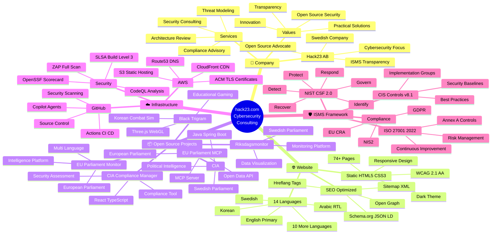
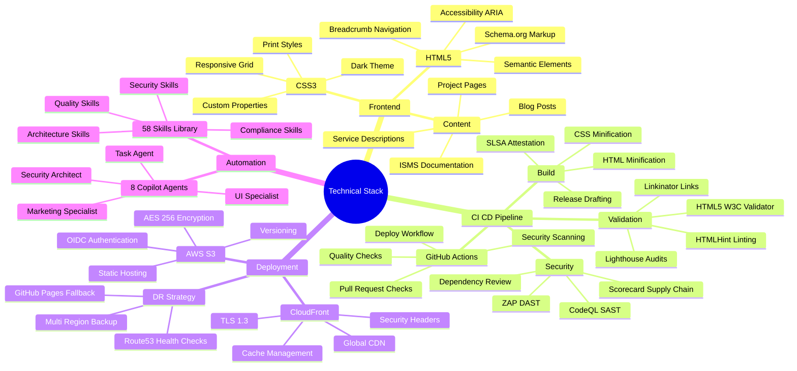
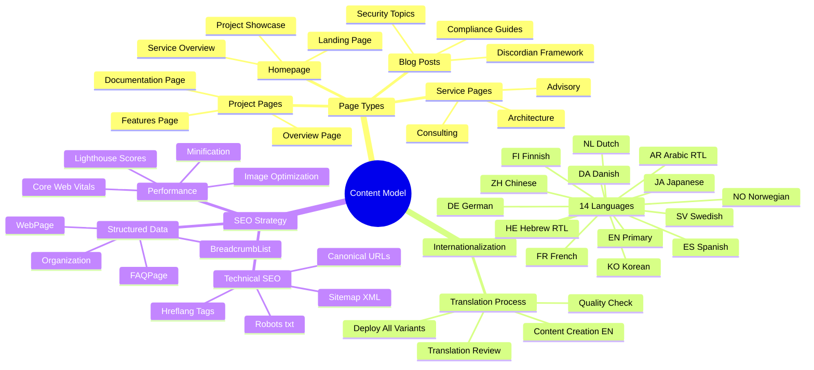

  

<h1 align="center">🧠 Hack23 Homepage — Concept Map</h1>

  <strong>System Conceptual Relationships and Overview</strong> 
  <em>Mindmap Documentation for hack23.com</em>

  
  
  
  

**📋 Document Owner:** CEO | **📄 Version:** 1.0 | **📅 Last Updated:** 2026-02-20 (UTC)
**🔄 Review Cycle:** Quarterly | **⏰ Next Review:** 2026-05-20
**🏷️ Classification:**   

---

## 📚 Related Documentation

| Document | Focus | Description |
|----------|-------|-------------|
| **[🏛️ Architecture](ARCHITECTURE.md)** | C4 Model | System structure and containers |
| **[📊 Data Model](DATA_MODEL.md)** | Data | Content model and data structures |
| **[🔄 Flowchart](FLOWCHART.md)** | Processes | CI/CD and content workflows |
| **[📈 State Diagram](STATEDIAGRAM.md)** | States | Deployment and content lifecycle |
| **[💼 SWOT](SWOT.md)** | Strategy | Strategic analysis |
| **[🚀 Future Mindmap](FUTURE_MINDMAP.md)** | Roadmap | Capability expansion plans |

---

## 🌐 Hack23 Homepage Overview

```mermaid
mindmap
  root((hack23.com<br/>Cybersecurity<br/>Consulting))
    🏢 Company
      Hack23 AB
        Swedish Company
        Cybersecurity Focus
        Open Source Advocate
        ISMS Transparency
      Services
        Security Consulting
        Compliance Advisory
        Architecture Review
        Threat Modeling
      Values
        Transparency
        Open Source Security
        Practical Solutions
        Innovation
    🌐 Website
      Static HTML5 CSS3
        74+ Pages
        Responsive Design
        WCAG 2.1 AA
        Dark Theme
      14 Languages
        English Primary
        Swedish
        Korean
        Arabic RTL
        10 More Languages
      SEO Optimized
        Schema.org JSON LD
        Open Graph
        Hreflang Tags
        Sitemap XML
    📦 Open Source Projects
      CIA
        Political Intelligence
        Swedish Parliament
        Java Spring Boot
      CIA Compliance Manager
        Security Assessment
        Compliance Tool
        React TypeScript
      Black Trigram
        Korean Combat Sim
        Three.js WebGL
        Educational Gaming
      EU Parliament MCP
        MCP Server
        European Parliament
        Open Data API
      Riksdagsmonitor
        Swedish Parliament
        Monitoring Platform
        Data Visualization
      EU Parliament Monitor
        European Parliament
        Intelligence Platform
        Multi Language
    ☁️ Infrastructure
      AWS
        S3 Static Hosting
        CloudFront CDN
        Route53 DNS
        ACM TLS Certificates
      GitHub
        Source Control
        Actions CI CD
        Security Scanning
        Copilot Agents
      Security
        SLSA Build Level 3
        OpenSSF Scorecard
        CodeQL Analysis
        ZAP Full Scan
    🛡️ ISMS Framework
      ISO 27001 2022
        Annex A Controls
        Risk Management
        Continuous Improvement
      NIST CSF 2.0
        Govern
        Identify
        Protect
        Detect
        Respond
        Recover
      CIS Controls v8.1
        Implementation Groups
        Security Baselines
        Best Practices
      Compliance
        GDPR
        NIS2
        EU CRA
```

---

## 🔧 Technical Architecture Concepts

```mermaid
mindmap
  root((Technical Stack))
    Frontend
      HTML5
        Semantic Elements
        Schema.org Markup
        Accessibility ARIA
        Breadcrumb Navigation
      CSS3
        Custom Properties
        Responsive Grid
        Dark Theme
        Print Styles
      Content
        Blog Posts
        Project Pages
        Service Descriptions
        ISMS Documentation
    CI CD Pipeline
      GitHub Actions
        Pull Request Checks
        Deploy Workflow
        Quality Checks
        Security Scanning
      Validation
        HTMLHint Linting
        HTML5 W3C Validator
        Linkinator Links
        Lighthouse Audits
      Security
        CodeQL SAST
        ZAP DAST
        Scorecard Supply Chain
        Dependency Review
      Build
        HTML Minification
        CSS Minification
        SLSA Attestation
        Release Drafting
    Deployment
      AWS S3
        Static Hosting
        Versioning
        AES 256 Encryption
        OIDC Authentication
      CloudFront
        Global CDN
        TLS 1.3
        Security Headers
        Cache Management
      DR Strategy
        GitHub Pages Fallback
        Route53 Health Checks
        Multi Region Backup
    Automation
      8 Copilot Agents
        Task Agent
        UI Specialist
        Marketing Specialist
        Security Architect
      58 Skills Library
        Security Skills
        Quality Skills
        Compliance Skills
        Architecture Skills
```

---

## 📝 Content Structure Concepts

```mermaid
mindmap
  root((Content Model))
    Page Types
      Homepage
        Landing Page
        Service Overview
        Project Showcase
      Project Pages
        Overview Page
        Features Page
        Documentation Page
      Blog Posts
        Security Topics
        Compliance Guides
        Discordian Framework
      Service Pages
        Consulting
        Advisory
        Architecture
    Internationalization
      14 Languages
        EN Primary
        SV Swedish
        KO Korean
        AR Arabic RTL
        DA Danish
        DE German
        ES Spanish
        FI Finnish
        FR French
        HE Hebrew RTL
        JA Japanese
        NL Dutch
        NO Norwegian
        ZH Chinese
      Translation Process
        Content Creation EN
        Translation Review
        Quality Check
        Deploy All Variants
    SEO Strategy
      Technical SEO
        Sitemap XML
        Robots txt
        Canonical URLs
        Hreflang Tags
      Structured Data
        Organization
        WebPage
        FAQPage
        BreadcrumbList
      Performance
        Lighthouse Scores
        Core Web Vitals
        Image Optimization
        Minification
```

---

## 📋 ISMS Compliance

This mindmap aligns with:

- 🔗 **[Secure Development Policy](https://github.com/Hack23/ISMS-PUBLIC/blob/main/Secure_Development_Policy.md)** — Development practices
- 🔗 **[Information Security Policy](https://github.com/Hack23/ISMS-PUBLIC/blob/main/Information_Security_Policy.md)** — Security governance
- 🔗 **[Compliance Checklist](https://github.com/Hack23/ISMS-PUBLIC/blob/main/Compliance_Checklist.md)** — Framework alignment
