# 🇳🇴 Norwegian (no) Translation Guide

**Version 6.0 - Expanded Hack23 Edition**  
*Last Updated: January 2026*

---

## 📋 Quick Reference

| Attribute | Value |
|-----------|-------|
| **Language Code** | `no` (Bokmål: `nb`, Nynorsk: `nn`) |
| **Locale** | `nb_NO` (Bokmål) |
| **Text Direction** | LTR (Left-to-Right) → |
| **Currency** | NOK (kr) |
| **Date Format** | `DD.MM.YYYY` or `DD. månednavn ÅÅÅÅ` |
| **Keyboard** | QWERTY with Æ, Ø, Å |

---

## 🔄 Visual Translation Workflow

```mermaid
graph LR
    A[Velg fil] --> B[Gjennomgå termer]
    B --> C[Oversett innhold]
    C --> D[Kvalitetskontroll]
    D --> E{Godkjent?}
    E -->|Ja| F[Publiser]
    E -->|Nei| C
```

## 🔄 Quality Standards Pyramid

```mermaid
graph TD
    L1[Fundament: Teknisk nøyaktighet]
    L2[Midt: Grammatikk og flyt]
    L3[Topp: Kulturell tilpasning]
    L1 --> L2 --> L3
```

---

## 📚 Comprehensive Vocabulary Reference

### 🔥 Brand & Key Entities (Never Translate)

| English | Norwegian | Notes |
|---------|-----------|-------|
| Hack23 | Hack23 | Company name – never translate |
| Hack23 AB | Hack23 AB | Swedish company designation |
| Citizen Intelligence Agency | Citizen Intelligence Agency | Project name – keep English |
| CIA Compliance Manager | CIA Compliance Manager | Product name – keep English |
| Black Trigram | Black Trigram | Game product – keep English |
| 흑괘 | 흑괘 | Korean name for Black Trigram |
| 黑卦 | 黑卦 | Chinese name for Black Trigram |
| James Pether Sörling | James Pether Sörling | Founder name |
| CISSP | CISSP | Certification |
| CISM | CISM | Certification |
| GitHub | GitHub | Platform name |
| LinkedIn | LinkedIn | Platform name |
| OpenSSF | OpenSSF | Open Source Security Foundation |
| CII Best Practices | CII Best Practices | Badge name |
| Riksdag | Riksdag | Swedish Parliament |

### 👔 Job Titles & Professional Roles

| English | Norwegian | Notes |
|---------|-----------|-------|
| CEO / Chief Executive Officer | Administrerende direktør | |
| Founder | Grunnlegger | |
| CEO/Founder | Administrerende direktør/grunnlegger | |
| Application Security Officer | Applikasjonssikkerhetsansvarlig | |
| Information Security Officer | Informasjonssikkerhetsansvarlig | |
| Senior Security Architect | Senior sikkerhetsarkitekt | |
| Cloud Architect | Skyarkitekt | |
| Security Consultant | Sikkerhetskonsulent | |
| CISO | CISO | Chief Information Security Officer |
| Compliance Officer | Complianceansvarlig | |
| Risk Manager | Risikoansvarlig | |
| IT Security Manager | IT-sikkerhetssjef | |
| Security Auditor | Sikkerhetsrevisor | |
| Taekwondo Instructor | Taekwondo-instruktør | |
| System Developer | Systemutvikler | |
| Software Engineer | Programvareingeniør | |
| J2EE Developer | J2EE-utvikler | |
| Unix Helpdesk | Unix-brukerstøtte | |
| Teaching Assistant | Undervisningsassistent | |
| NBC Defence Group Leader | ABC-verngruppeleder | Military role |

### 🏢 Hack23 Business & Services

| English | Norwegian | Notes |
|---------|-----------|-------|
| Cybersecurity Consulting Sweden | Cybersikkerhetsrådgivning Sverige | Main tagline |
| Public ISMS | Offentlig ISMS | Core differentiator |
| Open ISMS Transparency | Åpen ISMS-transparens | |
| Security Architecture & Strategy | Sikkerhetsarkitektur og -strategi | Service line |
| Cloud Security & DevSecOps | Skysikkerhet og DevSecOps | Service line |
| Secure Development & Code Quality | Sikker utvikling og kodekvalitet | Service line |
| Compliance & Regulatory | Overholdelse og regulering | Service line |
| Open Source Security | Åpen kildekode-sikkerhet | Service line |
| Security Culture & Training | Sikkerhetskultur og opplæring | Service line |
| Full-Stack Security | Full-stack sikkerhet | |
| Current Practitioner | Aktiv praktiker | Value proposition |
| Transparent Security | Transparent sikkerhet | |
| Developer-Friendly Security | Utviklervennlig sikkerhet | |
| Security Excellence Through Transparency | Sikkerhetsekspertise gjennom åpenhet | |
| OSPO | OSPO | Open Source Program Office |
| Gothenburg | Göteborg | City in Sweden |
| Sweden | Sverige | |
| Nordic Region | Norden | |
| Europe | Europa | |
| Singapore | Singapore | |
| ASEAN Region | ASEAN-regionen | |

### 🎮 Black Trigram Game Vocabulary

| English | Norwegian | Notes |
|---------|-----------|-------|
| Precision Combat Simulator | Presisjons kampsimulator | |
| Vital Points | Vitale punkter | |
| 70 Anatomical Vital Points | 70 anatomiske vitale punkter | |
| 70 Techniques | 70 teknikker | |
| Fighter Archetypes | Kjelpetyper | |
| Musa (Warrior) | Musa (kriger) | Keep Korean term |
| Amsalja (Assassin) | Amsalja (snikmorder) | Keep Korean term |
| Hacker | Hacker | |
| Jeongbo (Intelligence) | Jeongbo (etterretning) | Keep Korean term |
| Jojik (Organization) | Jojik (organisasjon) | Keep Korean term |
| Korean Martial Arts | Koreanske kampsporter | |
| Taekkyeon | Taekkyeon | Traditional Korean martial art |
| Hapkido | Hapkido | Korean martial art |
| Taekwondo | Taekwondo | Korean martial art |
| Song Moo Kwan | Song Moo Kwan | Taekwondo school |
| Kukkiwon | Kukkiwon | World Taekwondo HQ |
| Black Belt | Svart belte | |
| 3rd Dan | 3. dan | Rank |
| Cultural Preservation | Kulturell bevaring | |
| Educational Gaming | Pedagogisk gaming | |
| Unity Game | Unity-spill | |
| Steam | Steam | Platform name |
| itch.io | itch.io | Platform name |
| I Ching | I Ching | |
| Trigram | Trigram | |
| Fighting | Kamp | Game genre |
| Simulation | Simulering | Game genre |
| Educational | Pedagogisk | Game genre |
| Cultural | Kulturell | Game genre |
| Single-player | Enkeltspiller | |
| Multiplayer | Flerspiller | |
| Teen | Ungdom | Content rating |
| Cross-platform | Kryssplattform | |
| Open Source Game | Åpen kildekode-spill | |

### 🔍 Citizen Intelligence Agency Vocabulary

| English | Norwegian | Notes |
|---------|-----------|-------|
| Political Transparency | Politisk åpenhet | |
| Political Intelligence Platform | Politisk etterretningsplattform | |
| OSINT Platform | OSINT-plattform | |
| Parliamentary Monitoring | Parlamentsovervåking | |
| Swedish Parliament Monitoring (Riksdag) | Overvåking av svenske Riksdagen | |
| Political Decision Tracking | Sporing av politiske beslutninger | |
| Governance Metrics & Rankings | Styringsmålinger og rangeringer | |
| Democratic Accountability Analysis | Demokratisk ansvarlighetsanalyse | |
| Voting Records | Stemmeregistre | |
| Voting Pattern Analysis | Stemmemønsteranalyse | |
| Party Performance Metrics | Partiytelsesmålinger | |
| Minister Activity Tracking | Ministeraktivitetssporing | |
| Committee Work Analysis | Komitéarbeidsanalyse | |
| Political Trend Visualization | Visualisering av politiske trender | |
| Open Data Integration | Åpen data-integrasjon | |
| World Bank | Verdensbanken | |
| Swedish Government | Svenske regjeringen | |
| Accountability Metrics | Ansvarlighetsmålinger | |
| Open Data | Åpne data | |
| Civic Technology | Sivil teknologi | |
| Swedish Parliament | Svenske Riksdagen | |
| Data Visualization | Datavisualisering | |
| Political Analytics | Politisk analyse | |
| Citizens | Borgere | Audience |
| Journalists | Journalister | Audience |
| Researchers | Forskere | Audience |
| Policy Analysts | Politiske analytikere | Audience |
| Political Scientists | Statsvitere | Audience |
| Democracy Advocates | Demokratiforkjempere | Audience |
| Parliamentary Process Analysis | Parlamentarisk prosessanalyse | |
| OSINT Methodology | OSINT-metodologi | |
| Swedish Governance System | Svensk styringssystem | |
| Data-Driven Political Analysis | Datadrevet politisk analyse | |
| Open Government Data Usage | Bruk av åpne offentlige data | |

### 🔐 CIA Compliance Manager Vocabulary

| English | Norwegian | Notes |
|---------|-----------|-------|
| Security Assessment Platform | Sikkerhetsvurderingsplattform | |
| Enterprise Security Management | Bedriftssikkerhetsstyring | |
| CIA Triad Assessment | CIA-triade-vurdering | |
| Business Impact Analysis | Forretningspåvirkningsanalyse | |
| Multi-Framework Compliance | Fler-rammeverks samsvar | |
| STRIDE Analysis | STRIDE-analyse | Threat model |
| Threat Modeling | Trusselmodellering | |
| Evidence Collection | Bevisinnsamling | |
| Automated Compliance Reporting | Automatisert samsvarsrapportering | |
| Risk Register | Risikoregister | |
| Controls Monitoring | Kontrollsovervåking | |
| CRA Assessment | CRA-vurdering | Cyber Resilience Act |
| Security Level Selection | Valg av sikkerhetsnivå | |
| Cost Estimation | Kostnadsestimering | |
| Implementation Guidance | Implementeringsveiledning | |
| Gap Analysis | Gapanalyse | |
| Security Visualization | Sikkerhetsvisualisering | |
| Widget-Based Dashboard | Widgetbasert dashbord | |
| Availability Impact Analysis | Tilgjengelighetskonsekvensanalyse | |
| Integrity Impact Analysis | Integritetskonsekvensanalyse | |
| Confidentiality Impact Analysis | Konfidensialitetskonsekvensanalyse | |
| Open Source Security Tool | Åpen kildekode-sikkerhetsverktøy | |

### 🎓 Education & Learning Terms

| English | Norwegian | Notes |
|---------|-----------|-------|
| Educational Use | Pedagogisk bruk | |
| Self-Directed Learning | Selvdrevet læring | |
| Skill Development | Ferdighetsutvikling | |
| Professional Development | Faglig utvikling | |
| Teaches | Underviser | Schema.org property |
| Accessibility Features | Tilgjengelighetsfunksjoner | |
| Keyboard Navigation | Tastaturnavigasjon | |
| High Contrast Mode | Høykontrastmodus | |
| Closed Captions | Undertekster | |
| Screen Reader Compatible | Skjermleserkompatibel | |

### 🍎 Discordian Philosophy & ISMS Blog

### 🍎 Discordian Philosophy & ISMS Blog

| English | Norwegian | Notes |
|---------|-----------|-------|
| Think for Yourself | Tenk selv | Core motto |
| Question Authority | Utfordre autoriteter | |
| FNORD | FNORD | Never translate |
| Nothing is True | Ingenting er sant | |
| Everything is Permitted | Alt er tillatt | |
| Security Theater | Sikkerhetsteater | Fake security |
| Radical Transparency | Radikal åpenhet | |
| Chapel Perilous | Chapel Perilous | Keep English |
| Operation Mindfuck | Operation Mindfuck | Keep English |
| Illuminatus Trilogy | Illuminatus-trilogien | |
| Eris | Eris | Goddess of Chaos |
| Discordia | Discordia | |
| Law of Fives | De fems lov | |
| Sacred Geometry | Hellig geometri | |
| Five-Layer Architecture | Femlags arkitektur | |
| Nation-State Surveillance | Statlig overvåking | |
| Crypto Backdoors | Kryptobakdører | |
| Security Through Obscurity | Sikkerhet gjennom uklarhet | Anti-pattern |
| Information Hoarding | Informasjonshamstring | |
| Knowledge Transparency | Kunnskapsåpenhet | |
| Simon Moon | Simon Moon | Character reference |
| Hagbard Celine | Hagbard Celine | Character reference |
| George Dorn | George Dorn | Character reference |

### 🧭 Navigation & UI Elements

| English | Norwegian |
|---------|-----------|
| Home | Hjem |
| About Us | Om oss |
| Services | Tjenester |
| Products | Produkter |
| Projects | Prosjekter |
| Contact | Kontakt |
| Blog | Blogg |
| Search | Søk |
| Menu | Meny |
| Close | Lukk |
| Back | Tilbake |
| Next | Neste |
| Previous | Forrige |
| Submit | Send inn |
| Cancel | Avbryt |
| **Expand All** | **Utvid alle** |
| **Collapse All** | **Skjul alle** |
| Download | Last ned |
| Read More | Les mer |
| View Details | Se detaljer |
| Privacy Policy | Personvernserklæring |
| Terms of Service | Vilkår for bruk |
| Copyright | Opphavsrett |
| Sitemap | Nettstedskart |
| FAQ | Ofte stilte spørsmål |
| Why Hack23 | Hvorfor Hack23 |
| Accessibility Statement | Tilgjengelighetserklæring |
| Language | Språk |
| Share | Del |
| Print | Skriv ut |
| Save | Lagre |
| Edit | Rediger |
| Delete | Slett |
| Confirm | Bekreft |
| Loading | Laster |
| Error | Feil |
| Success | Suksess |
| Warning | Advarsel |

### 🔐 CIA Triad & Core Security Principles

| English | Norwegian | Notes |
|---------|-----------|-------|
| CIA Triad | CIA-triaden | |
| CIA+ Framework | CIA+-rammeverk | Extended framework |
| **Confidentiality** | **Konfidensialitet** | Data protection |
| **Integrity** | **Integritet** | Data accuracy |
| **Availability** | **Tilgjengelighet** | System uptime |
| Non-Repudiation | Ikke-fornektelse | |
| Authentication | Autentisering | |
| Authorization | Autorisasjon | |

### 🔒 Security & Cybersecurity Terminology

| English | Norwegian | Notes |
|---------|-----------|-------|
| Cybersecurity | Cybersikkerhet | |
| Information Security | Informasjonssikkerhet | |
| ISMS | ISMS | |
| Security Policy | Sikkerhetspolicy | |
| Risk Management | Risikostyring | |
| Risk Assessment | Risikovurdering | |
| Threat | Trussel | |
| Vulnerability | Sårbarhet | |
| Exploit | Utnyttelse | |
| Patch | Oppdatering | |
| Firewall | Brannmur | |
| Encryption | Kryptering | |
| Decryption | Dekryptering | |
| Access Control | Tilgangskontroll | |
| Multi-Factor Authentication (MFA) | Flerfaktor-autentisering | |
| Single Sign-On (SSO) | Enkel pålogging | |
| Phishing | Phishing | |
| Ransomware | Løsepengevirus | |
| Malware | Skadevare | |
| Zero Trust | Null tillit | |
| Defense in Depth | Dybdeforsvar | |
| Least Privilege | Minste privilegium | |
| Incident Response | Hendelseshåndtering | |
| Data Breach | Datainnbrudd | |
| Penetration Test | Penetrasjonstest | |
| Audit | Revisjon | |
| Compliance | Samsvar / Etterlevelse | |
| Governance | Styring | |
| Security Awareness | Sikkerhetsbevissthet | |
| Backup | Sikkerhetskopiering | |
| Disaster Recovery | Katastrofegjenoppretting | |
| Business Continuity | Forretningskontinuitet | |
| Supply Chain Security | Forsyningskjedesikkerhet | |
| SLSA Level 3 | SLSA nivå 3 | Supply chain security |
| Container Security | Containersikkerhet | |
| Serverless Security | Serverløs sikkerhet | |
| API Security | API-sikkerhet | |
| Endpoint Security | Endepunktsikkerhet | |

### 🏛️ Regulatory & Standards

| English | Norwegian | Notes |
|---------|-----------|-------|
| ISO 27001 | ISO 27001 | Keep as-is |
| ISO 27001:2022 | ISO 27001:2022 | |
| GDPR | GDPR / Personvernforordningen | EU regulation |
| NIS2 | NIS2-direktivet | EU directive |
| NIST CSF | NIST Cybersecurity Framework | |
| CIS Controls | CIS-kontroller | |
| SOC2 | SOC2 | |
| HIPAA | HIPAA | US healthcare |
| EU Cyber Resilience Act (CRA) | EUs lov om cyberresiliens | |
| Annex A Controls | Vedlegg A-kontroller | ISO 27001 |
| Statement of Applicability | Anvendelighetserklæring | |
| NSM | Nasjonal sikkerhetsmyndighet | Norwegian security authority |
| Datatilsynet | Datatilsynet | Norwegian DPA |

### 💼 Business & Professional Terms

| English | Norwegian |
|---------|-----------|
| Consulting | Rådgivning |
| Enterprise | Virksomhet |
| Strategy | Strategi |
| Certification | Sertifisering |
| Assessment | Vurdering |
| Implementation | Implementering |
| Audit | Revisjon |
| Review | Gjennomgang |
| Gap Analysis | Gap-analyse |
| Roadmap | Veikart |
| Best Practices | Beste praksis |
| Case Study | Casestudie |
| ROI | Avkastning på investering |
| KPI | Nøkkelindikatorer |
| SLA | Tjenesteavtale |
| Stakeholder | Interessent |
| Deliverable | Leveranse |
| Milestone | Milepæl |

### 📝 Blog Post Categories

| English | Norwegian |
|---------|-----------|
| Security Architecture | Sikkerhetsarkitektur |
| ISMS Policies | ISMS-policyer |
| Compliance Frameworks | Samsvarsrammeverk |
| Threat Modeling | Trusselmodellering |
| Secure Development | Sikker utvikling |
| Cloud Security | Skysikkerhet |
| Access Control | Tilgangskontroll |
| Cryptography | Kryptografi |
| Incident Response | Hendelseshåndtering |
| Vulnerability Management | Sårbarhetshåndtering |
| Asset Management | Aktivumforvaltning |
| Network Security | Nettverkssikkerhet |
| Email Security | E-postsikkerhet |
| Physical Security | Fysisk sikkerhet |
| Mobile Device Security | Mobilenhetssikkerhet |
| Remote Access Security | Fjerntilgangssikkerhet |
| Monitoring & Logging | Overvåking og logging |
| Security Metrics | Sikkerhetsmålinger |
| Third Party Risk | Tredjeparts risiko |
| Change Management | Endringshåndtering |

### 🏭 Industry-Specific Terms

| English | Norwegian |
|---------|-----------|
| Investment & FinTech | Investering og FinTech |
| Betting & Gaming | Betting og spill |
| Cannabis Security | Cannabissikkerhet |
| Healthcare | Helsevesen |
| Government | Offentlig sektor |
| Critical Infrastructure | Kritisk infrastruktur |
| Financial Services | Finansielle tjenester |
| E-commerce | E-handel |

---

## 🔤 Norwegian-Specific Guidelines

### Language Variants
- **Bokmål**: Primary variant for business communication
- **Nynorsk**: Alternative variant (consider if targeting specific regions)
- This guide uses Bokmål

### Compound Words
- Norwegian creates compound words freely
- Keep compounds together: "sikkerhetsarkitektur" not "sikkerhets arkitektur"

### Special Characters
- Æ/æ, Ø/ø, Å/å are sorted at the end of the alphabet
- Ensure proper encoding (UTF-8)

### Formal Tone
- Use polite "du" (informal you) which is standard in Norwegian
- Avoid overly formal language – Norwegian business language is relatively informal

---

## ✅ Translation Checklist

- [ ] `<html lang="no">` attribute set (or `nb` for Bokmål)
- [ ] `<title>` translated
- [ ] `<meta name="description">` translated
- [ ] `og:locale` set to `nb_NO`
- [ ] All hreflang tags present (14 languages)
- [ ] Navigation menu translated
- [ ] Footer translated
- [ ] Brand names kept in English
- [ ] Compound words properly formed
- [ ] Special characters (Æ, Ø, Å) display correctly

---

## 📝 Notes

- Norwegian is closely related to **Swedish** and **Danish** – leverage similarities
- NSM (Nasjonal sikkerhetsmyndighet) is the Norwegian security authority
- Datatilsynet is the Norwegian Data Protection Authority
- Be consistent with either Bokmål or Nynorsk throughout

---

*23 FNORD 5*
