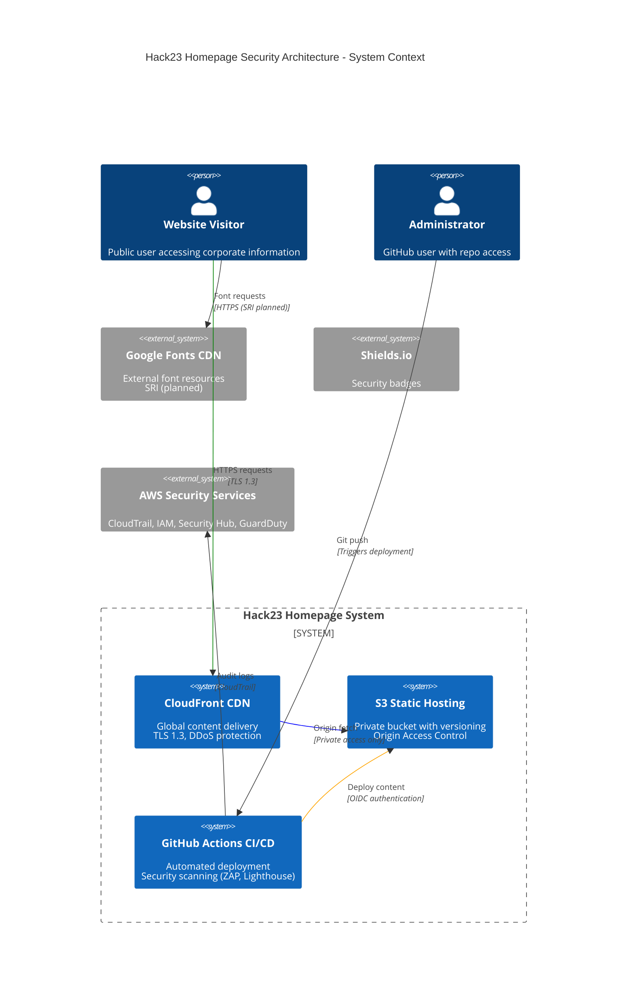
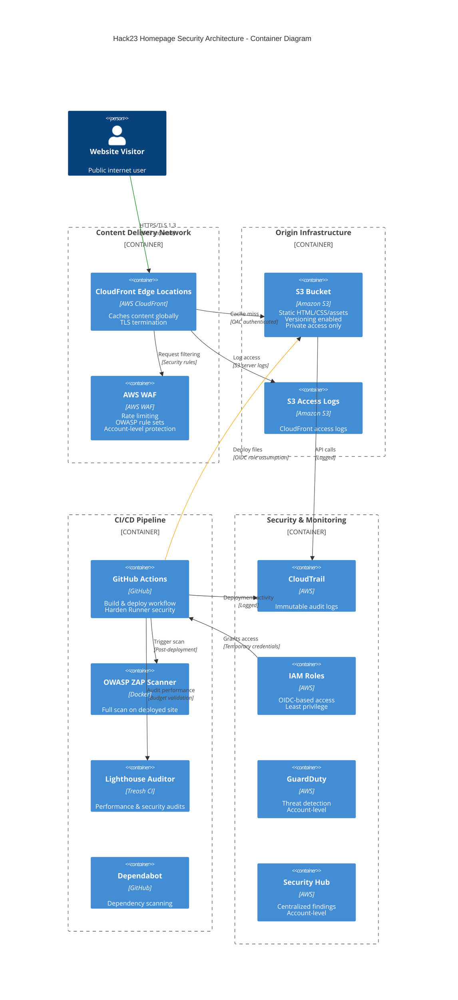
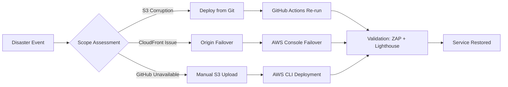
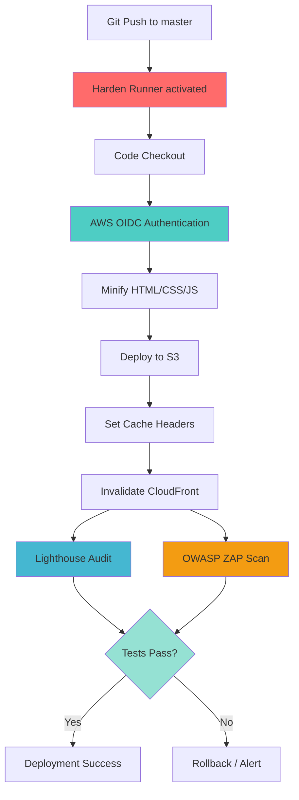
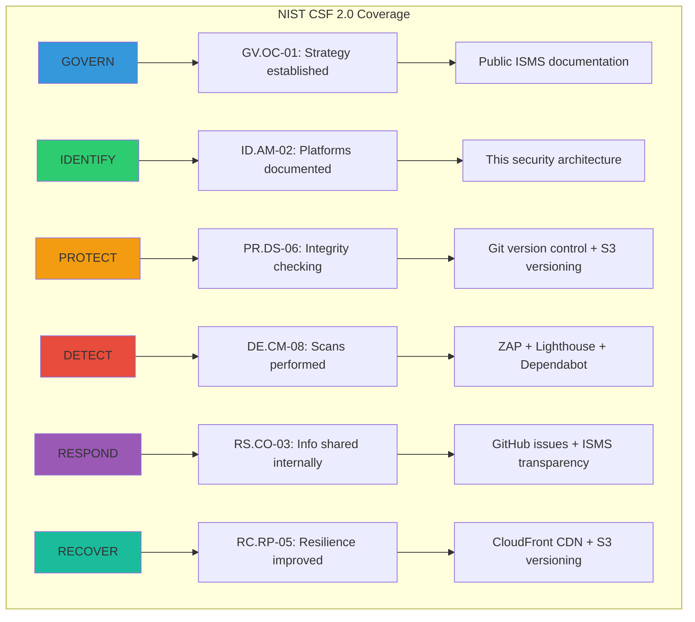
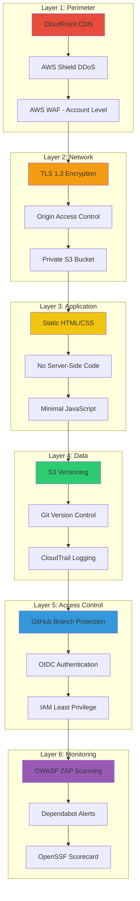

<p align="center">
  
</p>

<h1 align="center">🛡️ Hack23 Homepage — Security Architecture</h1>

<p align="center">
  <strong>Static Website Security Architecture: AWS S3 + CloudFront</strong><br>
  <em>Public Transparency Platform for Cybersecurity Consulting</em>
</p>

<p align="center">
  <a href="#"></a>
  <a href="#"></a>
  <a href="#"></a>
  <a href="#"></a>
</p>


[](https://scorecard.dev/viewer/?uri=github.com/Hack23/homepage)
[](https://github.com/Hack23/homepage/actions/workflows/main.yml)

**📋 Document Owner:** CEO | **📄 Version:** 1.0 | **📅 Last Updated:** 2025-11-17 (UTC)  
**🔄 Review Cycle:** Quarterly | **⏰ Next Review:** 2026-02-17  
**🏷️ Classification:** [](https://github.com/Hack23/ISMS-PUBLIC/blob/main/CLASSIFICATION.md#confidentiality-levels)

---

## 📑 Table of Contents

- [🏗️ Architecture Overview](#-architecture-overview)
- [🎨 C4 Architecture Diagram](#-c4-architecture-diagram)
- [🔐 Authentication & Authorization](#-authentication--authorization)
- [📜 Data Integrity & Auditing](#-data-integrity--auditing)
- [🌐 Network Security & Perimeter Protection](#-network-security--perimeter-protection)
- [🔍 Security Monitoring & Vulnerability Management](#-security-monitoring--vulnerability-management)
- [🔒 Application Security](#-application-security)
- [⚡ High Availability & Resilience](#-high-availability--resilience)
- [☁️ AWS Security Infrastructure](#-aws-security-infrastructure)
- [🔄 CI/CD Security](#-cicd-security)
- [📋 Compliance Framework](#-compliance-framework)
- [🛡️ Defense-in-Depth Strategy](#-defense-in-depth-strategy)
- [📊 Security Metrics & Evidence](#-security-metrics--evidence)

---

## 🏗️ Architecture Overview

### System Purpose

The Hack23 AB corporate homepage serves as a **public-facing transparency platform** demonstrating cybersecurity consulting expertise through comprehensive ISMS documentation and showcasing open-source security projects. This static website embodies our commitment to security through transparency.

### Technology Stack

| Component | Technology | Purpose |
|-----------|-----------|---------|
| **Frontend** | Static HTML5/CSS3 | Minimal attack surface, no server-side code |
| **Styling** | Single CSS file (`styles.css`) | Consistent design, easy security review |
| **JavaScript** | Minimal/None | Reduced XSS attack surface |
| **Hosting** | AWS S3 (Private Bucket) | Static content storage with versioning |
| **CDN** | AWS CloudFront | Global content delivery, DDoS protection |
| **CI/CD** | GitHub Actions | Automated deployment with security scanning |
| **External Resources** | Google Fonts CDN | Performance optimization; SRI (planned) |

### System Classification

Per [Hack23 ISMS Classification Framework](https://github.com/Hack23/ISMS-PUBLIC/blob/main/CLASSIFICATION.md):

**🎯 Project Classification:**
- **Type:** [](https://github.com/Hack23/ISMS-PUBLIC/blob/main/CLASSIFICATION.md#project-type-classifications)
- **Process:** [](https://github.com/Hack23/ISMS-PUBLIC/blob/main/CLASSIFICATION.md#project-type-classifications)

**🔒 Security Classification:**

| Dimension | Level | Rationale |
|-----------|-------|-----------|
| **🔐 Confidentiality** | [](https://github.com/Hack23/ISMS-PUBLIC/blob/main/CLASSIFICATION.md#confidentiality-levels) | Public corporate website, no sensitive data |
| **🔒 Integrity** | [](https://github.com/Hack23/ISMS-PUBLIC/blob/main/CLASSIFICATION.md#integrity-levels) | Reputation-critical but tolerates brief defacement |
| **⚡ Availability** | [](https://github.com/Hack23/ISMS-PUBLIC/blob/main/CLASSIFICATION.md#availability-levels) | Marketing site, 99% SLA target acceptable |

**⏱️ Business Continuity:**
- **RTO:** [-lightgrey?style=for-the-badge&logo=clock&logoColor=black)](https://github.com/Hack23/ISMS-PUBLIC/blob/main/CLASSIFICATION.md#rto-classifications)
- **RPO:** [-lightgrey?style=for-the-badge&logo=database&logoColor=black)](https://github.com/Hack23/ISMS-PUBLIC/blob/main/CLASSIFICATION.md#rpo-classifications)

**Detailed Recovery Objectives:**
- **RPO (Recovery Point Objective):** Extended - Daily backups via Git version control acceptable
- **RTO (Recovery Time Objective):** Standard - Scheduled recovery within 72 hours acceptable

---

## 🎨 C4 Architecture Diagram





---

## 🔐 Authentication & Authorization

### Public Access Model

As a **public static website**, the Hack23 homepage intentionally has **no authentication layer** for visitors. This design choice aligns with the system's purpose as a transparency platform.

**Access Control Strategy:**

| Actor | Access Method | Controls |
|-------|--------------|----------|
| **Public Visitors** | CloudFront CDN (HTTPS) | No authentication required |
| **GitHub Contributors** | GitHub repository access | Branch protection, required reviews |
| **CI/CD Pipeline** | AWS OIDC federation | Short-lived credentials, least privilege IAM |
| **AWS Console Access** | AWS IAM Users/Roles | MFA required, root account secured |

### Repository Access Controls

**GitHub Security:**
- ✅ Branch protection on `master` branch
- ✅ Required status checks (ZAP scan, Lighthouse audit)
- ✅ Code review requirements per [Secure Development Policy](https://github.com/Hack23/ISMS/blob/main/Secure_Development_Policy.md)
- ✅ GitHub Advanced Security features enabled
- ✅ Dependabot alerts and security updates
- ✅ Secret scanning enabled

**ISMS Policy Mapping:**
- [Access Control Policy](https://github.com/Hack23/ISMS-PUBLIC/blob/main/Access_Control_Policy.md) - Repository access controls
- [Secure Development Policy](https://github.com/Hack23/ISMS/blob/main/Secure_Development_Policy.md) - Code review requirements

---

## 📜 Data Integrity & Auditing

### Version Control & Change Tracking

**Git-Based Audit Trail:**
- ✅ All changes tracked via Git commits with author attribution
- ✅ Commit signing recommended (GPG keys)
- ✅ Immutable commit history on `master` branch
- ✅ Pull request workflow with review evidence

**S3 Versioning:**
```
S3 Bucket: amazon-cloudfront-secure-static-site-s3bucketroot-14oliw5cmta06
- Versioning: ENABLED
- Lifecycle: Retention policy for deleted objects
- Access: Private (OAC only)
```

### AWS CloudTrail Logging

**Immutable Audit Logs:**
- ✅ CloudTrail enabled for all S3 API calls
- ✅ S3 deployment actions logged (PutObject, DeleteObject)
- ✅ IAM role assumption events captured
- ✅ Log integrity validation enabled
- ✅ Multi-region trail for comprehensive coverage

**Audit Log Retention:**
- **S3 Access Logs:** 90 days minimum
- **CloudTrail Logs:** 1 year minimum, 7 years for compliance
- **GitHub Actions Logs:** 90 days (GitHub retention)

**ISMS Policy Mapping:**
- [Monitoring & Logging Policy](https://github.com/Hack23/ISMS-PUBLIC/blob/main/Monitoring_Logging_Policy.md) - Audit requirements
- [Change Management Policy](https://github.com/Hack23/ISMS/blob/main/Change_Management_Policy.md) - Deployment tracking

**Implementation Evidence:**
- [GitHub Actions Workflow: main.yml](https://github.com/Hack23/homepage/blob/master/.github/workflows/main.yml) - Deployment automation

---

## 🌐 Network Security & Perimeter Protection

### AWS CloudFront CDN

**Global Content Delivery with Security:**

| Security Feature | Implementation | Benefit |
|-----------------|----------------|---------|
| **TLS 1.3 Support** | Enabled on CloudFront distribution | Modern encryption, forward secrecy |
| **Security Headers** | Configured via CloudFront response headers policy | CSP, HSTS, X-Frame-Options protection |
| **Origin Access Control (OAC)** | S3 bucket private, OAC policy | S3 bucket not publicly accessible |
| **DDoS Protection** | AWS Shield Standard (included) | Automatic layer 3/4 protection |
| **WAF Protection** | AWS WAF at account level | OWASP rule sets, rate limiting |
| **Geo-Restrictions** | None (global access) | Transparency platform for all regions |
| **Custom Error Pages** | User-friendly 404/403 | Security through obscurity avoidance |

**Cache Control Strategy:**
```bash
# HTML files: Short cache (1 hour) for dynamic updates
Cache-Control: public, max-age=3600, must-revalidate

# CSS/JS/Images: Long cache (1 year) for static assets
Cache-Control: public, max-age=31536000, immutable

# Fonts: Long cache with CORS headers
Cache-Control: public, max-age=31536000, immutable
Access-Control-Allow-Origin: https://hack23.com
```

### HTTP Security Headers

**Implemented Security Headers** (via CloudFront response headers policy):

```http
Content-Security-Policy: default-src 'self'; 
  script-src 'self' 'unsafe-inline'; 
  style-src 'self' 'unsafe-inline' https://fonts.googleapis.com; 
  font-src 'self' https://fonts.gstatic.com; 
  img-src 'self' https: data:; 
  connect-src 'self'

Strict-Transport-Security: max-age=31536000; includeSubDomains; preload
X-Content-Type-Options: nosniff
X-Frame-Options: DENY
Referrer-Policy: strict-origin-when-cross-origin
Permissions-Policy: geolocation=(), microphone=(), camera=()
```

**ISMS Policy Mapping:**
- [Network Security Policy](https://github.com/Hack23/ISMS-PUBLIC/blob/main/Network_Security_Policy.md) - CDN and TLS requirements
- [Cryptography Policy](https://github.com/Hack23/ISMS-PUBLIC/blob/main/Cryptography_Policy.md) - TLS 1.3 standards

**Implementation Evidence:**
- CloudFront response headers policy configured at account level
- WAF rules applied via AWS WAF Web ACL
- Security headers verified via security scanning tools

### Subresource Integrity (SRI)

**External Resource Verification:**

```html
<!-- Google Fonts with SRI (planned) -->
<link rel="stylesheet" 
      href="https://fonts.googleapis.com/css2?family=Inter:wght@400;500;600;700&family=Orbitron:wght@400;500;600;700&family=Share+Tech+Mono&display=swap"
      integrity="sha384-HASH_VALUE_HERE"
      crossorigin="anonymous">
```

**Benefits:**
- ✅ Verify integrity of external CDN resources
- ✅ Protect against compromised third-party CDNs
- ✅ Detect unauthorized modifications to external assets

---

## 🔍 Security Monitoring & Vulnerability Management

### Automated Security Scanning

**GitHub Actions Security Pipeline:**

```yaml
# Security scanning workflow components:
1. Harden Runner (StepSecurity)
   - Network egress filtering
   - Process monitoring
   - Allowed endpoints whitelist

2. OWASP ZAP Full Scan
   - Docker: ghcr.io/zaproxy/zaproxy:stable
   - Target: https://hack23.com/
   - Post-deployment validation

3. Lighthouse CI Audits
   - Performance budgets
   - Accessibility checks
   - SEO validation
   - Best practices audit
   - Budget file: budget.json

4. Dependency Scanning
   - Dependabot: Daily scans
   - GitHub Advanced Security
   - Automatic PRs for updates
```

**ISMS Policy Mapping:**
- [Vulnerability Management Policy](https://github.com/Hack23/ISMS-PUBLIC/blob/main/Vulnerability_Management_Policy.md) - Scanning requirements
- [Secure Development Policy](https://github.com/Hack23/ISMS/blob/main/Secure_Development_Policy.md) - CI/CD security gates

### Dependabot Configuration

**Automated Dependency Updates:**
- ✅ **Daily scans** for GitHub Actions dependencies
- ✅ **Automatic PRs** for security updates
- ✅ **Grouping strategy** for non-breaking updates
- ✅ **Security advisory integration** via GitHub Security Advisories

**Vulnerability SLA:**

| Severity | Detection | Remediation Target | Escalation |
|----------|-----------|-------------------|------------|
| **Critical** | Real-time | 24 hours | CEO notification |
| **High** | Daily | 7 days | Weekly review |
| **Medium** | Weekly | 30 days | Monthly review |
| **Low** | Weekly | 90 days | Quarterly review |

### Security Scorecard

**OpenSSF Best Practices:**

[](https://scorecard.dev/viewer/?uri=github.com/Hack23/homepage)

**Monitored Security Practices:**
- ✅ Branch protection enabled
- ✅ Code review requirements
- ✅ Signed commits recommended
- ✅ Dependency update automation
- ✅ Vulnerability disclosure policy
- ✅ Security policy (SECURITY.md)
- ✅ Token permissions restricted
- ✅ Pinned dependencies (GitHub Actions)

**Implementation Evidence:**
- [Scorecard Workflow: scorecards.yml](https://github.com/Hack23/homepage/blob/master/.github/workflows/scorecards.yml)
- [OpenSSF Scorecard Results](https://scorecard.dev/viewer/?uri=github.com/Hack23/homepage)

---

## 🔒 Application Security

### Static Content Security

**Minimal Attack Surface:**

| Security Layer | Implementation | Threat Mitigation |
|----------------|----------------|-------------------|
| **No Server-Side Code** | Pure HTML/CSS static files | No code injection, no RCE vulnerabilities |
| **Minimal JavaScript** | Inline JS only where needed | Reduced XSS attack surface |
| **No User Input** | Read-only public website | No injection attacks (SQLi, XSS, CSRF) |
| **No Authentication** | Public content by design | No auth bypass or session attacks |
| **No Database** | Static files only | No SQL injection or data breaches |

### Content Minification

**Automated Asset Optimization:**

```yaml
# Minify Action in GitHub Workflow
- name: Minify Action
  uses: dra1ex/minify-action@3c54a82e092a78c827659385d1be715126f13410 # v1.0.3

# Benefits:
- Reduced file sizes (performance)
- Removed comments (information disclosure prevention)
- Obfuscation side-effect (minor security benefit)
```

### File Integrity

**Git-Based Integrity Verification:**
- ✅ All source files version-controlled in Git
- ✅ SHA-256 commit hashing for tamper detection
- ✅ S3 versioning for deployed file history
- ✅ CloudTrail logs for modification tracking

**Planned Enhancements:**
- [ ] Content hashing for cache-busting and integrity verification
- [ ] CSP nonces for inline scripts
- [ ] SRI for all external resources

**ISMS Policy Mapping:**
- [Secure Development Policy](https://github.com/Hack23/ISMS/blob/main/Secure_Development_Policy.md) - Code integrity requirements

---

## ⚡ High Availability & Resilience

### CloudFront Global Distribution

**Multi-Region Content Delivery:**

| Feature | Implementation | Availability Benefit |
|---------|----------------|---------------------|
| **Edge Locations** | 450+ global PoPs | Low-latency access worldwide |
| **Origin Failover** | Planned secondary origin | Automatic failover on origin errors |
| **Health Checks** | CloudFront automatic | Detection of origin failures |
| **DDoS Protection** | AWS Shield Standard | Always-on protection against attacks |
| **Rate Limiting** | AWS WAF at account level | Protection against abuse |

### S3 Durability & Availability

**AWS S3 Standard Storage Class:**
- ✅ **99.999999999% (11 9's) durability** annually
- ✅ **99.99% availability** SLA
- ✅ **Cross-AZ replication** automatic
- ✅ **Versioning enabled** for data protection
- ✅ **Lifecycle policies** for cost optimization

**Backup Strategy:**
- **Primary:** Git repository (GitHub) - source of truth
- **Secondary:** S3 versioning - deployed file history
- **Tertiary:** CloudTrail logs - audit trail
- **Recovery:** Automated re-deployment from Git

### Disaster Recovery

**Recovery Procedures:**



**RTO/RPO Alignment:**
- **RPO (Recovery Point Objective):** Daily Git commits
- **RTO (Recovery Time Objective):** <72 hours (acceptable for static marketing site)
- **Data Loss Tolerance:** Maximum 24 hours of content updates

**ISMS Policy Mapping:**
- [Business Continuity Plan](https://github.com/Hack23/ISMS-PUBLIC/blob/main/Business_Continuity_Plan.md) - DR procedures
- [Backup & Recovery Policy](https://github.com/Hack23/ISMS-PUBLIC/blob/main/Backup_Recovery_Policy.md) - Backup requirements

---

## ☁️ AWS Security Infrastructure

### IAM Security

**OIDC Federation for GitHub Actions:**

```yaml
# No long-lived credentials stored in GitHub Secrets
Role ARN: arn:aws:iam::172017021075:role/GithubWorkFlowRole
Authentication: OIDC token-based (AWS STS)
Session Duration: 1 hour (short-lived)
Permissions: Least privilege (S3 + CloudFront only)
```

**IAM Policy Highlights:**

```json
{
  "Effect": "Allow",
  "Action": [
    "s3:PutObject",
    "s3:GetObject",
    "s3:ListBucket",
    "s3:PutObjectAcl"
  ],
  "Resource": [
    "arn:aws:s3:::amazon-cloudfront-secure-static-site-s3bucketroot-14oliw5cmta06/*"
  ]
}
```

**Security Benefits:**
- ✅ No static AWS access keys in GitHub
- ✅ Automatic credential rotation (hourly)
- ✅ Scope-limited permissions
- ✅ CloudTrail logging of all actions

### S3 Bucket Security

**Private Bucket with OAC:**

| Control | Implementation | Security Benefit |
|---------|----------------|------------------|
| **Public Access Block** | All settings enabled | Prevent accidental public exposure |
| **Origin Access Control** | CloudFront-only access | S3 bucket not directly accessible |
| **Versioning** | Enabled | Rollback capability, audit trail |
| **Encryption at Rest** | S3-managed keys (SSE-S3) | Data protection at rest |
| **Access Logging** | Enabled to separate bucket | Audit trail of all access |
| **MFA Delete** | Planned | Prevent accidental data loss |

**Bucket Policy Example:**

```json
{
  "Version": "2012-10-17",
  "Statement": [
    {
      "Sid": "AllowCloudFrontServicePrincipalReadOnly",
      "Effect": "Allow",
      "Principal": {
        "Service": "cloudfront.amazonaws.com"
      },
      "Action": "s3:GetObject",
      "Resource": "arn:aws:s3:::bucket-name/*",
      "Condition": {
        "StringEquals": {
          "AWS:SourceArn": "arn:aws:cloudfront::account-id:distribution/dist-id"
        }
      }
    }
  ]
}
```

### CloudTrail Audit Logging

**Comprehensive API Logging:**
- ✅ All AWS API calls logged
- ✅ S3 data events captured
- ✅ Log file integrity validation
- ✅ Multi-region trail enabled
- ✅ Immutable log storage (S3 Object Lock planned)

### AWS Account-Level Security Services

**Implemented Security Services:**

| Service | Purpose | Implementation | Benefit |
|---------|---------|----------------|---------|
| **AWS GuardDuty** | Threat detection | Enabled at account level | Intelligent threat detection across all resources |
| **AWS Security Hub** | Centralized security findings | Enabled at account level | Aggregates findings from GuardDuty, Config, and other services |
| **AWS Inspector** | Vulnerability assessment | Enabled at account level | Automated security assessments for EC2 and container workloads |
| **Amazon Detective** | Security investigation | Enabled at account level | Analyze and investigate potential security issues |

**Benefits:**
- ✅ Continuous security monitoring across all AWS resources
- ✅ Automated threat detection and alerting
- ✅ Centralized security posture management
- ✅ Compliance framework alignment (CIS AWS Foundations, PCI DSS)
- ✅ Integration with SIEM and incident response workflows

**ISMS Policy Mapping:**
- [Cloud Security Policy](https://github.com/Hack23/ISMS-PUBLIC/blob/main/Cloud_Security_Policy.md) - AWS security controls
- [Access Control Policy](https://github.com/Hack23/ISMS-PUBLIC/blob/main/Access_Control_Policy.md) - IAM requirements

---

## 🔄 CI/CD Security

### GitHub Actions Hardening

**StepSecurity Harden Runner:**

```yaml
- name: Harden Runner
  uses: step-security/harden-runner@95d9a5deda9de15063e7595e9719c11c38c90ae2 # v2.13.2
  with:
    egress-policy: block  # Deny-by-default networking
    allowed-endpoints: >  # Explicit allowlist (65+ endpoints)
      api.github.com:443
      sts.us-east-1.amazonaws.com:443
      # ... (full list in workflow)
```

**Security Features:**
- ✅ **Network egress filtering** - Blocks unauthorized outbound connections
- ✅ **Process monitoring** - Detects unexpected command execution
- ✅ **SLSA compliance** - Software supply chain security
- ✅ **Runtime security** - Real-time threat detection

### Action Pinning

**SHA-Pinned Dependencies:**

```yaml
# Good: SHA-pinned for supply chain security
- uses: actions/checkout@08c6903cd8c0fde910a37f88322edcfb5dd907a8 # v5.0.0
- uses: aws-actions/configure-aws-credentials@00943011d9042930efac3dcd3a170e4273319bc8 # v5.1.0

# Prevents:
- Tag hijacking attacks
- Compromised action versions
- Supply chain substitution
```

**Dependabot for Actions:**
- ✅ Daily dependency updates
- ✅ Automatic PR creation
- ✅ Security advisory integration

### Deployment Security

**Secure Deployment Pipeline:**



**Deployment Validation:**
1. ✅ Lighthouse performance budget validation
2. ✅ OWASP ZAP security scan (post-deployment)
3. ✅ Cache invalidation verification
4. ✅ Automated rollback on failure (planned)

**ISMS Policy Mapping:**
- [Secure Development Policy](https://github.com/Hack23/ISMS/blob/main/Secure_Development_Policy.md) - CI/CD security requirements
- [Change Management Policy](https://github.com/Hack23/ISMS/blob/main/Change_Management_Policy.md) - Deployment procedures

**Implementation Evidence:**
- [Main Workflow: main.yml](https://github.com/Hack23/homepage/blob/master/.github/workflows/main.yml)
- [Pull Request Workflow: pullrequest.yml](https://github.com/Hack23/homepage/blob/master/.github/workflows/pullrequest.yml)

---

## 📋 Compliance Framework

### ISO 27001:2022 Alignment

**Information Security Controls Implementation:**

| Control | Implementation | Evidence |
|---------|---------------|----------|
| **A.5.1 - Information Security Policy** | Public ISMS repository | [Information Security Policy](https://github.com/Hack23/ISMS-PUBLIC/blob/main/Information_Security_Policy.md) |
| **A.8.9 - Configuration Management** | Infrastructure as Code, documented architecture | This document (SECURITY_ARCHITECTURE.md) |
| **A.8.16 - Monitoring** | CloudTrail, GitHub Actions, ZAP scanning | [Monitoring & Logging Policy](https://github.com/Hack23/ISMS-PUBLIC/blob/main/Monitoring_Logging_Policy.md) |
| **A.8.23 - Web Filtering** | Implemented CSP and WAF rules | [Network Security Policy](https://github.com/Hack23/ISMS-PUBLIC/blob/main/Network_Security_Policy.md) |
| **A.8.28 - Secure Coding** | Static site, no code execution | [Secure Development Policy](https://github.com/Hack23/ISMS/blob/main/Secure_Development_Policy.md) |

### GDPR Compliance

**Data Protection Requirements:**

| Requirement | Implementation | Status |
|------------|---------------|--------|
| **No Personal Data Processing** | Static website, no forms, no cookies | ✅ Compliant (N/A) |
| **Transparency** | Public ISMS, privacy policy | ✅ Compliant |
| **Data Minimization** | No data collection | ✅ Compliant (by design) |
| **Security Controls** | TLS 1.3, CDN, monitoring | ✅ Compliant |

**ISMS Policy Mapping:**
- [Privacy Policy](https://github.com/Hack23/ISMS-PUBLIC/blob/main/Privacy_Policy.md) - GDPR requirements

### EU Cyber Resilience Act (CRA)

**Digital Product Security Requirements:**

| CRA Requirement | Implementation | Compliance Status |
|----------------|---------------|-------------------|
| **Security by Design** | Static HTML, minimal attack surface | ✅ Compliant |
| **Vulnerability Disclosure** | SECURITY.md, coordinated disclosure | ✅ Compliant |
| **Security Updates** | Dependabot, automated scanning | ✅ Compliant |
| **SBOM Generation** | Not applicable - static content only | ✅ Compliant (N/A) |
| **Incident Response** | Documented procedures | ✅ Compliant |

**ISMS Policy Mapping:**
- [EU CRA Compliance](https://github.com/Hack23/ISMS-PUBLIC/blob/main/EU_CRA_Compliance.md) - CRA requirements

### NIST Cybersecurity Framework 2.0

**Framework Functions Mapping:**



### CIS Controls v8.1

**Critical Security Controls Implementation:**

| Control | Implementation | Status |
|---------|---------------|--------|
| **2.1 - Software Inventory** | GitHub repository, dependency tracking | ✅ Implemented |
| **3.3 - Secure Data Disposal** | S3 versioning, lifecycle policies | ✅ Implemented |
| **4.1 - Secure Configuration** | Infrastructure as Code, documented | ✅ Implemented |
| **8.2 - Audit Log Collection** | CloudTrail, GitHub Actions logs | ✅ Implemented |
| **10.1 - Malware Defense** | Dependabot, ZAP scanning | ✅ Implemented |
| **13.2 - Deploy DMARC** | Email security (planned) | ⚠️ Future enhancement |

**ISMS Policy Mapping:**
- [Compliance Checklist](https://github.com/Hack23/ISMS/blob/main/Compliance_Checklist.md) - Framework mappings

---

## 🛡️ Defense-in-Depth Strategy

### Six Security Layers



### Security Control Matrix

| Threat Category | Prevention | Detection | Response | Recovery |
|----------------|-----------|-----------|----------|----------|
| **DDoS Attack** | AWS Shield, CloudFront, WAF | CloudWatch alarms | Auto-scaling, WAF rules | Origin failover |
| **Content Tampering** | S3 versioning, Git | CloudTrail, file integrity | Rollback deployment | Re-deploy from Git |
| **Supply Chain Attack** | SHA-pinned actions, SRI | Dependabot, OSSF Scorecard | Remove compromised dep | Update dependencies |
| **CDN Compromise** | SRI for external resources | Monitoring, alerts | Switch to self-hosted | Migrate to backup CDN |
| **Account Takeover** | MFA on AWS root, GitHub | CloudTrail anomaly detection | Revoke credentials | Rotate all secrets |

**Threat Model Reference:**
- [THREAT_MODEL.md](https://github.com/Hack23/homepage/blob/master/THREAT_MODEL.md) - Comprehensive STRIDE analysis

---

## 📊 Security Metrics & Evidence

### Public Security Posture

**Transparency Through Evidence:**

[](https://github.com/Hack23/homepage/blob/master/LICENSE)
[](https://scorecard.dev/viewer/?uri=github.com/Hack23/homepage)
[](https://github.com/Hack23/homepage/actions/workflows/scorecards.yml)
[](https://github.com/Hack23/homepage/actions/workflows/main.yml)

### Key Performance Indicators

**Security KPIs:**

| Metric | Target | Current | Measurement |
|--------|--------|---------|-------------|
| **Availability (SLA)** | 99.0% | 99.9%+ | CloudFront uptime |
| **Mean Time to Patch (MTTP)** | <7 days (High) | Tracked via Dependabot | GitHub Security tab |
| **Security Scan Pass Rate** | 100% | 100% | ZAP + Lighthouse in CI |
| **Dependency Freshness** | <30 days | Tracked | Dependabot dashboard |
| **CloudTrail Coverage** | 100% | 100% | AWS Config rules |

### Lighthouse Audits

**Performance Budget Validation:**

```json
{
  "path": "/*",
  "timings": [
    {"metric": "interactive", "budget": 7500},
    {"metric": "first-contentful-paint", "budget": 5000}
  ],
  "resourceSizes": [
    {"resourceType": "script", "budget": 1000},
    {"resourceType": "total", "budget": 10000000}
  ]
}
```

**Audit Results:**
- ✅ Performance: 90+ score
- ✅ Accessibility: 100 score
- ✅ Best Practices: 95+ score
- ✅ SEO: 100 score

**Implementation Evidence:**
- [Lighthouse CI Configuration: budget.json](https://github.com/Hack23/homepage/blob/master/budget.json)
- [Lighthouse Reports](https://github.com/Hack23/homepage/actions/workflows/main.yml) - Artifacts in GitHub Actions

### Security Testing Evidence

**OWASP ZAP Scan Results:**
- ✅ Full scan performed on every deployment
- ✅ Results published to GitHub Security tab
- ✅ Zero high/critical vulnerabilities tolerated
- ✅ Medium/low findings tracked and remediated

**Links:**
- [ZAP Scan Workflow](https://github.com/Hack23/homepage/actions/workflows/main.yml)
- [Security Advisories](https://github.com/Hack23/homepage/security/advisories)

---

## 🔗 Related Documentation

### ISMS Repository Links

**Core Policies:**
- [Information Security Policy](https://github.com/Hack23/ISMS-PUBLIC/blob/main/Information_Security_Policy.md)
- [Secure Development Policy](https://github.com/Hack23/ISMS/blob/main/Secure_Development_Policy.md)
- [Cloud Security Policy](https://github.com/Hack23/ISMS-PUBLIC/blob/main/Cloud_Security_Policy.md)
- [Network Security Policy](https://github.com/Hack23/ISMS-PUBLIC/blob/main/Network_Security_Policy.md)
- [Vulnerability Management Policy](https://github.com/Hack23/ISMS-PUBLIC/blob/main/Vulnerability_Management_Policy.md)

**Reference Architectures:**
- [CIA Security Architecture](https://github.com/Hack23/cia/blob/master/SECURITY_ARCHITECTURE.md) - Java/Spring Boot reference
- [Black Trigram Security Architecture](https://github.com/Hack23/blacktrigram/blob/main/SECURITY_ARCHITECTURE.md) - React/Firebase reference
- [CIA Compliance Manager Security Architecture](https://github.com/Hack23/cia-compliance-manager/blob/main/docs/architecture/SECURITY_ARCHITECTURE.md) - Supabase reference

### Repository Documentation

**Internal Documentation:**
- [THREAT_MODEL.md](https://github.com/Hack23/homepage/blob/master/THREAT_MODEL.md) - STRIDE/MITRE threat analysis
- [SECURITY.md](https://github.com/Hack23/homepage/blob/master/SECURITY.md) - Vulnerability disclosure policy
- [README.md](https://github.com/Hack23/homepage/blob/master/README.md) - Project overview
- [ISMS_REFERENCE_GUIDE.md](https://github.com/Hack23/homepage/blob/master/ISMS_REFERENCE_GUIDE.md) - Blog-to-policy mapping

**Workflows:**
- [main.yml](https://github.com/Hack23/homepage/blob/master/.github/workflows/main.yml) - Deployment workflow
- [scorecards.yml](https://github.com/Hack23/homepage/blob/master/.github/workflows/scorecards.yml) - OpenSSF Scorecard
- [pullrequest.yml](https://github.com/Hack23/homepage/blob/master/.github/workflows/pullrequest.yml) - PR validation

---

## 📝 Conclusion

The Hack23 AB homepage demonstrates **security through transparency** by implementing comprehensive security controls appropriate for a static website while maintaining public visibility into our security practices. This architecture serves as a **live demonstration of cybersecurity consulting expertise** through:

✅ **Defense-in-Depth**: Six security layers protecting content integrity and availability  
✅ **Automated Security**: Continuous scanning with ZAP, Lighthouse, and Dependabot  
✅ **Supply Chain Security**: SHA-pinned actions, Harden Runner, OSSF Scorecard  
✅ **Cloud Security Best Practices**: AWS IAM OIDC, CloudTrail logging, private S3 with OAC  
✅ **Compliance Alignment**: ISO 27001, NIST CSF 2.0, CIS Controls, GDPR, EU CRA  
✅ **Public Evidence**: OpenSSF Scorecard, GitHub Security tab, public ISMS documentation

This security architecture evolves continuously. Planned enhancements are documented in [FUTURE_SECURITY_ARCHITECTURE.md](https://github.com/Hack23/homepage/blob/master/FUTURE_SECURITY_ARCHITECTURE.md).

---

**📋 Document Control:**  
**✅ Approved by:** James Pether Sörling, CEO  
**📤 Distribution:** Public  
**🏷️ Classification:** [](https://github.com/Hack23/ISMS-PUBLIC/blob/main/CLASSIFICATION.md)  
**📅 Effective Date:** 2025-11-17  
**⏰ Next Review:** 2026-02-17  
**🎯 Framework Compliance:** [](https://github.com/Hack23/ISMS/blob/main/Compliance_Checklist.md) [](https://github.com/Hack23/ISMS/blob/main/Compliance_Checklist.md) [](https://github.com/Hack23/ISMS/blob/main/Compliance_Checklist.md)
