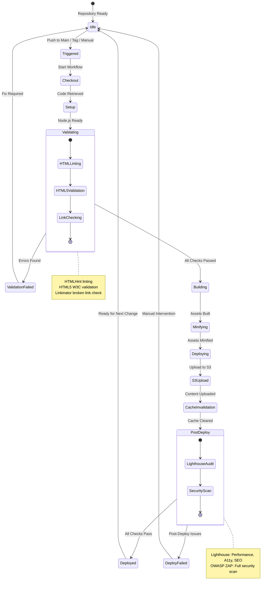
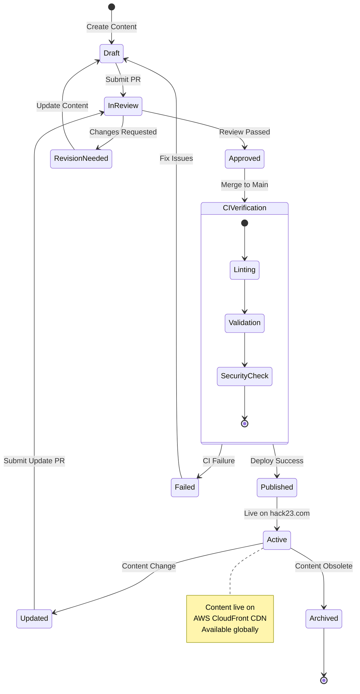
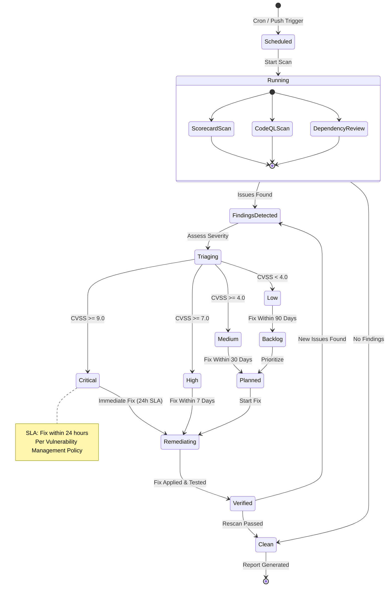
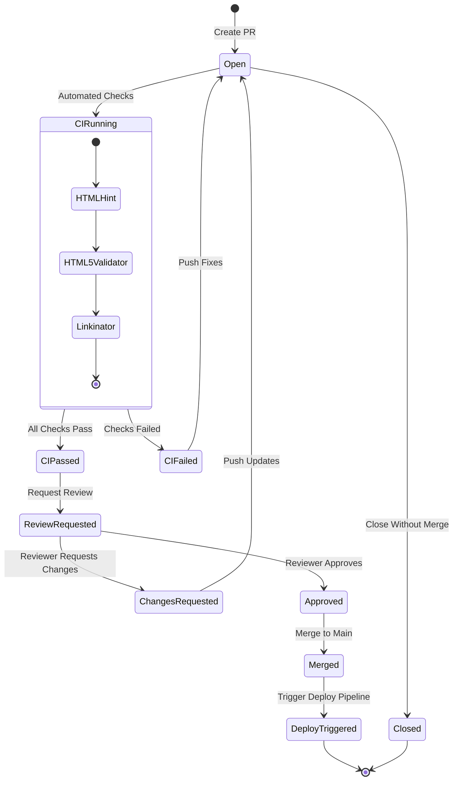
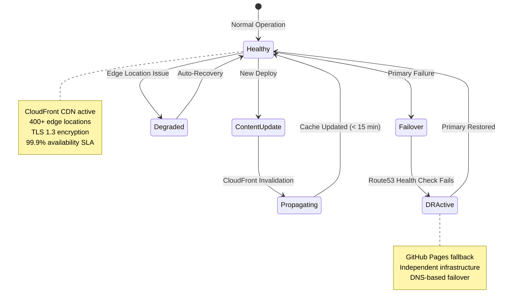

  

<h1 align="center">📈 Hack23 Homepage — State Diagrams</h1>

  <strong>State Transitions: Deployment Pipeline and Content Lifecycle</strong> 
  <em>State Machine Documentation for hack23.com</em>

  
  
  
  

**📋 Document Owner:** CEO | **📄 Version:** 1.0 | **📅 Last Updated:** 2026-02-20 (UTC)
**🔄 Review Cycle:** Quarterly | **⏰ Next Review:** 2026-05-20
**🏷️ Classification:**   

---

## 📚 Related Documentation

| Document | Focus | Description |
|----------|-------|-------------|
| **[🏛️ Architecture](ARCHITECTURE.md)** | C4 Model | System structure and containers |
| **[📊 Data Model](DATA_MODEL.md)** | Data | Content model and data structures |
| **[🔄 Flowchart](FLOWCHART.md)** | Processes | CI/CD and content workflows |
| **[📈 State Diagram](STATEDIAGRAM.md)** | States | State transitions (this document) |
| **[🔄 Workflows](WORKFLOWS.md)** | CI/CD | GitHub Actions workflow details |
| **[🚀 Future State Diagram](FUTURE_STATEDIAGRAM.md)** | Roadmap | Planned state improvements |

---

## 🎯 Overview

This document provides comprehensive state diagrams for the Hack23 homepage, documenting deployment pipeline states, content lifecycle states, and CI/CD workflow transitions.

---

## 🚀 Deployment Pipeline States

---

## 📝 Content Lifecycle States

---

## 🔒 Security Scanning States

---

## 🔀 Pull Request States

---

## ☁️ AWS Infrastructure States

---

## 📋 ISMS Compliance

These state diagrams align with:

- 🔗 **[Secure Development Policy](https://github.com/Hack23/ISMS-PUBLIC/blob/main/Secure_Development_Policy.md)** — CI/CD pipeline states
- 🔗 **[Vulnerability Management](https://github.com/Hack23/ISMS-PUBLIC/blob/main/Vulnerability_Management.md)** — Security scanning states and SLAs
- 🔗 **[Incident Response Plan](https://github.com/Hack23/ISMS-PUBLIC/blob/main/Incident_Response_Plan.md)** — Failover and recovery states
- 🔗 **[Backup & Recovery Policy](https://github.com/Hack23/ISMS-PUBLIC/blob/main/Backup_Recovery_Policy.md)** — DR state transitions
