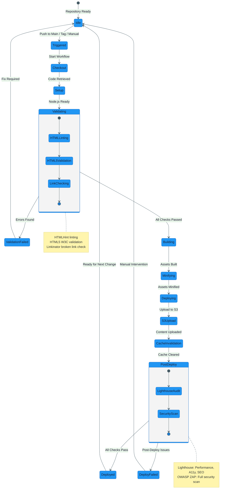
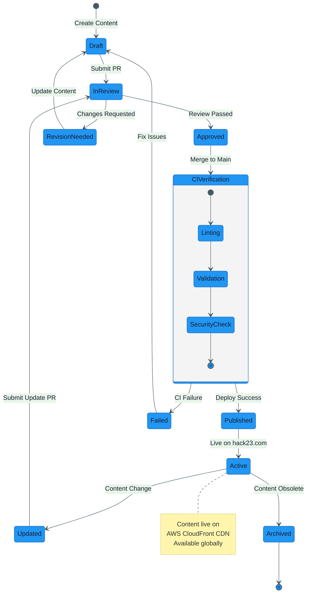
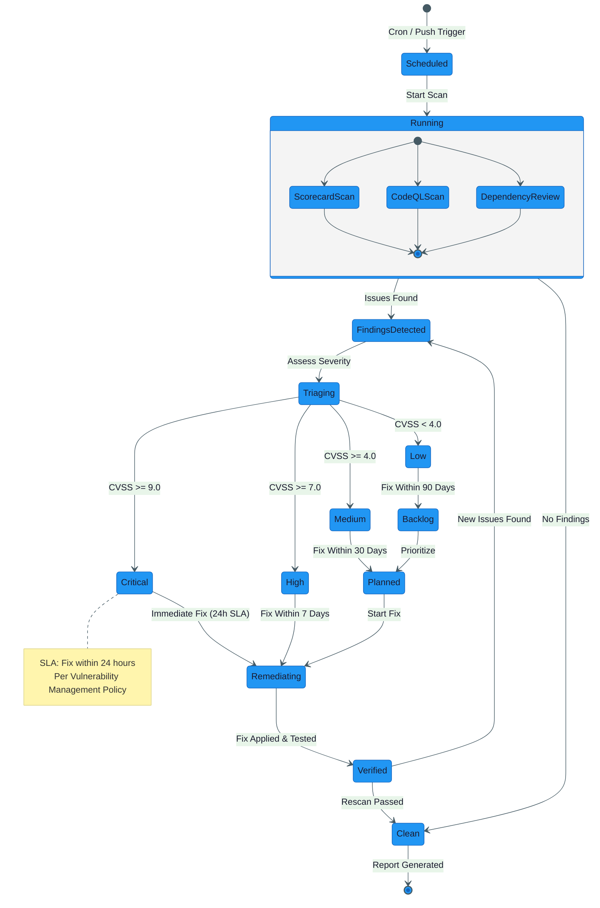
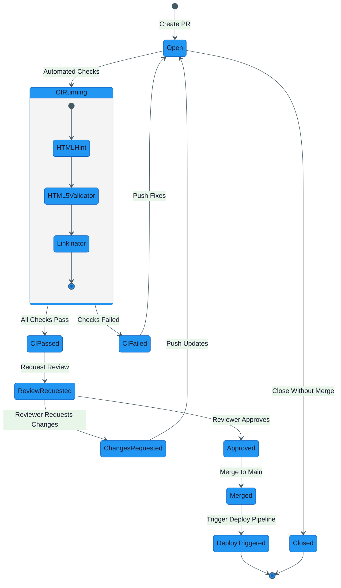
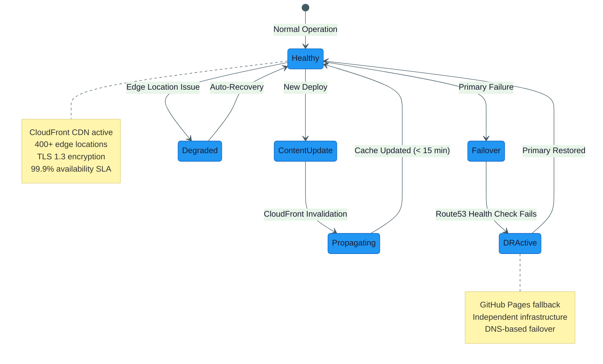

  

<h1 align="center">📈 Hack23 Homepage — State Diagrams</h1>

  <strong>State Transitions: Deployment Pipeline and Content Lifecycle</strong> 
  <em>State Machine Documentation for hack23.com</em>

  
  
  
  

**📋 Document Owner:** CEO | **📄 Version:** 1.1 | **📅 Last Updated:** 2026-04-21 (UTC)
**🔄 Review Cycle:** Quarterly | **⏰ Next Review:** 2026-07-21
**🏷️ Classification:**   

---

## 📚 Related Documentation

| Document | Focus | Description |
|----------|-------|-------------|
| **[🏛️ Architecture](ARCHITECTURE.md)** | C4 Model | System structure and containers |
| **[📊 Data Model](DATA_MODEL.md)** | Data | Content model and data structures |
| **[🔄 Flowchart](FLOWCHART.md)** | Processes | CI/CD and content workflows |
| **[📈 State Diagram](STATEDIAGRAM.md)** | States | State transitions (this document) |
| **[🧠 Mindmap](MINDMAP.md)** | Concepts | System conceptual relationships |
| **[🔄 Workflows](WORKFLOWS.md)** | CI/CD | GitHub Actions workflow details (10 workflows) |
| **[🛡️ Security Architecture](SECURITY_ARCHITECTURE.md)** | Security | Defense-in-depth controls |
| **[🎯 Threat Model](THREAT_MODEL.md)** | Threats | STRIDE / MITRE ATT&CK analysis |
| **[🔄 BCP Plan](BCPPlan.md)** | Resilience | Business continuity & recovery states |
| **[🔚 End-of-Life Strategy](End-of-Life-Strategy.md)** | Lifecycle | Lifecycle / sunset states |
| **[🛡️ CRA Assessment](CRA-ASSESSMENT.md)** | Compliance | EU Cyber Resilience Act conformity |
| **[🚀 Future State Diagram](FUTURE_STATEDIAGRAM.md)** | Roadmap | Planned state improvements |

---

## 🎯 Overview

This document provides comprehensive state diagrams for the Hack23 homepage, documenting deployment pipeline states, content lifecycle states, and CI/CD workflow transitions.

---

## 🚀 Deployment Pipeline States

```mermaid
%%{init: {"theme": "base", "themeVariables": {"primaryColor": "#2196F3", "primaryTextColor": "#1a1a2e", "lineColor": "#455A64", "secondaryColor": "#e8f5e9", "tertiaryColor": "#fff8e1", "primaryBorderColor": "#1565C0"}}}%%
stateDiagram-v2
    [*] --> Idle: Repository Ready

    Idle --> Triggered: Push to Main / Tag / Manual

    Triggered --> Checkout: Start Workflow
    Checkout --> Setup: Code Retrieved
    Setup --> Validating: Node.js Ready

    state Validating {
        [*] --> HTMLLinting
        HTMLLinting --> HTML5Validation
        HTML5Validation --> LinkChecking
        LinkChecking --> [*]
    }

    Validating --> ValidationFailed: Errors Found
    Validating --> Building: All Checks Passed

    ValidationFailed --> Idle: Fix Required

    Building --> Minifying: Assets Built
    Minifying --> Deploying: Assets Minified

    Deploying --> S3Upload: Upload to S3
    S3Upload --> CacheInvalidation: Content Uploaded
    CacheInvalidation --> PostDeploy: Cache Cleared

    state PostDeploy {
        [*] --> LighthouseAudit
        LighthouseAudit --> SecurityScan
        SecurityScan --> [*]
    }

    PostDeploy --> Deployed: All Checks Pass
    PostDeploy --> DeployFailed: Post-Deploy Issues

    Deployed --> Idle: Ready for Next Change
    DeployFailed --> Idle: Manual Intervention

    note right of Validating
        HTMLHint linting
        HTML5 W3C validation
        Linkinator broken link check
    end note

    note right of PostDeploy
        Lighthouse: Performance, A11y, SEO
        OWASP ZAP: Full security scan
    end note
```

---

## 📝 Content Lifecycle States

```mermaid
%%{init: {"theme": "base", "themeVariables": {"primaryColor": "#2196F3", "primaryTextColor": "#1a1a2e", "lineColor": "#455A64", "secondaryColor": "#e8f5e9", "tertiaryColor": "#fff8e1", "primaryBorderColor": "#1565C0"}}}%%
stateDiagram-v2
    [*] --> Draft: Create Content

    Draft --> InReview: Submit PR
    InReview --> Approved: Review Passed
    InReview --> RevisionNeeded: Changes Requested

    RevisionNeeded --> Draft: Update Content
    Approved --> CIVerification: Merge to Main

    state CIVerification {
        [*] --> Linting
        Linting --> Validation
        Validation --> SecurityCheck
        SecurityCheck --> [*]
    }

    CIVerification --> Published: Deploy Success
    CIVerification --> Failed: CI Failure

    Failed --> Draft: Fix Issues

    Published --> Active: Live on hack23.com

    Active --> Updated: Content Change
    Updated --> InReview: Submit Update PR

    Active --> Archived: Content Obsolete
    Archived --> [*]

    note right of Active
        Content live on
        AWS CloudFront CDN
        Available globally
    end note
```

---

## 🔒 Security Scanning States

```mermaid
%%{init: {"theme": "base", "themeVariables": {"primaryColor": "#2196F3", "primaryTextColor": "#1a1a2e", "lineColor": "#455A64", "secondaryColor": "#e8f5e9", "tertiaryColor": "#fff8e1", "primaryBorderColor": "#1565C0"}}}%%
stateDiagram-v2
    [*] --> Scheduled: Cron / Push Trigger

    Scheduled --> Running: Start Scan

    state Running {
        [*] --> ScorecardScan
        [*] --> CodeQLScan
        [*] --> DependencyReview

        ScorecardScan --> [*]
        CodeQLScan --> [*]
        DependencyReview --> [*]
    }

    Running --> Clean: No Findings
    Running --> FindingsDetected: Issues Found

    Clean --> [*]: Report Generated

    FindingsDetected --> Triaging: Assess Severity

    Triaging --> Critical: CVSS >= 9.0
    Triaging --> High: CVSS >= 7.0
    Triaging --> Medium: CVSS >= 4.0
    Triaging --> Low: CVSS < 4.0

    Critical --> Remediating: Immediate Fix (24h SLA)
    High --> Remediating: Fix Within 7 Days
    Medium --> Planned: Fix Within 30 Days
    Low --> Backlog: Fix Within 90 Days

    Remediating --> Verified: Fix Applied & Tested
    Planned --> Remediating: Start Fix
    Backlog --> Planned: Prioritize

    Verified --> Clean: Rescan Passed
    Verified --> FindingsDetected: New Issues Found

    note right of Critical
        SLA: Fix within 24 hours
        Per Vulnerability Management Policy
    end note
```

---

## 🔀 Pull Request States

```mermaid
%%{init: {"theme": "base", "themeVariables": {"primaryColor": "#2196F3", "primaryTextColor": "#1a1a2e", "lineColor": "#455A64", "secondaryColor": "#e8f5e9", "tertiaryColor": "#fff8e1", "primaryBorderColor": "#1565C0"}}}%%
stateDiagram-v2
    [*] --> Open: Create PR

    Open --> CIRunning: Automated Checks

    state CIRunning {
        [*] --> HTMLHint
        HTMLHint --> HTML5Validator
        HTML5Validator --> Linkinator
        Linkinator --> [*]
    }

    CIRunning --> CIPassed: All Checks Pass
    CIRunning --> CIFailed: Checks Failed

    CIFailed --> Open: Push Fixes

    CIPassed --> ReviewRequested: Request Review
    ReviewRequested --> ChangesRequested: Reviewer Requests Changes
    ReviewRequested --> Approved: Reviewer Approves

    ChangesRequested --> Open: Push Updates

    Approved --> Merged: Merge to Main
    Merged --> DeployTriggered: Trigger Deploy Pipeline
    DeployTriggered --> [*]

    Open --> Closed: Close Without Merge
    Closed --> [*]
```

---

## ☁️ AWS Infrastructure States

```mermaid
%%{init: {"theme": "base", "themeVariables": {"primaryColor": "#2196F3", "primaryTextColor": "#1a1a2e", "lineColor": "#455A64", "secondaryColor": "#e8f5e9", "tertiaryColor": "#fff8e1", "primaryBorderColor": "#1565C0"}}}%%
stateDiagram-v2
    [*] --> Healthy: Normal Operation

    Healthy --> ContentUpdate: New Deploy
    ContentUpdate --> Propagating: CloudFront Invalidation
    Propagating --> Healthy: Cache Updated (< 15 min)

    Healthy --> Degraded: Edge Location Issue
    Degraded --> Healthy: Auto-Recovery

    Healthy --> Failover: Primary Failure
    Failover --> DRActive: Route53 Health Check Fails
    DRActive --> Healthy: Primary Restored

    note right of Healthy
        CloudFront CDN active
        400+ edge locations
        TLS 1.3 encryption
        99.9% availability SLA
    end note

    note right of DRActive
        GitHub Pages fallback
        Independent infrastructure
        DNS-based failover
    end note
```

---

## 📋 ISMS Compliance

These state diagrams align with:

- 🔗 **[Secure Development Policy](https://github.com/Hack23/ISMS-PUBLIC/blob/main/Secure_Development_Policy.md)** — CI/CD pipeline states
- 🔗 **[Vulnerability Management](https://github.com/Hack23/ISMS-PUBLIC/blob/main/Vulnerability_Management.md)** — Security scanning states and SLAs
- 🔗 **[Incident Response Plan](https://github.com/Hack23/ISMS-PUBLIC/blob/main/Incident_Response_Plan.md)** — Failover and recovery states
- 🔗 **[Backup & Recovery Policy](https://github.com/Hack23/ISMS-PUBLIC/blob/main/Backup_Recovery_Policy.md)** — DR state transitions
