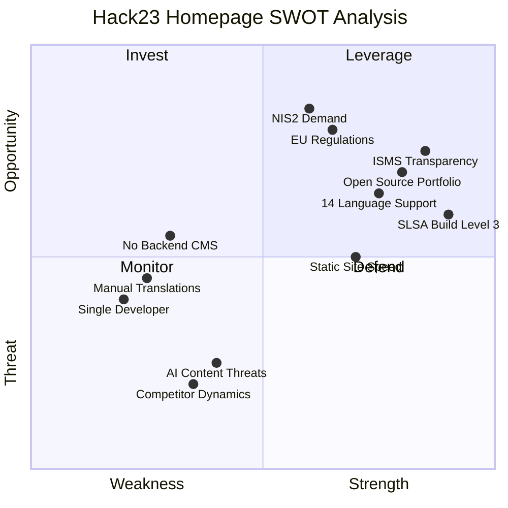

  

<h1 align="center">💼 Hack23 Homepage — SWOT Analysis</h1>

  <strong>Strategic Analysis: Corporate Website Positioning</strong> 
  <em>hack23.com — Cybersecurity Consulting Platform</em>

  
  
  
  

**📋 Document Owner:** CEO | **📄 Version:** 1.0 | **📅 Last Updated:** 2026-02-20 (UTC)
**🔄 Review Cycle:** Quarterly | **⏰ Next Review:** 2026-05-20
**🏷️ Classification:**   

---

## 📚 Related Documentation

| Document | Focus | Description |
|----------|-------|-------------|
| **[🏛️ Architecture](ARCHITECTURE.md)** | C4 Model | System structure and containers |
| **[🛡️ Security Architecture](SECURITY_ARCHITECTURE.md)** | Security | Security controls and infrastructure |
| **[🧠 Mindmap](MINDMAP.md)** | Concepts | System conceptual relationships |
| **[🎯 Threat Model](THREAT_MODEL.md)** | Threats | STRIDE threat analysis |
| **[🚀 Future SWOT](FUTURE_SWOT.md)** | Roadmap | Future strategic opportunities |

---

## 📊 Strategic Overview

**Current Status**: Production — Serving 14 languages across 74+ pages
**Strategic Focus**: Transparency-first cybersecurity consulting brand
**Differentiator**: Public ISMS documentation with open-source security tools

---

## SWOT Quadrant

---

## 💪 Strengths

| # | Strength | Impact | Evidence |
|---|----------|--------|----------|
| S1 | **Public ISMS Transparency** | 🟢 High | Full ISMS published on GitHub — unique differentiator |
| S2 | **Open Source Portfolio** | 🟢 High | 6 active projects demonstrating security expertise |
| S3 | **14 Language Support** | 🟢 High | Global reach with localized content |
| S4 | **SLSA Build Level 3** | 🟢 High | Supply chain security above industry standard |
| S5 | **OpenSSF Scorecard** | 🟡 Medium | Verified security posture with public badge |
| S6 | **Static Site Performance** | 🟡 Medium | Fast global delivery via CloudFront CDN |
| S7 | **Multi-Framework Compliance** | 🟢 High | ISO 27001, NIST CSF 2.0, CIS Controls v8.1 alignment |
| S8 | **AI-Assisted Development** | 🟡 Medium | 8 Copilot agents, 58 skills library |

---

## 🔻 Weaknesses

| # | Weakness | Impact | Mitigation |
|---|----------|--------|------------|
| W1 | **No CMS Backend** | 🟡 Medium | Content updates require code changes and deployments |
| W2 | **Single Developer** | 🟡 Medium | Bus factor of 1 for content and infrastructure |
| W3 | **Manual Translation Process** | 🟡 Medium | AI-assisted but requires review for each language |
| W4 | **No Dynamic Features** | 🟡 Medium | No contact forms, search, or interactive demos |
| W5 | **Limited Analytics** | 🟡 Medium | Privacy-first approach limits tracking capabilities |
| W6 | **Large Page Count** | 🟡 Low | 74+ pages across 14 languages increases maintenance |

---

## 🌟 Opportunities

| # | Opportunity | Impact | Timeline |
|---|------------|--------|----------|
| O1 | **NIS2 Compliance Demand** | 🟢 High | Growing EU requirement drives consulting demand |
| O2 | **EU CRA Requirements** | 🟢 High | New regulation creates assessment opportunities |
| O3 | **ISMS-as-Differentiator** | 🟢 High | Public ISMS becoming competitive advantage |
| O4 | **AI-Powered Security Tools** | 🟡 Medium | Copilot agents could enhance service delivery |
| O5 | **Multilingual Market Access** | 🟡 Medium | 14 languages opens global consulting markets |
| O6 | **Open Source Credibility** | 🟡 Medium | Active projects demonstrate practical expertise |

---

## ⚠️ Threats

| # | Threat | Impact | Mitigation |
|---|--------|--------|------------|
| T1 | **Larger Competitor Marketing** | 🟡 Medium | Focus on transparency and open-source differentiator |
| T2 | **AI-Generated Content Flooding** | 🟡 Medium | Maintain authentic, expertise-driven content |
| T3 | **Regulatory Complexity** | 🟡 Medium | Multi-framework compliance keeps documentation current |
| T4 | **Supply Chain Attacks** | 🟡 Medium | SLSA Level 3, Scorecard, and dependency scanning |
| T5 | **Cloud Provider Dependency** | 🟡 Low | DR strategy with GitHub Pages fallback |
| T6 | **SEO Algorithm Changes** | 🟡 Low | Schema.org structured data and multilingual approach |

---

## 📋 ISMS Compliance

This SWOT analysis supports:

- 🔗 **[Information Security Policy](https://github.com/Hack23/ISMS-PUBLIC/blob/main/Information_Security_Policy.md)** — Strategic security governance
- 🔗 **[Risk Register](https://github.com/Hack23/ISMS-PUBLIC/blob/main/Risk_Register.md)** — Risk assessment alignment
- 🔗 **[Compliance Checklist](https://github.com/Hack23/ISMS-PUBLIC/blob/main/Compliance_Checklist.md)** — Multi-framework compliance tracking
