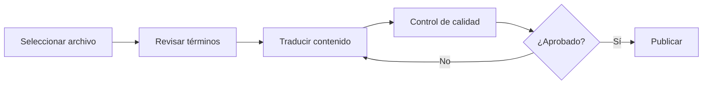
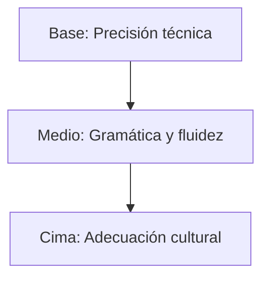

# 🇪🇸 Spanish (es) Translation Guide

**Version 5.0 - Comprehensive Hack23 Edition**  
*Last Updated: January 2026*

---

## 📋 Quick Reference

| Attribute | Value |
|-----------|-------|
| **Language Code** | `es` |
| **Locale** | `es_ES` (Spain) / `es_419` (Latin America) |
| **Text Direction** | LTR (Left-to-Right) → |
| **Currency** | EUR (€) for Spain, varies by region |
| **Date Format** | `DD/MM/YYYY` or `DD de mes de AAAA` |
| **Keyboard** | QWERTY with Ñ, accents |

---

## 🔄 Visual Translation Workflow

## 🔄 Quality Standards Pyramid

---

## 📚 Comprehensive Vocabulary Reference

### 🔥 Brand & Key Entities (Never Translate)

| English | Spanish | Notes |
|---------|---------|-------|
| Hack23 | Hack23 | Company name – never translate |
| Hack23 AB | Hack23 AB | Swedish company designation |
| Citizen Intelligence Agency | Citizen Intelligence Agency | Project name – keep English |
| CIA Compliance Manager | CIA Compliance Manager | Product name – keep English |
| Black Trigram | Black Trigram | Game product – keep English |
| James Pether Sörling | James Pether Sörling | Founder name |
| CISSP | CISSP | Certification |
| CISM | CISM | Certification |
| GitHub | GitHub | Platform name |
| LinkedIn | LinkedIn | Platform name |

### 🏢 Hack23 Business & Services

| English | Spanish | Notes |
|---------|---------|-------|
| Cybersecurity Consulting Sweden | Consultoría de ciberseguridad en Suecia | Main tagline |
| Public ISMS | SGSI público | Core differentiator |
| Security Architecture | Arquitectura de seguridad | |
| Security Strategy | Estrategia de seguridad | |
| Cloud Security | Seguridad en la nube | |
| DevSecOps | DevSecOps | Keep English |
| Secure Development | Desarrollo seguro | |
| Code Quality | Calidad del código | |
| Compliance & Regulatory | Cumplimiento normativo | |
| Open Source Security | Seguridad de código abierto | |
| Security Culture | Cultura de seguridad | |
| Security Training | Formación en seguridad | |
| Full-Stack Security | Seguridad full-stack | |
| Current Practitioner | Profesional activo | Value proposition |
| Transparent Security | Seguridad transparente | |
| Developer-Friendly Security | Seguridad amigable para desarrolladores | |
| OSPO | OSPO | Open Source Program Office |
| Gothenburg | Gotemburgo | City in Sweden |
| Sweden | Suecia | |

### 🎮 Black Trigram Game Vocabulary

| English | Spanish | Notes |
|---------|---------|-------|
| Precision Combat Simulator | Simulador de combate de precisión | |
| Vital Points | Puntos vitales | |
| 70 Anatomical Vital Points | 70 puntos vitales anatómicos | |
| Fighter Archetypes | Arquetipos de luchador | |
| Musa (Warrior) | Musa (guerrero) | Keep Korean term |
| Amsalja (Assassin) | Amsalja (asesino) | Keep Korean term |
| Hacker | Hacker | |
| Jeongbo (Intelligence) | Jeongbo (inteligencia) | Keep Korean term |
| Jojik (Organization) | Jojik (organización) | Keep Korean term |
| Korean Martial Arts | Artes marciales coreanas | |
| Taekkyeon | Taekkyeon | Traditional Korean martial art |
| Hapkido | Hapkido | Korean martial art |
| Taekwondo | Taekwondo | Korean martial art |
| Cultural Preservation | Preservación cultural | |
| Educational Gaming | Juegos educativos | |
| Unity Game | Juego Unity | |
| Steam | Steam | Platform name |
| itch.io | itch.io | Platform name |
| I Ching | I Ching | |
| Trigram | Trigrama | |

### 🔍 Citizen Intelligence Agency Vocabulary

| English | Spanish | Notes |
|---------|---------|-------|
| Political Transparency | Transparencia política | |
| OSINT Platform | Plataforma OSINT | |
| Parliamentary Monitoring | Monitoreo parlamentario | |
| Voting Records | Registros de votación | |
| Accountability Metrics | Métricas de rendición de cuentas | |
| Open Data | Datos abiertos | |
| Civic Technology | Tecnología cívica | |
| Swedish Parliament | Parlamento sueco | |
| Data Visualization | Visualización de datos | |
| Political Analytics | Análisis político | |

### 🔐 CIA Compliance Manager Vocabulary

| English | Spanish | Notes |
|---------|---------|-------|
| Security Assessment Platform | Plataforma de evaluación de seguridad | |
| Business Impact Analysis | Análisis de impacto empresarial | |
| Multi-Framework Compliance | Cumplimiento de múltiples marcos | |
| STRIDE Analysis | Análisis STRIDE | Threat model |
| Threat Modeling | Modelado de amenazas | |
| Evidence Collection | Recopilación de evidencias | |
| Automated Compliance Reporting | Informes de cumplimiento automatizados | |
| Risk Register | Registro de riesgos | |
| Controls Monitoring | Monitoreo de controles | |
| CRA Assessment | Evaluación CRA | Cyber Resilience Act |

### 🍎 Discordian Philosophy & ISMS Blog

| English | Spanish | Notes |
|---------|---------|-------|
| Think for Yourself | Piensa por ti mismo | Core motto |
| Question Authority | Cuestiona la autoridad | |
| FNORD | FNORD | Never translate |
| Nothing is True | Nada es verdad | |
| Everything is Permitted | Todo está permitido | |
| Security Theater | Teatro de seguridad | Fake security |
| Radical Transparency | Transparencia radical | |
| Chapel Perilous | Chapel Perilous | Keep English |
| Operation Mindfuck | Operation Mindfuck | Keep English |
| Illuminatus Trilogy | Trilogía Illuminatus | |
| Eris | Eris | Goddess of Chaos |
| Discordia | Discordia | |
| Law of Fives | Ley de los cincos | |
| Sacred Geometry | Geometría sagrada | |
| Five-Layer Architecture | Arquitectura de cinco capas | |
| Nation-State Surveillance | Vigilancia estatal | |
| Crypto Backdoors | Puertas traseras criptográficas | |
| Security Through Obscurity | Seguridad por oscuridad | Anti-pattern |
| Information Hoarding | Acaparamiento de información | |
| Knowledge Transparency | Transparencia del conocimiento | |
| Simon Moon | Simon Moon | Character reference |
| Hagbard Celine | Hagbard Celine | Character reference |
| George Dorn | George Dorn | Character reference |

### 🧭 Navigation & UI Elements

| English | Spanish |
|---------|---------|
| Home | Inicio |
| About Us | Sobre nosotros |
| Services | Servicios |
| Products | Productos |
| Projects | Proyectos |
| Contact | Contacto |
| Blog | Blog |
| Search | Buscar |
| Menu | Menú |
| Close | Cerrar |
| Back | Atrás |
| Next | Siguiente |
| Previous | Anterior |
| Submit | Enviar |
| Cancel | Cancelar |
| **Expand All** | **Expandir todo** |
| **Collapse All** | **Contraer todo** |
| Download | Descargar |
| Read More | Leer más |
| View Details | Ver detalles |
| Privacy Policy | Política de privacidad |
| Terms of Service | Términos de servicio |
| Copyright | Derechos de autor |
| Sitemap | Mapa del sitio |
| FAQ | Preguntas frecuentes |
| Why Hack23 | Por qué Hack23 |
| Accessibility Statement | Declaración de accesibilidad |
| Language | Idioma |
| Share | Compartir |
| Print | Imprimir |
| Save | Guardar |
| Edit | Editar |
| Delete | Eliminar |
| Confirm | Confirmar |
| Loading | Cargando |
| Error | Error |
| Success | Éxito |
| Warning | Advertencia |

### 🔐 CIA Triad & Core Security Principles

| English | Spanish | Notes |
|---------|---------|-------|
| CIA Triad | Tríada CIA | |
| CIA+ Framework | Marco CIA+ | Extended framework |
| **Confidentiality** | **Confidencialidad** | Data protection |
| **Integrity** | **Integridad** | Data accuracy |
| **Availability** | **Disponibilidad** | System uptime |
| Non-Repudiation | No repudio | |
| Authentication | Autenticación | |
| Authorization | Autorización | |

### 🔒 Security & Cybersecurity Terminology

| English | Spanish | Notes |
|---------|---------|-------|
| Cybersecurity | Ciberseguridad | |
| Information Security | Seguridad de la información | |
| ISMS | SGSI | Sistema de gestión de seguridad |
| Security Policy | Política de seguridad | |
| Risk Management | Gestión de riesgos | |
| Risk Assessment | Evaluación de riesgos | |
| Threat | Amenaza | |
| Vulnerability | Vulnerabilidad | |
| Exploit | Explotación | |
| Patch | Parche | |
| Firewall | Cortafuegos | |
| Encryption | Cifrado | |
| Decryption | Descifrado | |
| Access Control | Control de acceso | |
| Multi-Factor Authentication (MFA) | Autenticación multifactor | |
| Single Sign-On (SSO) | Inicio de sesión único | |
| Phishing | Phishing / Suplantación de identidad | |
| Ransomware | Ransomware / Secuestro de datos | |
| Malware | Malware / Software malicioso | |
| Zero Trust | Confianza cero | |
| Defense in Depth | Defensa en profundidad | |
| Least Privilege | Mínimo privilegio | |
| Incident Response | Respuesta a incidentes | |
| Data Breach | Violación de datos | |
| Penetration Test | Prueba de penetración | |
| Audit | Auditoría | |
| Compliance | Cumplimiento | |
| Governance | Gobernanza | |
| Security Awareness | Concienciación de seguridad | |
| Backup | Copia de seguridad | |
| Disaster Recovery | Recuperación ante desastres | |
| Business Continuity | Continuidad del negocio | |
| Supply Chain Security | Seguridad de la cadena de suministro | |
| SLSA Level 3 | SLSA nivel 3 | Supply chain security |
| Container Security | Seguridad de contenedores | |
| Serverless Security | Seguridad sin servidor | |
| API Security | Seguridad de API | |
| Endpoint Security | Seguridad de endpoints | |

### 🏛️ Regulatory & Standards

| English | Spanish | Notes |
|---------|---------|-------|
| ISO 27001 | ISO 27001 | Keep as-is |
| ISO 27001:2022 | ISO 27001:2022 | |
| GDPR | RGPD | Reglamento General de Protección de Datos |
| NIS2 | Directiva NIS2 | EU directive |
| NIST CSF | Marco de ciberseguridad NIST | |
| CIS Controls | Controles CIS | |
| SOC2 | SOC2 | |
| HIPAA | HIPAA | US healthcare |
| EU Cyber Resilience Act (CRA) | Ley de Ciberresiliencia de la UE | |
| Annex A Controls | Controles del Anexo A | ISO 27001 |
| Statement of Applicability | Declaración de aplicabilidad | |
| INCIBE | INCIBE | Instituto Nacional de Ciberseguridad (Spain) |
| CCN | CCN | Centro Criptológico Nacional (Spain) |
| AEPD | AEPD | Spanish DPA |

### 💼 Business & Professional Terms

| English | Spanish |
|---------|---------|
| Consulting | Consultoría |
| Enterprise | Empresa |
| Strategy | Estrategia |
| Certification | Certificación |
| Assessment | Evaluación |
| Implementation | Implementación |
| Audit | Auditoría |
| Review | Revisión |
| Gap Analysis | Análisis de brechas |
| Roadmap | Hoja de ruta |
| Best Practices | Mejores prácticas |
| Case Study | Caso de estudio |
| ROI | Retorno de inversión |
| KPI | Indicador clave de rendimiento |
| SLA | Acuerdo de nivel de servicio |
| Stakeholder | Parte interesada |
| Deliverable | Entregable |
| Milestone | Hito |

### 📝 Blog Post Categories

| English | Spanish |
|---------|---------|
| Security Architecture | Arquitectura de seguridad |
| ISMS Policies | Políticas SGSI |
| Compliance Frameworks | Marcos de cumplimiento |
| Threat Modeling | Modelado de amenazas |
| Secure Development | Desarrollo seguro |
| Cloud Security | Seguridad en la nube |
| Access Control | Control de acceso |
| Cryptography | Criptografía |
| Incident Response | Respuesta a incidentes |
| Vulnerability Management | Gestión de vulnerabilidades |
| Asset Management | Gestión de activos |
| Network Security | Seguridad de red |
| Email Security | Seguridad de correo electrónico |
| Physical Security | Seguridad física |
| Mobile Device Security | Seguridad de dispositivos móviles |
| Remote Access Security | Seguridad de acceso remoto |
| Monitoring & Logging | Monitoreo y registro |
| Security Metrics | Métricas de seguridad |
| Third Party Risk | Riesgo de terceros |
| Change Management | Gestión de cambios |

### 🏭 Industry-Specific Terms

| English | Spanish |
|---------|---------|
| Investment & FinTech | Inversión y FinTech |
| Betting & Gaming | Apuestas y juegos |
| Cannabis Security | Seguridad del cannabis |
| Healthcare | Salud |
| Government | Gobierno |
| Critical Infrastructure | Infraestructura crítica |
| Financial Services | Servicios financieros |
| E-commerce | Comercio electrónico |

---

## 🔤 Spanish-Specific Guidelines

### Regional Variants
- **Spain (es_ES)**: European Spanish (default for this guide)
- **Latin America (es_419)**: Consider differences for broader audience
- Key differences: vosotros vs. ustedes, vocabulary variations

### Grammar Considerations
- Use formal "usted/ustedes" for professional content
- Inverted question/exclamation marks: ¿? and ¡!
- Gender agreement for adjectives and articles

### Accents and Special Characters
- Proper use of á, é, í, ó, ú, ü, ñ
- Ensure UTF-8 encoding

### Technical Terms
- Prefer Spanish translations where widely accepted
- Keep English for globally recognized acronyms (API, SQL, etc.)

---

## ✅ Translation Checklist

- [ ] `<html lang="es">` attribute set
- [ ] `<title>` translated
- [ ] `<meta name="description">` translated
- [ ] `og:locale` set to `es_ES`
- [ ] All hreflang tags present (14 languages)
- [ ] Navigation menu translated
- [ ] Footer translated
- [ ] Brand names kept in English
- [ ] Proper accents and tildes used
- [ ] Inverted punctuation marks where needed

---

## 📝 Notes

- Spanish is spoken in **Spain** and **Latin America** – consider regional variants
- INCIBE is Spain's National Cybersecurity Institute
- RGPD is the Spanish abbreviation for GDPR
- SGSI is the Spanish equivalent of ISMS

---

*23 FNORD 5*
