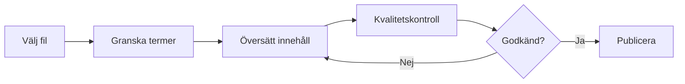
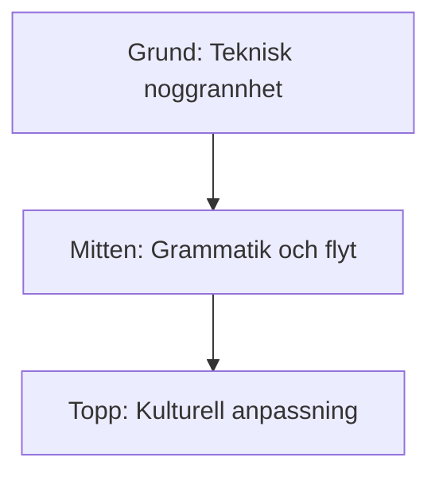

# 🇸🇪 Swedish (sv) Translation Guide

**Version 6.0 - Expanded Hack23 Edition**  
*Last Updated: January 2026*

---

## 📋 Quick Reference

| Attribute | Value |
|-----------|-------|
| **Language Code** | `sv` |
| **Locale** | `sv_SE` |
| **Text Direction** | LTR (Left-to-Right) → |
| **Currency** | SEK (kr) |
| **Date Format** | `YYYY-MM-DD` (ISO format is standard in Sweden) |
| **Keyboard** | QWERTY with Å, Ä, Ö |

---

## 🔄 Visual Translation Workflow

## 🔄 Quality Standards Pyramid

---

## 📚 Comprehensive Vocabulary Reference

### 🔥 Brand & Key Entities (Never Translate)

| English | Swedish | Notes |
|---------|---------|-------|
| Hack23 | Hack23 | Company name – never translate |
| Hack23 AB | Hack23 AB | Swedish company designation |
| Citizen Intelligence Agency | Citizen Intelligence Agency | Project name – keep English |
| CIA Compliance Manager | CIA Compliance Manager | Product name – keep English |
| Black Trigram | Black Trigram | Game product – keep English |
| 흑괘 | 흑괘 | Korean name for Black Trigram |
| 黑卦 | 黑卦 | Chinese name for Black Trigram |
| James Pether Sörling | James Pether Sörling | Founder name |
| CISSP | CISSP | Certification |
| CISM | CISM | Certification |
| GitHub | GitHub | Platform name |
| LinkedIn | LinkedIn | Platform name |
| OpenSSF | OpenSSF | Open Source Security Foundation |
| CII Best Practices | CII Best Practices | Badge name |
| Riksdag | Riksdagen | Swedish Parliament |

### 👔 Job Titles & Professional Roles

| English | Swedish | Notes |
|---------|---------|-------|
| CEO / Chief Executive Officer | VD / Verkställande direktör | |
| Founder | Grundare | |
| CEO/Founder | VD/Grundare | |
| Application Security Officer | Applikationssäkerhetsansvarig | |
| Information Security Officer | Informationssäkerhetsansvarig | |
| Senior Security Architect | Senior säkerhetsarkitekt | |
| Cloud Architect | Molnarkitekt | |
| Security Consultant | Säkerhetskonsult | |
| CISO | CISO | Chief Information Security Officer |
| Compliance Officer | Efterlevnadsansvarig | |
| Risk Manager | Riskansvarig | |
| IT Security Manager | IT-säkerhetschef | |
| Security Auditor | Säkerhetsrevisor | |
| Taekwondo Instructor | Taekwondo-instruktör | |
| System Developer | Systemutvecklare | |
| Software Engineer | Mjukvaruingenjör | |
| J2EE Developer | J2EE-utvecklare | |
| Unix Helpdesk | Unix-helpdesk | |
| Teaching Assistant | Undervisningsassistent | |
| NBC Defence Group Leader | NBC-skyddsgruppcef | Military role |

### 🏢 Hack23 Business & Services

| English | Swedish | Notes |
|---------|---------|-------|
| Cybersecurity Consulting Sweden | Cybersäkerhetskonsulting Sverige | Main tagline |
| Public ISMS | Publikt LIS | Core differentiator |
| Open ISMS Transparency | Öppen LIS-transparens | |
| Security Architecture & Strategy | Säkerhetsarkitektur och strategi | Service line |
| Cloud Security & DevSecOps | Molnsäkerhet och DevSecOps | Service line |
| Secure Development & Code Quality | Säker utveckling och kodkvalitet | Service line |
| Compliance & Regulatory | Regelefterlevnad | Service line |
| Open Source Security | Säkerhet för öppen källkod | Service line |
| Security Culture & Training | Säkerhetskultur och utbildning | Service line |
| Full-Stack Security | Fullstack-säkerhet | |
| Current Practitioner | Aktiv utövare | Value proposition |
| Transparent Security | Transparent säkerhet | |
| Developer-Friendly Security | Utvecklarvänlig säkerhet | |
| Security Excellence Through Transparency | Säkerhetsexcellens genom transparens | |
| OSPO | OSPO | Open Source Program Office |
| Gothenburg | Göteborg | City in Sweden |
| Sweden | Sverige | |
| Nordic Region | Norden | |
| Europe | Europa | |
| Singapore | Singapore | |
| ASEAN Region | ASEAN-regionen | |

### 🎮 Black Trigram Game Vocabulary

| English | Swedish | Notes |
|---------|---------|-------|
| Precision Combat Simulator | Precisionsstridssimulator | |
| Vital Points | Vitala punkter | |
| 70 Anatomical Vital Points | 70 anatomiska vitala punkter | |
| 70 Techniques | 70 tekniker | |
| Fighter Archetypes | Kämparketyper | |
| Musa (Warrior) | Musa (krigare) | Keep Korean term |
| Amsalja (Assassin) | Amsalja (lönnmördare) | Keep Korean term |
| Hacker | Hackare | |
| Jeongbo (Intelligence) | Jeongbo (underrättelse) | Keep Korean term |
| Jojik (Organization) | Jojik (organisation) | Keep Korean term |
| Korean Martial Arts | Koreanska kampsporter | |
| Taekkyeon | Taekkyeon | Traditional Korean martial art |
| Hapkido | Hapkido | Korean martial art |
| Taekwondo | Taekwondo | Korean martial art |
| Song Moo Kwan | Song Moo Kwan | Taekwondo school |
| Kukkiwon | Kukkiwon | World Taekwondo HQ |
| Black Belt | Svart bälte | |
| 3rd Dan | 3:e dan | Rank |
| Cultural Preservation | Kulturbevarande | |
| Educational Gaming | Pedagogiskt spelande | |
| Unity Game | Unity-spel | |
| Steam | Steam | Platform name |
| itch.io | itch.io | Platform name |
| I Ching | I Ching | |
| Trigram | Trigram | |
| Fighting | Strid | Game genre |
| Simulation | Simulering | Game genre |
| Educational | Pedagogisk | Game genre |
| Cultural | Kulturell | Game genre |
| Single-player | Enspelar | |
| Multiplayer | Flerspelar | |
| Teen | Tonåring | Content rating |
| Cross-platform | Plattformsoberoende | |
| Open Source Game | Öppen källkod-spel | |

### 🔍 Citizen Intelligence Agency Vocabulary

| English | Swedish | Notes |
|---------|---------|-------|
| Political Transparency | Politisk transparens | |
| Political Intelligence Platform | Politisk underrättelseplattform | |
| OSINT Platform | OSINT-plattform | |
| Parliamentary Monitoring | Riksdagsövervakning | |
| Swedish Parliament Monitoring (Riksdag) | Riksdagsövervakning | |
| Political Decision Tracking | Spårning av politiska beslut | |
| Governance Metrics & Rankings | Styrningsindikatorer och rankningar | |
| Democratic Accountability Analysis | Demokratisk ansvarsanalys | |
| Voting Records | Röstningsregister | |
| Voting Pattern Analysis | Röstmönsteranalys | |
| Party Performance Metrics | Partiprestandamått | |
| Minister Activity Tracking | Ministeraktivitetsspårning | |
| Committee Work Analysis | Utskottsarbetsanalys | |
| Political Trend Visualization | Visualisering av politiska trender | |
| Open Data Integration | Öppna data-integration | |
| World Bank | Världsbanken | |
| Swedish Government | Svenska regeringen | |
| Accountability Metrics | Ansvarsmått | |
| Open Data | Öppna data | |
| Civic Technology | Medborgarteknologi | |
| Swedish Parliament | Riksdagen | |
| Data Visualization | Datavisualisering | |
| Political Analytics | Politisk analys | |
| Citizens | Medborgare | Audience |
| Journalists | Journalister | Audience |
| Researchers | Forskare | Audience |
| Policy Analysts | Policyanalytiker | Audience |
| Political Scientists | Statsvetare | Audience |
| Democracy Advocates | Demokratiförespråkare | Audience |
| Parliamentary Process Analysis | Riksdagsprocessanalys | |
| OSINT Methodology | OSINT-metodik | |
| Swedish Governance System | Svenskt styrningssystem | |
| Data-Driven Political Analysis | Datadriven politisk analys | |
| Open Government Data Usage | Användning av öppna myndighetsdata | |

### 🔐 CIA Compliance Manager Vocabulary

| English | Swedish | Notes |
|---------|---------|-------|
| Security Assessment Platform | Säkerhetsbedömningsplattform | |
| Enterprise Security Management | Företagssäkerhetshantering | |
| CIA Triad Assessment | CIA-triadbedömning | |
| Business Impact Analysis | Affärskonsekvensanalys | |
| Multi-Framework Compliance | Efterlevnad av flera ramverk | |
| STRIDE Analysis | STRIDE-analys | Threat model |
| Threat Modeling | Hotmodellering | |
| Evidence Collection | Bevisinsamling | |
| Automated Compliance Reporting | Automatiserad efterlevnadsrapportering | |
| Risk Register | Riskregister | |
| Controls Monitoring | Kontrollövervakning | |
| CRA Assessment | CRA-bedömning | Cyber Resilience Act |
| Security Level Selection | Val av säkerhetsnivå | |
| Cost Estimation | Kostnadsuppskattning | |
| Implementation Guidance | Implementeringsvägledning | |
| Gap Analysis | Gapanalys | |
| Security Visualization | Säkerhetsvisualisering | |
| Widget-Based Dashboard | Widgetbaserad instrumentpanel | |
| Availability Impact Analysis | Tillgänglighetskonsekvensanalys | |
| Integrity Impact Analysis | Integritetskonsekvensanalys | |
| Confidentiality Impact Analysis | Konfidentialitetskonsekvensanalys | |
| Open Source Security Tool | Säkerhetsverktyg med öppen källkod | |

### 🎓 Education & Learning Terms

| English | Swedish | Notes |
|---------|---------|-------|
| Educational Use | Pedagogisk användning | |
| Self-Directed Learning | Självstudier | |
| Skill Development | Kompetensutveckling | |
| Professional Development | Professionell utveckling | |
| Teaches | Undervisar | Schema.org property |
| Accessibility Features | Tillgänglighetsfunktioner | |
| Keyboard Navigation | Tangentbordsnavigering | |
| High Contrast Mode | Högkontrastläge | |
| Closed Captions | Undertexter | |
| Screen Reader Compatible | Skärmläsarkompatibel | |

### 🍎 Discordian Philosophy & ISMS Blog

### 🍎 Discordian Philosophy & ISMS Blog

| English | Swedish | Notes |
|---------|---------|-------|
| Think for Yourself | Tänk själv | Core motto |
| Question Authority | Ifrågasätt auktoriteter | |
| FNORD | FNORD | Never translate |
| Nothing is True | Inget är sant | |
| Everything is Permitted | Allt är tillåtet | |
| Security Theater | Säkerhetsteater | Fake security |
| Radical Transparency | Radikal transparens | |
| Chapel Perilous | Chapel Perilous | Keep English |
| Operation Mindfuck | Operation Mindfuck | Keep English |
| Illuminatus Trilogy | Illuminatus-trilogin | |
| Eris | Eris | Goddess of Chaos |
| Discordia | Discordia | |
| Law of Fives | De fems lag | |
| Sacred Geometry | Helig geometri | |
| Five-Layer Architecture | Femlagers arkitektur | |
| Nation-State Surveillance | Statlig övervakning | |
| Crypto Backdoors | Kryptobakdörrar | |
| Security Through Obscurity | Säkerhet genom otydlighet | Anti-pattern |
| Information Hoarding | Informationshamstring | |
| Knowledge Transparency | Kunskapstransparens | |
| Simon Moon | Simon Moon | Character reference |
| Hagbard Celine | Hagbard Celine | Character reference |
| George Dorn | George Dorn | Character reference |

### 🧭 Navigation & UI Elements

| English | Swedish |
|---------|---------|
| Home | Hem |
| About Us | Om oss |
| Services | Tjänster |
| Products | Produkter |
| Projects | Projekt |
| Contact | Kontakt |
| Blog | Blogg |
| Search | Sök |
| Menu | Meny |
| Close | Stäng |
| Back | Tillbaka |
| Next | Nästa |
| Previous | Föregående |
| Submit | Skicka |
| Cancel | Avbryt |
| **Expand All** | **Expandera alla** |
| **Collapse All** | **Dölj alla** |
| Download | Ladda ner |
| Read More | Läs mer |
| View Details | Visa detaljer |
| Privacy Policy | Integritetspolicy |
| Terms of Service | Användarvillkor |
| Copyright | Upphovsrätt |
| Sitemap | Webbplatskarta |
| FAQ | Vanliga frågor |
| Why Hack23 | Varför Hack23 |
| Accessibility Statement | Tillgänglighetsredogörelse |
| Language | Språk |
| Share | Dela |
| Print | Skriv ut |
| Save | Spara |
| Edit | Redigera |
| Delete | Ta bort |
| Confirm | Bekräfta |
| Loading | Laddar |
| Error | Fel |
| Success | Lyckades |
| Warning | Varning |

### 🔐 CIA Triad & Core Security Principles

| English | Swedish | Notes |
|---------|---------|-------|
| CIA Triad | CIA-triaden | |
| CIA+ Framework | CIA+-ramverk | Extended framework |
| **Confidentiality** | **Konfidentialitet** | Data protection |
| **Integrity** | **Integritet** | Data accuracy |
| **Availability** | **Tillgänglighet** | System uptime |
| Non-Repudiation | Oavvislighet | |
| Authentication | Autentisering | |
| Authorization | Auktorisering | |

### 🔒 Security & Cybersecurity Terminology

| English | Swedish | Notes |
|---------|---------|-------|
| Cybersecurity | Cybersäkerhet | |
| Information Security | Informationssäkerhet | |
| ISMS | LIS | Ledningssystem för informationssäkerhet |
| Security Policy | Säkerhetspolicy | |
| Risk Management | Riskhantering | |
| Risk Assessment | Riskbedömning | |
| Threat | Hot | |
| Vulnerability | Sårbarhet | |
| Exploit | Exploatering | |
| Patch | Uppdatering | |
| Firewall | Brandvägg | |
| Encryption | Kryptering | |
| Decryption | Dekryptering | |
| Access Control | Åtkomstkontroll | |
| Multi-Factor Authentication (MFA) | Flerfaktorsautentisering | |
| Single Sign-On (SSO) | Enkel inloggning | |
| Phishing | Nätfiske | |
| Ransomware | Utpressningsprogram | |
| Malware | Skadlig programvara | |
| Zero Trust | Nolltillit | |
| Defense in Depth | Djupförsvar | |
| Least Privilege | Minsta behörighet | |
| Incident Response | Incidenthantering | |
| Data Breach | Dataintrång | |
| Penetration Test | Penetrationstest | |
| Audit | Revision | |
| Compliance | Efterlevnad | |
| Governance | Styrning | |
| Security Awareness | Säkerhetsmedvetenhet | |
| Backup | Säkerhetskopiering | |
| Disaster Recovery | Katastrofåterställning | |
| Business Continuity | Verksamhetskontinuitet | |
| Supply Chain Security | Leveranskedjesäkerhet | |
| SLSA Level 3 | SLSA nivå 3 | Supply chain security |
| Container Security | Containersäkerhet | |
| Serverless Security | Serverlös säkerhet | |
| API Security | API-säkerhet | |
| Endpoint Security | Slutpunktssäkerhet | |

### 🏛️ Regulatory & Standards

| English | Swedish | Notes |
|---------|---------|-------|
| ISO 27001 | ISO 27001 | Keep as-is |
| ISO 27001:2022 | ISO 27001:2022 | |
| GDPR | GDPR / Dataskyddsförordningen | EU regulation |
| NIS2 | NIS2-direktivet | EU directive |
| NIST CSF | NIST Cybersecurity Framework | |
| CIS Controls | CIS-kontroller | |
| SOC2 | SOC2 | |
| HIPAA | HIPAA | US healthcare |
| EU Cyber Resilience Act (CRA) | EU:s lag om cyberresiliens | |
| Annex A Controls | Bilaga A-kontroller | ISO 27001 |
| Statement of Applicability | Tillämplighetsförklaring | |
| MSB | MSB | Myndigheten för samhällsskydd och beredskap |
| FRA | FRA | Försvarets radioanstalt |
| IMY | IMY | Integritetsskyddsmyndigheten (Swedish DPA) |
| Säpo | Säpo | Swedish Security Service |

### 💼 Business & Professional Terms

| English | Swedish |
|---------|---------|
| Consulting | Konsulting |
| Enterprise | Företag |
| Strategy | Strategi |
| Certification | Certifiering |
| Assessment | Bedömning |
| Implementation | Implementering |
| Audit | Revision |
| Review | Granskning |
| Gap Analysis | Gap-analys |
| Roadmap | Färdplan |
| Best Practices | Bästa praxis |
| Case Study | Fallstudie |
| ROI | Avkastning på investering |
| KPI | Nyckeltal |
| SLA | Servicenivåavtal |
| Stakeholder | Intressent |
| Deliverable | Leverans |
| Milestone | Milstolpe |

### 📝 Blog Post Categories

| English | Swedish |
|---------|---------|
| Security Architecture | Säkerhetsarkitektur |
| ISMS Policies | LIS-policyer |
| Compliance Frameworks | Efterlevnadsramverk |
| Threat Modeling | Hotmodellering |
| Secure Development | Säker utveckling |
| Cloud Security | Molnsäkerhet |
| Access Control | Åtkomstkontroll |
| Cryptography | Kryptografi |
| Incident Response | Incidenthantering |
| Vulnerability Management | Sårbarhetshantering |
| Asset Management | Tillgångshantering |
| Network Security | Nätverkssäkerhet |
| Email Security | E-postsäkerhet |
| Physical Security | Fysisk säkerhet |
| Mobile Device Security | Mobil enhetssäkerhet |
| Remote Access Security | Fjärråtkomstsäkerhet |
| Monitoring & Logging | Övervakning och loggning |
| Security Metrics | Säkerhetsmått |
| Third Party Risk | Tredjepartsrisk |
| Change Management | Ändringshantering |

### 🏭 Industry-Specific Terms

| English | Swedish |
|---------|---------|
| Investment & FinTech | Investering och FinTech |
| Betting & Gaming | Betting och spel |
| Cannabis Security | Cannabissäkerhet |
| Healthcare | Hälso- och sjukvård |
| Government | Offentlig sektor |
| Critical Infrastructure | Kritisk infrastruktur |
| Financial Services | Finansiella tjänster |
| E-commerce | E-handel |

---

## 🔤 Swedish-Specific Guidelines

### Language Style
- Use **"du-tilltal"** (informal "you") – standard in modern Swedish
- Swedish business language is relatively informal
- Avoid excessive formality

### Compound Words
- Swedish creates compound words freely
- Write as single words: "säkerhetsarkitektur" not "säkerhets arkitektur"

### Special Characters
- Å/å, Ä/ä, Ö/ö are sorted at the end of the alphabet
- Ensure proper UTF-8 encoding

### Date Format
- Sweden uses ISO 8601 format: `YYYY-MM-DD`
- This is the standard format for dates

### Swedish Authorities
- **MSB** – Emergency management and civil protection
- **FRA** – Signals intelligence
- **IMY** – Data protection authority (formerly Datainspektionen)
- **Säkerhetspolisen (Säpo)** – Security service

---

## ✅ Translation Checklist

- [ ] `<html lang="sv">` attribute set
- [ ] `<title>` translated
- [ ] `<meta name="description">` translated
- [ ] `og:locale` set to `sv_SE`
- [ ] All hreflang tags present (14 languages)
- [ ] Navigation menu translated
- [ ] Footer translated
- [ ] Brand names kept in English
- [ ] Compound words properly formed
- [ ] Special characters (Å, Ä, Ö) display correctly
- [ ] Date format uses ISO standard (YYYY-MM-DD)

---

## 📝 Notes

- Swedish is **Hack23's native language** – ensure highest quality
- LIS is the Swedish abbreviation for ISMS
- MSB provides Swedish cybersecurity guidelines
- IMY handles GDPR enforcement in Sweden
- Swedish shares many similarities with Norwegian and Danish

---

*23 FNORD 5*
