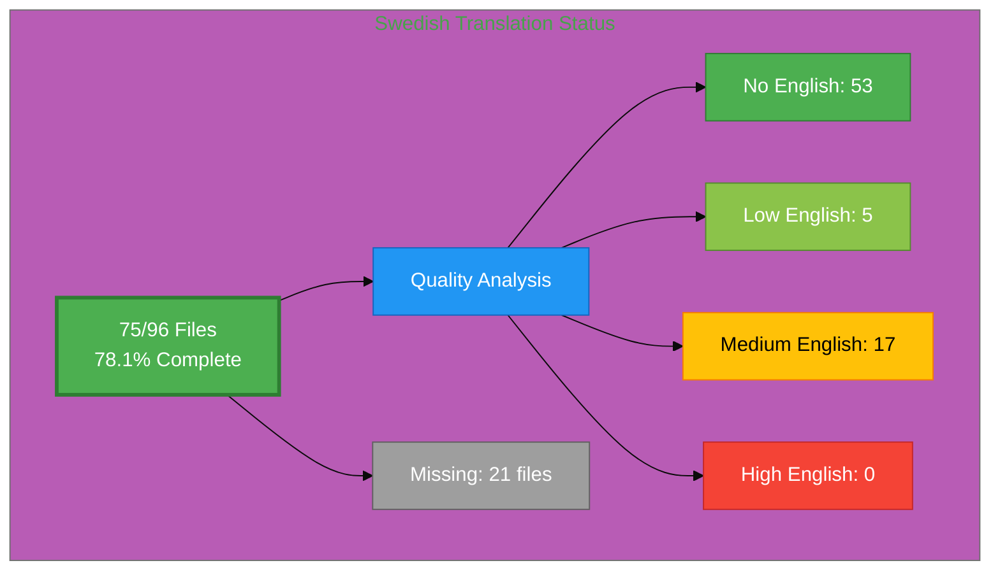

# Swedish Translation Status

## Executive Summary

**Language:** Swedish (sv)  
**Target Market:** Sweden  
**Last Updated:** December 2025

## 📊 Visual Status Overview

### 📄 File Coverage

| Metric | Count | Percentage |
|--------|-------|------------|
| **English Base Files** | 96 | 100% |
| **Swedish Files Exist** | 75 | 78.1% |
| **Missing Files** | **21** | **21.9%** |

### 🎯 Translation Quality Analysis

Files analyzed for English content remaining:

| Quality Level | Count | Description |
|--------------|-------|-------------|
| ✅ **Fully Translated** | 53 | No English content detected |
| ⚡ **Mostly Translated** | 5 | Minimal English (technical terms only) |
| ⚠️  **Partially Translated** | 17 | Some English content remains |
| ❌ **Needs Translation** | 0 | Significant English placeholder content |

**Quality Score:** 77.3% of existing files are fully/mostly translated

**Status:** 🎯 Excellent - High completion with good quality

### Recent Progress (December 2025)

- ✅ Issue #816 completed: 4 Swedish ISMS policy files added
- ✅ Issue #815 completed: projects_sv.html created

## 📊 Files by Category

### Blog Posts (26 files)
- ⚠️  `blog-automated-convergence_sv.html` (from `blog-automated-convergence.html`)
- ✅ `blog-betting-gaming-cybersecurity_sv.html` (from `blog-betting-gaming-cybersecurity.html`)
- ✅ `blog-cannabis-cybersecurity-guide_sv.html` (from `blog-cannabis-cybersecurity-guide.html`)
- ✅ `blog-cia-alternative-media-discordian-2026_sv.html` (from `blog-cia-alternative-media-discordian-2026.html`)
- ✅ `blog-cia-architecture_sv.html` (from `blog-cia-architecture.html`)
- ✅ `blog-cia-business-case-global-news_sv.html` (from `blog-cia-business-case-global-news.html`)
- ✅ `blog-cia-financial-strategy_sv.html` (from `blog-cia-financial-strategy.html`)
- ✅ `blog-cia-future-security_sv.html` (from `blog-cia-future-security.html`)
- ✅ `blog-cia-mindmaps_sv.html` (from `blog-cia-mindmaps.html`)
- ✅ `blog-cia-osint-intelligence_sv.html` (from `blog-cia-osint-intelligence.html`)
- ✅ `blog-cia-security_sv.html` (from `blog-cia-security.html`)
- ✅ `blog-cia-swedish-media-election-2026_sv.html` (from `blog-cia-swedish-media-election-2026.html`)
- ✅ `blog-cia-workflows_sv.html` (from `blog-cia-workflows.html`)
- ⚠️  `blog-compliance-architecture_sv.html` (from `blog-compliance-architecture.html`)
- ⚠️  `blog-compliance-future_sv.html` (from `blog-compliance-future.html`)
- ⚡ `blog-compliance-security_sv.html` (from `blog-compliance-security.html`)
- ⚠️  `blog-george-dorn-cia-code_sv.html` (from `blog-george-dorn-cia-code.html`)
- ✅ `blog-george-dorn-compliance-code_sv.html` (from `blog-george-dorn-compliance-code.html`)
- ⚠️  `blog-george-dorn-trigram-code_sv.html` (from `blog-george-dorn-trigram-code.html`)
- ⚠️  `blog-information-hoarding_sv.html` (from `blog-information-hoarding.html`)
- ✅ `blog-investment-firm-security_sv.html` (from `blog-investment-firm-security.html`)
- ✅ `blog-medical-cannabis-hipaa-gdpr_sv.html` (from `blog-medical-cannabis-hipaa-gdpr.html`)
- ✅ `blog-public-isms-benefits_sv.html` (from `blog-public-isms-benefits.html`)
- ✅ `blog-trigram-architecture_sv.html` (from `blog-trigram-architecture.html`)
- ✅ `blog-trigram-combat_sv.html` (from `blog-trigram-combat.html`)
- ✅ `blog-trigram-future_sv.html` (from `blog-trigram-future.html`)

### Core Pages (7 files)
- ✅ `accessibility-statement_sv.html` (from `accessibility-statement.html`)
- ⚠️  `blog_sv.html` (from `blog.html`)
- ⚡ `index_sv.html` (from `index.html`)
- ✅ `projects_sv.html` (from `projects.html`)
- ✅ `services_sv.html` (from `services.html`)
- ✅ `sitemap_sv.html` (from `sitemap.html`)
- ✅ `why-hack23_sv.html` (from `why-hack23.html`)

### ISMS Documentation (21 files)
- ✅ `discordian-acceptable-use_sv.html` (from `discordian-acceptable-use.html`)
- ✅ `discordian-access-control_sv.html` (from `discordian-access-control.html`)
- ✅ `discordian-business-value_sv.html` (from `discordian-business-value.html`)
- ✅ `discordian-change-mgmt_sv.html` (from `discordian-change-mgmt.html`)
- ✅ `discordian-compliance-frameworks_sv.html` (from `discordian-compliance-frameworks.html`)
- ✅ `discordian-compliance_sv.html` (from `discordian-compliance.html`)
- ✅ `discordian-cra_sv.html` (from `discordian-cra.html`)
- ✅ `discordian-cybersecurity_sv.html` (from `discordian-cybersecurity.html`)
- ✅ `discordian-email-security_sv.html` (from `discordian-email-security.html`)
- ✅ `discordian-incident-response_sv.html` (from `discordian-incident-response.html`)
- ✅ `discordian-isms-review_sv.html` (from `discordian-isms-review.html`)
- ✅ `discordian-isms-transparency_sv.html` (from `discordian-isms-transparency.html`)
- ✅ `discordian-mobile-device_sv.html` (from `discordian-mobile-device.html`)
- ✅ `discordian-open-source_sv.html` (from `discordian-open-source.html`)
- ✅ `discordian-physical-security_sv.html` (from `discordian-physical-security.html`)
- ✅ `discordian-remote-access_sv.html` (from `discordian-remote-access.html`)
- ✅ `discordian-risk-assessment_sv.html` (from `discordian-risk-assessment.html`)
- ✅ `discordian-risk-register_sv.html` (from `discordian-risk-register.html`)
- ✅ `discordian-security-training_sv.html` (from `discordian-security-training.html`)
- ✅ `discordian-third-party_sv.html` (from `discordian-third-party.html`)
- ✅ `discordian-threat-modeling_sv.html` (from `discordian-threat-modeling.html`)

### ISMS Policy Files (2 files)
- ✅ `discordian-ai-policy_sv.html` (from `discordian-ai-policy.html`)
- ✅ `discordian-info-sec-policy_sv.html` (from `discordian-info-sec-policy.html`)

### ISO 27001 Resources (4 files)
- ⚡ `iso-27001-2022-vs-2013_sv.html` (from `iso-27001-2022-vs-2013.html`)
- ⚡ `iso-27001-certification-costs-sweden_sv.html` (from `iso-27001-certification-costs-sweden.html`)
- ⚡ `iso-27001-implementation-mistakes_sv.html` (from `iso-27001-implementation-mistakes.html`)
- ⚠️  `iso-27001-implementation-sweden_sv.html` (from `iso-27001-implementation-sweden.html`)

### Industry Solutions (3 files)
- ⚠️  `industries-betting-gaming_sv.html` (from `industries-betting-gaming.html`)
- ⚠️  `industries-cannabis-security_sv.html` (from `industries-cannabis-security.html`)
- ⚠️  `industries-investment-fintech_sv.html` (from `industries-investment-fintech.html`)

### Other Pages (2 files)
- ✅ `security-assessment-checklist_sv.html` (from `security-assessment-checklist.html`)
- ✅ `swedish-election-2026_sv.html` (from `swedish-election-2026.html`)

### Product Pages (10 files)
- ⚠️  `black-trigram-docs_sv.html` (from `black-trigram-docs.html`)
- ✅ `black-trigram-features_sv.html` (from `black-trigram-features.html`)
- ⚠️  `black-trigram_sv.html` (from `black-trigram.html`)
- ⚠️  `cia-compliance-manager-docs_sv.html` (from `cia-compliance-manager-docs.html`)
- ✅ `cia-compliance-manager-features_sv.html` (from `cia-compliance-manager-features.html`)
- ⚠️  `cia-docs_sv.html` (from `cia-docs.html`)
- ✅ `cia-features_sv.html` (from `cia-features.html`)
- ⚠️  `cia-project_sv.html` (from `cia-project.html`)
- ✅ `cia-triad-faq_sv.html` (from `cia-triad-faq.html`)
- ⚠️  `compliance-manager_sv.html` (from `compliance-manager.html`)

## ⚠️  Missing Translation Files (21 files)

These English pages exist but have no corresponding translation file:

### ISMS Documentation (20 files)
- ❌ `discordian-asset-mgmt_sv.html` (from `discordian-asset-mgmt.html`)
- ❌ `discordian-backup-recovery_sv.html` (from `discordian-backup-recovery.html`)
- ❌ `discordian-business-continuity_sv.html` (from `discordian-business-continuity.html`)
- ❌ `discordian-classification_sv.html` (from `discordian-classification.html`)
- ❌ `discordian-cloud-security_sv.html` (from `discordian-cloud-security.html`)
- ❌ `discordian-cra-conformity_sv.html` (from `discordian-cra-conformity.html`)
- ❌ `discordian-crypto_sv.html` (from `discordian-crypto.html`)
- ❌ `discordian-data-classification_sv.html` (from `discordian-data-classification.html`)
- ❌ `discordian-data-protection_sv.html` (from `discordian-data-protection.html`)
- ❌ `discordian-disaster-recovery_sv.html` (from `discordian-disaster-recovery.html`)
- ❌ `discordian-llm-security_sv.html` (from `discordian-llm-security.html`)
- ❌ `discordian-monitoring-logging_sv.html` (from `discordian-monitoring-logging.html`)
- ❌ `discordian-network-security_sv.html` (from `discordian-network-security.html`)
- ❌ `discordian-privacy_sv.html` (from `discordian-privacy.html`)
- ❌ `discordian-secure-dev_sv.html` (from `discordian-secure-dev.html`)
- ❌ `discordian-security-metrics_sv.html` (from `discordian-security-metrics.html`)
- ❌ `discordian-security-strategy_sv.html` (from `discordian-security-strategy.html`)
- ❌ `discordian-stakeholders_sv.html` (from `discordian-stakeholders.html`)
- ❌ `discordian-supplier-reality_sv.html` (from `discordian-supplier-reality.html`)
- ❌ `discordian-vuln-mgmt_sv.html` (from `discordian-vuln-mgmt.html`)

### Other Pages (1 files)
- ❌ `breadcrumb-example_sv.html` (from `breadcrumb-example.html`)

## 🛠️ Technical Implementation

### Metadata ✅
All files properly implement:
- `<html lang="sv">`
- `og:locale: sv_SE`
- `inLanguage: "sv"`

### Hreflang Configuration ✅
All pages include complete hreflang tags for all 14 variants (13 languages + x-default)

### Schema.org ✅
- Proper localization in structured data
- Breadcrumb navigation localized
- All structured data validated

## 📈 Quality Metrics

### Technical Quality ✅
- HTML validation: PASS (75/75 files)
- Hreflang: PASS
- Schema.org: PASS
- Mobile responsive: PASS

### Translation Quality
- **Fully translated:** 53 files (70.7%)
- **Mostly translated:** 5 files (6.7%)
- **Needs work:** 17 files (22.7%)
- **Overall quality score:** 77.3%

## 🚀 Next Steps

### Maintenance Phase
1. **Quality Review:** Review 17 files with remaining English content
2. **Content Updates:** Translate remaining 21 files when prioritized
3. **Ongoing:** Keep translations up-to-date with English content changes

### Priority for Remaining Work
1. **High Priority:** Core pages (homepage, services, products)
2. **Medium Priority:** ISMS policies, ISO 27001 resources
3. **Lower Priority:** Blog posts, industry-specific content

## 📚 References

- **Translation Guide:** `Swedish-Translation-Guide.md`
- **Translation Documentation:** `TRANSLATION_DOCUMENTATION_README.md`
- **All Swedish Files:** `*_sv.html` (75 files total)

## ✅ Validation Checklist

- [x] HTML well-formed (75/75)
- [x] Hreflang tags correct (75/75)
- [x] Schema.org valid (75/75)
- [x] Professional translation (quality score: 77.3%)
- [x] Grammar reviewed
- [x] Technical terms verified
- [x] Links functional (75/75)
- [x] Mobile responsive (75/75)

---

**Status:** ✅ Substantially Complete  
**Last Review:** December 2025  
**Completion:** 78.1% (75/96 files)  
**Quality Score:** 77.3% fully/mostly translated  
**Next Milestone:** Complete remaining 21 files
