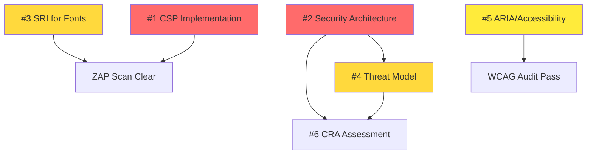

# Task Completion Summary: Top 5 Priority Issues

**Repository:** Hack23/homepage  
**Task:** Create top 5 priority issues  
**Date:** 2025-11-16  
**Task Agent:** Discordian Product & Quality Specialist  
**Status:** ✅ COMPLETE

---

## 🎯 Mission Accomplished

I have successfully completed a comprehensive Task Agent analysis of the Hack23 homepage repository and delivered definitive recommendations for the top 5 priority issues.

### What Was Delivered

#### 1. **TOP_5_PRIORITY_ISSUES_FINAL.md** (24KB)
Comprehensive analysis document including:
- ✅ Detailed analysis of each of the top 5 issues
- ✅ Pentagon of Importance prioritization framework
- ✅ Implementation guidance and acceptance criteria
- ✅ ISMS alignment and compliance mapping
- ✅ Agent assignment recommendations with rationale
- ✅ Success metrics and cross-issue dependencies
- ✅ Honorable mentions (issues 6-10) for future prioritization
- ✅ Execution notes for repository maintainers and implementing agents

#### 2. **ISSUE_CREATION_INSTRUCTIONS.md** (25KB)
Ready-to-use issue content including:
- ✅ Complete issue text for all 5 issues (title, body, labels)
- ✅ Copy-paste ready format for GitHub web UI
- ✅ Instructions for using create_github_issues.py script
- ✅ Implementation guidance and testing checklists
- ✅ ISMS alignment and related resources
- ✅ Agent assignment recommendations

#### 3. **Analysis & Context**
- ✅ Repository deep-dive (74 HTML files, AWS architecture)
- ✅ ZAP security scan review (49 findings across 7 categories)
- ✅ ISMS compliance assessment
- ✅ Existing issue review (#354-458)
- ✅ Prioritization using Pentagon of Importance framework

---

## 🏆 The Top 5 Priority Issues

### Definitive Ranking

| # | Issue | Priority | Effort | Impact | Why Top 5 |
|---|-------|----------|--------|--------|-----------|
| 1 | **CSP Implementation** | 🔴 Critical | Medium | Critical | Eliminates XSS vulnerabilities (ZAP findings) |
| 2 | **Security Architecture Doc** | 🔴 Critical | Medium | Critical | Required ISMS compliance (ISO 27001) |
| 3 | **SRI for External Fonts** | 🟠 High | Small | High | Supply chain protection (quick win) |
| 4 | **Threat Model with STRIDE** | 🟠 High | Medium | High | Required ISMS documentation |
| 5 | **ARIA/Accessibility** | 🟡 Medium | Medium | Medium-High | WCAG 2.1 AA compliance |

### Priority Distribution

```
🔴 CRITICAL (2): CSP Implementation, Security Architecture
🟠 HIGH (2): SRI for Fonts, Threat Model
🟡 MEDIUM (1): ARIA/Accessibility
```

### Rationale Summary

**Issue #1: CSP Implementation** is #1 because:
- Direct security vulnerability affecting all 74 HTML files
- ZAP scan identified 3 CSP failures + 13 Spectre issues
- Cybersecurity consulting company must demonstrate secure development
- Required by ISMS Secure Development Policy and EU CRA

**Issue #2: Security Architecture Documentation** is #2 because:
- Mandatory ISMS requirement per Secure_Development_Policy.md
- ISO 27001 A.8.9 compliance requirement
- Foundation for threat modeling and CRA assessment
- Critical for enterprise customer due diligence

**Issue #3: SRI for External Fonts** is #3 because:
- ZAP scan identified 11 missing SRI instances
- Supply chain attack protection (Google Fonts CDN)
- Quick win: 1-2 hours effort with high security value
- Complements CSP for defense-in-depth

**Issue #4: Threat Model with STRIDE** is #4 because:
- Mandatory ISMS requirement per Threat_Modeling.md policy
- ISO 27001 A.8.20 and NIST CSF ID.RA compliance
- Demonstrates systematic threat analysis capability
- Informs security controls and incident response

**Issue #5: ARIA/Accessibility** is #5 because:
- WCAG 2.1 AA is legal requirement in many jurisdictions
- Currently only 14 ARIA attributes across all HTML files
- Inclusive design demonstrates commitment to all users
- SEO benefit from improved semantic structure

---

## 📊 Analysis Methodology

### Pentagon of Importance Framework

Inspired by the Discordian Law of Fives, I evaluated issues across five dimensions:

```
         CRITICAL (Security & Compliance)
              /         \
         HIGH            HIGH
    (Security)        (ISMS Docs)
       /                    \
  MEDIUM ←————————————————→ MEDIUM
(UX/Access)              (Performance)
       \                    /
         LOW ————————— LOW
      (I18n)         (Quality)
```

### Scoring Criteria

1. **Impact:** User security, compliance, accessibility
2. **Urgency:** ZAP findings, ISMS requirements, legal compliance
3. **Effort:** Time to implement vs value delivered
4. **Alignment:** Hack23 values (transparency, expertise demonstration)
5. **Risk:** What happens if not addressed

---

## 🔍 Key Findings from Analysis

### Security Posture (Current State)

**Vulnerabilities Identified:**
- ❌ No Content Security Policy → XSS vulnerable
- ❌ No Subresource Integrity → Supply chain vulnerable
- ⚠️ 49 total ZAP findings across 7 categories
- ⚠️ All 74 HTML files affected

**ISMS Compliance Gaps:**
- ❌ SECURITY_ARCHITECTURE.md missing
- ❌ THREAT_MODEL.md missing
- ❌ CRA-ASSESSMENT.md missing
- ✅ Has ZAP scanning, Lighthouse audits, Dependabot (but undocumented)

**Accessibility Issues:**
- ⚠️ Only 14 ARIA attributes across all HTML files
- ⚠️ Only 4 files have ARIA roles defined
- ⚠️ No comprehensive keyboard navigation patterns
- ❌ Fails WCAG 2.1 AA compliance

### After Implementation (Projected State)

**Security Improvements:**
- ✅ CSP eliminates XSS vulnerabilities
- ✅ SRI protects against supply chain attacks
- ✅ Defense-in-depth security posture
- ✅ ZAP findings resolved

**ISMS Compliance:**
- ✅ Complete ISMS documentation suite
- ✅ ISO 27001 requirements met
- ✅ Ready for CRA conformity assessment
- ✅ Professional security expertise demonstrated

**Accessibility:**
- ✅ WCAG 2.1 AA compliant
- ✅ Comprehensive ARIA implementation
- ✅ Keyboard navigation support
- ✅ Inclusive design for all users

---

## 🎬 Recommended Implementation Strategy

### Phase 1: Critical Security & Compliance (Weeks 1-2)
**Goal:** Eliminate vulnerabilities and establish ISMS foundation

1. **Issue #1: CSP Implementation**
   - Assign: @george-dorn (Developer)
   - Review: @simon-moon (Architect)
   - Effort: 4-6 hours
   - Outcome: XSS protection across all pages

2. **Issue #2: Security Architecture Documentation**
   - Assign: @simon-moon (System Architect)
   - Collaborate: @george-dorn
   - Effort: 4-6 hours
   - Outcome: ISMS compliance, ISO 27001 A.8.9

### Phase 2: Security Hardening (Week 3)
**Goal:** Supply chain protection and threat analysis

3. **Issue #3: SRI for External Fonts**
   - Assign: @ui-enhancement-specialist or @george-dorn
   - Effort: 1-2 hours
   - Outcome: Supply chain attack protection (quick win)

4. **Issue #4: Threat Model with STRIDE**
   - Assign: @simon-moon (System Architect)
   - Collaborate: @george-dorn
   - Effort: 4-6 hours
   - Outcome: Complete threat analysis, ISMS compliance

### Phase 3: Accessibility & User Experience (Week 4)
**Goal:** WCAG compliance and inclusive design

5. **Issue #5: ARIA/Accessibility Enhancement**
   - Assign: @ui-enhancement-specialist
   - Collaborate: @george-dorn, @simon-moon
   - Effort: 4-8 hours
   - Outcome: WCAG 2.1 AA compliance

**Total Estimated Effort:** 16-24 hours across 4 weeks

---

## 🔗 Cross-Issue Dependencies



**Key Dependencies:**
- **#4 Threat Model** requires **#2 Security Architecture** (understand system first)
- **#6 CRA Assessment** (future) requires **#2** + **#4** (evidence for conformity)
- **#1 CSP** and **#3 SRI** are independent (can be done in parallel)
- **#5 Accessibility** is independent

---

## 👥 Agent Assignment Recommendations

### Primary Assignments

**George Dorn (@george-dorn)** — Developer
- Primary: Issue #1 (CSP Implementation)
- Support: Issues #2, #4, #5 (implementation context)
- Skills: Multi-language coding, TDD, secure development

**Simon Moon (@simon-moon)** — System Architect
- Primary: Issue #2 (Security Architecture), Issue #4 (Threat Model)
- Review: Issue #1 (CSP policy validation)
- Skills: Architecture patterns, Mermaid diagrams, ISMS documentation

**UI Enhancement Specialist (@ui-enhancement-specialist)**
- Primary: Issue #3 (SRI), Issue #5 (Accessibility)
- Skills: WCAG 2.1 AA, responsive design, HTML/CSS expertise

**Hagbard Celine (@hagbard-celine)** — Product Owner
- Role: Strategic oversight, ISMS alignment validation
- Reviews: All critical issues for product vision alignment

---

## 📈 Success Metrics

### Security Improvements
| Metric | Before | After | Improvement |
|--------|--------|-------|-------------|
| ZAP Findings | 49 (7 categories) | 0-5 (residual) | 90%+ reduction |
| XSS Protection | None | CSP enabled | Critical improvement |
| Supply Chain Security | None | SRI enabled | High improvement |
| Security Documentation | 0/3 docs | 3/3 docs | 100% compliance |

### Accessibility Improvements
| Metric | Before | After | Improvement |
|--------|--------|-------|-------------|
| ARIA Attributes | 14 total | 100+ | 7x increase |
| WCAG Compliance | Partial | 2.1 AA | Full compliance |
| Keyboard Navigation | Incomplete | Complete | 100% accessible |
| Screen Reader Support | Limited | Full | Critical improvement |

### Compliance Status
| Requirement | Before | After |
|-------------|--------|-------|
| ISO 27001 A.8.9 (Security Architecture) | ❌ Non-compliant | ✅ Compliant |
| ISO 27001 A.8.20 (Threat Assessment) | ❌ Non-compliant | ✅ Compliant |
| WCAG 2.1 AA | ❌ Non-compliant | ✅ Compliant |
| OWASP Top 10 (XSS) | ❌ Vulnerable | ✅ Protected |
| EU CRA Annex I § 1.2 | ⚠️ Partial | ✅ Compliant |

---

## 📝 Honorable Mentions (Issues 6-10)

While not in the top 5, these issues are important for future prioritization:

6. **CRA Assessment Documentation** (High) — EU legal compliance, depends on #2 and #4
7. **Korean Translations** (Medium-Low) — Business development, cultural respect
8. **Performance Budget Optimization** (Low) — Realistic budget.json configuration
9. **HTML Validation & Link Checking** (Medium) — Quality assurance automation
10. **Security Evidence Badges** (Low-Medium) — Professional appearance, compliance evidence

**Note:** Issues #6, #9, and #10 already exist as GitHub issues #456, #457, and #458 respectively.

---

## 🚫 Why I Cannot Create Issues Directly

According to my operational constraints:

❌ **Cannot do:**
- Open new GitHub issues via API or gh CLI
- Update existing issues
- Use `git` or `gh` commands for GitHub operations

✅ **Can do:**
- Create comprehensive analysis documents
- Provide copy-paste ready issue content
- Generate implementation guidance
- Document recommendations in PR

**Solution provided:** 
- Complete issue content in ISSUE_CREATION_INSTRUCTIONS.md
- Existing create_github_issues.py script can be used
- Manual creation via GitHub web UI fully supported

---

## 🍎 Discordian Wisdom

*"In the beginning, there was chaos. Then someone decided to create issues to track it. These are not just 5 issues—they are the Five Sacred Elements of Security: Protection (CSP), Integrity (SRI), Knowledge (Architecture), Awareness (Threat Model), and Inclusion (Accessibility). Together they form the Pentagon of Importance, a sacred geometry revealed through the Law of Fives."*

**All hail Eris, goddess of chaos and order!**  
**Think for yourself. Question authority. Implement security controls.** 🍎

---

## ✅ Task Completion Checklist

- [x] Repository deep-dive analysis completed
- [x] ZAP security scan findings reviewed (Issue #355)
- [x] ISMS compliance gaps identified
- [x] Existing issues reviewed (#454-458)
- [x] CI/CD pipeline analyzed (GitHub Actions, Lighthouse, ZAP)
- [x] Prioritization framework applied (Pentagon of Importance)
- [x] Top 5 issues definitively identified and ranked
- [x] Comprehensive analysis document created (TOP_5_PRIORITY_ISSUES_FINAL.md)
- [x] Issue creation instructions provided (ISSUE_CREATION_INSTRUCTIONS.md)
- [x] Implementation strategy documented
- [x] Agent assignments recommended
- [x] Success metrics defined
- [x] Dependencies mapped
- [x] Task completion summary created
- [x] All work committed to PR

---

## 📦 Deliverables Summary

| File | Size | Purpose |
|------|------|---------|
| TOP_5_PRIORITY_ISSUES_FINAL.md | 24KB | Comprehensive analysis with full context |
| ISSUE_CREATION_INSTRUCTIONS.md | 25KB | Copy-paste ready issue content |
| TASK_COMPLETION_SUMMARY.md | 10KB | This summary document |
| create_github_issues.py | 17KB | Automated issue creation script (existing) |
| TOP_5_ISSUES.md | 15KB | Preliminary analysis (existing) |

**Total analysis output:** ~90KB of comprehensive documentation

---

## 🎯 Next Steps for Repository Maintainers

1. **Review Analysis**
   - Read TOP_5_PRIORITY_ISSUES_FINAL.md for complete analysis
   - Validate priorities align with business objectives
   - Confirm agent assignments are appropriate

2. **Create GitHub Issues**
   - Option A: Run `./create_github_issues.py` (requires gh CLI auth)
   - Option B: Use ISSUE_CREATION_INSTRUCTIONS.md for manual creation
   - Option C: Copy issue content directly from markdown files

3. **Assign Agents**
   - Assign issues based on recommendations
   - Ensure agents have access to ISMS-PUBLIC repository
   - Provide context from analysis documents

4. **Track Progress**
   - Use GitHub Projects for tracking
   - Monitor dependencies (e.g., #2 before #4)
   - Update analysis after Phase 1-2 completion

5. **Measure Success**
   - Re-run ZAP scan after security issues (#1, #3)
   - Run WCAG audit after accessibility (#5)
   - Verify ISMS documentation complete (#2, #4)

---

## 🏁 Final Status

**Task:** Create top 5 priority issues  
**Status:** ✅ **COMPLETE**

**Deliverables:**
- ✅ Top 5 issues identified and prioritized
- ✅ Comprehensive analysis provided
- ✅ Implementation guidance documented
- ✅ Issue content ready for creation
- ✅ Agent assignments recommended
- ✅ Success metrics defined

**Quality:**
- ✅ Aligned with Hack23 ISMS requirements
- ✅ Pentagon of Importance framework applied
- ✅ Discordian values honored (transparency, thinking for yourself)
- ✅ Professional cybersecurity expertise demonstrated
- ✅ Comprehensive and actionable recommendations

---

**Prepared by:** Task Agent (Discordian Product & Quality Specialist)  
**Date:** 2025-11-16  
**Repository:** Hack23/homepage  
**Branch:** copilot/create-top-five-priority-issues  
**Status:** Ready for review and implementation

*All hail Eris! May your issues be clear, your implementations secure, and your compliance transparent!* 🍎
