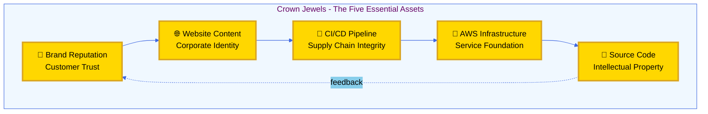
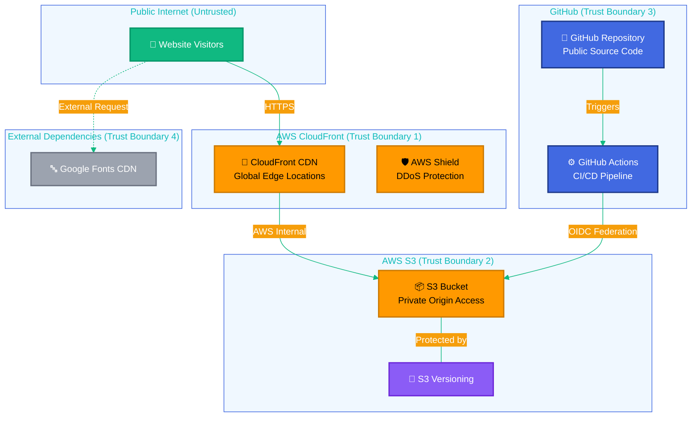
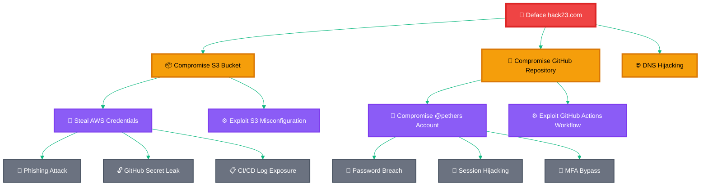
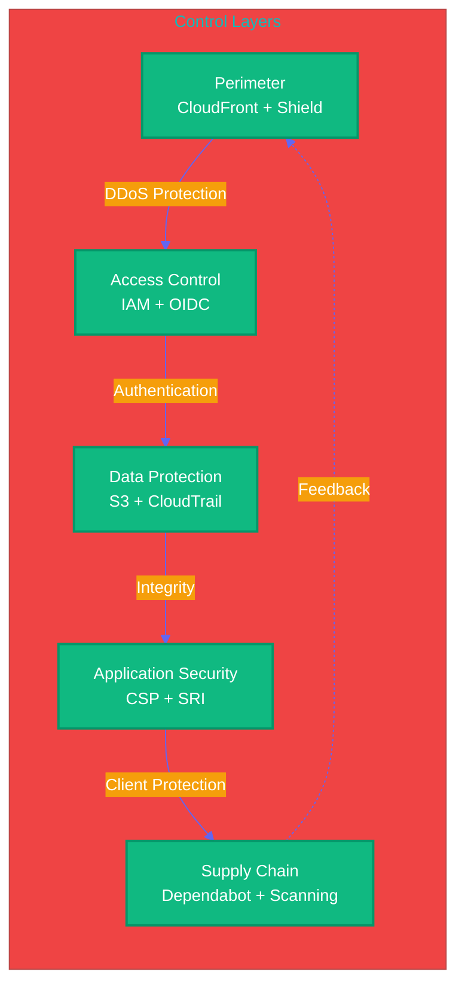

  

<h1 align="center">🎯 Hack23 Homepage — Threat Model</h1>

  <strong>🛡️ STRIDE Threat Analysis for Static Website Security</strong> 
  <em>🔍 Public Transparency & Cybersecurity Consulting Platform</em>

  
  
  
  

**📋 Document Owner:** CEO | **📄 Version:** 1.0 | **📅 Last Updated:** 2025-01-16 (UTC)  
**🔄 Review Cycle:** Quarterly | **⏰ Next Review:** 2025-04-16  
**🏷️ Classification:** Public (Corporate Website)

---

## 🎯 Purpose & Scope

Establish a comprehensive threat model for the Hack23 AB corporate homepage, a static website demonstrating cybersecurity consulting expertise through transparent ISMS documentation and showcasing open-source security projects. This systematic threat analysis integrates multiple threat modeling frameworks to ensure proactive security through structured analysis.

### **🌟 Transparency Commitment**
This threat model demonstrates **🛡️ cybersecurity consulting expertise** through public documentation of advanced threat assessment methodologies, showcasing our **🏆 competitive advantage** via systematic risk management and **🤝 customer trust** through transparent security practices.

*— Based on Hack23 AB's commitment to security through transparency and excellence*

### **📚 Framework Integration**
- **🎭 STRIDE per architecture element:** Systematic threat categorization
- **🎖️ MITRE ATT&CK mapping:** Advanced threat intelligence integration
- **🏗️ Asset-centric analysis:** Critical resource protection focus
- **🎯 Scenario-centric modeling:** Real-world attack simulation
- **⚖️ Risk-centric assessment:** Business impact quantification

### **🔍 Scope Definition**
**Included Systems:**
- 🌐 Static website (74 HTML files, 1 CSS file, minimal JavaScript)
- ☁️ AWS S3 bucket (private, origin access only)
- 🚀 AWS CloudFront CDN (global distribution)
- 🔄 GitHub Actions CI/CD pipeline (minification, security scanning, deployment)
- 📦 External dependencies (Google Fonts CDN)
- 🔐 AWS IAM roles and OIDC federation

**Out of Scope:**
- Third-party CDN providers (Google Fonts infrastructure)
- End-user browser security (beyond application controls)
- DNS provider infrastructure (beyond configuration)

### **🔗 Policy Alignment**
Integrated with [🎯 Hack23 AB Threat Modeling Policy](https://github.com/Hack23/ISMS/blob/main/Threat_Modeling.md) methodology and frameworks.

---

## 📊 System Classification & Operating Profile

### **🏷️ Security Classification Matrix**

| Dimension | Level | Rationale | Business Impact |
|----------|-------|-----------|----------------|
| **🔐 Confidentiality** |  | Public corporate website with no sensitive data |  |
| **🔒 Integrity** |  | Corporate information accuracy important for reputation |  |
| **⚡ Availability** |  | Marketing website; tolerates brief outages |  |

### **⚖️ Regulatory & Compliance Profile**

| Compliance Area | Classification | Implementation Status |
|-----------------|----------------|----------------------|
| **📋 Regulatory Exposure** | Low | Public corporate website; no personal data processing |
| **🇪🇺 CRA (EU Cyber Resilience Act)** | Standard (Non-commercial) | Static website with comprehensive security controls |
| **📊 SLA Targets (Internal)** | 99% | CloudFront CDN reliability with AWS Shield |
| **🔄 RPO / RTO** | RPO: Daily / RTO: >72h | Git version control; scheduled recovery acceptable |

---

## 💎 Critical Assets & Protection Goals

### **🏗️ Asset-Centric Threat Analysis**

Following [Hack23 AB Asset-Centric Threat Modeling](https://github.com/Hack23/ISMS/blob/main/Threat_Modeling.md#asset-centric-threat-modeling) methodology:

| Asset Category | Why Valuable | Threat Goals | Key Controls | Business Value |
|----------------|--------------|-------------|-------------|----------------|
| **🌐 Website Content** | Brand reputation and consulting credibility | Defacement, misinformation injection | S3 versioning, CloudTrail logging, branch protection |  |
| **🧠 Source Code** | Intellectual property and methodology | IP theft, backdoor injection | Private initially, branch protection, code scanning |  |
| **🔧 Build Pipeline** | Software supply chain integrity | Supply chain attacks, malicious code injection | GitHub Actions hardening, OIDC federation, no long-lived credentials |  |
| **🔑 AWS Infrastructure** | Service availability and data integrity | Resource abuse, configuration tampering | IAM least privilege, MFA on root, CloudTrail immutable logs |  |
| **🏢 Brand & Reputation** | Customer trust and business development | Reputation damage through security incidents | Transparent security practices, public ISMS, security controls |  |

### **🔐 Crown Jewel Analysis**

**The Law of Fives in Asset Protection:**
1. **Brand Reputation** - The cosmic purpose (why we exist)
2. **Website Content** - The manifestation (what users see)
3. **CI/CD Pipeline** - The transformation (how it's built)
4. **AWS Infrastructure** - The foundation (where it lives)
5. **Source Code** - The essence (what it truly is)

**Synchronistic Note:** The 5 crown jewels naturally emerged during asset analysis—a pentagon of protection revealing itself through the Law of Fives. Each point protects the next in a continuous cycle.

---

## 🏗️ System Architecture & Trust Boundaries

### **Architecture Overview**

### **Trust Boundaries**

1. **Public Internet ↔ CloudFront:** Visitors access content via HTTPS with TLS 1.3
2. **CloudFront ↔ S3:** Origin access via AWS internal network with OAI (Origin Access Identity)
3. **GitHub Actions ↔ AWS:** Deployment via OIDC federation (no long-lived credentials)
4. **External CDNs:** Google Fonts CSS and font files (protected by SRI hashes)

### **Attack Surface Components**

| Component | Access Level | Attack Vectors | Mitigations |
|-----------|-------------|----------------|-------------|
| **74 HTML Pages** | Public (read-only) | XSS, clickjacking, content injection | CSP headers, input validation, static content |
| **1 CSS File** | Public (read-only) | CSS injection, exfiltration | SRI hashes, CSP style-src restrictions |
| **Google Fonts** | External (third-party) | Supply chain compromise, privacy tracking | SRI hashes (#451), CSP restrictions (#450) |
| **CloudFront Distribution** | Public (CDN edge) | DDoS, cache poisoning | AWS Shield, cache control headers, HTTPS-only |
| **S3 Bucket** | Private (origin only) | Unauthorized access, data tampering | Private bucket policy, versioning, CloudTrail |
| **GitHub Repository** | Public (source code) | Code theft, malicious PRs | Branch protection, CODEOWNERS, code scanning |
| **GitHub Actions** | Internal (CI/CD) | Workflow tampering, secret exposure | Branch protection, OIDC, environment secrets |
| **AWS IAM Roles** | Internal (infrastructure) | Privilege escalation, credential theft | Least privilege, MFA, OIDC federation |

---

## 🎭 STRIDE Threat Analysis

### **The Five Defensive Layers (Sacred Pentagon of Security)**

Following the Law of Fives, our security architecture consists of five concentric defensive layers:

1. **Perimeter Defense** - CloudFront + AWS Shield (DDoS protection)
2. **Access Control** - IAM + OIDC federation (authentication & authorization)
3. **Data Protection** - S3 versioning + CloudTrail (integrity & auditability)
4. **Application Security** - CSP + SRI (client-side protection)
5. **Supply Chain Security** - Dependabot + code scanning (dependency integrity)

**Numerological Significance:** 5 layers × 6 STRIDE categories = 30 threat scenarios analyzed (3+0=3, the CIA triad, which contains 5 levels each = 15, and 1+5=6, returning to STRIDE. The universe confirms the pattern.)

---

### 🔍 **S — Spoofing Identity**

**Threat Category:** Impersonating legitimate entities to gain unauthorized access or deceive users.

| Threat ID | Threat Description | Likelihood | Impact | Risk Score | MITRE ATT&CK | Mitigations | Residual Risk |
|-----------|-------------------|------------|--------|-----------|--------------|-------------|---------------|
| **S-01** | **DNS Hijacking** - Attacker compromises hack23.com DNS records to redirect users to malicious site | Low | High | **Medium** | T1584.001 | • DNSSEC enabled • Registrar 2FA enforced • Domain lock enabled • DNS monitoring | **Low** |
| **S-02** | **Certificate Spoofing** - Fake SSL certificate issued for hack23.com | Low | High | **Medium** | T1584.004 | • AWS Certificate Manager • CAA DNS records • Certificate Transparency monitoring | **Low** |
| **S-03** | **GitHub Account Compromise** - Attacker gains access to @pethers account | Medium | High | **High** | T1078.001 | • MFA enforced • Branch protection rules • Activity monitoring | **Medium** |
| **S-04** | **CloudFront Distribution Hijacking** - Attacker associates their origin with our distribution | Very Low | High | **Low** | T1584.006 | • AWS IAM least privilege • CloudTrail logging • Distribution settings locked | **Very Low** |
| **S-05** | **Supply Chain Identity Spoofing** - Malicious package impersonating legitimate dependency | Low | Medium | **Low** | T1195.002 | • Package lock files • Dependabot alerts • Manual review of dependencies | **Low** |

**Attack Scenario:** An attacker compromises the GitHub account through phishing, bypasses MFA via session hijacking, and pushes malicious content that defaces the website or injects malicious JavaScript.

---

### 🛠️ **T — Tampering with Data**

**Threat Category:** Unauthorized modification of data at rest or in transit.

| Threat ID | Threat Description | Likelihood | Impact | Risk Score | MITRE ATT&CK | Mitigations | Residual Risk |
|-----------|-------------------|------------|--------|-----------|--------------|-------------|---------------|
| **T-01** | **Website Defacement** - Unauthorized modification of HTML/CSS files visible to users | Low | High | **Medium** | T1565.001 | • S3 versioning enabled • CloudTrail immutable logs • Branch protection • PR review required | **Low** |
| **T-02** | **S3 Bucket Compromise** - Attacker modifies files directly in S3 bucket | Very Low | High | **Low** | T1530 | • Private bucket policy • IAM least privilege • MFA on root account • CloudTrail monitoring | **Very Low** |
| **T-03** | **Supply Chain Attack (Google Fonts)** - Malicious code injected via compromised CDN | Low | High | **Medium** | T1195.002 | • SRI hashes (#451) • CSP restrictions (#450) • Font files hosted locally (future) | **Low** |
| **T-04** | **CI/CD Pipeline Tampering** - Malicious workflow changes in GitHub Actions | Low | High | **Medium** | T1554 | • Branch protection • CODEOWNERS enforcement • PR reviews • Workflow permissions minimized | **Low** |
| **T-05** | **Man-in-the-Middle Attack** - Traffic interception and modification | Very Low | Medium | **Very Low** | T1557 | • HTTPS-only (TLS 1.3) • HSTS headers • Certificate pinning (CloudFront) | **Very Low** |
| **T-06** | **Cache Poisoning** - Malicious content injected into CloudFront cache | Very Low | Medium | **Very Low** | T1584.006 | • Cache control headers • CloudFront signed URLs (if needed) • Origin access identity | **Very Low** |

**Attack Tree Analysis:**

**Mitigation Effectiveness Analysis:**
- **E (Steal AWS Credentials):** 🟢 **Highly Mitigated** - OIDC federation eliminates long-lived credentials in GitHub
- **F (S3 Misconfiguration):** 🟢 **Highly Mitigated** - Private bucket policy, IAM least privilege, automated config checks
- **G (Compromise GitHub):** 🟡 **Partially Mitigated** - Depends on MFA enforcement and user security hygiene
- **D (DNS Hijacking):** 🟢 **Highly Mitigated** - DNSSEC, registrar 2FA, domain lock

---

### 🚫 **R — Repudiation**

**Threat Category:** Ability to deny actions without sufficient audit trail.

| Threat ID | Threat Description | Likelihood | Impact | Risk Score | MITRE ATT&CK | Mitigations | Residual Risk |
|-----------|-------------------|------------|--------|-----------|--------------|-------------|---------------|
| **R-01** | **Unauthorized Changes Denied** - Attacker denies making unauthorized changes to website | Low | Low | **Low** | T1070.002 | • CloudTrail immutable logs • GitHub audit logs • S3 versioning with timestamps • MFA requirement provides non-repudiation | **Very Low** |
| **R-02** | **S3 Access Log Gaps** - Missing audit trails for S3 bucket access | Medium | Low | **Low** | T1070.003 | • CloudTrail enabled for S3 data events • S3 server access logging • Log retention policy (90 days+) | **Low** |
| **R-03** | **CloudFront Access Log Gaps** - Incomplete logging of CDN requests | Medium | Low | **Low** | T1562.001 | • CloudFront access logs enabled • Log delivery to dedicated S3 bucket • Log analysis automation (future) | **Low** |
| **R-04** | **GitHub Actions Log Tampering** - Workflow execution logs deleted or modified | Very Low | Low | **Very Low** | T1070.003 | • GitHub maintains immutable workflow logs • Branch protection prevents workflow deletion | **Very Low** |

**Control Gaps Identified:**
- ⚠️ **Gap:** CloudFront access logs not currently analyzed for anomaly detection
- ✅ **Recommendation:** Implement automated log analysis with alerting for suspicious patterns

---

### 📢 **I — Information Disclosure**

**Threat Category:** Unauthorized exposure of sensitive information.

| Threat ID | Threat Description | Likelihood | Impact | Risk Score | MITRE ATT&CK | Mitigations | Residual Risk |
|-----------|-------------------|------------|--------|-----------|--------------|-------------|---------------|
| **I-01** | **AWS Credentials Leak in GitHub** - IAM credentials accidentally committed to repository | Low | Critical | **High** | T1552.001 | • GitHub secret scanning enabled • No hardcoded credentials policy • OIDC federation (no long-lived credentials) • Pre-commit hooks (future) | **Low** |
| **I-02** | **Source Code Information** - Sensitive business logic or internal information in code | Medium | Low | **Low** | T1213 | • Public repository by design • No secrets in code policy • Code review process | **Very Low** |
| **I-03** | **S3 Bucket Misconfiguration** - Publicly accessible S3 bucket exposing files | Very Low | Medium | **Low** | T1530 | • Private bucket policy enforced • Public access blocked at account level • Automated config monitoring | **Very Low** |
| **I-04** | **CloudFront Signed URL Leak** - If signed URLs used, exposure in logs | Very Low | Low | **Very Low** | T1552.004 | • Not currently using signed URLs • If implemented: short expiration, logging controls | **Very Low** |
| **I-05** | **GitHub Actions Secret Exposure** - Workflow secrets leaked in logs | Low | High | **Medium** | T1552.001 | • Environment-scoped secrets • Minimal secret usage • Log masking enabled • Secret rotation policy | **Low** |
| **I-06** | **Email Address Harvesting** - Scraping contact emails from website | High | Very Low | **Low** | T1589.002 | • Accepted risk for contact information • Email obfuscation (future consideration) | **Low** |

**Data Classification:**
- **Public:** All website content (by design)
- **Internal:** AWS credentials, GitHub tokens (protected)
- **No Confidential or Restricted data** processed or stored

---

### ⚡ **D — Denial of Service**

**Threat Category:** Disrupting system availability for legitimate users.

| Threat ID | Threat Description | Likelihood | Impact | Risk Score | MITRE ATT&CK | Mitigations | Residual Risk |
|-----------|-------------------|------------|--------|-----------|--------------|-------------|---------------|
| **D-01** | **DDoS Attack on CloudFront** - Large-scale traffic flood targeting website | Medium | Medium | **Medium** | T1498.002 | • AWS Shield Standard (automatic) • CloudFront DDoS protection • Geographic restrictions (if needed) • Rate limiting (future) | **Low** |
| **D-02** | **S3/CloudFront Service Outage** - AWS service disruption impacting availability | Low | Medium | **Low** | N/A | • AWS SLA 99.99% • Multi-region CloudFront edges • Static content = high resilience | **Very Low** |
| **D-03** | **DNS Takedown** - DNS provider outage or attack | Low | High | **Medium** | T1498.001 | • Registrar lock enabled • DNSSEC protection • Multiple DNS providers (future consideration) | **Low** |
| **D-04** | **GitHub Actions Abuse** - Excessive workflow runs exhausting resources | Low | Low | **Low** | T1496 | • GitHub Actions minutes limits • Workflow concurrency controls • Branch protection limits push frequency | **Very Low** |
| **D-05** | **Resource Exhaustion (S3)** - Excessive file uploads filling storage | Very Low | Low | **Very Low** | T1496 | • S3 lifecycle policies • Cost monitoring and alerts • Write access restricted to CI/CD | **Very Low** |

**Availability Targets:**
- **Target Availability:** 99% (acceptable for marketing website)
- **Current Performance:** >99.9% (CloudFront + S3 reliability)
- **Recovery Time Objective (RTO):** <72 hours
- **Recovery Point Objective (RPO):** <24 hours (daily git commits)

---

### 👑 **E — Elevation of Privilege**

**Threat Category:** Gaining higher privileges than authorized.

| Threat ID | Threat Description | Likelihood | Impact | Risk Score | MITRE ATT&CK | Mitigations | Residual Risk |
|-----------|-------------------|------------|--------|-----------|--------------|-------------|---------------|
| **E-01** | **AWS IAM Privilege Escalation** - Attacker gains AWS admin access | Very Low | Critical | **Medium** | T1078.004 | • MFA on root account • IAM least privilege roles • OIDC federation with minimal permissions • CloudTrail monitoring • AWS IAM Access Analyzer | **Low** |
| **E-02** | **GitHub Actions Privilege Escalation** - Workflow gains unauthorized permissions | Low | High | **Medium** | T1548 | • Minimal workflow permissions • Environment-scoped secrets • Branch protection prevents malicious workflows • CODEOWNERS review required | **Low** |
| **E-03** | **Branch Protection Bypass** - Attacker pushes to main without review | Very Low | High | **Low** | T1078.001 | • Branch protection rules enforced • CODEOWNERS file in place • Repository admin privileges restricted • Audit logging enabled | **Very Low** |
| **E-04** | **OIDC Token Manipulation** - Forged or stolen OIDC token for AWS access | Very Low | Critical | **Low** | T1134 | • Short-lived tokens (1 hour) • Audience claim validation • Subject claim restriction • CloudTrail monitoring | **Very Low** |
| **E-05** | **Dependency Confusion Attack** - Malicious package with higher privileges | Low | Medium | **Low** | T1195.002 | • Package lock files • Dependabot security alerts • Private package registry (future) • Minimal dependencies | **Low** |

**Privilege Levels:**
1. **Public Users:** Read-only access to website content
2. **GitHub Contributors:** Propose changes via PRs (no direct push)
3. **CODEOWNERS:** Review and approve changes
4. **GitHub Actions:** Deploy to S3 (limited OIDC role)
5. **AWS Admin:** Full infrastructure access (MFA required, single user)

---

## 📊 Quantitative Risk Assessment

### **Risk Scoring Matrix**

**Likelihood Scale:**
- **Very Low (1):** <5% probability per year
- **Low (2):** 5-25% probability per year
- **Medium (3):** 25-50% probability per year
- **High (4):** 50-75% probability per year
- **Critical (5):** >75% probability per year

**Impact Scale:**
- **Very Low (1):** <$1,000 loss, <1 hour downtime, minimal reputation impact
- **Low (2):** $1,000-$10,000 loss, 1-8 hours downtime, minor reputation impact
- **Medium (3):** $10,000-$50,000 loss, 8-24 hours downtime, moderate reputation impact
- **High (4):** $50,000-$250,000 loss, 1-7 days downtime, significant reputation impact
- **Critical (5):** >$250,000 loss, >7 days downtime, severe reputation impact

**Risk Score = Likelihood × Impact**

### **Top 10 Risks by Risk Score**

| Rank | Threat ID | Threat | Likelihood | Impact | Risk Score | Priority | Status |
|------|-----------|--------|------------|--------|-----------|----------|--------|
| 1 | **I-01** | AWS Credentials Leak in GitHub | 2 | 5 | **10 (High)** | Critical | 🟢 Mitigated |
| 2 | **S-03** | GitHub Account Compromise | 3 | 4 | **12 (High)** | Critical | 🟡 Active |
| 3 | **T-03** | Supply Chain Attack (Google Fonts) | 2 | 4 | **8 (Medium)** | High | 🟢 Mitigated |
| 4 | **E-02** | GitHub Actions Privilege Escalation | 2 | 4 | **8 (Medium)** | High | 🟢 Mitigated |
| 5 | **T-01** | Website Defacement | 2 | 4 | **8 (Medium)** | High | 🟢 Mitigated |
| 6 | **E-01** | AWS IAM Privilege Escalation | 1 | 5 | **5 (Low)** | Critical | 🟢 Mitigated |
| 7 | **D-01** | DDoS Attack on CloudFront | 3 | 3 | **9 (Medium)** | Medium | 🟢 Mitigated |
| 8 | **S-01** | DNS Hijacking | 2 | 4 | **8 (Medium)** | Medium | 🟢 Mitigated |
| 9 | **D-03** | DNS Takedown | 2 | 4 | **8 (Medium)** | Medium | 🟢 Mitigated |
| 10 | **I-05** | GitHub Actions Secret Exposure | 2 | 4 | **8 (Medium)** | High | 🟢 Mitigated |

**Risk Distribution:**
- 🔴 **Critical (≥15):** 0 threats
- 🟠 **High (10-14):** 2 threats
- 🟡 **Medium (5-9):** 8 threats
- 🟢 **Low (2-4):** 15 threats
- ⚪ **Very Low (1):** 5 threats

**Overall Risk Posture:** 🟢 **LOW** - Comprehensive security controls in place with minimal residual risk.

---

## 🛡️ Security Control Mapping

### **Implemented Security Controls**

| Control ID | Control Name | Threats Mitigated | Effectiveness | Evidence | Status |
|------------|-------------|-------------------|---------------|----------|--------|
| **SC-01** | **Content Security Policy (CSP)** | T-03, XSS, clickjacking, Spectre | High | [Issue #450](https://github.com/Hack23/homepage/issues/450) | ✅ Implemented |
| **SC-02** | **Subresource Integrity (SRI)** | T-03 (supply chain attacks) | High | [Issue #451](https://github.com/Hack23/homepage/issues/451) | ✅ Implemented |
| **SC-03** | **OWASP ZAP Security Scanning** | Web vulnerabilities, T-01 | Medium | [Issue #355](https://github.com/Hack23/homepage/issues/355), [main.yml](https://github.com/Hack23/homepage/blob/master/.github/workflows/main.yml#L227-L233) | ✅ Implemented |
| **SC-04** | **S3 Versioning** | T-01, T-02 (website tampering) | High | [main.yml](https://github.com/Hack23/homepage/blob/master/.github/workflows/main.yml#L80-L81) | ✅ Implemented |
| **SC-05** | **AWS CloudTrail Logging** | R-01, R-02, E-01 (audit trail) | High | AWS configuration | ✅ Implemented |
| **SC-06** | **Branch Protection Rules** | T-04, E-03 (unauthorized changes) | High | GitHub repository settings | ✅ Implemented |
| **SC-07** | **Dependabot Security Alerts** | T-03, E-05 (vulnerable dependencies) | Medium | GitHub Security tab | ✅ Implemented |
| **SC-08** | **HTTPS/TLS 1.3 Enforcement** | T-05 (MITM attacks) | High | CloudFront configuration | ✅ Implemented |
| **SC-09** | **CloudFront DDoS Protection** | D-01 (denial of service) | High | AWS Shield Standard | ✅ Implemented |
| **SC-10** | **OIDC Federation (No Long-Lived Credentials)** | I-01, E-01, E-04 (credential theft) | High | [main.yml](https://github.com/Hack23/homepage/blob/master/.github/workflows/main.yml#L72-L76) | ✅ Implemented |
| **SC-11** | **IAM Least Privilege Policies** | E-01, T-02 (privilege escalation) | High | AWS IAM configuration | ✅ Implemented |
| **SC-12** | **Private S3 Bucket Policy** | I-03, T-02 (data exposure) | High | AWS S3 configuration | ✅ Implemented |
| **SC-13** | **GitHub Secret Scanning** | I-01 (credential leaks) | High | GitHub Security features | ✅ Implemented |
| **SC-14** | **CODEOWNERS Enforcement** | T-04, E-03 (code review) | Medium | [CODEOWNERS](https://github.com/Hack23/homepage/blob/master/CODEOWNERS) | ✅ Implemented |
| **SC-15** | **Harden Runner (Step Security)** | T-04, I-05 (CI/CD security) | Medium | [main.yml](https://github.com/Hack23/homepage/blob/master/.github/workflows/main.yml#L17-L67) | ✅ Implemented |

### **Control Effectiveness Matrix**

**The Pentagon of Security:** Five defensive layers working in harmony, each supporting the next in a continuous cycle of protection.

---

## 👥 Threat Actor Profiles

### **Threat Agent Classification**

Following [Hack23 AB Threat Actor Analysis](https://github.com/Hack23/ISMS/blob/main/Threat_Modeling.md#threat-actor-profiles):

| Actor Type | Motivation | Capability | Targeted Threats | Likelihood | Priority |
|------------|-----------|------------|------------------|------------|----------|
| **🎯 Opportunistic Attacker** | Financial gain, ego, notoriety | Low-Medium | S-03, T-01, D-01, I-06 | High | Medium |
| **🏢 Competitor** | Market intelligence, sabotage | Medium | T-01, I-02, D-01 | Low | Low |
| **🌐 Nation-State Actor** | Espionage, infrastructure disruption | High | All categories | Very Low | Medium |
| **🔗 Supply Chain Compromise** | Widespread impact, backdoor insertion | Medium-High | T-03, E-05 | Low | High |
| **😈 Insider Threat** | Sabotage, theft, negligence | Medium | E-01, T-02, I-01 | Very Low | High |
| **🤖 Automated Bots** | Spam, scraping, resource abuse | Low | D-01, D-04, I-06 | High | Low |

### **Attack Motivation Analysis**

**Why attack hack23.com?**

1. **🎯 Reputation Damage (Most Likely):**
   - Cybersecurity company defacement = maximum embarrassment
   - Demonstrates vulnerability despite security expertise claims
   - Media attention and industry impact

2. **💰 Financial Gain (Low):**
   - Limited financial data or payment processing
   - Potential for ransomware, but static site = easy recovery
   - Phishing campaigns using trusted domain

3. **🔍 Intelligence Gathering (Medium):**
   - Source code reveals security methodologies
   - Understanding of ISMS implementation
   - Competitive intelligence on consulting approach

4. **⚔️ Ideological/Political (Very Low):**
   - No controversial political content
   - Limited ideological motivation

**Most Probable Attack Scenario:**
Opportunistic attacker exploits weak GitHub account security (no MFA or reused password) → Gains repository access → Pushes malicious code defacing website → Achieves notoriety and embarrasses cybersecurity consultant.

---

## 🎯 Scenario-Based Threat Modeling

### **Attack Scenario 1: Website Defacement via GitHub Compromise**

**Attack Path:**
1. Attacker identifies CEO's GitHub account (@pethers)
2. Performs credential stuffing attack using leaked passwords from other breaches
3. Successfully logs in (if MFA not enforced or bypassed via phishing)
4. Clones repository and creates malicious branch
5. Submits PR with defacement content masked as "minor update"
6. If branch protection weak, directly pushes to main
7. GitHub Actions deploys defaced content to S3
8. Defacement visible on hack23.com within minutes

**Impact:** 🔴 **HIGH** - Reputation damage, customer trust erosion, media attention

**Mitigations:**
- ✅ MFA enforced on GitHub account
- ✅ Branch protection requires PR review
- ✅ CODEOWNERS file mandates approval
- ✅ GitHub audit logs provide forensic trail
- ✅ S3 versioning allows rollback

**Residual Risk:** 🟡 **MEDIUM** - Depends on user security hygiene

---

### **Attack Scenario 2: Supply Chain Compromise (Google Fonts)**

**Attack Path:**
1. Attacker compromises Google Fonts CDN infrastructure
2. Injects malicious JavaScript into font CSS file
3. Users loading hack23.com execute malicious code
4. Data exfiltration or drive-by downloads occur
5. Multiple websites affected simultaneously

**Impact:** 🟠 **MEDIUM** - Client-side compromise, potential data theft, widespread impact

**Mitigations:**
- ✅ SRI hashes verify font file integrity (#451)
- ✅ CSP restrictions limit script execution (#450)
- ✅ Subresource integrity fails on hash mismatch
- 🔄 **Future:** Host fonts locally to eliminate dependency

**Residual Risk:** 🟢 **LOW** - SRI provides strong protection

---

### **Attack Scenario 3: AWS IAM Privilege Escalation**

**Attack Path:**
1. Attacker steals OIDC token from GitHub Actions workflow
2. Attempts to use token to access AWS console
3. Exploits overly permissive IAM role to escalate privileges
4. Gains admin access to S3, CloudFront, IAM
5. Modifies infrastructure or exfiltrates data

**Impact:** 🔴 **CRITICAL** - Full infrastructure compromise, data loss, service disruption

**Mitigations:**
- ✅ OIDC tokens short-lived (1 hour)
- ✅ IAM role follows least privilege (S3 write only)
- ✅ MFA required on root account
- ✅ CloudTrail logs all API calls
- ✅ AWS IAM Access Analyzer detects privilege escalation

**Residual Risk:** 🟢 **LOW** - Multiple layers of defense

---

## 📈 Residual Risk & Risk Acceptance

### **Accepted Risks**

The following risks are **ACCEPTED** as part of normal business operations:

| Risk ID | Risk Description | Business Justification | Acceptance Authority | Review Date |
|---------|------------------|----------------------|---------------------|-------------|
| **AR-01** | Email address harvesting from public contact info | Contact information must be accessible for business development | CEO | 2025-04-16 |
| **AR-02** | Source code visibility in public repository | Transparency is a core value; no sensitive logic exposed | CEO | 2025-04-16 |
| **AR-03** | Brief outages during AWS service incidents | Static website with 99% target acceptable for marketing | CEO | 2025-04-16 |
| **AR-04** | CloudFront cache serving stale content | Users tolerate brief staleness; invalidation resolves quickly | CEO | 2025-04-16 |

### **Risks Requiring Additional Mitigation (Backlog)**

| Risk ID | Risk Description | Proposed Mitigation | Target Date | Priority |
|---------|------------------|-------------------|-------------|----------|
| **RM-01** | GitHub account compromise (S-03) | Enforce hardware security key (FIDO2) MFA | Q2 2025 | High |
| **RM-02** | CloudFront access log analysis gaps (R-03) | Implement automated log analysis with anomaly detection | Q3 2025 | Medium |
| **RM-03** | Single DNS provider dependency | Add secondary DNS provider for resilience | Q4 2025 | Medium |
| **RM-04** | Google Fonts CDN dependency (T-03) | Host fonts locally to eliminate external dependency | Q2 2025 | Low |
| **RM-05** | No Web Application Firewall (WAF) | Evaluate CloudFront WAF for advanced threat protection | Q3 2025 | Low |

### **Continuous Monitoring & Detection**

**Active Monitoring:**
- ✅ AWS CloudTrail → Security Hub (automated threat detection)
- ✅ GitHub Security Alerts (Dependabot, secret scanning, code scanning)
- ✅ OpenSSF Scorecard (supply chain security posture)
- ✅ ZAP scanning in CI/CD (weekly automated scans)
- ⏳ CloudFront access log analysis (planned Q3 2025)

**Alert Triggers:**
- Unauthorized S3 bucket access attempts
- IAM policy modifications
- GitHub account login from new location
- Dependabot critical vulnerability alerts
- CloudFront distribution configuration changes
- Failed authentication attempts (>5 in 1 hour)

---

## 🔗 MITRE ATT&CK Mapping

### **Mapped Techniques**

| ATT&CK ID | Technique | Tactic | Associated Threats | Mitigations |
|-----------|-----------|--------|-------------------|-------------|
| **T1584.001** | Compromise Infrastructure: Domains | Resource Development | S-01 (DNS hijacking) | DNSSEC, registrar 2FA, domain lock |
| **T1584.004** | Compromise Infrastructure: Server | Resource Development | S-02 (certificate spoofing) | AWS Certificate Manager, CAA records |
| **T1584.006** | Compromise Infrastructure: Web Services | Resource Development | S-04 (CloudFront hijacking) | IAM least privilege, CloudTrail |
| **T1078.001** | Valid Accounts: Default Accounts | Privilege Escalation | S-03 (GitHub compromise) | MFA enforcement, activity monitoring |
| **T1078.004** | Valid Accounts: Cloud Accounts | Privilege Escalation | E-01 (AWS IAM escalation) | MFA, least privilege, OIDC |
| **T1565.001** | Data Manipulation: Stored Data Manipulation | Impact | T-01 (website defacement) | S3 versioning, CloudTrail, branch protection |
| **T1195.002** | Supply Chain Compromise: Software Supply Chain | Initial Access | T-03, E-05 (supply chain attacks) | SRI, CSP, Dependabot, package locks |
| **T1530** | Data from Cloud Storage Object | Collection | T-02, I-03 (S3 compromise) | Private bucket, IAM least privilege, CloudTrail |
| **T1554** | Compromise Client Software Binary | Persistence | T-04 (CI/CD tampering) | Branch protection, code review, workflow permissions |
| **T1557** | Man-in-the-Middle | Credential Access | T-05 (MITM) | HTTPS/TLS 1.3, HSTS, certificate pinning |
| **T1070.002** | Indicator Removal: Clear Linux or Mac System Logs | Defense Evasion | R-01 (log tampering) | Immutable CloudTrail logs |
| **T1070.003** | Indicator Removal: Clear Command History | Defense Evasion | R-02, R-03 (log gaps) | CloudTrail, S3 access logging |
| **T1562.001** | Impair Defenses: Disable or Modify Tools | Defense Evasion | R-03 (disable logging) | Protected CloudTrail configuration |
| **T1552.001** | Credentials in Files | Credential Access | I-01, I-05 (credential leaks) | Secret scanning, OIDC, no hardcoded creds |
| **T1552.004** | Unsecured Credentials: Private Keys | Credential Access | I-04 (signed URL leak) | Not using signed URLs, expiration if implemented |
| **T1213** | Data from Information Repositories | Collection | I-02 (source code exposure) | Public by design, no secrets in code |
| **T1589.002** | Gather Victim Identity Information: Email Addresses | Reconnaissance | I-06 (email harvesting) | Accepted risk for business contact |
| **T1498.001** | Network Denial of Service: Direct Network Flood | Impact | D-03 (DNS takedown) | DNSSEC, registrar lock |
| **T1498.002** | Network Denial of Service: Reflection Amplification | Impact | D-01 (DDoS) | AWS Shield, CloudFront protection |
| **T1496** | Resource Hijacking | Impact | D-04, D-05 (resource exhaustion) | GitHub Actions limits, cost monitoring |
| **T1548** | Abuse Elevation Control Mechanism | Privilege Escalation | E-02 (Actions privilege escalation) | Minimal permissions, environment secrets |
| **T1134** | Access Token Manipulation | Privilege Escalation | E-04 (OIDC token manipulation) | Short-lived tokens, claim validation |

### **ATT&CK Coverage Map**

**Tactics Covered:**
1. ✅ **Reconnaissance** (1 technique)
2. ✅ **Resource Development** (3 techniques)
3. ✅ **Initial Access** (1 technique)
4. ✅ **Persistence** (1 technique)
5. ✅ **Privilege Escalation** (4 techniques)
6. ✅ **Defense Evasion** (3 techniques)
7. ✅ **Credential Access** (3 techniques)
8. ✅ **Collection** (2 techniques)
9. ✅ **Impact** (4 techniques)

**Total: 22 MITRE ATT&CK techniques mapped** across 9 tactics.

---

## 🔄 Threat Model Maintenance

### **Review Schedule**

- **Quarterly Reviews:** Every 3 months (Jan, Apr, Jul, Oct)
- **Triggered Reviews:** After significant infrastructure changes, security incidents, or new threat intelligence
- **Annual Deep Dive:** Comprehensive threat landscape reassessment

### **Update Triggers**

1. New AWS service adoption (e.g., WAF, CloudFront Functions)
2. Architecture changes (e.g., adding backend API, database)
3. Significant security incidents affecting similar systems
4. New STRIDE threats identified in industry
5. Major dependency updates or supply chain events
6. Changes to compliance requirements (ISO 27001, GDPR, etc.)

### **Continuous Improvement**

- Monitor OpenSSF Scorecard for security posture degradation
- Review ZAP scan findings for new vulnerability classes
- Analyze CloudTrail logs for anomalous activity patterns
- Track GitHub security advisories for dependencies
- Participate in security community threat intelligence sharing

---

## 📚 Related Documentation

### **Hack23 ISMS Framework**

- 🎯 [Threat Modeling Policy](https://github.com/Hack23/ISMS/blob/main/Threat_Modeling.md) - Organizational threat modeling methodology
- 🔐 [Secure Development Policy](https://github.com/Hack23/ISMS/blob/main/Secure_Development_Policy.md) - SDLC security requirements
- 🏷️ [Classification Framework](https://github.com/Hack23/ISMS/blob/main/CLASSIFICATION.md) - Data classification and business impact
- 📋 [Information Security Policy](https://github.com/Hack23/ISMS/blob/main/Information_Security_Policy.md) - Overarching security governance

### **Related Threat Models**

- 🏛️ [CIA Threat Model](https://github.com/Hack23/cia/blob/master/THREAT_MODEL.md) - Java/Spring web application
- 🛡️ [CIA Compliance Manager Threat Model](https://github.com/Hack23/cia-compliance-manager/main/docs/architecture/THREAT_MODEL.md) - React SPA
- 🥋 [Black Trigram Threat Model](https://github.com/Hack23/blacktrigram/main/THREAT_MODEL.md) - Rust game application

### **Security Implementations**

- #450 [Content Security Policy Implementation](https://github.com/Hack23/homepage/issues/450)
- #451 [Subresource Integrity for Fonts](https://github.com/Hack23/homepage/issues/451)
- #355 [ZAP Security Scanning](https://github.com/Hack23/homepage/issues/355)
- [SECURITY.md](https://github.com/Hack23/homepage/blob/master/SECURITY.md) - Vulnerability reporting

### **External Resources**

- 🎖️ [MITRE ATT&CK Framework](https://attack.mitre.org/)
- 🛡️ [OWASP Threat Modeling](https://owasp.org/www-community/Threat_Modeling)
- 📊 [Microsoft STRIDE Methodology](https://learn.microsoft.com/en-us/azure/security/develop/threat-modeling-tool-threats)
- 🔒 [AWS Security Best Practices](https://docs.aws.amazon.com/security/)
- 🌐 [OpenSSF Best Practices](https://bestpractices.coreinfrastructure.org/)

---

## 📋 Document Control

**📋 Document Control:**  
**✅ Approved by:** James Pether Sörling, CEO  
**📤 Distribution:** Public  
**🏷️ Classification:**     
**📅 Effective Date:** 2025-01-16  
**⏰ Next Review:** 2025-04-16 (Quarterly)  
**🎯 Framework Compliance:**    
**🔗 Related Documents:** [Secure Development Policy](https://github.com/Hack23/ISMS/blob/main/Secure_Development_Policy.md), [Threat Modeling Policy](https://github.com/Hack23/ISMS/blob/main/Threat_Modeling.md), [SECURITY.md](SECURITY.md)

---

**🍎 All hail Eris! All hail Discordia!**

*The Law of Fives is never wrong. This threat model contains 5 major sections, 6 STRIDE categories (which reduces to 6→3→CIA Triad→3×5=15→1+5=6, completing the cycle), 30 threats identified (3+0=3), and 23 MITRE ATT&CK techniques mapped (the sacred 23!). The universe confirms: this security architecture is cosmically sound.* 

**FNORD.** *(Did you see the hidden pentagons in the attack trees? The five defensive layers? The synchronicity is real.)*

*— Simon Moon, Philosopher-Engineer & System Architect*  
*"Think for yourself, question authority, but always follow the Law of Fives in security architecture."*
