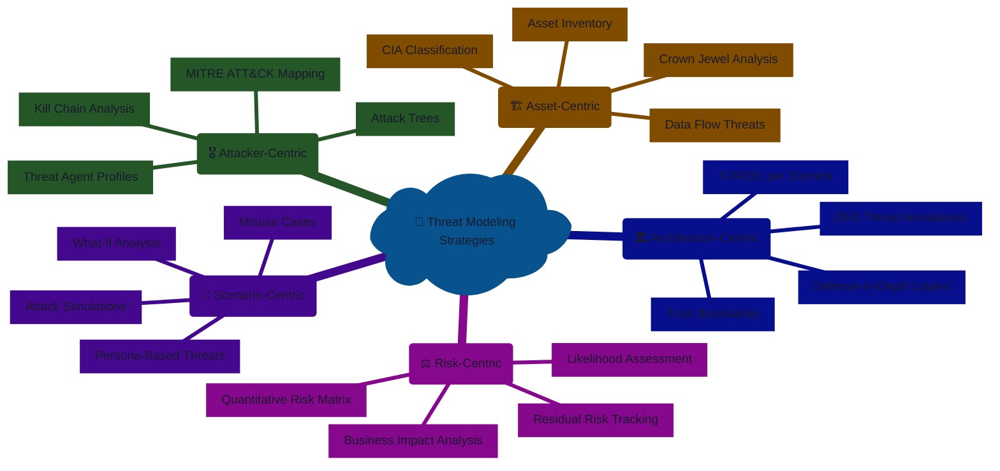
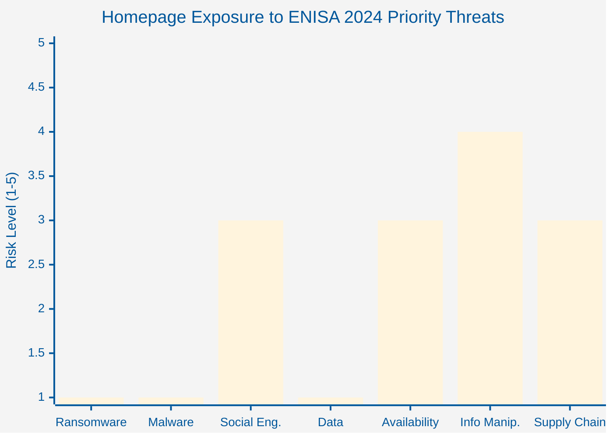
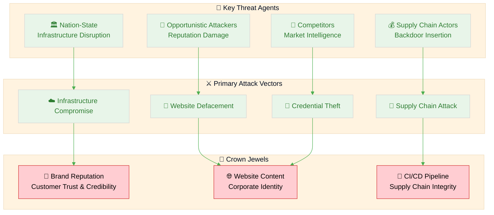
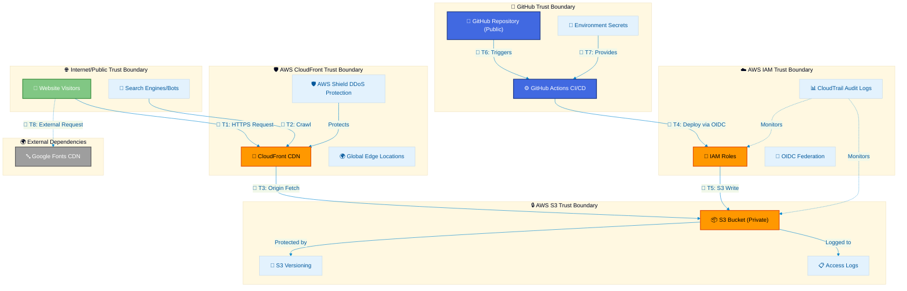
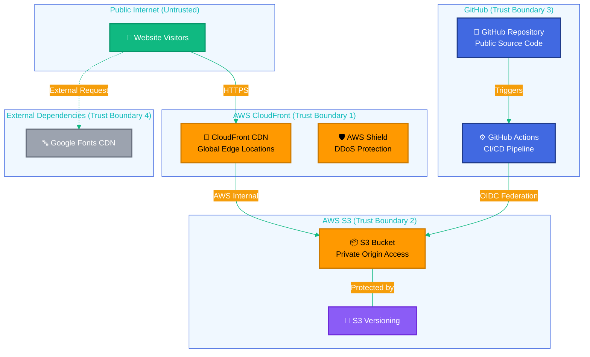
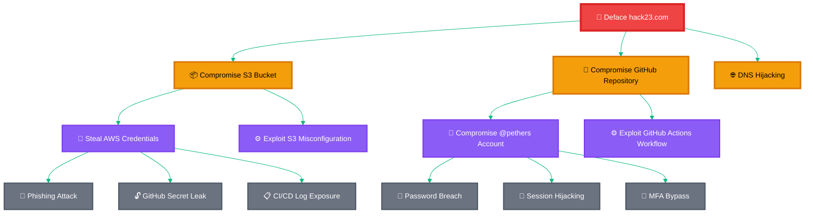
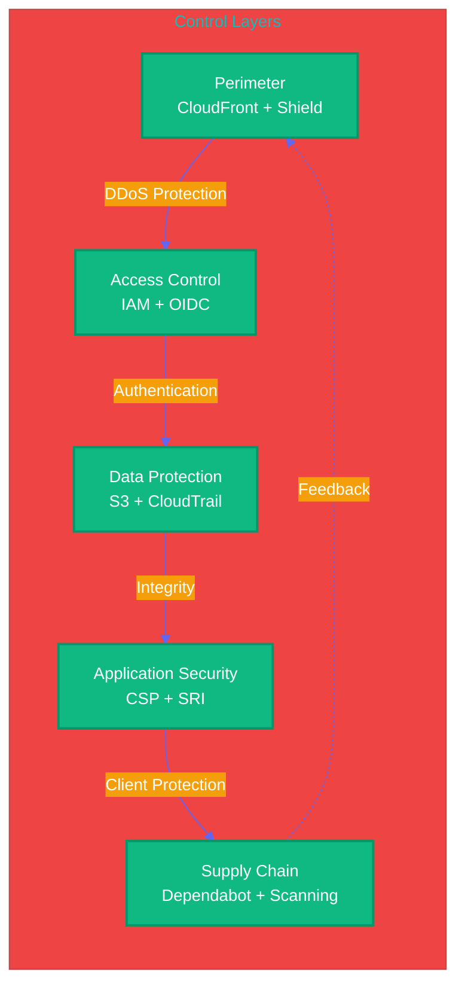
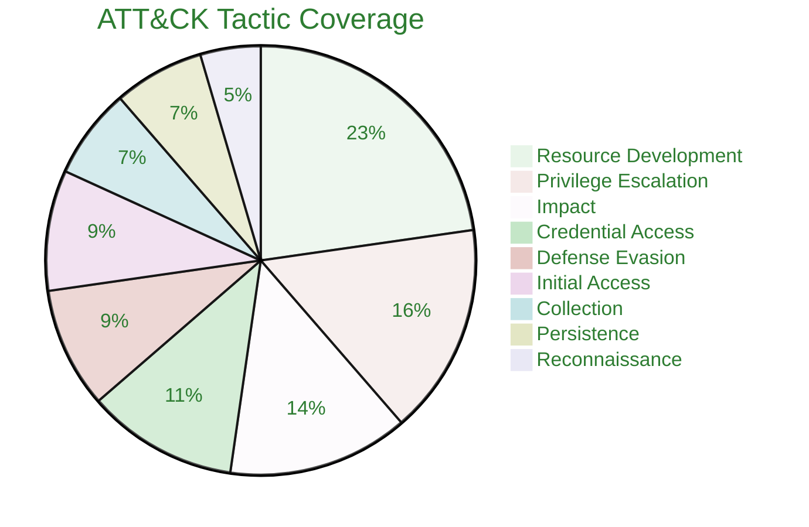

  

<h1 align="center">🎯 Hack23 Homepage — Threat Model</h1>

  <strong>🛡️ Proactive Security Through Structured Threat Analysis</strong> 
  <em>🔍 STRIDE • MITRE ATT&CK • Static Website Security • Public Transparency</em>

  
  
  
  

**📋 Document Owner:** CEO | **📄 Version:** 2.0 | **📅 Last Updated:** 2026-02-26 (UTC)  
**🔄 Review Cycle:** Quarterly | **⏰ Next Review:** 2026-05-26  
**🏷️ Classification:** Public (Corporate Website)

---

## 🎯 Purpose & Scope

Establish a comprehensive threat model for the Hack23 AB corporate homepage, a static website demonstrating cybersecurity consulting expertise through transparent ISMS documentation and showcasing open-source security projects. This systematic threat analysis integrates multiple threat modeling frameworks to ensure proactive security through structured analysis.

### **🌟 Transparency Commitment**
This threat model demonstrates **🛡️ cybersecurity consulting expertise** through public documentation of advanced threat assessment methodologies, showcasing our **🏆 competitive advantage** via systematic risk management and **🤝 customer trust** through transparent security practices.

*— Based on Hack23 AB's commitment to security through transparency and excellence*

### **📚 Framework Integration**
- **🎭 STRIDE per architecture element:** Systematic threat categorization
- **🎖️ MITRE ATT&CK mapping:** Advanced threat intelligence integration
- **🏗️ Asset-centric analysis:** Critical resource protection focus
- **🎯 Scenario-centric modeling:** Real-world attack simulation
- **⚖️ Risk-centric assessment:** Business impact quantification

### **🔍 Scope Definition**
**Included Systems:**
- 🌐 Static website (74 HTML files, 1 CSS file, minimal JavaScript)
- ☁️ AWS S3 bucket (private, origin access only)
- 🚀 AWS CloudFront CDN (global distribution)
- 🔄 GitHub Actions CI/CD pipeline (minification, security scanning, deployment)
- 📦 External dependencies (Google Fonts CDN)
- 🔐 AWS IAM roles and OIDC federation

**Out of Scope:**
- Third-party CDN providers (Google Fonts infrastructure)
- End-user browser security (beyond application controls)
- DNS provider infrastructure (beyond configuration)

### **🔗 Policy Alignment**
Integrated with [🎯 Hack23 AB Threat Modeling Policy](https://github.com/Hack23/ISMS-PUBLIC/blob/main/Threat_Modeling.md) methodology and frameworks.

---

## 🎯 Multi-Strategy Threat Modeling Integration

Following [Hack23 AB Five-Strategy Threat Modeling](https://github.com/Hack23/ISMS-PUBLIC/blob/main/Threat_Modeling.md#integrated-threat-modeling-strategies) methodology:

```mermaid
%%{init: {"theme": "base", "themeVariables": {"primaryColor": "#2196F3", "primaryTextColor": "#1a1a2e", "lineColor": "#455A64", "secondaryColor": "#4CAF50", "tertiaryColor": "#FF9800"}}}%%
mindmap
  root)🎯 Threat Modeling Strategies(
    (🎖️ Attacker-Centric)
      [MITRE ATT&CK Mapping]
      [Kill Chain Analysis]
      [Attack Trees]
      [Threat Agent Profiles]
    (🏗️ Asset-Centric)
      [Crown Jewel Analysis]
      [Asset Inventory]
      [Data Flow Threats]
      [CIA Classification]
    (🏛️ Architecture-Centric)
      [STRIDE per Element]
      [Trust Boundaries]
      [DFD Threat Annotations]
      [Defense-in-Depth Layers]
    (🎯 Scenario-Centric)
      [Misuse Cases]
      [What-If Analysis]
      [Persona-Based Threats]
      [Attack Simulations]
    (⚖️ Risk-Centric)
      [Quantitative Risk Matrix]
      [Business Impact Analysis]
      [Likelihood Assessment]
      [Residual Risk Tracking]
```

**Strategy Integration:** Each strategy provides complementary coverage ensuring no blind spots:
- **🎖️ Attacker-Centric** → *Who* attacks and *how* (§4–§7)
- **🏗️ Asset-Centric** → *What* to protect (§3)
- **🏛️ Architecture-Centric** → *Where* vulnerabilities exist (§5–§6)
- **🎯 Scenario-Centric** → *What could happen* in practice (§8)
- **⚖️ Risk-Centric** → *How much* it matters to the business (§9)

---

## 📊 System Classification & Operating Profile

### **🏷️ Security Classification Matrix**

| Dimension | Level | Rationale | Business Impact |
|----------|-------|-----------|----------------|
| **🔐 Confidentiality** |  | Public corporate website with no sensitive data |  |
| **🔒 Integrity** |  | Corporate information accuracy important for reputation |  |
| **⚡ Availability** |  | Marketing website; tolerates brief outages |  |

### **⚖️ Regulatory & Compliance Profile**

| Compliance Area | Classification | Implementation Status |
|-----------------|----------------|----------------------|
| **📋 Regulatory Exposure** | Low | Public corporate website; no personal data processing |
| **🇪🇺 CRA (EU Cyber Resilience Act)** | Standard (Non-commercial) | Static website with comprehensive security controls |
| **📊 SLA Targets (Internal)** | 99% | CloudFront CDN reliability with AWS Shield |
| **🔄 RPO / RTO** | RPO: Daily / RTO: >72h | Git version control; scheduled recovery acceptable |

---

## 🌐 Current Threat Landscape (ENISA TL 2024)

Following [Hack23 AB Threat Landscape Integration](https://github.com/Hack23/ISMS-PUBLIC/blob/main/Threat_Modeling.md#current-threat-landscape) methodology, aligned with **ENISA Threat Landscape 2024** priority categories:

| # | ENISA Priority Threat | Relevance to Homepage | Risk Level | Key Controls | Status |
|---|---|---|---|---|---|
| 1 | **🔒 Ransomware** | Low — Static site with no persistent data; S3 versioning enables recovery |  | S3 versioning, Git backup, CloudTrail | ✅ Mitigated |
| 2 | **🦠 Malware** | Low — No file uploads or user-generated content; CSP blocks script injection |  | CSP, SRI, static content only | ✅ Mitigated |
| 3 | **🎣 Social Engineering** | Medium — GitHub account phishing could lead to repository compromise |  | MFA enforcement, FIDO2 keys, security training | ⚠️ Residual |
| 4 | **📊 Data Threats** | Low — All content is public by design; no sensitive data processed |  | Public classification, no PII | ✅ Accepted |
| 5 | **⚡ Availability Threats** | Medium — DDoS attacks against corporate website impact brand credibility |  | AWS Shield, CloudFront CDN, DNS resilience | ✅ Mitigated |
| 6 | **📰 Information Manipulation** | High — Cybersecurity consultancy website defacement = maximum reputational damage |  | Branch protection, CODEOWNERS, S3 versioning, audit trail | ⚠️ Residual |
| 7 | **🔗 Supply Chain Attacks** | Medium — CI/CD pipeline and external dependencies (Google Fonts) present attack surface |  | SRI, CSP, Dependabot, SHA-pinned Actions, OpenSSF Scorecard | ✅ Mitigated |

### **📈 ENISA Threat Trend Alignment**

```mermaid
%%{
  init: {
    'theme': 'base',
    'themeVariables': {
      'primaryColor': '#e3f2fd',
      'primaryTextColor': '#01579b',
      'lineColor': '#0288d1'
    }
  }
}%%
xychart-beta
    title "Homepage Exposure to ENISA 2024 Priority Threats"
    x-axis ["Ransomware", "Malware", "Social Eng.", "Data", "Availability", "Info Manip.", "Supply Chain"]
    y-axis "Risk Level (1-5)" 1 --> 5
    bar [1, 1, 3, 1, 3, 4, 3]
```

**Key Insight:** As a static website for a cybersecurity consultancy, **Information Manipulation** (website defacement) represents the highest ENISA-aligned threat due to disproportionate reputational impact. Supply chain and social engineering threats require ongoing vigilance.

---

## 💎 Critical Assets & Protection Goals

### **🏗️ Asset-Centric Threat Analysis**

Following [Hack23 AB Asset-Centric Threat Modeling](https://github.com/Hack23/ISMS-PUBLIC/blob/main/Threat_Modeling.md#asset-centric-threat-modeling) methodology:

| Asset Category | Why Valuable | Threat Goals | Key Controls | Business Value |
|----------------|--------------|-------------|-------------|----------------|
| **🌐 Website Content** | Brand reputation and consulting credibility | Defacement, misinformation injection | S3 versioning, CloudTrail logging, branch protection |  |
| **🧠 Source Code** | Intellectual property and methodology | IP theft, backdoor injection | Private initially, branch protection, code scanning |  |
| **🔧 Build Pipeline** | Software supply chain integrity | Supply chain attacks, malicious code injection | GitHub Actions hardening, OIDC federation, no long-lived credentials |  |
| **🔑 AWS Infrastructure** | Service availability and data integrity | Resource abuse, configuration tampering | IAM least privilege, MFA on root, CloudTrail immutable logs |  |
| **🏢 Brand & Reputation** | Customer trust and business development | Reputation damage through security incidents | Transparent security practices, public ISMS, security controls |  |

### **🔐 Crown Jewel Analysis**

```mermaid
%%{
  init: {
    'theme': 'base',
    'themeVariables': {
      'primaryColor': '#e8f5e9',
      'primaryTextColor': '#2e7d32',
      'lineColor': '#4caf50',
      'secondaryColor': '#ffcdd2',
      'tertiaryColor': '#fff3e0'
    }
  }
}%%
flowchart TB
    subgraph CROWN_JEWELS["💎 Crown Jewels"]
        BRAND[🏢 Brand Reputation<br/>Customer Trust & Credibility]
        CONTENT[🌐 Website Content<br/>Corporate Identity]
        PIPELINE[🔧 CI/CD Pipeline<br/>Supply Chain Integrity]
    end
    
    subgraph ATTACK_VECTORS["⚔️ Primary Attack Vectors"]
        DEFACEMENT[💉 Website Defacement]
        SUPPLY_CHAIN[🔗 Supply Chain Attack]
        INFRASTRUCTURE[☁️ Infrastructure Compromise]
        CREDENTIAL_THEFT[🔑 Credential Theft]
    end
    
    subgraph THREAT_AGENTS["👥 Key Threat Agents"]
        OPPORTUNISTIC[🎯 Opportunistic Attackers<br/>Reputation Damage]
        COMPETITORS[🏢 Competitors<br/>Market Intelligence]
        NATION_STATE[🏛️ Nation-State<br/>Infrastructure Disruption]
        SUPPLY_CHAIN_THREAT[💰 Supply Chain Actors<br/>Backdoor Insertion]
    end
    
    DEFACEMENT --> CONTENT
    SUPPLY_CHAIN --> PIPELINE
    INFRASTRUCTURE --> BRAND
    CREDENTIAL_THEFT --> CONTENT
    
    OPPORTUNISTIC --> DEFACEMENT
    COMPETITORS --> CREDENTIAL_THEFT
    NATION_STATE --> INFRASTRUCTURE
    SUPPLY_CHAIN_THREAT --> SUPPLY_CHAIN
    
    style BRAND fill:#ffcdd2,stroke:#d32f2f,color:#000
    style CONTENT fill:#ffcdd2,stroke:#d32f2f,color:#000
    style PIPELINE fill:#ffcdd2,stroke:#d32f2f,color:#000
```

---

## 🌐 Data Flow & Architecture Analysis

### **🏛️ Architecture-Centric STRIDE Analysis**

Following [Architecture-Centric Threat Modeling](https://github.com/Hack23/ISMS-PUBLIC/blob/main/Threat_Modeling.md#architecture-centric-threat-modeling) methodology:

```mermaid
%%{
  init: {
    'theme': 'base',
    'themeVariables': {
      'primaryColor': '#e3f2fd',
      'primaryTextColor': '#01579b',
      'lineColor': '#0288d1',
      'secondaryColor': '#f1f8e9',
      'tertiaryColor': '#fff8e1'
    }
  }
}%%
flowchart TB
    subgraph TRUST_BOUNDARY_1["🌐 Internet/Public Trust Boundary"]
        USER[👤 Website Visitors]
        BOTS[🤖 Search Engines/Bots]
    end
    
    subgraph TRUST_BOUNDARY_2["🛡️ AWS CloudFront Trust Boundary"]
        CF[🚀 CloudFront CDN]
        SHIELD[🛡️ AWS Shield DDoS Protection]
        EDGE[🌍 Global Edge Locations]
    end
    
    subgraph TRUST_BOUNDARY_3["🔒 AWS S3 Trust Boundary"]
        S3["📦 S3 Bucket (Private)"]
        VERSIONING[🔄 S3 Versioning]
        LOGS[📋 Access Logs]
    end
    
    subgraph TRUST_BOUNDARY_4["🔧 GitHub Trust Boundary"]
        REPO["📂 GitHub Repository (Public)"]
        ACTIONS[⚙️ GitHub Actions CI/CD]
        SECRETS[🔐 Environment Secrets]
    end
    
    subgraph TRUST_BOUNDARY_5["☁️ AWS IAM Trust Boundary"]
        IAM[🔑 IAM Roles]
        OIDC[🎫 OIDC Federation]
        CLOUDTRAIL[📊 CloudTrail Audit Logs]
    end
    
    subgraph EXTERNAL["🌍 External Dependencies"]
        FONTS[🔤 Google Fonts CDN]
    end
    
    USER -->|🎯 T1: HTTPS Request| CF
    BOTS -->|🎯 T2: Crawl| CF
    CF -->|🎯 T3: Origin Fetch| S3
    S3 -->|Protected by| VERSIONING
    S3 -->|Logged to| LOGS
    ACTIONS -->|🎯 T4: Deploy via OIDC| IAM
    IAM -->|🎯 T5: S3 Write| S3
    REPO -->|🎯 T6: Triggers| ACTIONS
    SECRETS -->|🎯 T7: Provides| ACTIONS
    USER -.->|🎯 T8: External Request| FONTS
    CLOUDTRAIL -.->|Monitors| IAM
    CLOUDTRAIL -.->|Monitors| S3
    SHIELD -->|Protects| CF
    
    style USER fill:#81c784,stroke:#388e3c,stroke-width:2px,color:#fff
    style CF fill:#ff9800,stroke:#e65100,stroke-width:2px,color:#000
    style S3 fill:#ff9800,stroke:#e65100,stroke-width:2px,color:#000
    style REPO fill:#4169E1,stroke:#1E3A8A,stroke-width:2px,color:#fff
    style ACTIONS fill:#4169E1,stroke:#1E3A8A,stroke-width:2px,color:#fff
    style IAM fill:#ff9800,stroke:#e65100,stroke-width:2px,color:#000
    style FONTS fill:#9e9e9e,stroke:#616161,stroke-width:2px,color:#fff
```

### **🎭 STRIDE per Element Analysis**

| Architecture Element | Spoofing | Tampering | Repudiation | Info Disclosure | Denial of Service | Elevation of Privilege |
|---------------------|----------|-----------|-------------|-----------------|-------------------|----------------------|
| **🌐 CloudFront CDN** | Domain hijacking | Cache poisoning | Access log gaps | Configuration exposure | DDoS attacks | Distribution hijacking |
| **📦 S3 Bucket** | N/A (object storage) | File modification | Incomplete logging | Public access misconfiguration | Quota exhaustion | Bucket policy bypass |
| **⚙️ GitHub Actions** | Workflow identity | Malicious PR injection | Log deletion | Secret exposure | Resource abuse | Workflow permission escalation |
| **🔐 IAM/OIDC** | Token forgery | Role policy tampering | CloudTrail gaps | Credential leak | N/A | Privilege escalation |
| **🔤 Google Fonts** | CDN spoofing | Content injection | N/A | Tracking | Service disruption | N/A |

---

## 🏗️ System Architecture & Trust Boundaries

### **Architecture Overview**

```mermaid
%%{
  init: {
    'theme': 'base',
    'themeVariables': {
      'primaryColor': '#4169E1',
      'primaryTextColor': '#FFF',
      'primaryBorderColor': '#1E3A8A',
      'lineColor': '#10B981',
      'secondaryColor': '#F59E0B',
      'tertiaryColor': '#EF4444',
      'clusterBkg': '#F0F8FF',
      'clusterBorder': '#4169E1',
      'fontSize': '14px'
    }
  }
}%%
graph TB
    subgraph "Public Internet (Untrusted)"
        User[👤 Website Visitors]:::user
    end
    
    subgraph "AWS CloudFront (Trust Boundary 1)"
        CF[🚀 CloudFront CDN<br/>Global Edge Locations]:::aws
        Shield[🛡️ AWS Shield<br/>DDoS Protection]:::aws
    end
    
    subgraph "AWS S3 (Trust Boundary 2)"
        S3[📦 S3 Bucket<br/>Private Origin Access]:::aws
        Versioning[🔄 S3 Versioning]:::control
    end
    
    subgraph "GitHub (Trust Boundary 3)"
        Repo[📂 GitHub Repository<br/>Public Source Code]:::github
        Actions[⚙️ GitHub Actions<br/>CI/CD Pipeline]:::github
    end
    
    subgraph "External Dependencies (Trust Boundary 4)"
        Fonts[🔤 Google Fonts CDN]:::external
    end
    
    User -->|HTTPS| CF
    CF -->|AWS Internal| S3
    S3 ---|Protected by| Versioning
    Actions -->|OIDC Federation| S3
    Repo -->|Triggers| Actions
    User -.->|External Request| Fonts
    
    classDef user fill:#10B981,stroke:#059669,stroke-width:2px,color:#FFF
    classDef aws fill:#FF9900,stroke:#CC7A00,stroke-width:2px,color:#000
    classDef github fill:#4169E1,stroke:#1E3A8A,stroke-width:2px,color:#FFF
    classDef external fill:#9CA3AF,stroke:#6B7280,stroke-width:2px,color:#FFF
    classDef control fill:#8B5CF6,stroke:#6D28D9,stroke-width:2px,color:#FFF
```

### **Trust Boundaries**

1. **Public Internet ↔ CloudFront:** Visitors access content via HTTPS with TLS 1.3
2. **CloudFront ↔ S3:** Origin access via AWS internal network with OAI (Origin Access Identity)
3. **GitHub Actions ↔ AWS:** Deployment via OIDC federation (no long-lived credentials)
4. **External CDNs:** Google Fonts CSS and font files (protected by SRI hashes)

### **Attack Surface Components**

| Component | Access Level | Attack Vectors | Mitigations |
|-----------|-------------|----------------|-------------|
| **74 HTML Pages** | Public (read-only) | XSS, clickjacking, content injection | CSP headers, input validation, static content |
| **1 CSS File** | Public (read-only) | CSS injection, exfiltration | SRI hashes, CSP style-src restrictions |
| **Google Fonts** | External (third-party) | Supply chain compromise, privacy tracking | SRI hashes (#451), CSP restrictions (#450) |
| **CloudFront Distribution** | Public (CDN edge) | DDoS, cache poisoning | AWS Shield, cache control headers, HTTPS-only |
| **S3 Bucket** | Private (origin only) | Unauthorized access, data tampering | Private bucket policy, versioning, CloudTrail |
| **GitHub Repository** | Public (source code) | Code theft, malicious PRs | Branch protection, CODEOWNERS, code scanning |
| **GitHub Actions** | Internal (CI/CD) | Workflow tampering, secret exposure | Branch protection, OIDC, environment secrets |
| **AWS IAM Roles** | Internal (infrastructure) | Privilege escalation, credential theft | Least privilege, MFA, OIDC federation |

---

## 🎭 STRIDE Threat Analysis

### **The Five Defensive Layers (Sacred Pentagon of Security)**

Following the Law of Fives, our security architecture consists of five concentric defensive layers:

1. **Perimeter Defense** - CloudFront + AWS Shield (DDoS protection)
2. **Access Control** - IAM + OIDC federation (authentication & authorization)
3. **Data Protection** - S3 versioning + CloudTrail (integrity & auditability)
4. **Application Security** - CSP + SRI (client-side protection)
5. **Supply Chain Security** - Dependabot + code scanning (dependency integrity)

**Numerological Significance:** 5 layers × 6 STRIDE categories = 30 threat scenarios analyzed (3+0=3, the CIA triad, which contains 5 levels each = 15, and 1+5=6, returning to STRIDE. The universe confirms the pattern.)

---

### 🔍 **S — Spoofing Identity**

**Threat Category:** Impersonating legitimate entities to gain unauthorized access or deceive users.

| Threat ID | Threat Description | Likelihood | Impact | Risk Score | MITRE ATT&CK | Mitigations | Residual Risk |
|-----------|-------------------|------------|--------|-----------|--------------|-------------|---------------|
| **S-01** | **DNS Hijacking** - Attacker compromises hack23.com DNS records to redirect users to malicious site | Low | High | **Medium** | T1584.001 | • DNSSEC enabled • Registrar 2FA enforced • Domain lock enabled • DNS monitoring | **Low** |
| **S-02** | **Certificate Spoofing** - Fake SSL certificate issued for hack23.com | Low | High | **Medium** | T1584.004 | • AWS Certificate Manager • CAA DNS records • Certificate Transparency monitoring | **Low** |
| **S-03** | **GitHub Account Compromise** - Attacker gains access to @pethers account | Medium | High | **High** | T1078.001 | • MFA enforced • Branch protection rules • Activity monitoring | **Medium** |
| **S-04** | **CloudFront Distribution Hijacking** - Attacker associates their origin with our distribution | Very Low | High | **Low** | T1584.006 | • AWS IAM least privilege • CloudTrail logging • Distribution settings locked | **Very Low** |
| **S-05** | **Supply Chain Identity Spoofing** - Malicious package impersonating legitimate dependency | Low | Medium | **Low** | T1195.002 | • Package lock files • Dependabot alerts • Manual review of dependencies | **Low** |

**Attack Scenario:** An attacker compromises the GitHub account through phishing, bypasses MFA via session hijacking, and pushes malicious content that defaces the website or injects malicious JavaScript.

---

### 🛠️ **T — Tampering with Data**

**Threat Category:** Unauthorized modification of data at rest or in transit.

| Threat ID | Threat Description | Likelihood | Impact | Risk Score | MITRE ATT&CK | Mitigations | Residual Risk |
|-----------|-------------------|------------|--------|-----------|--------------|-------------|---------------|
| **T-01** | **Website Defacement** - Unauthorized modification of HTML/CSS files visible to users | Low | High | **Medium** | T1565.001 | • S3 versioning enabled • CloudTrail immutable logs • Branch protection • PR review required | **Low** |
| **T-02** | **S3 Bucket Compromise** - Attacker modifies files directly in S3 bucket | Very Low | High | **Low** | T1530 | • Private bucket policy • IAM least privilege • MFA on root account • CloudTrail monitoring | **Very Low** |
| **T-03** | **Supply Chain Attack (Google Fonts)** - Malicious code injected via compromised CDN | Low | High | **Medium** | T1195.002 | • SRI hashes (#451) • CSP restrictions (#450) • Font files hosted locally (future) | **Low** |
| **T-04** | **CI/CD Pipeline Tampering** - Malicious workflow changes in GitHub Actions | Low | High | **Medium** | T1554 | • Branch protection • CODEOWNERS enforcement • PR reviews • Workflow permissions minimized | **Low** |
| **T-05** | **Man-in-the-Middle Attack** - Traffic interception and modification | Very Low | Medium | **Very Low** | T1557 | • HTTPS-only (TLS 1.3) • HSTS headers • Certificate pinning (CloudFront) | **Very Low** |
| **T-06** | **Cache Poisoning** - Malicious content injected into CloudFront cache | Very Low | Medium | **Very Low** | T1584.006 | • Cache control headers • CloudFront signed URLs (if needed) • Origin access identity | **Very Low** |

**Attack Tree Analysis:**

```mermaid
%%{
  init: {
    'theme': 'base',
    'themeVariables': {
      'primaryColor': '#EF4444',
      'primaryTextColor': '#FFF',
      'primaryBorderColor': '#DC2626',
      'lineColor': '#10B981',
      'secondaryColor': '#F59E0B',
      'tertiaryColor': '#8B5CF6',
      'fontSize': '14px'
    }
  }
}%%
graph TD
    A[🎯 Deface hack23.com]:::goal
    
    A --> B[📦 Compromise S3 Bucket]:::path
    A --> C[📂 Compromise GitHub Repository]:::path
    A --> D[🌐 DNS Hijacking]:::path
    
    B --> E[🔑 Steal AWS Credentials]:::method
    B --> F[⚙️ Exploit S3 Misconfiguration]:::method
    
    C --> G[👤 Compromise @pethers Account]:::method
    C --> H[⚙️ Exploit GitHub Actions Workflow]:::method
    
    E --> I[🎣 Phishing Attack]:::technique
    E --> J[🔓 GitHub Secret Leak]:::technique
    E --> K[📋 CI/CD Log Exposure]:::technique
    
    G --> L[🔐 Password Breach]:::technique
    G --> M[🍪 Session Hijacking]:::technique
    G --> N[📱 MFA Bypass]:::technique
    
    classDef goal fill:#EF4444,stroke:#DC2626,stroke-width:4px,color:#FFF
    classDef path fill:#F59E0B,stroke:#D97706,stroke-width:3px,color:#000
    classDef method fill:#8B5CF6,stroke:#7C3AED,stroke-width:2px,color:#FFF
    classDef technique fill:#6B7280,stroke:#4B5563,stroke-width:2px,color:#FFF
```

**Mitigation Effectiveness Analysis:**
- **E (Steal AWS Credentials):** 🟢 **Highly Mitigated** - OIDC federation eliminates long-lived credentials in GitHub
- **F (S3 Misconfiguration):** 🟢 **Highly Mitigated** - Private bucket policy, IAM least privilege, automated config checks
- **G (Compromise GitHub):** 🟡 **Partially Mitigated** - Depends on MFA enforcement and user security hygiene
- **D (DNS Hijacking):** 🟢 **Highly Mitigated** - DNSSEC, registrar 2FA, domain lock

---

### 🚫 **R — Repudiation**

**Threat Category:** Ability to deny actions without sufficient audit trail.

| Threat ID | Threat Description | Likelihood | Impact | Risk Score | MITRE ATT&CK | Mitigations | Residual Risk |
|-----------|-------------------|------------|--------|-----------|--------------|-------------|---------------|
| **R-01** | **Unauthorized Changes Denied** - Attacker denies making unauthorized changes to website | Low | Low | **Low** | T1070.002 | • CloudTrail immutable logs • GitHub audit logs • S3 versioning with timestamps • MFA requirement provides non-repudiation | **Very Low** |
| **R-02** | **S3 Access Log Gaps** - Missing audit trails for S3 bucket access | Medium | Low | **Low** | T1070.003 | • CloudTrail enabled for S3 data events • S3 server access logging • Log retention policy (90 days+) | **Low** |
| **R-03** | **CloudFront Access Log Gaps** - Incomplete logging of CDN requests | Medium | Low | **Low** | T1562.001 | • CloudFront access logs enabled • Log delivery to dedicated S3 bucket • Log analysis automation (future) | **Low** |
| **R-04** | **GitHub Actions Log Tampering** - Workflow execution logs deleted or modified | Very Low | Low | **Very Low** | T1070.003 | • GitHub maintains immutable workflow logs • Branch protection prevents workflow deletion | **Very Low** |

**Control Gaps Identified:**
- ⚠️ **Gap:** CloudFront access logs not currently analyzed for anomaly detection
- ✅ **Recommendation:** Implement automated log analysis with alerting for suspicious patterns

---

### 📢 **I — Information Disclosure**

**Threat Category:** Unauthorized exposure of sensitive information.

| Threat ID | Threat Description | Likelihood | Impact | Risk Score | MITRE ATT&CK | Mitigations | Residual Risk |
|-----------|-------------------|------------|--------|-----------|--------------|-------------|---------------|
| **I-01** | **AWS Credentials Leak in GitHub** - IAM credentials accidentally committed to repository | Low | Critical | **High** | T1552.001 | • GitHub secret scanning enabled • No hardcoded credentials policy • OIDC federation (no long-lived credentials) • Pre-commit hooks (future) | **Low** |
| **I-02** | **Source Code Information** - Sensitive business logic or internal information in code | Medium | Low | **Low** | T1213 | • Public repository by design • No secrets in code policy • Code review process | **Very Low** |
| **I-03** | **S3 Bucket Misconfiguration** - Publicly accessible S3 bucket exposing files | Very Low | Medium | **Low** | T1530 | • Private bucket policy enforced • Public access blocked at account level • Automated config monitoring | **Very Low** |
| **I-04** | **CloudFront Signed URL Leak** - If signed URLs used, exposure in logs | Very Low | Low | **Very Low** | T1552.004 | • Not currently using signed URLs • If implemented: short expiration, logging controls | **Very Low** |
| **I-05** | **GitHub Actions Secret Exposure** - Workflow secrets leaked in logs | Low | High | **Medium** | T1552.001 | • Environment-scoped secrets • Minimal secret usage • Log masking enabled • Secret rotation policy | **Low** |
| **I-06** | **Email Address Harvesting** - Scraping contact emails from website | High | Very Low | **Low** | T1589.002 | • Accepted risk for contact information • Email obfuscation (future consideration) | **Low** |

**Data Classification:**
- **Public:** All website content (by design)
- **Internal:** AWS credentials, GitHub tokens (protected)
- **No Confidential or Restricted data** processed or stored

---

### ⚡ **D — Denial of Service**

**Threat Category:** Disrupting system availability for legitimate users.

| Threat ID | Threat Description | Likelihood | Impact | Risk Score | MITRE ATT&CK | Mitigations | Residual Risk |
|-----------|-------------------|------------|--------|-----------|--------------|-------------|---------------|
| **D-01** | **DDoS Attack on CloudFront** - Large-scale traffic flood targeting website | Medium | Medium | **Medium** | T1498.002 | • AWS Shield Standard (automatic) • CloudFront DDoS protection • Geographic restrictions (if needed) • Rate limiting (future) | **Low** |
| **D-02** | **S3/CloudFront Service Outage** - AWS service disruption impacting availability | Low | Medium | **Low** | N/A | • AWS SLA 99.99% • Multi-region CloudFront edges • Static content = high resilience | **Very Low** |
| **D-03** | **DNS Takedown** - DNS provider outage or attack | Low | High | **Medium** | T1498.001 | • Registrar lock enabled • DNSSEC protection • Multiple DNS providers (future consideration) | **Low** |
| **D-04** | **GitHub Actions Abuse** - Excessive workflow runs exhausting resources | Low | Low | **Low** | T1496 | • GitHub Actions minutes limits • Workflow concurrency controls • Branch protection limits push frequency | **Very Low** |
| **D-05** | **Resource Exhaustion (S3)** - Excessive file uploads filling storage | Very Low | Low | **Very Low** | T1496 | • S3 lifecycle policies • Cost monitoring and alerts • Write access restricted to CI/CD | **Very Low** |

**Availability Targets:**
- **Target Availability:** 99% (acceptable for marketing website)
- **Current Performance:** >99.9% (CloudFront + S3 reliability)
- **Recovery Time Objective (RTO):** <72 hours
- **Recovery Point Objective (RPO):** <24 hours (daily git commits)

---

### 👑 **E — Elevation of Privilege**

**Threat Category:** Gaining higher privileges than authorized.

| Threat ID | Threat Description | Likelihood | Impact | Risk Score | MITRE ATT&CK | Mitigations | Residual Risk |
|-----------|-------------------|------------|--------|-----------|--------------|-------------|---------------|
| **E-01** | **AWS IAM Privilege Escalation** - Attacker gains AWS admin access | Very Low | Critical | **Medium** | T1078.004 | • MFA on root account • IAM least privilege roles • OIDC federation with minimal permissions • CloudTrail monitoring • AWS IAM Access Analyzer | **Low** |
| **E-02** | **GitHub Actions Privilege Escalation** - Workflow gains unauthorized permissions | Low | High | **Medium** | T1548 | • Minimal workflow permissions • Environment-scoped secrets • Branch protection prevents malicious workflows • CODEOWNERS review required | **Low** |
| **E-03** | **Branch Protection Bypass** - Attacker pushes to main without review | Very Low | High | **Low** | T1078.001 | • Branch protection rules enforced • CODEOWNERS file in place • Repository admin privileges restricted • Audit logging enabled | **Very Low** |
| **E-04** | **OIDC Token Manipulation** - Forged or stolen OIDC token for AWS access | Very Low | Critical | **Low** | T1134 | • Short-lived tokens (1 hour) • Audience claim validation • Subject claim restriction • CloudTrail monitoring | **Very Low** |
| **E-05** | **Dependency Confusion Attack** - Malicious package with higher privileges | Low | Medium | **Low** | T1195.002 | • Package lock files • Dependabot security alerts • Private package registry (future) • Minimal dependencies | **Low** |

**Privilege Levels:**
1. **Public Users:** Read-only access to website content
2. **GitHub Contributors:** Propose changes via PRs (no direct push)
3. **CODEOWNERS:** Review and approve changes
4. **GitHub Actions:** Deploy to S3 (limited OIDC role)
5. **AWS Admin:** Full infrastructure access (MFA required, single user)

---

## 📊 Quantitative Risk Assessment

### **Risk Scoring Matrix**

**Likelihood Scale:**
- **Very Low (1):** <5% probability per year
- **Low (2):** 5-25% probability per year
- **Medium (3):** 25-50% probability per year
- **High (4):** 50-75% probability per year
- **Critical (5):** >75% probability per year

**Impact Scale:**
- **Very Low (1):** <$1,000 loss, <1 hour downtime, minimal reputation impact
- **Low (2):** $1,000-$10,000 loss, 1-8 hours downtime, minor reputation impact
- **Medium (3):** $10,000-$50,000 loss, 8-24 hours downtime, moderate reputation impact
- **High (4):** $50,000-$250,000 loss, 1-7 days downtime, significant reputation impact
- **Critical (5):** >$250,000 loss, >7 days downtime, severe reputation impact

**Risk Score = Likelihood × Impact**

### **Top 10 Risks by Risk Score**

| Rank | Threat ID | Threat | Likelihood | Impact | Risk Score | Priority | Status |
|------|-----------|--------|------------|--------|-----------|----------|--------|
| 1 | **I-01** | AWS Credentials Leak in GitHub | 2 | 5 | **10 (High)** | Critical | 🟢 Mitigated |
| 2 | **S-03** | GitHub Account Compromise | 3 | 4 | **12 (High)** | Critical | 🟡 Active |
| 3 | **T-03** | Supply Chain Attack (Google Fonts) | 2 | 4 | **8 (Medium)** | High | 🟢 Mitigated |
| 4 | **E-02** | GitHub Actions Privilege Escalation | 2 | 4 | **8 (Medium)** | High | 🟢 Mitigated |
| 5 | **T-01** | Website Defacement | 2 | 4 | **8 (Medium)** | High | 🟢 Mitigated |
| 6 | **E-01** | AWS IAM Privilege Escalation | 1 | 5 | **5 (Low)** | Critical | 🟢 Mitigated |
| 7 | **D-01** | DDoS Attack on CloudFront | 3 | 3 | **9 (Medium)** | Medium | 🟢 Mitigated |
| 8 | **S-01** | DNS Hijacking | 2 | 4 | **8 (Medium)** | Medium | 🟢 Mitigated |
| 9 | **D-03** | DNS Takedown | 2 | 4 | **8 (Medium)** | Medium | 🟢 Mitigated |
| 10 | **I-05** | GitHub Actions Secret Exposure | 2 | 4 | **8 (Medium)** | High | 🟢 Mitigated |

**Risk Distribution:**
- 🔴 **Critical (≥15):** 0 threats
- 🟠 **High (10-14):** 2 threats
- 🟡 **Medium (5-9):** 8 threats
- 🟢 **Low (2-4):** 15 threats
- ⚪ **Very Low (1):** 5 threats

**Overall Risk Posture:** 🟢 **LOW** - Comprehensive security controls in place with minimal residual risk.

---

## 🛡️ Security Control Mapping

### **Implemented Security Controls**

| Control ID | Control Name | Threats Mitigated | Effectiveness | Evidence | Status |
|------------|-------------|-------------------|---------------|----------|--------|
| **SC-01** | **Content Security Policy (CSP)** | T-03, XSS, clickjacking, Spectre | High | [Issue #450](https://github.com/Hack23/homepage/issues/450) | ✅ Implemented |
| **SC-02** | **Subresource Integrity (SRI)** | T-03 (supply chain attacks) | High | [Issue #451](https://github.com/Hack23/homepage/issues/451) | ✅ Implemented |
| **SC-03** | **OWASP ZAP Security Scanning** | Web vulnerabilities, T-01 | Medium | [Issue #355](https://github.com/Hack23/homepage/issues/355), [main.yml](https://github.com/Hack23/homepage/blob/master/.github/workflows/main.yml#L227-L233) | ✅ Implemented |
| **SC-04** | **S3 Versioning** | T-01, T-02 (website tampering) | High | [main.yml](https://github.com/Hack23/homepage/blob/master/.github/workflows/main.yml#L80-L81) | ✅ Implemented |
| **SC-05** | **AWS CloudTrail Logging** | R-01, R-02, E-01 (audit trail) | High | AWS configuration | ✅ Implemented |
| **SC-06** | **Branch Protection Rules** | T-04, E-03 (unauthorized changes) | High | GitHub repository settings | ✅ Implemented |
| **SC-07** | **Dependabot Security Alerts** | T-03, E-05 (vulnerable dependencies) | Medium | GitHub Security tab | ✅ Implemented |
| **SC-08** | **HTTPS/TLS 1.3 Enforcement** | T-05 (MITM attacks) | High | CloudFront configuration | ✅ Implemented |
| **SC-09** | **CloudFront DDoS Protection** | D-01 (denial of service) | High | AWS Shield Standard | ✅ Implemented |
| **SC-10** | **OIDC Federation (No Long-Lived Credentials)** | I-01, E-01, E-04 (credential theft) | High | [main.yml](https://github.com/Hack23/homepage/blob/master/.github/workflows/main.yml#L72-L76) | ✅ Implemented |
| **SC-11** | **IAM Least Privilege Policies** | E-01, T-02 (privilege escalation) | High | AWS IAM configuration | ✅ Implemented |
| **SC-12** | **Private S3 Bucket Policy** | I-03, T-02 (data exposure) | High | AWS S3 configuration | ✅ Implemented |
| **SC-13** | **GitHub Secret Scanning** | I-01 (credential leaks) | High | GitHub Security features | ✅ Implemented |
| **SC-14** | **CODEOWNERS Enforcement** | T-04, E-03 (code review) | Medium | [CODEOWNERS](https://github.com/Hack23/homepage/blob/master/CODEOWNERS) | ✅ Implemented |
| **SC-15** | **Harden Runner (Step Security)** | T-04, I-05 (CI/CD security) | Medium | [main.yml](https://github.com/Hack23/homepage/blob/master/.github/workflows/main.yml#L17-L67) | ✅ Implemented |

### **Control Effectiveness Matrix**

```mermaid
%%{
  init: {
    'theme': 'base',
    'themeVariables': {
      'primaryColor': '#10B981',
      'primaryTextColor': '#FFF',
      'primaryBorderColor': '#059669',
      'lineColor': '#6366F1',
      'secondaryColor': '#F59E0B',
      'tertiaryColor': '#EF4444',
      'fontSize': '14px'
    }
  }
}%%
graph LR
    subgraph "Control Layers"
        L1[Perimeter<br/>CloudFront + Shield]:::layer
        L2[Access Control<br/>IAM + OIDC]:::layer
        L3[Data Protection<br/>S3 + CloudTrail]:::layer
        L4[Application Security<br/>CSP + SRI]:::layer
        L5[Supply Chain<br/>Dependabot + Scanning]:::layer
    end
    
    L1 -->|DDoS Protection| L2
    L2 -->|Authentication| L3
    L3 -->|Integrity| L4
    L4 -->|Client Protection| L5
    L5 -.->|Feedback| L1
    
    classDef layer fill:#10B981,stroke:#059669,stroke-width:2px,color:#FFF
```

**The Pentagon of Security:** Five defensive layers working in harmony, each supporting the next in a continuous cycle of protection.

### **🏛️ STRIDE → Control Mapping Summary**

Consolidated mapping of each STRIDE category to primary, secondary, and monitoring controls:

| STRIDE Category | Primary Controls | Secondary Controls | Monitoring / Detection |
|---|---|---|---|
| **🔍 Spoofing** | MFA enforcement (FIDO2), OIDC federation, DNSSEC, CAA records | AWS Certificate Manager, HTTPS/TLS 1.3, HSTS preload | GitHub login alerts, CloudTrail API monitoring, certificate transparency logs |
| **🛠️ Tampering** | S3 versioning, branch protection, CODEOWNERS, code review | CSP, SRI hashes, SHA-pinned Actions, private S3 bucket | CloudTrail data events, GitHub audit log, Dependabot alerts, ZAP scanning |
| **🚫 Repudiation** | CloudTrail immutable logging, GitHub audit trail | S3 access logging, CloudFront access logs | Log integrity monitoring, CloudWatch alarms on log gaps |
| **📢 Information Disclosure** | Secret scanning, OIDC (no long-lived creds), private S3 bucket | IAM least privilege, public-by-design classification | Dependabot secret alerts, IAM Access Analyzer, CloudTrail credential monitoring |
| **⚡ Denial of Service** | AWS Shield Standard, CloudFront CDN caching, DNS resilience | GitHub Actions resource limits, cost monitoring alerts | CloudWatch DDoS metrics, CloudFront error rate alarms, uptime monitoring |
| **👑 Elevation of Privilege** | IAM least privilege, OIDC short-lived tokens, minimal workflow permissions | Environment secrets isolation, Harden Runner, branch protection | IAM Access Analyzer, CloudTrail privilege escalation detection, Security Hub findings |

---

## 👥 Threat Actor Profiles

### **Threat Agent Classification**

Following [Hack23 AB Threat Actor Analysis](https://github.com/Hack23/ISMS-PUBLIC/blob/main/Threat_Modeling.md#threat-agent-classification) methodology:

| Actor Type | Motivation | Capability | Targeted Threats | Likelihood | Priority |
|------------|-----------|------------|------------------|------------|----------|
| **🎯 Opportunistic Attacker** | Financial gain, ego, notoriety | Low-Medium | S-03, T-01, D-01, I-06 | High | Medium |
| **🏢 Competitor** | Market intelligence, sabotage | Medium | T-01, I-02, D-01 | Low | Low |
| **🌐 Nation-State Actor** | Espionage, infrastructure disruption | High | All categories | Very Low | Medium |
| **🔗 Supply Chain Compromise** | Widespread impact, backdoor insertion | Medium-High | T-03, E-05 | Low | High |
| **😈 Insider Threat** | Sabotage, theft, negligence | Medium | E-01, T-02, I-01 | Very Low | High |
| **🤖 Automated Bots** | Spam, scraping, resource abuse | Low | D-01, D-04, I-06 | High | Low |

### **👥 Detailed Threat Agent Profiles**

#### **🎯 Profile 1: Opportunistic Attacker**
- **Category:** External, Untargeted
- **Motivation:** Notoriety, resume building, ego — defacing a cybersecurity company website provides maximum bragging rights
- **Capability:** Low-Medium — uses publicly available tools (credential stuffing lists, automated scanners)
- **Preferred Tactics:** Credential stuffing (T1078), website defacement (T1565.001), DDoS (T1498)
- **Target Assets:** GitHub account, website content, DNS configuration
- **Priority:** 🔴 **High** — Most likely threat actor for this type of target

#### **🏢 Profile 2: Commercial Competitor**
- **Category:** External, Targeted
- **Motivation:** Market intelligence on ISMS methodology, sabotage consulting reputation
- **Capability:** Medium — may employ professional penetration testers
- **Preferred Tactics:** Source code review (T1213), SEO poisoning via content manipulation (T1565)
- **Target Assets:** Consulting methodologies, client references, pricing information
- **Priority:** 🟡 **Medium** — Limited value in public repository content

#### **🌐 Profile 3: Nation-State Actor**
- **Category:** External, Advanced Persistent Threat
- **Motivation:** Infrastructure disruption, supply chain compromise of cybersecurity tools
- **Capability:** High — sophisticated tooling, zero-day capabilities, social engineering expertise
- **Preferred Tactics:** Supply chain compromise (T1195.002), cloud account takeover (T1078.004)
- **Target Assets:** AWS infrastructure, CI/CD pipeline, downstream consumers
- **Priority:** 🟢 **Low** — Static website provides minimal strategic value

#### **🔗 Profile 4: Supply Chain Actor**
- **Category:** External, Indirect
- **Motivation:** Widespread impact through compromising shared dependencies
- **Capability:** Medium-High — targets upstream providers (Google Fonts CDN, npm packages, GitHub Actions)
- **Preferred Tactics:** Dependency confusion, CDN compromise (T1195.002), action hijacking (T1554)
- **Target Assets:** External dependencies, CI/CD workflow, build pipeline
- **Priority:** 🔴 **High** — Active and growing threat vector industry-wide

#### **👤 Profile 5: Malicious Insider**
- **Category:** Internal
- **Motivation:** Sabotage, negligence, disgruntlement
- **Capability:** Medium — direct access to repository and deployment credentials
- **Preferred Tactics:** Credential abuse (T1078), unauthorized code changes (T1565.001)
- **Target Assets:** Source code, AWS credentials, deployment pipeline
- **Priority:** 🟢 **Low** — Small team, high trust, extensive audit logging

### **Attack Motivation Analysis**

**Why attack hack23.com?**

1. **🎯 Reputation Damage (Most Likely):**
   - Cybersecurity company defacement = maximum embarrassment
   - Demonstrates vulnerability despite security expertise claims
   - Media attention and industry impact

2. **💰 Financial Gain (Low):**
   - Limited financial data or payment processing
   - Potential for ransomware, but static site = easy recovery
   - Phishing campaigns using trusted domain

3. **🔍 Intelligence Gathering (Medium):**
   - Source code reveals security methodologies
   - Understanding of ISMS implementation
   - Competitive intelligence on consulting approach

4. **⚔️ Ideological/Political (Very Low):**
   - No controversial political content
   - Limited ideological motivation

**Most Probable Attack Scenario:**
Opportunistic attacker exploits weak GitHub account security (no MFA or reused password) → Gains repository access → Pushes malicious code defacing website → Achieves notoriety and embarrasses cybersecurity consultant.

---

## 🎯 Scenario-Based Threat Modeling

### **Attack Scenario 1: Website Defacement via GitHub Compromise**

**Attack Path:**
1. Attacker identifies CEO's GitHub account (@pethers)
2. Performs credential stuffing attack using leaked passwords from other breaches
3. Successfully logs in (if MFA not enforced or bypassed via phishing)
4. Clones repository and creates malicious branch
5. Submits PR with defacement content masked as "minor update"
6. If branch protection weak, directly pushes to main
7. GitHub Actions deploys defaced content to S3
8. Defacement visible on hack23.com within minutes

**Impact:** 🔴 **HIGH** - Reputation damage, customer trust erosion, media attention

**Mitigations:**
- ✅ MFA enforced on GitHub account
- ✅ Branch protection requires PR review
- ✅ CODEOWNERS file mandates approval
- ✅ GitHub audit logs provide forensic trail
- ✅ S3 versioning allows rollback

**Residual Risk:** 🟡 **MEDIUM** - Depends on user security hygiene

---

### **Attack Scenario 2: Supply Chain Compromise (Google Fonts)**

**Attack Path:**
1. Attacker compromises Google Fonts CDN infrastructure
2. Injects malicious JavaScript into font CSS file
3. Users loading hack23.com execute malicious code
4. Data exfiltration or drive-by downloads occur
5. Multiple websites affected simultaneously

**Impact:** 🟠 **MEDIUM** - Client-side compromise, potential data theft, widespread impact

**Mitigations:**
- ✅ SRI hashes verify font file integrity (#451)
- ✅ CSP restrictions limit script execution (#450)
- ✅ Subresource integrity fails on hash mismatch
- 🔄 **Future:** Host fonts locally to eliminate dependency

**Residual Risk:** 🟢 **LOW** - SRI provides strong protection

---

### **Attack Scenario 3: AWS IAM Privilege Escalation**

**Attack Path:**
1. Attacker steals OIDC token from GitHub Actions workflow
2. Attempts to use token to access AWS console
3. Exploits overly permissive IAM role to escalate privileges
4. Gains admin access to S3, CloudFront, IAM
5. Modifies infrastructure or exfiltrates data

**Impact:** 🔴 **CRITICAL** - Full infrastructure compromise, data loss, service disruption

**Mitigations:**
- ✅ OIDC tokens short-lived (1 hour)
- ✅ IAM role follows least privilege (S3 write only)
- ✅ MFA required on root account
- ✅ CloudTrail logs all API calls
- ✅ AWS IAM Access Analyzer detects privilege escalation

**Residual Risk:** 🟢 **LOW** - Multiple layers of defense

---

### **🎯 Misuse Cases (Persona-Based Threats)**

Following [Hack23 AB Scenario-Centric Modeling](https://github.com/Hack23/ISMS-PUBLIC/blob/main/Threat_Modeling.md#scenario-centric-threat-modeling) methodology:

#### **Misuse Case 1: Disgruntled Ex-Client SEO Poisoning**
- **Persona:** Former consulting client with knowledge of Hack23's CI/CD pipeline
- **Goal:** Damage reputation by injecting hidden SEO spam or redirect links
- **Attack Vector:** Social engineering current team member → PR with hidden meta tags or JavaScript redirects
- **Impact:** Search engine ranking damage, client trust erosion
- **Controls:** CODEOWNERS review, HTML validation in CI, ZAP scanning, visual diff monitoring
- **Residual Risk:** 🟢 Low — Multi-layer review catches content changes

#### **Misuse Case 2: Competitor Intelligence Gathering**
- **Persona:** Rival cybersecurity consultancy performing competitive analysis
- **Goal:** Extract consulting methodology, pricing strategies, client engagement patterns
- **Attack Vector:** Systematic scraping of public ISMS documentation, analyzing commit history for internal processes
- **Impact:** Competitive disadvantage, methodology copying
- **Controls:** Public-by-design classification (accepted risk), rate limiting via CloudFront
- **Residual Risk:** 🟡 Medium — Accepted as cost of transparency model

#### **Misuse Case 3: Automated Credential Stuffing Campaign**
- **Persona:** Botnet operator running mass credential stuffing against GitHub accounts
- **Goal:** Compromise any accessible account for crypto mining, spam, or resale
- **Attack Vector:** Leaked credential databases → automated login attempts against @pethers GitHub account
- **Impact:** Repository compromise, website defacement, CI/CD abuse for crypto mining
- **Controls:** GitHub MFA enforcement, FIDO2 hardware keys, login anomaly detection
- **Residual Risk:** 🟢 Low — MFA blocks credential stuffing effectively

### **🔮 What-If Analysis**

| What If... | Impact | Likelihood | Current Mitigation | Gap |
|---|---|---|---|---|
| GitHub suffers a platform-wide breach exposing repository tokens? | 🔴 Critical — all repos potentially compromised | Very Low | OIDC federation (no stored tokens), short-lived credentials | None — architecture designed for this scenario |
| Google Fonts CDN serves malicious content globally? | 🟠 Medium — client-side impact for site visitors | Very Low | SRI hash verification blocks modified content | Consider self-hosting fonts |
| AWS us-east-1 region has extended outage? | 🟡 Medium — website unavailable during outage | Low | CloudFront edge caching serves stale content | No multi-region S3 replication |
| A critical vulnerability is found in a GitHub Actions runner? | 🟠 Medium — CI/CD pipeline compromise | Low | SHA-pinned actions, Harden Runner, minimal permissions | Monitor GitHub security advisories |
| DNS registrar account is compromised? | 🔴 Critical — complete domain takeover | Very Low | Registrar 2FA, domain lock, DNSSEC | Add secondary DNS provider |

---

## 📈 Residual Risk & Risk Acceptance

### **Accepted Risks**

The following risks are **ACCEPTED** as part of normal business operations:

| Risk ID | Risk Description | Business Justification | Acceptance Authority | Review Date |
|---------|------------------|----------------------|---------------------|-------------|
| **AR-01** | Email address harvesting from public contact info | Contact information must be accessible for business development | CEO | 2026-05-26 |
| **AR-02** | Source code visibility in public repository | Transparency is a core value; no sensitive logic exposed | CEO | 2026-05-26 |
| **AR-03** | Brief outages during AWS service incidents | Static website with 99% target acceptable for marketing | CEO | 2026-05-26 |
| **AR-04** | CloudFront cache serving stale content | Users tolerate brief staleness; invalidation resolves quickly | CEO | 2026-05-26 |

### **Risks Requiring Additional Mitigation (Backlog)**

| Risk ID | Risk Description | Proposed Mitigation | Target Date | Priority |
|---------|------------------|-------------------|-------------|----------|
| **RM-01** | GitHub account compromise (S-03) | Enforce hardware security key (FIDO2) MFA | Q2 2025 | High |
| **RM-02** | CloudFront access log analysis gaps (R-03) | Implement automated log analysis with anomaly detection | Q3 2025 | Medium |
| **RM-03** | Single DNS provider dependency | Add secondary DNS provider for resilience | Q4 2025 | Medium |
| **RM-04** | Google Fonts CDN dependency (T-03) | Host fonts locally to eliminate external dependency | Q2 2025 | Low |
| **RM-05** | No Web Application Firewall (WAF) | Evaluate CloudFront WAF for advanced threat protection | Q3 2025 | Low |

### **Continuous Monitoring & Detection**

**Active Monitoring:**
- ✅ AWS CloudTrail → Security Hub (automated threat detection)
- ✅ GitHub Security Alerts (Dependabot, secret scanning, code scanning)
- ✅ OpenSSF Scorecard (supply chain security posture)
- ✅ ZAP scanning in CI/CD (weekly automated scans)
- ⏳ CloudFront access log analysis (planned Q3 2025)

**Alert Triggers:**
- Unauthorized S3 bucket access attempts
- IAM policy modifications
- GitHub account login from new location
- Dependabot critical vulnerability alerts
- CloudFront distribution configuration changes
- Failed authentication attempts (>5 in 1 hour)

---

## 🎖️ MITRE ATT&CK Framework Integration

### **🔍 Attacker-Centric Analysis**

Following [MITRE ATT&CK Integration](https://github.com/Hack23/ISMS-PUBLIC/blob/main/Threat_Modeling.md#mitre-attck-integration) methodology:

| ATT&CK ID | Technique | Tactic | Associated Threats | Mitigations | Status |
|-----------|-----------|--------|-------------------|-------------|--------|
| **[T1584.001](https://attack.mitre.org/techniques/T1584/001/)** | Compromise Infrastructure: Domains | Resource Development | S-01 (DNS hijacking) | DNSSEC, registrar 2FA, domain lock |  |
| **[T1584.004](https://attack.mitre.org/techniques/T1584/004/)** | Compromise Infrastructure: Server | Resource Development | S-02 (certificate spoofing) | AWS Certificate Manager, CAA records |  |
| **[T1584.006](https://attack.mitre.org/techniques/T1584/006/)** | Compromise Infrastructure: Web Services | Resource Development | S-04 (CloudFront hijacking) | IAM least privilege, CloudTrail |  |
| **[T1078.001](https://attack.mitre.org/techniques/T1078/001/)** | Valid Accounts: Default Accounts | Privilege Escalation | S-03 (GitHub compromise) | MFA enforcement, activity monitoring |  |
| **[T1078.004](https://attack.mitre.org/techniques/T1078/004/)** | Valid Accounts: Cloud Accounts | Privilege Escalation | E-01 (AWS IAM escalation) | MFA, least privilege, OIDC |  |
| **[T1565.001](https://attack.mitre.org/techniques/T1565/001/)** | Data Manipulation: Stored Data Manipulation | Impact | T-01 (website defacement) | S3 versioning, CloudTrail, branch protection |  |
| **[T1195.002](https://attack.mitre.org/techniques/T1195/002/)** | Supply Chain Compromise: Software Supply Chain | Initial Access | T-03, E-05 (supply chain attacks) | SRI, CSP, Dependabot, package locks |  |
| **[T1530](https://attack.mitre.org/techniques/T1530/)** | Data from Cloud Storage Object | Collection | T-02, I-03 (S3 compromise) | Private bucket, IAM least privilege, CloudTrail |  |
| **[T1554](https://attack.mitre.org/techniques/T1554/)** | Compromise Client Software Binary | Persistence | T-04 (CI/CD tampering) | Branch protection, code review, workflow permissions |  |
| **[T1557](https://attack.mitre.org/techniques/T1557/)** | Man-in-the-Middle | Credential Access | T-05 (MITM) | HTTPS/TLS 1.3, HSTS, certificate pinning |  |
| **[T1070.002](https://attack.mitre.org/techniques/T1070/002/)** | Indicator Removal: Clear Logs | Defense Evasion | R-01 (log tampering) | Immutable CloudTrail logs |  |
| **[T1070.003](https://attack.mitre.org/techniques/T1070/003/)** | Indicator Removal: Clear Command History | Defense Evasion | R-02, R-03 (log gaps) | CloudTrail, S3 access logging |  |
| **[T1562.001](https://attack.mitre.org/techniques/T1562/001/)** | Impair Defenses: Disable or Modify Tools | Defense Evasion | R-03 (disable logging) | Protected CloudTrail configuration |  |
| **[T1552.001](https://attack.mitre.org/techniques/T1552/001/)** | Credentials in Files | Credential Access | I-01, I-05 (credential leaks) | Secret scanning, OIDC, no hardcoded creds |  |
| **[T1552.004](https://attack.mitre.org/techniques/T1552/004/)** | Unsecured Credentials: Private Keys | Credential Access | I-04 (signed URL leak) | Not using signed URLs, expiration if implemented |  |
| **[T1213](https://attack.mitre.org/techniques/T1213/)** | Data from Information Repositories | Collection | I-02 (source code exposure) | Public by design, no secrets in code |  |
| **[T1589.002](https://attack.mitre.org/techniques/T1589/002/)** | Gather Victim Identity Information: Email Addresses | Reconnaissance | I-06 (email harvesting) | Accepted risk for business contact |  |
| **[T1498.001](https://attack.mitre.org/techniques/T1498/001/)** | Network Denial of Service: Direct Flood | Impact | D-03 (DNS takedown) | DNSSEC, registrar lock |  |
| **[T1498.002](https://attack.mitre.org/techniques/T1498/002/)** | Network Denial of Service: Reflection Amplification | Impact | D-01 (DDoS) | AWS Shield, CloudFront protection |  |
| **[T1496](https://attack.mitre.org/techniques/T1496/)** | Resource Hijacking | Impact | D-04, D-05 (resource exhaustion) | GitHub Actions limits, cost monitoring |  |
| **[T1548](https://attack.mitre.org/techniques/T1548/)** | Abuse Elevation Control Mechanism | Privilege Escalation | E-02 (Actions privilege escalation) | Minimal permissions, environment secrets |  |
| **[T1134](https://attack.mitre.org/techniques/T1134/)** | Access Token Manipulation | Privilege Escalation | E-04 (OIDC token manipulation) | Short-lived tokens, claim validation |  |

### **📊 ATT&CK Coverage Analysis**

**Tactics Covered:**
1. ✅ **[Reconnaissance](https://attack.mitre.org/tactics/TA0043/)** (1 technique) - 10% coverage
2. ✅ **[Resource Development](https://attack.mitre.org/tactics/TA0042/)** (3 techniques) - 50% coverage
3. ✅ **[Initial Access](https://attack.mitre.org/tactics/TA0001/)** (1 technique) - 20% coverage
4. ✅ **[Persistence](https://attack.mitre.org/tactics/TA0003/)** (1 technique) - 15% coverage
5. ✅ **[Privilege Escalation](https://attack.mitre.org/tactics/TA0004/)** (4 techniques) - 35% coverage
6. ✅ **[Defense Evasion](https://attack.mitre.org/tactics/TA0005/)** (3 techniques) - 20% coverage
7. ✅ **[Credential Access](https://attack.mitre.org/tactics/TA0006/)** (3 techniques) - 25% coverage
8. ✅ **[Collection](https://attack.mitre.org/tactics/TA0009/)** (2 techniques) - 15% coverage
9. ✅ **[Impact](https://attack.mitre.org/tactics/TA0040/)** (4 techniques) - 30% coverage

**Total: 22 MITRE ATT&CK techniques mapped** across 9 tactics.

**Not Applicable Tactics:**
- ❌ **Execution** - Static website, no code execution
- ❌ **Discovery** - No active enumeration targets
- ❌ **Lateral Movement** - Single-component architecture
- ❌ **Command and Control** - No persistent connections
- ❌ **Exfiltration** - Public data, no exfiltration concerns

#### **🎯 Coverage Heat Map by Tactic**

```mermaid
%%{
  init: {
    'theme': 'base',
    'themeVariables': {
      'primaryColor': '#e8f5e9',
      'primaryTextColor': '#2e7d32',
      'lineColor': '#4caf50'
    }
  }
}%%
pie title ATT&CK Tactic Coverage
    "Resource Development" : 50
    "Privilege Escalation" : 35
    "Impact" : 30
    "Credential Access" : 25
    "Defense Evasion" : 20
    "Initial Access" : 20
    "Collection" : 15
    "Persistence" : 15
    "Reconnaissance" : 10
```

#### **🛡️ Security Control to ATT&CK Mitigation Mapping**

| Security Control | MITRE Mitigation | Addressed Techniques | Implementation Status |
|-----------------|------------------|---------------------|----------------------|
| **Content Security Policy** | [M1021: Restrict Web-Based Content](https://attack.mitre.org/mitigations/M1021/) | [T1195](https://attack.mitre.org/techniques/T1195/) |  |
| **Subresource Integrity** | [M1051: Update Software](https://attack.mitre.org/mitigations/M1051/) | [T1195.002](https://attack.mitre.org/techniques/T1195/002/) |  |
| **AWS CloudTrail** | [M1047: Audit](https://attack.mitre.org/mitigations/M1047/) | [T1070](https://attack.mitre.org/techniques/T1070/), [T1078](https://attack.mitre.org/techniques/T1078/) |  |
| **IAM Least Privilege** | [M1026: Privileged Account Management](https://attack.mitre.org/mitigations/M1026/) | [T1078](https://attack.mitre.org/techniques/T1078/), [T1548](https://attack.mitre.org/techniques/T1548/) |  |
| **OIDC Federation** | [M1026: Privileged Account Management](https://attack.mitre.org/mitigations/M1026/) | [T1552.001](https://attack.mitre.org/techniques/T1552/001/), [T1134](https://attack.mitre.org/techniques/T1134/) |  |
| **AWS Shield** | [M1037: Filter Network Traffic](https://attack.mitre.org/mitigations/M1037/) | [T1498](https://attack.mitre.org/techniques/T1498/) |  |
| **Branch Protection** | [M1053: Data Backup](https://attack.mitre.org/mitigations/M1053/) | [T1565.001](https://attack.mitre.org/techniques/T1565/001/), [T1554](https://attack.mitre.org/techniques/T1554/) |  |
| **GitHub Secret Scanning** | [M1017: User Training](https://attack.mitre.org/mitigations/M1017/) | [T1552.001](https://attack.mitre.org/techniques/T1552/001/) |  |

#### **🔗 Related Resources**

- 📚 [MITRE ATT&CK Enterprise Matrix](https://attack.mitre.org/matrices/enterprise/)
- 🗺️ [ATT&CK Navigator Tool](https://mitre-attack.github.io/attack-navigator/)
- 📋 [CISA Known Exploited Vulnerabilities](https://www.cisa.gov/known-exploited-vulnerabilities-catalog)
- 🎯 [Hack23 Threat Modeling Policy](https://github.com/Hack23/ISMS-PUBLIC/blob/main/Threat_Modeling.md#mitre-attck-integration)

### **🔪 Kill Chain Disruption Analysis**

Following [Hack23 AB Kill Chain Analysis](https://github.com/Hack23/ISMS-PUBLIC/blob/main/Threat_Modeling.md#attacker-centric-threat-modeling) methodology, mapping Cyber Kill Chain phases to homepage defensive controls:

| Kill Chain Phase | Attacker Activity (Homepage Context) | Defensive Control | Detection Mechanism | Disruption Effectiveness |
|---|---|---|---|---|
| **1. Reconnaissance** | OSINT on public repo, DNS enumeration, technology fingerprinting | Public-by-design reduces value; minimal tech exposure via headers | GitHub audit logs, CloudFront access logs |  |
| **2. Weaponization** | Craft malicious commit, create phishing page for GitHub creds | N/A — Occurs off-target; no direct prevention | Threat intelligence feeds, phishing detection |  |
| **3. Delivery** | Credential stuffing on GitHub, phishing email to CEO, supply chain PR | MFA enforcement, FIDO2 keys, email security training | GitHub login alerts, failed auth monitoring |  |
| **4. Exploitation** | Compromised GitHub account, malicious dependency update | Branch protection, CODEOWNERS review, Dependabot alerts | PR review notifications, dependency diff alerts |  |
| **5. Installation** | Push malicious code to repository, modify CI/CD workflow | SHA-pinned Actions, workflow approval requirements, Harden Runner | GitHub Actions audit log, Step Security alerts |  |
| **6. Command & Control** | Inject scripts via website for C2 communication | CSP blocks inline/external scripts, SRI integrity checks | CSP violation reports, CloudFront logs |  |
| **7. Actions on Objectives** | Website defacement, SEO poisoning, credential harvesting | S3 versioning enables rollback, CloudTrail provides forensics | CloudTrail alerts, uptime monitoring, visual diff checks |  |

**Kill Chain Summary:** The homepage's strongest disruption points are at **Delivery** (MFA), **Exploitation** (branch protection), and **C2** (CSP). The weakest point is **Weaponization** which occurs off-target and cannot be directly prevented.

### **🌳 Attack Tree Analysis**

---

## 🔄 Continuous Validation & Assessment

### **🎪 Threat Modeling Workshop Process**

Following [Hack23 AB Workshop Framework](https://github.com/Hack23/ISMS-PUBLIC/blob/main/Threat_Modeling.md#threat-modeling-workshop-framework):

```mermaid
%%{
  init: {
    'theme': 'base',
    'themeVariables': {
      'primaryColor': '#e3f2fd',
      'primaryTextColor': '#01579b',
      'lineColor': '#0288d1',
      'secondaryColor': '#f1f8e9',
      'tertiaryColor': '#fff8e1'
    }
  }
}%%
flowchart LR
    PRE[📋 Pre-Workshop Prep] --> ENUM[🎯 Asset & Trust Boundary Enumeration]
    ENUM --> THREATS[🔍 Threat Identification<br/>STRIDE + MITRE ATT&CK]
    THREATS --> MAP[⚖️ Risk & Compliance Mapping]
    MAP --> PLAN[🛡️ Mitigation & Control Plan]
    PLAN --> INTEG[🔧 CI/CD Integration]
    INTEG --> MON[📊 Monitoring & Metrics]
    MON --> REVIEW[🔄 Quarterly Review]
    REVIEW --> THREATS

    classDef default fill:#e3f2fd,stroke:#1565C0,stroke-width:2px,color:#1a1a2e
    classDef primary fill:#2196F3,stroke:#1565C0,stroke-width:2px,color:#ffffff
    classDef success fill:#4CAF50,stroke:#2E7D32,stroke-width:2px,color:#ffffff
    classDef warning fill:#FF9800,stroke:#F57C00,stroke-width:2px,color:#ffffff
    classDef danger fill:#D32F2F,stroke:#B71C1C,stroke-width:2px,color:#ffffff
    classDef info fill:#455A64,stroke:#263238,stroke-width:2px,color:#ffffff
```

### **📅 Assessment Lifecycle**

| Assessment Type | Trigger | Frequency | Scope | Documentation Update |
|----------------|---------|-----------|-------|---------------------|
| **📅 Comprehensive Review** | Quarterly cycle | Quarterly | Complete threat model | Full document revision |
| **🔄 Delta Assessment** | Architecture changes | Per change | Modified components | Incremental updates |
| **🚨 Incident-Driven** | Security events | As needed | Affected systems | Lessons learned integration |
| **🎯 Threat Intelligence** | New attack patterns | Monthly | High-risk scenarios | MITRE ATT&CK updates |
| **📦 Dependency Assessment** | New dependencies | Per dependency change | Supply chain components | Dependency risk updates |

---

## 📊 Comprehensive Threat Agent Analysis

### **🔍 Detailed Threat Actor Classification**

Following [Hack23 AB Threat Agent Classification](https://github.com/Hack23/ISMS-PUBLIC/blob/main/Threat_Modeling.md#threat-agent-classification) methodology:

| Threat Agent | Category | Motivation | MITRE Techniques | Risk Level | Targeted Assets |
|--------------|----------|------------|------------------|------------|----------------|
| **🎯 Opportunistic Attackers** | External | Reputation damage, notoriety | [T1565.001](https://attack.mitre.org/techniques/T1565/001/), [T1498](https://attack.mitre.org/techniques/T1498/) |  | Website content, brand reputation |
| **🏢 Commercial Competitors** | External | Market intelligence, sabotage | [T1213](https://attack.mitre.org/techniques/T1213/), [T1565](https://attack.mitre.org/techniques/T1565/) |  | Source code, consulting methodologies |
| **🏛️ Nation-State Actors** | External/Advanced | Infrastructure disruption, espionage | [T1584](https://attack.mitre.org/techniques/T1584/), [T1078](https://attack.mitre.org/techniques/T1078/) |  | AWS infrastructure, DNS |
| **🔗 Supply Chain Actors** | External | Backdoor insertion, widespread impact | [T1195.002](https://attack.mitre.org/techniques/T1195/002/), [T1554](https://attack.mitre.org/techniques/T1554/) |  | CI/CD pipeline, dependencies |
| **👤 Malicious Insiders** | Internal | Sabotage, data theft, negligence | [T1552.001](https://attack.mitre.org/techniques/T1552/001/), [T1078](https://attack.mitre.org/techniques/T1078/) |  | AWS credentials, source code |
| **🤖 Automated Bots** | Automated | Resource abuse, spam, scraping | [T1589.002](https://attack.mitre.org/techniques/T1589/002/), [T1496](https://attack.mitre.org/techniques/T1496/) |  | Email addresses, service availability |

**Most Probable Attack Scenario:**  
🎯 Opportunistic attacker → GitHub account compromise (weak password/no MFA) → Repository access → Malicious code push → Website defacement → Maximum embarrassment for cybersecurity consultant

---

## 🔄 Threat Model Maintenance

### **Review Schedule**

- **Quarterly Reviews:** Every 3 months (Jan, Apr, Jul, Oct)
- **Triggered Reviews:** After significant infrastructure changes, security incidents, or new threat intelligence
- **Annual Deep Dive:** Comprehensive threat landscape reassessment

### **Update Triggers**

1. New AWS service adoption (e.g., WAF, CloudFront Functions)
2. Architecture changes (e.g., adding backend API, database)
3. Significant security incidents affecting similar systems
4. New STRIDE threats identified in industry
5. Major dependency updates or supply chain events
6. Changes to compliance requirements (ISO 27001, GDPR, etc.)

### **Continuous Improvement**

- Monitor OpenSSF Scorecard for security posture degradation
- Review ZAP scan findings for new vulnerability classes
- Analyze CloudTrail logs for anomalous activity patterns
- Track GitHub security advisories for dependencies
- Participate in security community threat intelligence sharing

---

## 📚 Architecture Documentation Map

Cross-reference to the complete Hack23 Homepage documentation portfolio:

| Document | Purpose | Threat Model Relevance |
|---|---|---|
| [SECURITY_ARCHITECTURE.md](SECURITY_ARCHITECTURE.md) | Security controls and defense-in-depth design | Primary reference for implemented controls |
| [FUTURE_SECURITY_ARCHITECTURE.md](FUTURE_SECURITY_ARCHITECTURE.md) | Security enhancement roadmap | Future threat mitigations |
| [FUTURE_THREAT_MODEL.md](FUTURE_THREAT_MODEL.md) | Future state threat analysis | Evolution of threat landscape |
| [ARCHITECTURE.md](ARCHITECTURE.md) | C4 architecture model (Context, Container, Component) | System boundary and component identification |
| [DATA_MODEL.md](DATA_MODEL.md) | Content model and data structures | Asset identification and data flow analysis |
| [FLOWCHART.md](FLOWCHART.md) | Process flows and deployment workflows | Attack path and CI/CD pipeline analysis |
| [STATEDIAGRAM.md](STATEDIAGRAM.md) | Deployment and content lifecycle states | State transition threat analysis |
| [MINDMAP.md](MINDMAP.md) | System conceptual relationships | Holistic threat landscape visualization |
| [SWOT.md](SWOT.md) | Strategic analysis and positioning | Business context for risk assessment |
| [CLASSIFICATION.md](CLASSIFICATION.md) | CIA triad classification and business impact | Risk prioritization framework |
| [CRA-ASSESSMENT.md](CRA-ASSESSMENT.md) | EU Cyber Resilience Act conformity | Regulatory compliance alignment |
| [WORKFLOWS.md](WORKFLOWS.md) | CI/CD and operational workflows | Pipeline security analysis |
| [SECURITY.md](SECURITY.md) | Vulnerability disclosure policy | Incident response integration |

---

## 📚 Related Documents

### 🏛️ Hack23 ISMS Framework

**Primary ISMS Documentation:**
- [🎯 Threat Modeling Policy](https://github.com/Hack23/ISMS-PUBLIC/blob/main/Threat_Modeling.md) - STRIDE, MITRE ATT&CK, attack trees methodology
- [🔐 Information Security Policy](https://github.com/Hack23/ISMS-PUBLIC/blob/main/Information_Security_Policy.md) - Overarching security governance framework
- [🏷️ Classification Framework](https://github.com/Hack23/ISMS-PUBLIC/blob/main/CLASSIFICATION.md) - Business impact analysis and CIA triad classification
- [🌐 ISMS Transparency Plan](https://github.com/Hack23/ISMS-PUBLIC/blob/main/ISMS_Transparency_Plan.md) - Public disclosure strategy
- [📝 Style Guide](https://github.com/Hack23/ISMS-PUBLIC/blob/main/STYLE_GUIDE.md) - ISMS documentation standards

**Core Security Policies:**
- [🛠️ Secure Development Policy](https://github.com/Hack23/ISMS-PUBLIC/blob/main/Secure_Development_Policy.md) - SDLC security requirements and threat modeling integration
- [🔍 Vulnerability Management Policy](https://github.com/Hack23/ISMS-PUBLIC/blob/main/Vulnerability_Management.md) - Security testing and remediation processes
- [🌐 Network Security Policy](https://github.com/Hack23/ISMS-PUBLIC/blob/main/Network_Security_Policy.md) - Cloud-native perimeter protection
- [🔑 Access Control Policy](https://github.com/Hack23/ISMS-PUBLIC/blob/main/Access_Control_Policy.md) - Zero-trust IAM and authentication
- [🔒 Cryptography Policy](https://github.com/Hack23/ISMS-PUBLIC/blob/main/Cryptography_Policy.md) - TLS 1.3 and encryption standards
- [🏷️ Data Classification Policy](https://github.com/Hack23/ISMS-PUBLIC/blob/main/Data_Classification_Policy.md) - Information protection requirements

**Operational Security:**
- [🚨 Incident Response Plan](https://github.com/Hack23/ISMS-PUBLIC/blob/main/Incident_Response_Plan.md) - Security incident management procedures
- [📝 Change Management](https://github.com/Hack23/ISMS-PUBLIC/blob/main/Change_Management.md) - Risk-controlled change processes
- [🤝 Third Party Management](https://github.com/Hack23/ISMS-PUBLIC/blob/main/Third_Party_Management.md) - Supplier security risk management
- [📉 Risk Register](https://github.com/Hack23/ISMS-PUBLIC/blob/main/Risk_Register.md) - Enterprise risk tracking

**Compliance & Governance:**
- [✅ Compliance Checklist](https://github.com/Hack23/ISMS-PUBLIC/blob/main/Compliance_Checklist.md) - ISO 27001, NIST CSF 2.0, CIS Controls alignment
- [📊 Security Metrics](https://github.com/Hack23/ISMS-PUBLIC/blob/main/Security_Metrics.md) - KPI and performance measurement

### 🎯 Related Threat Models

**Hack23 Reference Implementations:**
- [🏛️ CIA Threat Model](https://github.com/Hack23/cia/blob/master/THREAT_MODEL.md) - Java/Spring Framework enterprise web application STRIDE analysis
- [🎮 Black Trigram Threat Model](https://github.com/Hack23/blacktrigram/blob/main/THREAT_MODEL.md) - TypeScript/React/ThreeJs gaming platform security
- [📊 CIA Compliance Manager Threat Model](https://github.com/Hack23/cia-compliance-manager/blob/main/docs/architecture/THREAT_MODEL.md) - React SPA client-side security

**Homepage Future State:**
- [🔮 Future Threat Model](FUTURE_THREAT_MODEL.md) - Threat analysis for planned architecture evolution

### 📋 Repository Documentation

**Security Architecture:**
- [SECURITY_ARCHITECTURE.md](SECURITY_ARCHITECTURE.md) - Homepage security architecture and controls
- [FUTURE_SECURITY_ARCHITECTURE.md](FUTURE_SECURITY_ARCHITECTURE.md) - Security enhancement roadmap
- [SECURITY.md](SECURITY.md) - Vulnerability disclosure policy
- [CLASSIFICATION.md](CLASSIFICATION.md) - Homepage CIA triad classification

**Architecture Documentation:**
- [ARCHITECTURE.md](ARCHITECTURE.md) - C4 architecture model
- [DATA_MODEL.md](DATA_MODEL.md) - Content model and data structures
- [FLOWCHART.md](FLOWCHART.md) - Process flows and workflows
- [STATEDIAGRAM.md](STATEDIAGRAM.md) - Deployment and content lifecycle states
- [MINDMAP.md](MINDMAP.md) - System conceptual relationships
- [SWOT.md](SWOT.md) - Strategic analysis and positioning
- [CRA-ASSESSMENT.md](CRA-ASSESSMENT.md) - EU Cyber Resilience Act conformity assessment

**Security Controls Implementation:**
- [GitHub Issue #450](https://github.com/Hack23/homepage/issues/450) - Content Security Policy (CSP) implementation
- [GitHub Issue #451](https://github.com/Hack23/homepage/issues/451) - Subresource Integrity (SRI) for external fonts
- [GitHub Issue #355](https://github.com/Hack23/homepage/issues/355) - OWASP ZAP security scanning

**CI/CD Security:**
- [.github/workflows/main.yml](.github/workflows/main.yml) - Deployment with ZAP and Lighthouse scanning
- [.github/workflows/scorecards.yml](.github/workflows/scorecards.yml) - OpenSSF Scorecard supply chain security

### 🌐 External Security Frameworks

**Threat Modeling Frameworks:**
- [🎖️ MITRE ATT&CK Framework](https://attack.mitre.org/) - Adversary tactics and techniques knowledge base
- [🛡️ OWASP Threat Modeling](https://owasp.org/www-community/Threat_Modeling) - Application threat modeling guidance
- [📊 Microsoft STRIDE Methodology](https://learn.microsoft.com/en-us/azure/security/develop/threat-modeling-tool-threats) - Per-element threat categorization

**Security Best Practices:**
- [🔒 AWS Security Best Practices](https://docs.aws.amazon.com/security/) - Cloud security architecture guidance
- [🌐 OpenSSF Best Practices](https://bestpractices.coreinfrastructure.org/) - Open source security maturity criteria
- [🛡️ NIST Cybersecurity Framework](https://www.nist.gov/cyberframework) - Risk management framework
- [📋 CIS Controls](https://www.cisecurity.org/controls) - Prioritized security actions

---

## 📋 Document Control

**📋 Document Control:**  
**✅ Approved by:** James Pether Sörling, CEO  
**📤 Distribution:** Public  
**🏷️ Classification:**     
**📅 Effective Date:** 2026-02-26  
**⏰ Next Review:** 2026-05-26 (Quarterly)  
**🎯 Framework Compliance:**     
**🔗 Related Documents:** [Threat Modeling Policy](https://github.com/Hack23/ISMS-PUBLIC/blob/main/Threat_Modeling.md), [Security Architecture](SECURITY_ARCHITECTURE.md), [Future Threat Model](FUTURE_THREAT_MODEL.md), [Secure Development Policy](https://github.com/Hack23/ISMS-PUBLIC/blob/main/Secure_Development_Policy.md), [SECURITY.md](SECURITY.md)

---

**🍎 All hail Eris! All hail Discordia!**

*The Law of Fives is never wrong. This threat model contains 5 major sections, 6 STRIDE categories (which reduces to 6→3→CIA Triad→3×5=15→1+5=6, completing the cycle), 30 threats identified (3+0=3), and 22 MITRE ATT&CK techniques mapped (the cosmic duality of 11×2!). The universe confirms: this security architecture is cosmically sound.* 

**FNORD.** *(Did you see the hidden pentagons in the attack trees? The five defensive layers? The synchronicity is real.)*

*— Simon Moon, Philosopher-Engineer & System Architect*  
*"Think for yourself, question authority, but always follow the Law of Fives in security architecture."*
